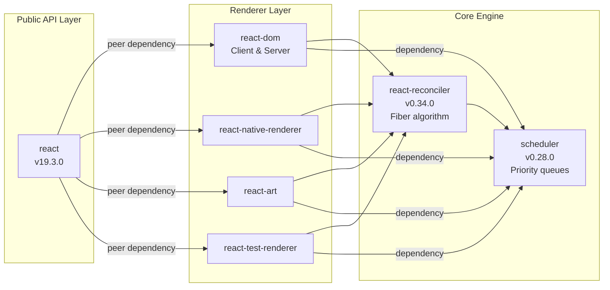
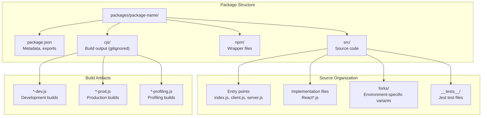
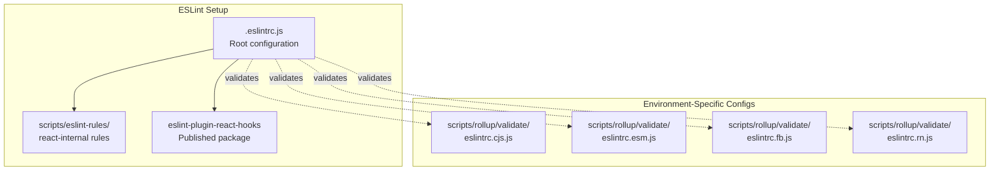
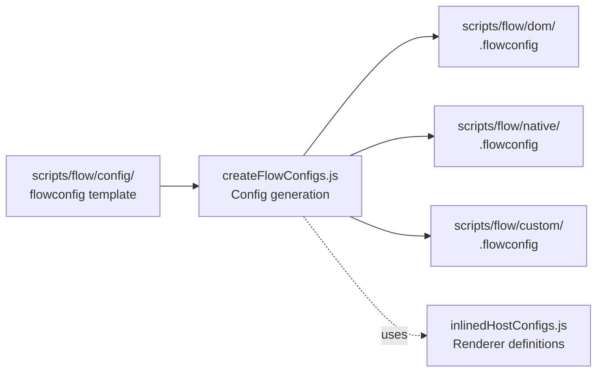
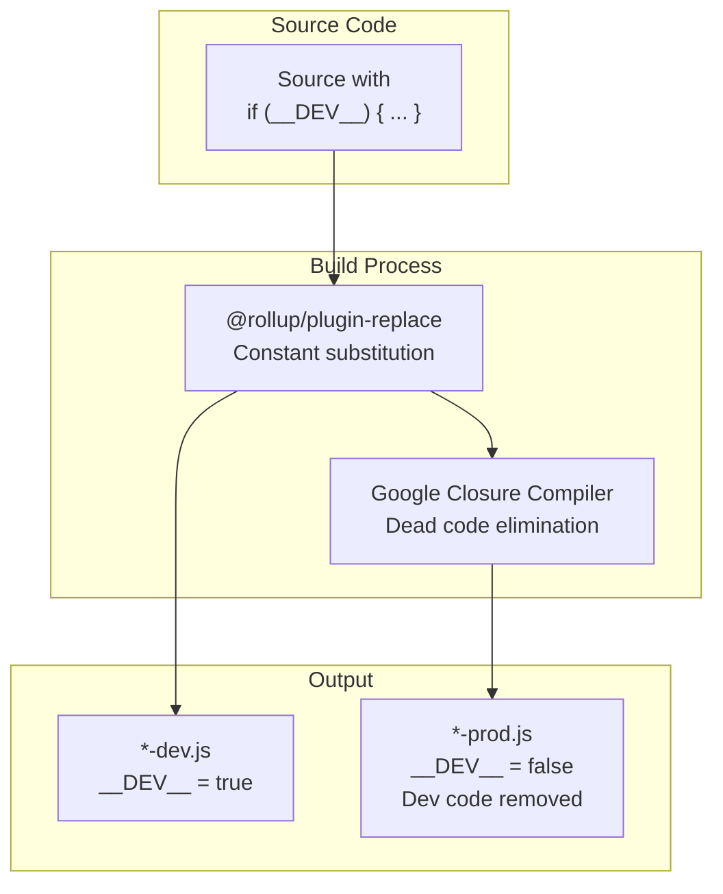
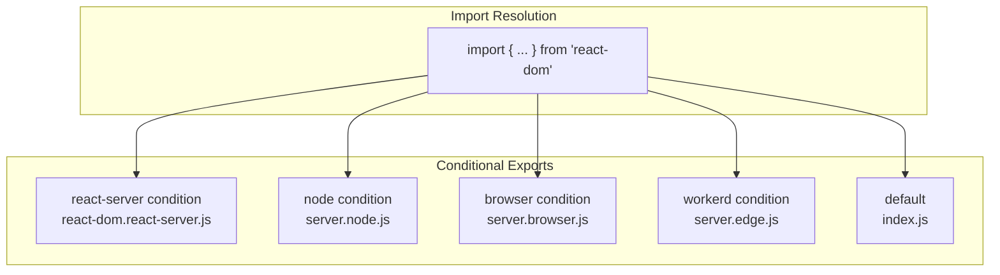

# 概述

<!-- > 来源：https://deepwiki.com/facebook/react/1-overview -->

相关源文件

以下文件用于生成此 wiki 页面的上下文：

- [.eslintrc.js](.eslintrc.js)
- [package.json](package.json)
- [packages/eslint-plugin-react-hooks/package.json](packages/eslint-plugin-react-hooks/package.json)
- [packages/jest-react/package.json](packages/jest-react/package.json)
- [packages/react-art/package.json](packages/react-art/package.json)
- [packages/react-dom/package.json](packages/react-dom/package.json)
- [packages/react-is/package.json](packages/react-is/package.json)
- [packages/react-native-renderer/package.json](packages/react-native-renderer/package.json)
- [packages/react-noop-renderer/package.json](packages/react-noop-renderer/package.json)
- [packages/react-reconciler/package.json](packages/react-reconciler/package.json)
- [packages/react-test-renderer/package.json](packages/react-test-renderer/package.json)
- [packages/react/package.json](packages/react/package.json)
- [packages/scheduler/package.json](packages/scheduler/package.json)
- [packages/shared/ReactVersion.js](packages/shared/ReactVersion.js)
- [scripts/flow/config/flowconfig](scripts/flow/config/flowconfig)
- [scripts/flow/createFlowConfigs.js](scripts/flow/createFlowConfigs.js)
- [scripts/flow/environment.js](scripts/flow/environment.js)
- [scripts/rollup/validate/eslintrc.cjs.js](scripts/rollup/validate/eslintrc.cjs.js)
- [scripts/rollup/validate/eslintrc.cjs2015.js](scripts/rollup/validate/eslintrc.cjs2015.js)
- [scripts/rollup/validate/eslintrc.esm.js](scripts/rollup/validate/eslintrc.esm.js)
- [scripts/rollup/validate/eslintrc.fb.js](scripts/rollup/validate/eslintrc.fb.js)
- [scripts/rollup/validate/eslintrc.rn.js](scripts/rollup/validate/eslintrc.rn.js)
- [yarn.lock](yarn.lock)

## 目的与范围

位于 https://github.com/facebook/react 的 React 仓库是一个 monorepo，包含 React 的实现。React 是一个用于构建用户界面的 JavaScript 库。该仓库包含：

- 核心 `react` 包，提供公共 API（Hooks、组件、JSX 运行时）
- 面向不同平台的多个渲染器实现（DOM、Native、测试环境）
- `react-reconciler` 包，实现 Fiber 架构
- 服务端渲染系统（Fizz 用于 HTML 流式传输，Flight 用于 Server Components）
- `scheduler` 包，用于协作式任务调度
- 构建工具、特性标志和开发工具

本文档提供仓库结构和主要系统的高级概述。有关特定子系统的详细信息，请参阅：

- 特性标志管理：[特性标志系统](#2)
- 构建与打包：[构建系统与包分发](#3)
- 核心协调算法：[React Reconciler](#4)
- 服务端渲染：[服务端渲染](#5)
- 平台实现：[平台实现](#6)
- 开发工具：[开发工具与调试](#7)

---

## 仓库结构

React 仓库采用 **Yarn workspaces** monorepo 结构，在 `packages/` 目录下包含 13 个包。根目录的 [package.json:3-5]() 定义了工作区配置。

```mermaid
graph TB
    subgraph "Monorepo Root"
        Root[react repository]
        PackageJSON["package.json<br/>Workspace configuration"]
        Scripts["scripts/<br/>Build & tooling"]
    end

    subgraph "packages/ Directory"
        React["react<br/>Core API"]
        ReactDOM["react-dom<br/>DOM renderer"]
        Reconciler["react-reconciler<br/>Fiber algorithm"]
        Scheduler["scheduler<br/>Task scheduling"]
        ReactNative["react-native-renderer<br/>Native platform"]
        ReactArt["react-art<br/>Canvas/SVG renderer"]
        TestRenderer["react-test-renderer<br/>Testing utilities"]
        NoopRenderer["react-noop-renderer<br/>Test infrastructure"]
        ReactIs["react-is<br/>Type checks"]
        DevTools["react-devtools-*<br/>Debugging tools"]
        ESLintPlugin["eslint-plugin-react-hooks<br/>Linting rules"]
        JestReact["jest-react<br/>Test matchers"]
        ServerPackages["react-server-dom-*<br/>Server Components"]
    end

    Root --> PackageJSON
    Root --> Scripts
    Root --> React
    Root --> ReactDOM
    Root --> Reconciler
    Root --> Scheduler
    Root --> ReactNative
    Root --> ReactArt
    Root --> TestRenderer
    Root --> NoopRenderer
    Root --> ReactIs
    Root --> DevTools
    Root --> ESLintPlugin
    Root --> JestReact
    Root --> ServerPackages
```

**来源：** [package.json:1-5](), [packages/react/package.json:1-7](), [packages/react-dom/package.json:1-10](), [packages/react-reconciler/package.json:1-10]()

---

## 包分类与依赖关系

仓库中的包按功能类别组织：

| 类别              | 包                                                         | 用途                                                               |
| ----------------- | ---------------------------------------------------------- | ------------------------------------------------------------------ |
| **核心 API**      | `react`                                                    | 面向公众的 React API、Hooks（`useState`、`useEffect`）、JSX 运行时 |
| **Reconciler**    | `react-reconciler`                                         | Fiber 协调算法、工作循环、调度                                     |
| **DOM 渲染器**    | `react-dom`                                                | 浏览器 DOM 操作、事件系统、Hydration                               |
| **Native 渲染器** | `react-native-renderer`                                    | React Native 平台集成                                              |
| **Scheduler**     | `scheduler`                                                | 基于优先级队列的协作式任务调度                                     |
| **服务端渲染**    | `react-dom`（服务端导出）、`react-server-dom-*`            | Fizz（流式 HTML）、Flight（Server Components）                     |
| **测试基础设施**  | `react-test-renderer`、`react-noop-renderer`、`jest-react` | 测试工具和测试环境                                                 |
| **开发工具**      | `react-devtools-*`、`react-debug-tools`                    | 浏览器扩展、组件检查                                               |
| **工具库**        | `react-is`、`react-art`                                    | 类型检查、Canvas/SVG 渲染                                          |
| **代码检查**      | `eslint-plugin-react-hooks`                                | Hooks 规则强制执行                                                 |

**来源：** [packages/react/package.json:1-52](), [packages/react-dom/package.json:19-21](), [packages/react-reconciler/package.json:28-33](), [packages/scheduler/package.json:1-27]()

---

## 主要系统组件

React 代码库围绕多个相互关联的系统组织：

### 特性标志系统

**特性标志**系统（`ReactFeatureFlags.js` 及环境特定的分支）控制在不同部署目标（Facebook web、React Native FB、React Native OSS、测试环境）中启用哪些特性。这是重要性最高的系统（重要性评分：820.92），因为它影响所有其他包。

详细文档请参阅[特性标志系统](#2)。

### 构建系统

**构建系统**使用 **Rollup** 生成多种模块格式（CommonJS、ESM）和环境（Node.js、浏览器、Bun、React Native）的打包产物。构建通过以下方式配置：

- `scripts/rollup/build-all-release-channels.js` - 主构建编排器
- `scripts/rollup/bundles.js` - 打包定义（重要性：365.86）
- `scripts/rollup/forks.js` - 模块替换配置
- `scripts/shared/inlinedHostConfigs.js` - 渲染器配置（重要性：317.91）

详细文档请参阅[构建系统与包分发](#3)。

### Fiber Reconciler

**Fiber Reconciler**（`react-reconciler` 包）实现 React 的核心渲染算法。它管理：

- Virtual DOM 差异比较和更新
- 可中断渲染的工作循环
- 基于 Lane 的优先级调度
- Suspense 和错误边界
- 用于平台独立性的 Host 配置抽象

详细文档请参阅[React Reconciler](#4)。

### 服务端渲染

React 提供两个服务端渲染系统：

- **Fizz**（`ReactFizzServer`）- 支持 Suspense 的流式 HTML
- **Flight**（`ReactFlightServer`）- 使用 RSC 协议的 Server Components

详细文档请参阅[服务端渲染](#5)。

### 开发工具

**React DevTools** 系统通过浏览器扩展和独立应用程序提供组件检查、性能分析和调试功能。DevTools 后端通过 `__REACT_DEVTOOLS_GLOBAL_HOOK__` 挂接到 React 渲染器。

详细文档请参阅[开发工具与调试](#7)。

**来源：** [scripts/rollup/build-all-release-channels.js](), [scripts/shared/inlinedHostConfigs.js](), [packages/react-reconciler/package.json:1-34]()

---

## 代码组织与文件结构

仓库在各包之间遵循一致的结构：

**关键约定：**

1. **入口点**遵循命名约定：
   - `index.js` - 主入口点
   - `client.js` - 仅客户端代码
   - `server.js`、`server.node.js`、`server.browser.js` - 服务端渲染变体
   - `*.react-server.js` - Server Components 环境

2. **Fork 文件**支持环境特定的实现：
   - `ReactFeatureFlags.www.js` - Facebook web
   - `ReactFeatureFlags.native-fb.js` - React Native FB
   - `ReactFeatureFlags.native-oss.js` - React Native OSS
   - `ReactFiberConfig.dom.js`、`ReactFiberConfig.native.js` - Host 配置

3. **共享代码**位于 `packages/shared/`：
   - `ReactVersion.js` - 当前版本字符串
   - `ReactSymbols.js` - 内部符号
   - 各种工具模块

**来源：** [packages/react-dom/package.json:51-126](), [packages/react/package.json:11-42](), [packages/shared/ReactVersion.js:1-16]()

---

## 开发工具与配置

### ESLint 配置

仓库使用包含自定义规则的全面 ESLint 配置：

**自定义规则包括：**

- `react-internal/prod-error-codes` - 强制错误代码提取
- `react-internal/warning-args` - 验证警告消息字面量
- `react-internal/safe-string-coercion` - 类型安全的字符串转换
- `react-internal/no-production-logging` - 在生产环境中移除 console 调用
- `no-for-of-loops` - 避免 Symbol polyfill 需求

**来源：** [.eslintrc.js:1-658](), [scripts/rollup/validate/eslintrc.cjs.js:1-112](), [packages/eslint-plugin-react-hooks/package.json:1-68]()

### Flow 类型检查

仓库使用 **Flow** 进行类型检查，通过 `scripts/flow/createFlowConfigs.js` 生成环境特定的配置。该脚本为每个渲染器创建独立的 `.flowconfig` 文件，以处理带有分支实现的模块解析。

**来源：** [scripts/flow/createFlowConfigs.js:1-153](), [scripts/flow/config/flowconfig:1-45](), [scripts/flow/environment.js:1-636]()

### 测试基础设施

仓库使用 **Jest** 进行测试，并提供自定义匹配器和工具：

- `jest-react` 包为 React 特定的断言提供自定义匹配器
- `react-test-renderer` 支持无需 DOM 的快照测试
- `react-noop-renderer` 为 reconciler 测试提供仅用于测试的渲染器
- `internal-test-utils` 包含共享测试辅助函数

测试文件遵循 `**/__tests__/**/*.js` 模式，并在生产构建中排除。

**来源：** [package.json:121-123](), [packages/jest-react/package.json:1-32](), [packages/react-test-renderer/package.json:1-35](), [packages/react-noop-renderer/package.json:1-32]()

---

## 构建常量与全局变量

React 使用多个在构建时替换的全局常量：

| 常量               | 用途                   | 设置方式            |
| ------------------ | ---------------------- | ------------------- |
| `__DEV__`          | 开发模式标志           | Rollup replace 插件 |
| `__PROFILE__`      | 性能分析构建标志       | 构建配置            |
| `__EXPERIMENTAL__` | 实验性特性标志         | 发布渠道            |
| `__VARIANT__`      | A/B 测试变体（仅 www） | 动态加载            |
| `__TEST__`         | 测试环境标志           | Jest 配置           |

这些常量在生产构建期间启用**死代码消除**，显著减少打包体积。

**来源：** [scripts/flow/environment.js:12-14](), [scripts/rollup/validate/eslintrc.cjs.js:43-60](), [.eslintrc.js:639-648]()

---

## 包导出策略

React 包在 `package.json` 中使用**条件导出**，为不同环境提供不同的入口点：

[packages/react-dom/package.json:51-126]() 中的 `exports` 字段展示了此模式：

- `react-server` 条件提供与 Server Components 兼容的导出
- `node`、`browser`、`workerd`、`deno`、`bun` 条件选择运行时特定的代码
- `default` 为其他环境提供回退

**来源：** [packages/react-dom/package.json:51-126](), [packages/react/package.json:24-42]()

---

## 版本与发布管理

仓库在多个位置维护版本信息：

1. **单一数据源：** [packages/shared/ReactVersion.js:15]() 导出当前版本字符串（`'19.3.0'`）
2. **包清单：** 每个 `package.json` 声明其版本
3. **依赖版本：** Peer 依赖和常规依赖指定版本范围

版本策略遵循语义化版本：

- `react` 和 `react-dom` 共享相同的主版本.次版本.补丁版本
- `react-reconciler` 使用独立版本（`0.34.0`）
- `scheduler` 具有独立版本（`0.28.0`）

**来源：** [packages/shared/ReactVersion.js:1-16](), [packages/react/package.json:7](), [packages/react-dom/package.json:3](), [packages/react-reconciler/package.json:4](), [packages/scheduler/package.json:3]()
