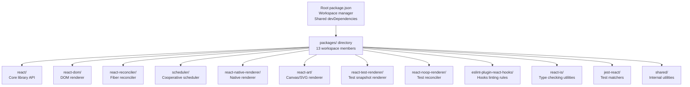
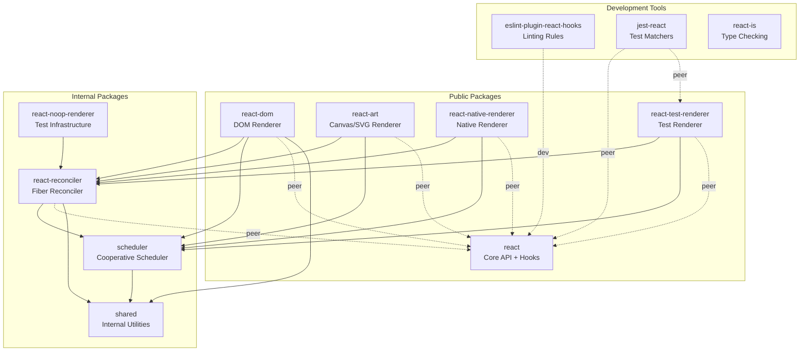
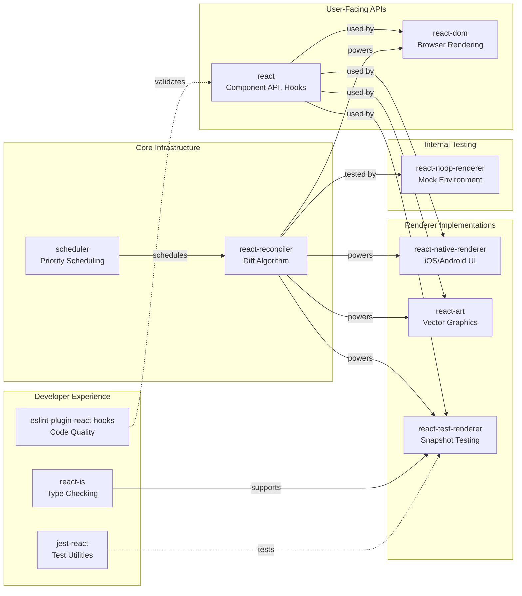
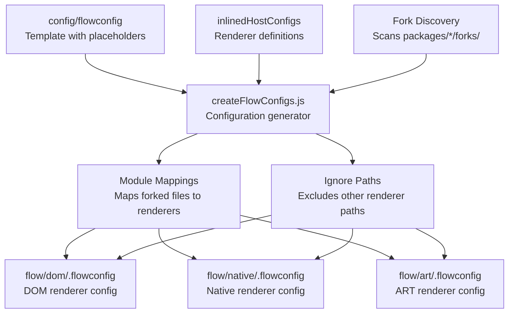

# 仓库结构与包管理

<!-- > 来源：https://deepwiki.com/facebook/react/1.1-repository-structure-and-packages -->

<details>
<summary>相关源文件</summary>

以下文件用于生成此 wiki 页面的上下文：

- [.eslintrc.js](.eslintrc.js)
- [package.json](package.json)
- [packages/eslint-plugin-react-hooks/package.json](https://github.com/facebook/react/blob/main/packages/eslint-plugin-react-hooks/package.json)
- [packages/jest-react/package.json](https://github.com/facebook/react/blob/main/packages/jest-react/package.json)
- [packages/react-art/package.json](https://github.com/facebook/react/blob/main/packages/react-art/package.json)
- [packages/react-dom/package.json](https://github.com/facebook/react/blob/main/packages/react-dom/package.json)
- [packages/react-is/package.json](https://github.com/facebook/react/blob/main/packages/react-is/package.json)
- [packages/react-native-renderer/package.json](https://github.com/facebook/react/blob/main/packages/react-native-renderer/package.json)
- [packages/react-noop-renderer/package.json](https://github.com/facebook/react/blob/main/packages/react-noop-renderer/package.json)
- [packages/react-reconciler/package.json](https://github.com/facebook/react/blob/main/packages/react-reconciler/package.json)
- [packages/react-test-renderer/package.json](https://github.com/facebook/react/blob/main/packages/react-test-renderer/package.json)
- [packages/react/package.json](https://github.com/facebook/react/blob/main/packages/react/package.json)
- [packages/scheduler/package.json](https://github.com/facebook/react/blob/main/packages/scheduler/package.json)
- [packages/shared/ReactVersion.js](https://github.com/facebook/react/blob/main/packages/shared/ReactVersion.js)
- [scripts/flow/config/flowconfig](scripts/flow/config/flowconfig)
- [scripts/flow/createFlowConfigs.js](scripts/flow/createFlowConfigs.js)
- [scripts/flow/environment.js](scripts/flow/environment.js)
- [scripts/rollup/validate/eslintrc.cjs.js](scripts/rollup/validate/eslintrc.cjs.js)
- [scripts/rollup/validate/eslintrc.cjs2015.js](scripts/rollup/validate/eslintrc.cjs2015.js)
- [scripts/rollup/validate/eslintrc.esm.js](scripts/rollup/validate/eslintrc.esm.js)
- [scripts/rollup/validate/eslintrc.fb.js](scripts/rollup/validate/eslintrc.fb.js)
- [scripts/rollup/validate/eslintrc.rn.js](scripts/rollup/validate/eslintrc.rn.js)
- [yarn.lock](yarn.lock)

</details>


## 目的与范围

本文档描述了 React monorepo 的组织结构，详细说明了包在 Yarn workspaces 中的排列方式、它们之间的相互依赖关系以及各自的具体用途。文档涵盖核心库包、平台特定的渲染器、服务端渲染包以及开发工具包。

关于处理这些包的构建系统信息，请参阅[构建系统与包分发](/3-build-system-and-package-distribution)。关于影响不同环境下包行为的特性标志配置详情，请参阅[特性标志系统](/2-feature-flags-system)。

---

## Monorepo Workspace 结构

React 仓库采用 Yarn monorepo 结构，使用 workspaces 进行组织。根目录的 [`package.json:3-4`]() 声明了单个 workspace 模式：

```json
"workspaces": [
  "packages/*"
]
```

所有可发布和内部包都位于 `packages/` 目录下。workspace 配置允许包在开发过程中使用符号链接相互引用，同时为单独发布维护各自的 `package.json` 文件。

### Workspace 配置图



**来源：** [`package.json:1-164`](), [`packages/react/package.json`](), [`packages/react-dom/package.json`]()

---

## 核心库包

### react

`react` 包提供了构建用户界面的基础 API，包括：
- 组件基类和 Hooks API
- JSX 转换运行时（`jsx-runtime.js`、`jsx-dev-runtime.js`）
- React Server Components 支持（`react.react-server.js`）
- Compiler 运行时支持（`compiler-runtime.js`）

**包配置：**

| 属性 | 值 |
|----------|-------|
| 主入口 | `index.js` |
| 版本 | `19.3.0` |
| Peer Dependencies | 无（提供基础 API） |

该包通过 [`packages/react/package.json:24-42`]() 中的 `exports` 字段导出多个入口点：
- `.` - 主 React API，包含条件性的 `react-server` 导出
- `./jsx-runtime` - JSX 转换运行时
- `./jsx-dev-runtime` - 开发环境 JSX 运行时（带调试功能）
- `./compiler-runtime` - React Compiler 支持函数

**来源：** [`packages/react/package.json:1-52`](), [`packages/shared/ReactVersion.js:15`]()

### react-dom

`react-dom` 包实现了 DOM 渲染器，提供了大量平台特定的入口点：

**客户端渲染：**
- `client.js` - 使用 `createRoot` 的现代客户端入口
- `index.js` - 传统和兼容性入口

**服务端渲染：**
- `server.node.js` - Node.js 流式 SSR
- `server.browser.js` - 浏览器兼容的 SSR
- `server.edge.js` - Edge 运行时 SSR
- `server.bun.js` - Bun 运行时 SSR
- `static.node.js` - Node.js 静态预渲染
- `static.browser.js` - 浏览器静态预渲染
- `static.edge.js` - Edge 运行时静态预渲染

**测试工具：**
- `test-utils.js` - DOM 测试辅助函数
- `unstable_testing.js` - 实验性测试 API

该包使用条件导出，根据运行时环境选择相应的实现。从 [`packages/react-dom/package.json:51-125`]() 可以看出，导出使用诸如 `react-server`、`workerd`、`bun`、`deno`、`worker`、`node`、`edge-light` 和 `browser` 等条件。

**依赖：**

| 依赖 | 类型 | 版本 |
|------------|------|---------|
| `scheduler` | Dependency | `^0.28.0` |
| `react` | Peer Dependency | `^19.3.0` |

**来源：** [`packages/react-dom/package.json:1-127`]()

### react-reconciler

`react-reconciler` 包将 Fiber reconciler 作为独立 API 暴露，用于构建自定义渲染器。它实现了所有 React 渲染器使用的核心协调算法。

**入口点：**
- `index.js` - 主 reconciler API
- `constants.js` - Fiber 相关常量
- `reflection.js` - Reconciler 反射工具

该包被 `react-dom`、`react-native-renderer`、`react-test-renderer` 和 `react-art` 内部使用。它提供了一个主机配置接口，渲染器必须实现该接口才能与 reconciler 集成。

**依赖：**

| 依赖 | 类型 | 版本 |
|------------|------|---------|
| `scheduler` | Dependency | `^0.28.0` |
| `react` | Peer Dependency | `^19.3.0` |

**来源：** [`packages/react-reconciler/package.json:1-34`]()

### scheduler

`scheduler` 包提供了协作式调度原语，供 reconciler 用于优先化和时间切片工作：

**入口点：**
- `index.js` - 主 Scheduler API
- `index.native.js` - React Native 特定实现
- `unstable_mock.js` - 用于测试的确定性 mock
- `unstable_post_task.js` - 浏览器 Scheduler API 集成

Scheduler 管理优先级队列，并使用 `MessageChannel` 或其他 API 在工作单元之间将控制权交还给浏览器。

**来源：** [`packages/scheduler/package.json:1-27`]()

---

## 包依赖关系图



**来源：** [`packages/react-dom/package.json:19-21`](), [`packages/react-reconciler/package.json:28-33`](), [`packages/react-test-renderer/package.json:21-26`]()

---

## 渲染器包

### react-native-renderer

一个内部包（不发布到 npm），实现了 React Native 环境的 React 渲染器。它同时支持传统架构和 Fabric 架构。

**配置：**

| 属性 | 值 |
|----------|-------|
| 版本 | `16.0.0`（内部） |
| Private | `true` |
| Dependencies | `scheduler: ^0.28.0` |
| Peer Dependencies | `react: ^18.0.0` |

该包通过全局变量控制平台特定行为：
- `nativeFabricUIManager` - Fabric UI 管理器接口
- `RN$enableMicrotasksInReact` - 微任务调度标志

**来源：** [`packages/react-native-renderer/package.json:1-16`](), [`.eslintrc.js:462-467`]()

### react-art

`react-art` 包提供了使用 ART 库的矢量图形渲染器，支持 Canvas、SVG 和 VML（用于 IE8）输出。

**公共导出：**
- `index.js` - 主 ART 渲染器
- `Circle.js` - 圆形组件
- `Rectangle.js` - 矩形组件
- `Wedge.js` - 楔形/弧形组件

**依赖：**

| 依赖 | 类型 | 版本 |
|------------|------|---------|
| `art` | Dependency | `^0.10.1` |
| `create-react-class` | Dependency | `^15.6.2` |
| `scheduler` | Dependency | `^0.28.0` |
| `react` | Peer Dependency | `^19.3.0` |

**来源：** [`packages/react-art/package.json:1-41`]()

### react-test-renderer

一个专门用于快照测试的渲染器，将 React 组件渲染为纯 JavaScript 对象，无需 DOM。

**入口点：**
- `index.js` - 主测试渲染器
- `shallow.js` - 浅渲染工具

**依赖：**

| 依赖 | 类型 | 版本 |
|------------|------|---------|
| `react-is` | Dependency | `^19.3.0` |
| `scheduler` | Dependency | `^0.28.0` |
| `react` | Peer Dependency | `^19.3.0` |

**来源：** [`packages/react-test-renderer/package.json:1-35`]()

### react-noop-renderer

一个内部测试包，提供 mock 实现，用于在没有真实主机环境的情况下测试 Fiber reconciler、Fizz 服务端渲染器和 Flight 协议。

**入口点：**
- `index.js` - 客户端 noop 渲染器
- `persistent.js` - 持久模式 noop 渲染器
- `server.js` - Noop 服务端渲染器
- `flight-client.js` - Flight 客户端实现
- `flight-server.js` - Flight 服务端实现
- `flight-modules.js` - Flight 模块系统

该包标记为 `private: true`，并依赖内部包：
- `react-reconciler`
- `react-client`
- `react-server`

**来源：** [`packages/react-noop-renderer/package.json:1-32`]()

---

## 开发工具包

### eslint-plugin-react-hooks

一个 ESLint 插件，强制执行 Hooks 规则，并为 React Hooks 使用模式提供代码检查。

**关键特性：**
- 强制执行 Hook 调用顺序和条件使用限制
- 验证 effect hooks 的完整依赖项
- 包含 TypeScript 类型定义（`index.d.ts`）

**构建过程：**
该插件包含一个构建步骤，用于编译 React Compiler：
```json
"scripts": {
  "build:compiler": "cd ../../compiler && yarn workspace babel-plugin-react-compiler build",
  "test": "yarn build:compiler && jest"
}
```

**依赖：**

| 依赖 | 用途 |
|------------|---------|
| `@babel/core` | AST 解析和遍历 |
| `@babel/parser` | JavaScript/TypeScript 解析 |
| `hermes-parser` | Flow 的替代解析器 |
| `zod` | 配置模式验证 |

**Peer Dependencies：**
- ESLint 版本 3.x 至 9.x

**来源：** [`packages/eslint-plugin-react-hooks/package.json:1-68`]()

### react-is

一个用于检查 React 元素类型并确定值所表示元素类型的工具包。

**包配置：**

| 属性 | 值 |
|----------|-------|
| 版本 | `19.3.0` |
| Side Effects | `false`（可 tree-shake） |
| 主入口 | `index.js` |

该包被 `react-test-renderer` 和其他工具内部使用，用于在不依赖完整 React 包的情况下识别元素类型。

**来源：** [`packages/react-is/package.json:1-26`]()

### jest-react

提供专门为测试 React 组件设计的 Jest matchers 和工具。

**Peer Dependencies：**

| 依赖 | 支持的版本 |
|------------|-------------------|
| `jest` | 23.x - 29.x |
| `react` | `^19.0.0` |
| `react-test-renderer` | `^19.0.0` |

**来源：** [`packages/jest-react/package.json:1-32`]()

---

## 按用途分类的包组织



**来源：** [`package.json:1-164`](), [`packages/react/package.json`](), [`packages/react-reconciler/package.json`]()

---

## 构建系统配置

### 共享开发依赖

根目录的 [`package.json:6-120`]() 声明了所有包使用的开发依赖：

**构建工具：**
- `rollup: ^3.29.5` - 模块打包器
- `@rollup/plugin-babel: ^6.0.3` - Babel 集成
- `@rollup/plugin-commonjs: ^24.0.1` - CommonJS 模块支持
- `@rollup/plugin-typescript: ^12.1.2` - TypeScript 支持
- `google-closure-compiler: ^20230206.0.0` - 高级优化

**转译：**
- `@babel/core: ^7.11.1` - Babel 编译器核心
- `flow-bin: ^0.279.0` - Flow 类型检查器
- `typescript: ^5.4.3` - TypeScript 编译器

**测试：**
- `jest: ^29.4.2` - 测试框架
- `jest-environment-jsdom: ^29.4.2` - DOM 环境
- `@types/eslint: ^9.6.1` - TypeScript 定义

**代码检查：**
- `eslint: ^7.7.0` - 代码检查器
- `prettier: ^3.3.3` - 代码格式化工具

**来源：** [`package.json:6-120`]()

### 构建脚本

根包在 [`package.json:124-157`]() 中定义了多个构建脚本：

| 脚本 | 用途 |
|--------|---------|
| `build` | 为所有发布渠道构建所有包 |
| `build-for-devtools` | 为 DevTools 构建实验性包 |
| `build-for-flight-dev` | 为开发环境构建 Server Components 包 |
| `lint` | 在所有包上运行 ESLint |
| `test` | 运行 Jest 测试 |
| `test-stable` | 针对稳定发布渠道运行测试 |
| `test-www` | 运行 Facebook www 环境的测试 |

**来源：** [`package.json:124-157`]()

---

## Flow 类型配置

仓库使用 Flow 进行类型检查，为不同的渲染器环境提供多个配置。脚本 [`scripts/flow/createFlowConfigs.js:1-153`]() 生成特定环境的 `.flowconfig` 文件。

### Flow 配置生成



配置生成过程：
1. 从 [`scripts/flow/config/flowconfig:1-45`]() 读取模板
2. 发现 `packages/*/forks/` 目录中的所有分叉文件
3. 将分叉实现映射到特定渲染器（例如，`ReactFiberConfig.dom.js`）
4. 为其他渲染器的代码路径生成忽略模式
5. 为每个渲染器写入单独的 `.flowconfig` 文件

**关键分叉文件：**
- `ReactFiberConfig` - Reconciler 主机配置
- `ReactServerStreamConfig` - 服务端流式配置
- `ReactFizzConfig` - HTML 流式配置
- `ReactFlightServerConfig` - Server Components 配置
- `ReactFlightClientConfig` - Server Components 客户端配置

**来源：** [`scripts/flow/createFlowConfigs.js:1-153`](), [`scripts/flow/config/flowconfig:1-45`]()

---

## 按环境的 ESLint 配置

仓库为不同的输出目标使用不同的 ESLint 配置，定义在 [`scripts/rollup/validate/`]()：

### ESLint 配置矩阵

| 配置 | 解析器 | ECMAVersion | Source Type | 用途 |
|---------------|--------|-------------|-------------|---------|
| `eslintrc.cjs.js` | `espree` | 2020 | `script` | CommonJS 构建 |
| `eslintrc.cjs2015.js` | `espree` | 2015 | `script` | ES2015 CommonJS 构建 |
| `eslintrc.esm.js` | `espree` | 2020 | `module` | ES Module 构建 |
| `eslintrc.fb.js` | `espree` | 5 | `script` | Facebook 内部构建 |
| `eslintrc.rn.js` | `espree` | 5 | `script` | React Native 构建 |

每个配置声明特定环境的全局变量。例如，[`scripts/rollup/validate/eslintrc.fb.js:8-70`]() 包括：
- ES6+ 全局变量：`Map`、`Set`、`Symbol`、`Proxy`、`WeakRef`
- 类型化数组：`Int8Array`、`Uint8Array` 等
- 平台特定：`__DEV__`、`trustedTypes`、`AsyncLocalStorage`

**来源：** [`scripts/rollup/validate/eslintrc.cjs.js:1-112`](), [`scripts/rollup/validate/eslintrc.fb.js:1-96`](), [`scripts/rollup/validate/eslintrc.rn.js:1-98`]()

---

## 包管理器配置

仓库使用 Yarn 1.x，在 [`package.json:163`]() 中指定：

```json
"packageManager": "yarn@1.22.22"
```

### Yarn Resolutions

仓库通过 [`package.json:159-162`]() 中的 resolutions 覆盖特定的传递依赖：

```json
"resolutions": {
  "react-is": "npm:react-is",
  "jsdom": "22.1.0"
}
```

这确保了所有包中 `react-is` 的版本一致性，并将 `jsdom` 固定到特定版本以保证测试稳定性。

**来源：** [`package.json:159-164`]()

---

## 关键包总结

| 包 | 类型 | 用途 | 是否导出 |
|---------|------|---------|----------|
| `react` | Core | 公共组件 API 和 hooks | 是 |
| `react-dom` | Renderer | 支持 SSR 的 DOM 渲染 | 是 |
| `react-reconciler` | Infrastructure | 用于自定义渲染器的 Fiber reconciler | 是 |
| `scheduler` | Infrastructure | 协作式调度原语 | 是 |
| `react-native-renderer` | Renderer | React Native 平台渲染器 | 否（内部） |
| `react-art` | Renderer | Canvas/SVG 矢量图形 | 是 |
| `react-test-renderer` | Testing | 无需 DOM 的快照测试 | 是 |
| `react-noop-renderer` | Testing | 用于内部测试的 mock 渲染器 | 否（内部） |
| `eslint-plugin-react-hooks` | Tooling | Hooks 代码检查规则 | 是 |
| `react-is` | Utility | 元素类型检查 | 是 |
| `jest-react` | Testing | React 的 Jest matchers | 是 |
| `shared` | Infrastructure | 内部共享工具 | 否（内部） |

**来源：** 本文档中引用的所有 package.json 文件
