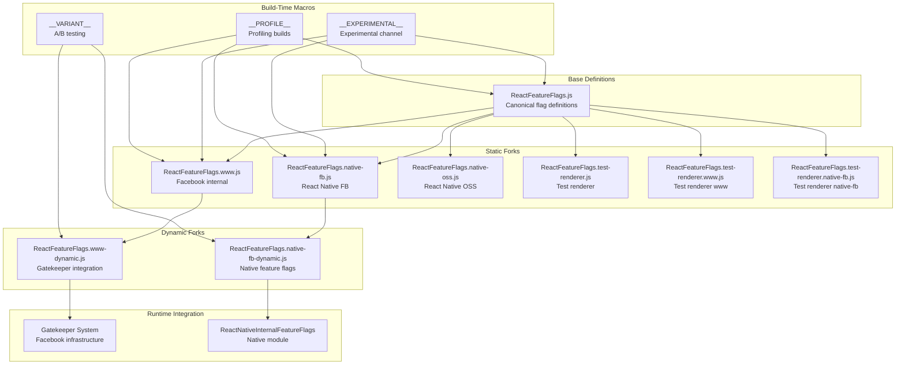
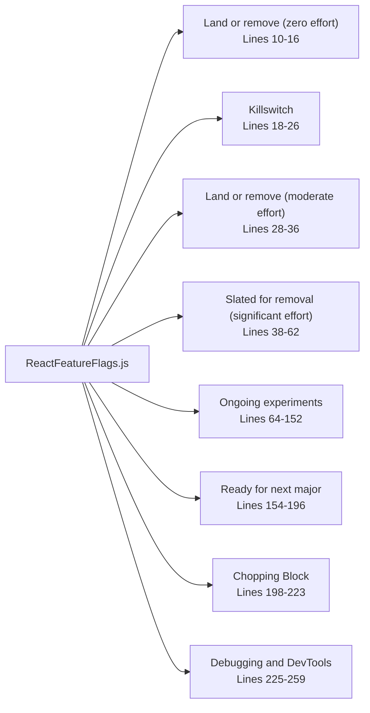
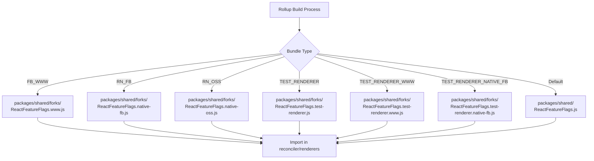
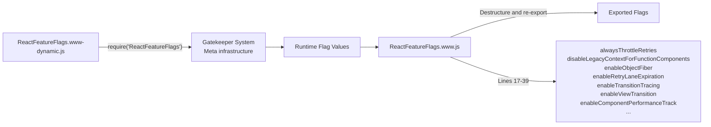
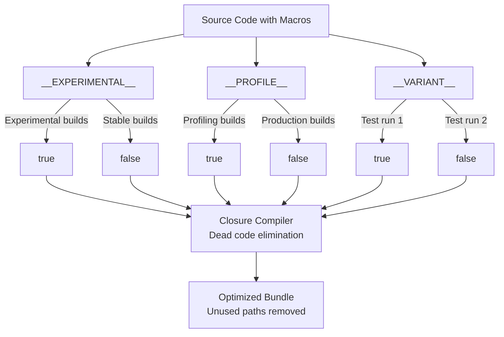
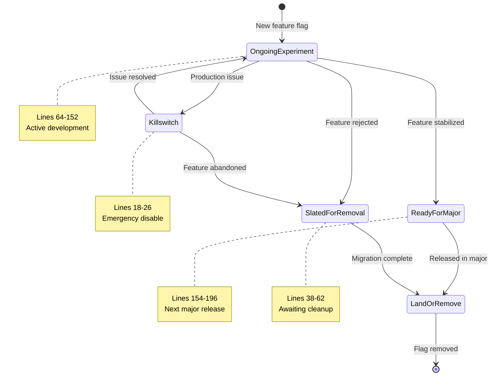
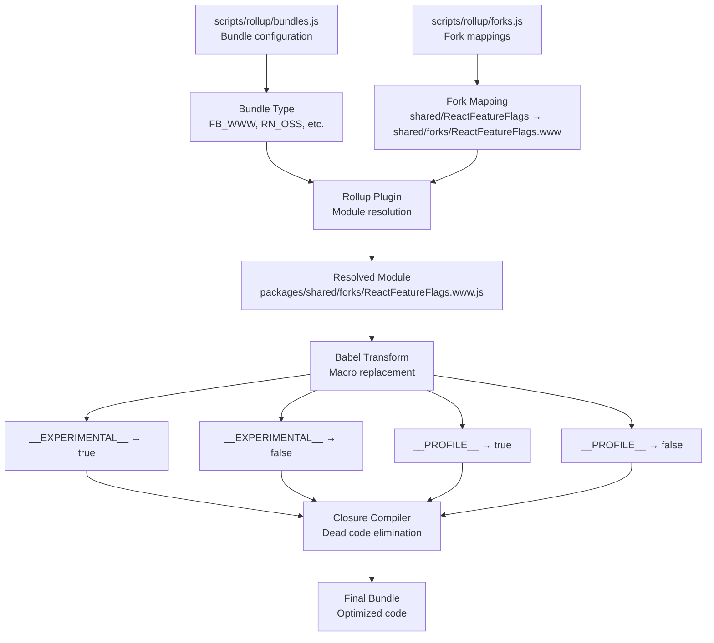

# Feature Flags 系统

<!-- > 来源：https://deepwiki.com/facebook/react/2-feature-flags-system -->

<details>
<summary>相关源文件</summary>

以下文件被用作生成此 wiki 页面的上下文：

- [packages/shared/ReactFeatureFlags.js](packages/shared/ReactFeatureFlags.js)
- [packages/shared/forks/ReactFeatureFlags.native-fb-dynamic.js](packages/shared/forks/ReactFeatureFlags.native-fb-dynamic.js)
- [packages/shared/forks/ReactFeatureFlags.native-fb.js](packages/shared/forks/ReactFeatureFlags.native-fb.js)
- [packages/shared/forks/ReactFeatureFlags.native-oss.js](packages/shared/forks/ReactFeatureFlags.native-oss.js)
- [packages/shared/forks/ReactFeatureFlags.test-renderer.js](packages/shared/forks/ReactFeatureFlags.test-renderer.js)
- [packages/shared/forks/ReactFeatureFlags.test-renderer.native-fb.js](packages/shared/forks/ReactFeatureFlags.test-renderer.native-fb.js)
- [packages/shared/forks/ReactFeatureFlags.test-renderer.www.js](packages/shared/forks/ReactFeatureFlags.test-renderer.www.js)
- [packages/shared/forks/ReactFeatureFlags.www-dynamic.js](packages/shared/forks/ReactFeatureFlags.www-dynamic.js)
- [packages/shared/forks/ReactFeatureFlags.www.js](packages/shared/forks/ReactFeatureFlags.www.js)
- [scripts/flow/xplat.js](scripts/flow/xplat.js)

</details>


## 目的与范围

Feature Flags 系统是 React 用于控制实验性功能、平台特定行为以及在不同环境和发布渠道中逐步推出功能的综合机制。它使得同一代码库能够针对 Facebook 内部基础设施（www）、React Native Facebook 内部版本（native-fb）、React Native 开源版本（native-oss）和测试渲染器编译出不同的行为，同时支持 A/B 测试和生产环境中可运行时控制的标志。

本文档涵盖标志定义结构、分叉机制、动态标志集成、构建时宏和标志生命周期管理。关于构建系统如何处理这些标志的信息，请参阅[构建系统与包分发](#3)。关于标志如何影响协调器行为的信息，请参阅[React Reconciler](#4)。

## 系统架构

Feature Flags 系统采用基础定义文件配合环境特定分叉的结构，分叉会覆盖默认值。系统同时支持静态标志（在构建时确定）和动态标志（可通过 gatekeeper 或功能管理系统在运行时控制）。



**来源：** [packages/shared/ReactFeatureFlags.js:1-259](), [packages/shared/forks/ReactFeatureFlags.www.js:1-121](), [packages/shared/forks/ReactFeatureFlags.native-fb.js:1-92](), [packages/shared/forks/ReactFeatureFlags.native-oss.js:1-91]()

## 基础 Feature Flag 定义

基础 Feature Flag 定义位于 `ReactFeatureFlags.js`，作为所有标志的规范来源，包含开源构建的默认值。该文件将标志组织成明确的生命周期类别，记录其预期用途和稳定性。

### 标志组织结构



**来源：** [packages/shared/ReactFeatureFlags.js:10-259]()

### 关键标志类别

| 类别 | 用途 | 示例标志 | 行号 |
|----------|---------|---------------|-------|
| **Killswitch** | 用于生产问题的紧急禁用开关 | `enableHydrationLaneScheduling` | [25]() |
| **Land or remove (moderate)** | 需要迁移工作的标志 | `disableSchedulerTimeoutInWorkLoop` | [35]() |
| **Slated for removal** | 等待迁移的已弃用功能 | `enableSuspenseCallback`, `enableScopeAPI`, `enableCreateEventHandleAPI` | [52, 55, 58]() |
| **Ongoing experiments** | 活跃的功能开发 | `enableLegacyCache`, `enableTaint`, `enableViewTransition` | [77, 81, 85]() |
| **Ready for next major** | 计划在下一个主要版本中发布的功能 | `disableLegacyContext`, `disableLegacyMode`, `renameElementSymbol` | [177, 195, 167]() |
| **Debugging and DevTools** | 性能分析和开发工具 | `enableProfilerTimer`, `enableComponentPerformanceTrack` | [229, 235]() |

**来源：** [packages/shared/ReactFeatureFlags.js:10-259]()

### 常见标志模式

基础文件定义了几种标志模式：

**布尔功能开关：**
```
export const enableHalt: boolean = true;
export const enableViewTransition: boolean = true;
export const enableGestureTransition = __EXPERIMENTAL__;
```

**过期超时：**
```
export const retryLaneExpirationMs = 5000;
export const syncLaneExpirationMs = 250;
export const transitionLaneExpirationMs = 5000;
```

**限制和阈值：**
```
export const ownerStackLimit = 1e4;
```

**来源：** [packages/shared/ReactFeatureFlags.js:83-141, 167-172, 258]()

## 分叉机制

分叉机制允许不同的构建使用 Feature Flags 模块的不同实现。在构建过程中，Rollup 的模块解析配置会根据目标 bundle 类型替换相应的分叉。

### 分叉解析过程



**来源：** [packages/shared/forks/ReactFeatureFlags.www.js:1-121](), [packages/shared/forks/ReactFeatureFlags.native-fb.js:1-92](), [packages/shared/forks/ReactFeatureFlags.native-oss.js:1-91]()

### 分叉类型验证

每个分叉文件在末尾包含 Flow 类型验证，以确保它与基础文件导出相同的接口：

```
((((null: any): ExportsType): FeatureFlagsType): ExportsType);
```

此类型断言确保：
1. 分叉导出基础文件中定义的所有标志
2. 分叉不会导出基础文件中不存在的额外标志
3. 类型签名完全匹配

**来源：** [packages/shared/forks/ReactFeatureFlags.www.js:120](), [packages/shared/forks/ReactFeatureFlags.native-fb.js:91](), [packages/shared/forks/ReactFeatureFlags.native-oss.js:90]()

### 平台特定标志值

不同的分叉根据平台能力和需求设置不同的默认值：

| 标志 | Base | www | native-fb | native-oss |
|------|------|-----|-----------|------------|
| `enableLegacyFBSupport` | false | true | false | false |
| `disableLegacyMode` | true | true | false | false |
| `enableMoveBefore` | false | false | true | true |
| `enableSuspenseCallback` | false | true | true | false |
| `enableScopeAPI` | false | true | false | false |
| `enableViewTransition` | true | true | false | true |

**来源：** [packages/shared/ReactFeatureFlags.js:61, 195, 184, 52, 55, 85](), [packages/shared/forks/ReactFeatureFlags.www.js:55, 101, 53, 87, 85](), [packages/shared/forks/ReactFeatureFlags.native-fb.js:51, 39, 46, 62, 60](), [packages/shared/forks/ReactFeatureFlags.native-oss.js:37, 24, 31, 50, 47, 65]()

## 动态 Feature Flags

动态 Feature Flags 通过 gatekeeper 系统实现对 Meta 内部构建中功能的运行时控制。这些标志从平台特定的 Feature Flag 模块重新导出，其值可以在不重新部署代码的情况下更改。

### www 动态标志

`ReactFeatureFlags.www.js` 分叉从运行时模块导入动态标志：



www 分叉从动态模块中解构并重新导出特定标志：

```
export const {
  alwaysThrottleRetries,
  disableLegacyContextForFunctionComponents,
  disableSchedulerTimeoutInWorkLoop,
  enableHiddenSubtreeInsertionEffectCleanup,
  enableInfiniteRenderLoopDetection,
  enableNoCloningMemoCache,
  enableObjectFiber,
  enableRetryLaneExpiration,
  enableTransitionTracing,
  ...
} = dynamicFeatureFlags;
```

**来源：** [packages/shared/forks/ReactFeatureFlags.www.js:15-39]()

### Native Facebook 动态标志

native-fb 分叉从 `ReactNativeInternalFeatureFlags` 原生模块导入动态标志：

```
import * as dynamicFlagsUntyped from 'ReactNativeInternalFeatureFlags';
const dynamicFlags: DynamicExportsType = (dynamicFlagsUntyped: any);

export const {
  alwaysThrottleRetries,
  enableHiddenSubtreeInsertionEffectCleanup,
  enableObjectFiber,
  enableEagerAlternateStateNodeCleanup,
  passChildrenWhenCloningPersistedNodes,
  renameElementSymbol,
  enableFragmentRefs,
  enableFragmentRefsScrollIntoView,
  enableFragmentRefsInstanceHandles,
} = dynamicFlags;
```

**来源：** [packages/shared/forks/ReactFeatureFlags.native-fb.js:16-31](), [scripts/flow/xplat.js:10-12]()

### __VARIANT__ 测试模式

动态标志定义文件使用 `__VARIANT__` 宏来在开发期间启用 A/B 测试。构建系统运行测试两次：一次使用 `__VARIANT__ = true`，一次使用 `__VARIANT__ = false`：

```
export const alwaysThrottleRetries: boolean = __VARIANT__;
export const disableLegacyContextForFunctionComponents: boolean = __VARIANT__;
export const enableObjectFiber: boolean = __VARIANT__;
export const enableRetryLaneExpiration: boolean = __VARIANT__;
```

这允许测试将在生产环境中动态控制的标志的两个代码路径。

**来源：** [packages/shared/forks/ReactFeatureFlags.www-dynamic.js:13-42](), [packages/shared/forks/ReactFeatureFlags.native-fb-dynamic.js:10-30]()

## 构建时宏

构建时宏是在构建过程中被替换为布尔值的特殊标识符。这些宏支持基于构建配置的条件编译。

### 宏类型和用法



**来源：** [packages/shared/ReactFeatureFlags.js:77-126, 229-256](), [packages/shared/forks/ReactFeatureFlags.www.js:41-69]()

### __EXPERIMENTAL__ 宏

用于仅在实验性发布渠道中启用功能：

```
export const enableLegacyCache = __EXPERIMENTAL__;
export const enableAsyncIterableChildren = __EXPERIMENTAL__;
export const enableTaint = __EXPERIMENTAL__;
export const enableGestureTransition = __EXPERIMENTAL__;
```

在 www 分叉中，`__EXPERIMENTAL__` 也用于新的现代构建变体：

```
export const disableLegacyContext = __EXPERIMENTAL__;
export const disableTextareaChildren = __EXPERIMENTAL__;
```

**来源：** [packages/shared/ReactFeatureFlags.js:77, 79, 81, 87](), [packages/shared/forks/ReactFeatureFlags.www.js:69, 91]()

### __PROFILE__ 宏

用于启用性能分析和性能测量功能：

```
export const enableProfilerTimer = __PROFILE__;
export const enableProfilerCommitHooks = __PROFILE__;
export const enableProfilerNestedUpdatePhase = __PROFILE__;
export const enableUpdaterTracking = __PROFILE__;
export const enableSchedulingProfiler: boolean = 
  !enableComponentPerformanceTrack && __PROFILE__;
```

这使 React DevTools 性能分析功能得以启用，而不会影响生产 bundle 大小。

**来源：** [packages/shared/ReactFeatureFlags.js:229, 248, 251, 256, 244-245](), [packages/shared/forks/ReactFeatureFlags.www.js:44-47, 66-67]()

### __VARIANT__ 宏

在动态标志定义文件中使用，用于在测试期间模拟 gatekeeper：

```
export const alwaysThrottleRetries: boolean = __VARIANT__;
export const enableObjectFiber: boolean = __VARIANT__;
export const enableRetryLaneExpiration: boolean = __VARIANT__;
export const enableTransitionTracing: boolean = __VARIANT__;
```

测试基础设施使用不同的 `__VARIANT__` 值多次运行测试，以确保两个代码路径都能正常工作。

**来源：** [packages/shared/forks/ReactFeatureFlags.www-dynamic.js:16-24](), [packages/shared/forks/ReactFeatureFlags.native-fb-dynamic.js:20-29]()

## Feature Flag 生命周期

随着功能的开发、稳定和最终移除，标志会经历不同的生命周期阶段。基础文件通过代码注释和组织明确记录这些阶段。

### 生命周期阶段流程



**来源：** [packages/shared/ReactFeatureFlags.js:10-259]()

### 阶段定义

**进行中的实验（第 64-152 行）：**
正在积极开发的功能，可能会更改或回退。示例：
- `enableYieldingBeforePassive`：在被动效果之前让出浏览器事件循环
- `enableThrottledScheduling`：有意减少让出以阻止高帧率动画
- `enableViewTransition`：View Transition API 集成
- `enableSuspenseyImages`：使用 Suspense 增强图像加载

**准备用于下一个主要版本（第 154-196 行）：**
稳定且将在下一个主要版本中默认启用的功能：
- `disableLegacyContext`：移除遗留 Context API
- `disableLegacyMode`：移除遗留渲染模式
- `renameElementSymbol`：更新内部元素表示
- `enableReactTestRendererWarning`：警告测试渲染器的使用

**计划移除（第 38-62 行）：**
已弃用但尚未发布的功能，在内部迁移完成之前无法删除：
- `enableSuspenseCallback`：遗留 Suspense 回调 API
- `enableScopeAPI`：实验性 Scope 支持
- `enableCreateEventHandleAPI`：实验性事件处理 API
- `enableLegacyFBSupport`：Facebook 内部的遗留 Primer 支持

**Killswitch（第 18-26 行）：**
用于在功能导致生产问题时快速禁用功能的标志：
- `enableHydrationLaneScheduling`：如果 hydration 调度导致问题，可以禁用

**来源：** [packages/shared/ReactFeatureFlags.js:64-152, 154-196, 38-62, 18-26]()

## 与构建系统的集成

Feature Flag 系统通过模块分叉和宏替换与构建管道深度集成。构建系统根据 bundle 配置选择适当的分叉。

### 构建时标志解析



**来源：** [packages/shared/forks/ReactFeatureFlags.www.js:1-121](), [packages/shared/forks/ReactFeatureFlags.native-fb.js:1-92]()

### 分叉选择示例

不同的 bundle 类型解析为不同的分叉：

| Bundle 类型 | 分叉路径 | 用途 |
|-------------|-----------|---------|
| `FB_WWW` | `shared/forks/ReactFeatureFlags.www.js` | Facebook 内部 Web |
| `RN_FB` | `shared/forks/ReactFeatureFlags.native-fb.js` | React Native Facebook 内部 |
| `RN_OSS` | `shared/forks/ReactFeatureFlags.native-oss.js` | React Native 开源 |
| `NODE_DEV`, `NODE_PROD` | `shared/ReactFeatureFlags.js` | Node.js 构建（基础） |
| `UMD_DEV`, `UMD_PROD` | `shared/ReactFeatureFlags.js` | 浏览器 UMD 构建（基础） |

对于测试渲染器构建，使用额外的专用分叉：

| Bundle 类型 | 分叉路径 |
|-------------|-----------|
| Test renderer (www) | `shared/forks/ReactFeatureFlags.test-renderer.www.js` |
| Test renderer (native-fb) | `shared/forks/ReactFeatureFlags.test-renderer.native-fb.js` |
| Test renderer (default) | `shared/forks/ReactFeatureFlags.test-renderer.js` |

**来源：** [packages/shared/forks/ReactFeatureFlags.www.js:1](), [packages/shared/forks/ReactFeatureFlags.native-fb.js:1](), [packages/shared/forks/ReactFeatureFlags.native-oss.js:1](), [packages/shared/forks/ReactFeatureFlags.test-renderer.www.js:1](), [packages/shared/forks/ReactFeatureFlags.test-renderer.native-fb.js:1](), [packages/shared/forks/ReactFeatureFlags.test-renderer.js:1]()

## 运行时代码中的标志使用

运行时代码从 `shared/ReactFeatureFlags` 导入 Feature Flags，构建系统会将其解析为适当的分叉：

```
import {
  enableProfilerTimer,
  enableSuspenseCallback,
  enableTransitionTracing,
  enableLegacyHidden,
} from 'shared/ReactFeatureFlags';
```

协调器、渲染器和其他系统检查这些标志以有条件地启用功能：

```javascript
if (enableTransitionTracing) {
  // Transition tracing logic
}

if (enableProfilerTimer) {
  // Profiling timer logic
}
```

经过 Babel 宏替换和 Closure Compiler 死代码消除后，只有活动的代码路径保留在最终的 bundle 中。

**来源：** [packages/shared/ReactFeatureFlags.js:1-259]()

## 特殊标志类别

### 性能分析标志

性能分析标志由 `__PROFILE__` 宏控制，启用性能测量功能：

| 标志 | 用途 | 行号 |
|------|---------|-------|
| `enableProfilerTimer` | 收集 Profiler 子树的时序指标 | [229]() |
| `enableComponentPerformanceTrack` | 为 Chrome 添加 performance.measure() 标记 | [235]() |
| `enableSchedulingProfiler` | 用于实验性时间线的用户时序标记 | [244-245]() |
| `enableProfilerCommitHooks` | 记录提交阶段持续时间 | [248]() |
| `enableProfilerNestedUpdatePhase` | 区分更新与级联更新 | [251]() |
| `enableUpdaterTracking` | 跟踪哪些 Fiber 调度渲染工作 | [256]() |

**来源：** [packages/shared/ReactFeatureFlags.js:229, 235, 244-245, 248, 251, 256]()

### 过期和超时标志

这些标志控制调度器和协调器中的时序行为：

| 标志 | 默认值 | 用途 | 行号 |
|------|---------------|---------|-------|
| `enableRetryLaneExpiration` | false | 启用重试 Lane 的过期时间 | [137]() |
| `retryLaneExpirationMs` | 5000 | 重试 Lane 过期超时 | [138]() |
| `syncLaneExpirationMs` | 250 | 同步 Lane 过期超时 | [139]() |
| `transitionLaneExpirationMs` | 5000 | 过渡 Lane 过期超时 | [140]() |

**来源：** [packages/shared/ReactFeatureFlags.js:137-140]()

### 遗留 API 弃用标志

控制移除遗留 API 的标志：

| 标志 | 状态 | 用途 | 行号 |
|------|--------|---------|-------|
| `disableLegacyContext` | Ready for major | 移除静态 contextTypes API | [177]() |
| `disableLegacyContextForFunctionComponents` | Ready for major | 仅从函数组件中移除遗留 Context | [181]() |
| `disableLegacyMode` | Ready for major | 移除遗留渲染模式 | [195]() |
| `enableLegacyHidden` | Slated for removal | 遗留隐藏子树 API（仅限 FB） | [111]() |
| `enableLegacyFBSupport` | Slated for removal | 遗留 Primer 支持 | [61]() |

**来源：** [packages/shared/ReactFeatureFlags.js:177, 181, 195, 111, 61]()

## 标志命名约定

代码库遵循一致的 Feature Flag 命名约定：

**启用/禁用前缀：**
- `enable*`：正向功能标志（例如，`enableViewTransition`、`enableTaint`）
- `disable*`：用于弃用的负向功能标志（例如，`disableLegacyContext`、`disableClientCache`）

**生命周期指示器：**
- "计划移除"部分的标志通常以 `enable` 开头但设置为 `false`
- "准备用于下一个主要版本"中弃用功能的标志使用 `disable` 前缀
- Killswitch 标志通常是功能启用标志，可以切换为 `false` 以进行紧急回滚

**时序/配置后缀：**
- `*Ms`：毫秒超时（例如，`retryLaneExpirationMs`）
- `*Limit`：数值限制（例如，`ownerStackLimit`）

**来源：** [packages/shared/ReactFeatureFlags.js:1-259]()

## 汇总表：所有 Feature Flags

| 标志名称 | Base | www | native-fb | native-oss | test-renderer | 类别 |
|-----------|------|-----|-----------|------------|---------------|----------|
| `enableHydrationLaneScheduling` | true | true | true | true | true | Killswitch |
| `disableSchedulerTimeoutInWorkLoop` | false | dynamic | false | false | false | Land/remove (moderate) |
| `enableSuspenseCallback` | false | true | true | false | false | Slated for removal |
| `enableScopeAPI` | false | true | false | false | false | Slated for removal |
| `enableCreateEventHandleAPI` | false | true | false | false | false | Slated for removal |
| `enableLegacyFBSupport` | false | true | false | false | false | Slated for removal |
| `enableYieldingBeforePassive` | false | false | false | false | true | Ongoing |
| `enableThrottledScheduling` | false | false | false | false | false | Ongoing |
| `enableLegacyCache` | __EXPERIMENTAL__ | true | false | false | __EXPERIMENTAL__ | Ongoing |
| `enableTaint` | __EXPERIMENTAL__ | false | true | true | true | Ongoing |
| `enableHalt` | true | true | true | true | true | Ongoing |
| `enableViewTransition` | true | dynamic | false | true | false | Ongoing |
| `disableLegacyContext` | true | __EXPERIMENTAL__ | false | true | true | Ready for major |
| `disableLegacyMode` | true | true | false | false | true | Ready for major |
| `renameElementSymbol` | true | dynamic | dynamic | true | false | Ready for major |

**来源：** 上述所有 ReactFeatureFlags 文件
