# 构建系统与包分发

<!-- > 来源：https://deepwiki.com/facebook/react/3-build-system-and-package-distribution -->

<details>
<summary>相关源文件</summary>

以下文件用于生成此 wiki 页面的上下文：

- [.eslintrc.js](.eslintrc.js)
- [package.json](package.json)
- [packages/eslint-plugin-react-hooks/package.json](packages/eslint-plugin-react-hooks/package.json)
- [packages/jest-react/package.json](packages/jest-react/package.json)
- [packages/react-art/package.json](packages/react-art/package.json)
- [packages/react-dom/npm/server.browser.js](packages/react-dom/npm/server.browser.js)
- [packages/react-dom/npm/server.bun.js](packages/react-dom/npm/server.bun.js)
- [packages/react-dom/npm/server.edge.js](packages/react-dom/npm/server.edge.js)
- [packages/react-dom/npm/server.node.js](packages/react-dom/npm/server.node.js)
- [packages/react-dom/package.json](packages/react-dom/package.json)
- [packages/react-dom/server.browser.js](packages/react-dom/server.browser.js)
- [packages/react-dom/server.bun.js](packages/react-dom/server.bun.js)
- [packages/react-dom/server.edge.js](packages/react-dom/server.edge.js)
- [packages/react-dom/server.node.js](packages/react-dom/server.node.js)
- [packages/react-dom/src/server/react-dom-server.bun.js](packages/react-dom/src/server/react-dom-server.bun.js)
- [packages/react-dom/src/server/react-dom-server.bun.stable.js](packages/react-dom/src/server/react-dom-server.bun.stable.js)
- [packages/react-is/package.json](packages/react-is/package.json)
- [packages/react-native-renderer/package.json](packages/react-native-renderer/package.json)
- [packages/react-noop-renderer/package.json](packages/react-noop-renderer/package.json)
- [packages/react-reconciler/package.json](packages/react-reconciler/package.json)
- [packages/react-test-renderer/package.json](packages/react-test-renderer/package.json)
- [packages/react/package.json](packages/react/package.json)
- [packages/scheduler/package.json](packages/scheduler/package.json)
- [packages/shared/ReactVersion.js](packages/shared/ReactVersion.js)
- [scripts/flow/config/flowconfig](scripts/flow/config/flowconfig)
- [scripts/flow/createFlowConfigs.js](scripts/flow/createFlowConfigs.js)
- [scripts/flow/environment.js](scripts/flow/environment.js)
- [scripts/jest/setupHostConfigs.js](scripts/jest/setupHostConfigs.js)
- [scripts/rollup/build.js](scripts/rollup/build.js)
- [scripts/rollup/bundles.js](scripts/rollup/bundles.js)
- [scripts/rollup/forks.js](scripts/rollup/forks.js)
- [scripts/rollup/modules.js](scripts/rollup/modules.js)
- [scripts/rollup/packaging.js](scripts/rollup/packaging.js)
- [scripts/rollup/sync.js](scripts/rollup/sync.js)
- [scripts/rollup/validate/eslintrc.cjs.js](scripts/rollup/validate/eslintrc.cjs.js)
- [scripts/rollup/validate/eslintrc.cjs2015.js](scripts/rollup/validate/eslintrc.cjs2015.js)
- [scripts/rollup/validate/eslintrc.esm.js](scripts/rollup/validate/eslintrc.esm.js)
- [scripts/rollup/validate/eslintrc.fb.js](scripts/rollup/validate/eslintrc.fb.js)
- [scripts/rollup/validate/eslintrc.rn.js](scripts/rollup/validate/eslintrc.rn.js)
- [scripts/rollup/validate/index.js](scripts/rollup/validate/index.js)
- [scripts/rollup/wrappers.js](scripts/rollup/wrappers.js)
- [scripts/shared/inlinedHostConfigs.js](scripts/shared/inlinedHostConfigs.js)
- [yarn.lock](yarn.lock)

</details>


## 目的与范围

本文档描述 React 的构建系统架构，该系统将源代码编译为适用于多种环境和平台的可分发包。系统使用 Rollup 作为核心打包工具，应用特定环境的转换，并从共享代码库生成数十种 bundle 变体。

关于控制每个构建中包含哪些代码的特性标志（feature flags）信息，请参阅[特性标志系统](#2)。关于构建产物如何与 CI/CD 集成的详细信息，请参阅[CI/CD 与产物管理](#3.3)。

---

## 构建流水线概览

React 的构建系统通过多阶段流水线转换源文件，为不同环境（Node.js、浏览器、React Native、Facebook 内部）生成不同优化级别（开发、生产、性能分析）的 bundle。

### 构建编排流程

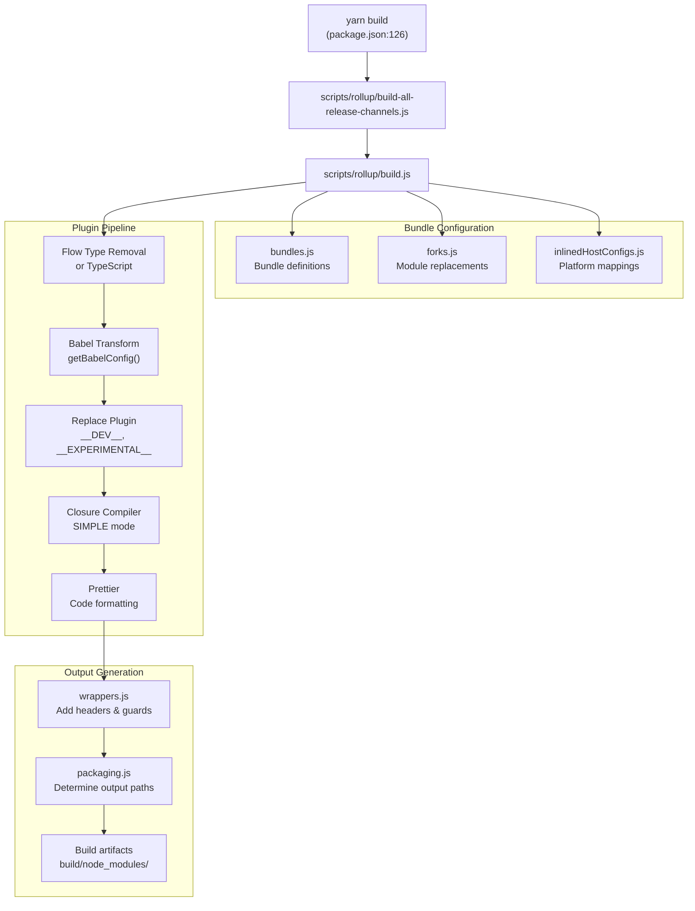

**来源：** [scripts/rollup/build.js:1-700](), [package.json:126](), [scripts/rollup/bundles.js:1-100](), [scripts/rollup/forks.js:1-485](), [scripts/rollup/packaging.js:1-292](), [scripts/rollup/wrappers.js:1-300]()

---

## Bundle 类型系统

构建系统从同一源代码生成多种 bundle 类型。每种 bundle 类型代表环境、模块格式和优化级别的组合。

### Bundle 类型定义

| Bundle 类型 | 模块格式 | 环境 | 描述 |
|------------|---------------|-------------|-------------|
| `NODE_DEV` | CommonJS | Node.js | 包含完整错误消息的开发构建 |
| `NODE_PROD` | CommonJS | Node.js | 包含压缩错误的生产构建 |
| `NODE_PROFILING` | CommonJS | Node.js | 包含性能分析工具的生产构建 |
| `NODE_ES2015` | CommonJS | Node.js | 保留 ES2015+ 语法 |
| `ESM_DEV` | ES Modules | 浏览器/Node | 开发版 ES 模块 |
| `ESM_PROD` | ES Modules | 浏览器/Node | 生产版 ES 模块 |
| `BUN_DEV` | CommonJS | Bun 运行时 | Bun 开发版 |
| `BUN_PROD` | CommonJS | Bun 运行时 | Bun 生产版 |
| `FB_WWW_DEV` | CommonJS | Facebook web | Facebook 开发构建 |
| `FB_WWW_PROD` | CommonJS | Facebook web | Facebook 生产构建 |
| `FB_WWW_PROFILING` | CommonJS | Facebook web | Facebook 性能分析构建 |
| `RN_OSS_DEV` | CommonJS | React Native OSS | RN 开源开发版 |
| `RN_OSS_PROD` | CommonJS | React Native OSS | RN 开源生产版 |
| `RN_OSS_PROFILING` | CommonJS | React Native OSS | RN 开源性能分析版 |
| `RN_FB_DEV` | CommonJS | React Native FB | RN 内部开发版 |
| `RN_FB_PROD` | CommonJS | React Native FB | RN 内部生产版 |
| `RN_FB_PROFILING` | CommonJS | React Native FB | RN 内部性能分析版 |
| `BROWSER_SCRIPT` | IIFE | 浏览器 | 独立浏览器脚本 |
| `CJS_DTS` | CommonJS | TypeScript | CJS 的类型定义 |
| `ESM_DTS` | ES Modules | TypeScript | ESM 的类型定义 |

**来源：** [scripts/rollup/bundles.js:10-54](), [scripts/rollup/build.js:50-71]()

### Bundle 配置结构

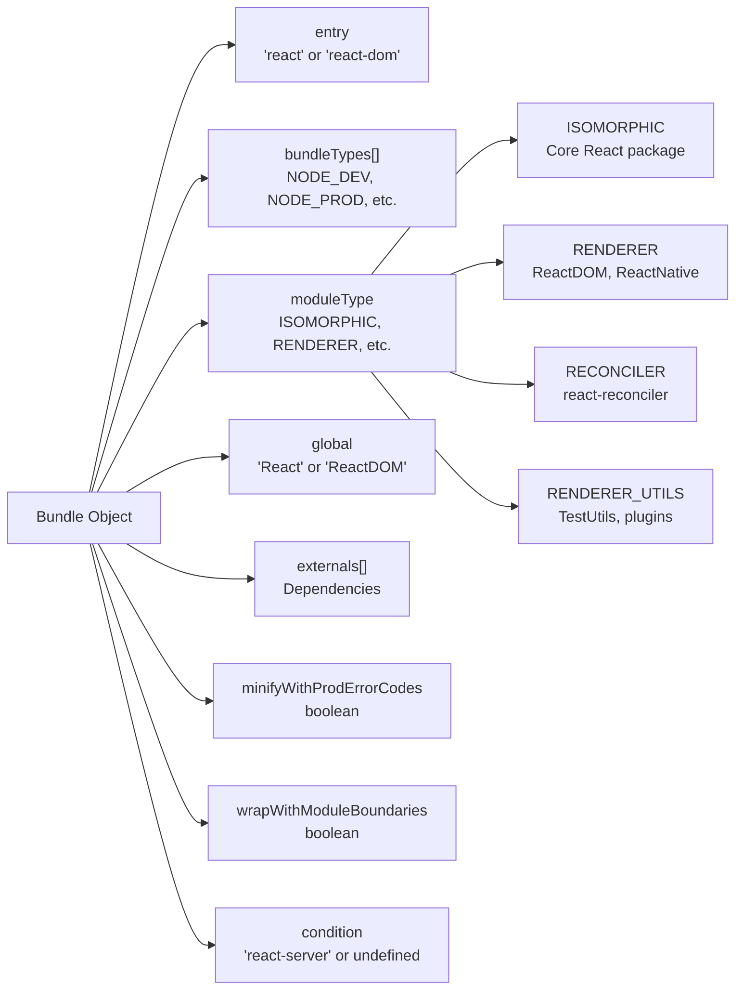

**来源：** [scripts/rollup/bundles.js:56-68](), [scripts/rollup/bundles.js:69-885]()

---

## 模块分叉机制

分叉系统允许根据目标环境替换不同的模块。这使得可以在不进行运行时检查的情况下，向不同平台分发同一接口的不同实现。

### 分叉解析过程

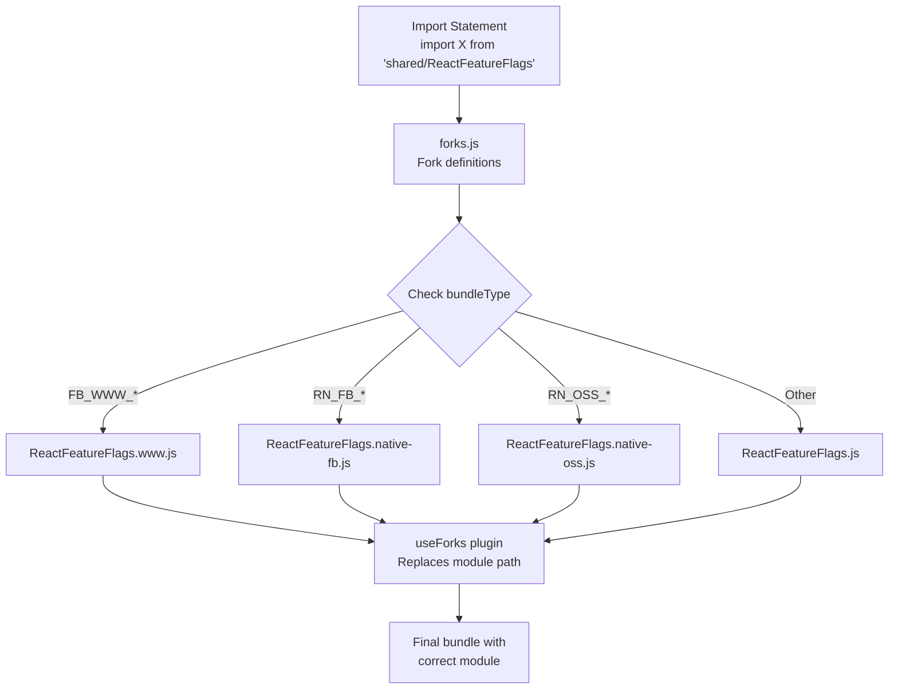

### 关键分叉模块

| 源模块 | 用途 | 分叉变体 |
|--------------|---------|---------------|
| `ReactFeatureFlags.js` | 特性标志定义 | `www.js`, `native-fb.js`, `native-oss.js`, `test-renderer.js` |
| `ReactSharedInternals.js` | 共享状态对象 | `ReactSharedInternalsClient.js`, `ReactSharedInternalsServer.js` |
| `ReactFiberConfig.js` | Renderer 主机配置 | 平台特定实现（dom, native 等） |
| `ReactFlightServerConfig.js` | Flight 服务器配置 | `dom`, `webpack`, `turbopack`, `parcel` 等 |
| `ReactFlightClientConfig.js` | Flight 客户端配置 | 平台特定客户端实现 |
| `EventListener.js` | 事件附加 | Facebook 使用 `EventListener-www.js` |

**来源：** [scripts/rollup/forks.js:52-482](), [scripts/rollup/build.js:398](), [scripts/rollup/modules.js:64-81]()

### 分叉函数签名

`forks.js` 中的每个条目都是一个函数，接收上下文并返回替换路径：

```
(bundleType, entry, dependencies, moduleType, bundle) => string | Error | null
```

- 如果不需要分叉，返回 `null`
- 返回文件路径字符串以替换模块
- 对于导入时应报错的模块，返回 Error 对象

**来源：** [scripts/rollup/forks.js:52-89](), [scripts/rollup/modules.js:64-81]()

---

## 主机配置系统

主机配置（host configs）定义 renderer 的平台特定行为。`inlinedHostConfigs.js` 文件将入口点映射到平台实现。

### 主机配置结构

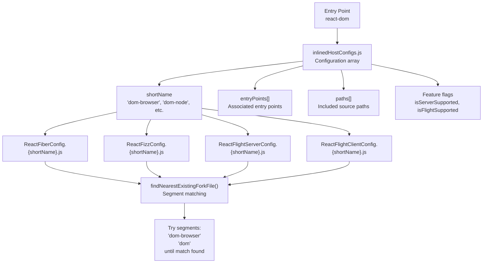

### 主机配置示例

| 短名称 | 入口点 | 服务器支持 | Flight 支持 |
|-----------|--------------|----------------|----------------|
| `dom-browser` | `react-dom`, `react-dom/client` | 是 | 是 |
| `dom-node` | `react-dom/server.node` | 是 | 是 |
| `dom-edge` | `react-dom/server.edge` | 是 | 是 |
| `dom-bun` | `react-dom/server.bun` | 是 | 是 |
| `native-fb` | `react-native-renderer` | 否 | 否 |
| `native-oss` | `react-native-renderer` | 否 | 否 |

**来源：** [scripts/shared/inlinedHostConfigs.js:9-500](), [scripts/rollup/forks.js:242-436]()

### 分段分叉解析

`findNearestExistingForkFile` 函数实现回退机制：

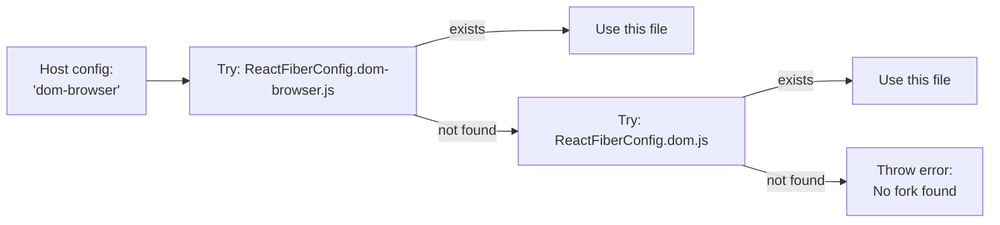

**来源：** [scripts/rollup/forks.js:29-43]()

---

## 插件流水线

构建系统应用一系列 Rollup 插件来转换源代码。执行顺序对正确性至关重要。

### 插件执行顺序

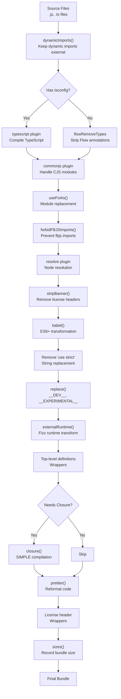

**来源：** [scripts/rollup/build.js:354-546]()

### Babel 配置

Babel 插件根据 bundle 类型和开发模式应用不同的转换：

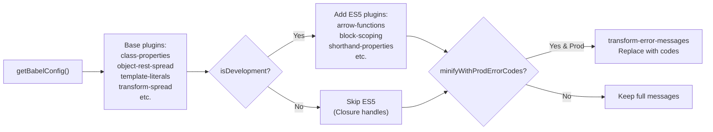

**来源：** [scripts/rollup/build.js:143-172](), [scripts/rollup/build.js:111-141]()

---

## 包输出结构

构建产物被组织成特定的目录结构，用于 npm 分发和内部使用。

### 输出目录布局

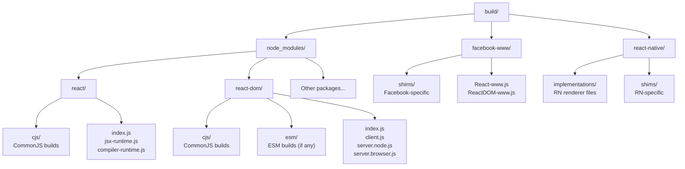

**来源：** [scripts/rollup/packaging.js:48-114]()

### 路径确定逻辑

`getBundleOutputPath` 函数将 bundle 配置映射到输出路径：

| Bundle 类型 | 包名 | 输出路径模式 |
|------------|--------------|-------------------|
| `NODE_DEV`, `NODE_PROD`, `NODE_PROFILING` | 任意 | `build/node_modules/{pkg}/cjs/{filename}` |
| `ESM_DEV`, `ESM_PROD` | 任意 | `build/node_modules/{pkg}/esm/{filename}` |
| `FB_WWW_*` | 任意 | `build/facebook-www/{filename}` |
| `RN_OSS_*` | `react-native-renderer` | `build/react-native/implementations/{filename}` |
| `RN_FB_*` | `react-native-renderer` | `build/react-native/implementations/{filename}.fb.js` |
| `RN_FB_*` | 其他 | `build/facebook-react-native/{pkg}/cjs/{filename}` |
| `BROWSER_SCRIPT` | 任意 | `build/node_modules/{pkg}/{bundle.outputPath}` |

**来源：** [scripts/rollup/packaging.js:48-115]()

---

## Npm 包准备

构建完成后，必须为 npm 发布准备包。这涉及复制元数据文件、过滤入口点以及创建压缩包。

### 包准备流程

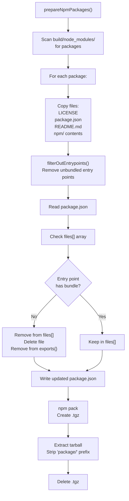

**来源：** [scripts/rollup/packaging.js:253-284](), [scripts/rollup/packaging.js:171-251]()

### 入口点过滤

`filterOutEntrypoints` 函数使用映射来确定哪些入口点应该存在：

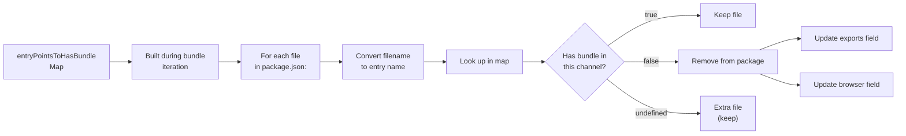

**来源：** [scripts/rollup/packaging.js:158-251]()

---

## 代码包装与头部

不同的 bundle 类型需要不同的代码包装器、头部和保护代码。`wrappers.js` 模块处理此转换。

### 包装器应用

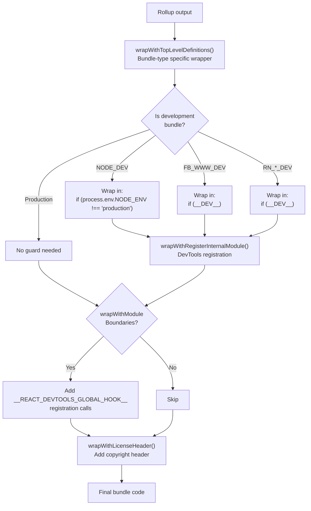

**来源：** [scripts/rollup/wrappers.js:32-50](), [scripts/rollup/wrappers.js:58-169](), [scripts/rollup/build.js:446-520]()

### 许可证头部格式

所有 bundle 都包含标准的 MIT 许可证头部：

```
/**
 * Copyright (c) Meta Platforms, Inc. and affiliates.
 *
 * This source code is licensed under the MIT license found in the
 * LICENSE file in the root directory of this source tree.
 */
```

**来源：** [scripts/rollup/wrappers.js:53-56]()

---

## Bundle 类型特定行为

不同的 bundle 类型具有独特的编译和优化要求。

### 开发版与生产版差异

| 方面 | 开发版 | 生产版 |
|--------|------------|------------|
| `__DEV__` 常量 | `true` | `false` |
| 错误消息 | 完整文本 | 错误代码（压缩） |
| Babel 插件 | 完整 ES5 转换 | 最小化（Closure 处理） |
| Closure Compiler | 不使用 | SIMPLE 模式 |
| 保护包装器 | `if (process.env.NODE_ENV !== "production")` | 无 |
| Source maps | 不生成 | 不生成 |

**来源：** [scripts/rollup/build.js:253-280](), [scripts/rollup/build.js:432-442](), [scripts/rollup/build.js:469-500]()

### 性能分析 Bundle

性能分析 bundle 是将 `__PROFILE__` 标志设置为 `true` 的生产构建。它们包括：

- 所有生产优化
- 额外的性能跟踪代码
- 启用的 Profiler hooks

**来源：** [scripts/rollup/build.js:283-310](), [scripts/rollup/build.js:432-442]()

### Facebook 内部 Bundle

Facebook bundle（`FB_WWW_*` 和 `RN_FB_*`）具有特殊特性：

- 使用不同的特性标志分叉（`ReactFeatureFlags.www.js`, `ReactFeatureFlags.native-fb.js`）
- 通过 `__VARIANT__` 或外部 gatekeeper 系统支持动态标志
- 可能使用 Facebook 特定的事件监听器包装器
- 输出到单独的目录（`facebook-www/`, `facebook-react-native/`）

**来源：** [scripts/rollup/bundles.js:19-21](), [scripts/rollup/forks.js:180-188](), [scripts/rollup/packaging.js:64-94]()

---

## 构建命令与工作流

monorepo 为不同用例提供了多个构建命令。

### 主要构建命令

| 命令 | 描述 | 实现 |
|---------|-------------|----------------|
| `yarn build` | 构建所有发布渠道 | [package.json:126]() → `build-all-release-channels.js` |
| `yarn build --type=NODE` | 仅构建 Node bundle | [scripts/rollup/build.js:94-98]() |
| `yarn build react/index,react-dom/index` | 构建特定入口点 | [scripts/rollup/build.js:100-104]() |
| `yarn build --watch` | 开发模式监听 | [scripts/rollup/build.js:106]() |

**来源：** [package.json:124-157](), [scripts/rollup/build.js:94-106]()

### 专用构建目标

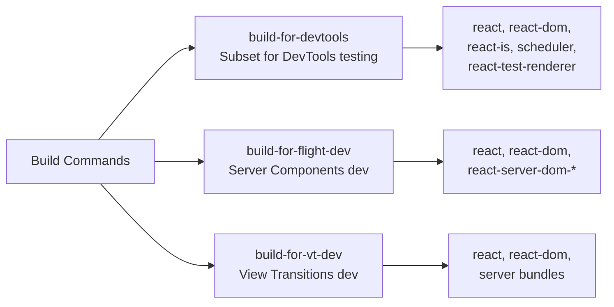

**来源：** [package.json:127-131]()

---

## 模块解析与依赖

构建系统需要解析模块并确定依赖关系以进行打包。

### 依赖解析

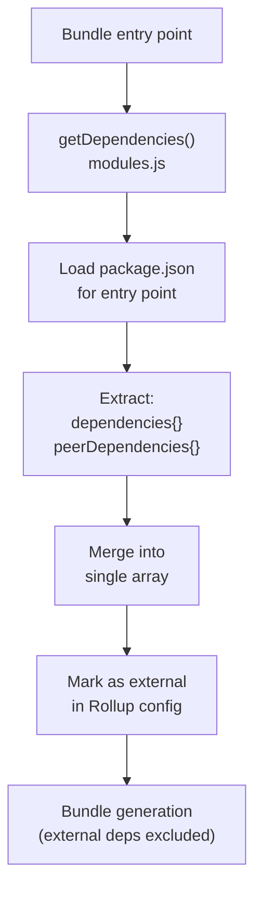

**来源：** [scripts/rollup/modules.js:50-61](), [scripts/rollup/build.js:653-654]()

### 全局变量映射

对于暴露全局变量的 bundle（UMD 风格），系统将包名映射到全局变量：

| 包名 | 全局变量 |
|-------------|-----------------|
| `react` | `React` |
| `react-dom` | `ReactDOM` |
| `react-dom/server` | `ReactDOMServer` |
| `scheduler` | `Scheduler` |
| `scheduler/unstable_mock` | `SchedulerMock` |

**来源：** [scripts/rollup/modules.js:31-38](), [scripts/rollup/build.js:650]()

---

## 构建验证

构建完成后，系统验证输出以捕获构建流水线错误。

### 验证过程

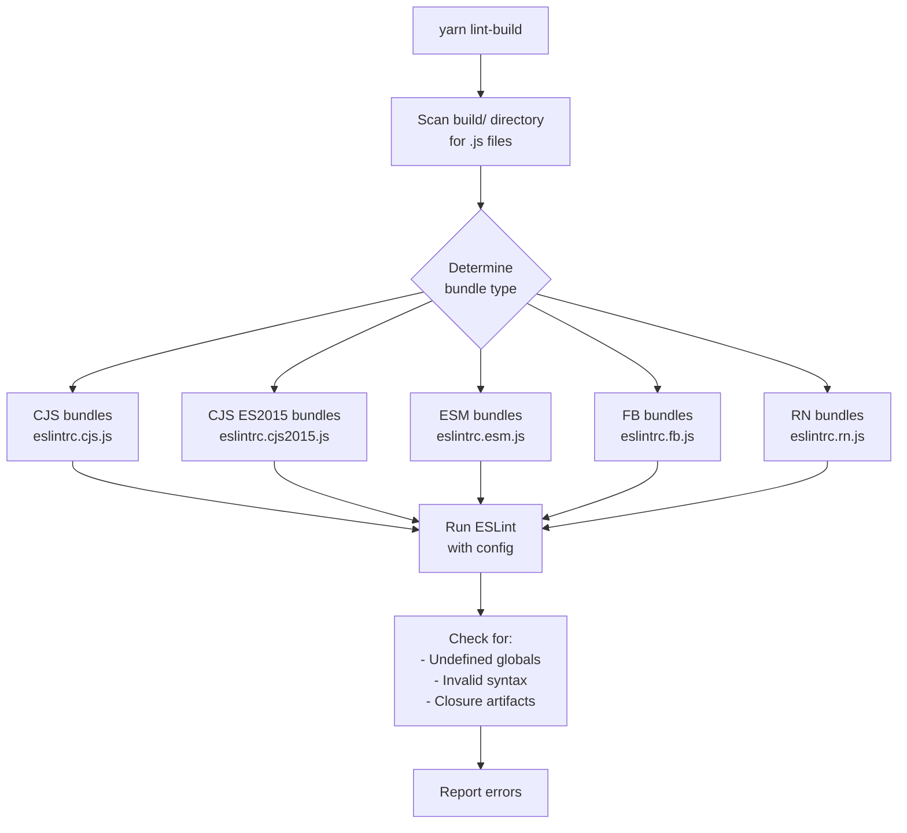

**来源：** [scripts/rollup/validate/index.js:1-100](), [package.json:135]()

### 验证规则

每种 bundle 类型都有特定的全局变量和语法要求：

- **CJS**：ES2020 特性，Node.js 全局变量（`process`, `Buffer`）
- **CJS ES2015**：ES2015+ 特性，Node.js 全局变量
- **ESM**：ES2020 特性，模块语法
- **FB**：ES5 语法，`__DEV__` 全局变量
- **RN**：ES5 语法，React Native 全局变量（`nativeFabricUIManager`）

**来源：** [scripts/rollup/validate/eslintrc.cjs.js:1-111](), [scripts/rollup/validate/eslintrc.fb.js:1-100](), [scripts/rollup/validate/eslintrc.rn.js:1-96]()

---

## 环境特定入口点

React 包使用条件导出和入口点后缀来选择正确的实现。

### 入口点分叉解析

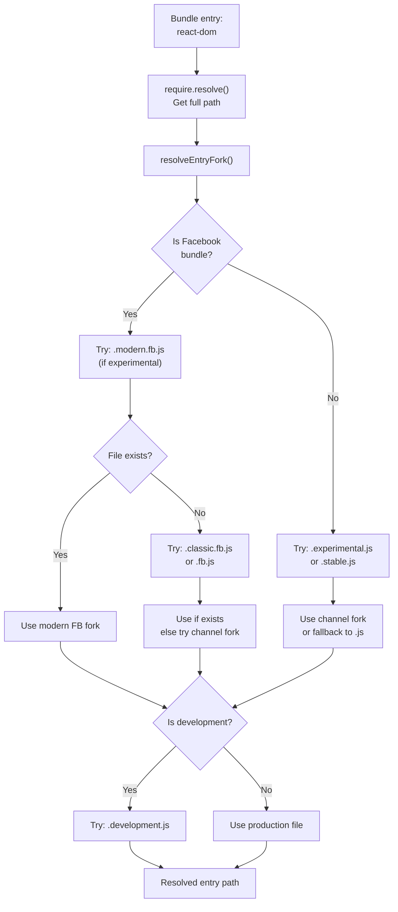

**来源：** [scripts/rollup/build.js:585-633]()

### package.json 中的条件导出

React 包使用 Node.js 条件导出来选择实现：

```json
{
  "exports": {
    ".": {
      "react-server": "./react.react-server.js",
      "default": "./index.js"
    },
    "./server": {
      "react-server": "./server.react-server.js",
      "workerd": "./server.edge.js",
      "bun": "./server.bun.js",
      "node": "./server.node.js",
      "browser": "./server.browser.js",
      "default": "./server.node.js"
    }
  }
}
```

**来源：** [packages/react-dom/package.json:51-125](), [packages/react/package.json:24-43]()

---

## 总结

React 的构建系统是一个复杂的多阶段流水线，它：

1. **读取配置**：从 `bundles.js`、`forks.js` 和 `inlinedHostConfigs.js` 读取配置
2. **处理源文件**：通过 TypeScript/Flow 移除、Babel 和 Closure Compiler 处理源文件
3. **应用环境特定分叉**：根据目标平台交换模块
4. **生成数十种 bundle 变体**：为不同环境和优化级别生成 bundle
5. **包装代码**：使用适当的头部、保护代码和 DevTools 注册
6. **组织输出**：将输出组织到平台特定的目录结构中
7. **准备 npm 包**：通过过滤入口点和创建压缩包来准备 npm 包
8. **验证输出**：使用 ESLint 验证输出以捕获构建流水线错误

该系统使 React 能够维护单一代码库，同时向 Node.js、浏览器、React Native 和 Facebook 的内部基础设施分发优化的、平台特定的实现。
