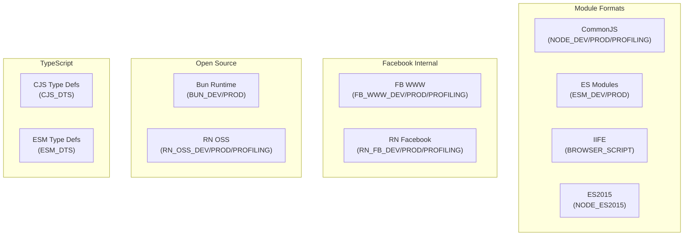
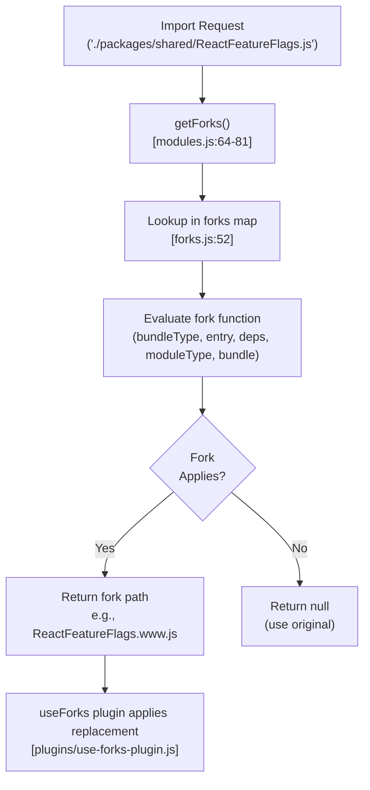
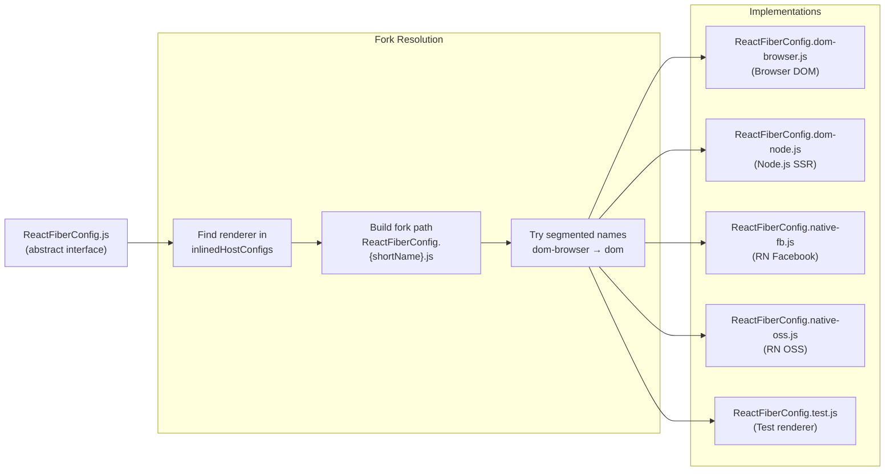
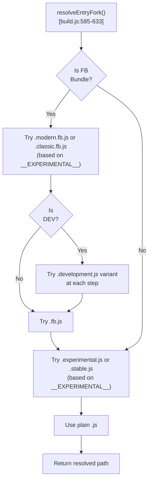
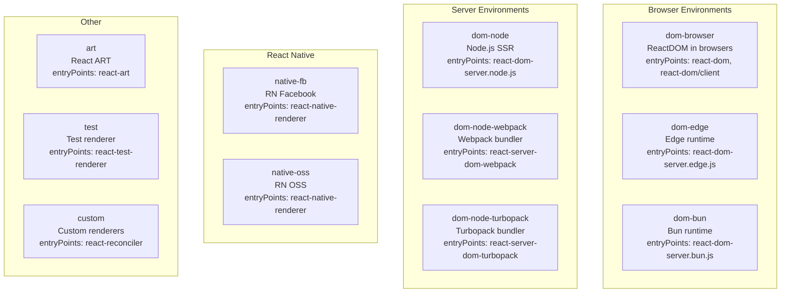
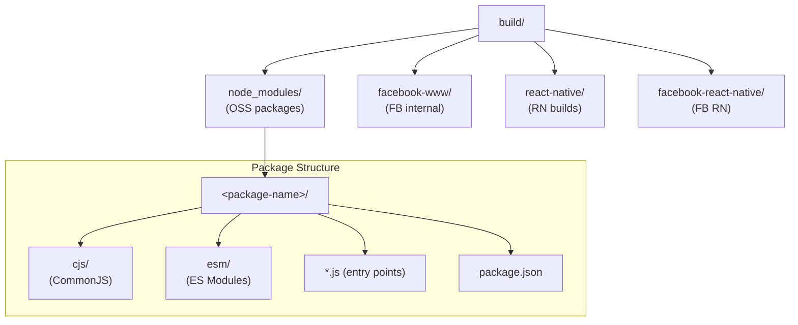
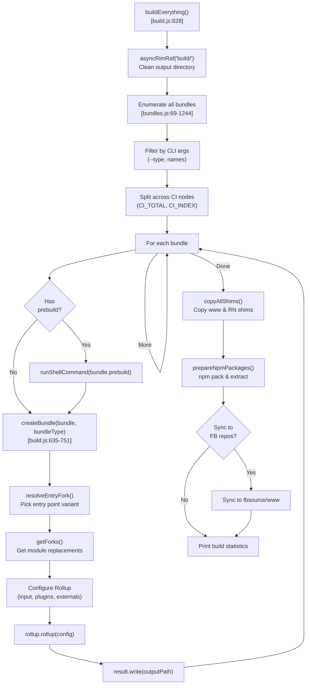

# 构建管线与模块分叉

<!-- > 来源：https://deepwiki.com/facebook/react/3.1-build-pipeline-and-module-forking -->

<details>
<summary>相关源文件</summary>

生成此 wiki 页面时使用了以下文件作为上下文：

- [packages/react-dom/npm/server.browser.js](packages/react-dom/npm/server.browser.js)
- [packages/react-dom/npm/server.bun.js](packages/react-dom/npm/server.bun.js)
- [packages/react-dom/npm/server.edge.js](packages/react-dom/npm/server.edge.js)
- [packages/react-dom/npm/server.node.js](packages/react-dom/npm/server.node.js)
- [packages/react-dom/server.browser.js](packages/react-dom/server.browser.js)
- [packages/react-dom/server.bun.js](packages/react-dom/server.bun.js)
- [packages/react-dom/server.edge.js](packages/react-dom/server.edge.js)
- [packages/react-dom/server.node.js](packages/react-dom/server.node.js)
- [packages/react-dom/src/server/react-dom-server.bun.js](packages/react-dom/src/server/react-dom-server.bun.js)
- [packages/react-dom/src/server/react-dom-server.bun.stable.js](packages/react-dom/src/server/react-dom-server.bun.stable.js)
- [packages/react-reconciler/src/ReactFiberOffscreenComponent.js](packages/react-reconciler/src/ReactFiberOffscreenComponent.js)
- [packages/react-reconciler/src/__tests__/ReactHooksWithNoopRenderer-test.js](packages/react-reconciler/src/__tests__/ReactHooksWithNoopRenderer-test.js)
- [packages/react-reconciler/src/__tests__/ReactSuspenseWithNoopRenderer-test.js](packages/react-reconciler/src/__tests__/ReactSuspenseWithNoopRenderer-test.js)
- [scripts/jest/setupHostConfigs.js](scripts/jest/setupHostConfigs.js)
- [scripts/rollup/build.js](scripts/rollup/build.js)
- [scripts/rollup/bundles.js](scripts/rollup/bundles.js)
- [scripts/rollup/forks.js](scripts/rollup/forks.js)
- [scripts/rollup/modules.js](scripts/rollup/modules.js)
- [scripts/rollup/packaging.js](scripts/rollup/packaging.js)
- [scripts/rollup/sync.js](scripts/rollup/sync.js)
- [scripts/rollup/validate/index.js](scripts/rollup/validate/index.js)
- [scripts/rollup/wrappers.js](scripts/rollup/wrappers.js)
- [scripts/shared/inlinedHostConfigs.js](scripts/shared/inlinedHostConfigs.js)

</details>


## 目的与范围

本文档介绍 React 构建系统架构，该系统将 monorepo 的源代码转换为面向不同环境和平台的可分发包。构建管线使用 Rollup 从共享源代码生成数百个 bundle 变体，采用复杂的模块分叉（Module Forking）机制，针对特定部署目标（Facebook 内部、React Native、Node.js、浏览器等）调整行为，而无需维护独立的代码库。

关于控制各环境启用功能的 Feature Flags，请参阅 [Feature Flags 系统](#2)。关于发布渠道和版本管理，请参阅 [发布渠道与版本管理](#3.2)。关于 CI/CD 和产物准备，请参阅 [CI/CD 与产物管理](#3.3)。

---

## 构建系统架构

React 构建系统由 [scripts/rollup/build.js]() 编排，围绕三个核心概念：

1. **Bundle 定义** - 指定入口点、目标环境和模块格式的配置
2. **模块分叉（Module Forking）** - 环境特定的模块替换
3. **插件管线** - 应用于源代码的顺序转换

### Bundle 配置系统

[scripts/rollup/bundles.js:69-1244]() 中的 bundle 定义指定了所有可能的构建输出。每个 bundle 配置包含：

| 属性 | 用途 |
|----------|---------|
| `bundleTypes` | 目标 bundle 类型数组（NODE_DEV, FB_WWW_PROD 等） |
| `moduleType` | 分类（ISOMORPHIC, RENDERER, RECONCILER, RENDERER_UTILS） |
| `entry` | 源入口点路径 |
| `global` | UMD/IIFE bundle 的全局变量名 |
| `externals` | 不打包的外部依赖 |
| `minifyWithProdErrorCodes` | 是否在生产环境用错误代码替换错误消息 |
| `wrapWithModuleBoundaries` | 是否用模块边界标记包装 |

**按环境分类的 Bundle 类型**



来源：[scripts/rollup/bundles.js:10-54]()

---

## 模块分叉机制

模块分叉允许 React 在构建时用环境特定的实现替换特定模块。分叉系统定义在 [scripts/rollup/forks.js:52-482]()。

### Fork 解析过程



来源：[scripts/rollup/forks.js:52-482](), [scripts/rollup/modules.js:64-81]()

### 关键分叉模块

**ReactFeatureFlags.js**

Feature Flags 模块有环境特定的分叉：

- `ReactFeatureFlags.www.js` - Facebook Web 构建
- `ReactFeatureFlags.native-fb.js` - Facebook React Native 构建
- `ReactFeatureFlags.native-oss.js` - 开源 React Native 构建
- `ReactFeatureFlags.test-renderer.js` - 测试渲染器构建

Fork 逻辑：[scripts/rollup/forks.js:134-191]()

**ReactFiberConfig.js（Host 配置）**

该模块为 reconciler 提供宿主环境抽象。不同渲染器有不同的实现：



Fork 逻辑：[scripts/rollup/forks.js:242-274]()

`findNearestExistingForkFile` 函数 [scripts/rollup/forks.js:29-43]() 尝试逐步缩短的段组合：
- `ReactFiberConfig.dom-browser.js`
- `ReactFiberConfig.dom.js`
- （如果都未找到则回退到错误）

**ReactSharedInternals.js**

分叉以防止 `react` 包导入共享内部模块时的循环依赖：

- 在 `react` 包内 → 使用 `ReactSharedInternalsClient.js`
- 在 `react-server` 条件下 → 使用 `ReactSharedInternalsServer.js`
- 其他包 → 使用默认 `ReactSharedInternals.js`

Fork 逻辑：[scripts/rollup/forks.js:55-89]()

**服务器配置模块**

三个相关的服务器渲染配置模块：

| 模块 | 用途 | Fork 示例 |
|--------|---------|---------------|
| `ReactServerStreamConfig.js` | 流处理 | `ReactServerStreamConfig.dom-browser.js` |
| `ReactFizzConfig.js` | HTML 渲染（Fizz） | `ReactFizzConfig.dom-node.js` |
| `ReactFlightServerConfig.js` | Server Components（Flight） | `ReactFlightServerConfig.dom-node-webpack.js` |

Fork 逻辑：[scripts/rollup/forks.js:276-392]()

---

## 入口点分叉

除了模块分叉，构建系统还根据环境和发布渠道分叉整个入口点。

### 入口 Fork 解析算法



来源：[scripts/rollup/build.js:585-633]()

**入口点变体示例**

对于 `packages/react-dom/src/ReactDOMFB.js`：
- `ReactDOMFB.modern.fb.js` - Facebook 实验性构建
- `ReactDOMFB.classic.fb.js` - Facebook 稳定构建  
- `ReactDOMFB.js` - 基础实现

对于 `packages/react/index.js`：
- `index.experimental.js` - OSS 实验性构建
- `index.stable.js` - OSS 稳定构建
- `index.js` - 基础实现

---

## 插件管线

Rollup 插件管线通过多个阶段转换源代码。管线在 [scripts/rollup/build.js:354-546]() 中构建。

### 管线阶段

```mermaid
graph TB
    Source["Source Code<br/>(Flow/TypeScript)"]
    
    DynamicImports["dynamicImports()<br/>Externalize dynamic imports"]
    
    TypeRemoval["typescript() or flowRemoveTypes<br/>Strip type annotations"]
    
    CommonJS["commonjs()<br/>(TypeScript only)"]
    
    Forks["useForks()<br/>Apply module replacements"]
    
    ForbidFBJS["forbidFBJSImports()<br/>Block fbjs imports"]
    
    Resolve["resolve()<br/>Node module resolution"]
    
    StripBanner["stripBanner()<br/>Remove individual license headers"]
    
    Babel["babel()<br/>Transpile to ES2015 (+ ES5 in DEV)"]
    
    RemoveStrict["Remove 'use strict'<br/>from individual modules"]
    
    Replace["replace()<br/>__DEV__, __PROFILE__, __EXPERIMENTAL__"]
    
    ExternalRuntime["externalRuntime()<br/>(for server-external-runtime)"]
    
    TopLevel["wrapWithTopLevelDefinitions()<br/>Module boundaries"]
    
    Closure["closure()<br/>Minification (SIMPLE mode)"]
    
    Prettier["prettier()<br/>Format output"]
    
    License["wrapWithLicenseHeader()<br/>Add license"]
    
    Sizes["sizes()<br/>Record bundle size"]
    
    Output["Output Bundle"]
    
    Source --> DynamicImports
    DynamicImports --> TypeRemoval
    TypeRemoval --> CommonJS
    CommonJS --> Forks
    Forks --> ForbidFBJS
    ForbidFBJS --> Resolve
    Resolve --> StripBanner
    StripBanner --> Babel
    Babel --> RemoveStrict
    RemoveStrict --> Replace
    Replace --> ExternalRuntime
    ExternalRuntime --> TopLevel
    TopLevel --> Closure
    Closure --> Prettier
    Prettier --> License
    License --> Sizes
    Sizes --> Output
```



来源：[scripts/rollup/build.js:380-539]()

### 关键插件详情

**Babel 配置** [scripts/rollup/build.js:143-172]()

基础插件（所有构建）：
- `@babel/plugin-proposal-class-properties` (loose)
- `@babel/plugin-proposal-object-rest-spread` (loose)
- `@babel/plugin-transform-template-literals` (loose)
- `@babel/plugin-transform-for-of`
- `@babel/plugin-transform-spread` (loose)
- `@babel/plugin-transform-parameters`
- `@babel/plugin-transform-destructuring` (loose)
- 自定义 `transform-object-assign`

额外的 ES5 插件（仅 DEV 构建）：
- `@babel/plugin-transform-literals`
- `@babel/plugin-transform-arrow-functions`
- `@babel/plugin-transform-block-scoped-functions`
- `@babel/plugin-transform-shorthand-properties`
- `@babel/plugin-transform-computed-properties`
- `@babel/plugin-transform-block-scoping`

**Closure Compiler 配置** [scripts/rollup/build.js:470-500]()

设置：
- `compilation_level: 'SIMPLE'` - 基础压缩，不进行激进优化
- `language_in: 'ECMASCRIPT_2020'`
- `language_out: 'ECMASCRIPT5_STRICT'`（除了 NODE_ES2015 → ES2020, BROWSER_SCRIPT → ES5）
- `renaming: false` - 保留符号名称（让 gzip 处理压缩）
- `assume_function_wrapper: true` - 防止全局变量污染

**常量替换** [scripts/rollup/build.js:432-442]()

`replace()` 插件替换构建时常量：

```javascript
__DEV__ → 'true' (development) or 'false' (production)
__PROFILE__ → 'true' (profiling/dev) or 'false' (production)
process.env.NODE_ENV → "'development'" or "'production'"
__EXPERIMENTAL__ → true/false (based on RELEASE_CHANNEL)
```

---

## Host 配置系统

Host 配置系统允许 React 通过通用抽象层面向不同平台（DOM、React Native、自定义渲染器）。

### Host 配置注册表

Host 配置注册在 [scripts/shared/inlinedHostConfigs.js:9-357]()。每个配置指定：

| 属性 | 描述 |
|----------|-------------|
| `shortName` | Fork 解析的标识符（例如 "dom-browser", "native-fb"） |
| `entryPoints` | 使用此配置的入口点数组 |
| `paths` | 应使用此配置的文件路径 |
| `isServerSupported` | 是否支持服务器渲染 |
| `isFlightSupported` | 是否支持 Server Components |

**主要 Host 配置**



来源：[scripts/shared/inlinedHostConfigs.js:9-357]()

### Fork 路径解析

`findNearestExistingForkFile` 函数 [scripts/rollup/forks.js:29-43]() 通过尝试逐步缩短的路径段来解析 fork：

```javascript
// For shortName "dom-node-webpack" and base path 
// "ReactFiberConfig.", tries:
// 1. ReactFiberConfig.dom-node-webpack.js
// 2. ReactFiberConfig.dom-node.js  
// 3. ReactFiberConfig.dom.js
// Returns first that exists
```

这允许在相关配置之间共享实现（例如，`dom-browser` 和 `dom-node` 可以共享 `dom` fork）。

---

## Bundle 输出路径

Bundle 输出按环境和包组织。输出路径生成在 [scripts/rollup/packaging.js:48-115]()。

### 输出目录结构



来源：[scripts/rollup/packaging.js:48-115]()

**按 Bundle 类型的路径生成**

| Bundle 类型 | 输出路径模式 |
|-------------|-------------------|
| NODE_DEV/PROD/PROFILING | `build/node_modules/<package>/cjs/<filename>` |
| ESM_DEV/PROD | `build/node_modules/<package>/esm/<filename>` |
| BUN_DEV/PROD | `build/node_modules/<package>/cjs/<filename>` |
| FB_WWW_* | `build/facebook-www/<filename>` |
| RN_OSS_* | `build/react-native/implementations/<filename>` |
| RN_FB_* (react-native-renderer) | `build/react-native/implementations/<filename>.fb.js` |
| RN_FB_* (其他包) | `build/facebook-react-native/<package>/cjs/<filename>` |
| BROWSER_SCRIPT | `build/node_modules/<package>/<outputPath>` |

代码：[scripts/rollup/packaging.js:48-115]()

---

## 代码包装器

不同的 bundle 类型需要不同的代码包装器来处理模块边界和条件加载。包装器逻辑在 [scripts/rollup/wrappers.js]()。

### 顶层定义包装器

**NODE_DEV 包装器** [scripts/rollup/wrappers.js:86-95]()

```javascript
'use strict';

if (process.env.NODE_ENV !== "production") {
  (function() {
    // ... bundle code ...
  })();
}
```

**FB_WWW_DEV 包装器** [scripts/rollup/wrappers.js:107-116]()

```javascript
'use strict';

if (__DEV__) {
  (function() {
    // ... bundle code ...
  })();
}
```

**RN_OSS_DEV 包装器** [scripts/rollup/wrappers.js:128-137]()

```javascript
'use strict';

if (__DEV__) {
  (function() {
    // ... bundle code ...
  })();
}
```

来源：[scripts/rollup/wrappers.js:58-169]()

### Reconciler 包装器

reconciler（react-reconciler 包）使用特殊的工厂函数包装器，接受 host 配置：

**NODE_DEV Reconciler** [scripts/rollup/wrappers.js:172-186]()

```javascript
'use strict';

if (process.env.NODE_ENV !== "production") {
  module.exports = function $$$reconciler($$$config) {
    var exports = {};
    // ... bundle code ...
    return exports;
  };
  module.exports.default = module.exports;
  Object.defineProperty(module.exports, "__esModule", { value: true });
}
```

这允许自定义渲染器在运行时提供自己的 host 配置。

来源：[scripts/rollup/wrappers.js:171-263]()

### 许可证头部

许可证头部因 bundle 类型而异。OSS 构建示例 [scripts/rollup/wrappers.js:326-336]()：

```javascript
/**
 * @license React
 * <filename>
 *
 * Copyright (c) Meta Platforms, Inc. and affiliates.
 *
 * This source code is licensed under the MIT license found in the
 * LICENSE file in the root directory of this source tree.
 */
```

Facebook 构建包含 Flow/lint 指令 [scripts/rollup/wrappers.js:362-374]()：

```javascript
/**
 * Copyright (c) Meta Platforms, Inc. and affiliates.
 * ...
 * @noflow
 * @nolint
 * @preventMunge
 * @preserve-invariant-messages
 */
```

来源：[scripts/rollup/wrappers.js:265-492]()

---

## 构建编排

主构建脚本 [scripts/rollup/build.js]() 编排整个构建过程。

### 构建执行流程



来源：[scripts/rollup/build.js:828-896]()

### Bundle 过滤

构建支持通过命令行参数过滤：

**按 Bundle 类型**（`--type` 标志）

```bash
# Build only Facebook www bundles
yarn build --type=fb_www

# Build multiple types
yarn build --type=node_dev,node_prod
```

代码：[scripts/rollup/build.js:94-98]()

**按 Bundle 名称**（位置参数）

```bash
# Build only react-dom
yarn build react-dom

# Build multiple packages
yarn build react react-dom
```

代码：[scripts/rollup/build.js:100-104](), [scripts/rollup/build.js:548-583]()

**跳过逻辑** [scripts/rollup/build.js:548-583]()

在以下情况下跳过 bundle：
1. 其 `bundleTypes` 数组不包含目标 bundle 类型
2. 用户指定了 `--type` 标志且都不匹配
3. 用户指定了名称且 bundle 的入口不匹配

### 包准备

构建后，包会为 npm 发布做准备 [scripts/rollup/packaging.js:253-284]()：

1. 复制元数据文件（LICENSE, package.json, README.md）
2. 复制 npm/ 目录内容（包装器文件）
3. 从 package.json 中过滤掉未构建的入口点
4. 运行 `npm pack` 创建 tarball
5. 将 tarball 解压到最终位置
6. 删除 tarball

过滤步骤 [scripts/rollup/packaging.js:171-251]() 从 `package.json` 的 `files` 字段和 `exports` 映射中移除当前发布渠道未构建的入口点。

来源：[scripts/rollup/packaging.js:253-284](), [scripts/rollup/packaging.js:171-251]()

---

## 外部依赖

构建系统跟踪外部依赖及其导入副作用。

### 导入副作用注册表

[scripts/rollup/modules.js:10-28]() 声明外部依赖在导入时是否有副作用：

```javascript
const importSideEffects = Object.freeze({
  fs: HAS_NO_SIDE_EFFECTS_ON_IMPORT,
  'fs/promises': HAS_NO_SIDE_EFFECTS_ON_IMPORT,
  path: HAS_NO_SIDE_EFFECTS_ON_IMPORT,
  stream: HAS_NO_SIDE_EFFECTS_ON_IMPORT,
  'prop-types/checkPropTypes': HAS_NO_SIDE_EFFECTS_ON_IMPORT,
  scheduler: HAS_NO_SIDE_EFFECTS_ON_IMPORT,
  react: HAS_NO_SIDE_EFFECTS_ON_IMPORT,
  'react-dom': HAS_NO_SIDE_EFFECTS_ON_IMPORT,
  // ...
});
```

这允许在生产构建中对未使用的 DEV 专用导入进行 tree-shaking。`pureExternalModules` 列表传递给 Rollup 的 treeshake 配置 [scripts/rollup/build.js:656-666]()。

### 已知全局变量

对于 UMD/IIFE bundle，外部依赖映射到全局变量 [scripts/rollup/modules.js:31-38]()：

```javascript
const knownGlobals = Object.freeze({
  react: 'React',
  'react-dom': 'ReactDOM',
  'react-dom/server': 'ReactDOMServer',
  scheduler: 'Scheduler',
  'scheduler/unstable_mock': 'SchedulerMock',
  ReactNativeInternalFeatureFlags: 'ReactNativeInternalFeatureFlags',
});
```

来源：[scripts/rollup/modules.js:10-38](), [scripts/rollup/build.js:656-666]()

---

## 特殊情况与边界情况

### Facebook 特定的入口点别名

在 Facebook 构建中，多个公共入口点可能别名到单个内部入口点。例如，`react-dom` 和 `react-dom/client` 都解析到 `ReactDOMFB.js` [scripts/jest/setupHostConfigs.js:18-56]()。

### DevTools 集成

某些 bundle 用 DevTools hooks 包装代码以进行分析 [scripts/rollup/wrappers.js:32-51]()：

```javascript
if (
  typeof __REACT_DEVTOOLS_GLOBAL_HOOK__ !== 'undefined' &&
  typeof __REACT_DEVTOOLS_GLOBAL_HOOK__.registerInternalModuleStart === 'function'
) {
  __REACT_DEVTOOLS_GLOBAL_HOOK__.registerInternalModuleStart(new Error());
}
// ... bundle code ...
if (
  typeof __REACT_DEVTOOLS_GLOBAL_HOOK__ !== 'undefined' &&
  typeof __REACT_DEVTOOLS_GLOBAL_HOOK__.registerInternalModuleStop === 'function'
) {
  __REACT_DEVTOOLS_GLOBAL_HOOK__.registerInternalModuleStop(new Error());
}
```

这由 bundle 配置中的 `wrapWithModuleBoundaries` 控制。

### Reconciler 工厂模式

`react-reconciler` 包导出工厂函数而不是直接导出 [scripts/rollup/wrappers.js:171-263]()，允许自定义渲染器提供自己的 host 配置：

```javascript
const Reconciler = require('react-reconciler');
const reconciler = Reconciler({
  // custom host config
  createInstance() { /*...*/ },
  appendInitialChild() { /*...*/ },
  // ...
});
```

### .new 和 .old 文件系统

React 代码库使用 `.new.js` / `.old.js` 后缀模式进行分阶段更改（构建代码中未明确显示，但在文档中提及）。构建系统不会特殊处理这些——它们通过入口点或 fork 解析机制选择。

来源：[scripts/rollup/wrappers.js:32-51](), [scripts/rollup/wrappers.js:171-263](), [scripts/jest/setupHostConfigs.js:18-56]()
