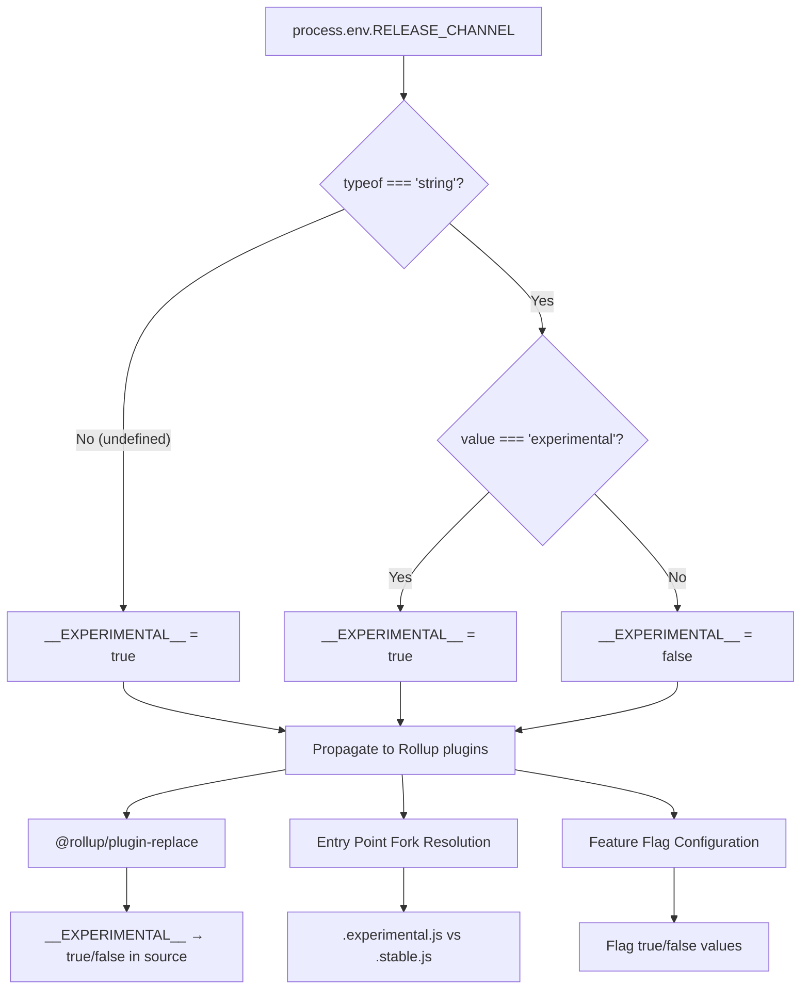
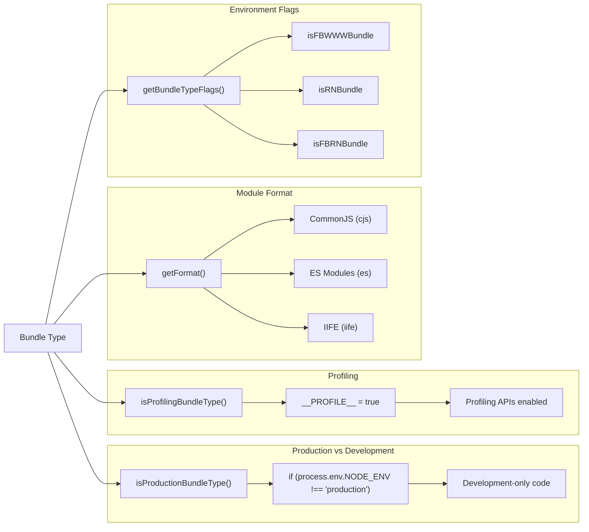
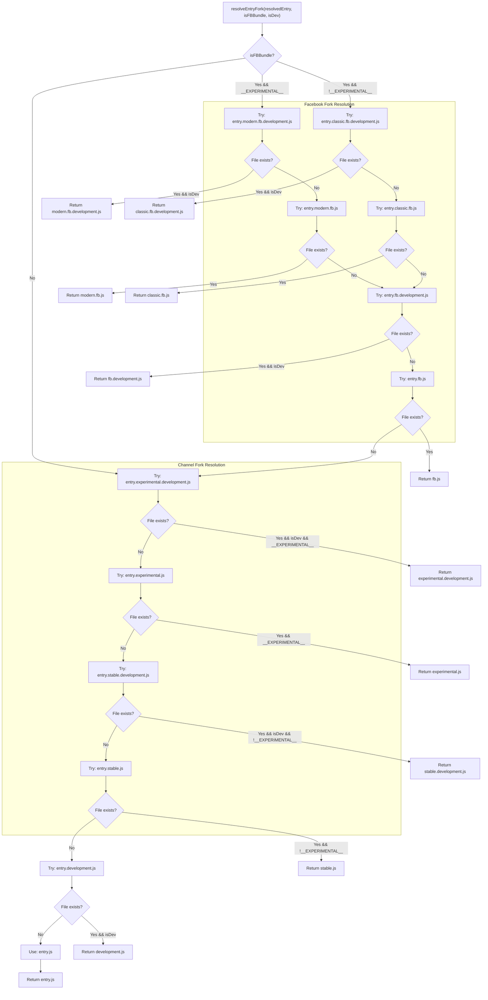
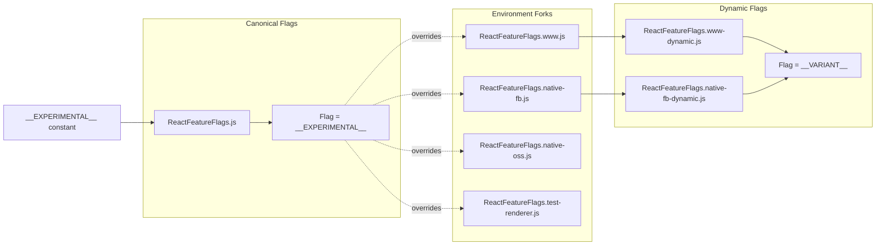
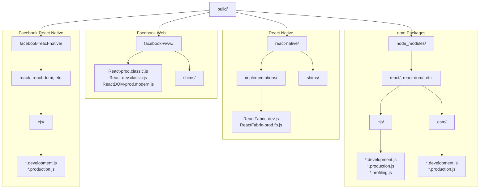
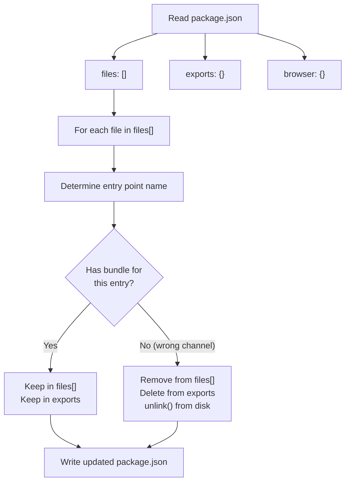

# 发布渠道与版本管理

<!-- > 来源：https://deepwiki.com/facebook/react/3.2-release-channels-and-versioning -->

<details>
<summary>相关源文件</summary>

以下文件被用作生成此 wiki 页面的上下文：

- [packages/react-dom/npm/server.browser.js](packages/react-dom/npm/server.browser.js)
- [packages/react-dom/npm/server.bun.js](packages/react-dom/npm/server.bun.js)
- [packages/react-dom/npm/server.edge.js](packages/react-dom/npm/server.edge.js)
- [packages/react-dom/npm/server.node.js](packages/react-dom/npm/server.node.js)
- [packages/react-dom/server.browser.js](packages/react-dom/server.browser.js)
- [packages/react-dom/server.bun.js](packages/react-dom/server.bun.js)
- [packages/react-dom/server.edge.js](packages/react-dom/server.edge.js)
- [packages/react-dom/server.node.js](packages/react-dom/server.node.js)
- [packages/react-dom/src/server/react-dom-server.bun.js](packages/react-dom/src/server/react-dom-server.bun.js)
- [packages/react-dom/src/server/react-dom-server.bun.stable.js](packages/react-dom/src/server/react-dom-server.bun.stable.js)
- [packages/shared/ReactFeatureFlags.js](packages/shared/ReactFeatureFlags.js)
- [packages/shared/forks/ReactFeatureFlags.native-fb-dynamic.js](packages/shared/forks/ReactFeatureFlags.native-fb-dynamic.js)
- [packages/shared/forks/ReactFeatureFlags.native-fb.js](packages/shared/forks/ReactFeatureFlags.native-fb.js)
- [packages/shared/forks/ReactFeatureFlags.native-oss.js](packages/shared/forks/ReactFeatureFlags.native-oss.js)
- [packages/shared/forks/ReactFeatureFlags.test-renderer.js](packages/shared/forks/ReactFeatureFlags.test-renderer.js)
- [packages/shared/forks/ReactFeatureFlags.test-renderer.native-fb.js](packages/shared/forks/ReactFeatureFlags.test-renderer.native-fb.js)
- [packages/shared/forks/ReactFeatureFlags.test-renderer.www.js](packages/shared/forks/ReactFeatureFlags.test-renderer.www.js)
- [packages/shared/forks/ReactFeatureFlags.www-dynamic.js](packages/shared/forks/ReactFeatureFlags.www-dynamic.js)
- [packages/shared/forks/ReactFeatureFlags.www.js](packages/shared/forks/ReactFeatureFlags.www.js)
- [scripts/flow/xplat.js](scripts/flow/xplat.js)
- [scripts/jest/setupHostConfigs.js](scripts/jest/setupHostConfigs.js)
- [scripts/rollup/build.js](scripts/rollup/build.js)
- [scripts/rollup/bundles.js](scripts/rollup/bundles.js)
- [scripts/rollup/forks.js](scripts/rollup/forks.js)
- [scripts/rollup/modules.js](scripts/rollup/modules.js)
- [scripts/rollup/packaging.js](scripts/rollup/packaging.js)
- [scripts/rollup/sync.js](scripts/rollup/sync.js)
- [scripts/rollup/validate/index.js](scripts/rollup/validate/index.js)
- [scripts/rollup/wrappers.js](scripts/rollup/wrappers.js)
- [scripts/shared/inlinedHostConfigs.js](scripts/shared/inlinedHostConfigs.js)

</details>


## 目的与范围

本文档介绍 React 的 Release Channel 系统和版本管理策略，该系统使代码库能够从单一源码树向不同环境发布不同的功能集。Release Channel 系统决定了构建中包含哪些 Experimental 功能、如何解析入口点，以及构建产物放置的位置。

关于 Feature Flags 如何在 Release Channel 内控制单个功能的详细信息，请参阅 [Feature Flags System](#2)。关于处理这些 Channel 的构建流水线的详细信息，请参阅 [Build Pipeline and Module Forking](#3.1)。

---

## Release Channel 基础

React 使用 Release Channel 系统来控制构建时启用哪些功能。`RELEASE_CHANNEL` 环境变量决定 Channel，该变量在整个构建系统中作为 `__EXPERIMENTAL__` 常量传播。

### Channel 类型

| Channel | __EXPERIMENTAL__ 值 | 用途 |
|---------|----------------------|---------|
| `experimental` | `true` | 包含所有 Experimental 功能，用于 Canary 发布和内部测试 |
| `stable`（默认） | `true`（未设置时） | 仅包含稳定功能的标准发布 |
| Facebook 特定 | 可变 | Facebook 内部构建可能使用自定义 Channel |

核心逻辑出现在 [scripts/rollup/bundles.js:3-8]() 和 [scripts/rollup/build.js:31-38]()：

```javascript
const RELEASE_CHANNEL = process.env.RELEASE_CHANNEL;

const __EXPERIMENTAL__ =
  typeof RELEASE_CHANNEL === 'string'
    ? RELEASE_CHANNEL === 'experimental'
    : true;
```

**关键行为**：当 `RELEASE_CHANNEL` 未定义时，`__EXPERIMENTAL__` 默认为 `true`，使 Experimental 成为开发期间的默认值。

### Release Channel 流程



来源：[scripts/rollup/bundles.js:3-8]()、[scripts/rollup/build.js:31-38]()、[scripts/rollup/build.js:432-442]()

---

## Bundle 类型与目标环境

React 为不同环境、运行时和优化级别生成多个 Bundle 变体。这些 Bundle 类型与 Release Channel 形成矩阵，以确定最终的构建产物。

### Bundle 类型分类

构建系统在 [scripts/rollup/bundles.js:10-31]() 中定义 Bundle 类型：

**Node.js Bundles**
- `NODE_ES2015` - 适用于现代 Node 的 ES2015+ 语法
- `NODE_DEV` - 带守卫的开发构建
- `NODE_PROD` - 压缩的生产构建
- `NODE_PROFILING` - 启用性能分析的构建

**Browser Bundles**
- `ESM_DEV` - 用于开发的 ES 模块
- `ESM_PROD` - 用于生产的 ES 模块
- `BROWSER_SCRIPT` - 独立的浏览器脚本

**Facebook 内部**
- `FB_WWW_DEV` - Facebook Web 开发
- `FB_WWW_PROD` - Facebook Web 生产
- `FB_WWW_PROFILING` - 启用性能分析的 Facebook Web

**React Native**
- `RN_OSS_DEV/PROD/PROFILING` - 开源 React Native
- `RN_FB_DEV/PROD/PROFILING` - Facebook 内部 React Native

**Bun 运行时**
- `BUN_DEV` - Bun 开发构建
- `BUN_PROD` - Bun 生产构建

### Bundle 类型特征



分类逻辑在 [scripts/rollup/build.js:253-310]()：

```javascript
function isProductionBundleType(bundleType) {
  switch (bundleType) {
    case NODE_DEV:
    case FB_WWW_DEV:
    case RN_OSS_DEV:
      return false;
    case NODE_PROD:
    case FB_WWW_PROD:
      return true;
    // ...
  }
}
```

来源：[scripts/rollup/bundles.js:10-54]()、[scripts/rollup/build.js:225-310]()、[scripts/rollup/build.js:312-338]()

---

## 入口点 Fork 解析

React 使用文件命名约定为不同的 Release Channel 和环境提供不同的实现。构建系统在构建时解析这些 "fork"。

### Fork 解析优先级

入口点按以下优先级顺序解析，从最具体到最不具体：

1. `.modern.fb.js` / `.classic.fb.js`（Facebook 构建）
2. `.fb.js`（通用 Facebook）
3. `.experimental.js` / `.stable.js`（Release Channel）
4. `.development.js`（开发模式）
5. `.js`（基础文件）

### 入口点解析算法



实现在 [scripts/rollup/build.js:585-633]()：

```javascript
function resolveEntryFork(resolvedEntry, isFBBundle, isDev) {
  if (isFBBundle) {
    const resolvedFBEntry = resolvedEntry.replace(
      '.js',
      __EXPERIMENTAL__ ? '.modern.fb.js' : '.classic.fb.js'
    );
    const devFBEntry = resolvedFBEntry.replace('.js', '.development.js');
    if (isDev && fs.existsSync(devFBEntry)) {
      return devFBEntry;
    }
    if (fs.existsSync(resolvedFBEntry)) {
      return resolvedFBEntry;
    }
    // Falls through to generic .fb.js, then to channel forks
  }
  
  const resolvedForkedEntry = resolvedEntry.replace(
    '.js',
    __EXPERIMENTAL__ ? '.experimental.js' : '.stable.js'
  );
  // ...
}
```

来源：[scripts/rollup/build.js:585-633]()、[scripts/jest/setupHostConfigs.js:7-99]()

---

## 与 Feature Flags 的交互

Release Channel 直接影响加载哪些 Feature Flag 配置。Fork 解析系统（在 [Feature Flags System](#2) 中记录）根据 Bundle 类型和 Release Channel 选择 Flag 文件。

### Feature Flag Fork 选择

[scripts/rollup/forks.js:134-191]() 中的 Feature Flag Fork 逻辑展示了这种关系：

```javascript
'./packages/shared/ReactFeatureFlags.js': (bundleType, entry) => {
  switch (entry) {
    case 'react-native-renderer':
      switch (bundleType) {
        case RN_FB_DEV:
        case RN_FB_PROD:
          return './packages/shared/forks/ReactFeatureFlags.native-fb.js';
        case RN_OSS_DEV:
        case RN_OSS_PROD:
          return './packages/shared/forks/ReactFeatureFlags.native-oss.js';
      }
    default:
      switch (bundleType) {
        case FB_WWW_DEV:
        case FB_WWW_PROD:
          return './packages/shared/forks/ReactFeatureFlags.www.js';
      }
  }
  return null; // Use canonical flags
}
```

### 依赖 Channel 的 Flag 值

某些 Flag 的值由 `__EXPERIMENTAL__` 控制：



[packages/shared/ReactFeatureFlags.js:75-100]() 中的示例：

```javascript
export const enableLegacyCache = __EXPERIMENTAL__;
export const enableAsyncIterableChildren = __EXPERIMENTAL__;
export const enableTaint = __EXPERIMENTAL__;
export const enableGestureTransition = __EXPERIMENTAL__;
export const enableFizzBlockingRender = __EXPERIMENTAL__;
```

来源：[scripts/rollup/forks.js:134-191]()、[packages/shared/ReactFeatureFlags.js:75-100]()、[packages/shared/forks/ReactFeatureFlags.www.js:1-119]()

---

## 构建输出组织

构建产物按环境组织，不同部署目标使用不同的目录结构。

### 输出路径解析

[scripts/rollup/packaging.js:48-115]() 中的 `getBundleOutputPath()` 函数决定每个 Bundle 的写入位置：

| Bundle 类型 | 输出路径模式 | 示例 |
|-------------|-------------------|---------|
| NODE_ES2015, NODE_DEV, NODE_PROD, NODE_PROFILING | `build/node_modules/{package}/cjs/{filename}` | `build/node_modules/react/cjs/react.development.js` |
| ESM_DEV, ESM_PROD | `build/node_modules/{package}/esm/{filename}` | `build/node_modules/react/esm/react.development.js` |
| BUN_DEV, BUN_PROD | `build/node_modules/{package}/cjs/{filename}` | `build/node_modules/react-dom/cjs/react-dom-server.bun.development.js` |
| FB_WWW_* | `build/facebook-www/{filename}` | `build/facebook-www/React-prod.classic.js` |
| RN_OSS_* | `build/react-native/implementations/{filename}` | `build/react-native/implementations/ReactFabric-prod.js` |
| RN_FB_*（大多数包） | `build/facebook-react-native/{package}/cjs/{filename}` | `build/facebook-react-native/react/cjs/react.production.js` |
| RN_FB_*（渲染器） | `build/react-native/implementations/{filename}.fb.js` | `build/react-native/implementations/ReactFabric-prod.fb.js` |
| BROWSER_SCRIPT | `build/node_modules/{package}/{outputPath}` | `build/node_modules/react-dom/unstable_server-external-runtime.js` |

### 构建目录结构



来源：[scripts/rollup/packaging.js:48-115]()、[scripts/rollup/packaging.js:117-137]()

---

## 包准备与分发

构建后，包会经过准备步骤以使其准备好分发。该过程因目标环境而异。

### npm 包准备

[scripts/rollup/packaging.js:253-284]() 中的 `prepareNpmPackages()` 函数执行以下步骤：

1. **复制包元数据**：LICENSE、package.json、README.md、npm/ 目录
2. **过滤入口点**：使用 `filterOutEntrypoints()` 移除未为当前 Channel 构建的入口点
3. **打包和解压**：使用 `npm pack` 创建 tarball，然后解压

### 入口点过滤

[scripts/rollup/packaging.js:171-251]() 中的 `filterOutEntrypoints()` 函数从 package.json 中移除未为当前 Release Channel 构建的入口点：



该函数使用在 [scripts/rollup/packaging.js:158-169]() 中构建的 `entryPointsToHasBundle` 映射：

```javascript
let entryPointsToHasBundle = new Map();
for (const bundle of Bundles.bundles) {
  const hasNonFBBundleTypes = bundle.bundleTypes.some(
    type =>
      type !== FB_WWW_DEV && type !== FB_WWW_PROD && type !== FB_WWW_PROFILING
  );
  entryPointsToHasBundle.set(bundle.entry, hasNonFBBundleTypes);
}
```

这确保了如果 Bundle 仅针对 Facebook 内部使用构建，它不会出现在公共 npm 包中。

### 条件包导出

React 使用 package.json 的 `exports` 字段根据环境提供不同的入口点。入口点可能包含 `.react-server` 或 `.rsc` 等后缀，这些后缀从基础入口点继承其 Bundle 状态：

```javascript
if (entry.endsWith('.react-server')) {
  hasBundle = entryPointsToHasBundle.get(
    entry.slice(0, '.react-server'.length * -1)
  );
} else if (entry.endsWith('.rsc')) {
  hasBundle = entryPointsToHasBundle.get(
    entry.slice(0, '.rsc'.length * -1)
  );
}
```

来自 [scripts/rollup/packaging.js:197-205]()。

### 服务器入口点分发

React 提供多个服务器渲染入口点，根据 `process.env.NODE_ENV` 进行条件加载。这些在 npm 包装文件中演示：

**Node.js Server** - [packages/react-dom/npm/server.node.js:1-19]()：
```javascript
var l, s;
if (process.env.NODE_ENV === 'production') {
  l = require('./cjs/react-dom-server-legacy.node.production.js');
  s = require('./cjs/react-dom-server.node.production.js');
} else {
  l = require('./cjs/react-dom-server-legacy.node.development.js');
  s = require('./cjs/react-dom-server.node.development.js');
}

exports.renderToString = l.renderToString;
exports.renderToStaticMarkup = l.renderToStaticMarkup;
exports.renderToPipeableStream = s.renderToPipeableStream;
```

**Browser Server** - [packages/react-dom/npm/server.browser.js:1-17]()

**Bun Server** - [packages/react-dom/npm/server.bun.js:1-20]()

**Edge Runtime** - [packages/react-dom/npm/server.edge.js:1-18]()

每个运行时根据能力提供略有不同的 API 表面。例如，`renderToPipeableStream` 仅在 Node.js 和 Bun 中可用，在浏览器中不可用。

来源：[scripts/rollup/packaging.js:158-273]()、[packages/react-dom/npm/server.node.js:1-19]()、[packages/react-dom/npm/server.browser.js:1-17]()、[packages/react-dom/npm/server.bun.js:1-20]()

---

## 测试中的 Release Channel 使用

测试基础设施通过环境设置遵循 Release Channel。[scripts/jest/setupHostConfigs.js:7-99]() 中的 `setupHostConfigs.js` 文件使用相同的 `resolveEntryFork()` 逻辑来确保测试加载正确的入口点。

### 测试环境全局变量

测试可以设置全局 Flag 来模拟不同环境：

- `global.__WWW__` - 模拟 Facebook Web 环境
- `global.__XPLAT__` - 模拟跨平台（React Native）环境  
- `global.__DEV__` - 模拟开发与生产模式
- `__EXPERIMENTAL__` - 根据测试配置设置，以模拟不同的 Channel

这些全局变量与 `resolveEntryFork()` 交互以加载适当的模块变体：

```javascript
function mockReact() {
  jest.mock('react', () => {
    const resolvedEntryPoint = resolveEntryFork(
      require.resolve('react'),
      global.__WWW__ || global.__XPLAT__,
      global.__DEV__
    );
    return jest.requireActual(resolvedEntryPoint);
  });
}
```

来自 [scripts/jest/setupHostConfigs.js:101-115]()。

来源：[scripts/jest/setupHostConfigs.js:7-115]()
