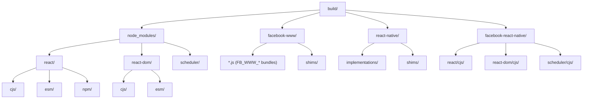
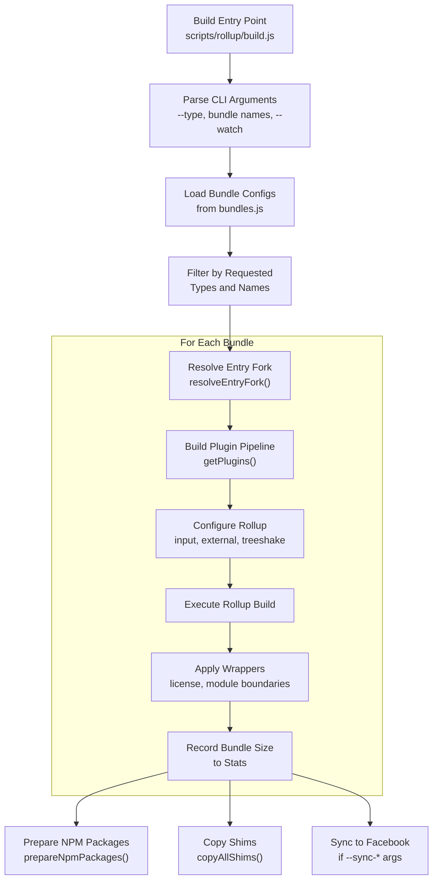
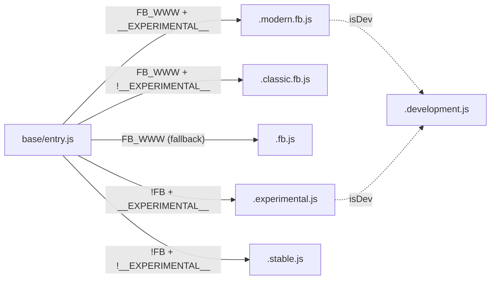
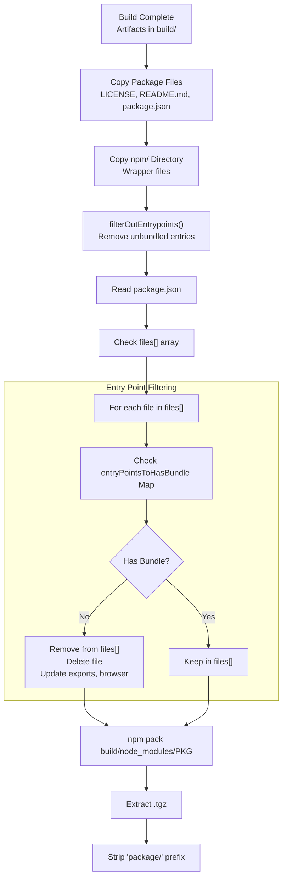
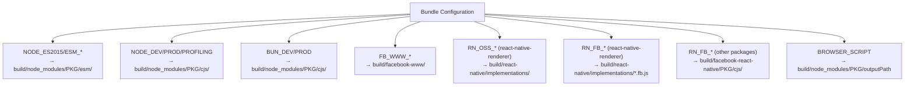
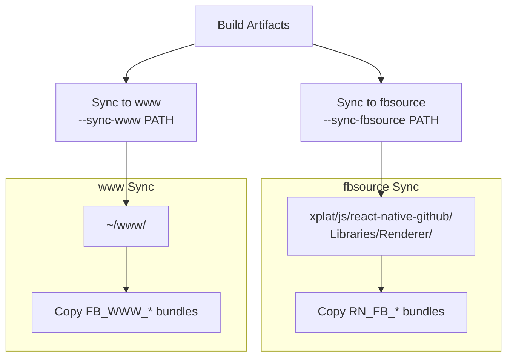
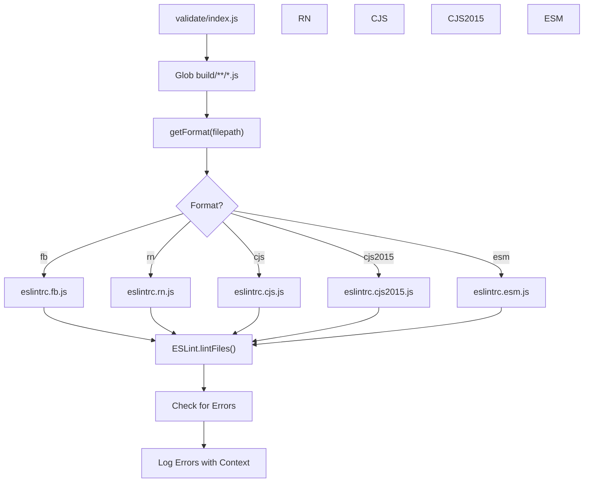
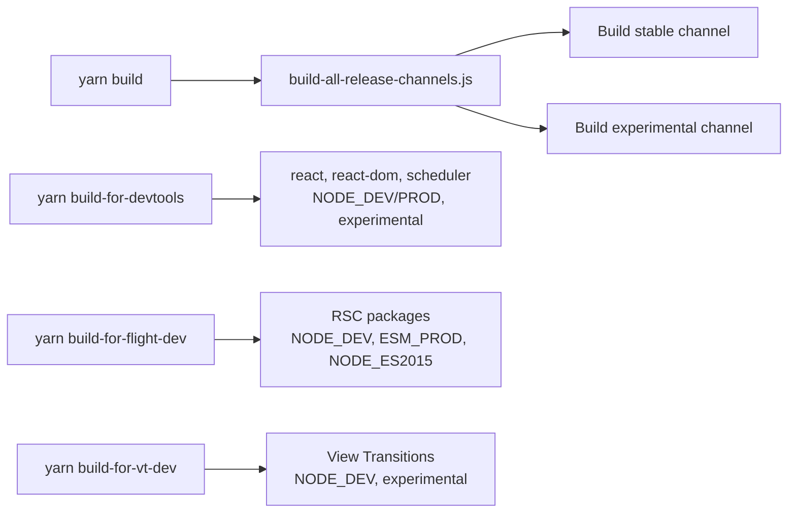

# CI/CD 与构建产物管理

<!-- > 来源：https://deepwiki.com/facebook/react/3.3-cicd-and-artifact-management -->

<details>
<summary>相关源文件</summary>

以下文件用于生成此 wiki 页面的上下文：

- [.eslintrc.js](.eslintrc.js)
- [package.json](package.json)
- [packages/eslint-plugin-react-hooks/package.json](packages/eslint-plugin-react-hooks/package.json)
- [packages/jest-react/package.json](packages/jest-react/package.json)
- [packages/react-art/package.json](packages/react-art/package.json)
- [packages/react-dom/npm/server.browser.js](packages/react-dom/npm/server.browser.js)
- [packages/react-dom/npm/server.bun.js](packages/react-dom/npm/server.bun.js)
- [packages/react-dom/npm/server.edge.js](packages/react-dom/npm/server.edge.js)
- [packages/react-dom/npm/server.node.js](packages/react-dom/npm/server.node.js)
- [packages/react-dom/package.json](packages/react-dom/package.json)
- [packages/react-dom/server.browser.js](packages/react-dom/server.browser.js)
- [packages/react-dom/server.bun.js](packages/react-dom/server.bun.js)
- [packages/react-dom/server.edge.js](packages/react-dom/server.edge.js)
- [packages/react-dom/server.node.js](packages/react-dom/server.node.js)
- [packages/react-dom/src/server/react-dom-server.bun.js](packages/react-dom/src/server/react-dom-server.bun.js)
- [packages/react-dom/src/server/react-dom-server.bun.stable.js](packages/react-dom/src/server/react-dom-server.bun.stable.js)
- [packages/react-is/package.json](packages/react-is/package.json)
- [packages/react-native-renderer/package.json](packages/react-native-renderer/package.json)
- [packages/react-noop-renderer/package.json](packages/react-noop-renderer/package.json)
- [packages/react-reconciler/package.json](packages/react-reconciler/package.json)
- [packages/react-test-renderer/package.json](packages/react-test-renderer/package.json)
- [packages/react/package.json](packages/react/package.json)
- [packages/scheduler/package.json](packages/scheduler/package.json)
- [packages/shared/ReactVersion.js](packages/shared/ReactVersion.js)
- [scripts/flow/config/flowconfig](scripts/flow/config/flowconfig)
- [scripts/flow/createFlowConfigs.js](scripts/flow/createFlowConfigs.js)
- [scripts/flow/environment.js](scripts/flow/environment.js)
- [scripts/jest/setupHostConfigs.js](scripts/jest/setupHostConfigs.js)
- [scripts/rollup/build.js](scripts/rollup/build.js)
- [scripts/rollup/bundles.js](scripts/rollup/bundles.js)
- [scripts/rollup/forks.js](scripts/rollup/forks.js)
- [scripts/rollup/modules.js](scripts/rollup/modules.js)
- [scripts/rollup/packaging.js](scripts/rollup/packaging.js)
- [scripts/rollup/sync.js](scripts/rollup/sync.js)
- [scripts/rollup/validate/eslintrc.cjs.js](scripts/rollup/validate/eslintrc.cjs.js)
- [scripts/rollup/validate/eslintrc.cjs2015.js](scripts/rollup/validate/eslintrc.cjs2015.js)
- [scripts/rollup/validate/eslintrc.esm.js](scripts/rollup/validate/eslintrc.esm.js)
- [scripts/rollup/validate/eslintrc.fb.js](scripts/rollup/validate/eslintrc.fb.js)
- [scripts/rollup/validate/eslintrc.rn.js](scripts/rollup/validate/eslintrc.rn.js)
- [scripts/rollup/validate/index.js](scripts/rollup/validate/index.js)
- [scripts/rollup/wrappers.js](scripts/rollup/wrappers.js)
- [scripts/shared/inlinedHostConfigs.js](scripts/shared/inlinedHostConfigs.js)
- [yarn.lock](yarn.lock)

</details>


本文档介绍 React 仓库中的构建产物生成、打包和分发系统。涵盖生成多种 bundle 变体的构建 pipeline、npm 包准备、Facebook 内部同步以及验证流程。

关于构建系统的 bundle 配置和插件 pipeline，请参阅[构建 Pipeline 与模块分叉](#3.1)。关于发布渠道管理，请参阅[发布渠道与版本管理](#3.2)。

---

## 构建产物结构

React 构建系统生成多种格式和配置的产物，按部署目标和环境组织。

### Bundle 类型

构建系统生成 13 种不同的 bundle 类型，每种针对特定的运行时环境：

| Bundle 类型 | 格式 | 环境 | 用途 |
|------------|--------|-------------|---------|
| `NODE_ES2015` | CJS | Node.js | ES2015+ 特性，现代 Node |
| `NODE_DEV` | CJS | Node.js | 开发环境，包含 DEV 检查 |
| `NODE_PROD` | CJS | Node.js | 生产环境，已压缩 |
| `NODE_PROFILING` | CJS | Node.js | 生产环境，包含性能分析 |
| `BUN_DEV` | CJS | Bun 运行时 | Bun 开发环境 |
| `BUN_PROD` | CJS | Bun 运行时 | Bun 生产环境 |
| `ESM_DEV` | ESM | 浏览器/打包工具 | ES Module 开发环境 |
| `ESM_PROD` | ESM | 浏览器/打包工具 | ES Module 生产环境 |
| `FB_WWW_DEV` | CJS | Facebook web | 内部开发环境 |
| `FB_WWW_PROD` | CJS | Facebook web | 内部生产环境 |
| `FB_WWW_PROFILING` | CJS | Facebook web | 内部性能分析 |
| `RN_OSS_DEV` | CJS | React Native OSS | RN 开源开发环境 |
| `RN_OSS_PROD` | CJS | React Native OSS | RN 开源生产环境 |
| `RN_OSS_PROFILING` | CJS | React Native OSS | RN 开源性能分析 |
| `RN_FB_DEV` | CJS | React Native FB | RN 内部开发环境 |
| `RN_FB_PROD` | CJS | React Native FB | RN 内部生产环境 |
| `RN_FB_PROFILING` | CJS | React Native FB | RN 内部性能分析 |
| `BROWSER_SCRIPT` | IIFE | 浏览器 | 直接脚本引入 |

**来源：** [scripts/rollup/bundles.js:10-31](), [scripts/rollup/build.js:50-71]()

### 输出目录结构



**来源：** [scripts/rollup/packaging.js:48-114]()

---

## 构建 Pipeline

### 构建编排

构建过程由 `build.js` 编排，协调所有配置的 bundle 生成：



**来源：** [scripts/rollup/build.js:635-785](), [scripts/rollup/build.js:94-108]()

### 入口点解析

入口点使用分叉机制选择特定环境的实现：



**来源：** [scripts/rollup/build.js:585-633]()

### 插件 Pipeline

每种 bundle 类型使用自定义的 Rollup 插件 pipeline：

```mermaid
graph TB
    SourceCode["Source Code<br/>(Flow/TypeScript)"]
    
    subgraph "Preprocessing"
        DynamicImports["dynamicImports()<br/>Keep dynamic imports external"]
        TypeRemoval["Flow/TypeScript Removal<br/>flowRemoveTypes() or typescript()"]
        CommonJS["commonjs()<br/>For TypeScript bundles only"]
    end
    
    subgraph "Module Resolution"
        Forks["useForks()<br/>Environment-specific modules"]
        ForbidFB["forbidFBJSImports()<br/>Prevent fbjs imports"]
        Resolve["resolve()<br/>Node module resolution"]
    end
    
    subgraph "Transformation"
        StripBanner["stripBanner()<br/>Remove license headers"]
        Babel["babel()<br/>ES2015+ → ES5"]
        RemoveStrict["Remove 'use strict'"]
        Replace["replace()<br/>__DEV__, __PROFILE__, etc"]
        External["externalRuntime()<br/>For server-external-runtime"]
    end
    
    subgraph "Optimization"
        TopLevel["wrapWithTopLevelDefinitions()<br/>Module boundaries"]
        Closure["closure()<br/>Google Closure Compiler"]
        Prettier["prettier()<br/>Format output"]
    end
    
    subgraph "Finalization"
        License["wrapWithLicenseHeader()"]
        Sizes["sizes()<br/>Record bundle metrics"]
    end
    
    SourceCode --> DynamicImports
    DynamicImports --> TypeRemoval
    TypeRemoval --> CommonJS
    CommonJS --> Forks
    Forks --> ForbidFB
    ForbidFB --> Resolve
    Resolve --> StripBanner
    StripBanner --> Babel
    Babel --> RemoveStrict
    RemoveStrict --> Replace
    Replace --> External
    External --> TopLevel
    TopLevel --> Closure
    Closure --> Prettier
    Prettier --> License
    License --> Sizes
```



**来源：** [scripts/rollup/build.js:354-546]()

---

## 包准备

### NPM 包生成流程

构建完成后，产物会被准备用于 npm 分发：



**来源：** [scripts/rollup/packaging.js:253-273](), [scripts/rollup/packaging.js:171-251]()

### 包结构示例（react-dom）

`react-dom` 包展示了多环境入口点：

| 入口点 | 文件 | 条件 | Bundle 类型 |
|-------------|------|-----------|-------------|
| `.` | `index.js` | default | NODE_DEV/PROD |
| `.` | `react-dom.react-server.js` | react-server | SERVER |
| `./client` | `client.js` | default | NODE_DEV/PROD |
| `./client` | `client.react-server.js` | react-server | SERVER |
| `./server` | `server.node.js` | node | NODE_DEV/PROD |
| `./server` | `server.browser.js` | browser/worker | BROWSER |
| `./server` | `server.edge.js` | edge-light/workerd | EDGE |
| `./server` | `server.bun.js` | bun | BUN_DEV/PROD |
| `./profiling` | `profiling.js` | default | NODE_PROFILING |
| `./test-utils` | `test-utils.js` | default | NODE_DEV/PROD |

**来源：** [packages/react-dom/package.json:51-125]()

### Bundle 输出路径映射

`getBundleOutputPath()` 函数将 bundle 映射到其目标路径：



**来源：** [scripts/rollup/packaging.js:48-114]()

---

## Facebook 内部同步

### 同步基础设施

`sync.js` 模块提供工具，将构建产物复制到 Facebook 内部仓库：



**来源：** [scripts/rollup/sync.js:1-47]()

### Shim 文件

特定环境的 shim 文件会被复制到构建输出：

- **Facebook WWW**: [scripts/rollup/shims/facebook-www]() → `build/facebook-www/shims/`
- **React Native**: [scripts/rollup/shims/react-native]() → `build/react-native/shims/`
- **RN Types**: [react-native-renderer/src/ReactNativeTypes.js]() → `build/react-native/shims/ReactNativeTypes.js`

**来源：** [scripts/rollup/packaging.js:117-137]()

---

## 构建验证

### 产物 Linting 系统

构建完成后，所有产物使用 ESLint 进行验证，采用特定环境的配置：



**来源：** [scripts/rollup/validate/index.js:11-100]()

### 特定环境的 ESLint 规则

每种构建格式都有特定的全局变量和语法约束：

| 格式 | 解析器 | ECMAScript | 唯一全局变量 |
|--------|--------|------------|----------------|
| `fb` | ESLint (ES5) | ES5 | `__DEV__` |
| `rn` | ESLint (ES5) | ES5 | `__DEV__`, `nativeFabricUIManager`, `RN$enableMicrotasksInReact` |
| `cjs` | ESLint (ES2020) | ES2020 | Node.js 全局变量（`process`, `Buffer`, `setImmediate`） |
| `cjs2015` | ESLint (ES2020) | ES2020 | 与 CJS 相同，外加 ES2015+ 特性 |
| `esm` | ESLint (ES2020) | ES2020 | 与 CJS 相同 |

所有格式都验证：
- 无未定义变量（`no-undef`）
- 无遮蔽受限名称（`no-shadow-restricted-names`）
- 无 `JSCompiler_OptimizeArgumentsArray_*` 标识符（GCC 优化产物）

**来源：** [scripts/rollup/validate/eslintrc.fb.js:1-112](), [scripts/rollup/validate/eslintrc.rn.js:1-97](), [scripts/rollup/validate/eslintrc.cjs.js:1-111](), [scripts/rollup/validate/eslintrc.cjs2015.js:1-111](), [scripts/rollup/validate/eslintrc.esm.js:1-112]()

---

## 构建脚本集成

### 主要构建命令

根目录 `package.json` 定义了构建 workflow：



关键命令参数：
- `--type=BUNDLE_TYPE`: 按 bundle 类型过滤（例如：`NODE_DEV`、`FB_WWW_PROD`）
- Bundle 名称：按入口点过滤（例如：`react/index`、`react-dom/server`）
- `--watch`: 启用 watch 模式用于开发
- `--sync-fbsource PATH`: 同步到 Facebook 内部 monorepo
- `--sync-www PATH`: 同步到 Facebook www 仓库

**来源：** [package.json:124-157]()

### 发布渠道环境变量

`RELEASE_CHANNEL` 环境变量控制使用哪个特性标志分叉：

- `RELEASE_CHANNEL=experimental`: 启用实验性特性，使用 `.experimental.js` 分叉
- `RELEASE_CHANNEL=stable`: 使用稳定特性标志，使用 `.stable.js` 分叉
- 未定义：默认为 experimental

**来源：** [scripts/rollup/build.js:31-38](), [scripts/rollup/bundles.js:3-8]()

---

## 产物元数据

### Bundle 大小追踪

`sizes-plugin` 在构建过程中记录 bundle 大小：

```javascript
// In getPlugins()
sizes({
  getSize: (size, gzip) => {
    const currentSizes = Stats.currentBuildResults.bundleSizes;
    const recordIndex = currentSizes.findIndex(
      record =>
        record.filename === filename && record.bundleType === bundleType
    );
    const index = recordIndex !== -1 ? recordIndex : currentSizes.length;
    currentSizes[index] = {
      filename,
      bundleType,
      packageName,
      size,
      gzip,
    };
  },
})
```

这些数据存储在 `Stats` 模块中，用于大小回归分析。

**来源：** [scripts/rollup/build.js:522-538]()

### 版本管理

规范版本维护在 `ReactVersion.js` 中：

```javascript
export default '19.3.0';
```

此版本用于：
- 运行时用于 DevTools 兼容性
- 在包准备期间注入到 package.json 文件
- 由发布脚本引用

**来源：** [packages/shared/ReactVersion.js:1-16](), [packages/react/package.json:7](), [packages/react-dom/package.json:3]()

---

## 代码包装与头部

### 模块边界包装器

`wrappers.js` 模块提供特定环境的代码包装：

**开发 Bundle（NODE_DEV, FB_WWW_DEV, RN_OSS_DEV, RN_FB_DEV）**：
```javascript
'use strict';

if (__DEV__) {  // or process.env.NODE_ENV !== "production"
  (function() {
    // Bundle code here
  })();
}
```

**生产 Bundle**：无包装，直接执行

**带 DevTools 的 Reconciler Bundle**：
```javascript
'use strict';
if (typeof __REACT_DEVTOOLS_GLOBAL_HOOK__ !== 'undefined' &&
    typeof __REACT_DEVTOOLS_GLOBAL_HOOK__.registerInternalModuleStart === 'function') {
  __REACT_DEVTOOLS_GLOBAL_HOOK__.registerInternalModuleStart(new Error());
}
// Bundle code
if (typeof __REACT_DEVTOOLS_GLOBAL_HOOK__ !== 'undefined' &&
    typeof __REACT_DEVTOOLS_GLOBAL_HOOK__.registerInternalModuleStop === 'function') {
  __REACT_DEVTOOLS_GLOBAL_HOOK__.registerInternalModuleStop(new Error());
}
```

**来源：** [scripts/rollup/wrappers.js:32-169]()

### 许可证头部

所有生产产物都包含 MIT 许可证头部：

```
/**
 * Copyright (c) Meta Platforms, Inc. and affiliates.
 *
 * This source code is licensed under the MIT license found in the
 * LICENSE file in the root directory of this source tree.
 */
```

**来源：** [scripts/rollup/wrappers.js:53-56]()
