# React Reconciler

<!-- > Source: https://deepwiki.com/facebook/react/4-react-reconciler -->

<details>
<summary>相关源文件</summary>

以下文件用于生成此 wiki 页面：

- [packages/react-client/src/ReactFlightPerformanceTrack.js](https://github.com/facebook/react/blob/main/packages/react-client/src/ReactFlightPerformanceTrack.js)
- [packages/react-debug-tools/src/ReactDebugHooks.js](https://github.com/facebook/react/blob/main/packages/react-debug-tools/src/ReactDebugHooks.js)
- [packages/react-debug-tools/src/**tests**/ReactHooksInspection-test.js](https://github.com/facebook/react/blob/main/packages/react-debug-tools/src/**tests**/ReactHooksInspection-test.js)
- [packages/react-debug-tools/src/**tests**/ReactHooksInspectionIntegration-test.js](https://github.com/facebook/react/blob/main/packages/react-debug-tools/src/**tests**/ReactHooksInspectionIntegration-test.js)
- [packages/react-debug-tools/src/**tests**/ReactHooksInspectionIntegrationDOM-test.js](https://github.com/facebook/react/blob/main/packages/react-debug-tools/src/**tests**/ReactHooksInspectionIntegrationDOM-test.js)
- [packages/react-devtools-shell/src/app/InspectableElements/CustomHooks.js](https://github.com/facebook/react/blob/main/packages/react-devtools-shell/src/app/InspectableElements/CustomHooks.js)
- [packages/react-dom/index.js](https://github.com/facebook/react/blob/main/packages/react-dom/index.js)
- [packages/react-dom/src/**tests**/ReactDOMFiberAsync-test.js](https://github.com/facebook/react/blob/main/packages/react-dom/src/**tests**/ReactDOMFiberAsync-test.js)
- [packages/react-dom/src/**tests**/refs-test.js](https://github.com/facebook/react/blob/main/packages/react-dom/src/**tests**/refs-test.js)
- [packages/react-reconciler/src/ReactChildFiber.js](https://github.com/facebook/react/blob/main/packages/react-reconciler/src/ReactChildFiber.js)
- [packages/react-reconciler/src/ReactFiber.js](https://github.com/facebook/react/blob/main/packages/react-reconciler/src/ReactFiber.js)
- [packages/react-reconciler/src/ReactFiberBeginWork.js](https://github.com/facebook/react/blob/main/packages/react-reconciler/src/ReactFiberBeginWork.js)
- [packages/react-reconciler/src/ReactFiberClassComponent.js](https://github.com/facebook/react/blob/main/packages/react-reconciler/src/ReactFiberClassComponent.js)
- [packages/react-reconciler/src/ReactFiberCommitWork.js](https://github.com/facebook/react/blob/main/packages/react-reconciler/src/ReactFiberCommitWork.js)
- [packages/react-reconciler/src/ReactFiberCompleteWork.js](https://github.com/facebook/react/blob/main/packages/react-reconciler/src/ReactFiberCompleteWork.js)
- [packages/react-reconciler/src/ReactFiberHooks.js](https://github.com/facebook/react/blob/main/packages/react-reconciler/src/ReactFiberHooks.js)
- [packages/react-reconciler/src/ReactFiberLane.js](https://github.com/facebook/react/blob/main/packages/react-reconciler/src/ReactFiberLane.js)
- [packages/react-reconciler/src/ReactFiberPerformanceTrack.js](https://github.com/facebook/react/blob/main/packages/react-reconciler/src/ReactFiberPerformanceTrack.js)
- [packages/react-reconciler/src/ReactFiberReconciler.js](https://github.com/facebook/react/blob/main/packages/react-reconciler/src/ReactFiberReconciler.js)
- [packages/react-reconciler/src/ReactFiberRoot.js](https://github.com/facebook/react/blob/main/packages/react-reconciler/src/ReactFiberRoot.js)
- [packages/react-reconciler/src/ReactFiberRootScheduler.js](https://github.com/facebook/react/blob/main/packages/react-reconciler/src/ReactFiberRootScheduler.js)
- [packages/react-reconciler/src/ReactFiberSuspenseComponent.js](https://github.com/facebook/react/blob/main/packages/react-reconciler/src/ReactFiberSuspenseComponent.js)
- [packages/react-reconciler/src/ReactFiberUnwindWork.js](https://github.com/facebook/react/blob/main/packages/react-reconciler/src/ReactFiberUnwindWork.js)
- [packages/react-reconciler/src/ReactFiberWorkLoop.js](https://github.com/facebook/react/blob/main/packages/react-reconciler/src/ReactFiberWorkLoop.js)
- [packages/react-reconciler/src/ReactInternalTypes.js](https://github.com/facebook/react/blob/main/packages/react-reconciler/src/ReactInternalTypes.js)
- [packages/react-reconciler/src/ReactProfilerTimer.js](https://github.com/facebook/react/blob/main/packages/react-reconciler/src/ReactProfilerTimer.js)
- [packages/react-reconciler/src/**tests**/ReactDeferredValue-test.js](https://github.com/facebook/react/blob/main/packages/react-reconciler/src/**tests**/ReactDeferredValue-test.js)
- [packages/react-reconciler/src/**tests**/ReactHooks-test.internal.js](https://github.com/facebook/react/blob/main/packages/react-reconciler/src/**tests**/ReactHooks-test.internal.js)
- [packages/react-reconciler/src/**tests**/ReactLazy-test.internal.js](https://github.com/facebook/react/blob/main/packages/react-reconciler/src/**tests**/ReactLazy-test.internal.js)
- [packages/react-reconciler/src/**tests**/ReactPerformanceTrack-test.js](https://github.com/facebook/react/blob/main/packages/react-reconciler/src/**tests**/ReactPerformanceTrack-test.js)
- [packages/react-reconciler/src/**tests**/ReactSiblingPrerendering-test.js](https://github.com/facebook/react/blob/main/packages/react-reconciler/src/**tests**/ReactSiblingPrerendering-test.js)
- [packages/react-reconciler/src/**tests**/ReactSuspense-test.internal.js](https://github.com/facebook/react/blob/main/packages/react-reconciler/src/**tests**/ReactSuspense-test.internal.js)
- [packages/react-reconciler/src/**tests**/ReactSuspensePlaceholder-test.internal.js](https://github.com/facebook/react/blob/main/packages/react-reconciler/src/**tests**/ReactSuspensePlaceholder-test.internal.js)
- [packages/react-reconciler/src/**tests**/ReactSuspenseyCommitPhase-test.js](https://github.com/facebook/react/blob/main/packages/react-reconciler/src/**tests**/ReactSuspenseyCommitPhase-test.js)
- [packages/react-server/src/ReactFizzHooks.js](https://github.com/facebook/react/blob/main/packages/react-server/src/ReactFizzHooks.js)
- [packages/react-server/src/ReactFlightAsyncSequence.js](https://github.com/facebook/react/blob/main/packages/react-server/src/ReactFlightAsyncSequence.js)
- [packages/react-server/src/ReactFlightHooks.js](https://github.com/facebook/react/blob/main/packages/react-server/src/ReactFlightHooks.js)
- [packages/react-server/src/ReactFlightServerConfigDebugNode.js](https://github.com/facebook/react/blob/main/packages/react-server/src/ReactFlightServerConfigDebugNode.js)
- [packages/react-server/src/ReactFlightServerConfigDebugNoop.js](https://github.com/facebook/react/blob/main/packages/react-server/src/ReactFlightServerConfigDebugNoop.js)
- [packages/react-server/src/ReactFlightStackConfigV8.js](https://github.com/facebook/react/blob/main/packages/react-server/src/ReactFlightStackConfigV8.js)
- [packages/react-server/src/**tests**/ReactFlightAsyncDebugInfo-test.js](https://github.com/facebook/react/blob/main/packages/react-server/src/**tests**/ReactFlightAsyncDebugInfo-test.js)
- [packages/react/src/ReactHooks.js](https://github.com/facebook/react/blob/main/packages/react/src/ReactHooks.js)
- [packages/react/src/ReactLazy.js](https://github.com/facebook/react/blob/main/packages/react/src/ReactLazy.js)
- [packages/react/src/**tests**/ReactProfiler-test.internal.js](https://github.com/facebook/react/blob/main/packages/react/src/**tests**/ReactProfiler-test.internal.js)
- [packages/shared/ReactPerformanceTrackProperties.js](https://github.com/facebook/react/blob/main/packages/shared/ReactPerformanceTrackProperties.js)

</details>

React Reconciler（协调器）是平台无关的核心协调算法，负责协调 React 更新。它实现了 Fiber（纤维）架构，管理组件生命周期，调度工作，并通过 `ReactFiberConfig` 接口将特定于宿主环境的操作委托给可插拔的渲染器。

**范围**：本文档涵盖协调器的架构、Work Loop（工作循环）执行、阶段分离和协调机制。关于特定渲染器实现（DOM、Native），请参阅[渲染目标](/4-react-reconciler)。关于服务端渲染系统（Fizz、Flight），请参阅[服务端渲染](/5-server-side-rendering)。关于 Hooks 实现细节，请参阅[React Hooks 系统](/3.2-release-channels-and-versioning)。关于调度和优先级细节，请参阅[基于 Lane 的优先级和调度](#3.4)。

---

## Reconciler 架构概览

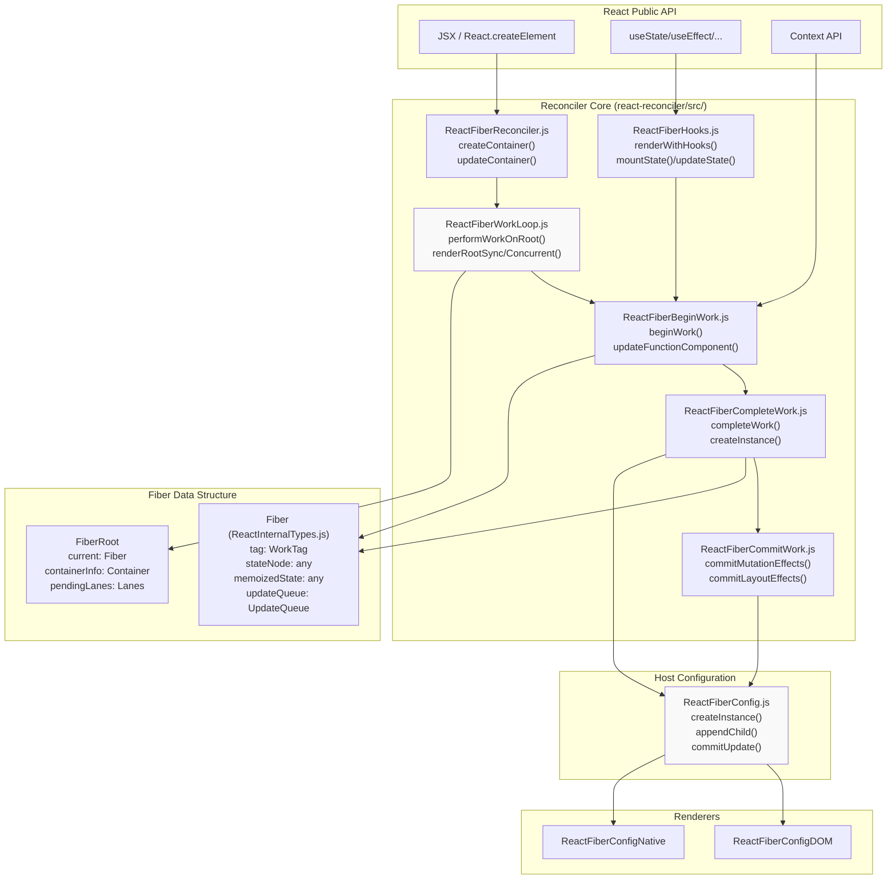

协调器通过两阶段渲染周期运行：**render phase（渲染阶段）**（可中断）遍历 Fiber 树，调用 `beginWork` 和 `completeWork`；**commit phase（提交阶段）**（同步）将更改应用到宿主环境。

**源文件**：[packages/react-reconciler/src/ReactFiberWorkLoop.js#L1-L1279](https://github.com/facebook/react/blob/main/packages/react-reconciler/src/ReactFiberWorkLoop.js#L1-L1279), [packages/react-reconciler/src/ReactFiberReconciler.js#L1-L354](https://github.com/facebook/react/blob/main/packages/react-reconciler/src/ReactFiberReconciler.js#L1-L354), [packages/react-reconciler/src/ReactInternalTypes.js#L88-L207](https://github.com/facebook/react/blob/main/packages/react-reconciler/src/ReactInternalTypes.js#L88-L207)

---

## Fiber 数据结构

**Fiber** 是协调器中的基本工作单元。每个 Fiber 节点代表一个组件实例及其关联的工作。

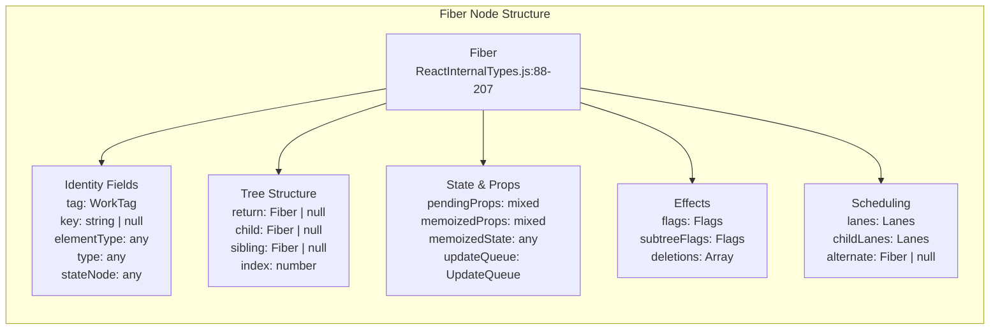

| 字段            | 用途                                                                         |
| --------------- | ---------------------------------------------------------------------------- |
| `tag`           | WorkTag，标识组件类型（FunctionComponent、ClassComponent、HostComponent 等） |
| `stateNode`     | 指向 DOM 节点、类实例或其他宿主实例的引用                                    |
| `memoizedState` | 上次渲染的输出状态；对于 function component 而言，这是 Hook 对象的链表       |
| `updateQueue`   | 待处理的状态更新和 effect 队列                                               |
| `flags`         | 副作用标志（Placement、Update、Deletion、Passive 等）                        |
| `lanes`         | 表示此 fiber 上待处理工作的优先级 lanes                                      |
| `alternate`     | 双缓冲：在更新期间指向当前树中对应的 fiber                                   |

**源文件**：[packages/react-reconciler/src/ReactInternalTypes.js#L88-L207](https://github.com/facebook/react/blob/main/packages/react-reconciler/src/ReactInternalTypes.js#L88-L207), [packages/react-reconciler/src/ReactFiber.js#L136-L209](https://github.com/facebook/react/blob/main/packages/react-reconciler/src/ReactFiber.js#L136-L209)

---

## Work Loop 执行模型

Work Loop（工作循环）是协调器的核心，管理 render phase 和 commit phase 的推进过程。

<!-- > 个人理解， work loop 只是管理 render phase，commitRoot()在 work loop 范畴之外 -->

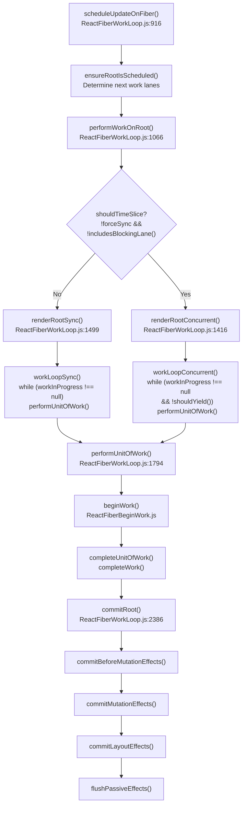

### Render Phase（渲染阶段）

Render phase 本质上是一个计算下一个 fiber 节点的计算过程，目的就是构建出一颗新的完整的 fiber tree（work-in-progress）。计算公式为：`next fiber = reconcileChildren（prev fiber, next react element children）`。而这个过程中所产生的非纯计算类的事务我们称之为「副作用」。

从另外的一个角度看，这是一个深度优先递归遍历的过程：

> 注意，遍历的对象是 react element tree；而 diff 的对象 curren fiber tree。

- **递** - 递出去的时候对每一个经过的 fiber 节点调用 `beginWork()`;
- 当触碰到整颗 react element tree 的叶子节点时候，就开始「归」；
- **归** - 归回来的时候对每一个经过的 fiber 节点调用 `completeWork()`

因此我们也常说，Render phase 包含两个子阶段：

**Begin Work**（[ReactFiberBeginWork.js:1400-2900]()）：

- 渲染组件（调用组件的 render 方法 ）
- 使用 `reconcileChildren` 协调得到子 fiber 节点
- 返回下一个要处理的子 fiber
- 关键函数：`updateFunctionComponent`、`updateClassComponent`、`updateHostComponent`

**Complete Work**（[ReactFiberCompleteWork.js:600-1200]()）：

- 通过 `createInstance`、`finalizeInitialChildren` 创建或更新宿主实例
- 从子节点向上冒泡副作用标志
- 返回到父节点，然后处理兄弟节点

在并发模式下，render phase 是**可中断的**—— 比如调用`shouldYield()` 来把主线程的控制权让渡出去，实现渲染工作的暂停以处理更高优先级的工作。这就引出了 work loop 的两个模式：同步版本和并发版本：

- 同步版本： `workLoopSync()`;
- 并发版本： 有两个实现，分别是： `workLoopConcurrent()` 和 `workLoopConcurrentByScheduler()`

其实，work loop 的核心框架就是两重嵌套的 while 循环：

- 外层 while 循环在上面的 `workLoopXxx()`里面；
- 内层 while 循环在 `completeUnitOfWork()` 函数实现里面；

外层 while 循环负责实现「**递出去**」，内层 while 循环负责「**归回来**」。当 workInProgress 重新指向 FiberRoot 的时候，整个渲染过程就完成了。

React Reconciler 就是通过这两层 while 循环实现了对 react element tree 的深度优先递归遍历。

### Commit Phase（提交阶段）

Commit phase 应用 render phase 的工作。它是**同步且不可中断的**：

1. **Before Mutation**（[ReactFiberCommitWork.js:343-591]()）：`getSnapshotBeforeUpdate`，为 DOM 变更做准备
2. **Mutation**（[ReactFiberCommitWork.js:2400-3100]()）：应用 DOM 更改（插入、更新、删除节点）
3. **Layout**（[ReactFiberCommitWork.js:593-870]()）：`componentDidMount`、`useLayoutEffect`、ref 附加
4. **Passive**（[ReactFiberCommitWork.js:2629-2800]()）：`useEffect`（在绘制后调度）

**源文件**：[packages/react-reconciler/src/ReactFiberWorkLoop.js#L1066-L1800](https://github.com/facebook/react/blob/main/packages/react-reconciler/src/ReactFiberWorkLoop.js#L1066-L1800), [packages/react-reconciler/src/ReactFiberBeginWork.js#L341-L470](https://github.com/facebook/react/blob/main/packages/react-reconciler/src/ReactFiberBeginWork.js#L341-L470), [packages/react-reconciler/src/ReactFiberCommitWork.js#L343-L870](https://github.com/facebook/react/blob/main/packages/react-reconciler/src/ReactFiberCommitWork.js#L343-L870)

---

## 宿主配置抽象

协调器通过 `ReactFiberConfig` 接口委托所有平台特定的操作。这使得 React 能够在不修改核心逻辑的情况下面向多个平台。

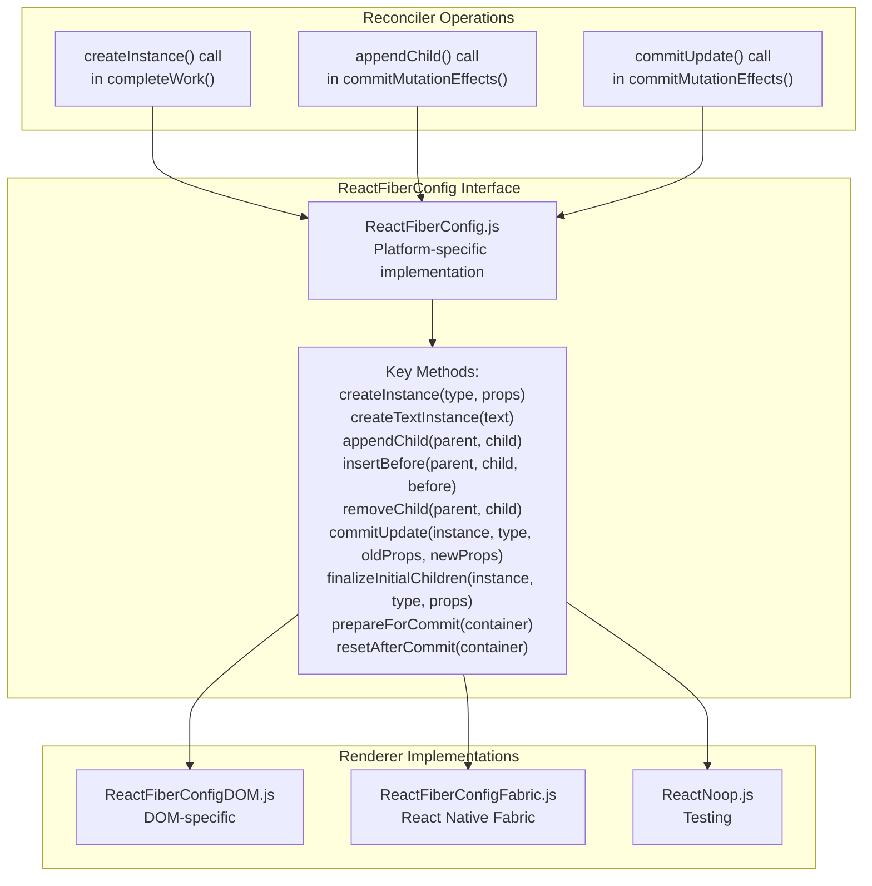

### Mutation vs Persistence（变更模式 vs 持久化模式）

渲染器实现两种策略之一：

**Mutation Mode（变更模式）**（DOM、React Native Legacy）：

- `supportsMutation = true`
- 就地修改宿主实例
- 方法：`appendChild`、`removeChild`、`commitUpdate`

**Persistence Mode（持久化模式）**（React Native Fabric）：

- `supportsPersistence = true`
- 克隆并替换整个子树
- 方法：`cloneInstance`、`createContainerChildSet`、`replaceContainerChildren`

### 示例：DOM 渲染器集成

```
completeWork() → createInstance() → document.createElement()
commitMutationEffects() → appendChild() → parentInstance.appendChild()
commitMutationEffects() → commitUpdate() → updateProperties()
```

协调器调用高级操作（如 `createInstance`）；DOM 渲染器将这些操作转换为 `document.createElement()`、`node.appendChild()` 等。

**源文件**：[packages/react-reconciler/src/ReactFiberCompleteWork.js#L105-L129](https://github.com/facebook/react/blob/main/packages/react-reconciler/src/ReactFiberCompleteWork.js#L105-L129), [packages/react-dom-bindings/src/client/ReactFiberConfigDOM.js#L1-L50](https://github.com/facebook/react/blob/main/packages/react-dom-bindings/src/client/ReactFiberConfigDOM.js#L1-L50), [packages/react-reconciler/src/ReactFiberCommitWork.js#L154-L186](https://github.com/facebook/react/blob/main/packages/react-reconciler/src/ReactFiberCommitWork.js#L154-L186)

---

## Reconciliation 和 Diffing

当 React 更新组件时，它会将新的子节点与现有的 Fiber 树进行协调。

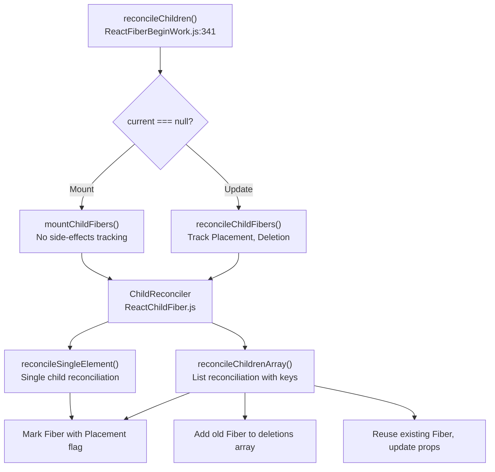

### 数组协调算法

协调子节点数组时（[ReactChildFiber.js:800-1200]()）：

1. **第一遍**：并行遍历旧子节点和新子节点，通过 `key`（如果提供）或 `index` 匹配
   - 如果 `key` 匹配且 `type` 匹配：复用 Fiber，更新 props
   - 如果不匹配：中断并进入重新定位流程

2. **删除**：未匹配的剩余旧子节点标记为删除

3. **插入**：剩余的新子节点创建带有 `Placement` 标志的新 Fiber

4. **Key Map**：对于复杂的重排序，构建 `key → Fiber` 映射以高效查找匹配项

协调器用标志标记每个 Fiber：

- `Placement`：需要插入到 DOM
- `Update`：Props 已更改，需要 DOM 更新
- `Deletion`：需要从 DOM 中移除

**源文件**：[packages/react-reconciler/src/ReactFiberBeginWork.js#L341-L404](https://github.com/facebook/react/blob/main/packages/react-reconciler/src/ReactFiberBeginWork.js#L341-L404), [packages/react-reconciler/src/ReactChildFiber.js#L800-L1200](https://github.com/facebook/react/blob/main/packages/react-reconciler/src/ReactChildFiber.js#L800-L1200)

---

## 全局状态和 Work-in-Progress

协调器在渲染期间维护全局可变状态：

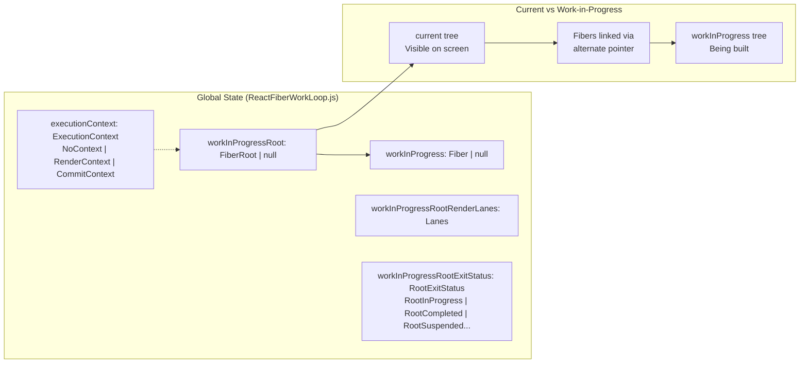

**双缓冲**：React 维护两个 Fiber 树：

- **Current tree（当前树）**：当前渲染的树，用户可见
- **Work-in-progress tree（工作树）**：更新期间正在构建的树

每个 Fiber 的 `alternate` 指针链接到另一棵树中的对应节点。提交后，工作树通过指针交换成为当前树（[ReactFiberWorkLoop.js:2600-2650]()）。

**源文件**：[packages/react-reconciler/src/ReactFiberWorkLoop.js#L406-L526](https://github.com/facebook/react/blob/main/packages/react-reconciler/src/ReactFiberWorkLoop.js#L406-L526), [packages/react-reconciler/src/ReactFiber.js#L360-L480](https://github.com/facebook/react/blob/main/packages/react-reconciler/src/ReactFiber.js#L360-L480)

---

## Render 退出状态

Render phase 可以以多种状态退出（[ReactFiberWorkLoop.js:413-420]()）：

| 状态                      | 描述                                     |
| ------------------------- | ---------------------------------------- |
| `RootInProgress`          | Render 仍在进行中                        |
| `RootCompleted`           | Render 成功完成                          |
| `RootErrored`             | Render 遇到错误                          |
| `RootSuspended`           | Render 暂停等待数据                      |
| `RootSuspendedWithDelay`  | 暂停并带有节流延迟                       |
| `RootSuspendedAtTheShell` | 在初始 shell 期间暂停，立即显示 fallback |
| `RootFatalErrored`        | 致命错误，无法恢复                       |

状态决定是立即提交、重试还是显示 Suspense fallback。

---

## 错误处理和边界

错误处理向上传播 Fiber 树，直到找到错误边界。

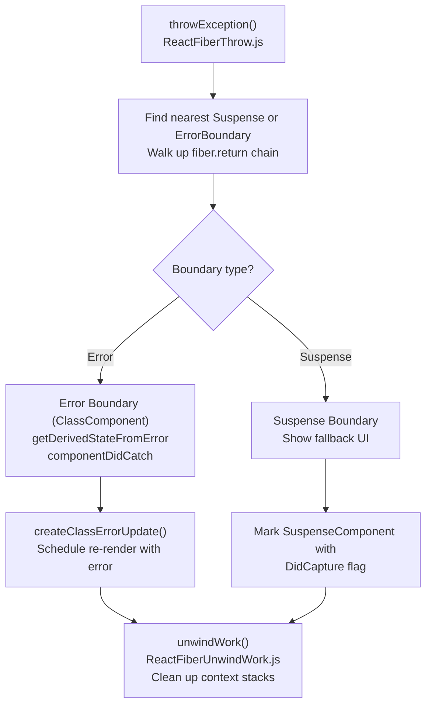

当抛出错误或 Promise 时：

1. 调用 `throwException()` 并传入抛出的值
2. 向上遍历树以找到合适的边界
3. 对于错误：在错误边界上调用 `getDerivedStateFromError`，调度重新渲染
4. 对于 Suspense：用 `DidCapture` 标记边界，准备显示 fallback
5. `unwindWork()` 清理任何上下文栈，回退到边界
6. 从边界重新开始渲染

**源文件**：[packages/react-reconciler/src/ReactFiberThrow.js#L400-L600](https://github.com/facebook/react/blob/main/packages/react-reconciler/src/ReactFiberThrow.js#L400-L600), [packages/react-reconciler/src/ReactFiberUnwindWork.js#L63-L180](https://github.com/facebook/react/blob/main/packages/react-reconciler/src/ReactFiberUnwindWork.js#L63-L180), [packages/react-reconciler/src/ReactFiberWorkLoop.js#L1900-L2100](https://github.com/facebook/react/blob/main/packages/react-reconciler/src/ReactFiberWorkLoop.js#L1900-L2100)

---

## 并发特性和中断

在并发模式下，render phase 可以被中断以处理更高优先级的更新。

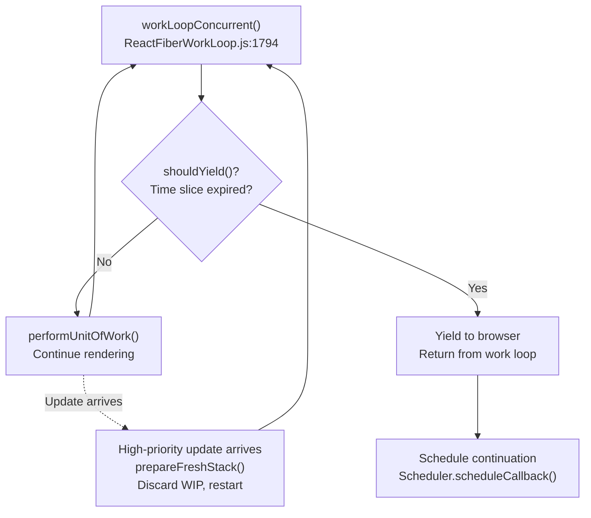

**中断点**：

- 在工作单元（fibers）之间
- `shouldYield()` 检查时间片是否耗尽
- 新的更高优先级更新可以丢弃 work-in-progress

**恢复**：

- 保留 work-in-progress 状态
- 可以从 `workInProgress` fiber 恢复
- 或为更高优先级从根重新开始

**源文件**：[packages/react-reconciler/src/ReactFiberWorkLoop.js#L1776-L1850](https://github.com/facebook/react/blob/main/packages/react-reconciler/src/ReactFiberWorkLoop.js#L1776-L1850), [packages/react-reconciler/src/ReactFiberWorkLoop.js#L1300-L1400](https://github.com/facebook/react/blob/main/packages/react-reconciler/src/ReactFiberWorkLoop.js#L1300-L1400)

---

## 组件类型和标签

协调器通过 `WorkTag` 枚举处理不同的组件类型。

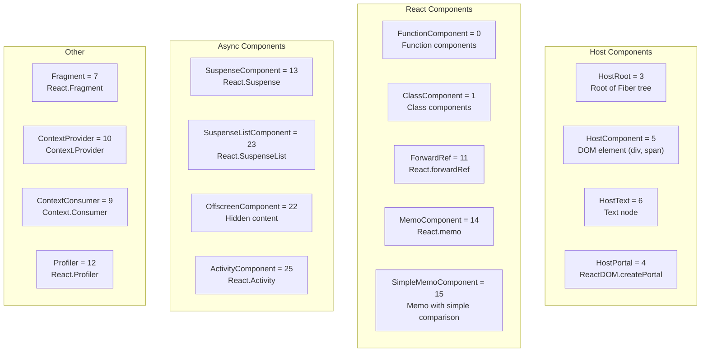

每个 Fiber 上的 `tag` 字段决定 `beginWork` 和 `completeWork` 采用的代码路径。

**示例分发**（[ReactFiberBeginWork.js:3800-4100]()）：

```
switch (workInProgress.tag) {
  case FunctionComponent:
    return updateFunctionComponent(...)
  case ClassComponent:
    return updateClassComponent(...)
  case HostComponent:
    return updateHostComponent(...)
  ...
}
```

**源文件**：[packages/react-reconciler/src/ReactWorkTags.js#L1-L60](https://github.com/facebook/react/blob/main/packages/react-reconciler/src/ReactWorkTags.js#L1-L60), [packages/react-reconciler/src/ReactFiberBeginWork.js#L3800-L4100](https://github.com/facebook/react/blob/main/packages/react-reconciler/src/ReactFiberBeginWork.js#L3800-L4100)

---

## Context 系统

React Context 在协调器层面实现。

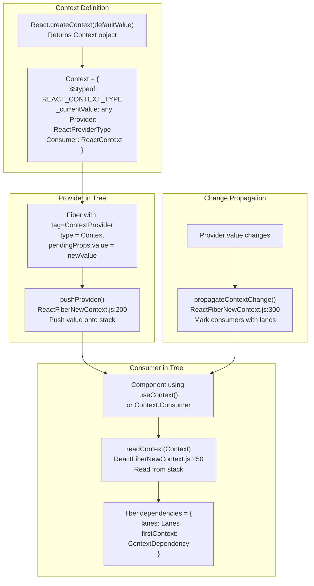

**Context 机制**：

1. **基于栈**：Provider 在遍历树时将值推入栈
2. **依赖**：消费组件在 `fiber.dependencies` 中记录依赖
3. **防止跳过**：当 context 值更改时，`propagateContextChange()` 用更新 lanes 标记所有消费者，防止跳过

**关键函数**：

- `pushProvider()` - 将新的 context 值推入栈（[ReactFiberNewContext.js:200-250]()）
- `readContext()` - 读取当前 context 值并记录依赖（[ReactFiberNewContext.js:250-350]()）
- `propagateContextChange()` - 值更改时标记消费者进行更新（[ReactFiberNewContext.js:400-550]()）

**源文件**：[packages/react-reconciler/src/ReactFiberNewContext.js#L200-L550](https://github.com/facebook/react/blob/main/packages/react-reconciler/src/ReactFiberNewContext.js#L200-L550), [packages/react-reconciler/src/ReactFiberBeginWork.js#L3200-L3350](https://github.com/facebook/react/blob/main/packages/react-reconciler/src/ReactFiberBeginWork.js#L3200-L3350)

---

## 调度入口点

更新通过多个路径进入协调器：

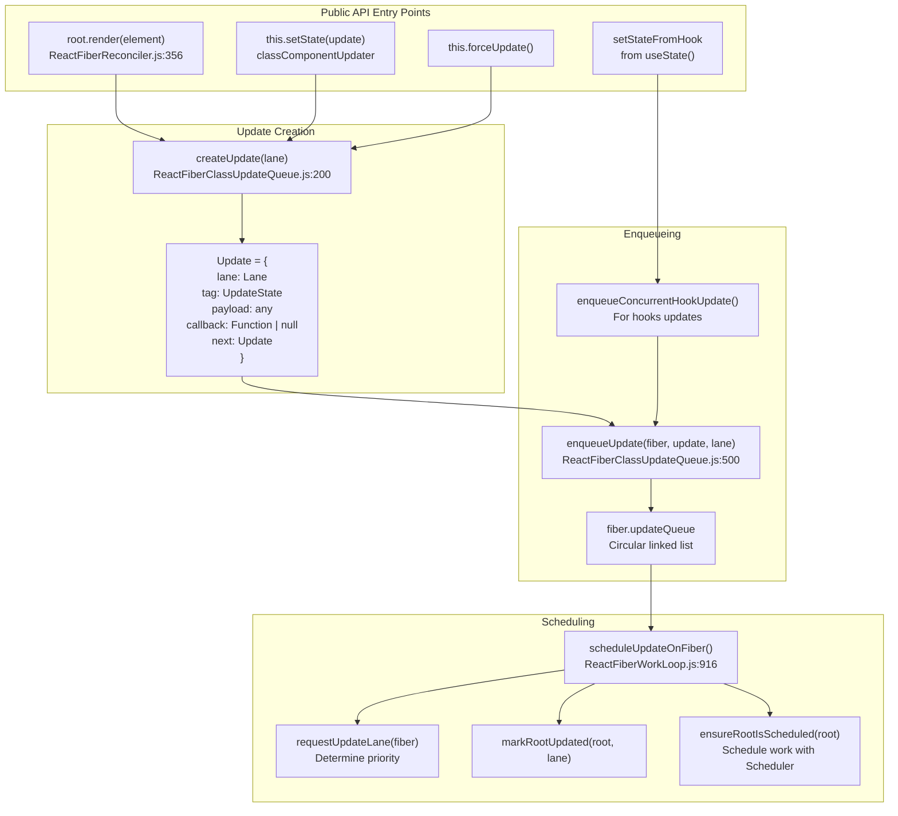

**更新生命周期**：

1. 用户调用 `setState()` 或 `render()`
2. 创建带有优先级 lane 的 `Update` 对象
3. 将更新入队到 fiber 的 `updateQueue`
4. 使用 root 和 lane 调用 `scheduleUpdateOnFiber()`
5. `ensureRootIsScheduled()` 根据 lanes 使用 Scheduler 调度工作

**源文件**：[packages/react-reconciler/src/ReactFiberReconciler.js#L356-L461](https://github.com/facebook/react/blob/main/packages/react-reconciler/src/ReactFiberReconciler.js#L356-L461), [packages/react-reconciler/src/ReactFiberWorkLoop.js#L916-L1042](https://github.com/facebook/react/blob/main/packages/react-reconciler/src/ReactFiberWorkLoop.js#L916-L1042), [packages/react-reconciler/src/ReactFiberClassUpdateQueue.js#L165-L243](https://github.com/facebook/react/blob/main/packages/react-reconciler/src/ReactFiberClassUpdateQueue.js#L165-L243)

---

## 批处理和同步

协调器批处理更新以最小化渲染次数。

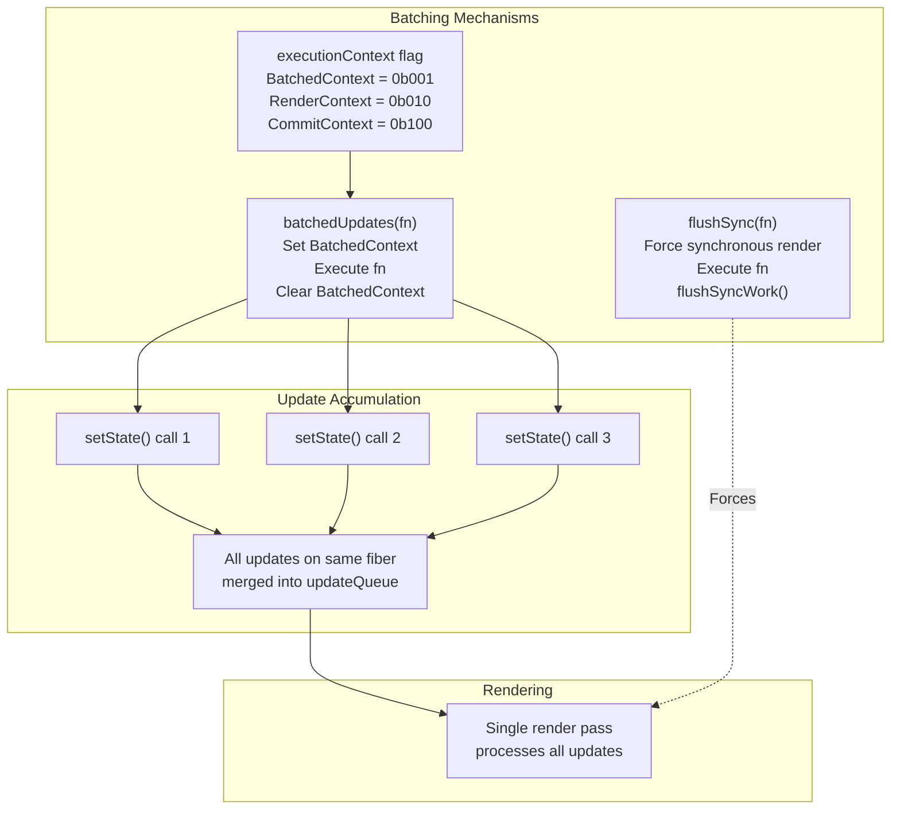

**自动批处理**：在 React 18+ 中，所有更新在单个事件、超时或 Promise 回调内自动批处理。`executionContext` 防止嵌套的 flush 操作。

**手动控制**：

- `flushSync()` - 强制同步渲染（[ReactFiberWorkLoop.js:1244-1278]()）
- `batchedUpdates()` - 显式批处理（主要是遗留用法）（[ReactFiberWorkLoop.js:2832-2850]()）

**源文件**：[packages/react-reconciler/src/ReactFiberWorkLoop.js#L1244-L1278](https://github.com/facebook/react/blob/main/packages/react-reconciler/src/ReactFiberWorkLoop.js#L1244-L1278), [packages/react-reconciler/src/ReactFiberWorkLoop.js#L2832-L2850](https://github.com/facebook/react/blob/main/packages/react-reconciler/src/ReactFiberWorkLoop.js#L2832-L2850)

---

## Refs 和命令式句柄

协调器管理 refs 并提供对实例的命令式访问。

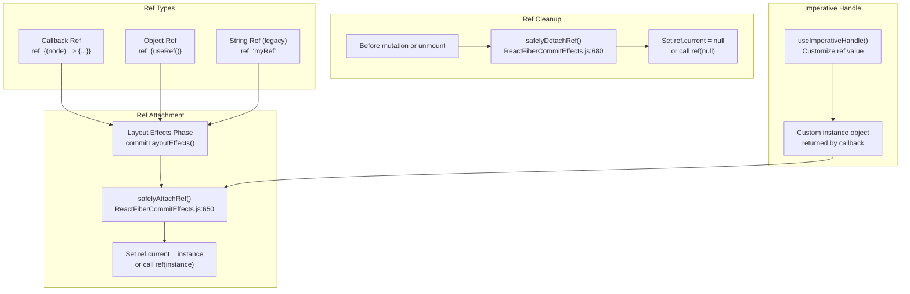

**Ref 生命周期**：

1. **分离**：在 mutation 之前，调用 `safelyDetachRef()` 清除旧的 refs
2. **附加**：在 layout phase，调用 `safelyAttachRef()` 设置新的 refs
3. **实例**：对于宿主组件，ref 指向 DOM 节点；对于类组件，指向类实例；对于使用 `useImperativeHandle` 的函数组件，指向自定义对象

**源文件**：[packages/react-reconciler/src/ReactFiberCommitEffects.js#L650-L720](https://github.com/facebook/react/blob/main/packages/react-reconciler/src/ReactFiberCommitEffects.js#L650-L720), [packages/react-reconciler/src/ReactFiberHooks.js#L2100-L2200](https://github.com/facebook/react/blob/main/packages/react-reconciler/src/ReactFiberHooks.js#L2100-L2200)

---

## Profiler 集成

协调器与 React DevTools Profiler 集成，跟踪渲染时间。

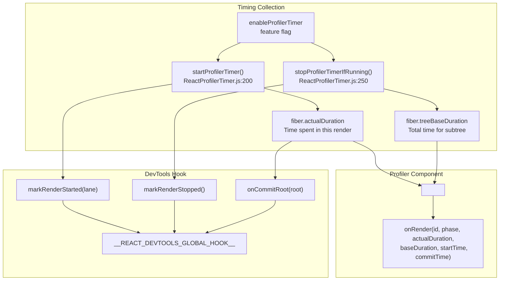

**Profiler 机制**：

- `actualDuration`：在当前渲染中渲染此组件所花费的时间
- `treeBaseDuration`：重新渲染整个子树所需的时间估计（从上次渲染缓存）
- `startProfilerTimer()` / `stopProfilerTimerIfRunning()`：在组件渲染周围记录时间
- `<Profiler>` 组件在提交后使用时间数据调用 `onRender` 回调
- DevTools hook 接收渲染开始/停止/提交的通知

**源文件**：[packages/react-reconciler/src/ReactProfilerTimer.js#L150-L350](https://github.com/facebook/react/blob/main/packages/react-reconciler/src/ReactProfilerTimer.js#L150-L350), [packages/react-reconciler/src/ReactFiberCommitEffects.js#L720-L780](https://github.com/facebook/react/blob/main/packages/react-reconciler/src/ReactFiberCommitEffects.js#L720-L780), [packages/react-reconciler/src/ReactFiberDevToolsHook.js#L200-L350](https://github.com/facebook/react/blob/main/packages/react-reconciler/src/ReactFiberDevToolsHook.js#L200-L350)

---

## 并发模式渲染模式

### 选择性 Hydration

协调器支持根据用户交互选择性地 hydrate 服务端渲染的内容。

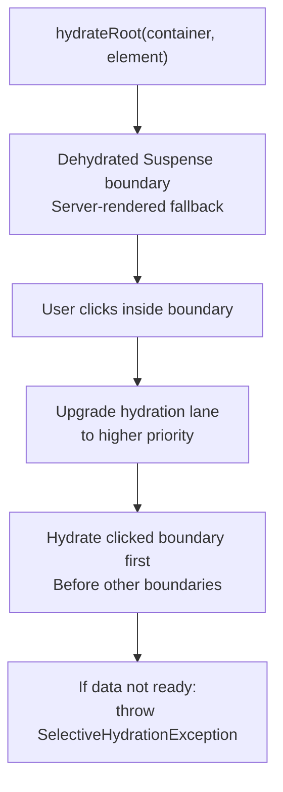

当用户与脱水边界交互时，React 优先 hydrate 该边界，以快速使其可交互。

**源文件**：[packages/react-reconciler/src/ReactFiberBeginWork.js#L311-L317](https://github.com/facebook/react/blob/main/packages/react-reconciler/src/ReactFiberBeginWork.js#L311-L317), [packages/react-reconciler/src/ReactFiberReconciler.js#L489-L520](https://github.com/facebook/react/blob/main/packages/react-reconciler/src/ReactFiberReconciler.js#L489-L520)

### Offscreen 渲染

`OffscreenComponent` 允许预渲染尚未可见的内容。

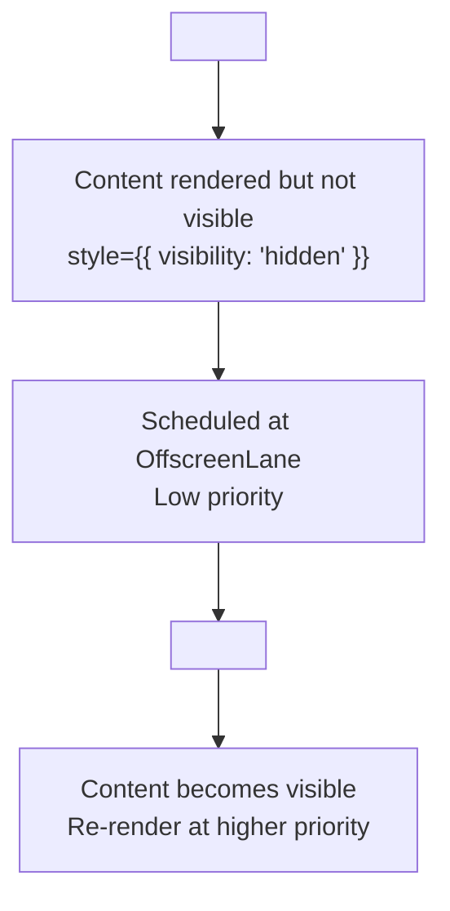

Offscreen 组件以低优先级渲染，并在 DOM 中保持 `visibility: hidden`，然后在需要时立即显示。

**源文件**：[packages/react-reconciler/src/ReactFiberBeginWork.js#L613-L871](https://github.com/facebook/react/blob/main/packages/react-reconciler/src/ReactFiberBeginWork.js#L613-L871), [packages/react-reconciler/src/ReactFiberOffscreenComponent.js#L1-L50](https://github.com/facebook/react/blob/main/packages/react-reconciler/src/ReactFiberOffscreenComponent.js#L1-L50)

---

## 总结

React Reconciler（协调器）是核心协调引擎，它：

- **管理 Fiber 树**：带有 `current` 和 `workInProgress` 的双缓冲树
- **协调渲染阶段**：可中断的 render phase，同步的 commit phase
- **抽象平台**：通过 `ReactFiberConfig` 接口将实例操作（增，删，改）委托给宿主来实现
- **调度工作**：使用 lanes 和 Scheduler 进行基于优先级的调度
- **处理更新**：批处理更新，处理更新队列，协调子节点
- **支持特性**：Hooks、Context、Suspense、Error Boundaries、Concurrent Rendering

关键入口点：

- `createContainer()` / `updateContainer()` - 初始化和更新根节点
- `scheduleUpdateOnFiber()` - 在 fiber 上调度工作
- `performWorkOnRoot()` - 执行 render phase 和 commit phase
- `beginWork()` / `completeWork()` - 遍历 fiber 树
- `commitMutationEffects()` / `commitLayoutEffects()` - 将更改应用到宿主

协调器是平台无关的，使 React 能够面向 DOM、Native、Canvas 和自定义渲染器，同时保持单一的核心算法。
