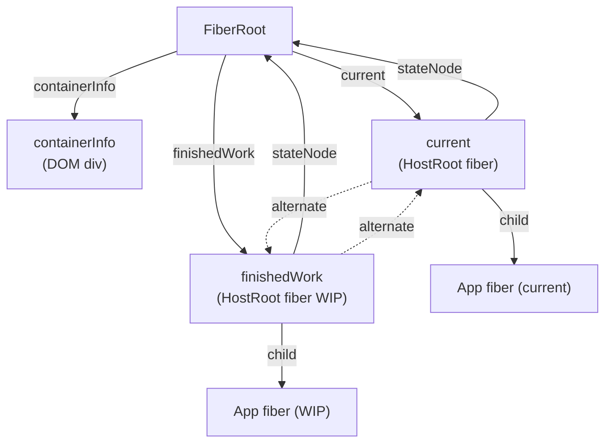
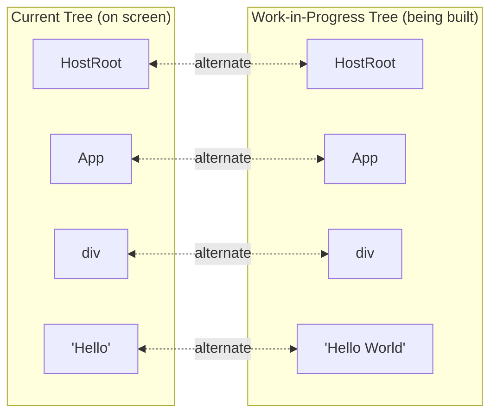
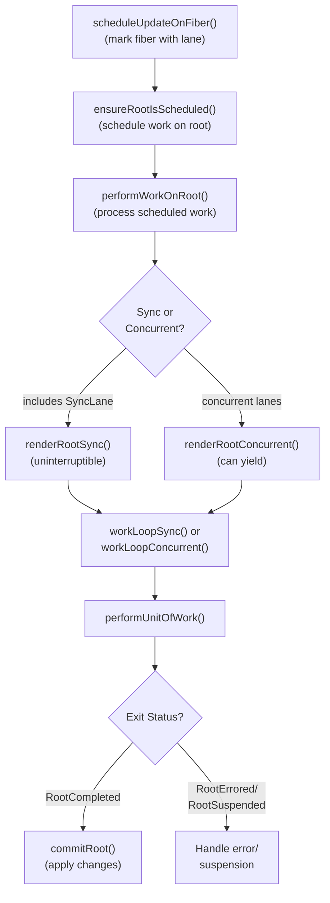
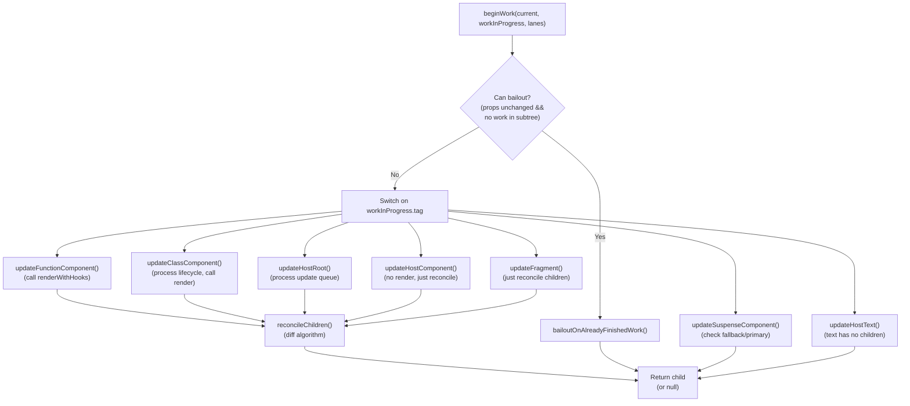
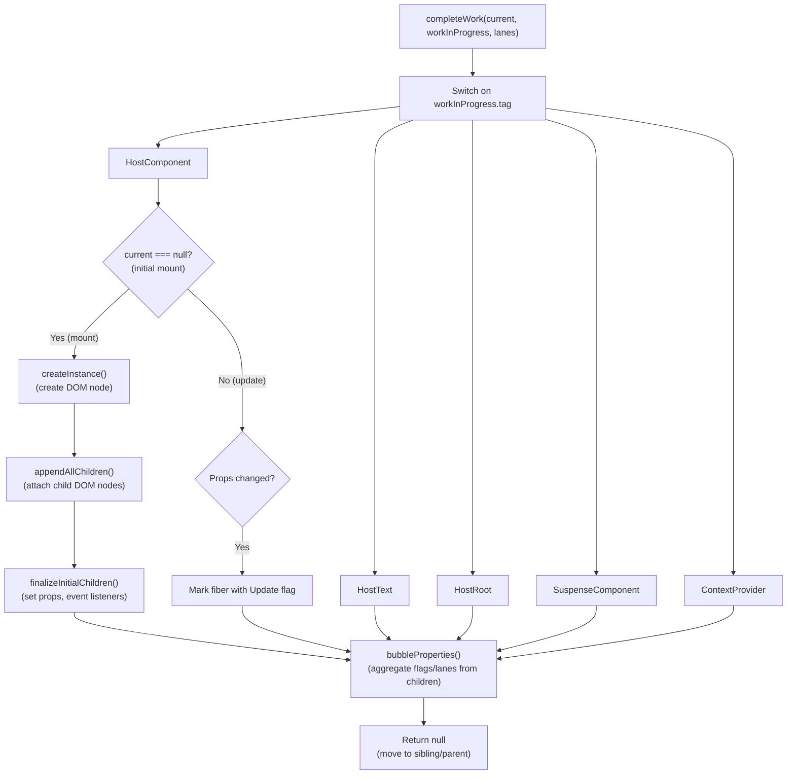
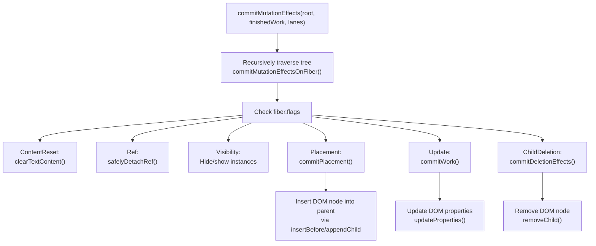

# Fiber 架构与数据结构

<!-- > 来源：https://deepwiki.com/facebook/react/4.1-fiber-architecture-and-data-structures -->

<details>
<summary>相关源文件</summary>

以下文件用于生成此 wiki 页面的上下文：

- [packages/react-client/src/ReactFlightPerformanceTrack.js](packages/react-client/src/ReactFlightPerformanceTrack.js)
- [packages/react-dom/index.js](packages/react-dom/index.js)
- [packages/react-dom/src/**tests**/ReactDOMFiberAsync-test.js](packages/react-dom/src/__tests__/ReactDOMFiberAsync-test.js)
- [packages/react-dom/src/**tests**/refs-test.js](packages/react-dom/src/__tests__/refs-test.js)
- [packages/react-reconciler/src/ReactChildFiber.js](packages/react-reconciler/src/ReactChildFiber.js)
- [packages/react-reconciler/src/ReactFiber.js](packages/react-reconciler/src/ReactFiber.js)
- [packages/react-reconciler/src/ReactFiberBeginWork.js](packages/react-reconciler/src/ReactFiberBeginWork.js)
- [packages/react-reconciler/src/ReactFiberClassComponent.js](packages/react-reconciler/src/ReactFiberClassComponent.js)
- [packages/react-reconciler/src/ReactFiberCommitWork.js](packages/react-reconciler/src/ReactFiberCommitWork.js)
- [packages/react-reconciler/src/ReactFiberCompleteWork.js](packages/react-reconciler/src/ReactFiberCompleteWork.js)
- [packages/react-reconciler/src/ReactFiberLane.js](packages/react-reconciler/src/ReactFiberLane.js)
- [packages/react-reconciler/src/ReactFiberOffscreenComponent.js](packages/react-reconciler/src/ReactFiberOffscreenComponent.js)
- [packages/react-reconciler/src/ReactFiberPerformanceTrack.js](packages/react-reconciler/src/ReactFiberPerformanceTrack.js)
- [packages/react-reconciler/src/ReactFiberReconciler.js](packages/react-reconciler/src/ReactFiberReconciler.js)
- [packages/react-reconciler/src/ReactFiberRootScheduler.js](packages/react-reconciler/src/ReactFiberRootScheduler.js)
- [packages/react-reconciler/src/ReactFiberSuspenseComponent.js](packages/react-reconciler/src/ReactFiberSuspenseComponent.js)
- [packages/react-reconciler/src/ReactFiberUnwindWork.js](packages/react-reconciler/src/ReactFiberUnwindWork.js)
- [packages/react-reconciler/src/ReactFiberWorkLoop.js](packages/react-reconciler/src/ReactFiberWorkLoop.js)
- [packages/react-reconciler/src/ReactProfilerTimer.js](packages/react-reconciler/src/ReactProfilerTimer.js)
- [packages/react-reconciler/src/**tests**/ReactDeferredValue-test.js](packages/react-reconciler/src/__tests__/ReactDeferredValue-test.js)
- [packages/react-reconciler/src/**tests**/ReactHooksWithNoopRenderer-test.js](packages/react-reconciler/src/__tests__/ReactHooksWithNoopRenderer-test.js)
- [packages/react-reconciler/src/**tests**/ReactLazy-test.internal.js](packages/react-reconciler/src/__tests__/ReactLazy-test.internal.js)
- [packages/react-reconciler/src/**tests**/ReactPerformanceTrack-test.js](packages/react-reconciler/src/__tests__/ReactPerformanceTrack-test.js)
- [packages/react-reconciler/src/**tests**/ReactSiblingPrerendering-test.js](packages/react-reconciler/src/__tests__/ReactSiblingPrerendering-test.js)
- [packages/react-reconciler/src/**tests**/ReactSuspense-test.internal.js](packages/react-reconciler/src/__tests__/ReactSuspense-test.internal.js)
- [packages/react-reconciler/src/**tests**/ReactSuspensePlaceholder-test.internal.js](packages/react-reconciler/src/__tests__/ReactSuspensePlaceholder-test.internal.js)
- [packages/react-reconciler/src/**tests**/ReactSuspenseWithNoopRenderer-test.js](packages/react-reconciler/src/__tests__/ReactSuspenseWithNoopRenderer-test.js)
- [packages/react-reconciler/src/**tests**/ReactSuspenseyCommitPhase-test.js](packages/react-reconciler/src/__tests__/ReactSuspenseyCommitPhase-test.js)
- [packages/react-server/src/ReactFlightAsyncSequence.js](packages/react-server/src/ReactFlightAsyncSequence.js)
- [packages/react-server/src/ReactFlightServerConfigDebugNode.js](packages/react-server/src/ReactFlightServerConfigDebugNode.js)
- [packages/react-server/src/ReactFlightServerConfigDebugNoop.js](packages/react-server/src/ReactFlightServerConfigDebugNoop.js)
- [packages/react-server/src/ReactFlightStackConfigV8.js](packages/react-server/src/ReactFlightStackConfigV8.js)
- [packages/react-server/src/**tests**/ReactFlightAsyncDebugInfo-test.js](packages/react-server/src/__tests__/ReactFlightAsyncDebugInfo-test.js)
- [packages/react/src/ReactLazy.js](packages/react/src/ReactLazy.js)
- [packages/react/src/**tests**/ReactProfiler-test.internal.js](packages/react/src/__tests__/ReactProfiler-test.internal.js)
- [packages/shared/ReactPerformanceTrackProperties.js](packages/shared/ReactPerformanceTrackProperties.js)

</details>

## 目的与范围

本文档介绍 React 的 Fiber 数据结构、FiberRoot 容器、使用 current 和 work-in-progress 树的 double buffering 技术，以及使用 child/sibling/return 指针的树遍历机制。这些是支撑 React 增量协调的基础数据结构。

相关主题请参阅：

- 工作循环执行与渲染/提交阶段：[工作循环与渲染阶段](#4.2)
- Hooks 实现：[React Hooks 系统](#4.3)
- 优先级调度：[基于 Lane 的调度与优先级](#4.4)
- 错误与 Suspense 处理：[Suspense 与错误边界](#4.5)
- 宿主特定操作：[宿主配置抽象](#4.6)

## FiberRoot：容器

`FiberRoot` 是容纳整个 fiber 树并协调渲染的容器对象。在调用 `createRoot()` 或 `createContainer()` 时，由 [ReactFiberRoot.js:109-225]() 中的 `createFiberRoot` 创建。

### FiberRoot 结构

关键字段定义在 [ReactInternalTypes.js:253-334]()：

| 字段                 | 类型                                 | 用途                                 |
| -------------------- | ------------------------------------ | ------------------------------------ |
| `containerInfo`      | `Container`                          | 宿主容器（如 DOM 节点）              |
| `current`            | `Fiber`                              | 指向当前 HostRoot fiber 的指针       |
| `finishedWork`       | `Fiber \| null`                      | 渲染完成后的 work-in-progress 根节点 |
| `pendingLanes`       | `Lanes`                              | 有待处理工作的 lanes                 |
| `suspendedLanes`     | `Lanes`                              | 被 Promise 挂起的 lanes              |
| `pingedLanes`        | `Lanes`                              | 已收到 ping 需要重试的 lanes         |
| `expiredLanes`       | `Lanes`                              | 已过期的 lanes                       |
| `callbackNode`       | `mixed`                              | Scheduler 回调节点                   |
| `callbackPriority`   | `Lane`                               | 已调度回调的优先级                   |
| `hydrationCallbacks` | `null \| SuspenseHydrationCallbacks` | 水合回调                             |
| `context`            | `Object \| null`                     | 用于遗留 context 的上下文对象        |
| `pendingContext`     | `Object \| null`                     | 待处理的上下文更新                   |

**图表：FiberRoot 与 HostRoot 的关系**



`HostRoot` fiber（tag = 3）是特殊的：

- 其 `stateNode` 指回 `FiberRoot`
- 没有 React 元素（它是 React 树的根）
- 其 `memoizedState` 包含传递给 `render()` 的初始元素 [ReactInternalTypes.js:246-251]()

来源：[ReactFiberRoot.js:109-225](), [ReactInternalTypes.js:253-334](), [ReactInternalTypes.js:246-251]()

## Fiber 数据结构

### Fiber 节点定义

Fiber 是 React 内部的工作单元，表示组件实例、DOM 节点或其他 React 元素。它是一个可变的 JavaScript 对象，包含协调、调度和副作用所需的所有信息。

`FiberNode` 构造函数定义在 [ReactFiber.js:138-211]()。React 提供两种实现：

- 基于类：`createFiberImplClass`（默认）
- 对象字面量：`createFiberImplObject`（由 `enableObjectFiber` 标志控制）

### 按类别划分的 Fiber 字段

| 字段类别             | 关键字段                                | 用途                                  |
| -------------------- | --------------------------------------- | ------------------------------------- |
| **实例标识**         | `tag`, `key`, `elementType`, `type`     | 标识该 fiber 表示的内容               |
| **实例状态**         | `stateNode`                             | 组件实例、DOM 节点或其他状态的引用    |
| **树结构**           | `return`, `child`, `sibling`, `index`   | 通过指针形成 fiber 树                 |
| **Refs**             | `ref`, `refCleanup`                     | 处理 ref 附加和清理                   |
| **Props**            | `pendingProps`, `memoizedProps`         | 正在处理的 props 和上次渲染的 props   |
| **State**            | `memoizedState`, `updateQueue`          | 组件状态和待处理的更新                |
| **Context**          | `dependencies`                          | Context 订阅                          |
| **Mode**             | `mode`                                  | ConcurrentMode、StrictMode 等的位字段 |
| **Effects**          | `flags`, `subtreeFlags`, `deletions`    | 在提交阶段执行的副作用                |
| **调度**             | `lanes`, `childLanes`                   | 该 fiber 及其子树的工作优先级         |
| **Double Buffering** | `alternate`                             | 指向另一棵树中对应 fiber 的链接       |
| **性能分析**         | `actualDuration`, `selfBaseDuration` 等 | 计时信息（如果启用）                  |

**Fiber 创建：**

新 fiber 由 `createFiber` [ReactFiber.js:303-305]() 创建：

```javascript
const createFiber = enableObjectFiber
  ? createFiberImplObject
  : createFiberImplClass;
```

来源：[ReactFiber.js:138-211](), [ReactFiber.js:226-305](), [ReactInternalTypes.js:89-205]()

### Work Tags

每个 fiber 的 `tag` 字段标识其类型，定义在 [ReactWorkTags.js:10-37]()：

| Tag 常量                 | 值  | 表示                          |
| ------------------------ | --- | ----------------------------- |
| `FunctionComponent`      | 0   | 函数组件                      |
| `ClassComponent`         | 1   | 类组件                        |
| `HostRoot`               | 3   | fiber 树的根（容器）          |
| `HostComponent`          | 5   | 平台元素（如 DOM `<div>`）    |
| `HostText`               | 6   | 文本节点                      |
| `HostPortal`             | 4   | 指向不同容器的 Portal         |
| `Fragment`               | 7   | `React.Fragment`              |
| `Mode`                   | 8   | StrictMode、ConcurrentMode 等 |
| `ContextProvider`        | 10  | `Context.Provider`            |
| `ContextConsumer`        | 9   | `Context.Consumer`            |
| `ForwardRef`             | 11  | `React.forwardRef()` 包装器   |
| `Profiler`               | 12  | `<Profiler>` 组件             |
| `SuspenseComponent`      | 13  | `<Suspense>` 边界             |
| `MemoComponent`          | 14  | `React.memo()` 包装器         |
| `SimpleMemoComponent`    | 15  | 简单函数的优化 memo           |
| `LazyComponent`          | 16  | `React.lazy()` 包装器         |
| `OffscreenComponent`     | 22  | 隐藏/延迟的子树               |
| `CacheComponent`         | 24  | Cache 边界                    |
| `TracingMarkerComponent` | 25  | Transition 追踪标记           |

tag 决定在协调过程中如何处理 fiber（在 `beginWork`/`completeWork` 中），以及它支持哪些生命周期方法或 hooks。

来源：[ReactWorkTags.js:10-37](), [ReactFiber.js:146]()

## Double Buffering：Current 与 Work-in-Progress 树

React 使用 double buffering 技术维护两棵 fiber 树：

- **Current 树**：反映当前屏幕上渲染的内容
- **Work-in-progress 树**：在渲染阶段正在构建的树

### `alternate` 指针

每个 fiber 都有一个 `alternate` 字段，指向另一棵树中的对应节点 [ReactFiber.js:177]()：



**图表：树之间的 Alternate 指针**

### 创建 Work-in-Progress Fiber

`createWorkInProgress` 函数 [ReactFiber.js:327-383]() 管理 fiber 复用：

**首次更新时（alternate 为 null）：**

1. 使用 `createFiber()` 创建新 fiber
2. 从 current 复制 `elementType`、`type`、`stateNode`
3. 设置双向 `alternate` 指针
4. 使用 `pendingProps` 初始化

**后续更新时（alternate 存在）：**

1. 复用现有的 alternate fiber
2. 重置 flags：`flags = NoFlags`，`subtreeFlags = NoFlags`
3. 清空 `deletions` 数组
4. 将 `pendingProps` 更新为新 props
5. 重置 `lanes` 和 `childLanes`

**Double buffering 的优势：**

- 内存效率：在多次渲染间复用 fiber 对象
- 通过与 `current` 比较实现 bailout 优化
- 允许中断：如果 work-in-progress 被替代，可以丢弃
- 原子更新：通过更新单个指针（`FiberRoot.current`）切换树

来源：[ReactFiber.js:327-383](), [ReactFiber.js:177]()

### 提交时的树交换

渲染成功完成后，work-in-progress 树通过 `commitRootImpl` [ReactFiberWorkLoop.js:2268-2826]() 中的单个指针更新成为 current：

```javascript
root.current = finishedWork;
```

之前的 current 树成为下一次更新的新 work-in-progress alternate。

来源：[ReactFiberWorkLoop.js:2268-2826]()

## 工作循环架构

### 概述：`performWorkOnRoot`

工作循环编排渲染和提交。主入口点是 `performWorkOnRoot` [ReactFiberWorkLoop.js:940-1089]()，它：

1. 准备 work-in-progress 根节点
2. 执行渲染阶段（`renderRootSync` 或 `renderRootConcurrent`）
3. 如果成功，执行提交阶段（`commitRoot`）
4. 处理错误和挂起
5. 调度任何剩余工作



**图表：工作循环执行流程**

来源：[ReactFiberWorkLoop.js:940-1089](), [ReactFiberWorkLoop.js:1643-1846]()

### 工作循环状态变量

[ReactFiberWorkLoop.js:423-496]() 中的关键模块级状态：

```javascript
let workInProgressRoot: FiberRoot | null = null;     // 正在渲染的根节点
let workInProgress: Fiber | null = null;             // 正在处理的当前 fiber
let workInProgressRootRenderLanes: Lanes = NoLanes; // 正在渲染的 lanes

let workInProgressSuspendedReason: SuspendedReason = NotSuspended;
let workInProgressThrownValue: mixed = null;

let workInProgressRootExitStatus: RootExitStatus = RootInProgress;
```

这些变量在协调器内全局跟踪当前渲染的状态。

来源：[ReactFiberWorkLoop.js:423-496]()

## 渲染阶段

渲染阶段通过深度优先遍历 fiber 来构建 work-in-progress 树。此阶段在并发模式下是**可中断的**。

### 工作循环函数

存在两种变体 [ReactFiberWorkLoop.js:1848-1856]()：

**同步（不可中断）：**

```javascript
function workLoopSync() {
  while (workInProgress !== null) {
    performUnitOfWork(workInProgress);
  }
}
```

**并发（可中断）：**

```javascript
function workLoopConcurrent() {
  while (workInProgress !== null && !shouldYield()) {
    performUnitOfWork(workInProgress);
  }
}
```

并发版本检查来自 Scheduler 的 `shouldYield()`，以将控制权交还给浏览器。

来源：[ReactFiberWorkLoop.js:1848-1856]()

### 工作单元：`performUnitOfWork`

每次迭代处理一个 fiber [ReactFiberWorkLoop.js:1858-1884]()：

```javascript
function performUnitOfWork(unitOfWork: Fiber): void {
  const current = unitOfWork.alternate;

  let next = beginWork(current, unitOfWork, renderLanes);

  unitOfWork.memoizedProps = unitOfWork.pendingProps;

  if (next === null) {
    completeUnitOfWork(unitOfWork);
  } else {
    workInProgress = next;
  }
}
```

**流程：**

1. 调用 `beginWork` 处理 fiber 并生成子节点
2. 如果 `beginWork` 返回子节点，将其设为下一个 `workInProgress`
3. 如果没有子节点，调用 `completeUnitOfWork` 完成该 fiber 并移动到兄弟节点/父节点

来源：[ReactFiberWorkLoop.js:1858-1884]()

### Begin Work：`beginWork`

`beginWork` 函数 [ReactFiberBeginWork.js:3649-4221]() 是一个大型 switch 语句，处理每种 fiber 类型：



**图表：beginWork 处理流程**

#### `beginWork` 中的关键操作：

1. **Bailout 优化** [ReactFiberBeginWork.js:3798-3823]()：如果 props 未更改且子树中没有调度的工作，则跳过处理

2. **组件特定更新**：
   - `updateFunctionComponent` [ReactFiberBeginWork.js:1363-1434]()：调用 `renderWithHooks` 执行函数
   - `updateClassComponent` [ReactFiberBeginWork.js:1179-1298]()：处理生命周期方法并调用 `render()`
   - `updateHostComponent` [ReactFiberBeginWork.js:1745-1791]()：对于 DOM 元素，仅准备子节点协调

3. **子节点协调** [ReactFiberBeginWork.js:340-371]()：调用 `reconcileChildren`，它：
   - 使用 `mountChildFibers` 进行初始挂载（无 placement flags）
   - 使用 `reconcileChildFibers` 进行更新（跟踪副作用）
   - 在 [ReactChildFiber.js]() 中实现 React 的 diff 算法

来源：[ReactFiberBeginWork.js:3649-4221](), [ReactFiberBeginWork.js:340-371](), [ReactChildFiber.js]()

### Complete Work：`completeWork`

所有子节点处理完成后，`completeUnitOfWork` [ReactFiberWorkLoop.js:1886-1949]() 调用 `completeWork` [ReactFiberCompleteWork.js:652-1441]() 完成 fiber。



**图表：completeWork 处理流程**

#### `completeWork` 中的关键操作：

对于挂载时的 **HostComponent**（DOM 元素）[ReactFiberCompleteWork.js:652-1441]()：

1. `createInstance` - 通过宿主配置创建 DOM 节点
2. `appendAllChildren` - 遍历 fiber 树并附加子 DOM 节点
3. `finalizeInitialChildren` - 设置初始 props 和事件监听器
4. 如果需要，标记 Update flag（例如 autoFocus）

对于更新时的 **HostComponent**：

1. 调用 `updateHostComponent` [ReactFiberCompleteWork.js:455-540]()
2. 如果旧 props !== 新 props，将 fiber 标记为 Update flag
3. 实际的 prop 更新发生在提交阶段

**属性冒泡** [ReactFiberCompleteWork.js:1443-1543]()：

- 将所有子节点的 `flags` 聚合到 `subtreeFlags`
- 将所有子节点的 `lanes` 和 `childLanes` 聚合到此 fiber 的 `childLanes`
- 在遍历过程中实现高效的子树跳过

来源：[ReactFiberCompleteWork.js:652-1441](), [ReactFiberCompleteWork.js:242-346](), [ReactFiberCompleteWork.js:1443-1543]()

### 遍历模式：深度优先与兄弟节点

工作循环实现带兄弟节点处理的深度优先遍历 [ReactFiberWorkLoop.js:1886-1949]()：

```
1. 开始处理 fiber A
2. 如果 A 有子节点 B，开始处理 B（深入）
3. 如果 B 没有子节点，完成 B 的工作
4. 如果 B 有兄弟节点 C，开始处理 C
5. 如果没有兄弟节点，完成父节点 A
6. 继续直到根节点完成
```

这确保了正确的父→子→兄弟顺序。

来源：[ReactFiberWorkLoop.js:1886-1949]()

## 提交阶段

一旦渲染阶段成功完成（`RootCompleted`），提交阶段将所有更改应用到宿主环境。此阶段是**不可中断的**且**同步的**。

### 提交阶段结构

`commitRootImpl` 函数 [ReactFiberWorkLoop.js:2268-2826]() 在三个子阶段加上被动副作用中编排提交：

```mermaid
graph LR
    Start["commitRootImpl(root, recoverableErrors, lanes)"]

    BeforeMut["Before Mutation Phase<br/>commitBeforeMutationEffects()"]
    MutPhase["Mutation Phase<br/>commitMutationEffects()"]
    SwapTrees["root.current = finishedWork<br/>(swap trees)"]
    LayoutPhase["Layout Phase<br/>commitLayoutEffects()"]

    SchedulePassive["Schedule Passive Effects<br/>scheduleCallback(commitPassiveMountEffects)"]

    CleanupSync["Cleanup & schedule<br/>next work"]

    Start --> BeforeMut
    BeforeMut --> MutPhase
    MutPhase --> SwapTrees
    SwapTrees --> LayoutPhase
    LayoutPhase --> SchedulePassive
    SchedulePassive --> CleanupSync
```



**图表：提交阶段子阶段**

来源：[ReactFiberWorkLoop.js:2268-2826]()

### Before Mutation 阶段

`commitBeforeMutationEffects` [ReactFiberCommitWork.js:344-363]() 遍历树并：

1. 在类组件上调用 `getSnapshotBeforeUpdate` [ReactFiberCommitWork.js:475-574]()
2. 调度 useEffect hooks（此时尚未运行）
3. 处理视图转换追踪（如果启用）
4. 检测 `beforeActiveInstanceBlur` 的焦点变化

**关键点**：此阶段在**任何变更之前**从 DOM 读取，允许组件捕获信息（例如滚动位置）。

来源：[ReactFiberCommitWork.js:344-363](), [ReactFiberCommitWork.js:475-574]()

### Mutation 阶段

`commitMutationEffects` [ReactFiberCommitWork.js:856-1097]() 应用实际的 DOM 更改：



**图表：Mutation 阶段操作**

**关键操作：**

- **Placement** [ReactFiberCommitWork.js]()：使用 `insertBefore` 或 `appendChild` 插入新的或移动的 DOM 节点
- **Update** [ReactFiberCommitWork.js]()：通过 `updateProperties` 更新现有 DOM 节点的属性
- **Deletion** [ReactFiberCommitWork.js]()：递归卸载组件并移除 DOM 节点
- **Visibility** [ReactFiberCommitWork.js]()：为 Suspense/Offscreen 隐藏/显示 DOM 节点

来源：[ReactFiberCommitWork.js:856-1097](), [ReactFiberCommitHostEffects.js]()

### 树交换

在 mutation 和 layout 阶段之间 [ReactFiberWorkLoop.js:2268-2826]()：

```javascript
root.current = finishedWork;
```

这将 work-in-progress 树交换为 current 树。从此时起，新提交的树代表屏幕上的内容。

来源：[ReactFiberWorkLoop.js:2268-2826]()

### Layout 阶段

`commitLayoutEffects` [ReactFiberCommitWork.js:594-854]() 在 DOM 变更后立即运行，此时浏览器仍在处理布局：

1. **类组件** [ReactFiberCommitWork.js:607-638]()：
   - 挂载时调用 `componentDidMount`
   - 更新时调用 `componentDidUpdate`
   - 调用 `setState` 回调

2. **函数组件** [ReactFiberCommitWork.js:607-619]()：
   - 调用 `useLayoutEffect` 副作用函数

3. **Refs** [ReactFiberCommitWork.js:635-637]()：
   - 调用 `safelyAttachRef` 将 refs 设置为当前实例

4. **Host 组件** [ReactFiberCommitWork.js:657-697]()：
   - 调用 `commitMount` 进行初始挂载副作用（例如 autoFocus）

**关键点**：此阶段可以同步从 DOM 读取布局。`useLayoutEffect` 在此处运行，专门用于在绘制前允许同步 DOM 测量。

来源：[ReactFiberCommitWork.js:594-854](), [ReactFiberCommitEffects.js]()

### Passive Effects 阶段

`commitPassiveEffects` [ReactFiberWorkLoop.js:2858-3025]() 在浏览器绘制后**异步**运行，通过 `scheduleCallback` 调度：

```javascript
scheduleCallback(NormalSchedulerPriority, () => {
  flushPassiveEffects();
  return null;
});
```

**两个阶段：**

1. **卸载副作用** [ReactFiberCommitWork.js:2446-2593]()：
   - 调用之前 `useEffect` hooks 的清理函数
   - 在卸载的类组件上调用 `componentWillUnmount`

2. **挂载副作用** [ReactFiberCommitWork.js:2595-2774]()：
   - 调用当前 `useEffect` hooks 的副作用函数

**关键特性：**

- 在绘制后运行（非阻塞）
- 优先级低于 layout 副作用
- 适合不需要同步 DOM 访问的副作用（数据获取、订阅）

来源：[ReactFiberWorkLoop.js:2858-3025](), [ReactFiberCommitWork.js:2446-2774]()

## 错误处理与挂起

### 错误/挂起时的展开

当 `beginWork` 或其他代码在渲染期间抛出时，React 使用 `unwindWork` [ReactFiberUnwindWork.js:66-235]() 展开堆栈：

1. 通过 `return` 指针向上遍历树
2. 弹出 context 栈以保持一致性
3. 查找错误边界（带有 `getDerivedStateFromError` 或 `componentDidCatch` 的 `ClassComponent`）
4. 查找 Suspense 边界（`SuspenseComponent`）
5. 用 `ShouldCapture` flag 标记边界

```javascript
// 简化的展开逻辑
function unwindWork(current, workInProgress, renderLanes) {
  switch (workInProgress.tag) {
    case ClassComponent:
      if (flags & ShouldCapture) {
        workInProgress.flags = (flags & ~ShouldCapture) | DidCapture;
        return workInProgress; // 重新渲染此边界
      }
      return null;

    case SuspenseComponent:
      if (flags & ShouldCapture) {
        workInProgress.flags = (flags & ~ShouldCapture) | DidCapture;
        return workInProgress; // 显示 fallback
      }
      return null;

    // ... 其他情况弹出 context
  }
}
```

来源：[ReactFiberUnwindWork.js:66-235]()

### 处理抛出的值

`throwException` [ReactFiberThrow.js]() 处理不同类型的抛出值：

**Promise（Suspense）：**

- 将 ping 监听器附加到 promise
- 查找最近的 Suspense 边界
- 标记边界以显示 fallback

**错误：**

- 查找最近的错误边界
- 使用 `getDerivedStateFromError` 或 `componentDidCatch` 创建错误更新
- 调度边界的重新渲染

**特殊值：**

- `SelectiveHydrationException`：表示需要中断当前渲染以进行水合

来源：[ReactFiberThrow.js]()

### 挂起工作追踪

当工作挂起时 [ReactFiberWorkLoop.js:1987-2134]()：

```javascript
workInProgressSuspendedReason = SuspendedOnData;
workInProgressThrownValue = thrownValue;
```

工作循环检查此状态并：

- 尝试展开到 Suspense 边界
- 可能继续渲染兄弟节点以“预热”它们
- 当 promise 解析时标记 lanes 以重试

来源：[ReactFiberWorkLoop.js:1987-2134]()

## 与 Scheduler 的集成

### 调度根工作

`ensureRootIsScheduled` [ReactFiberRootScheduler.js:185-403]() 在更新入队后调用：

1. 通过 `getNextLanes` 确定要处理的下一个 lanes
2. 通过 `lanesToEventPriority` 从 lane 优先级计算 Scheduler 优先级
3. 调度回调：
   - **Sync lanes**：使用微任务或立即回调
   - **Concurrent lanes**：使用具有适当优先级的 `Scheduler_scheduleCallback`

```javascript
const schedulerPriorityLevel = lanesToEventPriority(nextLanes);
const newCallbackNode = scheduleCallback(
  schedulerPriorityLevel,
  performWorkOnRoot.bind(null, root),
);
```

来源：[ReactFiberRootScheduler.js:185-403]()

### 让出给浏览器

在并发模式下，`workLoopConcurrent` [ReactFiberWorkLoop.js:1851-1856]() 检查来自 Scheduler 的 `shouldYield()`：

```javascript
function workLoopConcurrent() {
  while (workInProgress !== null && !shouldYield()) {
    performUnitOfWork(workInProgress);
  }
}
```

如果 `shouldYield()` 返回 true：

- 工作循环退出
- 当前渲染状态保存在模块变量中
- Scheduler 回调重新调度
- 当回调再次运行时，从 `workInProgress` 恢复渲染

这实现了：

- 响应更高优先级的用户输入
- 在复杂渲染期间保持高帧率
- 时间切片长操作

来源：[ReactFiberWorkLoop.js:1851-1856](), [Scheduler.js]()

### 优先级映射

Lane 优先级映射到 Scheduler 优先级 [ReactEventPriorities.js]()：

| React Lane            | Scheduler Priority     |
| --------------------- | ---------------------- |
| `SyncLane`            | `ImmediatePriority`    |
| `InputContinuousLane` | `UserBlockingPriority` |
| `DefaultLane`         | `NormalPriority`       |
| `TransitionLanes`     | `NormalPriority`       |
| `RetryLanes`          | `NormalPriority`       |
| `IdleLane`            | `IdlePriority`         |

来源：[ReactEventPriorities.js](), [ReactFiberLane.js]()

## 性能分析与性能追踪

### Profiler 计时

当启用 `enableProfilerTimer` 时，每个 fiber 跟踪计时信息 [ReactFiber.js:179-197]()：

```javascript
fiber.actualDuration = -0; // 渲染此更新花费的时间
fiber.actualStartTime = -1.1; // 渲染开始的时间
fiber.selfBaseDuration = -0; // 不包括子节点的基准时间
fiber.treeBaseDuration = -0; // 包括子节点的基准时间
```

这些在以下时机更新：

- `performUnitOfWork` 启动计时器
- `completeWork` 停止并累积持续时间
- 减去子节点持续时间以计算自身时间

`Profiler` 组件 [ReactFiberBeginWork.js:1136-1177]() 使用这些通过 `onRender` 回调报告渲染时间。

来源：[ReactFiber.js:179-197](), [ReactProfilerTimer.js]()

### 性能追踪日志

`ReactFiberPerformanceTrack` [ReactFiberPerformanceTrack.js]() 将性能事件记录到浏览器 DevTools Performance 面板：

**组件追踪：**

- `logComponentRender` 记录各个组件的渲染时间，带有颜色编码的严重程度
- `logComponentMount/Unmount` 记录生命周期事件
- 跟踪 props 更改和深度相等警告

**Lane 追踪：**

- 为 Blocking、Gesture、Transition、Suspense、Idle 提供单独的追踪
- 显示更新传播和优先级更改
- 可视化哪些更新触发了渲染

**事件追踪：**

- 将用户事件与结果更新关联
- 跟踪级联更新（渲染期间触发的更新）
- 测量从事件到提交的时间

来源：[ReactFiberPerformanceTrack.js:221-450]()

## 总结

Fiber 架构和工作循环为 React 的协调机制提供了以下关键特性：

**Fiber 结构：**

- 形成链接树的可变普通对象
- Double-buffered（current ↔ work-in-progress）
- 跟踪 props、state、effects 和调度信息

**工作循环：**

- 通过 `performUnitOfWork` 进行深度优先遍历
- **渲染阶段**（可中断）：`beginWork` → `completeWork`
- **提交阶段**（不可中断）：before-mutation → mutation → layout → passive

**关键能力：**

- 增量渲染，可以把控制权让出给浏览器UI 线程
- 基于优先级的调度（通过 lanes）
- 高效的 bailout 和记忆化
- 错误边界和 Suspense
- 性能分析和性能追踪

此架构使 React 能够：

- 在复杂更新期间保持 UI 响应
- 优先处理用户交互而非后台工作
- 优雅处理异步操作和错误
- 提供详细的性能洞察

来源：[ReactFiberWorkLoop.js](), [ReactFiberBeginWork.js](), [ReactFiberCompleteWork.js](), [ReactFiberCommitWork.js](), [ReactFiber.js](), [ReactProfilerTimer.js](), [ReactFiberPerformanceTrack.js]()
