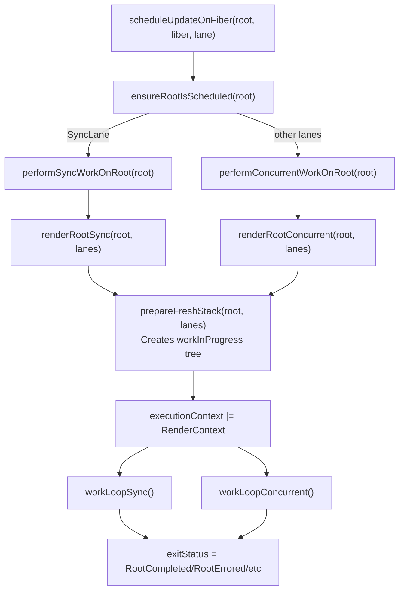
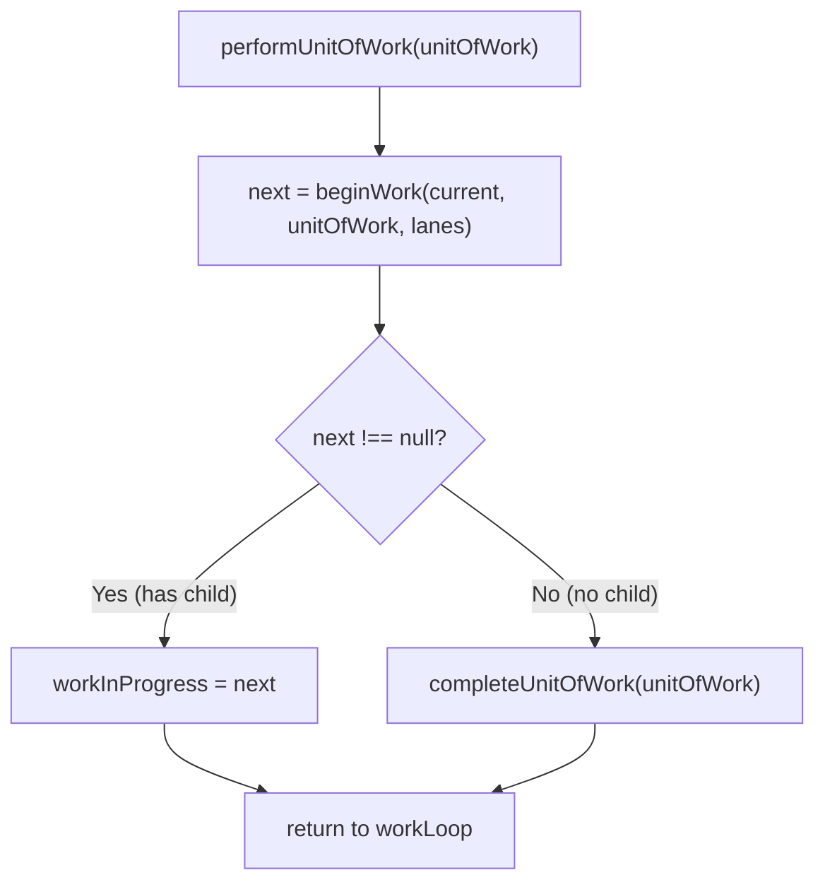
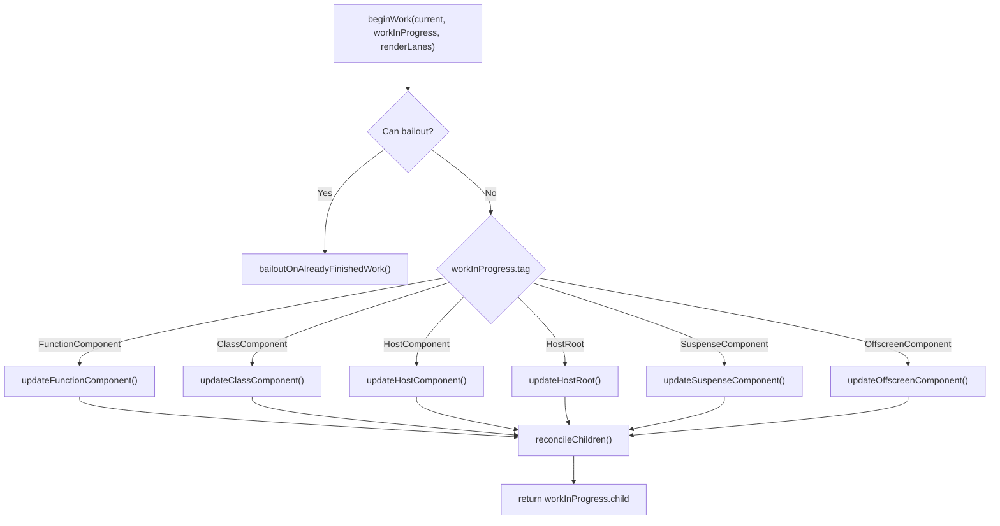
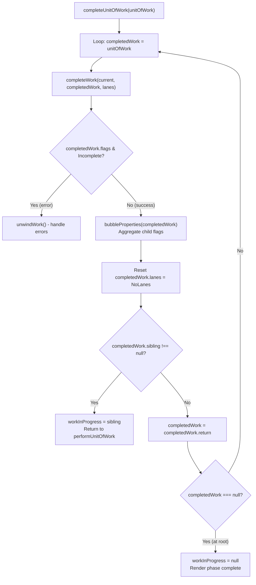
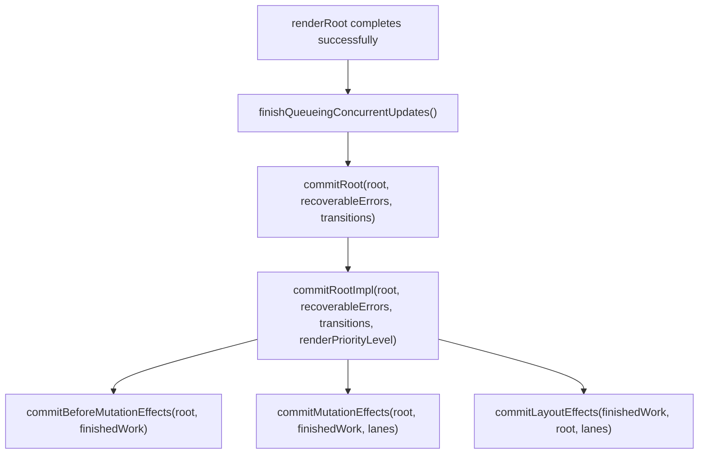
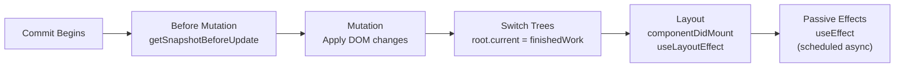
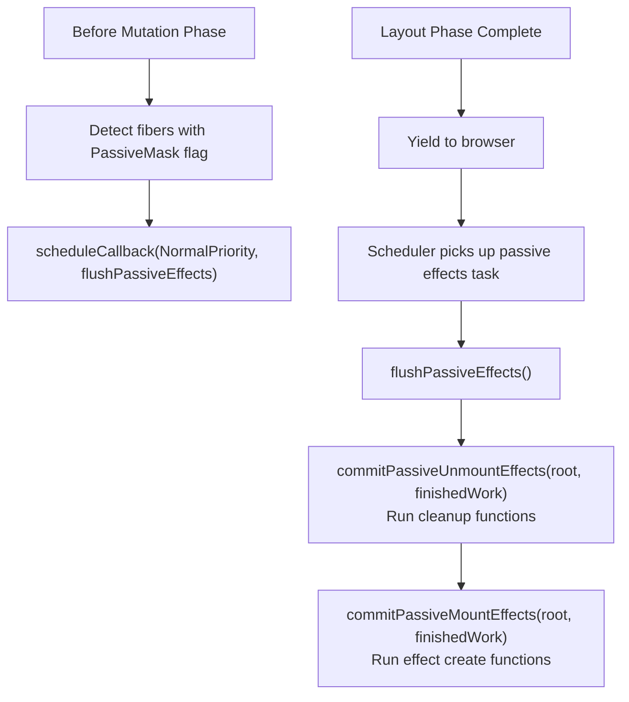
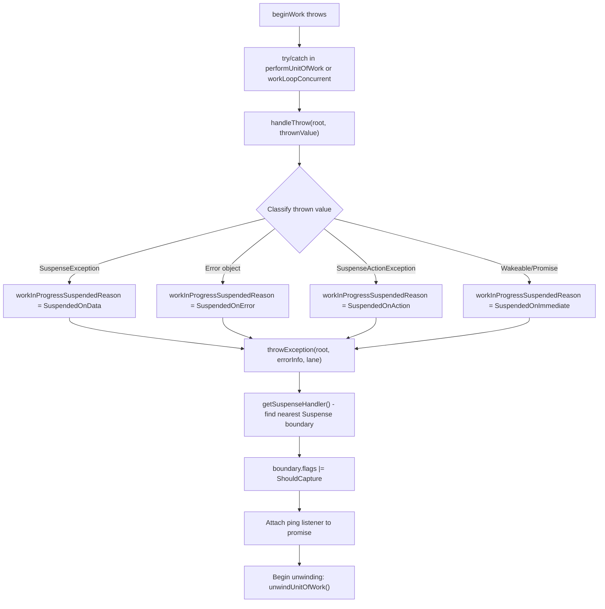
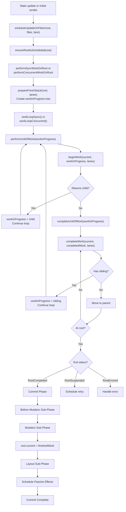

# Work Loop 和渲染阶段

<!-- > 来源：https://deepwiki.com/facebook/react/4.2-work-loop-and-rendering-phases -->

<details>
<summary>相关源文件</summary>

以下文件用于生成此 wiki 页面的上下文：

- [packages/react-client/src/ReactFlightPerformanceTrack.js](https://github.com/facebook/react/blob/main/packages/react-client/src/ReactFlightPerformanceTrack.js)
- [packages/react-dom/index.js](https://github.com/facebook/react/blob/main/packages/react-dom/index.js)
- [packages/react-dom/src/__tests__/ReactDOMFiberAsync-test.js](https://github.com/facebook/react/blob/main/packages/react-dom/src/__tests__/ReactDOMFiberAsync-test.js)
- [packages/react-dom/src/__tests__/refs-test.js](https://github.com/facebook/react/blob/main/packages/react-dom/src/__tests__/refs-test.js)
- [packages/react-reconciler/src/ReactChildFiber.js](https://github.com/facebook/react/blob/main/packages/react-reconciler/src/ReactChildFiber.js)
- [packages/react-reconciler/src/ReactFiber.js](https://github.com/facebook/react/blob/main/packages/react-reconciler/src/ReactFiber.js)
- [packages/react-reconciler/src/ReactFiberBeginWork.js](https://github.com/facebook/react/blob/main/packages/react-reconciler/src/ReactFiberBeginWork.js)
- [packages/react-reconciler/src/ReactFiberClassComponent.js](https://github.com/facebook/react/blob/main/packages/react-reconciler/src/ReactFiberClassComponent.js)
- [packages/react-reconciler/src/ReactFiberCommitWork.js](https://github.com/facebook/react/blob/main/packages/react-reconciler/src/ReactFiberCommitWork.js)
- [packages/react-reconciler/src/ReactFiberCompleteWork.js](https://github.com/facebook/react/blob/main/packages/react-reconciler/src/ReactFiberCompleteWork.js)
- [packages/react-reconciler/src/ReactFiberLane.js](https://github.com/facebook/react/blob/main/packages/react-reconciler/src/ReactFiberLane.js)
- [packages/react-reconciler/src/ReactFiberPerformanceTrack.js](https://github.com/facebook/react/blob/main/packages/react-reconciler/src/ReactFiberPerformanceTrack.js)
- [packages/react-reconciler/src/ReactFiberReconciler.js](https://github.com/facebook/react/blob/main/packages/react-reconciler/src/ReactFiberReconciler.js)
- [packages/react-reconciler/src/ReactFiberRootScheduler.js](https://github.com/facebook/react/blob/main/packages/react-reconciler/src/ReactFiberRootScheduler.js)
- [packages/react-reconciler/src/ReactFiberSuspenseComponent.js](https://github.com/facebook/react/blob/main/packages/react-reconciler/src/ReactFiberSuspenseComponent.js)
- [packages/react-reconciler/src/ReactFiberUnwindWork.js](https://github.com/facebook/react/blob/main/packages/react-reconciler/src/ReactFiberUnwindWork.js)
- [packages/react-reconciler/src/ReactFiberWorkLoop.js](https://github.com/facebook/react/blob/main/packages/react-reconciler/src/ReactFiberWorkLoop.js)
- [packages/react-reconciler/src/ReactProfilerTimer.js](https://github.com/facebook/react/blob/main/packages/react-reconciler/src/ReactProfilerTimer.js)
- [packages/react-reconciler/src/__tests__/ReactDeferredValue-test.js](https://github.com/facebook/react/blob/main/packages/react-reconciler/src/__tests__/ReactDeferredValue-test.js)
- [packages/react-reconciler/src/__tests__/ReactLazy-test.internal.js](https://github.com/facebook/react/blob/main/packages/react-reconciler/src/__tests__/ReactLazy-test.internal.js)
- [packages/react-reconciler/src/__tests__/ReactPerformanceTrack-test.js](https://github.com/facebook/react/blob/main/packages/react-reconciler/src/__tests__/ReactPerformanceTrack-test.js)
- [packages/react-reconciler/src/__tests__/ReactSiblingPrerendering-test.js](https://github.com/facebook/react/blob/main/packages/react-reconciler/src/__tests__/ReactSiblingPrerendering-test.js)
- [packages/react-reconciler/src/__tests__/ReactSuspense-test.internal.js](https://github.com/facebook/react/blob/main/packages/react-reconciler/src/__tests__/ReactSuspense-test.internal.js)
- [packages/react-reconciler/src/__tests__/ReactSuspensePlaceholder-test.internal.js](https://github.com/facebook/react/blob/main/packages/react-reconciler/src/__tests__/ReactSuspensePlaceholder-test.internal.js)
- [packages/react-reconciler/src/__tests__/ReactSuspenseyCommitPhase-test.js](https://github.com/facebook/react/blob/main/packages/react-reconciler/src/__tests__/ReactSuspenseyCommitPhase-test.js)
- [packages/react-server/src/ReactFlightAsyncSequence.js](https://github.com/facebook/react/blob/main/packages/react-server/src/ReactFlightAsyncSequence.js)
- [packages/react-server/src/ReactFlightServerConfigDebugNode.js](https://github.com/facebook/react/blob/main/packages/react-server/src/ReactFlightServerConfigDebugNode.js)
- [packages/react-server/src/ReactFlightServerConfigDebugNoop.js](https://github.com/facebook/react/blob/main/packages/react-server/src/ReactFlightServerConfigDebugNoop.js)
- [packages/react-server/src/ReactFlightStackConfigV8.js](https://github.com/facebook/react/blob/main/packages/react-server/src/ReactFlightStackConfigV8.js)
- [packages/react-server/src/__tests__/ReactFlightAsyncDebugInfo-test.js](https://github.com/facebook/react/blob/main/packages/react-server/src/__tests__/ReactFlightAsyncDebugInfo-test.js)
- [packages/react/src/ReactLazy.js](https://github.com/facebook/react/blob/main/packages/react/src/ReactLazy.js)
- [packages/react/src/__tests__/ReactProfiler-test.internal.js](https://github.com/facebook/react/blob/main/packages/react/src/__tests__/ReactProfiler-test.internal.js)
- [packages/shared/ReactPerformanceTrackProperties.js](https://github.com/facebook/react/blob/main/packages/shared/ReactPerformanceTrackProperties.js)

</details>


本文档描述了 reconciler 的 Work Loop 执行流程以及处理 Fiber 树的三个阶段：**begin work**、**complete work** 和 **commit work**。Work Loop 是处理 fibers、确定变更并应用更新到宿主环境的核心机制。

关于 Fiber 数据结构本身的信息，请参阅 [Fiber 架构与数据结构](/4.1-fiber-architecture-and-data-structures)。关于调度和优先级管理的详细信息，请参阅 [基于 Lane 的调度与优先级](/4.4-lane-based-scheduling-and-priorities)。关于 commit phase 的 effects 系统，请参阅 [React Hooks 系统](/4.3-react-hooks-system)。

## 概述

Work Loop 在 [packages/react-reconciler/src/ReactFiberWorkLoop.js](https://github.com/facebook/react/blob/main/packages/react-reconciler/src/ReactFiberWorkLoop.js) 中实现。它协调两个不同的阶段：

| 阶段 | 目的 | 可中断？ |
|-------|---------|-------------------|
| **Render Phase** | 遍历 Fiber 树，计算变更，标记 effects | 是（在并发模式下） |
| **Commit Phase** | 将计算出的变更应用到宿主环境 | 否（同步） |

Render phase 通过两个子阶段处理 fibers：`beginWork` 和 `completeWork`。Commit phase 通过三个子阶段执行：`commitBeforeMutationEffects`、`commitMutationEffects` 和 `commitLayoutEffects`。

**来源：** [packages/react-reconciler/src/ReactFiberWorkLoop.js#L1-L3000](https://github.com/facebook/react/blob/main/packages/react-reconciler/src/ReactFiberWorkLoop.js#L1-L3000)

## Work Loop 执行

### 入口点与根处理

对根的工作通过两个主要入口点之一开始：

```
performSyncWorkOnRoot(root)      // 同步，不可中断
performConcurrentWorkOnRoot(root) // 并发，可以 yield
```

两个函数都遵循以下模式：
1. 准备工作进行中的根和 lanes
2. 进入 render phase（`renderRootSync` 或 `renderRootConcurrent`）
3. 如果 render 成功完成，进入 commit phase（`commitRoot`）

**Render Phase 入口：**



`prepareFreshStack` 函数通过调用 `createWorkInProgress(root.current, null)` 创建工作进行中的树，该函数要么复用现有的 alternate fiber，要么创建一个新的。

**来源：** [packages/react-reconciler/src/ReactFiberWorkLoop.js#L966-L1092](https://github.com/facebook/react/blob/main/packages/react-reconciler/src/ReactFiberWorkLoop.js#L966-L1092), [packages/react-reconciler/src/ReactFiberWorkLoop.js#L1116-L1300](https://github.com/facebook/react/blob/main/packages/react-reconciler/src/ReactFiberWorkLoop.js#L1116-L1300)

### Work Loop

实际的 work loop 非常简单：

```javascript
// 同步模式 - 从不 yield
function workLoopSync() {
  while (workInProgress !== null) {
    performUnitOfWork(workInProgress);
  }
}

// 并发模式 - 当 shouldYield() 返回 true 时 yield
function workLoopConcurrent() {
  while (workInProgress !== null && !shouldYield()) {
    performUnitOfWork(workInProgress);
  }
}
```

`workInProgress` 变量指向当前正在处理的 Fiber。`performUnitOfWork` 处理一个工作单元并前进到下一个 fiber。

`shouldYield()` 函数从 Scheduler 包导入，检查当前时间切片是否已过期。在并发模式下，如果 `shouldYield()` 返回 true，React 会暂停工作并将控制权返回给浏览器，允许浏览器处理更高优先级的工作（如用户输入）。

**来源：** [packages/react-reconciler/src/ReactFiberWorkLoop.js#L1801-L1812](https://github.com/facebook/react/blob/main/packages/react-reconciler/src/ReactFiberWorkLoop.js#L1801-L1812), [packages/react-reconciler/src/Scheduler.js#L70-L76](https://github.com/facebook/react/blob/main/packages/react-reconciler/src/Scheduler.js#L70-L76)

### Work Loop 状态变量

Work Loop 维护几个模块级变量来跟踪当前状态：

| 变量 | 类型 | 目的 |
|----------|------|---------|
| `workInProgressRoot` | `FiberRoot \| null` | 当前正在处理的根 |
| `workInProgress` | `Fiber \| null` | 当前正在处理的 fiber |
| `workInProgressRootRenderLanes` | `Lanes` | 正在渲染的 lanes |
| `workInProgressSuspendedReason` | `SuspendedReason` | 工作被暂停的原因（0-9：NotSuspended、SuspendedOnError、SuspendedOnData 等） |
| `workInProgressRootExitStatus` | `RootExitStatus` | 最终状态：RootInProgress、RootCompleted、RootErrored、RootSuspended 等 |
| `workInProgressThrownValue` | `mixed` | 被抛出的值（promise、error 等） |
| `executionContext` | `ExecutionContext` | 跟踪当前上下文的位掩码：NoContext、RenderContext、CommitContext |

`executionContext` 变量跟踪 React 当前正在执行的阶段：

```javascript
const NoContext = 0b000;
const RenderContext = 0b010;  // 当前在 render phase
const CommitContext = 0b100;  // 当前在 commit phase
```

这可以防止重入更新，并有助于检测不当的使用模式。

**来源：** [packages/react-reconciler/src/ReactFiberWorkLoop.js#L418-L458](https://github.com/facebook/react/blob/main/packages/react-reconciler/src/ReactFiberWorkLoop.js#L418-L458)

## Render Phase：Begin Work 和 Complete Work

Render phase 以深度优先遍历的方式处理 Fiber 树，向下时调用 `beginWork`，向上时调用 `completeWork`。

### performUnitOfWork 流程



**来源：** [packages/react-reconciler/src/ReactFiberWorkLoop.js#L1814-L1848](https://github.com/facebook/react/blob/main/packages/react-reconciler/src/ReactFiberWorkLoop.js#L1814-L1848)

### Begin Work 阶段

[packages/react-reconciler/src/ReactFiberBeginWork.js](https://github.com/facebook/react/blob/main/packages/react-reconciler/src/ReactFiberBeginWork.js) 中的 `beginWork` 函数负责：

1. 确定 fiber 的工作是否可以跳过（bailout 优化）
2. 根据 fiber 的 tag 创建或更新子 fibers
3. 返回要处理的下一个子 fiber

**按 Fiber Tag 的 Begin Work 分发：**



**关键 Begin Work 函数：**

| 函数 | Fiber Tag | 职责 |
|----------|-----------|----------------|
| `updateFunctionComponent` | FunctionComponent、ForwardRef、SimpleMemoComponent | 调用 `renderWithHooks` 执行函数体和 hooks |
| `updateClassComponent` | ClassComponent | 处理生命周期：`componentWillMount`、`getDerivedStateFromProps`、`render` 等 |
| `updateHostComponent` | HostComponent | 处理 DOM 元素（div、span 等），标记 props 更新 |
| `updateHostRoot` | HostRoot | 处理根容器，应用 context 更新 |
| `updateSuspenseComponent` | SuspenseComponent | 根据暂停状态管理 fallback 与 primary content |
| `updateOffscreenComponent` | OffscreenComponent | 处理隐藏子树和预渲染 |
| `reconcileChildren` | （全部） | 核心 diffing 算法 - 协调当前子节点与新子节点 |

当组件可以跳过重新渲染时，会调用 `bailoutOnAlreadyFinishedWork` 函数。它检查 `workInProgress.lanes` 和 `renderLanes` 是否没有重叠，如果是，则在不做任何工作的情况下克隆子节点。

**来源：** [packages/react-reconciler/src/ReactFiberBeginWork.js#L3746-L4016](https://github.com/facebook/react/blob/main/packages/react-reconciler/src/ReactFiberBeginWork.js#L3746-L4016), [packages/react-reconciler/src/ReactFiberBeginWork.js#L340-L371](https://github.com/facebook/react/blob/main/packages/react-reconciler/src/ReactFiberBeginWork.js#L340-L371), [packages/react-reconciler/src/ReactFiberBeginWork.js#L3569-L3633](https://github.com/facebook/react/blob/main/packages/react-reconciler/src/ReactFiberBeginWork.js#L3569-L3633)

### Complete Work 阶段

当 `beginWork` 返回 `null`（没有更多子节点要处理）时，会调用 `completeUnitOfWork`。此函数：

1. 在当前 fiber 上调用 `completeWork`
2. 通过向上冒泡收集子树 flags
3. 移动到下一个兄弟节点或返回到父节点

**Complete Unit of Work 流程：**



在 `completeUnitOfWork` 期间，如果设置了 `Incomplete` flag，表示发生了错误或暂停。然后函数调用 `unwindWork` 来清理 context 栈并找到错误边界或 suspense 边界。

**来源：** [packages/react-reconciler/src/ReactFiberWorkLoop.js#L1850-L1980](https://github.com/facebook/react/blob/main/packages/react-reconciler/src/ReactFiberWorkLoop.js#L1850-L1980)

[packages/react-reconciler/src/ReactFiberCompleteWork.js](https://github.com/facebook/react/blob/main/packages/react-reconciler/src/ReactFiberCompleteWork.js) 中的 `completeWork` 函数处理：

- 为新的 HostComponents 创建宿主实例（DOM 节点）
- 更新已更改的 props
- 在需要工作时标记 Update flags
- 处理服务器渲染内容的 hydration

**关键 Complete Work 职责：**

| Fiber Tag | Complete Work 操作 |
|-----------|---------------------|
| HostComponent | 创建 DOM 节点，追加子节点，完成 props |
| HostText | 创建文本节点 |
| HostRoot | 如果使用持久化模式，完成容器 |
| SuspenseComponent | 确定显示 fallback 还是 primary content |
| OffscreenComponent | 处理可见性转换 |

**来源：** [packages/react-reconciler/src/ReactFiberWorkLoop.js#L1850-L1980](https://github.com/facebook/react/blob/main/packages/react-reconciler/src/ReactFiberWorkLoop.js#L1850-L1980), [packages/react-reconciler/src/ReactFiberCompleteWork.js#L845-L1400](https://github.com/facebook/react/blob/main/packages/react-reconciler/src/ReactFiberCompleteWork.js#L845-L1400)

### Flags 和子树 Flags

在 render phase 期间，fibers 被标记**flags**，指示在 commit 期间需要应用哪些 effects。`bubbleProperties` 函数将这些 flags 向上传播到树中：

```javascript
function bubbleProperties(completedWork) {
  let subtreeFlags = NoFlags;
  let child = completedWork.child;
  
  // 从所有子节点收集 flags
  while (child !== null) {
    subtreeFlags |= child.subtreeFlags;
    subtreeFlags |= child.flags;
    child = child.sibling;
  }
  
  completedWork.subtreeFlags = subtreeFlags;
}
```

这允许祖先 fibers 知道是否有任何后代有 effects，从而在 commit 期间实现高效遍历。

**来源：** [packages/react-reconciler/src/ReactFiberCompleteWork.js#L662-L724](https://github.com/facebook/react/blob/main/packages/react-reconciler/src/ReactFiberCompleteWork.js#L662-L724)

## Commit Phase

一旦 render phase 成功完成（`workInProgressRootExitStatus === RootCompleted`），commit phase 开始。Commit phase 是**同步且不可中断的**——一旦开始就必须完成。

### Commit Root 入口



**来源：** [packages/react-reconciler/src/ReactFiberWorkLoop.js#L2210-L2350](https://github.com/facebook/react/blob/main/packages/react-reconciler/src/ReactFiberWorkLoop.js#L2210-L2350)

### Commit 子阶段

Commit phase 按三个顺序子阶段执行：

#### 1. Before Mutation 阶段

**目的：** 在 mutations 发生之前运行读取 DOM 的 effects

**关键函数：** `commitBeforeMutationEffects(root, firstChild, committedLanes)`

此阶段遍历树，对每个 fiber：

| Fiber Tag | 操作 |
|-----------|--------|
| ClassComponent | 调用 `instance.getSnapshotBeforeUpdate(prevProps, prevState)` |
| HostRoot | 如果需要，清除容器 |
| FunctionComponent | 更新 `useImperativeHandle` 的 ref.impl |

遍历模式使用 `nextEffect` 指针并处理：
1. 每个 fiber 上的 deletions 数组
2. 通过 `commitBeforeMutationEffectsOnFiber` 处理 fiber 本身
3. 递归处理子节点

**来源：** [packages/react-reconciler/src/ReactFiberCommitWork.js#L343-L362](https://github.com/facebook/react/blob/main/packages/react-reconciler/src/ReactFiberCommitWork.js#L343-L362), [packages/react-reconciler/src/ReactFiberCommitWork.js#L474-L569](https://github.com/facebook/react/blob/main/packages/react-reconciler/src/ReactFiberCommitWork.js#L474-L569)

#### 2. Mutation 阶段

**目的：** 应用所有 DOM mutations（插入、更新、删除）

**关键函数：** `commitMutationEffects(root, finishedWork, committedLanes)`

这是实际 DOM 变更发生的地方：

| 操作 | 函数 | 作用 |
|-----------|----------|--------------|
| Insert/Move | `commitPlacement(finishedWork)` | 使用 `insertBefore` 或 `appendChild` 将 fiber 的宿主实例插入到父节点中 |
| Update | `commitUpdate(instance, updatePayload, type, oldProps, newProps)` | 使用 `updateProperties` 更新 DOM 属性 |
| Delete | `commitDeletion(root, deletion)` | 递归卸载子树并从 DOM 中移除 |
| Text Update | `commitTextUpdate(textInstance, oldText, newText)` | 更新文本节点的 `nodeValue` |
| Ref Update | `safelyDetachRef(fiber)` / `safelyAttachRef(fiber)` | 分离旧的 refs，附加新的 refs |

**关键时刻：** mutations 完成后，发生树切换：

```javascript
root.current = finishedWork;
```

工作进行中的树成为当前树。从这一点开始，新树是"活跃的"。

**来源：** [packages/react-reconciler/src/ReactFiberCommitWork.js#L1817-L1900](https://github.com/facebook/react/blob/main/packages/react-reconciler/src/ReactFiberCommitWork.js#L1817-L1900), [packages/react-reconciler/src/ReactFiberCommitHostEffects.js#L250-L485](https://github.com/facebook/react/blob/main/packages/react-reconciler/src/ReactFiberCommitHostEffects.js#L250-L485), [packages/react-reconciler/src/ReactFiberCommitHostEffects.js#L132-L150](https://github.com/facebook/react/blob/main/packages/react-reconciler/src/ReactFiberCommitHostEffects.js#L132-L150)

#### 3. Layout 阶段

**目的：** 运行需要读取更新后 DOM layout 的 effects

**关键函数：** `commitLayoutEffects(finishedRoot, finishedWork, committedLanes)`

此阶段在 mutations 之后同步运行，并调用：

| Fiber Tag | 调用的生命周期方法 |
|-----------|-------------------------|
| ClassComponent | `componentDidMount()` 或 `componentDidUpdate(prevProps, prevState, snapshot)` |
| FunctionComponent | 来自 `useLayoutEffect(() => { ... })` 的 Layout effects |
| HostRoot | 根级回调（如果有） |
| Profiler | `onRender(id, phase, actualDuration, ...)` |

Layout effect 执行顺序：
1. 深度优先遍历树
2. 对函数组件调用 `commitHookLayoutEffects(fiber, HookLayout | HookHasEffect)`
3. 对类组件调用 `commitClassLayoutLifecycles(fiber, current)`
4. 通过 `safelyAttachRef(fiber, fiber.return)` 附加 refs

**来源：** [packages/react-reconciler/src/ReactFiberCommitWork.js#L590-L800](https://github.com/facebook/react/blob/main/packages/react-reconciler/src/ReactFiberCommitWork.js#L590-L800), [packages/react-reconciler/src/ReactFiberCommitEffects.js#L1-L150](https://github.com/facebook/react/blob/main/packages/react-reconciler/src/ReactFiberCommitEffects.js#L1-L150)

**Commit Phase 时间线：**



**来源：** [packages/react-reconciler/src/ReactFiberWorkLoop.js#L2510-L2900](https://github.com/facebook/react/blob/main/packages/react-reconciler/src/ReactFiberWorkLoop.js#L2510-L2900)

### Passive Effects (useEffect)

与在 commit 期间同步运行的 layout effects 不同，passive effects（来自 `useEffect`）被调度在 commit phase 完成后运行。它们在一个单独的任务中运行：

**Passive Effect 调度流程：**



**关键函数：**

- `commitPassiveUnmountEffects`：遍历树并调用来自上一次渲染的 `destroy()` 函数
- `commitPassiveMountEffects`：遍历树并调用 effect `create()` 函数，存储返回的 cleanup
- `commitHookPassiveUnmountEffects(fiber, HookPassive | HookHasEffect)`：处理单个 hook effect
- `commitHookPassiveMountEffects(fiber, HookPassive | HookHasEffect)`：运行 effect 回调

这种分离允许浏览器在运行 effects 之前进行绘制，从而改善感知性能。

**来源：** [packages/react-reconciler/src/ReactFiberCommitWork.js#L2300-L2500](https://github.com/facebook/react/blob/main/packages/react-reconciler/src/ReactFiberCommitWork.js#L2300-L2500), [packages/react-reconciler/src/ReactFiberCommitEffects.js#L150-L300](https://github.com/facebook/react/blob/main/packages/react-reconciler/src/ReactFiberCommitEffects.js#L150-L300)

## 错误处理与暂停

### 暂停的 Render

如果在 `beginWork` 期间组件抛出 promise（Suspense）或遇到错误，work loop 进入暂停状态：



**关键暂停原因（workInProgressSuspendedReason）：**

| 原因 | 值 | 触发条件 |
|--------|-------|--------------|
| NotSuspended | 0 | 正常执行 |
| SuspendedOnError | 1 | 在 render 期间抛出错误 |
| SuspendedOnData | 2 | 从 `use(promise)` 或传统 Suspense 抛出的 Promise |
| SuspendedOnImmediate | 3 | 没有 fallback 的 Promise |
| SuspendedOnAction | 9 | 服务器 Action 暂停 |

当抛出 promise 时，React：
1. 通过 `getSuspenseHandler()` 找到最近的 Suspense 边界
2. 用 `ShouldCapture` flag 标记它
3. 附加一个 ping 监听器，当 promise 解析时会调度重试
4. 展开栈到边界
5. 从边界重新渲染，这次渲染 fallback

**来源：** [packages/react-reconciler/src/ReactFiberWorkLoop.js#L1610-L1800](https://github.com/facebook/react/blob/main/packages/react-reconciler/src/ReactFiberWorkLoop.js#L1610-L1800), [packages/react-reconciler/src/ReactFiberThrow.js#L200-L600](https://github.com/facebook/react/blob/main/packages/react-reconciler/src/ReactFiberThrow.js#L200-L600), [packages/react-reconciler/src/ReactFiberWorkLoop.js#L441-L451](https://github.com/facebook/react/blob/main/packages/react-reconciler/src/ReactFiberWorkLoop.js#L441-L451)

### Unwind Work

当由于错误或暂停而展开时，在每个 fiber 上调用 `unwindWork` 进行清理：

**按 Fiber Tag 的 Unwind Work：**

| Fiber Tag | 清理操作 |
|-----------|----------------|
| ClassComponent | 如果是 context provider，则 `popLegacyContext(workInProgress)` |
| HostRoot | `popHostContainer`、`popTopLevelLegacyContextObject`、`popRootTransition`、`popCacheProvider` |
| HostComponent | `popHostContext(workInProgress)` |
| SuspenseComponent | `popSuspenseHandler(workInProgress)` |
| OffscreenComponent | `popHiddenContext`、`popSuspenseHandler` |
| CacheComponent | `popCacheProvider` |

如果 fiber 有 `ShouldCapture` flag，`unwindWork` 将其转换为 `DidCapture` 并返回 fiber，告诉 work loop 从这一点重新渲染（用于错误边界和 Suspense 边界）。

`unwindInterruptedWork` 函数类似，但在工作被中断时使用（例如，更高优先级的更新到达），并且不处理错误捕获。

**来源：** [packages/react-reconciler/src/ReactFiberUnwindWork.js#L66-L200](https://github.com/facebook/react/blob/main/packages/react-reconciler/src/ReactFiberUnwindWork.js#L66-L200)

## 完整 Work Loop 图



**来源：** [packages/react-reconciler/src/ReactFiberWorkLoop.js#L400-L3000](https://github.com/facebook/react/blob/main/packages/react-reconciler/src/ReactFiberWorkLoop.js#L400-L3000), [packages/react-reconciler/src/ReactFiberBeginWork.js#L1-L4000](https://github.com/facebook/react/blob/main/packages/react-reconciler/src/ReactFiberBeginWork.js#L1-L4000), [packages/react-reconciler/src/ReactFiberCompleteWork.js#L1-L1400](https://github.com/facebook/react/blob/main/packages/react-reconciler/src/ReactFiberCompleteWork.js#L1-L1400), [packages/react-reconciler/src/ReactFiberCommitWork.js#L1-L3500](https://github.com/facebook/react/blob/main/packages/react-reconciler/src/ReactFiberCommitWork.js#L1-L3500)
