# React Hooks 系统

<!-- > 来源：https://deepwiki.com/facebook/react/4.3-react-hooks-system -->

<details>
<summary>相关源文件</summary>

以下文件用于生成此 wiki 页面的上下文：

- [packages/react-debug-tools/src/ReactDebugHooks.js](https://github.com/facebook/react/blob/main/packages/react-debug-tools/src/ReactDebugHooks.js)
- [packages/react-debug-tools/src/__tests__/ReactHooksInspection-test.js](https://github.com/facebook/react/blob/main/packages/react-debug-tools/src/__tests__/ReactHooksInspection-test.js)
- [packages/react-debug-tools/src/__tests__/ReactHooksInspectionIntegration-test.js](https://github.com/facebook/react/blob/main/packages/react-debug-tools/src/__tests__/ReactHooksInspectionIntegration-test.js)
- [packages/react-debug-tools/src/__tests__/ReactHooksInspectionIntegrationDOM-test.js](https://github.com/facebook/react/blob/main/packages/react-debug-tools/src/__tests__/ReactHooksInspectionIntegrationDOM-test.js)
- [packages/react-devtools-shell/src/app/InspectableElements/CustomHooks.js](https://github.com/facebook/react/blob/main/packages/react-devtools-shell/src/app/InspectableElements/CustomHooks.js)
- [packages/react-reconciler/src/ReactFiberHooks.js](https://github.com/facebook/react/blob/main/packages/react-reconciler/src/ReactFiberHooks.js)
- [packages/react-reconciler/src/ReactFiberOffscreenComponent.js](https://github.com/facebook/react/blob/main/packages/react-reconciler/src/ReactFiberOffscreenComponent.js)
- [packages/react-reconciler/src/ReactFiberRoot.js](https://github.com/facebook/react/blob/main/packages/react-reconciler/src/ReactFiberRoot.js)
- [packages/react-reconciler/src/ReactInternalTypes.js](https://github.com/facebook/react/blob/main/packages/react-reconciler/src/ReactInternalTypes.js)
- [packages/react-reconciler/src/__tests__/ReactHooks-test.internal.js](https://github.com/facebook/react/blob/main/packages/react-reconciler/src/__tests__/ReactHooks-test.internal.js)
- [packages/react-reconciler/src/__tests__/ReactHooksWithNoopRenderer-test.js](https://github.com/facebook/react/blob/main/packages/react-reconciler/src/__tests__/ReactHooksWithNoopRenderer-test.js)
- [packages/react-reconciler/src/__tests__/ReactSuspenseWithNoopRenderer-test.js](https://github.com/facebook/react/blob/main/packages/react-reconciler/src/__tests__/ReactSuspenseWithNoopRenderer-test.js)
- [packages/react-server/src/ReactFizzHooks.js](https://github.com/facebook/react/blob/main/packages/react-server/src/ReactFizzHooks.js)
- [packages/react-server/src/ReactFlightHooks.js](https://github.com/facebook/react/blob/main/packages/react-server/src/ReactFlightHooks.js)
- [packages/react/src/ReactHooks.js](https://github.com/facebook/react/blob/main/packages/react/src/ReactHooks.js)

</details>


## 目的与范围

本文档描述 React Hooks 系统的实现，包括 dispatcher 模式、Hook 数据结构、effect 执行生命周期和调试能力。Hooks 使函数组件能够使用状态和生命周期特性，而无需编写类组件。

关于调用 Hooks 的整体协调过程，请参阅 [Fiber 架构与工作循环](/4.1-fiber-architecture-and-data-structures)。关于服务端渲染的具体内容，请参阅 [React Fizz（流式 SSR）](/5.1-react-fizz-(streaming-ssr))。关于 Hook 使用的静态分析，请参阅 [React Hooks 的 ESLint 插件](/7.2-devtools-distribution-and-integration)。

## 架构概览

Hooks 系统使用 **dispatcher 模式**，根据组件生命周期阶段提供不同的实现。在渲染期间，Hooks 解析为 mount、update 或 rerender dispatcher。Hook 状态以链表形式存储在 `fiber.memoizedState` 上，而 effects 在 `fiber.updateQueue.lastEffect` 上形成循环链表。

**Hooks 系统架构**

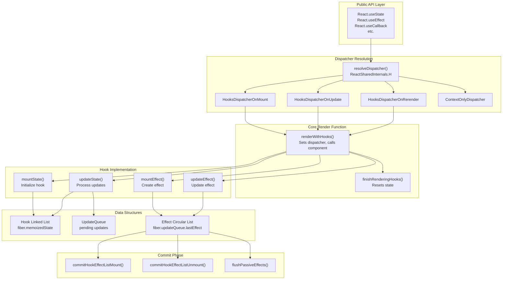

来源：[packages/react-reconciler/src/ReactFiberHooks.js#L1-L200](https://github.com/facebook/react/blob/main/packages/react-reconciler/src/ReactFiberHooks.js#L1-L200), [packages/react/src/ReactHooks.js#L1-L242](https://github.com/facebook/react/blob/main/packages/react/src/ReactHooks.js#L1-L242)

## 公共 Hooks API

公共 API 通过 `packages/react/src/ReactHooks.js` 暴露。每个 Hook 函数调用 `resolveDispatcher()` 从 `ReactSharedInternals.H` 获取当前 dispatcher，然后委托给 dispatcher 实现。

**可用的 Hooks**

| Hook | 用途 | 有状态 |
|------|---------|----------|
| `useState` | 本地组件状态 | 是 |
| `useReducer` | 带 reducer 逻辑的状态 | 是 |
| `useEffect` | 绘制后的副作用 | 否 |
| `useLayoutEffect` | 绘制前的副作用 | 否 |
| `useInsertionEffect` | CSS-in-JS 插入 | 否 |
| `useContext` | 读取 context 值 | 否 |
| `useRef` | 可变引用 | 是 |
| `useMemo` | 记忆化值 | 是 |
| `useCallback` | 记忆化回调 | 是 |
| `useImperativeHandle` | 自定义 ref 值 | 否 |
| `useDebugValue` | DevTools 标签 | 否 |
| `useId` | 稳定的唯一 ID | 是 |
| `useTransition` | 非阻塞更新 | 是 |
| `useDeferredValue` | 延迟值更新 | 是 |
| `useSyncExternalStore` | 订阅外部 store | 是 |
| `useOptimistic` | 乐观 UI 更新 | 是 |
| `useActionState` | 表单 action 状态 | 是 |
| `use` | 读取 Promise/Context | 否 |

**Dispatcher 解析流程**

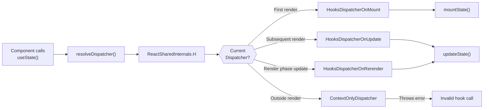

来源：[packages/react/src/ReactHooks.js#L24-L42](https://github.com/facebook/react/blob/main/packages/react/src/ReactHooks.js#L24-L42), [packages/react/src/ReactHooks.js#L66-L71](https://github.com/facebook/react/blob/main/packages/react/src/ReactHooks.js#L66-L71)

## Dispatcher 模式

Dispatcher 是一个动态虚函数表，根据组件生命周期阶段而变化。`renderWithHooks()` 在调用组件函数之前设置适当的 dispatcher，确保 Hooks 解析为正确的实现。

**Dispatcher 实现**

| Dispatcher | 何时使用 | 行为 |
|------------|-----------|----------|
| `HooksDispatcherOnMount` | 首次渲染（`current === null`） | 初始化 Hook 状态，创建链表 |
| `HooksDispatcherOnUpdate` | 后续渲染 | 复用现有 Hooks，处理更新 |
| `HooksDispatcherOnRerender` | 渲染阶段更新 | 处理渲染期间的 setState |
| `ContextOnlyDispatcher` | 组件渲染外部 | 抛出 "Invalid hook call" 错误 |
| `HooksDispatcherOnMountInDEV` | DEV 首次渲染 | 验证 Hook 顺序、依赖项 |
| `HooksDispatcherOnUpdateInDEV` | DEV 后续渲染 | 验证 Hook 顺序变化 |

**renderWithHooks 执行流程**

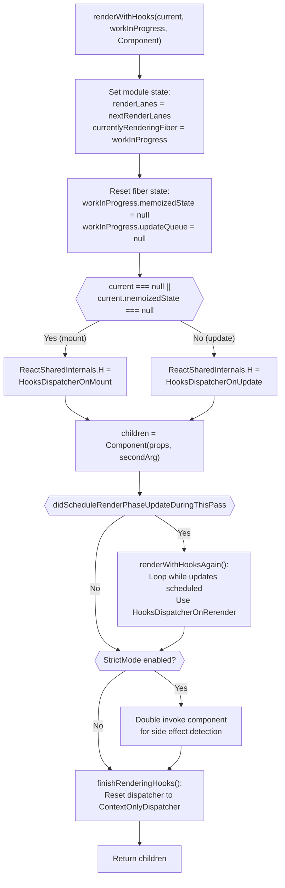

来源：[packages/react-reconciler/src/ReactFiberHooks.js#L503-L632](https://github.com/facebook/react/blob/main/packages/react-reconciler/src/ReactFiberHooks.js#L503-L632), [packages/react-reconciler/src/ReactFiberHooks.js#L634-L750](https://github.com/facebook/react/blob/main/packages/react-reconciler/src/ReactFiberHooks.js#L634-L750)

## Hook 数据结构

### Hook 链表

每次 Hook 调用都会将一个 `Hook` 对象追加到存储在 `fiber.memoizedState` 上的单向链表。链表顺序必须在多次渲染间保持恒定（通过 DEV 警告强制执行）。

**Hook 对象结构**

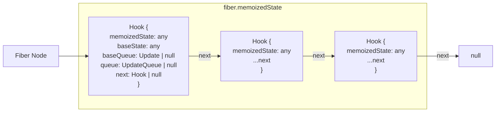

`Hook` 类型定义：

```typescript
type Hook = {
  memoizedState: any,      // Current state value or effect list
  baseState: any,          // State before pending updates
  baseQueue: Update | null, // Updates skipped by priority
  queue: any,              // UpdateQueue for useState/useReducer
  next: Hook | null        // Next hook in list
}
```

来源：[packages/react-reconciler/src/ReactFiberHooks.js#L195-L201](https://github.com/facebook/react/blob/main/packages/react-reconciler/src/ReactFiberHooks.js#L195-L201), [packages/react-reconciler/src/ReactFiberHooks.js#L980-L999](https://github.com/facebook/react/blob/main/packages/react-reconciler/src/ReactFiberHooks.js#L980-L999)

### UpdateQueue 结构

状态 Hooks（`useState`、`useReducer`）维护一个 `UpdateQueue` 来跟踪待处理的更新。更新形成循环链表，并在渲染期间按顺序处理。

**UpdateQueue 和 Update 结构**

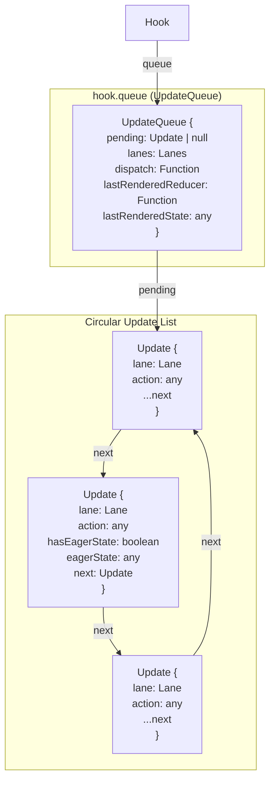

来源：[packages/react-reconciler/src/ReactFiberHooks.js#L165-L181](https://github.com/facebook/react/blob/main/packages/react-reconciler/src/ReactFiberHooks.js#L165-L181), [packages/react-reconciler/src/ReactFiberHooks.js#L175-L181](https://github.com/facebook/react/blob/main/packages/react-reconciler/src/ReactFiberHooks.js#L175-L181)

### Effect 循环链表

Effects（`useEffect`、`useLayoutEffect`、`useInsertionEffect`）存储在 `fiber.updateQueue.lastEffect` 上的循环链表中。每个 `Effect` 对象包含 effect 函数、cleanup 函数、依赖项和标志。

**Effect 数据结构**

```typescript
type Effect = {
  tag: HookFlags,              // HookPassive | HookLayout | HookInsertion
  inst: EffectInstance,        // { destroy: Function | void }
  create: () => (() => void) | void,  // Effect function
  deps: Array<mixed> | void | null,   // Dependency array
  next: Effect                 // Next effect in circular list
}

type FunctionComponentUpdateQueue = {
  lastEffect: Effect | null,   // Tail of circular effect list
  events: Array<any> | null,   // Event functions
  stores: Array<any> | null,   // Store consistency checks
  memoCache: MemoCache | null  // Compiler cache
}
```

`lastEffect` 指针指向循环链表中的**最后一个** effect，因此 `lastEffect.next` 是**第一个** effect。

来源：[packages/react-reconciler/src/ReactFiberHooks.js#L217-L227](https://github.com/facebook/react/blob/main/packages/react-reconciler/src/ReactFiberHooks.js#L217-L227), [packages/react-reconciler/src/ReactFiberHooks.js#L247-L252](https://github.com/facebook/react/blob/main/packages/react-reconciler/src/ReactFiberHooks.js#L247-L252)

## 核心 Hook 实现

### 状态 Hooks：useState 和 useReducer

`useState` 实现为带有基本状态 reducer 的专用 `useReducer`。两者都遵循 mount/update 模式。

**useState/useReducer 实现流程**

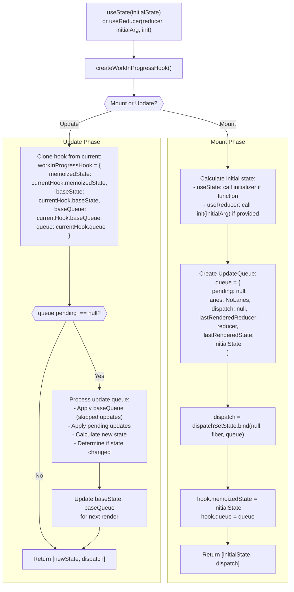

**急切状态计算**

当调用 `setState` 时，如果队列为空，React 会尝试在渲染外部急切地计算新状态。如果新状态等于当前状态（使用 `Object.is`），React 可以完全跳过渲染。

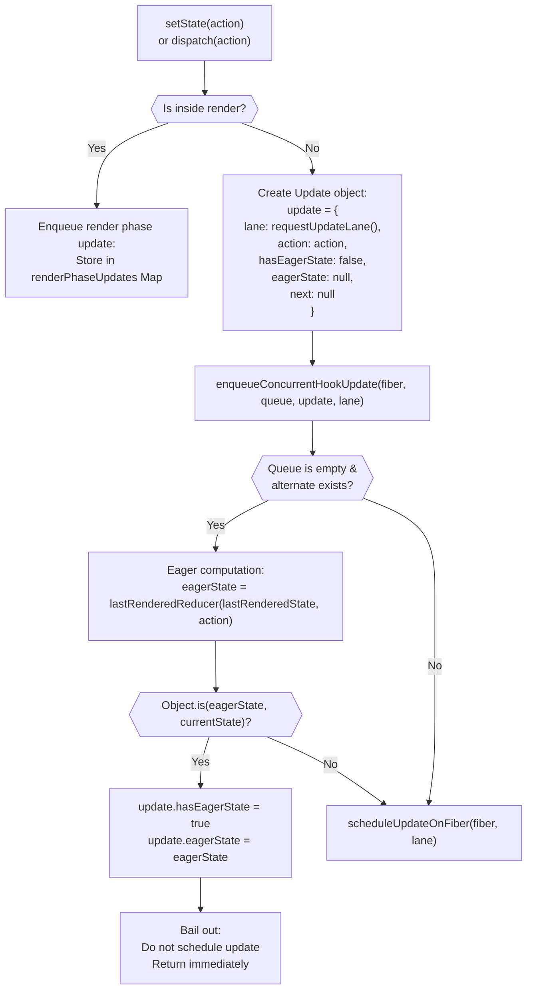

来源：[packages/react-reconciler/src/ReactFiberHooks.js#L1095-L1253](https://github.com/facebook/react/blob/main/packages/react-reconciler/src/ReactFiberHooks.js#L1095-L1253), [packages/react-reconciler/src/ReactFiberHooks.js#L2648-L2861](https://github.com/facebook/react/blob/main/packages/react-reconciler/src/ReactFiberHooks.js#L2648-L2861)

### Effect Hooks：useEffect、useLayoutEffect、useInsertionEffect

Effect Hooks 创建 `Effect` 对象并将其追加到循环 effect 列表。`tag` 字段决定 effect 的执行时机：

- `HookInsertion`：在 commit 阶段、mutations 之前（用于 CSS-in-JS）
- `HookLayout`：在 commit 阶段、mutations 之后、绘制之前（同步）
- `HookPassive`：在 commit 和绘制之后（通过 scheduler 异步）

**Effect 挂载和更新**

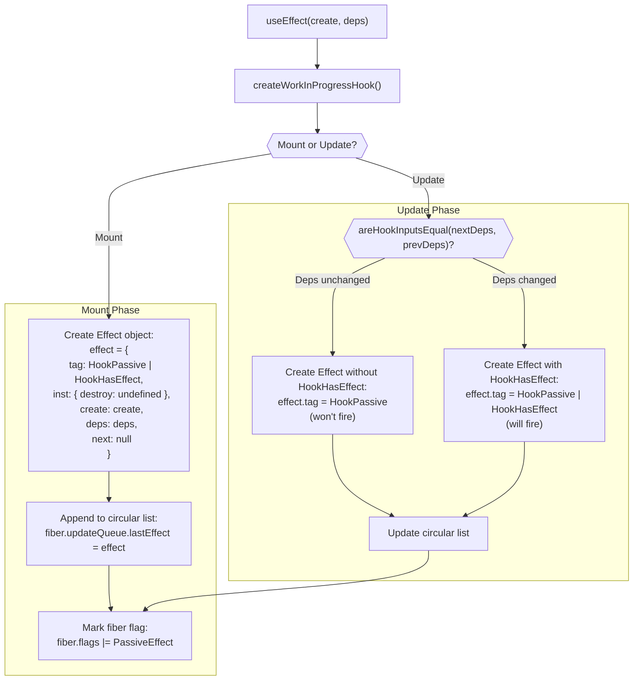

来源：[packages/react-reconciler/src/ReactFiberHooks.js#L1956-L2023](https://github.com/facebook/react/blob/main/packages/react-reconciler/src/ReactFiberHooks.js#L1956-L2023), [packages/react-reconciler/src/ReactFiberHooks.js#L2025-L2069](https://github.com/facebook/react/blob/main/packages/react-reconciler/src/ReactFiberHooks.js#L2025-L2069)

### Ref Hook：useRef

`useRef` 是一个简单的 Hook，存储一个带有 `current` 属性的可变对象。ref 对象的身份在多次渲染间保持稳定。

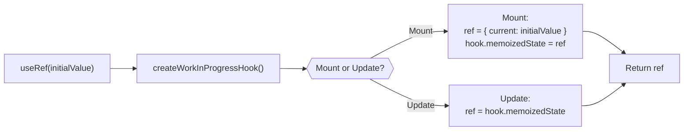

来源：[packages/react-reconciler/src/ReactFiberHooks.js#L1764-L1779](https://github.com/facebook/react/blob/main/packages/react-reconciler/src/ReactFiberHooks.js#L1764-L1779)

### 记忆化 Hooks：useMemo 和 useCallback

`useMemo` 和 `useCallback` 基于依赖数组缓存计算值。在挂载期间，它们计算并存储值。在更新期间，它们检查依赖项并复用或重新计算。

**useMemo 实现**

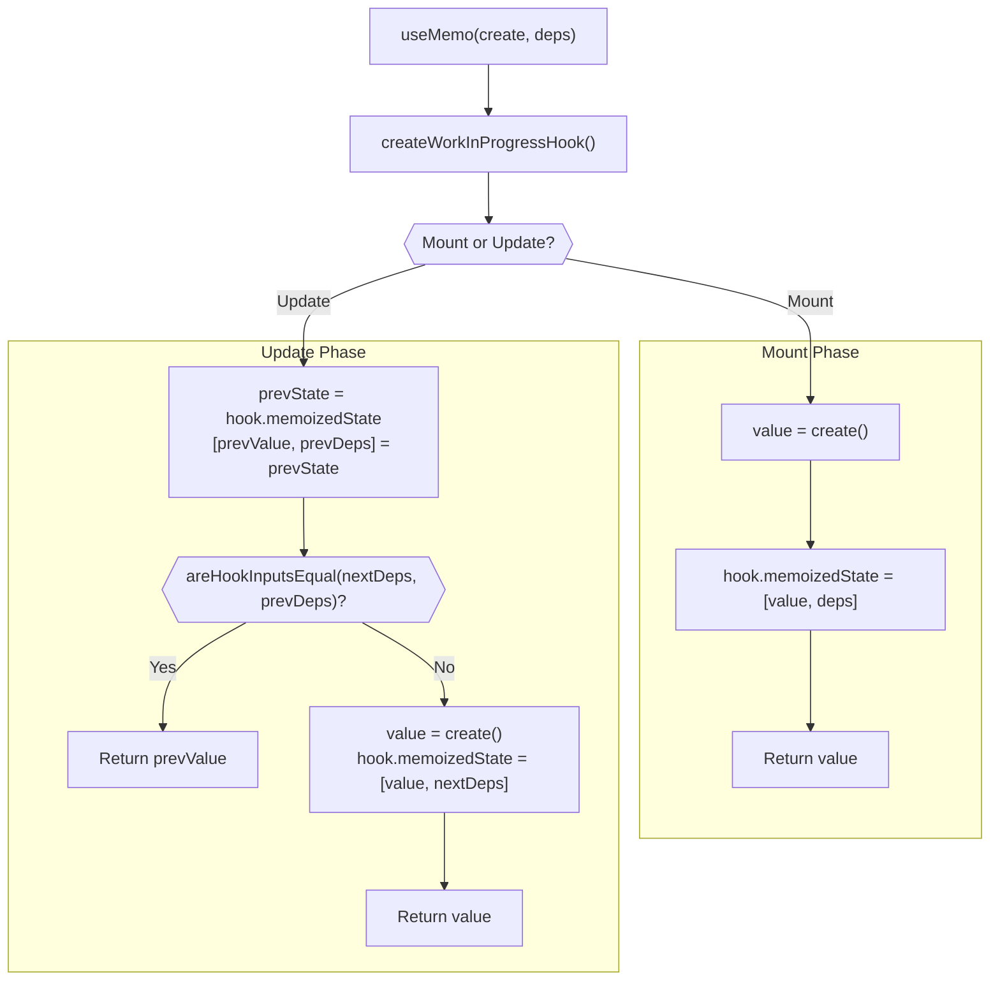

`useCallback(fn, deps)` 实现为 `useMemo(() => fn, deps)`。

来源：[packages/react-reconciler/src/ReactFiberHooks.js#L1890-L1931](https://github.com/facebook/react/blob/main/packages/react-reconciler/src/ReactFiberHooks.js#L1890-L1931), [packages/react-reconciler/src/ReactFiberHooks.js#L1933-L1954](https://github.com/facebook/react/blob/main/packages/react-reconciler/src/ReactFiberHooks.js#L1933-L1954)

## Effect 执行生命周期

Effects 在 commit 阶段执行，但根据其类型在不同时间执行。Fiber 标志（`PassiveEffect`、`UpdateEffect`）指示需要处理哪些 effects。

**Effect 执行时间线**

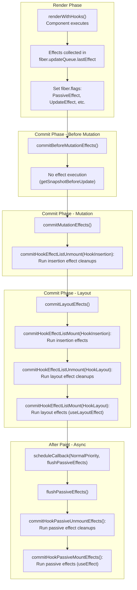

**Effect Tag 位**

| Tag | 常量 | 含义 |
|-----|----------|---------|
| `HookHasEffect` | `0b001` | Effect 应该在此次渲染触发 |
| `HookInsertion` | `0b010` | Insertion effect（CSS-in-JS） |
| `HookLayout` | `0b100` | Layout effect（mutations 后同步） |
| `HookPassive` | `0b1000` | Passive effect（绘制后异步） |

只有当 `effect.tag & HookHasEffect !== 0` 时，effects 才会执行。在挂载期间，所有 effects 都有 `HookHasEffect`。在更新期间，只有依赖项发生变化的 effects 才有 `HookHasEffect`。

来源：[packages/react-reconciler/src/ReactHookEffectTags.js#L1-L21](https://github.com/facebook/react/blob/main/packages/react-reconciler/src/ReactHookEffectTags.js#L1-L21), [packages/react-reconciler/src/ReactFiberHooks.js#L1956-L2023](https://github.com/facebook/react/blob/main/packages/react-reconciler/src/ReactFiberHooks.js#L1956-L2023)

## 服务端 Hooks 实现

Fizz 服务端渲染器（`packages/react-server/src/ReactFizzHooks.js`）提供了一个单独优化的 Hooks 实现，用于同步服务端渲染。主要区别：

- **无 effects**：`useEffect`、`useLayoutEffect`、`useInsertionEffect` 是空操作
- **更简单的状态管理**：无并发更新或 lanes
- **同步执行**：无调度或让出
- **渲染阶段更新**：通过带有 `renderPhaseUpdates` Map 的重新渲染循环处理

**服务端 Hook 状态管理**

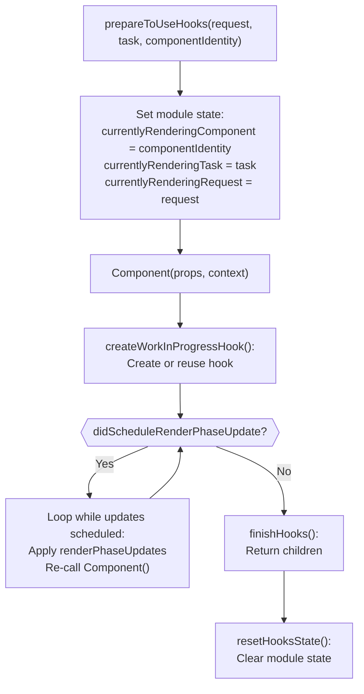

**服务端 useActionState Hook**

`useActionState`（原 `useFormState`）在服务端是特殊的。它从请求中接收永久链接信息和 action 状态，实现表单的渐进式增强。

来源：[packages/react-server/src/ReactFizzHooks.js#L207-L316](https://github.com/facebook/react/blob/main/packages/react-server/src/ReactFizzHooks.js#L207-L316), [packages/react-server/src/ReactFizzHooks.js#L665-L831](https://github.com/facebook/react/blob/main/packages/react-server/src/ReactFizzHooks.js#L665-L831)

## 调试与 DevTools 集成

### ReactDebugHooks

`react-debug-tools` 包提供 `inspectHooks()` 和 `inspectHooksOfFiber()` 来提取 Hook 信息供 DevTools 使用。它使用一个自定义 dispatcher，记录所有 Hook 调用。

**Hook 检查架构**

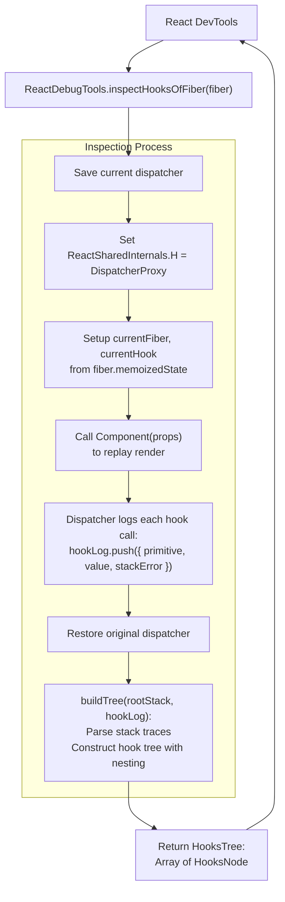

**HooksNode 结构**

```typescript
type HooksNode = {
  id: number | null,              // Hook index for state hooks
  isStateEditable: boolean,       // Can DevTools edit this state?
  name: string,                   // Hook name (e.g., "State", "Effect", "Custom")
  value: mixed,                   // Hook value
  subHooks: Array<HooksNode>,     // Nested custom hook calls
  debugInfo: ReactDebugInfo | null, // Debug metadata
  hookSource: HookSource | null   // Source location { fileName, lineNumber, etc. }
}
```

调试 dispatcher 拦截每个 Hook 调用，从 fiber 的 Hook 列表中提取其值，并将其记录在 `hookLog` 中。堆栈跟踪解析确定哪些 Hooks 嵌套在自定义 Hooks 内部。

来源：[packages/react-debug-tools/src/ReactDebugHooks.js#L1-L300](https://github.com/facebook/react/blob/main/packages/react-debug-tools/src/ReactDebugHooks.js#L1-L300), [packages/react-debug-tools/src/ReactDebugHooks.js#L996-L1098](https://github.com/facebook/react/blob/main/packages/react-debug-tools/src/ReactDebugHooks.js#L996-L1098)

### DEV 专用验证

在开发构建中，React 通过多种机制强制执行 Hooks 规则：

**Hook 顺序验证**

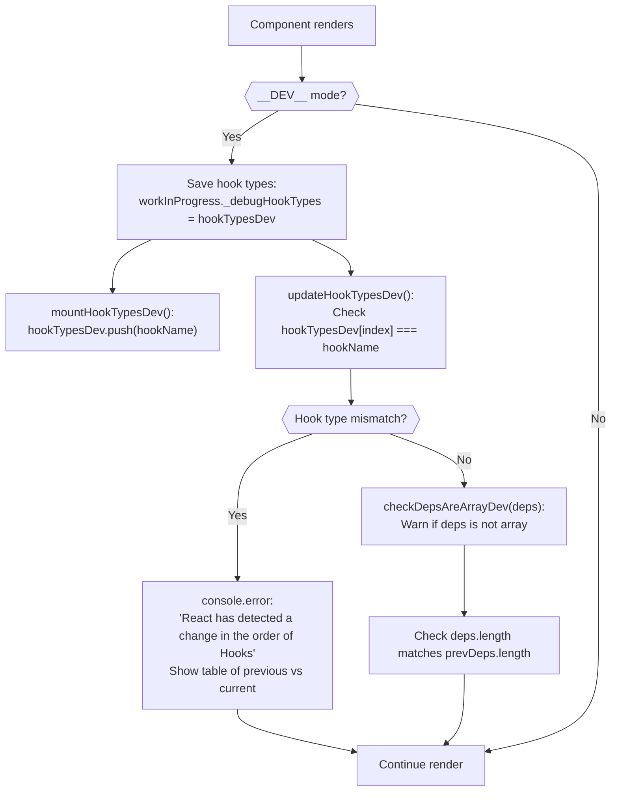

**已验证的条件**

| 规则 | 检查 | 错误消息 |
|------|-------|---------------|
| Hook 顺序 | `hookTypesDev[index] === currentHookName` | "React has detected a change in the order of Hooks" |
| 依赖数组 | `isArray(deps)` | "received a final argument that is not an array" |
| 依赖长度 | `nextDeps.length === prevDeps.length` | "changed size between renders" |
| Effect 回调 | `create != null` | "requires an effect callback" |
| 无效 context | `currentlyRenderingFiber !== null` | "Invalid hook call" |
| 异步组件 | `Object.prototype.toString.call(Component) !== '[object AsyncFunction]'` | "is an async Client Component" |

来源：[packages/react-reconciler/src/ReactFiberHooks.js#L309-L394](https://github.com/facebook/react/blob/main/packages/react-reconciler/src/ReactFiberHooks.js#L309-L394), [packages/react-reconciler/src/ReactFiberHooks.js#L334-L347](https://github.com/facebook/react/blob/main/packages/react-reconciler/src/ReactFiberHooks.js#L334-L347)

## Hook 生命周期总结

**完整的 Hook 执行流程**

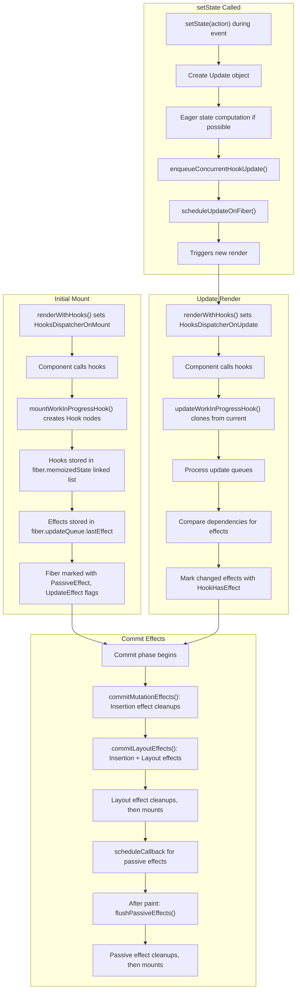

来源：[packages/react-reconciler/src/ReactFiberHooks.js#L503-L750](https://github.com/facebook/react/blob/main/packages/react-reconciler/src/ReactFiberHooks.js#L503-L750), [packages/react-reconciler/src/ReactFiberHooks.js#L2648-L2861](https://github.com/facebook/react/blob/main/packages/react-reconciler/src/ReactFiberHooks.js#L2648-L2861)

## 关键实现文件

| 文件 | 用途 |
|------|---------|
| [packages/react/src/ReactHooks.js](https://github.com/facebook/react/blob/main/packages/react/src/ReactHooks.js) | 公共 Hooks API，dispatcher 解析 |
| [packages/react-reconciler/src/ReactFiberHooks.js](https://github.com/facebook/react/blob/main/packages/react-reconciler/src/ReactFiberHooks.js) | 客户端渲染的核心 Hooks 实现 |
| [packages/react-reconciler/src/ReactInternalTypes.js#L46-L66](https://github.com/facebook/react/blob/main/packages/react-reconciler/src/ReactInternalTypes.js#L46-L66) | `HookType`、`Dispatcher`、`Hook` 类型定义 |
| [packages/react-reconciler/src/ReactInternalTypes.js#L398-L459](https://github.com/facebook/react/blob/main/packages/react-reconciler/src/ReactInternalTypes.js#L398-L459) | 包含所有 Hook 方法的 `Dispatcher` 接口 |
| [packages/react-server/src/ReactFizzHooks.js](https://github.com/facebook/react/blob/main/packages/react-server/src/ReactFizzHooks.js) | Fizz 的服务端 Hooks 实现 |
| [packages/react-debug-tools/src/ReactDebugHooks.js](https://github.com/facebook/react/blob/main/packages/react-debug-tools/src/ReactDebugHooks.js) | DevTools 的 Hook 检查 |
| [packages/react-reconciler/src/ReactHookEffectTags.js](https://github.com/facebook/react/blob/main/packages/react-reconciler/src/ReactHookEffectTags.js) | Effect 类型标志和常量 |
| [packages/react-reconciler/src/ReactFiberCommitWork.js](https://github.com/facebook/react/blob/main/packages/react-reconciler/src/ReactFiberCommitWork.js) | Commit 阶段的 Effect 执行 |
