# 基于 Lane 的调度与优先级

<!-- > 来源：https://deepwiki.com/facebook/react/4.4-lane-based-scheduling-and-priorities -->

<details>
<summary>相关源文件</summary>

以下文件用于生成此 wiki 页面的上下文：

- [packages/react-client/src/ReactFlightPerformanceTrack.js](https://github.com/facebook/react/blob/main/packages/react-client/src/ReactFlightPerformanceTrack.js)
- [packages/react-dom/index.js](https://github.com/facebook/react/blob/main/packages/react-dom/index.js)
- [packages/react-dom/src/__tests__/ReactDOMFiberAsync-test.js](https://github.com/facebook/react/blob/main/packages/react-dom/src/__tests__/ReactDOMFiberAsync-test.js)
- [packages/react-dom/src/__tests__/refs-test.js](https://github.com/facebook/react/blob/main/packages/react-dom/src/__tests__/refs-test.js)
- [packages/react-reconciler/src/ReactChildFiber.js](https://github.com/facebook/react/blob/main/packages/react-reconciler/src/ReactChildFiber.js)
- [packages/react-reconciler/src/ReactFiber.js](https://github.com/facebook/react/blob/main/packages/react-reconciler/src/ReactFiber.js)
- [packages/react-reconciler/src/ReactFiberBeginWork.js](https://github.com/facebook/react/blob/main/packages/react-reconciler/src/ReactFiberBeginWork.js)
- [packages/react-reconciler/src/ReactFiberClassComponent.js](https://github.com/facebook/react/blob/main/packages/react-reconciler/src/ReactFiberClassComponent.js)
- [packages/react-reconciler/src/ReactFiberCommitWork.js](https://github.com/facebook/react/blob/main/packages/react-reconciler/src/ReactFiberCommitWork.js)
- [packages/react-reconciler/src/ReactFiberCompleteWork.js](https://github.com/facebook/react/blob/main/packages/react-reconciler/src/ReactFiberCompleteWork.js)
- [packages/react-reconciler/src/ReactFiberLane.js](https://github.com/facebook/react/blob/main/packages/react-reconciler/src/ReactFiberLane.js)
- [packages/react-reconciler/src/ReactFiberPerformanceTrack.js](https://github.com/facebook/react/blob/main/packages/react-reconciler/src/ReactFiberPerformanceTrack.js)
- [packages/react-reconciler/src/ReactFiberReconciler.js](https://github.com/facebook/react/blob/main/packages/react-reconciler/src/ReactFiberReconciler.js)
- [packages/react-reconciler/src/ReactFiberRootScheduler.js](https://github.com/facebook/react/blob/main/packages/react-reconciler/src/ReactFiberRootScheduler.js)
- [packages/react-reconciler/src/ReactFiberSuspenseComponent.js](https://github.com/facebook/react/blob/main/packages/react-reconciler/src/ReactFiberSuspenseComponent.js)
- [packages/react-reconciler/src/ReactFiberUnwindWork.js](https://github.com/facebook/react/blob/main/packages/react-reconciler/src/ReactFiberUnwindWork.js)
- [packages/react-reconciler/src/ReactFiberWorkLoop.js](https://github.com/facebook/react/blob/main/packages/react-reconciler/src/ReactFiberWorkLoop.js)
- [packages/react-reconciler/src/ReactProfilerTimer.js](https://github.com/facebook/react/blob/main/packages/react-reconciler/src/ReactProfilerTimer.js)
- [packages/react-reconciler/src/__tests__/ReactDeferredValue-test.js](https://github.com/facebook/react/blob/main/packages/react-reconciler/src/__tests__/ReactDeferredValue-test.js)
- [packages/react-reconciler/src/__tests__/ReactLazy-test.internal.js](https://github.com/facebook/react/blob/main/packages/react-reconciler/src/__tests__/ReactLazy-test.internal.js)
- [packages/react-reconciler/src/__tests__/ReactPerformanceTrack-test.js](https://github.com/facebook/react/blob/main/packages/react-reconciler/src/__tests__/ReactPerformanceTrack-test.js)
- [packages/react-reconciler/src/__tests__/ReactSiblingPrerendering-test.js](https://github.com/facebook/react/blob/main/packages/react-reconciler/src/__tests__/ReactSiblingPrerendering-test.js)
- [packages/react-reconciler/src/__tests__/ReactSuspense-test.internal.js](https://github.com/facebook/react/blob/main/packages/react-reconciler/src/__tests__/ReactSuspense-test.internal.js)
- [packages/react-reconciler/src/__tests__/ReactSuspensePlaceholder-test.internal.js](https://github.com/facebook/react/blob/main/packages/react-reconciler/src/__tests__/ReactSuspensePlaceholder-test.internal.js)
- [packages/react-reconciler/src/__tests__/ReactSuspenseyCommitPhase-test.js](https://github.com/facebook/react/blob/main/packages/react-reconciler/src/__tests__/ReactSuspenseyCommitPhase-test.js)
- [packages/react-server/src/ReactFlightAsyncSequence.js](https://github.com/facebook/react/blob/main/packages/react-server/src/ReactFlightAsyncSequence.js)
- [packages/react-server/src/ReactFlightServerConfigDebugNode.js](https://github.com/facebook/react/blob/main/packages/react-server/src/ReactFlightServerConfigDebugNode.js)
- [packages/react-server/src/ReactFlightServerConfigDebugNoop.js](https://github.com/facebook/react/blob/main/packages/react-server/src/ReactFlightServerConfigDebugNoop.js)
- [packages/react-server/src/ReactFlightStackConfigV8.js](https://github.com/facebook/react/blob/main/packages/react-server/src/ReactFlightStackConfigV8.js)
- [packages/react-server/src/__tests__/ReactFlightAsyncDebugInfo-test.js](https://github.com/facebook/react/blob/main/packages/react-server/src/__tests__/ReactFlightAsyncDebugInfo-test.js)
- [packages/react/src/ReactLazy.js](https://github.com/facebook/react/blob/main/packages/react/src/ReactLazy.js)
- [packages/react/src/__tests__/ReactProfiler-test.internal.js](https://github.com/facebook/react/blob/main/packages/react/src/__tests__/ReactProfiler-test.internal.js)
- [packages/shared/ReactPerformanceTrackProperties.js](https://github.com/facebook/react/blob/main/packages/shared/ReactPerformanceTrackProperties.js)

</details>


## 目的与范围

本文档介绍 React 基于 Lane 的调度系统，该系统为更新分配优先级，并决定工作处理的顺序。Lane 是 React 实现并发渲染的内部机制，允许高优先级更新中断低优先级工作。

关于执行已调度工作的协调器工作循环，请参见 [4.2](/4.2-work-loop-and-rendering-phases)。关于调度系统内的 Hook 状态管理，请参见 [4.3](/4.3-react-hooks-system)。关于 Suspense 特定的重试调度，请参见 [4.5](/4.5-suspense-and-error-boundaries)。

## 概述

Lane 系统将优先级表示为 32 位整数中的位标志，每个位位置对应一个特定的优先级。这使得 React 能够高效地对 Lane 集合执行集合运算（并集、交集、差集），并快速确定最高优先级的工作。

更新根据其来源（用户输入、Transition、空闲工作）和上下文（渲染阶段、提交阶段）被分配到相应的 Lane。协调器随后选择要处理的 Lane，当更高优先级的更新到达时，可能会抢占低优先级工作。

来源：[packages/react-reconciler/src/ReactFiberLane.js#L1-L100](https://github.com/facebook/react/blob/main/packages/react-reconciler/src/ReactFiberLane.js#L1-L100)

## Lane 定义与优先级

下表列出了所有 Lane 类型，按优先级从高到低：

| Lane 名称 | 二进制表示 | 使用场景 |
|-----------|----------------------|----------|
| `SyncHydrationLane` | `0b...0001` | SSR 期间的同步 hydration |
| `SyncLane` | `0b...0010` | 同步更新（如 `flushSync`） |
| `InputContinuousHydrationLane` | `0b...0100` | 连续输入的 hydration |
| `InputContinuousLane` | `0b...1000` | 连续用户输入（拖拽、滚动） |
| `DefaultHydrationLane` | `0b...10000` | 默认 hydration 优先级 |
| `DefaultLane` | `0b...100000` | 默认更新（大多数 `setState` 调用） |
| `GestureLane` | `0b...1000000` | 手势驱动的 Transition |
| `TransitionHydrationLane` | `0b...10000000` | Transition 的 hydration |
| `TransitionLanes`（16 个 Lane） | `0b...1111111100000000` | Transition 更新（`startTransition`） |
| `RetryLanes`（5 个 Lane） | `0b...11111000000000000000000` | Suspense 边界重试 |
| `IdleHydrationLane` | `0b...100000000000000000000000` | 空闲 hydration 工作 |
| `IdleLane` | `0b...1000000000000000000000000` | 空闲更新 |
| `OffscreenLane` | `0b...10000000000000000000000000` | 离屏/预渲染工作 |

来源：[packages/react-reconciler/src/ReactFiberLane.js#L40-L93](https://github.com/facebook/react/blob/main/packages/react-reconciler/src/ReactFiberLane.js#L40-L93)

## Lane 表示与位运算

### Lane 类型定义

```
type Lanes = number;  // Set of lanes (bitwise OR of Lane values)
type Lane = number;   // Single lane (power of 2)
```

Lane 使用位运算进行高效的集合操作：

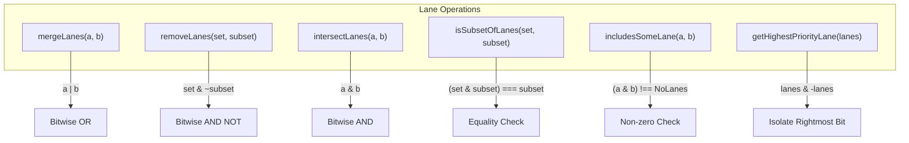

**图表：Lane 位运算**

来源：[packages/react-reconciler/src/ReactFiberLane.js#L145-L223](https://github.com/facebook/react/blob/main/packages/react-reconciler/src/ReactFiberLane.js#L145-L223)

### 常见 Lane 分组

| 分组名称 | 包含的 Lane | 用途 |
|------------|----------------|---------|
| `SyncUpdateLanes` | `SyncLane \| InputContinuousLane \| DefaultLane` | 同步或近同步更新 |
| `UpdateLanes` | 所有非 hydration、非 offscreen 的 Lane | 正常更新工作 |
| `NonIdleWork` | 除 `IdleLane` 和 `OffscreenLane` 外的所有 Lane | 不应空闲的工作 |

来源：[packages/react-reconciler/src/ReactFiberLane.js#L55-L56](https://github.com/facebook/react/blob/main/packages/react-reconciler/src/ReactFiberLane.js#L55-L56)

## Lane 分配流程

### 更新 Lane 请求流程

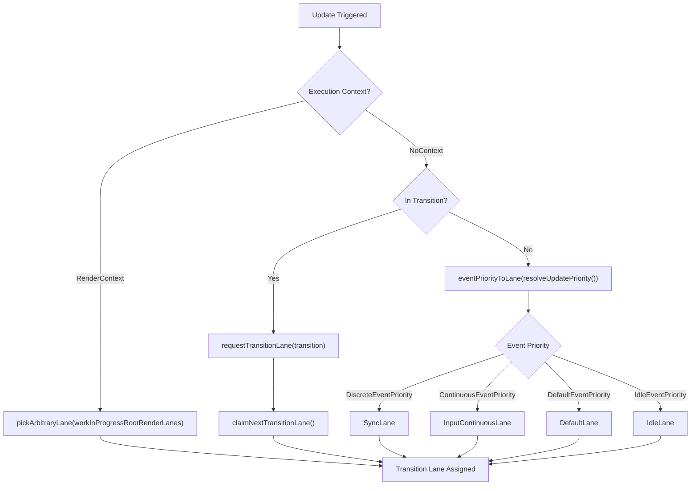

**图表：Lane 分配决策树**

来源：[packages/react-reconciler/src/ReactFiberWorkLoop.js#L803-L847](https://github.com/facebook/react/blob/main/packages/react-reconciler/src/ReactFiberWorkLoop.js#L803-L847), [packages/react-reconciler/src/ReactFiberRootScheduler.js#L206-L271](https://github.com/facebook/react/blob/main/packages/react-reconciler/src/ReactFiberRootScheduler.js#L206-L271)

### Transition Lane 分配

Transition Lane 从 16 个 Lane 的池中循环分配：

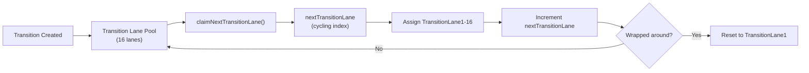

**图表：Transition Lane 循环**

来源：[packages/react-reconciler/src/ReactFiberLane.js#L394-L439](https://github.com/facebook/react/blob/main/packages/react-reconciler/src/ReactFiberLane.js#L394-L439)

### Retry Lane 分配

当 Suspense 边界挂起时，它们会从 5 个 Lane 的池中分配 Retry Lane：

```
claimNextRetryLane(): Lane
  ├── Checks current lane against retry lane mask
  ├── Returns next available retry lane
  └── Wraps around after lane 5
```

来源：[packages/react-reconciler/src/ReactFiberLane.js#L353-L385](https://github.com/facebook/react/blob/main/packages/react-reconciler/src/ReactFiberLane.js#L353-L385)

## Lane 选择算法

`getNextLanes()` 函数决定 React 接下来应该处理哪些 Lane：

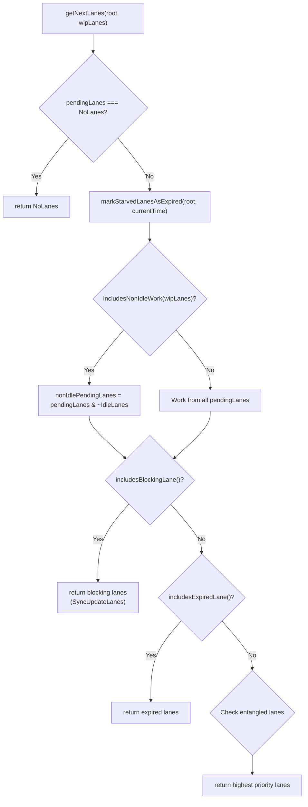

**图表：Lane 选择算法**

来源：[packages/react-reconciler/src/ReactFiberLane.js#L544-L697](https://github.com/facebook/react/blob/main/packages/react-reconciler/src/ReactFiberLane.js#L544-L697)

### 优先级检查

选择算法使用多个辅助函数对 Lane 进行分类：

| 函数 | 用途 |
|----------|---------|
| `includesBlockingLane(lanes)` | 检查 Lane 是否包含同步或输入连续工作 |
| `includesExpiredLane(root, lanes)` | 检查是否有任何 Lane 已过期 |
| `includesNonIdleWork(lanes)` | 检查工作是否不是空闲优先级 |
| `includesOnlyRetries(lanes)` | 检查是否只剩下 Retry Lane |
| `includesTransitionLane(lanes)` | 检查是否存在 Transition 工作 |

来源：[packages/react-reconciler/src/ReactFiberLane.js#L225-L304](https://github.com/facebook/react/blob/main/packages/react-reconciler/src/ReactFiberLane.js#L225-L304)

## Root Lane 管理

每个 `FiberRoot` 维护多个 Lane 集合以跟踪工作状态：

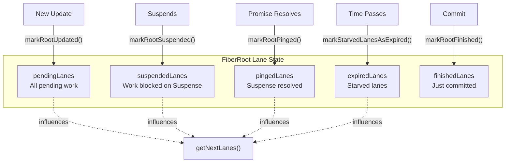

**图表：Root Lane 状态管理**

来源：[packages/react-reconciler/src/ReactFiberLane.js#L845-L1065](https://github.com/facebook/react/blob/main/packages/react-reconciler/src/ReactFiberLane.js#L845-L1065)

### Lane 状态转换

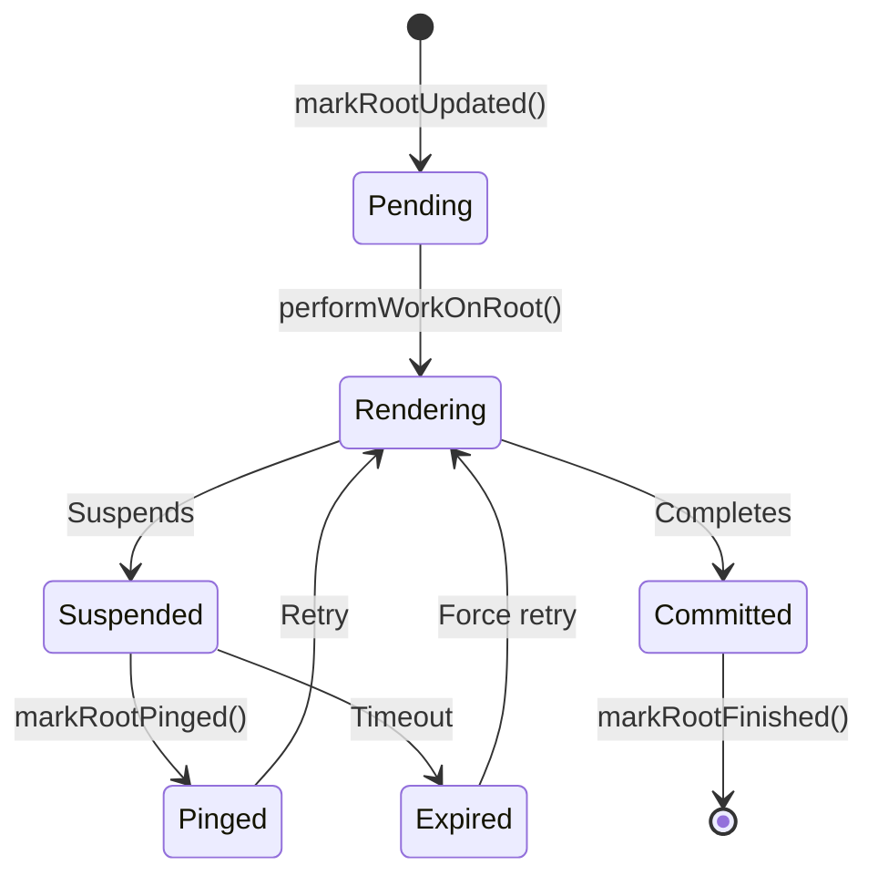

**图表：Lane 生命周期**

来源：[packages/react-reconciler/src/ReactFiberWorkLoop.js#L1116-L1400](https://github.com/facebook/react/blob/main/packages/react-reconciler/src/ReactFiberWorkLoop.js#L1116-L1400), [packages/react-reconciler/src/ReactFiberLane.js#L845-L949](https://github.com/facebook/react/blob/main/packages/react-reconciler/src/ReactFiberLane.js#L845-L949)

## Lane 纠缠（Entanglement）

Entanglement 强制某些 Lane 一起渲染，确保一致性：

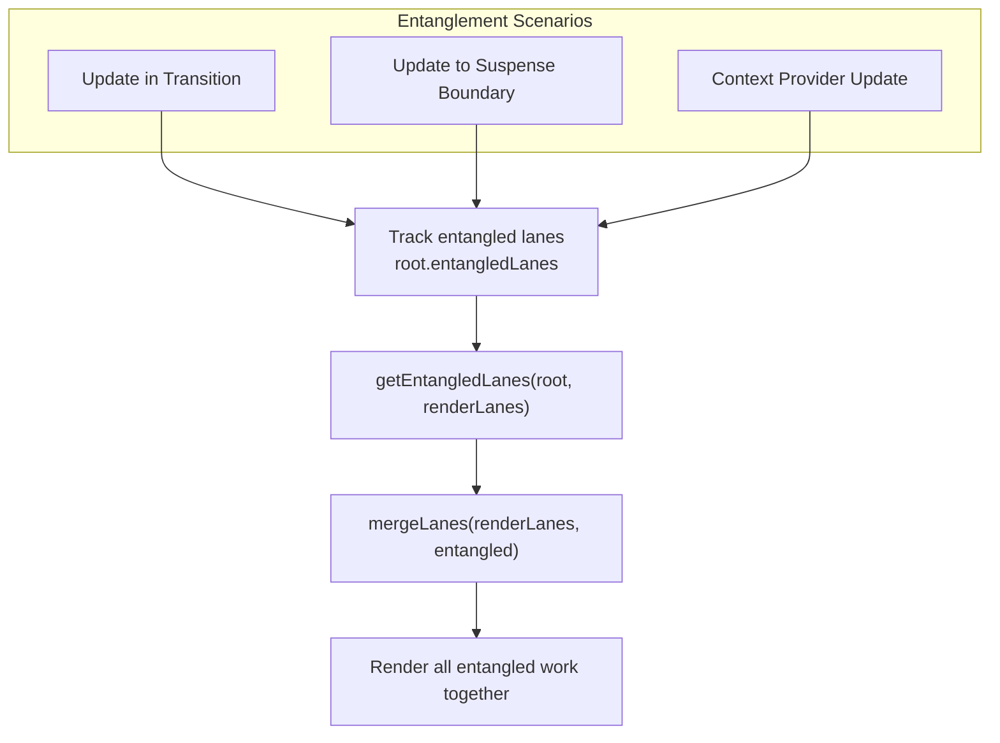

**图表：Lane Entanglement 流程**

当 Transition 期间发生更新，且该更新也影响非 Transition 工作时，两者必须一起完成以保持一致性。

来源：[packages/react-reconciler/src/ReactFiberLane.js#L699-L787](https://github.com/facebook/react/blob/main/packages/react-reconciler/src/ReactFiberLane.js#L699-L787), [packages/react-reconciler/src/ReactFiberClassUpdateQueue.js#L534-L553](https://github.com/facebook/react/blob/main/packages/react-reconciler/src/ReactFiberClassUpdateQueue.js#L534-L553)

### Entanglement 示例

```
Scenario: User in transition, context updates
  1. Transition lane: TransitionLane1
  2. Context update schedules: DefaultLane
  3. Entangle: TransitionLane1 | DefaultLane
  4. Both lanes render together
```

来源：[packages/react-reconciler/src/ReactFiberClassUpdateQueue.js#L534-L553](https://github.com/facebook/react/blob/main/packages/react-reconciler/src/ReactFiberClassUpdateQueue.js#L534-L553)

## 过期与饥饿预防

React 通过在 Lane 等待时间过长后将其标记为过期来防止饥饿：

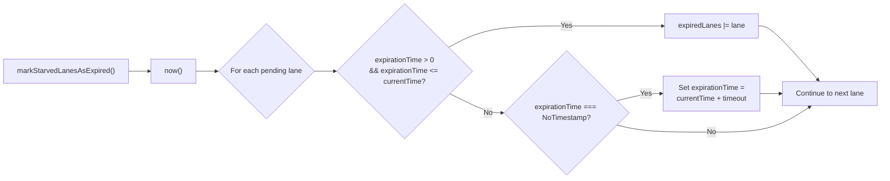

**图表：过期标记流程**

来源：[packages/react-reconciler/src/ReactFiberLane.js#L789-L843](https://github.com/facebook/react/blob/main/packages/react-reconciler/src/ReactFiberLane.js#L789-L843)

### 超时值

| Lane 类型 | 超时（毫秒） | 常量 |
|-----------|--------------|----------|
| Sync Lane | 250 | `syncLaneExpirationMs` |
| Transition Lane | 5000 | `transitionLaneExpirationMs` |
| Retry Lane | 5000 | `retryLaneExpirationMs` |

来源：[packages/shared/ReactFeatureFlags.js](https://github.com/facebook/react/blob/main/packages/shared/ReactFeatureFlags.js)（在 [packages/react-reconciler/src/ReactFiberLane.js#L22-L28](https://github.com/facebook/react/blob/main/packages/react-reconciler/src/ReactFiberLane.js#L22-L28) 中引用）

## Transition 与延迟更新

### Transition Lane 特性

Transition 使用专用的 16 个 Lane 池，具有以下特殊属性：

1. **可中断**：可被更高优先级的更新中断
2. **可延迟**：使用 `useDeferredValue` 延迟派生值
3. **Suspense 感知**：为较长的等待显示加载状态
4. **批处理**：多个 Transition 可以同时进行

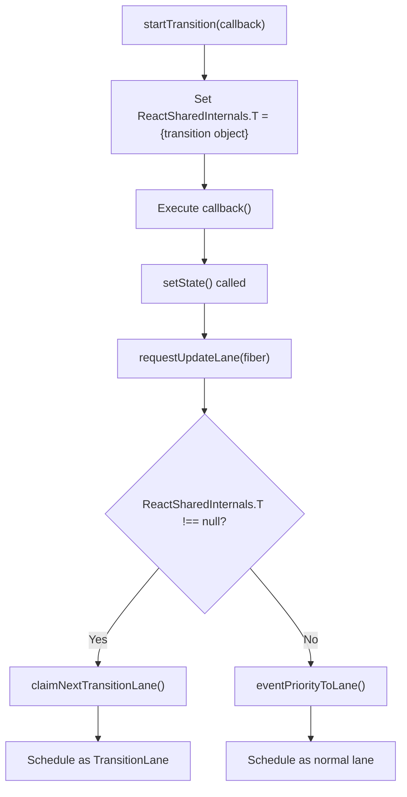

**图表：Transition 更新流程**

来源：[packages/react-reconciler/src/ReactFiberWorkLoop.js#L824-L843](https://github.com/facebook/react/blob/main/packages/react-reconciler/src/ReactFiberWorkLoop.js#L824-L843), [packages/react-reconciler/src/ReactFiberRootScheduler.js#L206-L271](https://github.com/facebook/react/blob/main/packages/react-reconciler/src/ReactFiberRootScheduler.js#L206-L271)

### 延迟 Lane 分配

`requestDeferredLane()` 函数为 `useDeferredValue` 分配 Lane：

```
requestDeferredLane(): Lane
  ├── Check if already allocated: workInProgressDeferredLane
  ├── If prerendering: return OffscreenLane
  ├── Otherwise: claimNextTransitionDeferredLane()
  └── Mark Suspense boundary with DidDefer flag
```

来源：[packages/react-reconciler/src/ReactFiberWorkLoop.js#L863-L900](https://github.com/facebook/react/blob/main/packages/react-reconciler/src/ReactFiberWorkLoop.js#L863-L900)

## 并发渲染与抢占

调度器根据 Lane 优先级检查是否应该让出：

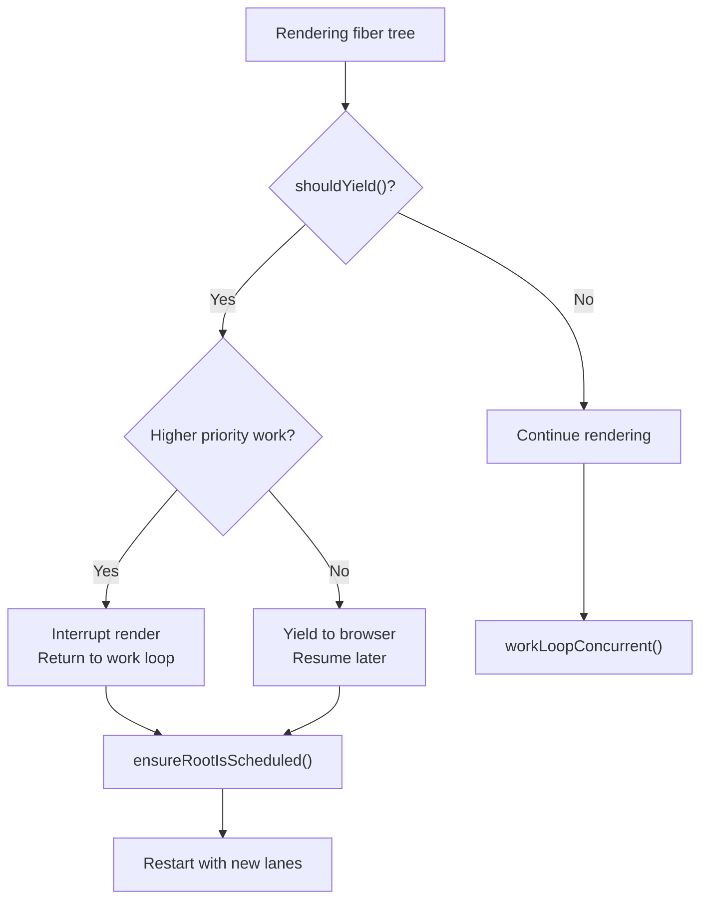

**图表：并发渲染抢占**

当并发渲染期间出现更高优先级的 Lane 时，React 会中断当前工作，并使用更高优先级的 Lane 重新开始。

来源：[packages/react-reconciler/src/ReactFiberWorkLoop.js#L2210-L2276](https://github.com/facebook/react/blob/main/packages/react-reconciler/src/ReactFiberWorkLoop.js#L2210-L2276)

## 事件优先级到 Lane 的映射

事件按优先级分类并映射到 Lane：

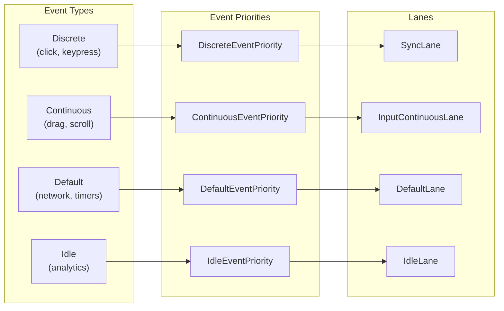

**图表：事件到 Lane 优先级映射**

来源：[packages/react-reconciler/src/ReactEventPriorities.js#L14-L83](https://github.com/facebook/react/blob/main/packages/react-reconciler/src/ReactEventPriorities.js#L14-L83), [packages/react-reconciler/src/ReactFiberWorkLoop.js:846](https://github.com/facebook/react/blob/main/packages/react-reconciler/src/ReactFiberWorkLoop.js:846)

## Lane 调试与内省

在开发和分析时，Lane 可以转换为人类可读的标签：

| 函数 | 用途 |
|----------|---------|
| `getLabelForLane(lane)` | 返回字符串标签，如 "Sync"、"Transition"、"Retry" |
| `getGroupNameOfHighestPriorityLane(lanes)` | 返回优先级组："Blocking"、"Transition"、"Idle" |
| `checkIfRootIsPrerendering(root)` | 检查 root 是否正在预渲染（OffscreenLane） |

这些函数被 React DevTools 和性能跟踪用于显示正在处理的优先级级别。

来源：[packages/react-reconciler/src/ReactFiberLane.js#L1287-L1412](https://github.com/facebook/react/blob/main/packages/react-reconciler/src/ReactFiberLane.js#L1287-L1412)

## 实现细节

### 关键数据结构

**FiberRoot Lane 字段：**
```
type FiberRoot = {
  pendingLanes: Lanes,              // All scheduled work
  suspendedLanes: Lanes,            // Work blocked on Suspense
  pingedLanes: Lanes,               // Suspense resolved, ready to retry
  expiredLanes: Lanes,              // Expired (must complete)
  finishedLanes: Lanes,             // Just committed
  entangledLanes: Lanes,            // Must render together
  entanglements: LaneMap<Lanes>,    // Per-lane entanglements
  expirationTimes: LaneMap<number>, // Expiration timestamps
  hiddenUpdates: LaneMap<Array<ConcurrentUpdate>>, // Offscreen updates
  ...
}
```

来源：[packages/react-reconciler/src/ReactFiberRoot.js#L87-L173](https://github.com/facebook/react/blob/main/packages/react-reconciler/src/ReactFiberRoot.js#L87-L173)

### 关键函数参考

| 函数 | 位置 | 用途 |
|----------|----------|---------|
| `getNextLanes()` | [ReactFiberLane.js:544-697]() | 选择下一个要渲染的 Lane |
| `requestUpdateLane()` | [ReactFiberWorkLoop.js:803-847]() | 确定更新的 Lane |
| `markRootUpdated()` | [ReactFiberLane.js:845-877]() | 在 root 上标记新工作 |
| `markRootSuspended()` | [ReactFiberLane.js:879-917]() | 将 Lane 标记为挂起 |
| `markRootPinged()` | [ReactFiberLane.js:919-949]() | 将挂起的 Lane 标记为就绪 |
| `markStarvedLanesAsExpired()` | [ReactFiberLane.js:789-843]() | 将饥饿的 Lane 标记为过期 |
| `includesBlockingLane()` | [ReactFiberLane.js:244-246]() | 检查是否有阻塞工作 |
| `claimNextTransitionLane()` | [ReactFiberRootScheduler.js:253-271]() | 分配 Transition Lane |

来源：[packages/react-reconciler/src/ReactFiberLane.js#L1-L1412](https://github.com/facebook/react/blob/main/packages/react-reconciler/src/ReactFiberLane.js#L1-L1412), [packages/react-reconciler/src/ReactFiberWorkLoop.js#L1-L3095](https://github.com/facebook/react/blob/main/packages/react-reconciler/src/ReactFiberWorkLoop.js#L1-L3095)
