# Suspense 和 Error Boundaries

<!-- > 来源：https://deepwiki.com/facebook/react/4.5-suspense-and-error-boundaries -->

<details>
<summary>相关源文件</summary>

以下文件用于生成此 wiki 页面的上下文：

- [packages/react-client/src/ReactFlightPerformanceTrack.js](packages/react-client/src/ReactFlightPerformanceTrack.js)
- [packages/react-dom/index.js](packages/react-dom/index.js)
- [packages/react-dom/src/__tests__/ReactDOMFiberAsync-test.js](packages/react-dom/src/__tests__/ReactDOMFiberAsync-test.js)
- [packages/react-dom/src/__tests__/refs-test.js](packages/react-dom/src/__tests__/refs-test.js)
- [packages/react-reconciler/src/ReactChildFiber.js](packages/react-reconciler/src/ReactChildFiber.js)
- [packages/react-reconciler/src/ReactFiber.js](packages/react-reconciler/src/ReactFiber.js)
- [packages/react-reconciler/src/ReactFiberBeginWork.js](packages/react-reconciler/src/ReactFiberBeginWork.js)
- [packages/react-reconciler/src/ReactFiberClassComponent.js](packages/react-reconciler/src/ReactFiberClassComponent.js)
- [packages/react-reconciler/src/ReactFiberCommitWork.js](packages/react-reconciler/src/ReactFiberCommitWork.js)
- [packages/react-reconciler/src/ReactFiberCompleteWork.js](packages/react-reconciler/src/ReactFiberCompleteWork.js)
- [packages/react-reconciler/src/ReactFiberLane.js](packages/react-reconciler/src/ReactFiberLane.js)
- [packages/react-reconciler/src/ReactFiberOffscreenComponent.js](packages/react-reconciler/src/ReactFiberOffscreenComponent.js)
- [packages/react-reconciler/src/ReactFiberPerformanceTrack.js](packages/react-reconciler/src/ReactFiberPerformanceTrack.js)
- [packages/react-reconciler/src/ReactFiberReconciler.js](packages/react-reconciler/src/ReactFiberReconciler.js)
- [packages/react-reconciler/src/ReactFiberRootScheduler.js](packages/react-reconciler/src/ReactFiberRootScheduler.js)
- [packages/react-reconciler/src/ReactFiberSuspenseComponent.js](packages/react-reconciler/src/ReactFiberSuspenseComponent.js)
- [packages/react-reconciler/src/ReactFiberUnwindWork.js](packages/react-reconciler/src/ReactFiberUnwindWork.js)
- [packages/react-reconciler/src/ReactFiberWorkLoop.js](packages/react-reconciler/src/ReactFiberWorkLoop.js)
- [packages/react-reconciler/src/ReactProfilerTimer.js](packages/react-reconciler/src/ReactProfilerTimer.js)
- [packages/react-reconciler/src/__tests__/ReactDeferredValue-test.js](packages/react-reconciler/src/__tests__/ReactDeferredValue-test.js)
- [packages/react-reconciler/src/__tests__/ReactHooksWithNoopRenderer-test.js](packages/react-reconciler/src/__tests__/ReactHooksWithNoopRenderer-test.js)
- [packages/react-reconciler/src/__tests__/ReactLazy-test.internal.js](packages/react-reconciler/src/__tests__/ReactLazy-test.internal.js)
- [packages/react-reconciler/src/__tests__/ReactPerformanceTrack-test.js](packages/react-reconciler/src/__tests__/ReactPerformanceTrack-test.js)
- [packages/react-reconciler/src/__tests__/ReactSiblingPrerendering-test.js](packages/react-reconciler/src/__tests__/ReactSiblingPrerendering-test.js)
- [packages/react-reconciler/src/__tests__/ReactSuspense-test.internal.js](packages/react-reconciler/src/__tests__/ReactSuspense-test.internal.js)
- [packages/react-reconciler/src/__tests__/ReactSuspensePlaceholder-test.internal.js](packages/react-reconciler/src/__tests__/ReactSuspensePlaceholder-test.internal.js)
- [packages/react-reconciler/src/__tests__/ReactSuspenseWithNoopRenderer-test.js](packages/react-reconciler/src/__tests__/ReactSuspenseWithNoopRenderer-test.js)
- [packages/react-reconciler/src/__tests__/ReactSuspenseyCommitPhase-test.js](packages/react-reconciler/src/__tests__/ReactSuspenseyCommitPhase-test.js)
- [packages/react-server/src/ReactFlightAsyncSequence.js](packages/react-server/src/ReactFlightAsyncSequence.js)
- [packages/react-server/src/ReactFlightServerConfigDebugNode.js](packages/react-server/src/ReactFlightServerConfigDebugNode.js)
- [packages/react-server/src/ReactFlightServerConfigDebugNoop.js](packages/react-server/src/ReactFlightServerConfigDebugNoop.js)
- [packages/react-server/src/ReactFlightStackConfigV8.js](packages/react-server/src/ReactFlightStackConfigV8.js)
- [packages/react-server/src/__tests__/ReactFlightAsyncDebugInfo-test.js](packages/react-server/src/__tests__/ReactFlightAsyncDebugInfo-test.js)
- [packages/react/src/ReactLazy.js](packages/react/src/ReactLazy.js)
- [packages/react/src/__tests__/ReactProfiler-test.internal.js](packages/react/src/__tests__/ReactProfiler-test.internal.js)
- [packages/shared/ReactPerformanceTrackProperties.js](packages/shared/ReactPerformanceTrackProperties.js)

</details>


## 目的和范围

本文档介绍 React 如何通过两个关键机制处理渲染过程中的异步操作和错误：**Suspense boundaries** 和 **Error boundaries**。Suspense boundaries 通过捕获抛出的 promise 并渲染 fallback UI，使组件能够声明式地等待异步数据。Error boundaries 捕获子组件树中任何位置的 JavaScript 错误，并显示 fallback UI，而不是让整个应用崩溃。

关于服务端渲染的 Suspense boundaries 的 hydration，请参阅 [Hydration System](#6.3)。关于 Suspense 如何与 Server Components 和流式 SSR 集成，请参阅 [React Fizz (Streaming SSR)](#5.1)。

---

## 概述：两种边界类型

React 提供两种类型的边界，用于中断正常的渲染流程：

| 边界类型 | 捕获内容 | 定义方式 | 触发条件 |
|--------------|---------|------------|----------|
| **Suspense Boundary** | 抛出的 promise（异步操作） | 带有 `fallback` prop 的 `<Suspense>` 组件 | 组件在渲染时抛出 promise |
| **Error Boundary** | JavaScript 错误 | 具有 `componentDidCatch` 或 `getDerivedStateFromError` 的类组件 | 在渲染、生命周期方法或事件处理程序中抛出的错误 |

两种边界在捕获渲染阶段的异常和展开 fiber 树方面具有相似的机制，但在捕获内容和恢复方式上有所不同。

来源：[packages/react-reconciler/src/ReactFiberBeginWork.js:1-100](), [packages/react-reconciler/src/ReactFiberClassComponent.js:1-50]()

---

## Suspense Boundaries

### Suspense 组件结构

使用 `<Suspense>` 组件创建 Suspense boundary，该组件接受 `fallback` 和 `children` props：

```javascript
<Suspense fallback={<LoadingSpinner />}>
  <AsyncComponent />
</Suspense>
```

在内部，Suspense 由 `SuspenseComponent` work tag 表示，并通过 `SuspenseState` 维护状态：

```typescript
type SuspenseState = {
  dehydrated: null | SuspenseInstance,  // Non-null if SSR dehydrated
  retryLane: Lane,                       // Lane to retry rendering
  treeContext: TreeContext | null,       // Tree context for hydration
  ...
}
```

来源：[packages/react-reconciler/src/ReactFiberSuspenseComponent.js:24-36](), [packages/react-reconciler/src/ReactWorkTags.js:70]()

### Suspense 工作原理

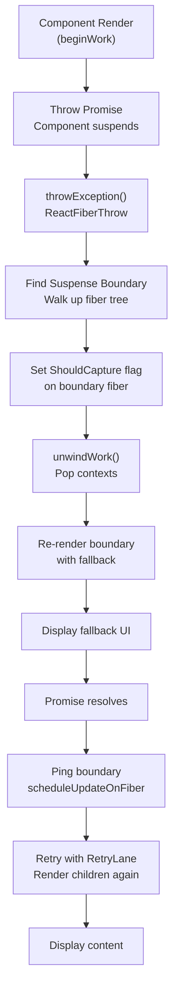

**Suspense 流程步骤：**

1. **组件抛出 Promise**：在渲染过程中，组件读取异步数据，如果数据未就绪则抛出 promise
2. **在工作循环中捕获**：工作循环在 `handleThrow` 中捕获抛出的值（[packages/react-reconciler/src/ReactFiberWorkLoop.js:1800-1900]()）
3. **throwException**：识别抛出的内容并找到最近的 Suspense boundary（[packages/react-reconciler/src/ReactFiberThrow.js:1-100]()）
4. **标记边界**：在 Suspense boundary fiber 上设置 `ShouldCapture` 标志（[packages/react-reconciler/src/ReactFiberBeginWork.js:3800-3900]()）
5. **展开堆栈**：通过 `unwindWork` 展开 fiber 树，弹出上下文并检查每个 fiber 的 `ShouldCapture`（[packages/react-reconciler/src/ReactFiberUnwindWork.js:156-183]()）
6. **转换为 DidCapture**：当展开到达 Suspense boundary 时，将 `ShouldCapture` 转换为 `DidCapture` 标志（[packages/react-reconciler/src/ReactFiberUnwindWork.js:170-180]()）
7. **使用 Fallback 重新渲染**：重新渲染 Suspense boundary，此时显示 fallback 而不是子组件（[packages/react-reconciler/src/ReactFiberBeginWork.js:3800-4000]()）
8. **附加监听器**：通过 `attachPingListener` 将 ping 监听器附加到抛出的 promise（[packages/react-reconciler/src/ReactFiberThrow.js:400-500]()）
9. **Promise 解析**：当 promise 解析时，ping 回调触发 `retryDehydratedSuspenseBoundary` 或调度更新
10. **重试渲染**：在 retry lane 重新渲染，尝试再次渲染子组件（[packages/react-reconciler/src/ReactFiberWorkLoop.js:2000-2100]()）

来源：[packages/react-reconciler/src/ReactFiberWorkLoop.js:1800-2000](), [packages/react-reconciler/src/ReactFiberThrow.js:1-500](), [packages/react-reconciler/src/ReactFiberUnwindWork.js:156-183]()

### Suspense Context 和 Handler 堆栈

React 维护一个 `SuspenseContext` 堆栈，用于跟踪渲染过程中哪些 Suspense boundaries 处于活动状态：

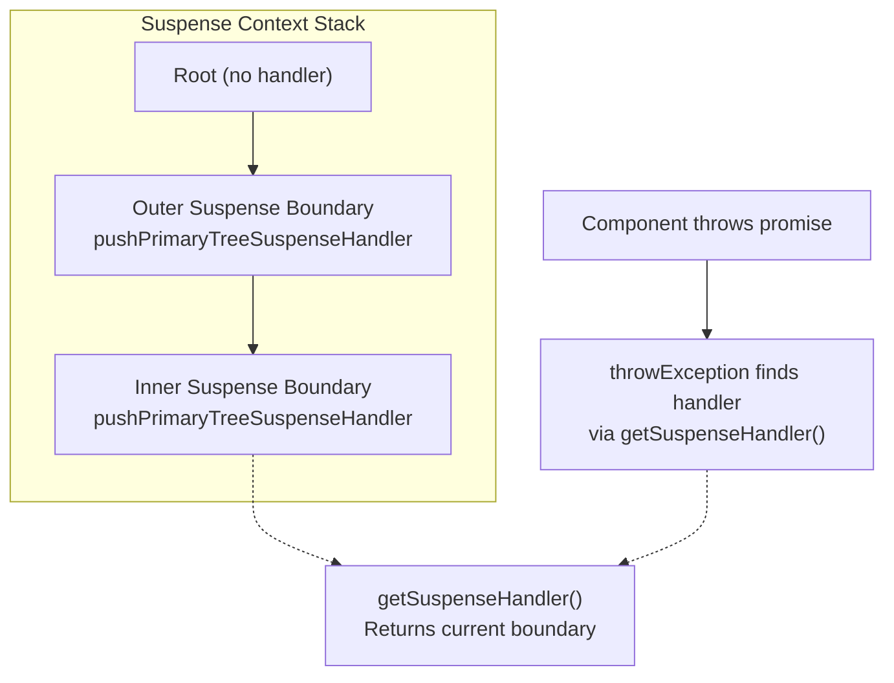

管理 Suspense context 的关键函数：

- `pushPrimaryTreeSuspenseHandler(workInProgress)` - 将新的 Suspense boundary 推入堆栈（[packages/react-reconciler/src/ReactFiberSuspenseContext.js:100-150]()）
- `pushFallbackTreeSuspenseHandler(workInProgress)` - 在渲染 fallback 树时推入
- `popSuspenseHandler(workInProgress)` - 离开 Suspense boundary 时弹出 handler
- `getSuspenseHandler()` - 返回当前最内层的 Suspense boundary（[packages/react-reconciler/src/ReactFiberSuspenseContext.js:200-250]()）

来源：[packages/react-reconciler/src/ReactFiberSuspenseContext.js:1-300](), [packages/react-reconciler/src/ReactFiberBeginWork.js:3700-3800]()

### 重试机制和 Lanes

当 promise 解析时，React 需要重试渲染被 suspended 的树。这通过 **retry lanes** 进行管理：

```mermaid
graph LR
    Suspend["Component Suspends<br/>Shows fallback"]
    AttachPing["Attach ping listener<br/>to promise"]
    PromiseResolve["Promise resolves"]
    PingCallback["pingCallback invoked"]
    ClaimRetryLane["claimNextRetryLane()<br/>Assigns RetryLane"]
    ScheduleUpdate["scheduleUpdateOnFiber<br/>with RetryLane"]
    RenderRoot["performWorkOnRoot<br/>renders at RetryLane"]
    AttemptRender["Attempt to render<br/>children again"]
    
    Suspend --> AttachPing
    AttachPing --> PromiseResolve
    PromiseResolve --> PingCallback
    PingCallback --> ClaimRetryLane
    ClaimRetryLane --> ScheduleUpdate
    ScheduleUpdate --> RenderRoot
    RenderRoot --> AttemptRender
```

**关键组件：**

- `RetryQueue`：存储在 Suspense boundaries 的 `workInProgress.updateQueue` 上，包含正在跟踪的 `Wakeable`（promise）（[packages/react-reconciler/src/ReactFiberSuspenseComponent.js:100-120]()）
- `claimNextRetryLane()`：从 `RetryLanes` 位掩码中分配特定的 retry lane（[packages/react-reconciler/src/ReactFiberLane.js:850-900]()）
- `attachPingListener()`：将回调附加到 promise，在解析时调度更新（[packages/react-reconciler/src/ReactFiberThrow.js:400-500]()）
- `retryDehydratedSuspenseBoundary()`：为 dehydrated boundaries 调度重试（[packages/react-reconciler/src/ReactFiberWorkLoop.js:1200-1300]()）

来源：[packages/react-reconciler/src/ReactFiberSuspenseComponent.js:100-150](), [packages/react-reconciler/src/ReactFiberLane.js:850-900](), [packages/react-reconciler/src/ReactFiberThrow.js:400-500]()

### Suspended 原因

工作循环通过 `workInProgressSuspendedReason` 跟踪渲染被 suspended 的原因：

| 原因 | 值 | 描述 |
|--------|-------|-------------|
| `NotSuspended` | 0 | 当前未 suspended |
| `SuspendedOnError` | 1 | 因错误而 suspended |
| `SuspendedOnData` | 2 | 等待数据（promise）而 suspended |
| `SuspendedOnImmediate` | 3 | 在立即优先级上 suspended |
| `SuspendedOnInstance` | 4 | 在资源实例上 suspended |
| `SuspendedOnInstanceAndReadyToContinue` | 5 | 实例就绪，可以继续 |
| `SuspendedOnDeprecatedThrowPromise` | 6 | 遗留的 throw promise |
| `SuspendedAndReadyToContinue` | 7 | Suspended 但可以继续 |
| `SuspendedOnHydration` | 8 | 在 hydration 期间 suspended |
| `SuspendedOnAction` | 9 | 在异步 action 上 suspended |

这些原因决定了工作循环如何处理 suspension，以及是立即展开还是继续。

来源：[packages/react-reconciler/src/ReactFiberWorkLoop.js:431-441]()

---

## Error Boundaries

### 定义 Error Boundaries

Error boundaries 是实现以下一个或两个生命周期方法的类组件：

```javascript
class ErrorBoundary extends React.Component {
  static getDerivedStateFromError(error) {
    // Update state to show fallback UI
    return { hasError: true };
  }

  componentDidCatch(error, errorInfo) {
    // Log error to error reporting service
    logErrorToService(error, errorInfo);
  }

  render() {
    if (this.state.hasError) {
      return <h1>Something went wrong.</h1>;
    }
    return this.props.children;
  }
}
```

**关键特征：**
- 必须是类组件（函数组件不能作为 error boundaries）
- `getDerivedStateFromError`：在渲染阶段调用的静态方法，用于更新状态
- `componentDidCatch`：在 commit 阶段调用的实例方法，用于副作用
- 只捕获子组件中的错误，不捕获边界本身的错误

来源：[packages/react-reconciler/src/ReactFiberClassComponent.js:1-100]()

### 错误捕获流程

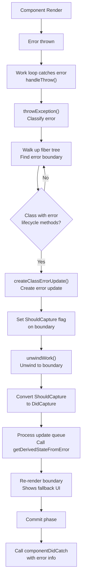

**Error Boundary 流程：**

1. **发生错误**：在渲染、生命周期方法或事件处理程序中抛出错误
2. **在工作循环中捕获**：工作循环在 `handleThrow` 中捕获错误（[packages/react-reconciler/src/ReactFiberWorkLoop.js:1800-1900]()）
3. **throwException**：检查错误并向上遍历 fiber 树以找到 error boundary（[packages/react-reconciler/src/ReactFiberThrow.js:200-400]()）
4. **识别边界**：查找具有 `getDerivedStateFromError` 或 `componentDidCatch` 的类组件（[packages/react-reconciler/src/ReactFiberThrow.js:250-350]()）
5. **创建错误更新**：调用 `createClassErrorUpdate` 在边界的队列上创建更新（[packages/react-reconciler/src/ReactFiberThrow.js:300-350]()）
6. **设置 ShouldCapture**：在 error boundary fiber 上标记 `ShouldCapture` 标志
7. **展开**：通过 `unwindWork` 展开堆栈，检查每个 fiber 的 `ShouldCapture`（[packages/react-reconciler/src/ReactFiberUnwindWork.js:77-93]()）
8. **转换为 DidCapture**：当展开到达 error boundary 时，将 `ShouldCapture` 转换为 `DidCapture`（[packages/react-reconciler/src/ReactFiberUnwindWork.js:83-91]()）
9. **处理更新**：在重新渲染期间，处理错误更新并调用 `getDerivedStateFromError`（[packages/react-reconciler/src/ReactFiberClassUpdateQueue.js:200-300]()）
10. **渲染 Fallback**：使用更新后的状态重新渲染边界，显示 fallback UI
11. **Commit 阶段**：在 commit 期间，使用错误和错误信息调用 `componentDidCatch`（[packages/react-reconciler/src/ReactFiberCommitWork.js:1000-1100]()）

来源：[packages/react-reconciler/src/ReactFiberWorkLoop.js:1800-1900](), [packages/react-reconciler/src/ReactFiberThrow.js:200-400](), [packages/react-reconciler/src/ReactFiberUnwindWork.js:77-93]()

### Error Boundary 检测

通过检查特定的静态和实例方法来识别 error boundaries：

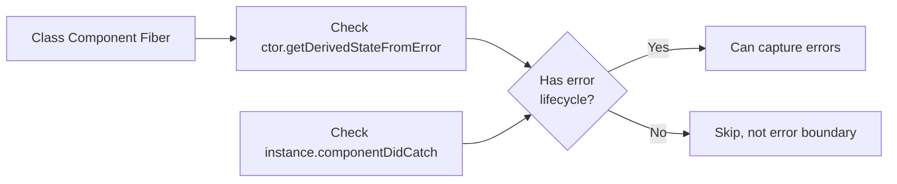

`throwException` 中的代码逻辑：

```javascript
// Check if this is a class component error boundary
if (
  sourceFiber.tag === ClassComponent &&
  (ctor.getDerivedStateFromError !== undefined ||
   (instance !== null && 
    typeof instance.componentDidCatch === 'function'))
) {
  // This is an error boundary
}
```

来源：[packages/react-reconciler/src/ReactFiberThrow.js:250-350]()

---

## 抛出和捕获机制

### throwException 函数

`ReactFiberThrow.js` 中的 `throwException` 函数是处理 promise（Suspense）和错误（Error Boundaries）的中央调度器：

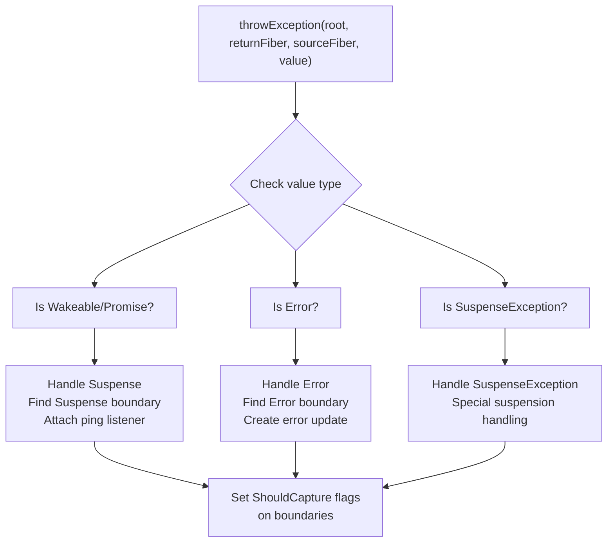

**关键职责：**

1. **类型检测**：确定抛出的值是 promise、错误还是特殊异常类型
2. **边界搜索**：从 `sourceFiber` 向上遍历 fiber 树以找到合适的边界
3. **标志设置**：在边界上标记 `ShouldCapture` 标志以触发展开
4. **监听器附加**：对于 promise，附加 ping 监听器以便在解析时重试
5. **更新创建**：对于错误，在 error boundary 组件上创建更新

来源：[packages/react-reconciler/src/ReactFiberThrow.js:1-600]()

### 用于捕获的 Fiber 标志

React 使用特定的标志来协调捕获和展开过程：

| 标志 | 值 | 描述 |
|------|-------|-------------|
| `ShouldCapture` | 位标志 | 标记 fiber 应该捕获错误/suspense |
| `DidCapture` | 位标志 | 标记 fiber 已捕获并显示 fallback |
| `ForceClientRender` | 位标志 | 强制客户端渲染（hydration 失败） |

**展开期间的标志转换：**

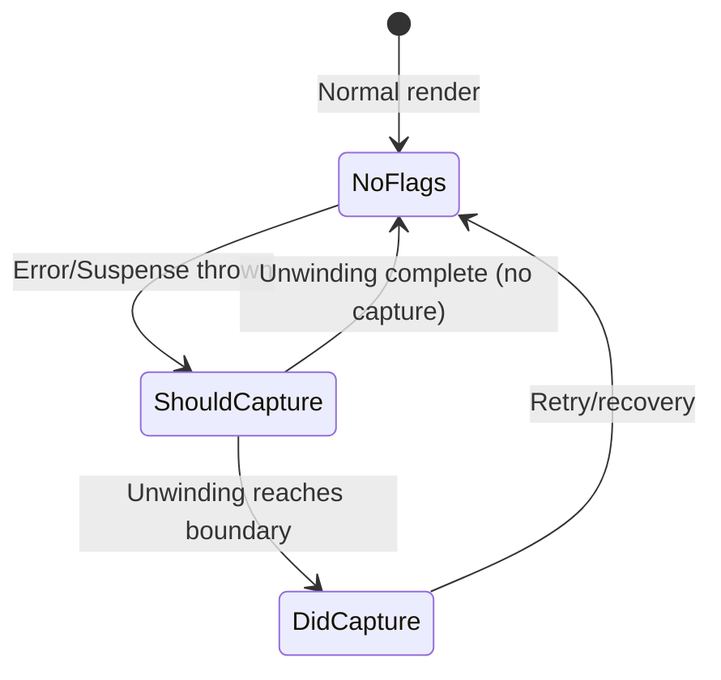

`unwindWork` 函数检查并转换这些标志：

```javascript
const flags = workInProgress.flags;
if (flags & ShouldCapture) {
  workInProgress.flags = (flags & ~ShouldCapture) | DidCapture;
  // Return this fiber to re-render with fallback
  return workInProgress;
}
```

来源：[packages/react-reconciler/src/ReactFiberFlags.js:1-200](), [packages/react-reconciler/src/ReactFiberUnwindWork.js:66-200]()

### 展开 Fiber 树

当捕获错误或 promise 时，React 必须将 fiber 树展开到最近的边界。`unwindWork` 函数处理此过程：

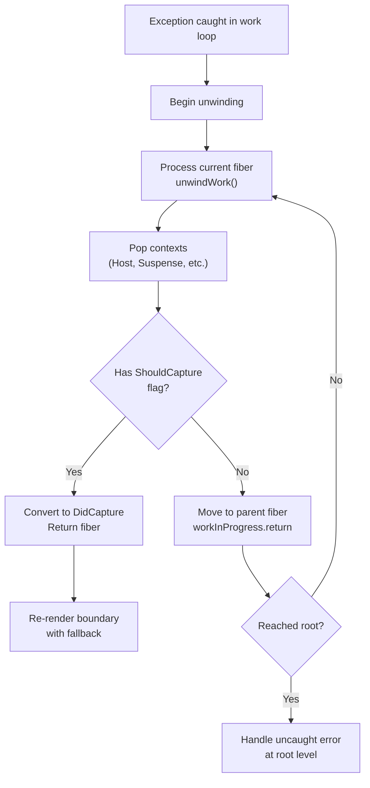

展开期间的关键操作：

1. **弹出上下文**：每种 fiber 类型弹出其关联的上下文（host context、suspense context、cache context 等）
2. **检查捕获标志**：检查是否设置了 `ShouldCapture` 标志
3. **转换标志**：将 `ShouldCapture` 转换为 `DidCapture`，用于处理异常的边界
4. **传输持续时间**：对于性能分析，如果在 profile 模式下，将实际持续时间传输到父级
5. **返回 Fiber**：返回边界 fiber 以重新渲染，或返回 null 以继续展开

在展开期间，为每种 fiber 类型调用 `unwindWork` 函数：

- **ClassComponent**：如果是 context provider，弹出遗留上下文（[packages/react-reconciler/src/ReactFiberUnwindWork.js:77-93]()）
- **HostRoot**：弹出所有根级上下文（[packages/react-reconciler/src/ReactFiberUnwindWork.js:95-118]()）
- **SuspenseComponent**：弹出 suspense handler 并检查 dehydrated boundaries（[packages/react-reconciler/src/ReactFiberUnwindWork.js:156-183]()）
- **SuspenseListComponent**：弹出 suspense list context（[packages/react-reconciler/src/ReactFiberUnwindWork.js:184-194]()）

来源：[packages/react-reconciler/src/ReactFiberUnwindWork.js:66-250]()

---

## 与工作循环的集成

### 在 performWorkOnRoot 中处理抛出

主工作循环通过 `handleThrow` 集成错误和 suspense 处理：

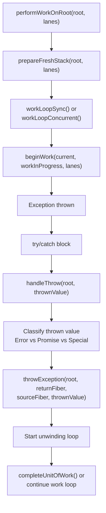

工作循环将渲染包装在 try/catch 中：

```javascript
do {
  try {
    workLoopSync(); // or workLoopConcurrent()
    break;
  } catch (thrownValue) {
    handleThrow(root, thrownValue);
  }
} while (true);
```

`handleThrow` 函数：

1. 根据抛出值的类型设置 `workInProgressSuspendedReason`
2. 存储 `workInProgressThrownValue` 以供后续处理
3. 调用 `throwException` 查找并标记边界
4. 启动展开过程

来源：[packages/react-reconciler/src/ReactFiberWorkLoop.js:1700-2000]()

### 重试和 Ping 机制

当 suspended boundary 准备重试（promise 解析）时，React 使用 ping 机制：

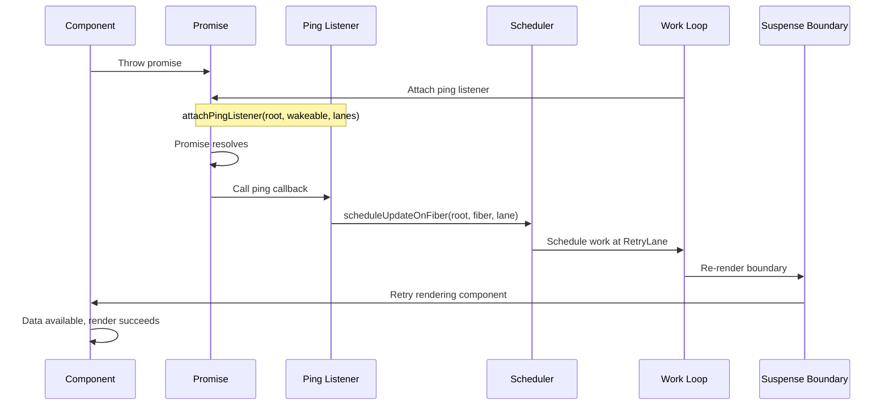

**Ping 回调实现：**

```javascript
function attachPingListener(root, wakeable, lanes) {
  let pingCache = root.pingCache;
  let threadIDs;
  if (pingCache === null) {
    pingCache = root.pingCache = new PossiblyWeakMap();
    threadIDs = new Set();
    pingCache.set(wakeable, threadIDs);
  } else {
    threadIDs = pingCache.get(wakeable);
    if (threadIDs === undefined) {
      threadIDs = new Set();
      pingCache.set(wakeable, threadIDs);
    }
  }
  
  if (!threadIDs.has(lanes)) {
    threadIDs.add(lanes);
    let ping = pingSuspendedRoot.bind(null, root, wakeable, lanes);
    wakeable.then(ping, ping);
  }
}
```

`pingSuspendedRoot` 回调在 retry lane 调度更新，触发 suspended 树的重新渲染。

来源：[packages/react-reconciler/src/ReactFiberThrow.js:400-500](), [packages/react-reconciler/src/ReactFiberWorkLoop.js:1000-1100]()

---

## Dehydrated Suspense Boundaries

在服务端渲染（SSR）期间，Suspense boundaries 可以在 "dehydrated" 状态下渲染，服务器发送占位符标记而不是等待所有异步数据。然后客户端通过将它们与真实 DOM 节点匹配来 "hydrate" 这些边界。

### Dehydrated 状态结构

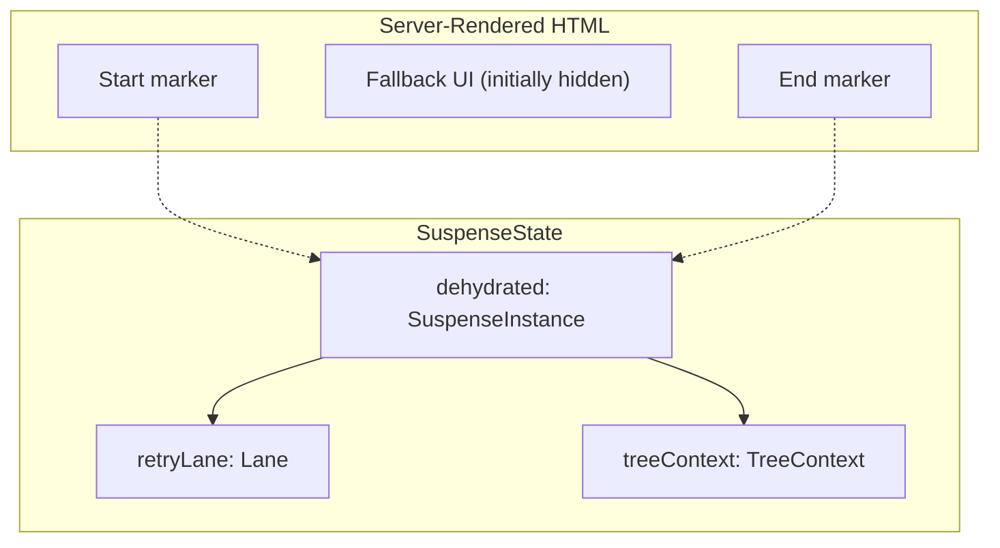

**用于 dehydrated boundaries 的关键函数：**

- `isSuspenseInstancePending(instance)`：检查 dehydrated boundary 是否仍在等待
- `isSuspenseInstanceFallback(instance)`：检查是否显示 fallback
- `reenterHydrationStateFromDehydratedSuspenseInstance()`：为 dehydrated 内容重新进入 hydration 模式（[packages/react-reconciler/src/ReactFiberHydrationContext.js:400-500]()）

在 hydration 期间，当 React 遇到 dehydrated Suspense boundary 时：

1. **检测标记**：识别 DOM 中的 `<!-- $? -->` 注释标记
2. **存储实例**：将 `SuspenseInstance` 存储在 `SuspenseState.dehydrated` 中
3. **跳过子组件**：最初跳过 hydration 子组件（它们尚未在 DOM 中）
4. **等待数据**：等待服务器流式传输实际内容
5. **到达时 Hydrate**：当内容到达时，hydrate 真实的 DOM 节点

来源：[packages/react-reconciler/src/ReactFiberHydrationContext.js:1-500](), [packages/react-reconciler/src/ReactFiberBeginWork.js:3900-4100]()

---

## Error Boundary 生命周期方法

### getDerivedStateFromError

在渲染阶段调用的静态方法，用于响应错误更新状态：

```javascript
static getDerivedStateFromError(error: Error): PartialState {
  return { hasError: true, error };
}
```

**特征：**
- 在渲染阶段调用（可能被多次调用）
- 必须是纯函数且无副作用
- 返回状态更新或 null
- 在 `componentDidCatch` 之前调用

**在更新队列中的处理：**

当捕获错误时，React 创建一个带有 `CaptureUpdate` 标签的错误更新：

```javascript
function createClassErrorUpdate(fiber, errorInfo, lane) {
  const update = createUpdate(lane);
  update.tag = CaptureUpdate;
  update.payload = {element: null};
  
  const error = errorInfo.value;
  update.callback = function() {
    // This will be called after getDerivedStateFromError
    onUncaughtError(error);
  };
  return update;
}
```

来源：[packages/react-reconciler/src/ReactFiberThrow.js:100-200](), [packages/react-reconciler/src/ReactFiberClassUpdateQueue.js:100-200]()

### componentDidCatch

在 commit 阶段调用的实例方法，用于副作用：

```javascript
componentDidCatch(error: Error, errorInfo: {componentStack: string}) {
  // Side effects like logging
  logErrorToMyService(error, errorInfo);
}
```

**特征：**
- 在 commit 阶段（effects 阶段）调用
- 可以有副作用（日志记录、分析等）
- 接收错误和带有组件堆栈的 errorInfo
- 在渲染提交后调用
- 如果边界正在卸载则不调用

**在 commit 期间的调用：**

```javascript
function commitClassLifecycles(finishedWork, current) {
  const instance = finishedWork.stateNode;
  if (finishedWork.flags & DidCapture) {
    // Error was caught, call componentDidCatch
    if (typeof instance.componentDidCatch === 'function') {
      const error = /* error from update queue */;
      const errorInfo = createCapturedValueFromError(error);
      instance.componentDidCatch(error, errorInfo);
    }
  }
}
```

来源：[packages/react-reconciler/src/ReactFiberCommitWork.js:800-1000](), [packages/react-reconciler/src/ReactFiberCommitEffects.js:200-400]()

---

## 高级：多个嵌套边界

React 可以有多个嵌套的 Suspense boundaries 和 error boundaries，每个边界在不同级别捕获异常：

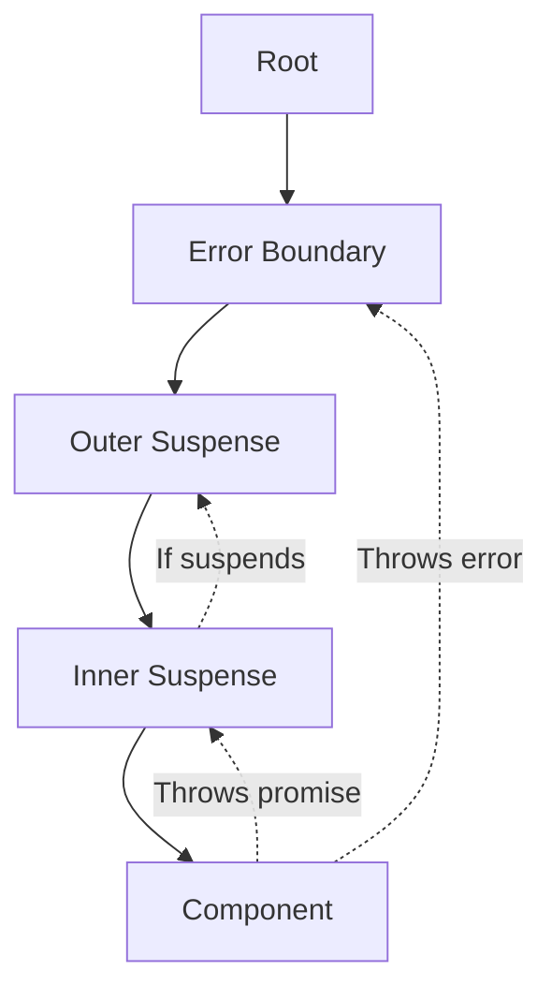

**边界选择规则：**

1. **最内层优先**：始终在最近的边界捕获
2. **类型重要**：Suspense 捕获 promise，Error Boundaries 捕获错误
3. **Fallback 隐藏**：如果外部边界也 suspends，外部边界可以隐藏内部边界的 fallback
4. **节流**：React 节流显示多个 fallback，以避免 UI 闪烁（[packages/react-reconciler/src/ReactFiberWorkLoop.js:500-520]()）

### Suspense List 协调

`<SuspenseList>` 协调多个 Suspense boundaries 的显示顺序：

```javascript
<SuspenseList revealOrder="forwards">
  <Suspense fallback={<Spinner />}>
    <Item1 />
  </Suspense>
  <Suspense fallback={<Spinner />}>
    <Item2 />
  </Suspense>
  <Suspense fallback={<Spinner />}>
    <Item3 />
  </Suspense>
</SuspenseList>
```

`SuspenseListComponent` 维护 `SuspenseListRenderState` 以跟踪哪些子组件被 suspended 并控制显示顺序。

来源：[packages/react-reconciler/src/ReactFiberSuspenseComponent.js:150-250](), [packages/react-reconciler/src/ReactFiberBeginWork.js:4100-4300]()

---

## 性能考虑

### Fallback 节流

为了防止快速显示/隐藏 fallback 导致的 UI 闪烁，React 实现了节流：

```javascript
const FALLBACK_THROTTLE_MS = 300;
```

如果 Suspense boundary suspends，React 在显示 fallback 之前等待 300ms，希望 promise 能快速解析。

来源：[packages/react-reconciler/src/ReactFiberWorkLoop.js:514]()

### Retry Lane 优先级

Retry lanes 的优先级低于用户阻塞更新，但高于空闲工作：

```javascript
const RetryLanes = 0b0000011110000000000000000000000;
```

这确保重试及时发生，但不会阻塞紧急的用户交互。

来源：[packages/react-reconciler/src/ReactFiberLane.js:93-99]()

### Error Boundary 重新渲染优化

捕获错误后，React 跳过渲染 error boundary 的子组件，直接转到 fallback，避免浪费工作。

来源：[packages/react-reconciler/src/ReactFiberBeginWork.js:1200-1300]()
