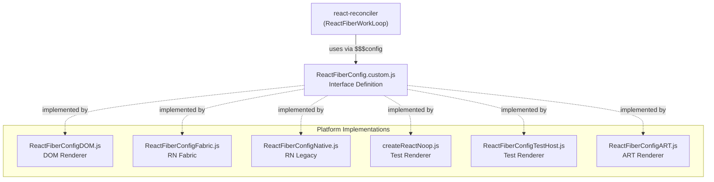
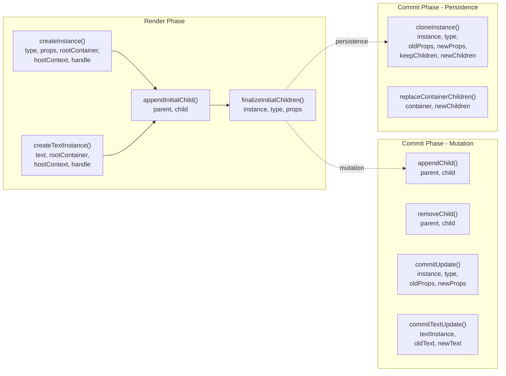
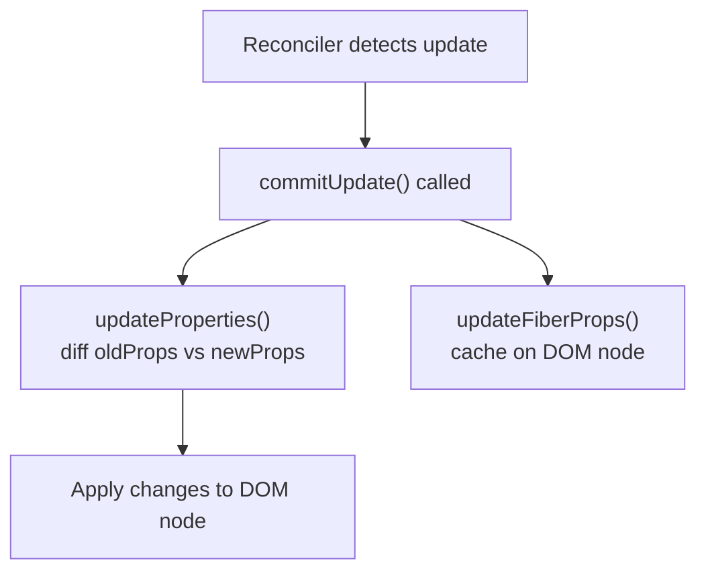
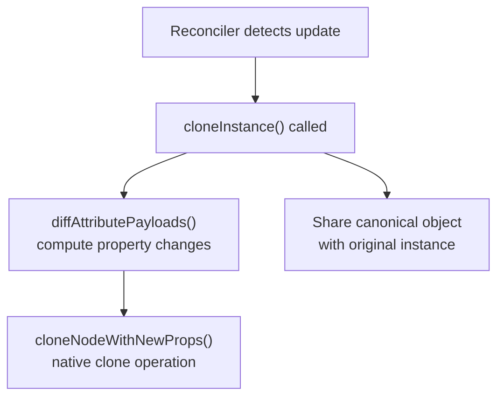
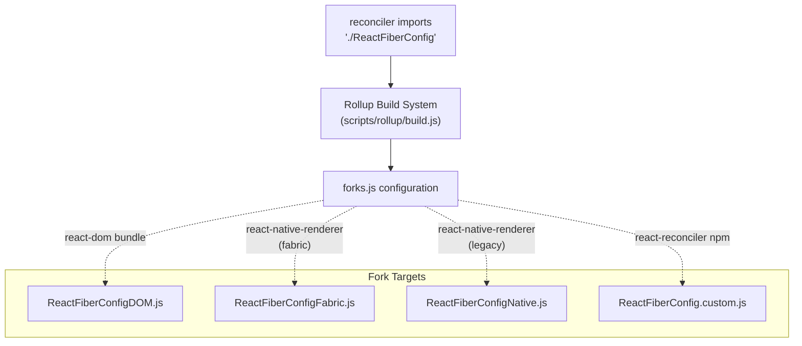
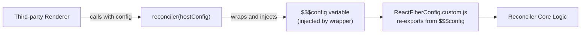
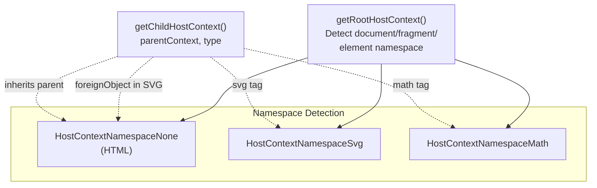
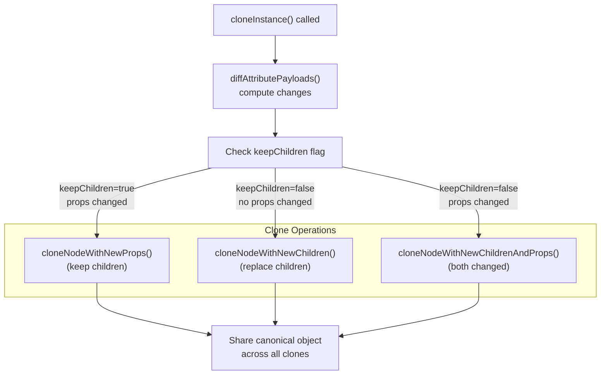
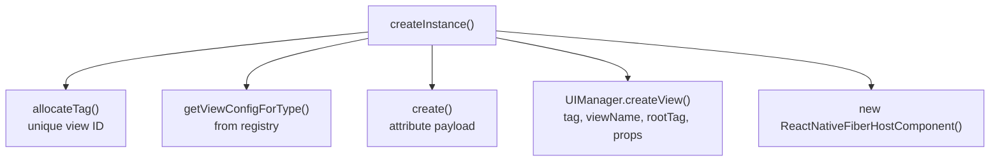
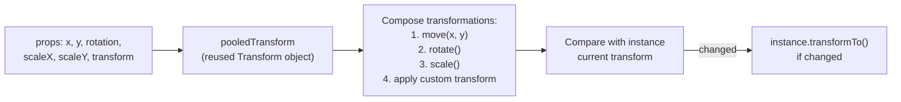

# Host Configuration 抽象层

<!-- > 来源：https://deepwiki.com/facebook/react/4.6-host-configuration-abstraction -->

<details>
<summary>相关源文件</summary>

以下文件用于生成此 wiki 页面的上下文：

- [fixtures/view-transition/README.md](fixtures/view-transition/README.md)
- [fixtures/view-transition/public/favicon.ico](fixtures/view-transition/public/favicon.ico)
- [fixtures/view-transition/public/index.html](fixtures/view-transition/public/index.html)
- [fixtures/view-transition/src/components/Chrome.css](fixtures/view-transition/src/components/Chrome.css)
- [fixtures/view-transition/src/components/Chrome.js](fixtures/view-transition/src/components/Chrome.js)
- [fixtures/view-transition/src/components/Page.css](fixtures/view-transition/src/components/Page.css)
- [fixtures/view-transition/src/components/Page.js](fixtures/view-transition/src/components/Page.js)
- [fixtures/view-transition/src/components/SwipeRecognizer.js](fixtures/view-transition/src/components/SwipeRecognizer.js)
- [packages/react-art/src/ReactFiberConfigART.js](packages/react-art/src/ReactFiberConfigART.js)
- [packages/react-dom-bindings/src/client/ReactFiberConfigDOM.js](packages/react-dom-bindings/src/client/ReactFiberConfigDOM.js)
- [packages/react-native-renderer/src/ReactFiberConfigFabric.js](packages/react-native-renderer/src/ReactFiberConfigFabric.js)
- [packages/react-native-renderer/src/ReactFiberConfigNative.js](packages/react-native-renderer/src/ReactFiberConfigNative.js)
- [packages/react-noop-renderer/src/createReactNoop.js](packages/react-noop-renderer/src/createReactNoop.js)
- [packages/react-reconciler/src/ReactFiberApplyGesture.js](packages/react-reconciler/src/ReactFiberApplyGesture.js)
- [packages/react-reconciler/src/ReactFiberCommitViewTransitions.js](packages/react-reconciler/src/ReactFiberCommitViewTransitions.js)
- [packages/react-reconciler/src/ReactFiberConfigWithNoMutation.js](packages/react-reconciler/src/ReactFiberConfigWithNoMutation.js)
- [packages/react-reconciler/src/ReactFiberGestureScheduler.js](packages/react-reconciler/src/ReactFiberGestureScheduler.js)
- [packages/react-reconciler/src/ReactFiberViewTransitionComponent.js](packages/react-reconciler/src/ReactFiberViewTransitionComponent.js)
- [packages/react-reconciler/src/__tests__/ReactFiberHostContext-test.internal.js](packages/react-reconciler/src/__tests__/ReactFiberHostContext-test.internal.js)
- [packages/react-reconciler/src/forks/ReactFiberConfig.custom.js](packages/react-reconciler/src/forks/ReactFiberConfig.custom.js)
- [packages/react-test-renderer/src/ReactFiberConfigTestHost.js](packages/react-test-renderer/src/ReactFiberConfigTestHost.js)

</details>

Host Configuration 抽象层是 React 的平台适配层，它使 reconciler 能够通过统一的接口面向不同的渲染环境（DOM、React Native、canvas、终端等）。每个 renderer 实现一个 host config，将 React 的通用操作转换为特定平台的操作。

关于 reconciler 的工作循环和渲染阶段的信息，请参见 [4.2](#4.2)。关于特定平台的实现（如 React DOM 和 hydration），请参见 [6.1](#6.1) 和 [6.3](#6.3)。

## Host Config 接口

host config 定义了 reconciler 与 host 平台之间的契约。Renderer 通过向 `react-reconciler` 传递配置对象来提供实现，该函数作为包装 reconciler 代码的工厂函数。

### 核心配置结构



**图表：Host Config 架构**

来源：[packages/react-reconciler/src/forks/ReactFiberConfig.custom.js:1-287](), [packages/react-dom-bindings/src/client/ReactFiberConfigDOM.js:1-150](), [packages/react-native-renderer/src/ReactFiberConfigFabric.js:1-82]()

### 核心 Host Config 方法

host config 接口包含 100 多个方法，分为以下几类：

| 类别 | 必需 | 示例方法 | 用途 |
|----------|----------|----------------|---------|
| **元数据** | 是 | `rendererVersion`, `rendererPackageName`, `isPrimaryRenderer` | 标识 renderer |
| **实例创建** | 是 | `createInstance`, `createTextInstance`, `appendInitialChild` | 在渲染期间构建 host 树 |
| **上下文管理** | 是 | `getRootHostContext`, `getChildHostContext` | 跟踪渲染上下文（如命名空间） |
| **最终化** | 是 | `finalizeInitialChildren`, `shouldSetTextContent` | 完成初始设置 |
| **提交准备** | 是 | `prepareForCommit`, `resetAfterCommit` | 标记提交阶段 |
| **公共实例** | 是 | `getPublicInstance` | 通过 refs 暴露实例 |
| **调度** | 是 | `scheduleTimeout`, `cancelTimeout`, `now` | 基于时间的操作 |
| **优先级管理** | 是 | `setCurrentUpdatePriority`, `getCurrentUpdatePriority`, `resolveUpdatePriority` | 管理事件优先级 |
| **变更** | 可选 | `appendChild`, `removeChild`, `commitUpdate`, `commitTextUpdate` | 变更现有树 |
| **持久化** | 可选 | `cloneInstance`, `replaceContainerChildren` | 不可变地替换树 |
| **Hydration** | 可选 | `canHydrateInstance`, `hydrateInstance`, `getNextHydratableSibling` | 匹配服务端渲染的标记 |
| **资源** | 可选 | `supportsResources`, `acquireResource`, `releaseResource` | 管理可提升的资源 |
| **单例** | 可选 | `supportsSingletons`, `acquireSingletonInstance` | 管理单例元素 |
| **视图过渡** | 可选 | `startViewTransition`, `measureInstance` | 动画化状态过渡 |
| **Suspense 提交** | 可选 | `maySuspendCommit`, `waitForCommitToBeReady` | 延迟提交以等待加载 |

来源：[packages/react-reconciler/src/forks/ReactFiberConfig.custom.js:52-287]()

### Host Config 方法签名



**图表：关键 Host Config 方法流程**

来源：[packages/react-reconciler/src/forks/ReactFiberConfig.custom.js:61-189]()

## Mutation 模式 vs Persistence 模式

React 的 reconciler 支持两种应用更新的模式，通过 host config 在编译时选择：

### Mutation 模式

**模式标识符**：`supportsMutation = true`, `supportsPersistence = false`

在 mutation 模式下，reconciler 直接修改现有的 host 实例。这种方式内存效率更高，但要求 host 平台支持原地更新。

**必需方法**：
- `appendChild(parentInstance, child)` - 将子节点添加到父节点
- `removeChild(parentInstance, child)` - 从父节点移除子节点
- `insertBefore(parentInstance, child, beforeChild)` - 在指定位置插入
- `commitUpdate(instance, type, oldProps, newProps)` - 更新实例属性
- `commitTextUpdate(textInstance, oldText, newText)` - 更新文本内容
- `resetTextContent(instance)` - 清空文本内容
- `hideInstance(instance)` / `unhideInstance(instance, props)` - 切换可见性

**实现示例（DOM）**：



**图表：DOM Mutation 模式流程**

来源：[packages/react-dom-bindings/src/client/ReactFiberConfigDOM.js:940-953](), [packages/react-dom-bindings/src/client/ReactDOMComponent.js:78-82]()

### Persistence 模式

**模式标识符**：`supportsMutation = false`, `supportsPersistence = true`

在 persistence 模式下，reconciler 创建需要更新的实例的新克隆，构建新的树结构。这使时间旅行调试和结构共享等功能成为可能。

**必需方法**：
- `cloneInstance(instance, type, oldProps, newProps, keepChildren, newChildren)` - 克隆并更新
- `createContainerChildSet()` - 创建新的子节点集合
- `appendChildToContainerChildSet(childSet, child)` - 添加到集合
- `finalizeContainerChildren(container, newChildren)` - 准备替换
- `replaceContainerChildren(container, newChildren)` - 原子交换
- `cloneHiddenInstance(instance, type, props)` - 克隆为隐藏状态
- `cloneHiddenTextInstance(instance, text)` - 克隆文本为隐藏状态

**实现示例（React Native Fabric）**：



**图表：Fabric Persistence 模式流程**

来源：[packages/react-native-renderer/src/ReactFiberConfigFabric.js:451-504]()

### 模式对比

| 方面 | Mutation 模式 | Persistence 模式 |
|--------|---------------|------------------|
| **内存** | 更低（重用实例） | 更高（创建克隆） |
| **复杂度** | 更高（管理变更） | 更低（不可变树） |
| **调试** | 更难（状态变更） | 更容易（树快照） |
| **平台适配** | DOM、遗留系统 | React Native Fabric、不可变后端 |
| **更新机制** | 原地修改 | 克隆并替换 |
| **实例生命周期** | 长期存活 | 每次更新短期存活 |

来源：[packages/react-reconciler/src/ReactFiberConfigWithNoPersistence.js:1-62](), [packages/react-reconciler/src/ReactFiberConfigWithNoMutation.js:1-62]()

## Fork 解析系统

React 使用构建时 fork 系统来选择适当的 host config 实现，无需运行时开销。Reconciler 从 `react-reconciler/src/ReactFiberConfig` 导入，该路径根据目标 renderer 解析为不同的文件。

### Fork 解析机制



**图表：构建时 Fork 解析**

`scripts/rollup/forks.js` 中的 fork 配置将 bundle 类型映射到特定的 host config 文件：

```
'react-reconciler/src/ReactFiberConfig': {
  'react-dom': 'react-dom-bindings/src/client/ReactFiberConfigDOM',
  'react-native-renderer': 'react-native-renderer/src/ReactFiberConfigNative',
  'react-native-renderer/fabric': 'react-native-renderer/src/ReactFiberConfigFabric',
  'react-test-renderer': 'react-test-renderer/src/ReactFiberConfigTestHost',
  'react-art': 'react-art/src/ReactFiberConfigART',
  'react-reconciler': 'react-reconciler/src/forks/ReactFiberConfig.custom'
}
```

来源：[packages/react-reconciler/src/forks/ReactFiberConfig.custom.js:10-24](), 构建系统配置（从导入推断）

### 自定义 Renderer 模式

`react-reconciler` npm 包通过导出工厂函数使第三方 renderer 成为可能。自定义 host config 使用全局 `$$$config` 变量，该变量在构建时注入：



**图表：第三方 Renderer 集成**

自定义 config 文件从注入的 `$$$config` 对象导出所有方法：

```javascript
declare const $$$config: any;
export const getPublicInstance = $$$config.getPublicInstance;
export const getRootHostContext = $$$config.getRootHostContext;
export const createInstance = $$$config.createInstance;
// ... 100+ more exports
```

来源：[packages/react-reconciler/src/forks/ReactFiberConfig.custom.js:26-287]()

## 平台实现

### React DOM（Mutation 模式）

DOM host config 是最完整的实现，支持 hydration、资源、单例、视图过渡和 suspense 提交。

**关键特性**：
- Mutation 模式：直接修改 DOM 节点
- 命名空间上下文：跟踪 SVG、MathML、HTML 上下文
- 事件系统集成：委托给 `ReactDOMEventListener`
- 资源管理：将 `<link>`、`<script>`、`<style>` 提升到 document head
- Hydration：匹配服务端渲染的标记

**实例类型**：

| 类型 | 定义 | 用途 |
|------|------------|-------|
| `Instance` | `Element` | DOM 元素节点 |
| `TextInstance` | `Text` | DOM 文本节点 |
| `Container` | `Element \| Document \| DocumentFragment` | 根容器 |
| `SuspenseInstance` | `Comment` (with `_reactRetry`) | SSR 中的 Suspense 边界 |
| `ActivityInstance` | `Comment` | SSR 中的 Activity 边界 |
| `HydratableInstance` | Union of above | 任何可 hydration 的节点 |

**上下文管理**：



**图表：DOM 上下文跟踪**

**实例创建**：

`createInstance` 方法创建具有适当命名空间处理的 DOM 元素：

```
1. Extract host context (namespace)
2. Get owner document from root container
3. Create element with appropriate createElementNS or createElement
4. Special handling for 'script' (create via innerHTML to prevent execution)
5. Special handling for 'select' (apply size/multiple before children)
6. Cache fiber node on DOM node via precacheFiberNode()
7. Cache props on DOM node via updateFiberProps()
8. Return DOM element
```

来源：[packages/react-dom-bindings/src/client/ReactFiberConfigDOM.js:303-609](), [packages/react-dom-bindings/src/client/ReactDOMComponentTree.js:47-59]()

### React Native Fabric（Persistence 模式）

Fabric 是 React Native 的现代渲染架构，使用 persistence 模式来实现结构共享并更好地与原生渲染集成。

**关键特性**：
- Persistence 模式：创建克隆而非变更
- Shadow 节点：轻量级原生表示
- Canonical 对象共享：多个克隆共享状态
- 公共实例延迟创建：首次 ref 访问时创建

**实例结构**：

```typescript
type Instance = {
  node: Node,  // Shadow node reference (native)
  canonical: {
    nativeTag: number,
    viewConfig: ViewConfig,
    currentProps: Props,
    internalInstanceHandle: Fiber,
    publicInstance: PublicInstance | null,  // Lazily created
    publicRootInstance?: PublicRootInstance | null
  }
}
```

**克隆策略**：



**图表：Fabric 克隆策略**

`canonical` 对象在所有实例克隆之间共享，为以下功能提供稳定的标识：
- 通过 refs 暴露公共实例
- 事件处理器查找
- 事件分发时访问当前 props

来源：[packages/react-native-renderer/src/ReactFiberConfigFabric.js:95-113](), [packages/react-native-renderer/src/ReactFiberConfigFabric.js:451-504]()

### React Native Legacy（Mutation 模式）

遗留的 React Native renderer 使用 mutation 模式和 UIManager bridge API。

**关键特性**：
- Mutation 模式：调用 UIManager 修改原生视图
- 实例跟踪：`ReactNativeFiberHostComponent` 包装器
- 子节点管理：在实例上跟踪 `_children` 数组
- Bridge 批处理：在原生调用前累积变更

**实例管理**：



**图表：Legacy RN 实例创建**

**变更操作**：

所有变更都通过 `UIManager.manageChildren()` 进行，该方法批处理多个操作：
- `moveFromIndices` / `moveToIndices` - 重新排序子节点
- `addChildReactTags` / `addAtIndices` - 插入新子节点
- `removeAtIndices` - 移除子节点

来源：[packages/react-native-renderer/src/ReactFiberConfigNative.js:130-169](), [packages/react-native-renderer/src/ReactFiberConfigNative.js:379-411]()

### 测试 Renderer（Noop 和 Test）

React 提供测试 renderer，用于在没有真实 host 平台的情况下进行单元测试。

**Noop Renderer** (`react-noop-renderer`)：
- 用于 React 的内部测试
- 简单的 JS 对象实例：`{type, props, children, hidden, id}`
- 支持 mutation 和 persistence 两种模式
- 可配置行为（如错误、suspense）

**Test Renderer** (`react-test-renderer`)：
- 公共测试 API
- 仅 Mutation 模式
- 创建可模拟的实例
- 简单的树检查：`root.toJSON()`

**Noop 实例结构**：

```javascript
type Instance = {
  id: number,           // Hidden from enumeration
  type: string,
  children: Array<Instance | TextInstance>,
  parent: number,       // Hidden from enumeration
  text: string | null,  // Hidden from enumeration
  prop: any,            // User-defined prop
  hidden: boolean,
  context: HostContext  // Hidden from enumeration
}
```

noop renderer 使用 `Object.defineProperty()` 隐藏实现细节，使测试输出更清晰。

来源：[packages/react-noop-renderer/src/createReactNoop.js:399-453](), [packages/react-test-renderer/src/ReactFiberConfigTestHost.js:158-174]()

### ART Renderer（Canvas/SVG）

ART renderer 面向 ART 绘图库，用于 canvas 和 SVG 渲染。

**关键特性**：
- Mutation 模式
- 基于 transform 的定位
- 对象池化的 transform 对象（跨调用重用）
- 事件监听器管理

**Transform 应用**：



**图表：ART Transform 管理**

对象池化的 transform 模式避免为每次更新分配新的 transform 对象，减少动画期间的 GC 压力。

来源：[packages/react-art/src/ReactFiberConfigART.js:140-184]()

## 关键 Host Config 方法

### 实例生命周期

**createInstance(type, props, rootContainer, hostContext, internalInstanceHandle)**

在渲染阶段创建新的 host 实例。这是 host 组件的主要工厂方法。

**参数**：
- `type`：组件类型字符串（如 "div"、"View"）
- `props`：组件 props 对象
- `rootContainer`：正在渲染到的根容器
- `hostContext`：来自父级的上下文（如命名空间、文本上下文）
- `internalInstanceHandle`：此实例的 Fiber 引用

**返回**：特定平台的实例（Element、原生节点、JS 对象等）

**时机**：在渲染阶段的 `completeWork` 中首次挂载 host 组件时调用。

来源：[packages/react-dom-bindings/src/client/ReactFiberConfigDOM.js:485-609](), [packages/react-native-renderer/src/ReactFiberConfigFabric.js:176-220]()

**appendInitialChild(parentInstance, child)**

在初始树构建期间将子实例附加到其父级。这会在提交前自底向上构建树。

**注意**：仅对新创建的实例调用。更新根据 mutation/persistence 模式使用不同的方法。

来源：[packages/react-dom-bindings/src/client/ReactFiberConfigDOM.js:640-646](), [packages/react-native-renderer/src/ReactFiberConfigFabric.js:167-172]()

**finalizeInitialChildren(instance, type, props, hostContext)**

在所有子节点都已附加到新创建的实例后调用，允许进行任何最终初始化。

**返回**：布尔值，指示是否应在提交阶段调用 `commitMount`（如用于 autofocus）。

来源：[packages/react-dom-bindings/src/client/ReactFiberConfigDOM.js:648-666](), [packages/react-native-renderer/src/ReactFiberConfigFabric.js:250-257]()

### 上下文管理

**getRootHostContext(rootContainer)**

初始化树根部的 host 上下文。这决定了初始渲染上下文。

**DOM 示例**：根据命名空间检测根是 SVG、MathML 还是 HTML。

**React Native 示例**：返回 `{isInAParentText: false}`。

来源：[packages/react-dom-bindings/src/client/ReactFiberConfigDOM.js:303-356](), [packages/react-native-renderer/src/ReactFiberConfigFabric.js:259-267]()

**getChildHostContext(parentHostContext, type)**

根据父级上下文和当前组件类型计算子级上下文。这会将上下文向下传播到树中。

**DOM 示例**：进入 `<svg>` 切换到 SVG 命名空间，`<foreignObject>` 切换回 HTML。

**React Native 示例**：进入文本组件类型设置 `isInAParentText: true`。

来源：[packages/react-dom-bindings/src/client/ReactFiberConfigDOM.js:392-407](), [packages/react-native-renderer/src/ReactFiberConfigFabric.js:269-291]()

### 提交阶段操作

**prepareForCommit(containerInfo)** / **resetAfterCommit(containerInfo)**

这些方法标记整个提交阶段，允许 renderer 进行准备和清理。

**DOM 示例**：
- `prepareForCommit`：禁用事件系统，保存选择状态，返回聚焦的实例
- `resetAfterCommit`：重新启用事件系统，恢复选择

**React Native 示例**：两者都是空操作（原生渲染是同步的）。

来源：[packages/react-dom-bindings/src/client/ReactFiberConfigDOM.js:413-451]()

### Mutation 模式方法

**appendChild(parentInstance, child)** / **removeChild(parentInstance, child)**

从父实例添加或移除子节点。仅在 mutation 模式下定义。

**DOM**：如果可用则使用 `moveBefore()`（未来 API），否则使用 `appendChild()`/`removeChild()`。

**React Native Legacy**：调用 `UIManager.manageChildren()` 批处理原生变更。

来源：[packages/react-dom-bindings/src/client/ReactFiberConfigDOM.js:973-983](), [packages/react-native-renderer/src/ReactFiberConfigNative.js:379-411]()

**commitUpdate(instance, type, oldProps, newProps, internalInstanceHandle)**

更新现有实例的属性。仅在 mutation 模式下定义。

**DOM**：调用 `updateProperties()`，该方法会 diff props 并将变更应用到 DOM。

**React Native Legacy**：Diff props 并调用 `UIManager.updateView()`。

来源：[packages/react-dom-bindings/src/client/ReactFiberConfigDOM.js:940-953](), [packages/react-native-renderer/src/ReactFiberConfigNative.js:445-468]()

### Persistence 模式方法

**cloneInstance(instance, type, oldProps, newProps, keepChildren, newChildSet)**

创建具有更新属性的实例克隆。仅在 persistence 模式下定义。

**Fabric**：调用原生克隆操作（`cloneNodeWithNewProps`、`cloneNodeWithNewChildren` 等）并共享 `canonical` 对象。

来源：[packages/react-native-renderer/src/ReactFiberConfigFabric.js:451-504]()

**replaceContainerChildren(container, newChildren)**

原子性地将根容器的子节点替换为新的子节点集合。仅在 persistence 模式下定义。

**Fabric**：调用 `completeRoot()` 完成原生树。

来源：[packages/react-native-renderer/src/ReactFiberConfigFabric.js:556-561]()

### 优先级和调度

**setCurrentUpdatePriority(priority)** / **getCurrentUpdatePriority()` / **resolveUpdatePriority()**

管理当前更新的优先级。这些方法将 React 的事件优先级与特定平台的优先级系统桥接。

**DOM**：直接使用 React 的优先级常量。

**React Native Fabric**：在 React 优先级和 Fabric 的原生优先级系统之间映射：
- `FabricDiscretePriority` ↔ `DiscreteEventPriority`
- `FabricContinuousPriority` ↔ `ContinuousEventPriority`
- `FabricIdlePriority` ↔ `IdleEventPriority`
- `FabricDefaultPriority` ↔ `DefaultEventPriority`

来源：[packages/react-dom-bindings/src/client/ReactDOMUpdatePriority.js:42-45](), [packages/react-native-renderer/src/ReactFiberConfigFabric.js:386-419]()

### Suspense 提交支持

**maySuspendCommit(type, props)** / **preloadInstance(instance, type, props)**

这些可选方法使 reconciler 能够在资源加载时延迟提交，防止布局抖动。

**maySuspendCommit**：如果此 type+props 组合在提交前可能需要加载，则返回 true。

**preloadInstance**：启动加载，如果已加载则返回 true，如果仍在加载则返回 false。

**DOM 示例**：为 `loading="lazy"` 的 `` 和 `<link>` 资源实现。

**startSuspendingCommit()` / **suspendInstance()` / **waitForCommitToBeReady()**

创建挂起状态，跟踪阻塞提交的实例，并提供基于回调的 API，以便在就绪时恢复。

来源：[packages/react-dom-bindings/src/client/ReactFiberConfigDOM.js:1213-1264](), [packages/react-noop-renderer/src/createReactNoop.js:618-679]()

### 视图过渡支持

**startViewTransition()` / **startGestureTransition()**

使用视图过渡 API 或手势驱动的过渡来动画化状态变更的可选方法。

**参数包括**：
- 变更、布局和被动阶段的回调
- 用于 CSS 类选择的过渡类型
- 用于手势控制的时间线对象
- 错误和分析回调

**DOM**：与原生 `document.startViewTransition()` API 集成。

**其他平台**：通常是空操作或在没有动画的情况下调用回调。

来源：[packages/react-dom-bindings/src/client/ReactFiberConfigDOM.js:1383-1520]()

## 默认实现

React 为可选功能提供默认实现，这些实现会抛出错误或返回空操作：

- **ReactFiberConfigWithNoMutation.js**：为 mutation 方法导出抛出错误
- **ReactFiberConfigWithNoPersistence.js**：为 persistence 方法导出抛出错误
- **ReactFiberConfigWithNoHydration.js**：为 hydration 导出返回 false/null
- **ReactFiberConfigWithNoResources.js**：为资源管理导出抛出错误
- **ReactFiberConfigWithNoSingletons.js**：为单例管理导出抛出错误
- **ReactFiberConfigWithNoTestSelectors.js**：为测试选择器导出抛出错误
- **ReactFiberConfigWithNoMicrotasks.js**：导出禁用微任务调度
- **ReactFiberConfigWithNoScopes.js**：为禁用的 scope API 导出

Renderer 导入这些默认模块，然后仅覆盖它们支持的功能：

```javascript
export * from 'react-reconciler/src/ReactFiberConfigWithNoMutation';
export * from 'react-reconciler/src/ReactFiberConfigWithNoHydration';
// ... etc

// Then override specific methods:
export const supportsPersistence = true;
export function cloneInstance(...) { /* implementation */ }
```

来源：[packages/react-reconciler/src/ReactFiberConfigWithNoMutation.js:1-62](), [packages/react-native-renderer/src/ReactFiberConfigFabric.js:160-165]()
