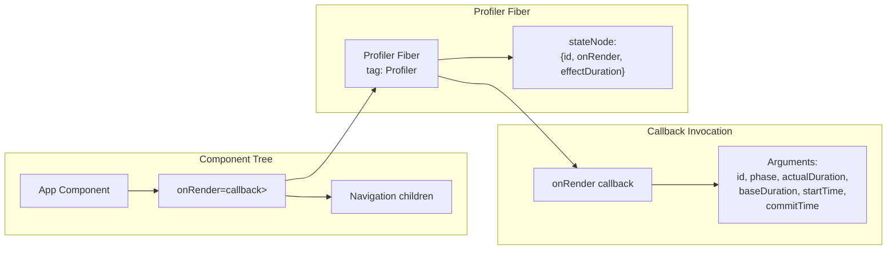
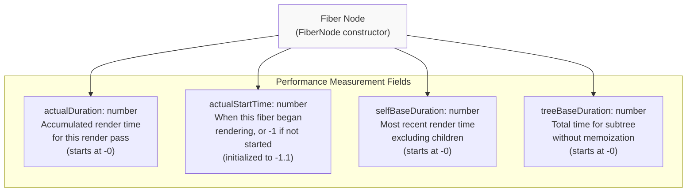
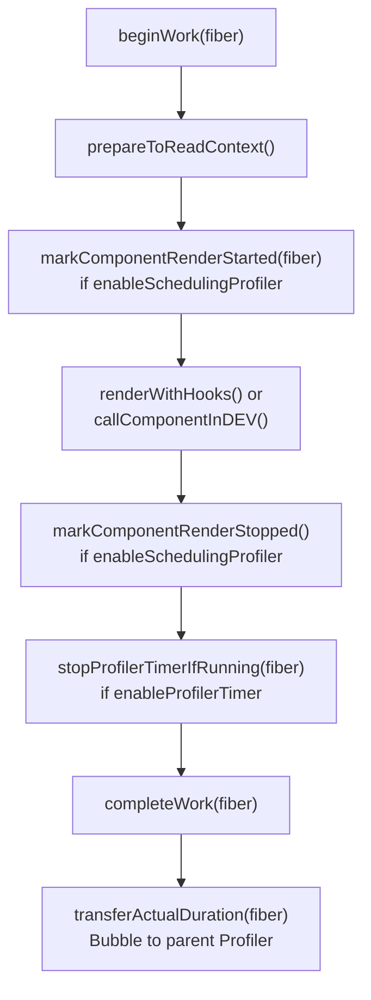
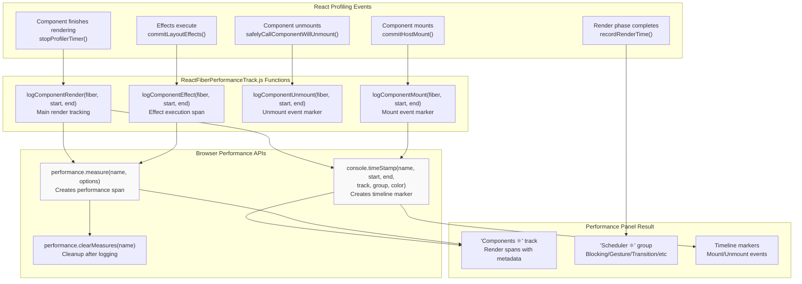
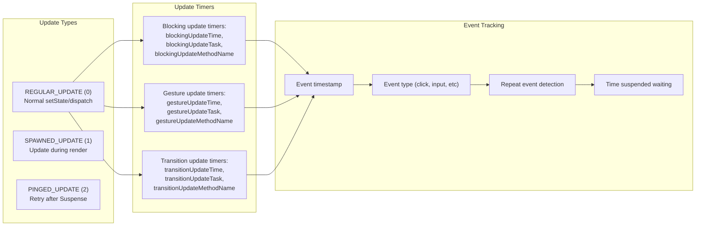
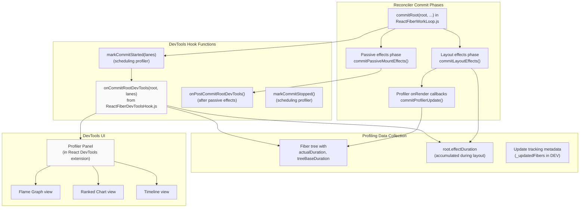

# Profiling 和性能追踪

<!-- > 来源：https://deepwiki.com/facebook/react/4.7-profiling-and-performance-tracking -->

<details>
<summary>相关源文件</summary>

以下文件用于生成此 wiki 页面的上下文：

- [packages/react-client/src/ReactFlightPerformanceTrack.js](https://github.com/facebook/react/blob/main/packages/react-client/src/ReactFlightPerformanceTrack.js)
- [packages/react-dom/index.js](https://github.com/facebook/react/blob/main/packages/react-dom/index.js)
- [packages/react-dom/src/__tests__/ReactDOMFiberAsync-test.js](https://github.com/facebook/react/blob/main/packages/react-dom/src/__tests__/ReactDOMFiberAsync-test.js)
- [packages/react-dom/src/__tests__/refs-test.js](https://github.com/facebook/react/blob/main/packages/react-dom/src/__tests__/refs-test.js)
- [packages/react-reconciler/src/ReactChildFiber.js](https://github.com/facebook/react/blob/main/packages/react-reconciler/src/ReactChildFiber.js)
- [packages/react-reconciler/src/ReactFiber.js](https://github.com/facebook/react/blob/main/packages/react-reconciler/src/ReactFiber.js)
- [packages/react-reconciler/src/ReactFiberBeginWork.js](https://github.com/facebook/react/blob/main/packages/react-reconciler/src/ReactFiberBeginWork.js)
- [packages/react-reconciler/src/ReactFiberClassComponent.js](https://github.com/facebook/react/blob/main/packages/react-reconciler/src/ReactFiberClassComponent.js)
- [packages/react-reconciler/src/ReactFiberCommitWork.js](https://github.com/facebook/react/blob/main/packages/react-reconciler/src/ReactFiberCommitWork.js)
- [packages/react-reconciler/src/ReactFiberCompleteWork.js](https://github.com/facebook/react/blob/main/packages/react-reconciler/src/ReactFiberCompleteWork.js)
- [packages/react-reconciler/src/ReactFiberLane.js](https://github.com/facebook/react/blob/main/packages/react-reconciler/src/ReactFiberLane.js)
- [packages/react-reconciler/src/ReactFiberPerformanceTrack.js](https://github.com/facebook/react/blob/main/packages/react-reconciler/src/ReactFiberPerformanceTrack.js)
- [packages/react-reconciler/src/ReactFiberReconciler.js](https://github.com/facebook/react/blob/main/packages/react-reconciler/src/ReactFiberReconciler.js)
- [packages/react-reconciler/src/ReactFiberRootScheduler.js](https://github.com/facebook/react/blob/main/packages/react-reconciler/src/ReactFiberRootScheduler.js)
- [packages/react-reconciler/src/ReactFiberSuspenseComponent.js](https://github.com/facebook/react/blob/main/packages/react-reconciler/src/ReactFiberSuspenseComponent.js)
- [packages/react-reconciler/src/ReactFiberUnwindWork.js](https://github.com/facebook/react/blob/main/packages/react-reconciler/src/ReactFiberUnwindWork.js)
- [packages/react-reconciler/src/ReactFiberWorkLoop.js](https://github.com/facebook/react/blob/main/packages/react-reconciler/src/ReactFiberWorkLoop.js)
- [packages/react-reconciler/src/ReactProfilerTimer.js](https://github.com/facebook/react/blob/main/packages/react-reconciler/src/ReactProfilerTimer.js)
- [packages/react-reconciler/src/__tests__/ReactDeferredValue-test.js](https://github.com/facebook/react/blob/main/packages/react-reconciler/src/__tests__/ReactDeferredValue-test.js)
- [packages/react-reconciler/src/__tests__/ReactLazy-test.internal.js](https://github.com/facebook/react/blob/main/packages/react-reconciler/src/__tests__/ReactLazy-test.internal.js)
- [packages/react-reconciler/src/__tests__/ReactPerformanceTrack-test.js](https://github.com/facebook/react/blob/main/packages/react-reconciler/src/__tests__/ReactPerformanceTrack-test.js)
- [packages/react-reconciler/src/__tests__/ReactSiblingPrerendering-test.js](https://github.com/facebook/react/blob/main/packages/react-reconciler/src/__tests__/ReactSiblingPrerendering-test.js)
- [packages/react-reconciler/src/__tests__/ReactSuspense-test.internal.js](https://github.com/facebook/react/blob/main/packages/react-reconciler/src/__tests__/ReactSuspense-test.internal.js)
- [packages/react-reconciler/src/__tests__/ReactSuspensePlaceholder-test.internal.js](https://github.com/facebook/react/blob/main/packages/react-reconciler/src/__tests__/ReactSuspensePlaceholder-test.internal.js)
- [packages/react-reconciler/src/__tests__/ReactSuspenseyCommitPhase-test.js](https://github.com/facebook/react/blob/main/packages/react-reconciler/src/__tests__/ReactSuspenseyCommitPhase-test.js)
- [packages/react-server/src/ReactFlightAsyncSequence.js](https://github.com/facebook/react/blob/main/packages/react-server/src/ReactFlightAsyncSequence.js)
- [packages/react-server/src/ReactFlightServerConfigDebugNode.js](https://github.com/facebook/react/blob/main/packages/react-server/src/ReactFlightServerConfigDebugNode.js)
- [packages/react-server/src/ReactFlightServerConfigDebugNoop.js](https://github.com/facebook/react/blob/main/packages/react-server/src/ReactFlightServerConfigDebugNoop.js)
- [packages/react-server/src/ReactFlightStackConfigV8.js](https://github.com/facebook/react/blob/main/packages/react-server/src/ReactFlightStackConfigV8.js)
- [packages/react-server/src/__tests__/ReactFlightAsyncDebugInfo-test.js](https://github.com/facebook/react/blob/main/packages/react-server/src/__tests__/ReactFlightAsyncDebugInfo-test.js)
- [packages/react/src/ReactLazy.js](https://github.com/facebook/react/blob/main/packages/react/src/ReactLazy.js)
- [packages/react/src/__tests__/ReactProfiler-test.internal.js](https://github.com/facebook/react/blob/main/packages/react/src/__tests__/ReactProfiler-test.internal.js)
- [packages/shared/ReactPerformanceTrackProperties.js](https://github.com/facebook/react/blob/main/packages/shared/ReactPerformanceTrackProperties.js)

</details>


## 目的和范围

Profiling 系统通过四个关键机制提供用于测量 React 组件渲染性能的工具：

1. **Profiler 组件** - 公开的 `<Profiler>` API，用于程序化性能监控
2. **性能测量** - 追踪渲染时间的 `actualDuration` 和 `baseDuration` 字段
3. **组件 Effects 追踪** - 测量 Profiler 边界内 effect 执行时间
4. **浏览器 DevTools 集成** - `performance.measure()` 和 `console.timeStamp()` 集成，用于可视化 profiling

该系统既支持通过 Profiler 组件进行运行时性能回调，也支持通过浏览器性能时间线和 React DevTools 进行离线分析。

关于 DevTools profiling 界面的信息，请参见第 7.1 页。关于决定更新优先级的基于 lane 的调度，请参见第 4.4 页。

---

## 系统架构

Profiling 系统在 React 协调和 commit 生命周期的多个阶段运行：

```mermaid
graph TB
    subgraph "Public API"
        ProfilerComponent["<Profiler> Component<br/>with onRender callback"]
    end
    
    subgraph "Fiber Fields"
        ActualDuration["actualDuration<br/>Time spent rendering"]
        ActualStartTime["actualStartTime<br/>When render began"]
        SelfBaseDuration["selfBaseDuration<br/>Component time only"]
        TreeBaseDuration["treeBaseDuration<br/>Including children"]
    end
    
    subgraph "Timing Infrastructure"
        StartProfilerTimer["startProfilerTimer()<br/>Begin timing"]
        StopProfilerTimer["stopProfilerTimerIfRunning()<br/>End timing"]
        RecordRenderTime["recordRenderTime()<br/>Track render duration"]
        RecordCommitTime["recordCommitTime()<br/>Track commit duration"]
    end
    
    subgraph "Render Phase Instrumentation"
        MarkRenderStarted["markComponentRenderStarted()<br/>BeginWork hooks"]
        MarkRenderStopped["markComponentRenderStopped()<br/>After component render"]
        TransferDuration["transferActualDuration()<br/>Bubble up times"]
    end
    
    subgraph "Commit Phase Instrumentation"
        CommitProfilerUpdate["commitProfilerUpdate()<br/>Layout effects"]
        PushEffectDurations["pushNestedEffectDurations()<br/>Track effect times"]
        PopEffectDurations["popNestedEffectDurations()<br/>Bubble effect times"]
    end
    
    subgraph "Performance Track"
        LogComponentRender["logComponentRender()<br/>Browser timeline"]
        LogComponentMount["logComponentMount()"]
        LogComponentEffect["logComponentEffect()"]
        ConsoleTimeStamp["console.timeStamp()"]
        PerformanceMeasure["performance.measure()"]
    end
    
    ProfilerComponent --> ActualDuration
    ProfilerComponent --> TreeBaseDuration
    
    StartProfilerTimer --> ActualStartTime
    StopProfilerTimer --> ActualDuration
    
    MarkRenderStarted --> StartProfilerTimer
    MarkRenderStopped --> StopProfilerTimer
    TransferDuration --> TreeBaseDuration
    
    CommitProfilerUpdate --> PushEffectDurations
    CommitProfilerUpdate --> PopEffectDurations
    
    LogComponentRender --> ConsoleTimeStamp
    LogComponentRender --> PerformanceMeasure
    LogComponentMount --> ConsoleTimeStamp
    LogComponentEffect --> PerformanceMeasure
    
    RecordRenderTime --> LogComponentRender
    RecordCommitTime --> CommitProfilerUpdate
```



**来源：** [packages/react-reconciler/src/ReactProfilerTimer.js#L1-L700](https://github.com/facebook/react/blob/main/packages/react-reconciler/src/ReactProfilerTimer.js#L1-L700), [packages/react-reconciler/src/ReactFiberPerformanceTrack.js#L1-L600](https://github.com/facebook/react/blob/main/packages/react-reconciler/src/ReactFiberPerformanceTrack.js#L1-L600)

---

## Profiler 组件 API

公开的 `<Profiler>` 组件允许以编程方式测量渲染成本：



### 回调签名

`onRender` 回调接收六个参数，定义在 `commitProfilerUpdate` 中：

| 参数 | 类型 | 描述 |
|-----------|------|-------------|
| `id` | string | Profiler 的唯一标识符 |
| `phase` | "mount" \| "update" \| "nested-update" | 渲染阶段类型 |
| `actualDuration` | number | 本次更新渲染所花费的时间（毫秒） |
| `baseDuration` | number | 不使用 memoization 的总渲染时间（毫秒） |
| `startTime` | number | React 开始渲染的时间（自页面加载起的毫秒数） |
| `commitTime` | number | React 提交更新的时间（自页面加载起的毫秒数） |

回调在 layout effects 阶段通过 `commitProfilerUpdate` 调用。当启用 `enableProfilerCommitHooks` 时，回调在 layout effects 之后、passive effects 之前同步调用。

**测试示例：**
```javascript
// Test verifying callback parameters
<Profiler id="test" onRender={callback}>
  <AdvanceTime />
</Profiler>

// callback receives:
// id: 'test'
// phase: 'mount'
// actualDuration: 10  // time spent in this render
// baseDuration: 10    // time without memo optimizations
// startTime: 5        // when render started
// commitTime: 15      // when commit finished
```

**来源：** [packages/react/src/__tests__/ReactProfiler-test.internal.js#L287-L360](https://github.com/facebook/react/blob/main/packages/react/src/__tests__/ReactProfiler-test.internal.js#L287-L360), [packages/react-reconciler/src/ReactFiberCommitEffects.js#L350-L380](https://github.com/facebook/react/blob/main/packages/react-reconciler/src/ReactFiberCommitEffects.js#L350-L380), [packages/react-reconciler/src/ReactFiberCommitWork.js#L699-L734](https://github.com/facebook/react/blob/main/packages/react-reconciler/src/ReactFiberCommitWork.js#L699-L734)

---

## 内部计时基础设施

### Fiber 计时字段

当启用 `enableProfilerTimer` 时，每个 fiber 维护四个与计时相关的字段。这些字段在 `FiberNode` 构造函数中初始化：



**字段语义：**

- **`actualDuration`**：累积当前进行中的工作（work-in-progress）阶段渲染所花费的时间。由 `stopProfilerTimerIfRunningAndRecordDuration` 更新。
- **`actualStartTime`**：在渲染开始时由 `startProfilerTimer` 设置。值为 -1 表示该 fiber 在此阶段尚未开始渲染。
- **`selfBaseDuration`**：仅此组件的时间，不包括子组件。在 `completeWork` 期间计算。
- **`treeBaseDuration`**：如果没有任何内容被 memoized，则包括所有子组件的估计总时间。通过 `transferActualDuration` 向上冒泡。

这些字段使用双精度值（初始化为 -0 和 -1.1），以避免在 DEV 模式下应用 `Object.preventExtensions` 时出现 V8 性能悬崖。

**来源：** [packages/react-reconciler/src/ReactFiber.js#L179-L197](https://github.com/facebook/react/blob/main/packages/react-reconciler/src/ReactFiber.js#L179-L197), [packages/react-reconciler/src/ReactFiber.js#L281-L286](https://github.com/facebook/react/blob/main/packages/react-reconciler/src/ReactFiber.js#L281-L286), [packages/react-reconciler/src/ReactProfilerTimer.js#L324-L400](https://github.com/facebook/react/blob/main/packages/react-reconciler/src/ReactProfilerTimer.js#L324-L400)

### 计时器控制函数

Profiling 系统提供在组件渲染期间启动和停止计时器的函数：

| 函数 | 位置 | 目的 |
|----------|----------|---------|
| `startProfilerTimer(fiber)` | ReactProfilerTimer.js | 开始计时 fiber 的渲染 |
| `stopProfilerTimerIfRunningAndRecordDuration(fiber)` | ReactProfilerTimer.js | 完成计时并记录持续时间 |
| `stopProfilerTimerIfRunningAndRecordIncompleteDuration(fiber)` | ReactProfilerTimer.js | 如果被中断，记录部分持续时间 |
| `recordRenderTime(endTime)` | ReactProfilerTimer.js | 标记渲染阶段完成 |
| `recordCommitTime(endTime)` | ReactProfilerTimer.js | 标记 commit 阶段完成 |

**来源：** [packages/react-reconciler/src/ReactProfilerTimer.js#L324-L400](https://github.com/facebook/react/blob/main/packages/react-reconciler/src/ReactProfilerTimer.js#L324-L400)

---

## 渲染阶段工具化

在渲染阶段，React 在关键点对组件渲染进行工具化：



### 组件渲染计时

对于函数组件，工具化发生在 `updateFunctionComponent` 中：

[packages/react-reconciler/src/ReactFiberBeginWork.js#L438-L454](https://github.com/facebook/react/blob/main/packages/react-reconciler/src/ReactFiberBeginWork.js#L438-L454)

对于类组件，计时包装生命周期方法：

[packages/react-reconciler/src/ReactFiberClassComponent.js#L56-L63](https://github.com/facebook/react/blob/main/packages/react-reconciler/src/ReactFiberClassComponent.js#L56-L63)

### 持续时间累积

当协调器完成子 fiber 的工作时，它们的 `actualDuration` 值通过 `transferActualDuration` 向上冒泡到祖先 Profiler 组件：

[packages/react-reconciler/src/ReactProfilerTimer.js#L680-L700](https://github.com/facebook/react/blob/main/packages/react-reconciler/src/ReactProfilerTimer.js#L680-L700)

**来源：** [packages/react-reconciler/src/ReactFiberBeginWork.js#L438-L454](https://github.com/facebook/react/blob/main/packages/react-reconciler/src/ReactFiberBeginWork.js#L438-L454), [packages/react-reconciler/src/ReactProfilerTimer.js#L680-L700](https://github.com/facebook/react/blob/main/packages/react-reconciler/src/ReactProfilerTimer.js#L680-L700)

---

## 组件 Effects 追踪

Commit 阶段追踪 Profiler 边界内 effects（layout 和 passive）的执行时间。这对于理解不仅渲染成本，还有 effect 成本至关重要。

### Effect 持续时间测量流程

```mermaid
graph TD
    subgraph "commitLayoutEffectOnFiber"
        Start["Enter commitLayoutEffectOnFiber(fiber)"]
        PushEffectStart["pushComponentEffectStart()<br/>Record start time in componentEffectStartTime"]
        PushEffectDuration["pushComponentEffectDuration()<br/>Save previous duration"]
        
        CheckProfiler{"Is fiber a<br/>Profiler tag?"}
        
        PushNested["pushNestedEffectDurations()<br/>Save prevProfilerEffectDuration<br/>Reset profilerEffectDuration = 0"]
        
        ExecuteEffects["Execute layout effects<br/>(recursively for children)"]
        
        PopNested["popNestedEffectDurations(prev)<br/>Calculate nested duration<br/>Add to profilerEffectDuration"]
        
        InvokeCallback["commitProfilerUpdate()<br/>Call onRender with effectDuration"]
        
        PopEffectStart["popComponentEffectStart()"]
        PopEffectDuration["popComponentEffectDuration()<br/>Add elapsed time to componentEffectDuration"]
    end
    
    Start --> PushEffectStart
    PushEffectStart --> PushEffectDuration
    PushEffectDuration --> CheckProfiler
    CheckProfiler -->|Yes| PushNested
    CheckProfiler -->|No| ExecuteEffects
    PushNested --> ExecuteEffects
    ExecuteEffects --> PopNested
    PopNested --> InvokeCallback
    ExecuteEffects --> PopEffectStart
    PopEffectStart --> PopEffectDuration
    
    style CheckProfiler fill:#f9f9f9
    style InvokeCallback fill:#f9f9f9
```



### Effect 计时变量

Profiler 维护几个模块级变量用于 effect 计时：

```javascript
// From ReactProfilerTimer.js
export let profilerEffectDuration: number = -0;
export let componentEffectStartTime: number = -1.1;
export let componentEffectEndTime: number = -1.1;
export let componentEffectDuration: number = -0;
```

这些变量追踪：
- **`profilerEffectDuration`**：当前 Profiler 边界内的总 effect 时间
- **`componentEffectStartTime`**：当前组件 effect 执行开始的时间
- **`componentEffectDuration`**：当前组件累积的 effect 时间

### 基于栈的持续时间追踪

系统使用栈来正确处理嵌套的 Profilers：

```javascript
// pushNestedEffectDurations saves current duration and resets
const prevProfilerEffectDuration = profilerEffectDuration;
profilerEffectDuration = 0;

// After children execute effects...

// popNestedEffectDurations calculates and bubbles up
const nestedDuration = profilerEffectDuration;
profilerEffectDuration = prevDuration + nestedDuration;
```

这确保每个 Profiler 准确测量仅其子树中的 effects，包括嵌套的 Profilers。

### 带 Effect 持续时间的 Profiler 回调

当为启用 `enableProfilerCommitHooks` 的 Profiler fiber 调用 `commitProfilerUpdate` 时：

[packages/react-reconciler/src/ReactFiberCommitEffects.js#L350-L380](https://github.com/facebook/react/blob/main/packages/react-reconciler/src/ReactFiberCommitEffects.js#L350-L380)

回调接收从 `profilerEffectDuration` 计算的 `effectDuration`，包括：
- 在 Profiler 子树中执行 layout effects 的时间
- 来自嵌套 Profiler 组件的时间
- Effect cleanup 和 setup 时间

**来源：** [packages/react-reconciler/src/ReactFiberCommitWork.js#L699-L734](https://github.com/facebook/react/blob/main/packages/react-reconciler/src/ReactFiberCommitWork.js#L699-L734), [packages/react-reconciler/src/ReactProfilerTimer.js#L61-L68](https://github.com/facebook/react/blob/main/packages/react-reconciler/src/ReactProfilerTimer.js#L61-L68), [packages/react-reconciler/src/ReactProfilerTimer.js#L123-L141](https://github.com/facebook/react/blob/main/packages/react-reconciler/src/ReactProfilerTimer.js#L123-L141)

---

## 浏览器 DevTools Performance API 集成

当启用 `enableComponentPerformanceTrack` 时，React 使用 Performance API 与浏览器 DevTools 集成。这会在 Chrome/Edge DevTools Performance 面板和 Firefox Performance 工具中创建可视化 profiling 数据。

### 浏览器 API 集成点



### Performance Measure 选项

React 使用扩展的 `performance.measure()` API，带有 DevTools 特定的元数据：

```javascript
// From logComponentRender in ReactFiberPerformanceTrack.js
const reusableComponentOptions = {
  start: startTime,
  end: endTime,
  detail: {
    devtools: {
      dataType: 'track-entry',
      color: 'primary', // or 'primary-light', 'primary-dark', 'error'
      track: 'Components ⚛',
      tooltipText: componentName,
      properties: [
        // Array of property changes, warnings, etc.
      ]
    }
  }
};

performance.measure(measureName, reusableComponentOptions);
```

`detail.devtools` 对象被 Chrome DevTools 识别以：
- 将条目放置在命名轨道（"Components ⚛"）中
- 根据渲染持续时间应用颜色编码
- 添加带有组件名称的工具提示
- 附加结构化元数据（props 更改、警告）

### 轨道组织

Performance 条目被组织成在 Performance 面板中可见的不同轨道：

| 轨道/组 | 创建者 | 条目 |
|-------------|------------|---------|
| Components ⚛ | `logComponentRender()` | 单个组件渲染跨度 |
| Scheduler ⚛ | `markAllLanesInOrder()` | Lane 组初始化标记 |
| Blocking (子轨道) | Lane tracking | Blocking lane 渲染 |
| Gesture (子轨道) | Lane tracking | Gesture transition 渲染 |
| Transition (子轨道) | Lane tracking | Transition 渲染 |
| Suspense (子轨道) | Lane tracking | Retry lane 渲染 |
| Idle (子轨道) | Lane tracking | Idle 优先级渲染 |

### Performance 条目中的元数据

每个组件渲染条目通过 `properties` 数组包含丰富的元数据：

```javascript
// Property metadata structure
properties: [
  ['Props Changed', changedPropNames.join(', ')],
  ['Deep Equal Props', deepEqualProps ? 'true' : 'false'],
  ['Cascading Update', didCascade ? 'true' : 'false'],
  // ... additional entries
]
```

当在 DevTools UI 中选择 performance 条目时，此元数据会显示，帮助开发者识别：
- 哪些 props 更改触发了渲染
- 深度相等的对象是否导致不必要的渲染
- 组件是否在另一个组件渲染期间更新

### Console Task 集成

在具有 `console.createTask()` 支持的开发模式下，React 将 performance 条目链接到组件的调试任务：

[packages/react-reconciler/src/ReactFiberPerformanceTrack.js#L125-L137](https://github.com/facebook/react/blob/main/packages/react-reconciler/src/ReactFiberPerformanceTrack.js#L125-L137)

这允许 DevTools 对相关的异步操作进行分组，并显示启动它们的组件堆栈。

**来源：** [packages/react-reconciler/src/ReactFiberPerformanceTrack.js#L42-L51](https://github.com/facebook/react/blob/main/packages/react-reconciler/src/ReactFiberPerformanceTrack.js#L42-L51), [packages/react-reconciler/src/ReactFiberPerformanceTrack.js#L112-L139](https://github.com/facebook/react/blob/main/packages/react-reconciler/src/ReactFiberPerformanceTrack.js#L112-L139), [packages/react-reconciler/src/ReactFiberPerformanceTrack.js#L221-L330](https://github.com/facebook/react/blob/main/packages/react-reconciler/src/ReactFiberPerformanceTrack.js#L221-L330)

---

## 更新类型追踪

Profiling 系统区分不同类型的更新：



### 计时器生命周期

对于每个 lane 组，系统维护单独的计时器：

**Blocking Lane 更新：**
[packages/react-reconciler/src/ReactProfilerTimer.js#L69-L78](https://github.com/facebook/react/blob/main/packages/react-reconciler/src/ReactProfilerTimer.js#L69-L78)

**Gesture Lane 更新（启用时）：**
[packages/react-reconciler/src/ReactProfilerTimer.js#L80-L89](https://github.com/facebook/react/blob/main/packages/react-reconciler/src/ReactProfilerTimer.js#L80-L89)

**Transition Lane 更新：**
[packages/react-reconciler/src/ReactProfilerTimer.js#L92-L101](https://github.com/facebook/react/blob/main/packages/react-reconciler/src/ReactProfilerTimer.js#L92-L101)

这些计时器在调度更新时启动，并被限制在渲染/commit 边界内。

**来源：** [packages/react-reconciler/src/ReactProfilerTimer.js#L52-L101](https://github.com/facebook/react/blob/main/packages/react-reconciler/src/ReactProfilerTimer.js#L52-L101), [packages/react-reconciler/src/ReactProfilerTimer.js#L276-L343](https://github.com/facebook/react/blob/main/packages/react-reconciler/src/ReactProfilerTimer.js#L276-L343)

---

## React DevTools 后端集成

Profiling 系统通过 DevTools hook（全局注入）向 React DevTools 提供数据。这允许独立的 DevTools UI 显示由协调器收集的 profiling 数据。

### DevTools Hook 通信



### Commit Root 通知

每次 commit 完成后，React 通过 `onCommitRootDevTools` 通知 DevTools：

[packages/react-reconciler/src/ReactFiberDevToolsHook.js#L353-L369](https://github.com/facebook/react/blob/main/packages/react-reconciler/src/ReactFiberDevToolsHook.js#L353-L369)

此 hook 使用以下参数调用：
- 包含已提交 fiber 树的 `FiberRoot`
- 已提交的 `lanes`
- 来自 `commitStartTime` 和 `commitEndTime` 的计时信息

### FiberRoot 上的 Effect 持续时间

FiberRoot 上的 `effectDuration` 字段累积在 layout effects 中花费的总时间：

[packages/react-reconciler/src/ReactFiberCommitWork.js#L650-L654](https://github.com/facebook/react/blob/main/packages/react-reconciler/src/ReactFiberCommitWork.js#L650-L654)

此值使用 `popNestedEffectDurations` 计算，包括：
- 所有 layout effect setup 和 cleanup 函数中的时间
- 嵌套 Profiler effect 持续时间
- 类组件生命周期方法（componentDidMount、componentDidUpdate）

### DEV 模式中的调试信息

当在开发模式下启用 `enableUpdaterTracking` 时，transitions 追踪哪些 fibers 被更新：

```javascript
// From ReactFiberWorkLoop.js - requestUpdateLane
if (__DEV__) {
  if (!transition._updatedFibers) {
    transition._updatedFibers = new Set();
  }
  transition._updatedFibers.add(fiber);
}
```

这允许 DevTools 显示哪些组件受到特定 transition 的影响，帮助开发者理解更新的范围。

### Console Task 追踪

在开发模式下，每个 fiber 可以有一个关联的 `_debugTask`，使用 `console.createTask()` 创建：

[packages/react-reconciler/src/ReactFiber.js#L199-L210](https://github.com/facebook/react/blob/main/packages/react-reconciler/src/ReactFiber.js#L199-L210)

此任务用于包装 performance 测量和其他异步操作，创建 DevTools 可以可视化的因果链。该任务显示哪个用户交互或异步操作导致特定组件渲染。

**来源：** [packages/react-reconciler/src/ReactFiberDevToolsHook.js#L353-L369](https://github.com/facebook/react/blob/main/packages/react-reconciler/src/ReactFiberDevToolsHook.js#L353-L369), [packages/react-reconciler/src/ReactFiberCommitWork.js#L650-L654](https://github.com/facebook/react/blob/main/packages/react-reconciler/src/ReactFiberCommitWork.js#L650-L654), [packages/react-reconciler/src/ReactFiberWorkLoop.js#L792-L836](https://github.com/facebook/react/blob/main/packages/react-reconciler/src/ReactFiberWorkLoop.js#L792-L836), [packages/react-reconciler/src/ReactFiber.js#L199-L210](https://github.com/facebook/react/blob/main/packages/react-reconciler/src/ReactFiber.js#L199-L210)

---

## 特性标志

Profiling 系统遵循几个特性标志：

| 标志 | 文件 | 目的 |
|------|------|---------|
| `enableProfilerTimer` | ReactFeatureFlags | 启用所有计时基础设施 |
| `enableProfilerCommitHooks` | ReactFeatureFlags | 启用 Profiler onRender 回调 |
| `enableProfilerNestedUpdatePhase` | ReactFeatureFlags | 单独追踪嵌套更新阶段 |
| `enableSchedulingProfiler` | ReactFeatureFlags | 启用 DevTools scheduling profiler |
| `enableComponentPerformanceTrack` | ReactFeatureFlags | 启用浏览器性能时间线 |

当 `enableProfilerTimer` 为 false 时，所有计时字段都从 fibers 中省略，以减少内存开销。

**来源：** [packages/shared/ReactFeatureFlags.js#L1-L100](https://github.com/facebook/react/blob/main/packages/shared/ReactFeatureFlags.js#L1-L100), [packages/react-reconciler/src/ReactFiber.js#L179-L197](https://github.com/facebook/react/blob/main/packages/react-reconciler/src/ReactFiber.js#L179-L197)

---

## 性能考虑

### 内存开销

Profiling 为每个 fiber 添加几个字段：
- 4 个双精度数字（64 位系统上 32 字节）
- 更新类型和计时器的额外追踪状态

当在生产构建中禁用 profiling 时，此开销会被消除。

### 计时精度

系统使用 `Scheduler.unstable_now()`，它在可用时委托给 `performance.now()`，在大多数平台上提供微秒精度：

[packages/react-reconciler/src/ReactProfilerTimer.js:43](https://github.com/facebook/react/blob/main/packages/react-reconciler/src/ReactProfilerTimer.js:43)

### 深度相等检测

Performance track 系统包括对可能受益于 memoization 的深度相等 props 的警告：

[packages/react-reconciler/src/ReactFiberPerformanceTrack.js#L216-L219](https://github.com/facebook/react/blob/main/packages/react-reconciler/src/ReactFiberPerformanceTrack.js#L216-L219), [packages/react-reconciler/src/ReactFiberPerformanceTrack.js#L269-L291](https://github.com/facebook/react/blob/main/packages/react-reconciler/src/ReactFiberPerformanceTrack.js#L269-L291)

此检测成本高昂，仅在开发模式下运行。

**来源：** [packages/react-reconciler/src/ReactProfilerTimer.js#L40-L50](https://github.com/facebook/react/blob/main/packages/react-reconciler/src/ReactProfilerTimer.js#L40-L50), [packages/react-reconciler/src/ReactFiberPerformanceTrack.js#L269-L291](https://github.com/facebook/react/blob/main/packages/react-reconciler/src/ReactFiberPerformanceTrack.js#L269-L291)
