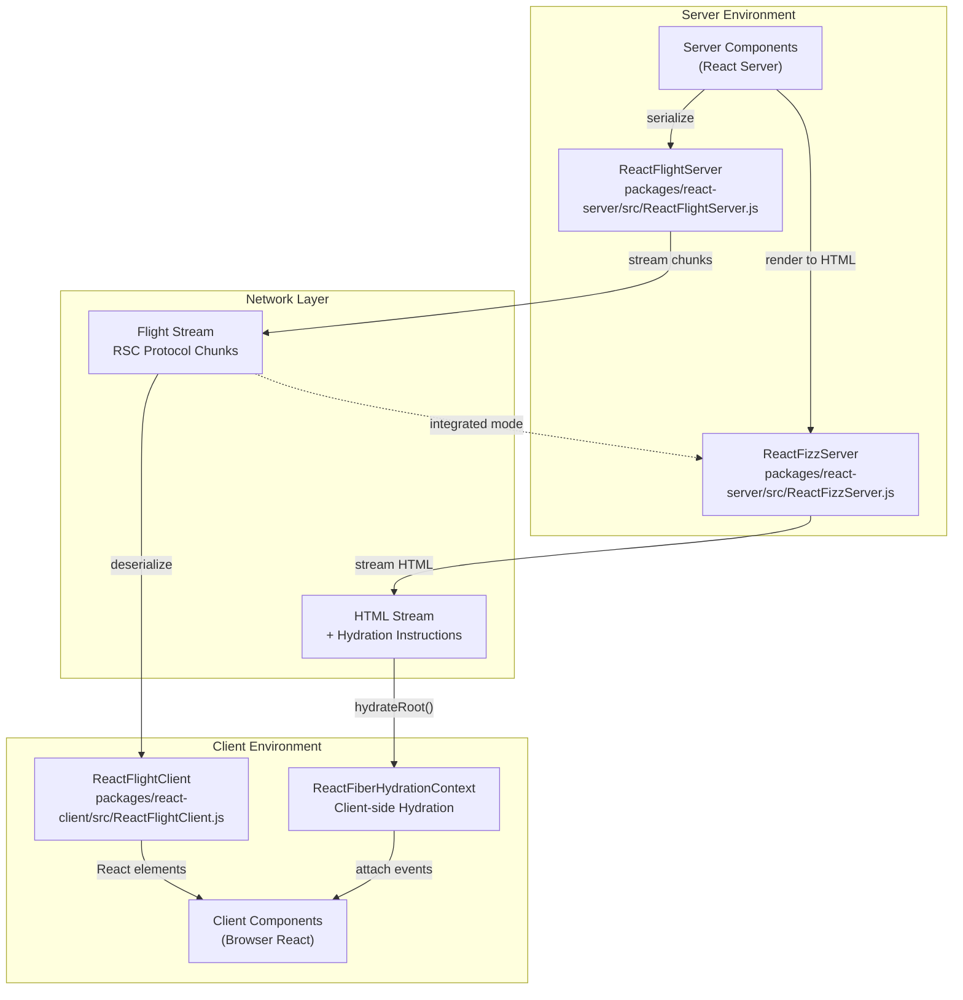
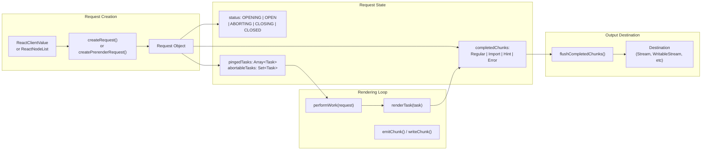
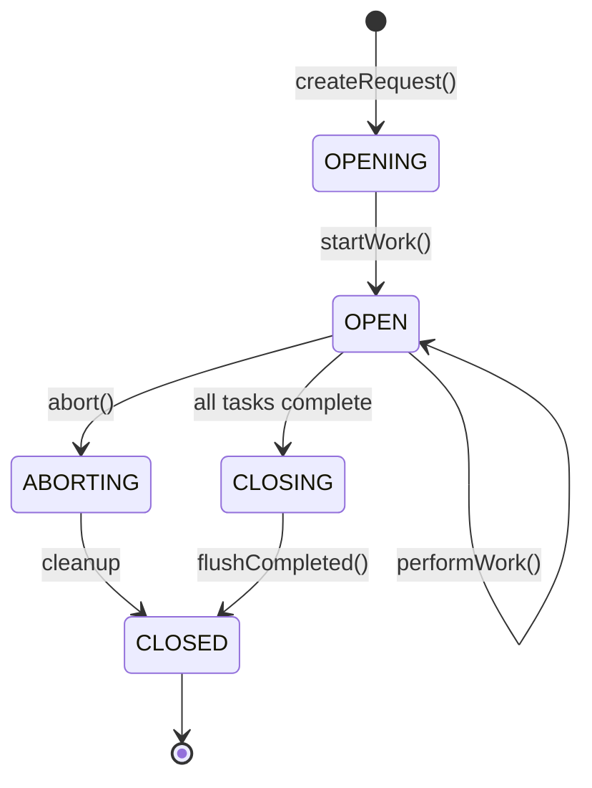
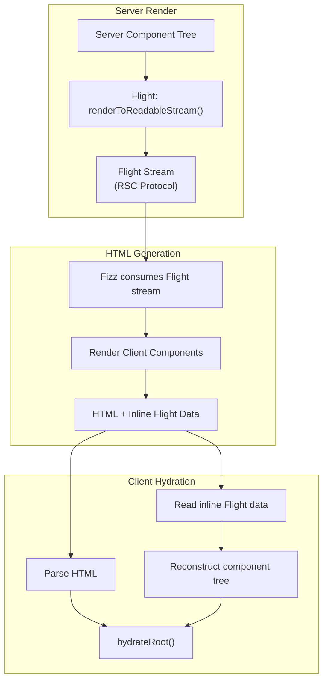

# 服务端渲染

<!-- > 来源：https://deepwiki.com/facebook/react/5-server-side-rendering -->

<details>
<summary>相关源文件</summary>

以下文件用于生成此 wiki 页面的上下文：

- [packages/react-client/src/ReactFlightClient.js](https://github.com/facebook/react/blob/main/packages/react-client/src/ReactFlightClient.js)
- [packages/react-client/src/ReactFlightReplyClient.js](https://github.com/facebook/react/blob/main/packages/react-client/src/ReactFlightReplyClient.js)
- [packages/react-client/src/ReactFlightTemporaryReferences.js](https://github.com/facebook/react/blob/main/packages/react-client/src/ReactFlightTemporaryReferences.js)
- [packages/react-client/src/__tests__/ReactFlight-test.js](https://github.com/facebook/react/blob/main/packages/react-client/src/__tests__/ReactFlight-test.js)
- [packages/react-dom-bindings/src/client/ReactDOMComponentTree.js](https://github.com/facebook/react/blob/main/packages/react-dom-bindings/src/client/ReactDOMComponentTree.js)
- [packages/react-dom-bindings/src/server/ReactFizzConfigDOM.js](https://github.com/facebook/react/blob/main/packages/react-dom-bindings/src/server/ReactFizzConfigDOM.js)
- [packages/react-dom-bindings/src/server/ReactFizzConfigDOMLegacy.js](https://github.com/facebook/react/blob/main/packages/react-dom-bindings/src/server/ReactFizzConfigDOMLegacy.js)
- [packages/react-dom-bindings/src/shared/ReactDOMResourceValidation.js](https://github.com/facebook/react/blob/main/packages/react-dom-bindings/src/shared/ReactDOMResourceValidation.js)
- [packages/react-dom/src/__tests__/ReactDOMFizzServer-test.js](https://github.com/facebook/react/blob/main/packages/react-dom/src/__tests__/ReactDOMFizzServer-test.js)
- [packages/react-dom/src/__tests__/ReactDOMFizzServerBrowser-test.js](https://github.com/facebook/react/blob/main/packages/react-dom/src/__tests__/ReactDOMFizzServerBrowser-test.js)
- [packages/react-dom/src/__tests__/ReactDOMFizzServerNode-test.js](https://github.com/facebook/react/blob/main/packages/react-dom/src/__tests__/ReactDOMFizzServerNode-test.js)
- [packages/react-dom/src/__tests__/ReactDOMFizzStatic-test.js](https://github.com/facebook/react/blob/main/packages/react-dom/src/__tests__/ReactDOMFizzStatic-test.js)
- [packages/react-dom/src/__tests__/ReactDOMFizzStaticBrowser-test.js](https://github.com/facebook/react/blob/main/packages/react-dom/src/__tests__/ReactDOMFizzStaticBrowser-test.js)
- [packages/react-dom/src/__tests__/ReactDOMFizzStaticNode-test.js](https://github.com/facebook/react/blob/main/packages/react-dom/src/__tests__/ReactDOMFizzStaticNode-test.js)
- [packages/react-dom/src/__tests__/ReactDOMFizzSuppressHydrationWarning-test.js](https://github.com/facebook/react/blob/main/packages/react-dom/src/__tests__/ReactDOMFizzSuppressHydrationWarning-test.js)
- [packages/react-dom/src/__tests__/ReactDOMFloat-test.js](https://github.com/facebook/react/blob/main/packages/react-dom/src/__tests__/ReactDOMFloat-test.js)
- [packages/react-dom/src/__tests__/ReactDOMHydrationDiff-test.js](https://github.com/facebook/react/blob/main/packages/react-dom/src/__tests__/ReactDOMHydrationDiff-test.js)
- [packages/react-dom/src/__tests__/ReactDOMServerPartialHydration-test.internal.js](https://github.com/facebook/react/blob/main/packages/react-dom/src/__tests__/ReactDOMServerPartialHydration-test.internal.js)
- [packages/react-dom/src/__tests__/ReactDOMSingletonComponents-test.js](https://github.com/facebook/react/blob/main/packages/react-dom/src/__tests__/ReactDOMSingletonComponents-test.js)
- [packages/react-dom/src/__tests__/ReactRenderDocument-test.js](https://github.com/facebook/react/blob/main/packages/react-dom/src/__tests__/ReactRenderDocument-test.js)
- [packages/react-dom/src/__tests__/ReactServerRenderingHydration-test.js](https://github.com/facebook/react/blob/main/packages/react-dom/src/__tests__/ReactServerRenderingHydration-test.js)
- [packages/react-dom/src/server/ReactDOMFizzServerBrowser.js](https://github.com/facebook/react/blob/main/packages/react-dom/src/server/ReactDOMFizzServerBrowser.js)
- [packages/react-dom/src/server/ReactDOMFizzServerBun.js](https://github.com/facebook/react/blob/main/packages/react-dom/src/server/ReactDOMFizzServerBun.js)
- [packages/react-dom/src/server/ReactDOMFizzServerEdge.js](https://github.com/facebook/react/blob/main/packages/react-dom/src/server/ReactDOMFizzServerEdge.js)
- [packages/react-dom/src/server/ReactDOMFizzServerNode.js](https://github.com/facebook/react/blob/main/packages/react-dom/src/server/ReactDOMFizzServerNode.js)
- [packages/react-dom/src/server/ReactDOMFizzStaticBrowser.js](https://github.com/facebook/react/blob/main/packages/react-dom/src/server/ReactDOMFizzStaticBrowser.js)
- [packages/react-dom/src/server/ReactDOMFizzStaticEdge.js](https://github.com/facebook/react/blob/main/packages/react-dom/src/server/ReactDOMFizzStaticEdge.js)
- [packages/react-dom/src/server/ReactDOMFizzStaticNode.js](https://github.com/facebook/react/blob/main/packages/react-dom/src/server/ReactDOMFizzStaticNode.js)
- [packages/react-markup/src/ReactFizzConfigMarkup.js](https://github.com/facebook/react/blob/main/packages/react-markup/src/ReactFizzConfigMarkup.js)
- [packages/react-noop-renderer/src/ReactNoopServer.js](https://github.com/facebook/react/blob/main/packages/react-noop-renderer/src/ReactNoopServer.js)
- [packages/react-reconciler/src/ReactFiberHydrationContext.js](https://github.com/facebook/react/blob/main/packages/react-reconciler/src/ReactFiberHydrationContext.js)
- [packages/react-server-dom-esm/src/ReactFlightESMReferences.js](https://github.com/facebook/react/blob/main/packages/react-server-dom-esm/src/ReactFlightESMReferences.js)
- [packages/react-server-dom-fb/src/__tests__/ReactDOMServerFB-test.internal.js](https://github.com/facebook/react/blob/main/packages/react-server-dom-fb/src/__tests__/ReactDOMServerFB-test.internal.js)
- [packages/react-server-dom-parcel/src/ReactFlightParcelReferences.js](https://github.com/facebook/react/blob/main/packages/react-server-dom-parcel/src/ReactFlightParcelReferences.js)
- [packages/react-server-dom-turbopack/src/ReactFlightTurbopackReferences.js](https://github.com/facebook/react/blob/main/packages/react-server-dom-turbopack/src/ReactFlightTurbopackReferences.js)
- [packages/react-server-dom-unbundled/src/ReactFlightUnbundledReferences.js](https://github.com/facebook/react/blob/main/packages/react-server-dom-unbundled/src/ReactFlightUnbundledReferences.js)
- [packages/react-server-dom-webpack/src/ReactFlightWebpackReferences.js](https://github.com/facebook/react/blob/main/packages/react-server-dom-webpack/src/ReactFlightWebpackReferences.js)
- [packages/react-server-dom-webpack/src/__tests__/ReactFlightDOM-test.js](https://github.com/facebook/react/blob/main/packages/react-server-dom-webpack/src/__tests__/ReactFlightDOM-test.js)
- [packages/react-server-dom-webpack/src/__tests__/ReactFlightDOMBrowser-test.js](https://github.com/facebook/react/blob/main/packages/react-server-dom-webpack/src/__tests__/ReactFlightDOMBrowser-test.js)
- [packages/react-server-dom-webpack/src/__tests__/ReactFlightDOMEdge-test.js](https://github.com/facebook/react/blob/main/packages/react-server-dom-webpack/src/__tests__/ReactFlightDOMEdge-test.js)
- [packages/react-server-dom-webpack/src/__tests__/ReactFlightDOMNode-test.js](https://github.com/facebook/react/blob/main/packages/react-server-dom-webpack/src/__tests__/ReactFlightDOMNode-test.js)
- [packages/react-server-dom-webpack/src/__tests__/ReactFlightDOMReply-test.js](https://github.com/facebook/react/blob/main/packages/react-server-dom-webpack/src/__tests__/ReactFlightDOMReply-test.js)
- [packages/react-server-dom-webpack/src/__tests__/ReactFlightDOMReplyEdge-test.js](https://github.com/facebook/react/blob/main/packages/react-server-dom-webpack/src/__tests__/ReactFlightDOMReplyEdge-test.js)
- [packages/react-server/src/ReactFizzServer.js](https://github.com/facebook/react/blob/main/packages/react-server/src/ReactFizzServer.js)
- [packages/react-server/src/ReactFlightReplyServer.js](https://github.com/facebook/react/blob/main/packages/react-server/src/ReactFlightReplyServer.js)
- [packages/react-server/src/ReactFlightServer.js](https://github.com/facebook/react/blob/main/packages/react-server/src/ReactFlightServer.js)
- [packages/react-server/src/ReactFlightServerTemporaryReferences.js](https://github.com/facebook/react/blob/main/packages/react-server/src/ReactFlightServerTemporaryReferences.js)
- [packages/react-server/src/forks/ReactFizzConfig.custom.js](https://github.com/facebook/react/blob/main/packages/react-server/src/forks/ReactFizzConfig.custom.js)
- [scripts/error-codes/codes.json](scripts/error-codes/codes.json)

</details>


## 目的与范围

本文档概述了 React 的服务端渲染能力，涵盖 **HTML 流式传输（Fizz）** 和 **Server Components（Flight）** 两大系统。这两个互补的系统使 React 应用能够在服务端渲染，并将结果传输到客户端进行 hydration 或消费。

关于使用 Suspense 边界进行 HTML 流式传输的详细实现，请参阅 [React Fizz (Streaming SSR)](/5.1-react-fizz-(streaming-ssr))。关于 Server Components 序列化和 RSC 协议，请参阅 [React Server Components (Flight)](/5.2-react-server-components-(flight))。关于构建系统集成，请参阅 [Build Integration for Server Components](/5.3-build-integration-for-server-components)。关于 server actions 和双向通信，请参阅 [Server Actions and Bidirectional Communication](/5.4-server-actions-and-bidirectional-communication)。

本页重点介绍高层架构、Fizz 与 Flight 之间的关系，以及两个系统共享的核心请求/响应模型。

## 两大 SSR 系统

React 提供了两个不同的服务端渲染系统，各自服务于不同目的：

| 系统 | 目的 | 输出格式 | 主要用例 |
|--------|---------|---------------|------------------|
| **Fizz** | HTML 流式 SSR | HTML + JavaScript 指令 | 传统 SSR，支持渐进式 hydration |
| **Flight** | Server Components 序列化 | 二进制/JSON 协议（RSC 传输格式） | Server Components 树传输 |

**Fizz** (`ReactFizzServer`) 将 React 组件渲染为 HTML，支持 Suspense 边界，渐进式流式输出。它生成嵌入在 `<script>` 标签中的 hydration 指令，使客户端 React 能够附加到服务端渲染的 HTML。

**Flight** (`ReactFlightServer`) 将 Server Component 树序列化为紧凑的流式协议。它处理模块引用（Client Components）并流式传输表示组件树结构的块，允许客户端在不执行 Server Component 代码的情况下重建 React 元素树。

这两个系统可以独立使用，也可以一起使用。在 React Server Components 应用中，Flight 渲染 Server Component 树，该树可能引用 Client Components。当渲染为 HTML 时，Fizz 消费 Flight 流并将 Client Components 渲染为 HTML。

来源：[packages/react-server/src/ReactFizzServer.js#L1-L100](https://github.com/facebook/react/blob/main/packages/react-server/src/ReactFizzServer.js#L1-L100), [packages/react-server/src/ReactFlightServer.js#L1-L100](https://github.com/facebook/react/blob/main/packages/react-server/src/ReactFlightServer.js#L1-L100)

## 架构概览



**图表：服务端渲染架构**

在集成的 Server Components 应用中，流程如下：

1. Server Components 在 React Server 环境中执行
2. Flight 序列化 Server Component 树，包括对 Client Components 的引用
3. Fizz 可以消费 Flight 流并将 Client Components 渲染为 HTML
4. 客户端同时接收 HTML（用于立即显示）和 Flight 块（用于交互性）
5. 客户端 React 对 HTML 进行 hydration，并处理 Flight 块以重建组件树

来源：[packages/react-server/src/ReactFlightServer.js#L1-L200](https://github.com/facebook/react/blob/main/packages/react-server/src/ReactFlightServer.js#L1-L200), [packages/react-server/src/ReactFizzServer.js#L1-L200](https://github.com/facebook/react/blob/main/packages/react-server/src/ReactFizzServer.js#L1-L200), [packages/react-client/src/ReactFlightClient.js#L1-L200](https://github.com/facebook/react/blob/main/packages/react-client/src/ReactFlightClient.js#L1-L200)

## 请求与响应模型

Fizz 和 Flight 都使用基于任务的渲染模型的请求/响应架构：



**图表：请求/响应处理模型**

### 请求类型

两个系统都定义了维护渲染状态的 `Request` 类型：

**Fizz Request** [packages/react-server/src/ReactFizzServer.js#L367-L408](https://github.com/facebook/react/blob/main/packages/react-server/src/ReactFizzServer.js#L367-L408)：
- 管理 HTML 生成和 Suspense 边界
- 跟踪段（segments）、边界（boundaries）和前导状态（preamble state）
- 协调 HTML 块的渐进式流式传输

**Flight Request** [packages/react-server/src/ReactFlightServer.js#L571-L617](https://github.com/facebook/react/blob/main/packages/react-server/src/ReactFlightServer.js#L571-L617)：
- 管理 Server Component 树的序列化
- 跟踪模块引用和序列化值
- 协调协议块的流式传输

### 请求生命周期



**图表：请求状态生命周期**

来源：[packages/react-server/src/ReactFizzServer.js#L360-L554](https://github.com/facebook/react/blob/main/packages/react-server/src/ReactFizzServer.js#L360-L554), [packages/react-server/src/ReactFlightServer.js#L527-L841](https://github.com/facebook/react/blob/main/packages/react-server/src/ReactFlightServer.js#L527-L841)

## 基于任务的渲染

两个系统都使用任务队列来管理渲染工作：

### 任务结构

**Fizz Tasks** [packages/react-server/src/ReactFizzServer.js#L279-L331](https://github.com/facebook/react/blob/main/packages/react-server/src/ReactFizzServer.js#L279-L331)：
```
RenderTask {
  node: ReactNodeList          // Content to render
  blockedSegment: Segment      // Output target
  blockedBoundary: Root | SuspenseBoundary
  keyPath: Root | KeyNode      // For tracking postponed content
  formatContext: FormatContext // HTML/SVG/MathML context
  thenableState: ThenableState // Suspense tracking
}

ReplayTask {
  replay: ReplaySet           // Resume from postponed state
  node: ReactNodeList
  blockedBoundary: Root | SuspenseBoundary
  // Similar fields for context
}
```

**Flight Tasks** [packages/react-server/src/ReactFlightServer.js#L533-L549](https://github.com/facebook/react/blob/main/packages/react-server/src/ReactFlightServer.js#L533-L549)：
```
Task {
  id: number
  status: PENDING | COMPLETED | ABORTED | ERRORED | RENDERING
  model: ReactClientValue      // Value to serialize
  ping: () => void            // Resume after suspending
  keyPath: ReactKey           // Parent component keys
  formatContext: FormatContext
  thenableState: ThenableState
}
```

### 工作循环

两个系统以相似的模式处理任务：

1. **出队**：从 `request.pingedTasks` 弹出任务
2. **渲染**：执行任务渲染逻辑（`renderTask`）
3. **暂停**：遇到 Suspense 时，创建新任务并等待 Promise
4. **完成**：任务完成时发出块/段
5. **刷新**：将完成的输出写入目标

来源：[packages/react-server/src/ReactFizzServer.js#L791-L802](https://github.com/facebook/react/blob/main/packages/react-server/src/ReactFizzServer.js#L791-L802), [packages/react-server/src/ReactFlightServer.js#L2420-L2500](https://github.com/facebook/react/blob/main/packages/react-server/src/ReactFlightServer.js#L2420-L2500)

## 流式输出格式

### Fizz HTML 格式

Fizz 输出带有嵌入式 JavaScript 指令的 HTML：

```
<!DOCTYPE html><html><head>...</head><body>
<div>Server-rendered content</div>
<!--$?--><template id="B:0"></template>
<div>Fallback for suspended content...</div>
<!--/$-->

<script>
$RC=function(b,c,e){/* completeBoundary runtime */};
</script>
<script>
$RC("B:0","S:1")
</script>
```

指令包括：
- `$RC`：完成边界（显示暂停内容）
- `$RX`：客户端渲染边界（错误回退）
- `$RS`：完成段
- 用于渐进式增强的表单状态标记

来源：[packages/react-dom-bindings/src/server/ReactFizzConfigDOM.js#L1-L300](https://github.com/facebook/react/blob/main/packages/react-dom-bindings/src/server/ReactFizzConfigDOM.js#L1-L300)

### Flight 协议格式

Flight 输出带有类型化协议的换行分隔块：

```
0:{"id":"./ClientComponent.js#","chunks":["client123"],"name":"default"}
1:I["module1","ClientComponent",123]
2:{"type":"div","props":{"children":"Hello"}}
3:@2
```

块类型：
- **Model 行** (`id:json`)：JSON 编码的值
- **Module 行** (`id:I[...]`)：客户端模块引用
- **Error 行** (`id:E{...}`)：序列化错误
- **Reference** (`@id`)：指向另一个块的指针
- **Promise 行** (`id:@...`)：异步值占位符
- **Debug 信息** (`id:D{...}`)：仅开发环境的元数据

来源：[packages/react-server/src/ReactFlightServer.js#L2700-L3200](https://github.com/facebook/react/blob/main/packages/react-server/src/ReactFlightServer.js#L2700-L3200), [packages/react-client/src/ReactFlightClient.js#L149-L164](https://github.com/facebook/react/blob/main/packages/react-client/src/ReactFlightClient.js#L149-L164)

## 请求创建 API

### Fizz API

| 函数 | 目的 | 环境 |
|----------|---------|-------------|
| `renderToPipeableStream()` | Node.js streams | server.node |
| `renderToReadableStream()` | Web Streams API | server.browser, server.edge |
| `renderToStaticMarkup()` | 非交互式 HTML | server.* |
| `renderToString()` | 同步渲染 | server.* |

**预渲染：**
- `createPrerenderRequest()` [packages/react-server/src/ReactFizzServer.js#L623-L655](https://github.com/facebook/react/blob/main/packages/react-server/src/ReactFizzServer.js#L623-L655)：创建跟踪推迟空洞（postponed holes）以便恢复的请求
- `resumeRequest()` [packages/react-server/src/ReactFizzServer.js#L657-L749](https://github.com/facebook/react/blob/main/packages/react-server/src/ReactFizzServer.js#L657-L749)：从 `PostponedState` 恢复

来源：[packages/react-dom/src/server/ReactDOMFizzServerNode.js#L1-L300](https://github.com/facebook/react/blob/main/packages/react-dom/src/server/ReactDOMFizzServerNode.js#L1-L300), [packages/react-dom/src/server/ReactDOMFizzServerBrowser.js#L1-L200](https://github.com/facebook/react/blob/main/packages/react-dom/src/server/ReactDOMFizzServerBrowser.js#L1-L200)

### Flight API

| 函数 | 目的 | 环境 |
|----------|---------|-------------|
| `renderToReadableStream()` | 渲染到 Web Stream | server.browser, server.edge, server.node |
| `decodeReply()` | 解码表单数据/请求体 | server.* |
| `decodeAction()` | 解码 server action 引用 | server.* |

**预渲染：**
- `createPrerenderRequest()` [packages/react-server/src/ReactFlightServer.js#L811-L841](https://github.com/facebook/react/blob/main/packages/react-server/src/ReactFlightServer.js#L811-L841)：创建带有 `onAllReady` 和 `onFatalError` 回调的请求
- 预渲染可以恢复或转换为静态输出

来源：[packages/react-server/src/ReactFlightServer.js#L781-L841](https://github.com/facebook/react/blob/main/packages/react-server/src/ReactFlightServer.js#L781-L841)

## 集成点

### Fizz + Flight 集成

当将 Server Components 渲染为 HTML 时：



**图表：集成 Server Components 的 SSR**

Flight 流可以：
1. **嵌入**：序列化到 HTML 的 `<script>` 标签中，供立即消费
2. **分离**：作为并行流发送，用于渐进式增强
3. **预加载**：在构建期间生成并嵌入到 HTML 中

来源：[packages/react-server/src/ReactFizzServer.js#L1-L100](https://github.com/facebook/react/blob/main/packages/react-server/src/ReactFizzServer.js#L1-L100), [packages/react-server/src/ReactFlightServer.js#L1-L100](https://github.com/facebook/react/blob/main/packages/react-server/src/ReactFlightServer.js#L1-L100)

### 宿主配置

两个系统都使用宿主配置进行平台适配：

**Fizz Host Config** [packages/react-dom-bindings/src/server/ReactFizzConfigDOM.js](https://github.com/facebook/react/blob/main/packages/react-dom-bindings/src/server/ReactFizzConfigDOM.js)：
- HTML 生成（`pushStartInstance`、`pushEndInstance`）
- 资源管理（scripts、stylesheets、preloads）
- 流式格式（内联脚本 vs 外部运行时）

**Flight Host Config** [packages/react-server/src/ReactFlightServerConfig.js](https://github.com/facebook/react/blob/main/packages/react-server/src/ReactFlightServerConfig.js)：
- 模块引用解析（`resolveClientReferenceMetadata`）
- 打包器集成（`getClientReferenceKey`）
- 请求存储（`supportsRequestStorage`、`requestStorage`）

## 错误处理与 Suspense

两个系统以相似的方式处理错误和 Suspense：

### Suspense 边界

**Fizz** [packages/react-server/src/ReactFizzServer.js#L804-L849](https://github.com/facebook/react/blob/main/packages/react-server/src/ReactFizzServer.js#L804-L849)：
- 创建带有回退内容的 `SuspenseBoundary`
- 跟踪边界内的待处理任务
- 立即流式传输回退，内容就绪时传输
- 发出完成指令以显示内容

**Flight** [packages/react-server/src/ReactFlightServer.js#L1034-L1136](https://github.com/facebook/react/blob/main/packages/react-server/src/ReactFlightServer.js#L1034-L1136)：
- 将 Thenable 序列化为 Promise 引用
- 为已解析的值创建任务
- 客户端重建异步边界

### 错误恢复

两个系统都：
1. 在渲染期间捕获错误
2. 使用错误信息调用 `onError` 回调
3. 发出错误块/边界
4. 允许客户端错误边界处理

来源：[packages/react-server/src/ReactFizzServer.js#L2100-L2300](https://github.com/facebook/react/blob/main/packages/react-server/src/ReactFizzServer.js#L2100-L2300), [packages/react-server/src/ReactFlightServer.js#L2600-L2800](https://github.com/facebook/react/blob/main/packages/react-server/src/ReactFlightServer.js#L2600-L2800)

## 性能考量

### 渐进式流式传输

**Fizz** 渐进式刷新：
- Shell（初始内容）尽快刷新
- Suspense 边界在解析时刷新
- 资源（scripts、styles）具有适当的优先级

**Flight** 流式传输：
- 组件完成时的块
- 懒加载模块引用
- 异步边界增量传输

### 分块策略

**Fizz** 使用 `progressiveChunkSize` [packages/react-server/src/ReactFizzServer.js:437](https://github.com/facebook/react/blob/main/packages/react-server/src/ReactFizzServer.js:437)：
- 默认值：12,800 字节（3G 网络约 500ms）
- 控制何时刷新缓冲的 HTML

**Flight** 积极流式传输：
- 任务完成时立即发出块
- 无可配置缓冲（流已经缓冲）

来源：[packages/react-server/src/ReactFizzServer.js#L422-L472](https://github.com/facebook/react/blob/main/packages/react-server/src/ReactFizzServer.js#L422-L472), [packages/react-server/src/ReactFlightServer.js#L2420-L2500](https://github.com/facebook/react/blob/main/packages/react-server/src/ReactFlightServer.js#L2420-L2500)

## 特性标志

影响 SSR 的关键特性标志：

| 标志 | 影响 |
|------|--------|
| `enableHalt` | 允许预渲染在动态内容上暂停 |
| `enablePostpone` | 启用 postpone() API 用于增量渲染 |
| `enableFizzExternalRuntime` | 使用外部运行时脚本 vs 内联 |
| `enableAsyncDebugInfo` | 在开发环境中包含异步堆栈跟踪 |
| `enableComponentPerformanceTrack` | 跟踪组件渲染时序 |

来源：[packages/shared/ReactFeatureFlags.js](https://github.com/facebook/react/blob/main/packages/shared/ReactFeatureFlags.js), [packages/react-server/src/ReactFizzServer.js#L177-L187](https://github.com/facebook/react/blob/main/packages/react-server/src/ReactFizzServer.js#L177-L187), [packages/react-server/src/ReactFlightServer.js#L14-L20](https://github.com/facebook/react/blob/main/packages/react-server/src/ReactFlightServer.js#L14-L20)

## 总结

React 的服务端渲染包含两个互补的系统：

- **Fizz** 处理带有 Suspense 的 HTML 流式传输、渐进式 hydration 和资源管理
- **Flight** 序列化 Server Component 树，以便客户端高效消费

两者共享基于任务的渲染模型，具有渐进式流式传输、Suspense 支持和错误恢复能力。它们可以独立运行，也可以在集成模式下运行，其中 Flight 输出由 Fizz 消费，以生成带有嵌入式 RSC 数据的 HTML。

关于实现细节，请参阅子页面：[React Fizz (Streaming SSR)](/5.1-react-fizz-(streaming-ssr)) 了解 HTML 生成，[React Server Components (Flight)](/5.2-react-server-components-(flight)) 了解 RSC 协议，[Build Integration for Server Components](/5.3-build-integration-for-server-components) 了解打包器集成，以及 [Server Actions and Bidirectional Communication](/5.4-server-actions-and-bidirectional-communication) 了解客户端到服务端的 RPC。
