# React Fizz (流式 SSR)

<!-- > 来源：https://deepwiki.com/facebook/react/5.1-react-fizz-(streaming-ssr) -->

<details>
<summary>相关源文件</summary>

以下文件用于生成此 wiki 页面的上下文：

- [packages/react-dom-bindings/src/client/ReactDOMComponentTree.js](packages/react-dom-bindings/src/client/ReactDOMComponentTree.js)
- [packages/react-dom-bindings/src/server/ReactFizzConfigDOM.js](packages/react-dom-bindings/src/server/ReactFizzConfigDOM.js)
- [packages/react-dom-bindings/src/server/ReactFizzConfigDOMLegacy.js](packages/react-dom-bindings/src/server/ReactFizzConfigDOMLegacy.js)
- [packages/react-dom-bindings/src/shared/ReactDOMResourceValidation.js](packages/react-dom-bindings/src/shared/ReactDOMResourceValidation.js)
- [packages/react-dom/src/__tests__/ReactDOMFizzServer-test.js](packages/react-dom/src/__tests__/ReactDOMFizzServer-test.js)
- [packages/react-dom/src/__tests__/ReactDOMFizzServerBrowser-test.js](packages/react-dom/src/__tests__/ReactDOMFizzServerBrowser-test.js)
- [packages/react-dom/src/__tests__/ReactDOMFizzServerNode-test.js](packages/react-dom/src/__tests__/ReactDOMFizzServerNode-test.js)
- [packages/react-dom/src/__tests__/ReactDOMFizzStatic-test.js](packages/react-dom/src/__tests__/ReactDOMFizzStatic-test.js)
- [packages/react-dom/src/__tests__/ReactDOMFizzStaticBrowser-test.js](packages/react-dom/src/__tests__/ReactDOMFizzStaticBrowser-test.js)
- [packages/react-dom/src/__tests__/ReactDOMFizzStaticNode-test.js](packages/react-dom/src/__tests__/ReactDOMFizzStaticNode-test.js)
- [packages/react-dom/src/__tests__/ReactDOMFizzSuppressHydrationWarning-test.js](packages/react-dom/src/__tests__/ReactDOMFizzSuppressHydrationWarning-test.js)
- [packages/react-dom/src/__tests__/ReactDOMFloat-test.js](packages/react-dom/src/__tests__/ReactDOMFloat-test.js)
- [packages/react-dom/src/__tests__/ReactDOMHydrationDiff-test.js](packages/react-dom/src/__tests__/ReactDOMHydrationDiff-test.js)
- [packages/react-dom/src/__tests__/ReactDOMServerPartialHydration-test.internal.js](packages/react-dom/src/__tests__/ReactDOMServerPartialHydration-test.internal.js)
- [packages/react-dom/src/__tests__/ReactDOMSingletonComponents-test.js](packages/react-dom/src/__tests__/ReactDOMSingletonComponents-test.js)
- [packages/react-dom/src/__tests__/ReactRenderDocument-test.js](packages/react-dom/src/__tests__/ReactRenderDocument-test.js)
- [packages/react-dom/src/__tests__/ReactServerRenderingHydration-test.js](packages/react-dom/src/__tests__/ReactServerRenderingHydration-test.js)
- [packages/react-dom/src/server/ReactDOMFizzServerBrowser.js](packages/react-dom/src/server/ReactDOMFizzServerBrowser.js)
- [packages/react-dom/src/server/ReactDOMFizzServerBun.js](packages/react-dom/src/server/ReactDOMFizzServerBun.js)
- [packages/react-dom/src/server/ReactDOMFizzServerEdge.js](packages/react-dom/src/server/ReactDOMFizzServerEdge.js)
- [packages/react-dom/src/server/ReactDOMFizzServerNode.js](packages/react-dom/src/server/ReactDOMFizzServerNode.js)
- [packages/react-dom/src/server/ReactDOMFizzStaticBrowser.js](packages/react-dom/src/server/ReactDOMFizzStaticBrowser.js)
- [packages/react-dom/src/server/ReactDOMFizzStaticEdge.js](packages/react-dom/src/server/ReactDOMFizzStaticEdge.js)
- [packages/react-dom/src/server/ReactDOMFizzStaticNode.js](packages/react-dom/src/server/ReactDOMFizzStaticNode.js)
- [packages/react-markup/src/ReactFizzConfigMarkup.js](packages/react-markup/src/ReactFizzConfigMarkup.js)
- [packages/react-noop-renderer/src/ReactNoopServer.js](packages/react-noop-renderer/src/ReactNoopServer.js)
- [packages/react-reconciler/src/ReactFiberHydrationContext.js](packages/react-reconciler/src/ReactFiberHydrationContext.js)
- [packages/react-server-dom-fb/src/__tests__/ReactDOMServerFB-test.internal.js](packages/react-server-dom-fb/src/__tests__/ReactDOMServerFB-test.internal.js)
- [packages/react-server/src/ReactFizzServer.js](packages/react-server/src/ReactFizzServer.js)
- [packages/react-server/src/forks/ReactFizzConfig.custom.js](packages/react-server/src/forks/ReactFizzConfig.custom.js)

</details>


## 目的与范围

React Fizz 是流式服务端渲染（SSR）系统，可渐进式生成 HTML，在内容就绪时立即发送给客户端。本文档涵盖 Fizz 渲染引擎的核心、请求/任务/段（request/task/segment）模型、资源管理，以及针对 Node.js、Web streams 和静态生成等不同平台的实现。

关于 React Server Components（RSC）和 Flight 协议的信息，请参阅 [React Server Components (Flight)](#5.2)。关于客户端 hydration，请参阅 [Hydration System](#6.3)。

## 高层架构

React Fizz 作为流式 HTML 渲染器运行，处理 React 元素并增量输出 HTML 块。系统核心与平台无关，通过平台特定的适配器支持不同的流式传输目标。

**Fizz 架构概览**

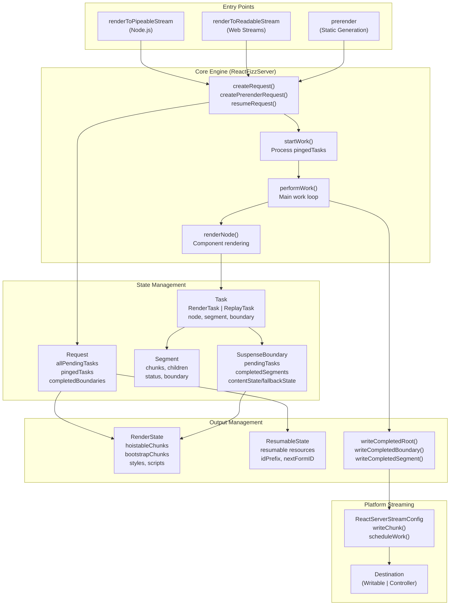

来源：[packages/react-server/src/ReactFizzServer.js:1-4000](), [packages/react-dom-bindings/src/server/ReactFizzConfigDOM.js:1-500](), [packages/react-dom/src/server/ReactDOMFizzServerNode.js:1-300]()

## 核心数据结构

### Request

`Request` 是顶层渲染上下文，跟踪整个 SSR 操作。

**Request 结构**

| 字段 | 类型 | 用途 |
|-------|------|---------|
| `destination` | `Destination \| null` | 输出流目标 |
| `resumableState` | `ResumableState` | 用于恢复的可序列化状态 |
| `renderState` | `RenderState` | 每个请求的工作状态 |
| `allPendingTasks` | `number` | 待完成的任务总数 |
| `pendingRootTasks` | `number` | 阻塞 shell 完成的任务 |
| `pingedTasks` | `Array<Task>` | 准备执行的高优先级任务 |
| `completedBoundaries` | `Array<SuspenseBoundary>` | 准备 flush 的 boundary |
| `clientRenderedBoundaries` | `Array<SuspenseBoundary>` | 出错的 boundary |
| `partialBoundaries` | `Array<SuspenseBoundary>` | 包含部分内容的 boundary |
| `abortableTasks` | `Set<Task>` | 可中止的任务 |
| `trackedPostpones` | `PostponedHoles \| null` | 用于预渲染恢复 |

来源：[packages/react-server/src/ReactFizzServer.js:359-400]()

### Task 类型

Task 表示渲染管道中的工作单元。有两种类型：

**RenderTask vs ReplayTask**

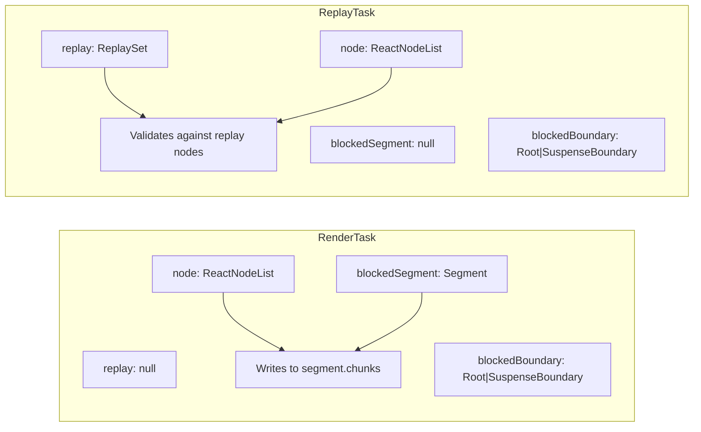

来源：[packages/react-server/src/ReactFizzServer.js:272-324]()

### Segment

`Segment` 表示一块 HTML 输出及其渲染状态。

**Segment 生命周期**

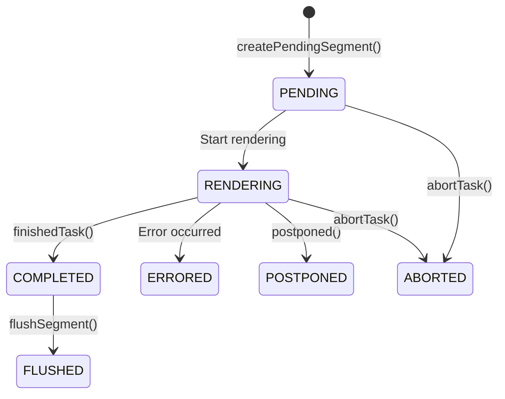

| 状态 | 值 | 描述 |
|--------|-------|-------------|
| `PENDING` | 0 | 等待渲染 |
| `COMPLETED` | 1 | 渲染成功 |
| `FLUSHED` | 2 | 已写入 destination |
| `ABORTED` | 3 | 渲染已取消 |
| `ERRORED` | 4 | 渲染过程中出错 |
| `POSTPONED` | 5 | 推迟到稍后 |
| `RENDERING` | 6 | 正在渲染 |

来源：[packages/react-server/src/ReactFizzServer.js:326-351]()

### SuspenseBoundary

`SuspenseBoundary` 管理 Suspense boundary，跟踪待处理工作并管理 fallback 渲染。

**SuspenseBoundary 字段**

| 字段 | 类型 | 用途 |
|-------|------|---------|
| `status` | `0 \| 1 \| 4 \| 5` | PENDING, COMPLETED, CLIENT_RENDERED, POSTPONED |
| `rootSegmentID` | `number` | boundary 根 segment 的 ID |
| `pendingTasks` | `number` | 阻塞完成的任务数 |
| `completedSegments` | `Array<Segment>` | 就绪但未 flush 的 segment |
| `byteSize` | `number` | 用于内联决策的总大小 |
| `defer` | `boolean` | 永不内联延迟的 boundary |
| `contentState` | `HoistableState` | 内容的资源 |
| `fallbackState` | `HoistableState` | fallback 的资源 |
| `fallbackAbortableTasks` | `Set<Task>` | 如果内容完成则取消 |
| `errorDigest` | `?string` | 出错时的错误哈希 |

来源：[packages/react-server/src/ReactFizzServer.js:248-270]()

## 渲染管道

渲染管道从请求创建开始，经过任务处理，最终输出 HTML。

**完整渲染流程**

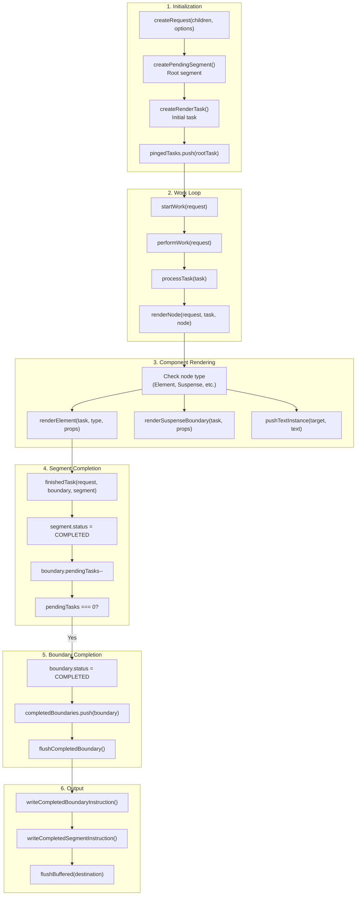

来源：[packages/react-server/src/ReactFizzServer.js:548-800](), [packages/react-server/src/ReactFizzServer.js:1600-2000]()

## 任务调度与执行

### 任务创建

任务在开始渲染时创建，或在 Suspense boundary 需要渲染其内容或 fallback 时创建。

**任务创建函数**

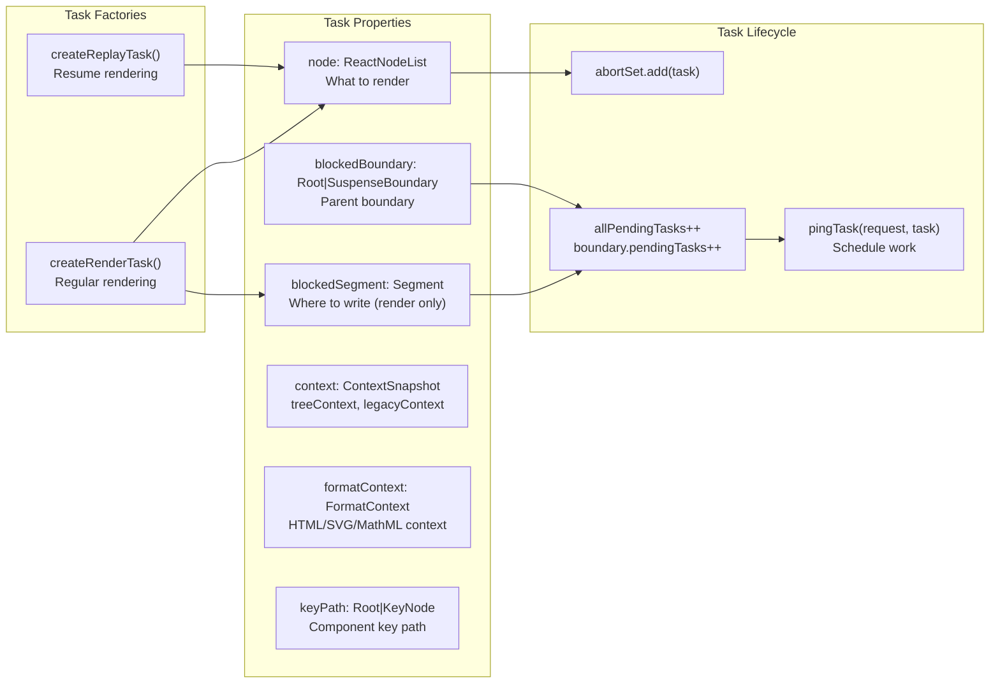

来源：[packages/react-server/src/ReactFizzServer.js:843-953]()

### performWork 循环

`performWork` 函数是主工作循环，处理任务并 flush 输出。

**performWork 执行**

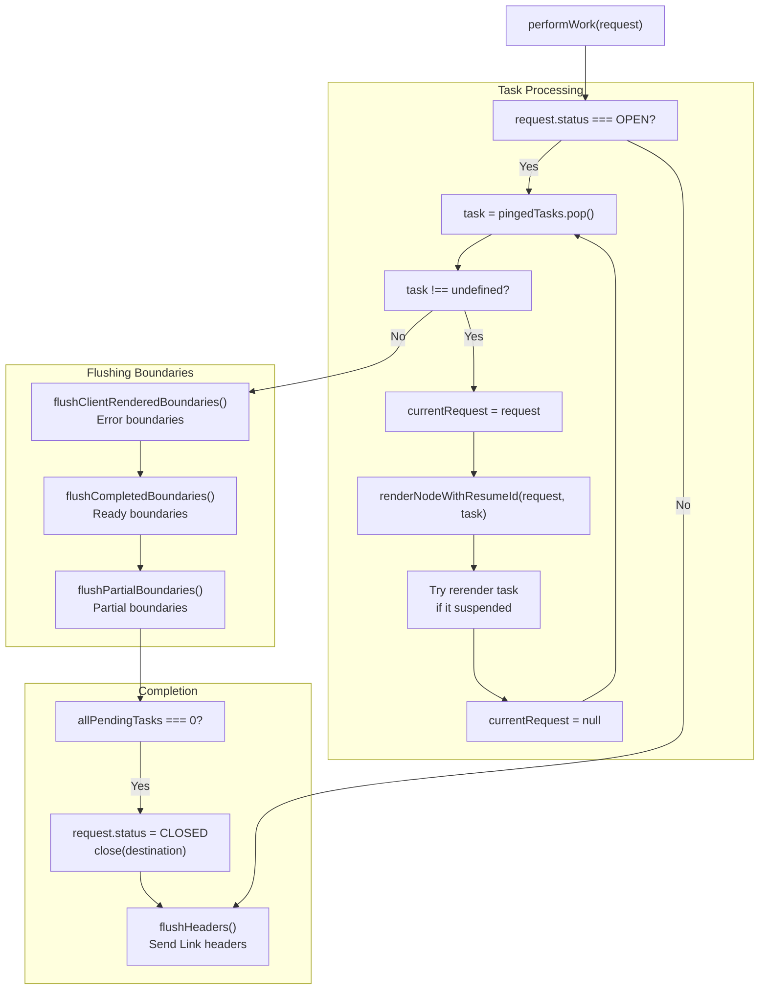

来源：[packages/react-server/src/ReactFizzServer.js:2800-3000]()

### renderNode 分发

`renderNode` 函数根据节点类型分发到专门的渲染逻辑。

**节点类型分发**

| 节点类型 | Symbol | 渲染函数 |
|-----------|--------|-------------------|
| React Element | `REACT_ELEMENT_TYPE` | `renderElement(request, task, type, props, ref)` |
| Lazy Component | `REACT_LAZY_TYPE` | `renderLazyComponent(request, task, lazyComponent)` |
| Suspense | `REACT_SUSPENSE_TYPE` | `renderSuspenseBoundary(request, task, props)` |
| SuspenseList | `REACT_SUSPENSE_LIST_TYPE` | `renderSuspenseList(request, task, props)` |
| Fragment | `REACT_FRAGMENT_TYPE` | `renderNodeFragment(request, task, children)` |
| Provider | `REACT_CONTEXT_TYPE` | `pushProvider(context, value)` |
| Forward Ref | `REACT_FORWARD_REF_TYPE` | `renderForwardRef(request, task, render, props, ref)` |
| Memo | `REACT_MEMO_TYPE` | `renderMemo(request, task, type, props)` |
| Portal | `REACT_PORTAL_TYPE` | Error - not supported |
| String/Number | primitive | `pushTextInstance(segment, text)` |
| Array | `isArray(node)` | `renderChildrenArray(request, task, children)` |
| Async Iterable | `node[ASYNC_ITERATOR]` | `renderAsyncIterable(request, task, iterable)` |

来源：[packages/react-server/src/ReactFizzServer.js:1800-2400]()

## Suspense Boundary 管理

Suspense boundary 通过允许树的一部分 suspend，而其他部分完成，从而实现流式传输和渐进式渲染。

**Suspense Boundary 渲染流程**

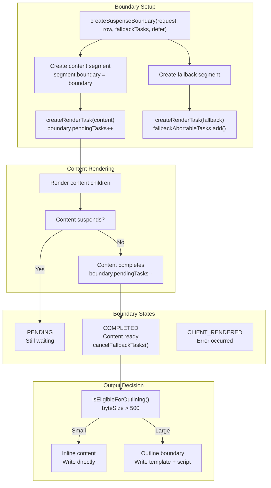

来源：[packages/react-server/src/ReactFizzServer.js:796-841](), [packages/react-server/src/ReactFizzServer.js:2500-2700]()

### Boundary 完成与 Flush

当 boundary 完成时，它会在被 flush 到输出之前经过队列。

**Boundary Flush 流程**

```mermaid
graph LR
    subgraph "Completion"
        DecPending["boundary.pendingTasks--"]
        CheckZero["pendingTasks === 0?"]
        SetCompleted["boundary.status = COMPLETED"]
    end
    
    subgraph "Queueing"
        QueueCompleted["completedBoundaries.push(boundary)"]
        CheckShell["Shell completed?"]
        QueuePartial["partialBoundaries.push(boundary)"]
    end
    
    subgraph "Flushing"
        FlushCompleted["flushCompletedBoundary(request, destination, boundary)"]
        WriteStart["writeStartCompletedSuspenseBoundary()"]
        WriteSegments["Write all completedSegments"]
        WriteEnd["writeEndCompletedSuspenseBoundary()"]
        WriteInstruction["writeCompletedBoundaryInstruction(boundaryID, contentSegmentID)"]
    end
    
    DecPending --> CheckZero
    CheckZero -->|Yes| SetCompleted
    SetCompleted --> CheckShell
    CheckShell -->|Complete| QueueCompleted
    CheckShell -->|Not complete| QueuePartial
    
    QueueCompleted --> FlushCompleted
    FlushCompleted --> WriteStart
    WriteStart --> WriteSegments
    WriteSegments --> WriteEnd
    WriteEnd --> WriteInstruction
```

来源：[packages/react-server/src/ReactFizzServer.js:3200-3500]()

## 资源管理

React Fizz 通过 `RenderState` 和 `ResumableState` 结构管理资源（scripts、stylesheets、preloads），以优化加载并防止重复。

**资源状态架构**

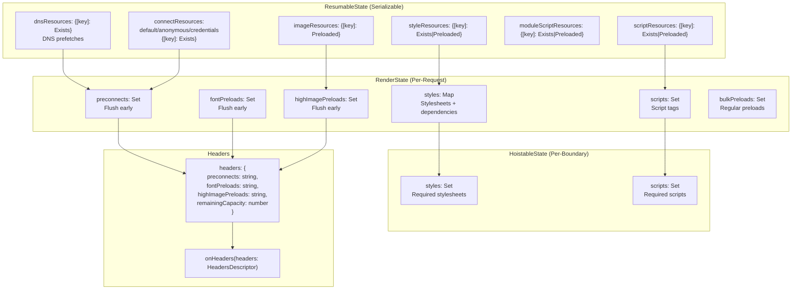

来源：[packages/react-dom-bindings/src/server/ReactFizzConfigDOM.js:260-310](), [packages/react-dom-bindings/src/server/ReactFizzConfigDOM.js:148-234]()

### 资源去重

资源在 `ResumableState` 中跟踪，以防止跨 boundary 和恢复场景的重复输出。

**资源跟踪类型**

| 类型 | 跟踪依据 | 值 |
|------|-----------|--------|
| DNS Prefetch | `href` | `EXISTS` (null) |
| Preconnect | `href` + `crossOrigin` | `EXISTS` (null) |
| Stylesheet | `href` | `EXISTS` \| `[crossOrigin, integrity]` |
| Script | `src` | `EXISTS` \| `[crossOrigin, integrity]` |
| Module | `src` | `EXISTS` \| `[crossOrigin, integrity]` |
| Image Preload | `href` + `imageSrcSet` + `imageSizes` | `[]` (empty array) |
| Font Preload | `href` | `[]` (empty array) |

来源：[packages/react-dom-bindings/src/server/ReactFizzConfigDOM.js:236-258]()

### 资源 Flush 顺序

资源按特定顺序 flush，以优化页面加载性能。

**资源 Flush 序列**

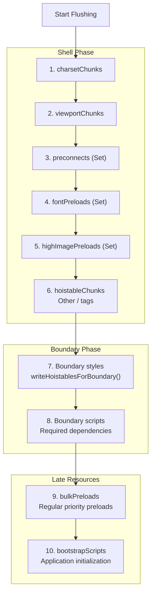

来源：[packages/react-dom-bindings/src/server/ReactFizzConfigDOM.js:3800-4200]()

## 平台特定实现

React Fizz 为不同的 JavaScript 环境提供多个入口点，每个入口点将核心引擎适配到平台特定的流式 API。

**平台入口点**

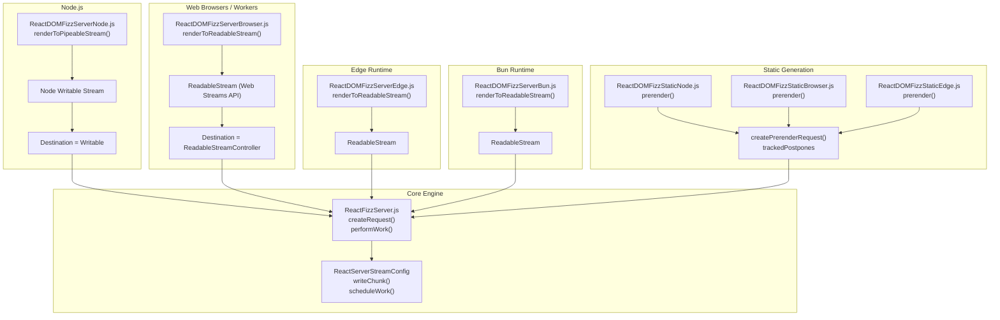

来源：[packages/react-dom/src/server/ReactDOMFizzServerNode.js:1-300](), [packages/react-dom/src/server/ReactDOMFizzServerBrowser.js:1-200](), [packages/react-dom/src/server/ReactDOMFizzStaticBrowser.js:1-200]()

### Node.js: renderToPipeableStream

Node.js 实现使用 Node 的 `Writable` 流接口，支持背压。

**Node.js 流式流程**

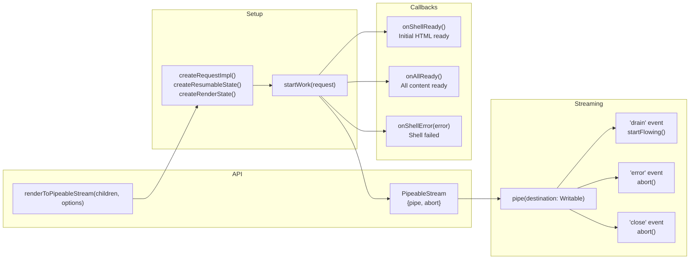

来源：[packages/react-dom/src/server/ReactDOMFizzServerNode.js:131-166]()

### Browser/Edge: renderToReadableStream

浏览器实现使用 Web Streams API 的 `ReadableStream`，带有字节源。

**Web Streams 流程**

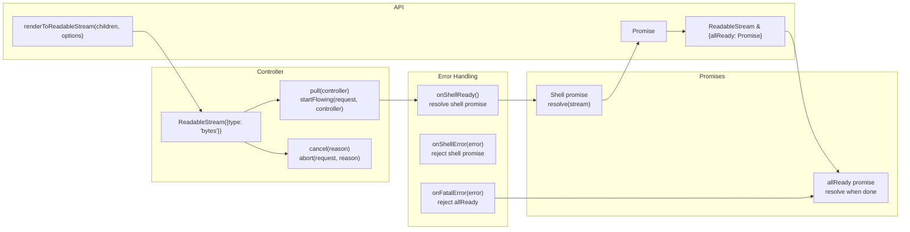

来源：[packages/react-dom/src/server/ReactDOMFizzServerBrowser.js:75-165]()

## 预渲染与可恢复性

预渲染生成静态 HTML，同时跟踪推迟的 boundary 以便稍后恢复。

**预渲染架构**

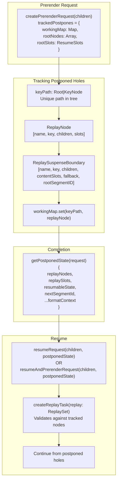

来源：[packages/react-server/src/ReactFizzServer.js:615-770]()

### PostponedState 结构

`PostponedState` 捕获从推迟的 boundary 恢复渲染所需的一切。

**PostponedState 字段**

| 字段 | 类型 | 用途 |
|-------|------|---------|
| `replayNodes` | `Array<ReplayNode>` | 跟踪的组件 key 树 |
| `replaySlots` | `ResumeSlots` | 要恢复的 segment ID |
| `resumableState` | `ResumableState` | 要继续的资源状态 |
| `nextSegmentId` | `number` | 下一个可用的 segment ID |
| `rootFormatContext` | `FormatContext` | HTML/SVG/MathML 上下文 |
| `progressiveChunkSize` | `number` | chunk 大小设置 |

来源：[packages/react-server/src/ReactFizzServer.js:3900-4000]()

### ReplayTask 验证

恢复时，`ReplayTask` 实例验证组件树是否与跟踪的结构匹配。

**Replay 验证流程**

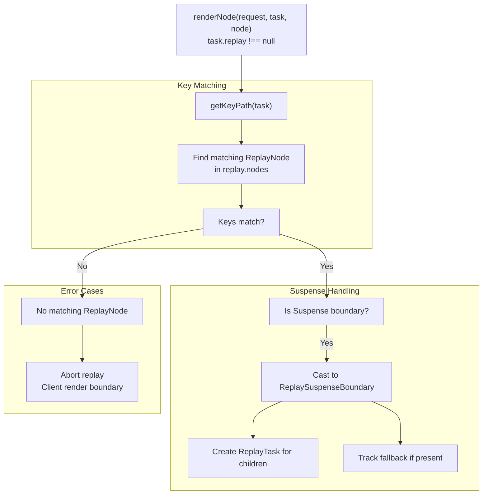

来源：[packages/react-server/src/ReactFizzServer.js:1900-2100]()

## 流式格式与指令

React Fizz 可以两种格式输出 HTML：内联脚本或带有外部运行时的数据属性。

**流式格式**

| 格式 | 值 | 配置 | 用例 |
|--------|-------|---------------|----------|
| `ScriptStreamingFormat` | 0 | 默认 | 在 `<script>` 标签中内联指令 |
| `DataStreamingFormat` | 1 | `unstable_externalRuntimeSrc` | 通过数据属性的指令，单独的运行时 |

来源：[packages/react-dom-bindings/src/server/ReactFizzConfigDOM.js:122-124]()

### 指令状态位

`InstructionState` 跟踪已发送的指令，以避免重复。

**InstructionState 标志**

| 标志 | 位 | 用途 |
|------|-----|---------|
| `SentCompleteSegmentFunction` | 0b000000001 | 已发送 `completeSegment` 函数 |
| `SentCompleteBoundaryFunction` | 0b000000010 | 已发送 `completeBoundary` 函数 |
| `SentClientRenderFunction` | 0b000000100 | 已发送 `clientRenderBoundary` 函数 |
| `SentStyleInsertionFunction` | 0b000001000 | 已发送 `completeBoundaryWithStyles` |
| `SentFormReplayingRuntime` | 0b000010000 | 已发送表单重放运行时 |
| `SentCompletedShellId` | 0b000100000 | 已发送 shell 完成标记 |
| `SentMarkShellTime` | 0b001000000 | 已发送 shell 时序标记 |
| `NeedUpgradeToViewTransitions` | 0b010000000 | 需要视图转换 |
| `SentUpgradeToViewTransitions` | 0b100000000 | 已发送视图转换升级 |

来源：[packages/react-dom-bindings/src/server/ReactFizzConfigDOM.js:127-136]()

### Boundary 完成指令

当 boundary 完成时，内联脚本或数据属性会指示客户端显示内容。

**Boundary 指令输出**

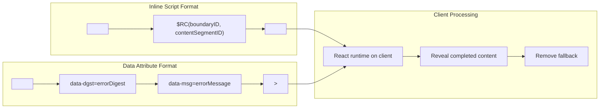

来源：[packages/react-dom-bindings/src/server/ReactFizzConfigDOM.js:4500-4700]()

## 错误处理与恢复

React Fizz 在不同级别处理错误，采用不同的恢复策略。

**错误处理层次结构**

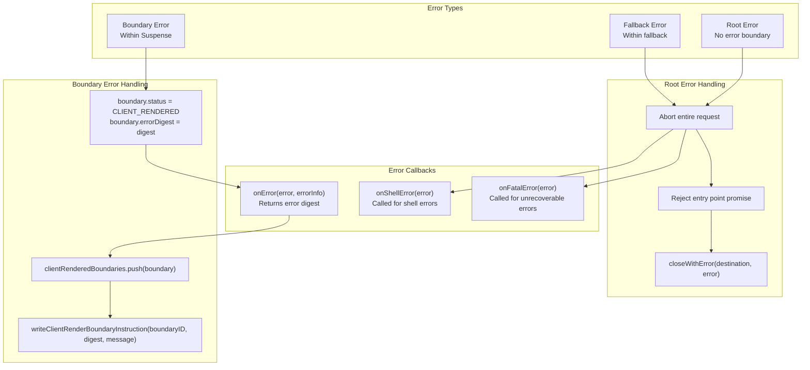

来源：[packages/react-server/src/ReactFizzServer.js:3600-3800]()

### 错误信息

`onError` 回调接收详细的错误信息，用于日志记录和监控。

**ErrorInfo 结构**

| 字段 | 类型 | 描述 |
|-------|------|-------------|
| `componentStack` | `string` | 组件堆栈跟踪 |
| `error` | `mixed` | 抛出的错误对象 |
| `errorInfo.digest` | `?string` | 用于客户端匹配的错误哈希 |

来源：[packages/react-server/src/ReactFizzServer.js:384-400]()

## 性能优化

### 渐进式 Chunk 大小

`progressiveChunkSize` 选项控制 flush 前缓冲多少 HTML。

**默认 Chunk 大小计算**

默认值 12,800 字节基于：
- 3G 网络速度：~500 kbits/秒
- 目标：每 500ms 发送一次内容
- 500ms × (500 kbits/s) × 0.8（实际吞吐量）× 0.5（HTML 开销）/ 2 = 12.5kb

来源：[packages/react-server/src/ReactFizzServer.js:414-429]()

### Boundary 内联

小的 boundary 可以直接内联，而不是用单独的指令进行外联。

**外联资格**

```javascript
function isEligibleForOutlining(request, boundary) {
  return (
    (boundary.byteSize > 500 ||
      hasSuspenseyContent(boundary.contentState) ||
      boundary.defer) &&
    boundary.preamble === null
  );
}
```

- Boundary < 500 字节：内联
- Boundary ≥ 500 字节：使用指令外联
- Defer boundary：始终外联
- Preamble boundary：永不外联（用于渲染阻塞）

来源：[packages/react-server/src/ReactFizzServer.js:466-482]()

### 早期 Headers

`onHeaders` 回调允许在任何 HTML 之前发送 `Link` headers，用于早期提示。

**Header 容量管理**

资源累积到 Link headers 中，直到达到容量：
- 默认容量：2000 UTF-16 代码单元（~2KB）
- 优先级顺序：preconnects、font preloads、高优先级 image preloads
- 剩余资源在 HTML `<link>` 标签中 flush

来源：[packages/react-dom-bindings/src/server/ReactFizzConfigDOM.js:367-489]()
