# React Server Components (Flight)

<!-- > 来源：https://deepwiki.com/facebook/react/5.2-react-server-components-(flight) -->

<details>
<summary>相关源文件</summary>

以下文件用于生成此 wiki 页面的上下文：

- [packages/react-client/src/ReactFlightClient.js](packages/react-client/src/ReactFlightClient.js)
- [packages/react-client/src/ReactFlightReplyClient.js](packages/react-client/src/ReactFlightReplyClient.js)
- [packages/react-client/src/ReactFlightTemporaryReferences.js](packages/react-client/src/ReactFlightTemporaryReferences.js)
- [packages/react-client/src/__tests__/ReactFlight-test.js](packages/react-client/src/__tests__/ReactFlight-test.js)
- [packages/react-server-dom-esm/src/ReactFlightESMReferences.js](packages/react-server-dom-esm/src/ReactFlightESMReferences.js)
- [packages/react-server-dom-parcel/src/ReactFlightParcelReferences.js](packages/react-server-dom-parcel/src/ReactFlightParcelReferences.js)
- [packages/react-server-dom-turbopack/src/ReactFlightTurbopackReferences.js](packages/react-server-dom-turbopack/src/ReactFlightTurbopackReferences.js)
- [packages/react-server-dom-unbundled/src/ReactFlightUnbundledReferences.js](packages/react-server-dom-unbundled/src/ReactFlightUnbundledReferences.js)
- [packages/react-server-dom-webpack/src/ReactFlightWebpackReferences.js](packages/react-server-dom-webpack/src/ReactFlightWebpackReferences.js)
- [packages/react-server-dom-webpack/src/__tests__/ReactFlightDOM-test.js](packages/react-server-dom-webpack/src/__tests__/ReactFlightDOM-test.js)
- [packages/react-server-dom-webpack/src/__tests__/ReactFlightDOMBrowser-test.js](packages/react-server-dom-webpack/src/__tests__/ReactFlightDOMBrowser-test.js)
- [packages/react-server-dom-webpack/src/__tests__/ReactFlightDOMEdge-test.js](packages/react-server-dom-webpack/src/__tests__/ReactFlightDOMEdge-test.js)
- [packages/react-server-dom-webpack/src/__tests__/ReactFlightDOMNode-test.js](packages/react-server-dom-webpack/src/__tests__/ReactFlightDOMNode-test.js)
- [packages/react-server-dom-webpack/src/__tests__/ReactFlightDOMReply-test.js](packages/react-server-dom-webpack/src/__tests__/ReactFlightDOMReply-test.js)
- [packages/react-server-dom-webpack/src/__tests__/ReactFlightDOMReplyEdge-test.js](packages/react-server-dom-webpack/src/__tests__/ReactFlightDOMReplyEdge-test.js)
- [packages/react-server/src/ReactFlightReplyServer.js](packages/react-server/src/ReactFlightReplyServer.js)
- [packages/react-server/src/ReactFlightServer.js](packages/react-server/src/ReactFlightServer.js)
- [packages/react-server/src/ReactFlightServerTemporaryReferences.js](packages/react-server/src/ReactFlightServerTemporaryReferences.js)
- [scripts/error-codes/codes.json](scripts/error-codes/codes.json)

</details>


React Server Components (Flight) 是 React 的协议和运行时系统，用于在服务器上执行 React 组件，将其序列化为可流式传输的格式，并在客户端重建它们。该系统支持服务器端计算，同时保持 React 的组件模型和客户端的交互性。

有关使用 HTML 输出的流式服务器端渲染信息，请参阅 [React Fizz (Streaming SSR)](#5.1)。有关传统服务器渲染模式，请参阅 [Legacy Server Rendering](#5.3)。

## 架构概述

React Flight 是 React Server Components (RSC) 的协议和运行时。它将服务器上的组件树序列化为流式传输格式，并在客户端重建它们。该协议使服务器端组件能够向客户端传递序列化数据、client reference 和 server reference。

### 服务器到客户端的数据流

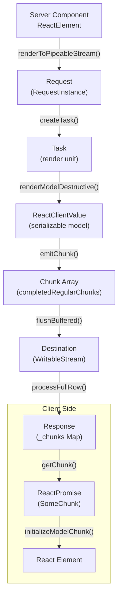

**来源：** [packages/react-server/src/ReactFlightServer.js:651-777](), [packages/react-client/src/ReactFlightClient.js:245-331](), [packages/react-client/src/ReactFlightClient.js:1437-1580]()

## 核心组件

### Flight Server (ReactFlightServer)

Flight 服务器执行 React 组件并将其输出序列化为 chunk。`Request` 对象维护序列化状态并管理 chunk 的发送。

#### Request 结构

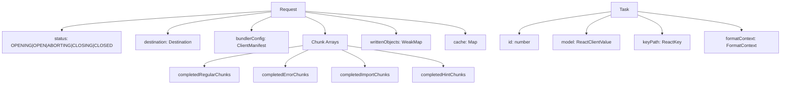

**关键类型和函数：**

| Symbol | 类型 | 用途 |
|--------|------|---------|
| `Request` | Object | Flight 渲染的中心状态，跟踪 chunk 和序列化 |
| `Task` | Object | 渲染组件树片段的工作单元 |
| `ReactClientValue` | Type | 所有可序列化类型的联合（元素、原始值、引用） |
| `createRequest()` | Function | 使用 `bundlerConfig` 和回调初始化请求 |
| `createTask()` | Function | 创建带有 `id`、`model` 和 `keyPath` 的任务 |
| `renderModelDestructive()` | Function | 主序列化调度器，将 model 转换为 JSON 兼容形式 |
| `emitChunk()` | Function | 将 chunk row 写入目标流 |

**来源：** [packages/react-server/src/ReactFlightServer.js:569-615](), [packages/react-server/src/ReactFlightServer.js:533-549](), [packages/react-server/src/ReactFlightServer.js:1756-1858]()

### Flight Client (ReactFlightClient)

Flight 客户端解析流式协议并重建 React 元素。它维护一个 `Response` 对象，其中包含一个 `Map`，存储通过不同状态转换的 chunk。

#### 客户端架构

```mermaid
graph TD
    Response["Response"]
    
    Response --> _chunks["_chunks: Map<number, SomeChunk>"]
    Response --> _bundlerConfig["_bundlerConfig: ServerConsumerModuleMap"]
    Response --> _fromJSON["_fromJSON: (key, value) => any"]
    Response --> _stringDecoder["_stringDecoder: StringDecoder"]
    Response --> _closed["_closed: boolean"]
    
    SomeChunk["SomeChunk<T>"]
    SomeChunk --> PendingChunk["PendingChunk<br/>status: 'pending'"]
    SomeChunk --> BlockedChunk["BlockedChunk<br/>status: 'blocked'"]
    SomeChunk --> ResolvedModelChunk["ResolvedModelChunk<br/>status: 'resolved_model'"]
    SomeChunk --> ResolvedModuleChunk["ResolvedModuleChunk<br/>status: 'resolved_module'"]
    SomeChunk --> InitializedChunk["InitializedChunk<br/>status: 'fulfilled'"]
    SomeChunk --> ErroredChunk["ErroredChunk<br/>status: 'rejected'"]
```

**关键函数：**

| 函数 | 输入 | 输出 | 用途 |
|----------|-------|--------|---------|
| `createFromReadableStream()` | `stream: ReadableStream` | `Promise<T>` | 创建 Response，开始流解析 |
| `processFullRow()` | `response: Response, row: string` | `void` | 解析 row 格式：`id:tag data` |
| `parseModelString()` | `response: Response, json: string` | `any` | 解析带有特殊前缀（`$`、`@` 等）的 JSON |
| `getChunk()` | `response: Response, id: number` | `SomeChunk<T>` | 按 ID 检索或创建 chunk |
| `initializeModelChunk()` | `chunk: ResolvedModelChunk` | `void` | 将 JSON model 转换为 React 元素 |
| `readChunk()` | `chunk: SomeChunk<T>` | `T` | 同步读取已初始化的 chunk 或抛出异常 |

**Row 解析器状态机：**

客户端通过 `RowParserState` 定义的状态机处理传入的字节：

| 状态 | 值 | 解析 |
|-------|-------|---------|
| `ROW_ID` | `0` | 读取 chunk ID（十六进制） |
| `ROW_TAG` | `1` | 读取 row 类型标签（单个字符） |
| `ROW_LENGTH` | `2` | 读取二进制 chunk 的长度字段 |
| `ROW_CHUNK_BY_NEWLINE` | `3` | 读取文本 chunk 直到 `\n` |
| `ROW_CHUNK_BY_LENGTH` | `4` | 按字节数读取二进制 chunk |

**来源：** [packages/react-client/src/ReactFlightClient.js:345-383](), [packages/react-client/src/ReactFlightClient.js:146-152](), [packages/react-client/src/ReactFlightClient.js:162-235](), [packages/react-client/src/ReactFlightClient.js:1437-1580]()

## 传输协议格式

### 基于 Row 的流式协议

Flight 以换行符分隔的 row 形式流式传输数据。每个 row 的格式为：`{id}:{tag}{data}\n`

**Row 格式组件：**

| 组件 | 格式 | 描述 |
|-----------|--------|-------------|
| `id` | 十六进制整数 | 唯一的 chunk 标识符（例如 `0`、`1a`、`2f`） |
| `:` | 分隔符 | 分隔 ID 和 tag |
| `tag` | 单个字符 | Row 类型指示符 |
| `data` | 可变 | JSON 字符串、二进制长度或空 |
| `\n` | 终止符 | 标记 row 结束（二进制 chunk 除外） |

**Row 标签：**

| 标签 | 名称 | 数据格式 | 用途 |
|-----|------|-------------|---------|
| `J` | Model | JSON 字符串 | 序列化的 model/元素 |
| `M` | Module (Client Reference) | JSON 字符串 | Client component 引用 |
| `E` | Error | JSON 错误对象 | 错误 chunk |
| `T` | Hint/Metadata | JSON 字符串 | 预加载提示、元数据 |
| `@` | Promise | Promise ID | 异步 chunk 引用 |
| `H` | Halt (DEV) | 空 | 表示停止解析 |
| `R` | ReadableStream start | 空 | 流初始化 |
| `r` | BYOB stream start | 空 | 二进制流初始化 |
| `C` | Stream close | 空或最终值 | 流完成 |
| `X` | Async iterator start | 空 | 迭代器初始化 |
| `x` | Iterator instance | 空 | 单次迭代器 |

**Row 序列示例：**

```
0:J{"type":"div","props":{"children":"Hello"}}
1:M{"id":"./ClientComponent.js","chunks":["chunk1"],"name":"default"}
2:@3
3:J"Resolved value"
```

**来源：** [packages/react-client/src/ReactFlightClient.js:1437-1580](), [packages/react-server/src/ReactFlightServer.js:1860-1930]()

### 值序列化编码

服务器使用 JSON 字符串中的前缀标记对特殊值进行编码：

```mermaid
graph TD
    Value["Value to Serialize"]
    
    Value -->|"reference to chunk"| RefPrefix["$ + hex ID<br/>e.g., '$5'"]
    Value -->|"Promise"| PromisePrefix["$@ + hex ID<br/>e.g., '$@a'"]
    Value -->|"Server Reference"| ServerPrefix["$F + hex ID<br/>e.g., '$F3'"]
    Value -->|"Client Reference"| ClientPrefix["$$id<br/>e.g., '$$./Component.js#default'"]
    Value -->|"Symbol"| SymbolPrefix["$S + symbol key<br/>e.g., '$Sreact.element'"]
    Value -->|"-0"| NegZero["$-0"]
    Value -->|"Infinity"| Inf["$Infinity"]
    Value -->|"-Infinity"| NegInf["$-Infinity"]
    Value -->|"NaN"| NotANumber["$NaN"]
    Value -->|"undefined"| Undef["$undefined"]
    Value -->|"Date"| DatePrefix["$D + ISO string<br/>e.g., '$D2023-01-01T00:00:00.000Z'"]
    Value -->|"BigInt"| BigIntPrefix["$n + decimal<br/>e.g., '$n12345'"]
    Value -->|"Map"| MapPrefix["$Q + hex ID"]
    Value -->|"Set"| SetPrefix["$W + hex ID"]
    Value -->|"FormData"| FormDataPrefix["$K + hex ID"]
    Value -->|"Blob/ArrayBuffer"| BlobPrefix["$B + hex ID"]
    Value -->|"Iterator"| IteratorPrefix["$i + hex ID"]
    Value -->|"Typed Array"| TypedArrayPrefix["$O + type + hex ID<br/>e.g., '$OUint8Array1'"]
    Value -->|"Error"| ErrorPrefix["$E + serialized error"]
    Value -->|"String starting with $"| Escaped["$$ + rest of string"]
```

**关键编码函数：**

| 函数 | 返回值 | 用途 |
|----------|--------|---------|
| `serializeByValueID(id)` | `'$' + id.toString(16)` | 对其他 chunk 的引用 |
| `serializePromiseID(id)` | `'$@' + id.toString(16)` | 异步 chunk 占位符 |
| `serializeServerReferenceID(id)` | `'$F' + id.toString(16)` | Server function 引用 |
| `serializeClientReference(ref)` | `'$$' + ref.$$id` | Client component 模块路径 |
| `serializeNumber(n)` | 特殊字符串或数字 | 处理 `-0`、`Infinity`、`NaN` |
| `serializeSymbol(sym)` | `'$S' + key` | 已知的 React symbol |
| `escapeStringValue(s)` | 如果以 `$` 开头则为 `'$' + s` | 转义字符串中的 `$` 前缀 |

**来源：** [packages/react-server/src/ReactFlightServer.js:1860-1930](), [packages/react-server/src/ReactFlightServer.js:1932-2042](), [packages/react-client/src/ReactFlightClient.js:1583-1800]()

### Chunk 状态和转换

Chunk 在数据到达和处理时通过状态转换：

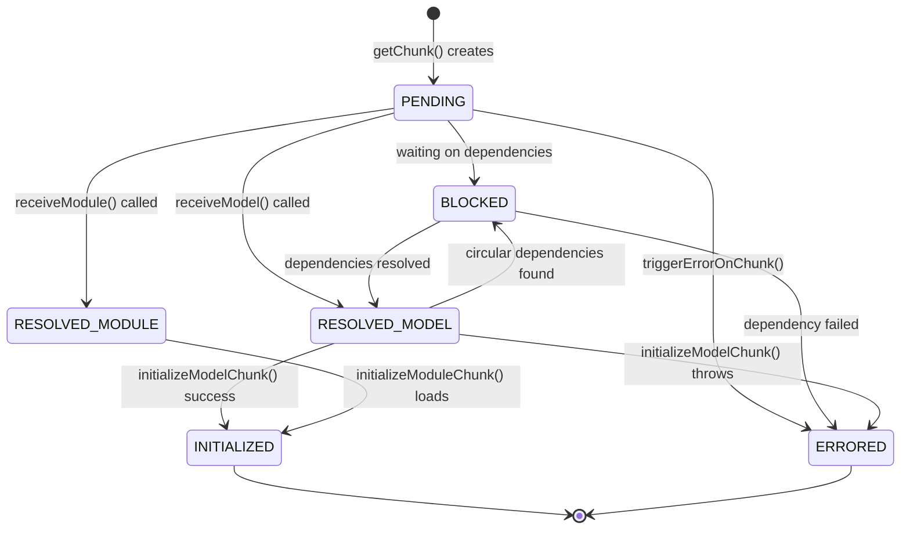

**状态转换：**

- **PENDING → RESOLVED_MODEL**：服务器发送带有匹配 ID 的 `J`（JSON model）row
- **PENDING → RESOLVED_MODULE**：服务器发送 `M`（module reference）row  
- **RESOLVED_MODEL → INITIALIZED**：`initializeModelChunk()` 解析 JSON 并解析引用
- **RESOLVED_MODULE → INITIALIZED**：`initializeModuleChunk()` 加载 client module
- **BLOCKED**：当 chunk 引用另一个待处理的 chunk 时创建
- **ERRORED**：服务器发送 `E` row 或初始化抛出异常

**来源：** [packages/react-client/src/ReactFlightClient.js:154-243](), [packages/react-client/src/ReactFlightClient.js:767-908](), [packages/react-client/src/ReactFlightClient.js:1126-1206]()

## 组件和函数引用

### Client References (Client Components)

Client reference 表示必须在客户端执行的组件。它们被序列化为客户端可以加载的模块元数据。

**服务器端处理：**

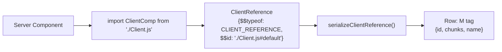

**客户端解析：**

```mermaid
graph LR
    Row["M row received"]
    CreateChunk["createResolvedModuleChunk()"]
    ResolvedModule["ResolvedModuleChunk<br/>status: 'resolved_module'"]
    InitModule["initializeModuleChunk()"]
    LoadModule["resolveClientReference()"]
    PreloadModule["preloadModule()"]
    RequireModule["requireModule()"]
    ClientComp["Client Component Function"]
    
    Row --> CreateChunk
    CreateChunk --> ResolvedModule
    ResolvedModule --> InitModule
    InitModule --> LoadModule
    LoadModule --> PreloadModule
    PreloadModule --> RequireModule
    RequireModule --> ClientComp
```

**关键函数：**

| 端 | 函数 | 用途 |
|------|----------|---------|
| Server | `isClientReference(value)` | 检查 `$$typeof === CLIENT_REFERENCE` |
| Server | `getClientReferenceKey(ref)` | 从引用中提取模块路径 |
| Server | `resolveClientReferenceMetadata(config, ref)` | 从 `ClientManifest` 获取 chunk 信息 |
| Client | `resolveClientReference(metadata)` | 为模块创建懒加载包装器 |
| Client | `preloadModule(metadata)` | 预加载 chunk（异步） |
| Client | `requireModule(metadata)` | 同步导入模块 |

**ClientManifest 结构：**

服务器使用 `ClientManifest`（由 bundler 生成）将引用映射到 chunk ID：

```typescript
{
  "./ClientComponent.js#default": {
    id: "client-chunk-123",
    chunks: ["chunk-abc.js", "chunk-def.js"],
    name: "default"
  }
}
```

**来源：** [packages/react-server/src/ReactFlightServer.js:1932-2042](), [packages/react-client/src/ReactFlightClient.js:1208-1274](), [packages/react-client/src/ReactFlightClient.js:882-908]()

### Server References (Server Actions)

Server reference 支持客户端到服务器的 RPC。客户端可以调用这些函数，Flight 会序列化参数，调用服务器函数，并返回结果。

**服务器端创建：**

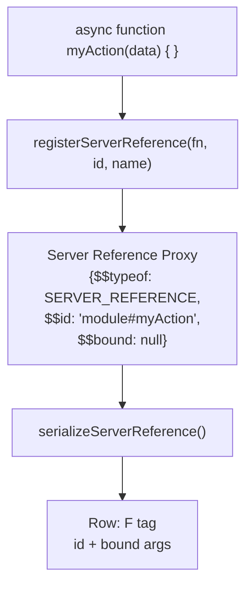

**客户端调用：**

```mermaid
graph LR
    ClientCall["clientRef(arg1, arg2)"]
    CallServer["callServer(id, args)"]
    EncodeReply["encodeReply([arg1, arg2])"]
    FormData["FormData with serialized args"]
    ServerInvoke["Server receives request"]
    DecodeReply["decodeReply(body, serverMap)"]
    Invoke["serverFunc(...args)"]
    Result["Flight response with result"]
    
    ClientCall --> CallServer
    CallServer --> EncodeReply
    EncodeReply --> FormData
    FormData --> ServerInvoke
    ServerInvoke --> DecodeReply
    DecodeReply --> Invoke
    Invoke --> Result
```

**关键函数：**

| 端 | 函数 | 用途 |
|------|----------|---------|
| Server | `registerServerReference(fn, id, name)` | 将函数标记为 server reference |
| Server | `getServerReferenceId(ref)` | 提取模块 ID |
| Server | `getServerReferenceBoundArguments(ref)` | 获取预绑定参数（来自 `.bind()`） |
| Client | `createServerReference(id, callServer)` | 创建可调用的代理 |
| Client | `callServer(id, args)` | 用户提供的 RPC 实现 |
| Client | `encodeReply(value)` | 将参数序列化为 FormData |
| Server | `decodeReply(body, serverMap)` | 将 FormData 反序列化为值 |

**绑定的 Server References：**

Server reference 可以使用 `.bind()` 进行部分应用：

```javascript
// Server
export async function deleteItem(userId, itemId) { ... }

// Server component passes bound reference
const boundDelete = deleteItem.bind(null, currentUserId);
return <Button action={boundDelete} />
```

绑定的参数在 Flight 流中序列化，客户端代理在回调时包含它们。

**来源：** [packages/react-server/src/ReactFlightServer.js:2044-2143](), [packages/react-client/src/ReactFlightClient.js:1583-1650](), [packages/react-client/src/ReactFlightReplyClient.js:179-560](), [packages/react-server/src/ReactFlightReplyServer.js:400-650]()

## 请求生命周期

### 服务器渲染流程

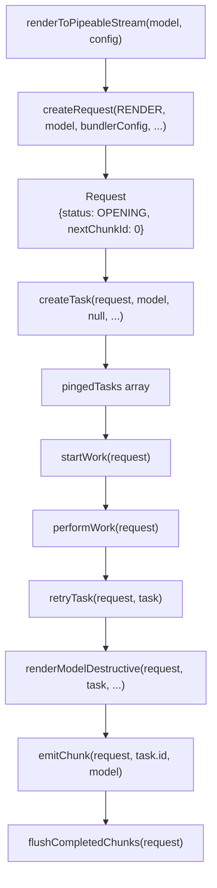

**处理步骤：**

1. **初始化**：`createRequest()` 创建状态为 `OPENING` 的 `Request` 和根任务
2. **工作循环**：`performWork()` 处理 `pingedTasks` 数组，渲染每个任务
3. **序列化**：`renderModelDestructive()` 递归序列化 model，将其转换为 JSON 兼容形式
4. **Chunk 发送**：`emitChunk()` 生成 row 字符串并添加到 `completedRegularChunks`
5. **刷新**：`flushCompletedChunks()` 将累积的 chunk 写入目标流
6. **完成**：所有任务完成后，状态转换为 `CLOSED` 并关闭流

**关键任务状态：**

| 任务状态 | 值 | 描述 |
|-------------|-------|-------------|
| `PENDING` | `0` | 任务已创建但未开始 |
| `COMPLETED` | `1` | 任务成功完成 |
| `ABORTED` | `3` | 由于错误/中止而中止任务 |
| `ERRORED` | `4` | 任务在渲染期间抛出错误 |
| `RENDERING` | `5` | 任务当前正在执行 |

**来源：** [packages/react-server/src/ReactFlightServer.js:779-807](), [packages/react-server/src/ReactFlightServer.js:1373-1445](), [packages/react-server/src/ReactFlightServer.js:1447-1533]()

### 客户端解析流程

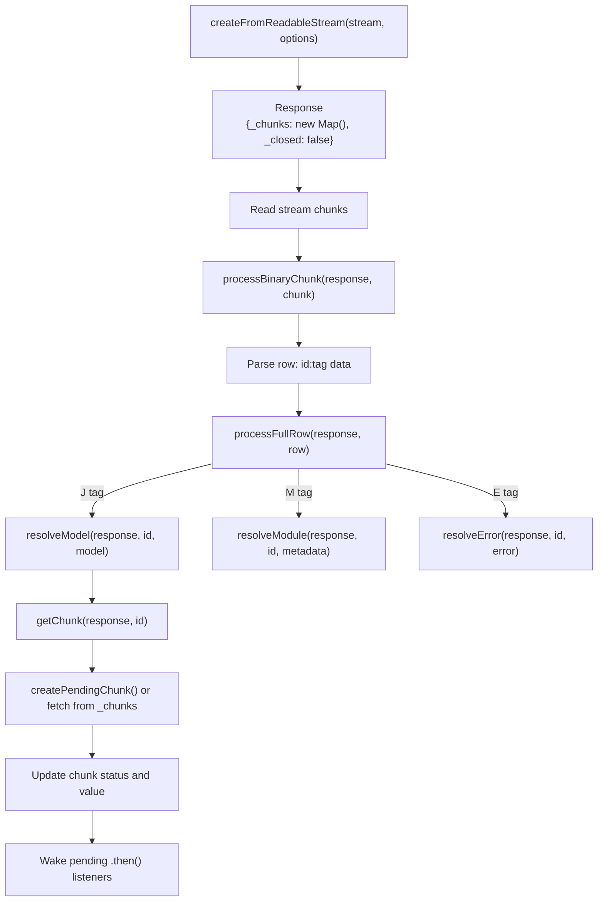

**解析状态：**

解析器在流 chunk 之间维护状态：

| 解析器状态 | 处理 |
|--------------|------------|
| `ROW_ID` | 读取十六进制 chunk ID（例如 `1a`） |
| `ROW_TAG` | 读取 `:` 后的单字符标签 |
| `ROW_LENGTH` | 读取二进制数据的长度字段 |
| `ROW_CHUNK_BY_NEWLINE` | 累积 row 直到 `\n` |
| `ROW_CHUNK_BY_LENGTH` | 读取二进制数据的精确字节数 |

**处理步骤：**

1. **流读取**：`processBinaryChunk()` 处理传入的字节
2. **Row 解析**：状态机从每个 row 中提取 `id`、`tag` 和 `data`
3. **Row 处理**：`processFullRow()` 根据标签进行分发
4. **Chunk 解析**：更新或创建 `_chunks` Map 中的 chunk
5. **监听器通知**：唤醒等待此 chunk 的任何 promise/回调
6. **初始化**：通过 `readChunk()` 读取 chunk 时，如果需要，调用 `initializeModelChunk()`

**来源：** [packages/react-client/src/ReactFlightClient.js:1437-1580](), [packages/react-client/src/ReactFlightClient.js:1626-1935](), [packages/react-client/src/ReactFlightClient.js:852-880]()

## 配置和集成

### 环境特定配置

Flight 通过配置模块支持多种部署环境：

- `ReactFlightServerConfig` - 服务器端环境配置
- `ReactFlightClientConfig` - 客户端环境配置  
- 通过 `ReactFlightWebpackPlugin` 进行 Webpack 集成
- 用于 Next.js 环境的 Turbopack 集成

**来源：** [packages/react-server-dom-webpack/src/ReactFlightWebpackPlugin.js:1-50](), [packages/react-server-dom-webpack/src/ReactFlightWebpackNodeLoader.js:1-30]()

### 性能和调试

Flight 包含性能跟踪和调试功能：

- 使用 `enableComponentPerformanceTrack` 进行组件渲染计时
- 使用 `enableAsyncDebugInfo` 进行异步操作跟踪  
- 从服务器到客户端的控制台日志转发
- 跨服务器-客户端边界的堆栈跟踪保留

**来源：** [packages/react-client/src/ReactFlightPerformanceTrack.js:75-140](), [packages/react-server/src/__tests__/ReactFlightAsyncDebugInfo-test.js:105-150]()
