# Server Components 构建工具集成

<!-- > 来源：https://deepwiki.com/facebook/react/5.3-build-integration-for-server-components -->

相关源文件

以下文件用于生成此 wiki 页面的上下文：

- [packages/react-client/src/ReactFlightClient.js](packages/react-client/src/ReactFlightClient.js)
- [packages/react-client/src/ReactFlightReplyClient.js](packages/react-client/src/ReactFlightReplyClient.js)
- [packages/react-client/src/ReactFlightTemporaryReferences.js](packages/react-client/src/ReactFlightTemporaryReferences.js)
- [packages/react-client/src/__tests__/ReactFlight-test.js](packages/react-client/src/__tests__/ReactFlight-test.js)
- [packages/react-dom/npm/server.browser.js](packages/react-dom/npm/server.browser.js)
- [packages/react-dom/npm/server.bun.js](packages/react-dom/npm/server.bun.js)
- [packages/react-dom/npm/server.edge.js](packages/react-dom/npm/server.edge.js)
- [packages/react-dom/npm/server.node.js](packages/react-dom/npm/server.node.js)
- [packages/react-dom/server.browser.js](packages/react-dom/server.browser.js)
- [packages/react-dom/server.bun.js](packages/react-dom/server.bun.js)
- [packages/react-dom/server.edge.js](packages/react-dom/server.edge.js)
- [packages/react-dom/server.node.js](packages/react-dom/server.node.js)
- [packages/react-dom/src/server/react-dom-server.bun.js](packages/react-dom/src/server/react-dom-server.bun.js)
- [packages/react-dom/src/server/react-dom-server.bun.stable.js](packages/react-dom/src/server/react-dom-server.bun.stable.js)
- [packages/react-server-dom-esm/src/ReactFlightESMReferences.js](packages/react-server-dom-esm/src/ReactFlightESMReferences.js)
- [packages/react-server-dom-parcel/src/ReactFlightParcelReferences.js](packages/react-server-dom-parcel/src/ReactFlightParcelReferences.js)
- [packages/react-server-dom-turbopack/src/ReactFlightTurbopackReferences.js](packages/react-server-dom-turbopack/src/ReactFlightTurbopackReferences.js)
- [packages/react-server-dom-unbundled/src/ReactFlightUnbundledReferences.js](packages/react-server-dom-unbundled/src/ReactFlightUnbundledReferences.js)
- [packages/react-server-dom-webpack/src/ReactFlightWebpackReferences.js](packages/react-server-dom-webpack/src/ReactFlightWebpackReferences.js)
- [packages/react-server-dom-webpack/src/__tests__/ReactFlightDOM-test.js](packages/react-server-dom-webpack/src/__tests__/ReactFlightDOM-test.js)
- [packages/react-server-dom-webpack/src/__tests__/ReactFlightDOMBrowser-test.js](packages/react-server-dom-webpack/src/__tests__/ReactFlightDOMBrowser-test.js)
- [packages/react-server-dom-webpack/src/__tests__/ReactFlightDOMEdge-test.js](packages/react-server-dom-webpack/src/__tests__/ReactFlightDOMEdge-test.js)
- [packages/react-server-dom-webpack/src/__tests__/ReactFlightDOMNode-test.js](packages/react-server-dom-webpack/src/__tests__/ReactFlightDOMNode-test.js)
- [packages/react-server-dom-webpack/src/__tests__/ReactFlightDOMReply-test.js](packages/react-server-dom-webpack/src/__tests__/ReactFlightDOMReply-test.js)
- [packages/react-server-dom-webpack/src/__tests__/ReactFlightDOMReplyEdge-test.js](packages/react-server-dom-webpack/src/__tests__/ReactFlightDOMReplyEdge-test.js)
- [packages/react-server/src/ReactFlightReplyServer.js](packages/react-server/src/ReactFlightReplyServer.js)
- [packages/react-server/src/ReactFlightServer.js](packages/react-server/src/ReactFlightServer.js)
- [packages/react-server/src/ReactFlightServerTemporaryReferences.js](packages/react-server/src/ReactFlightServerTemporaryReferences.js)
- [scripts/error-codes/codes.json](scripts/error-codes/codes.json)
- [scripts/jest/setupHostConfigs.js](scripts/jest/setupHostConfigs.js)
- [scripts/rollup/build.js](scripts/rollup/build.js)
- [scripts/rollup/bundles.js](scripts/rollup/bundles.js)
- [scripts/rollup/forks.js](scripts/rollup/forks.js)
- [scripts/rollup/modules.js](scripts/rollup/modules.js)
- [scripts/rollup/packaging.js](scripts/rollup/packaging.js)
- [scripts/rollup/sync.js](scripts/rollup/sync.js)
- [scripts/rollup/validate/index.js](scripts/rollup/validate/index.js)
- [scripts/rollup/wrappers.js](scripts/rollup/wrappers.js)
- [scripts/shared/inlinedHostConfigs.js](scripts/shared/inlinedHostConfigs.js)

## 目的与范围

本文档说明 bundler 如何通过构建时 plugin、manifest 生成和指令处理与 React Server Components (RSC) 集成。涵盖 Webpack plugin 实现、模块引用系统，以及构建工具链如何将包含 `'use client'` 和 `'use server'` 指令的代码转换为相应的模块引用和 manifest。

关于 Flight 序列化和反序列化的运行时行为，请参阅 [React Server Components (Flight)](#5.2)。关于 server actions 和客户端到服务器的通信，请参阅 [Server Actions 和双向通信](#5.4)。

---

## 构建集成架构

React Server Components 的构建集成由多个协作系统组成，这些系统在构建时运行，用于分析模块、生成 manifest 和转换代码引用。

**构建集成流程**

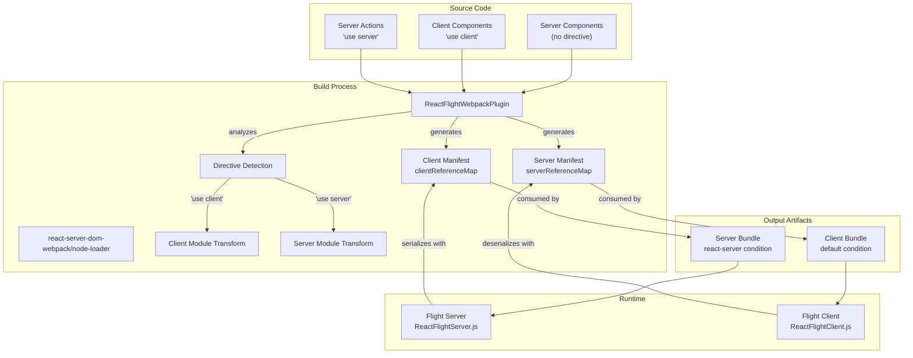

来源：[scripts/rollup/bundles.js:524-558](), [packages/react-server/src/ReactFlightServer.js:1-100](), [packages/react-client/src/ReactFlightClient.js:1-100]()

---

## Webpack Plugin 实现

`ReactFlightWebpackPlugin` 是主要的构建时集成点。它分析模块中的指令，转换模块引用，并生成客户端和服务器 manifest。

**Plugin Bundle 配置**

| 属性 | 值 |
|----------|-------|
| 入口点 | `react-server-dom-webpack/plugin` |
| Bundle 类型 | `NODE_ES2015` |
| 模块类型 | `RENDERER_UTILS` |
| 全局名称 | `ReactServerWebpackPlugin` |
| 外部依赖 | `fs`, `path`, `url`, `neo-async` |

该 plugin 作为 Webpack 编译 plugin 运行，通过钩入模块图构建过程来识别客户端和服务器边界。

**模块分析流程**

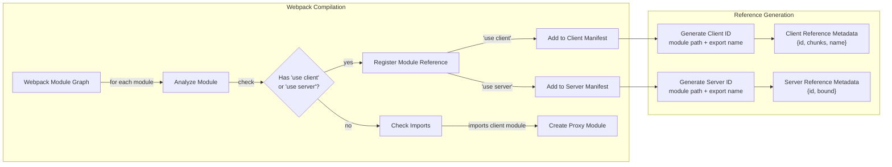

来源：[scripts/rollup/bundles.js:524-533]()

---

## 模块引用系统

React Server Components 使用模块引用系统来表示跨越服务器/客户端边界的代码。这些引用是不透明的标识符，在运行时使用 manifest 进行解析。

**Client Reference 结构**

client reference 表示应在客户端加载的模块。当服务器代码导入 client component 时，它会收到一个引用而不是实际模块。

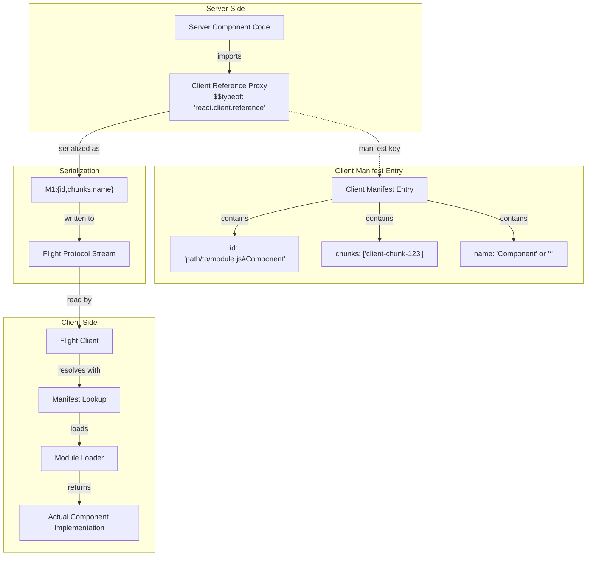

来源：[packages/react-client/src/ReactFlightClient.js:1-100](), [packages/react-server/src/ReactFlightServer.js:79-101]()

**Server Reference 结构**

server reference 表示应在服务器上执行的函数。当客户端代码调用 server action 时，它会将引用和参数发送回服务器。

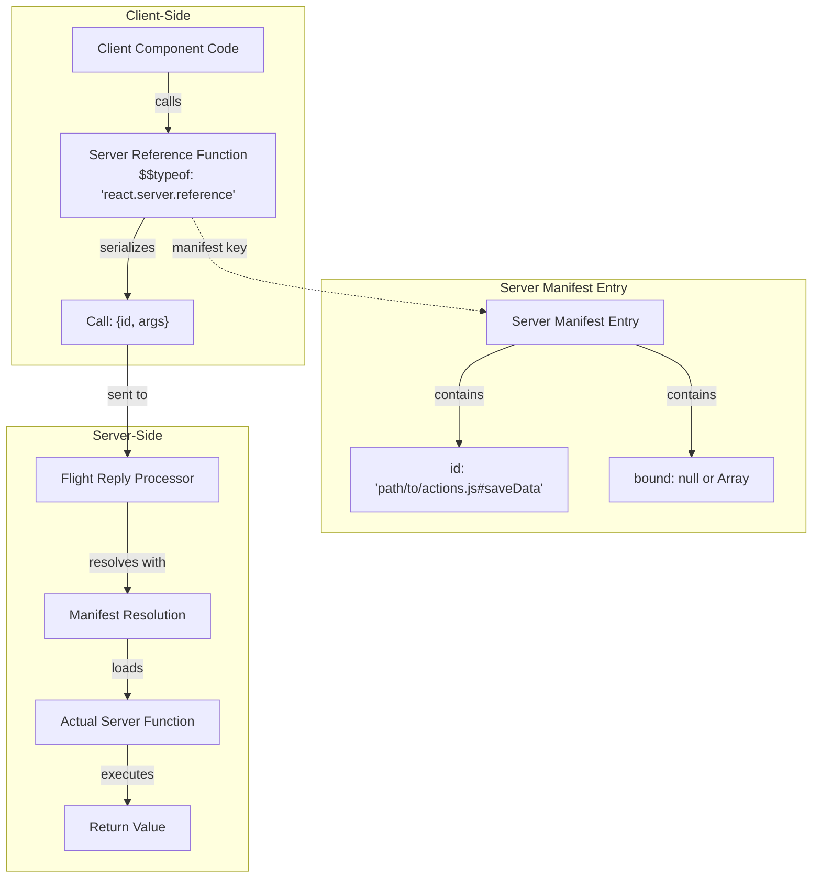

来源：[packages/react-client/src/ReactFlightReplyClient.js:52-80](), [packages/react-server/src/ReactFlightReplyServer.js:1-50]()

---

## 指令处理

构建系统处理两种类型的指令：`'use client'` 和 `'use server'`。这些指令必须出现在模块顶部，在任何其他代码之前。

**指令检测与转换**

| 指令 | 位置 | 含义 | 构建转换 |
|-----------|----------|---------|---------------------|
| `'use client'` | 文件顶部 | 整个模块在客户端运行 | 在 server bundle 中替换为 client reference proxy |
| `'use server'` | 文件顶部 | 整个模块导出 server actions | 在 client bundle 中替换为 server reference proxies |
| `'use server'` | 函数内部 | 单个函数是 server action | 提取并创建 server reference |

**Client 指令处理流程**

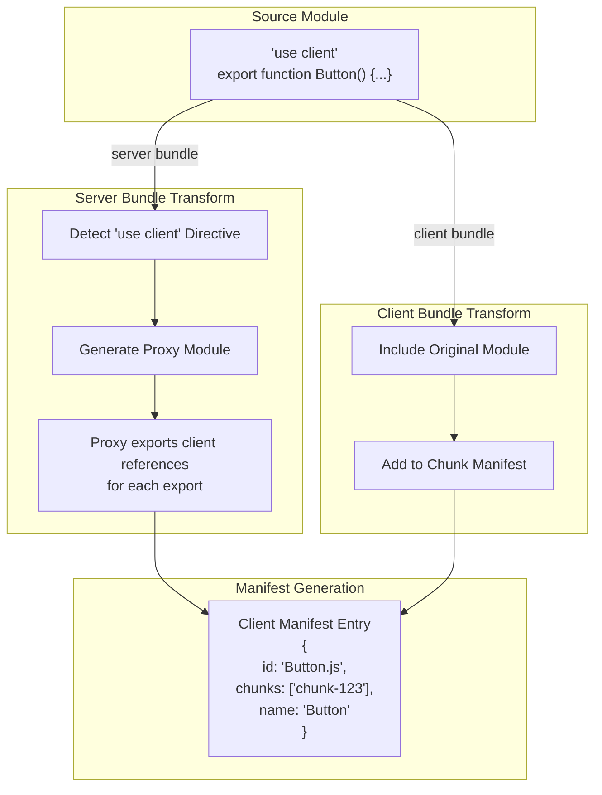

来源：[scripts/rollup/bundles.js:448-522]()

**Server 指令处理流程**

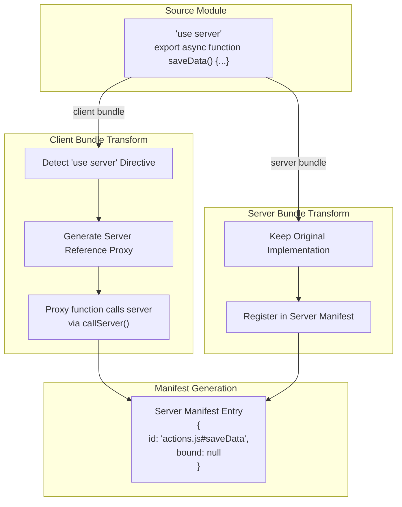

来源：[packages/react-client/src/ReactFlightReplyClient.js:1-100](), [packages/react-server/src/ReactFlightReplyServer.js:1-50]()

---

## Manifest 结构

构建过程生成两个 manifest 文件，用于在服务器/客户端边界进行运行时模块解析。

**Client Manifest 格式**

client manifest 将模块 ID 映射到 chunk 信息，允许服务器序列化客户端可以解析的 client references。

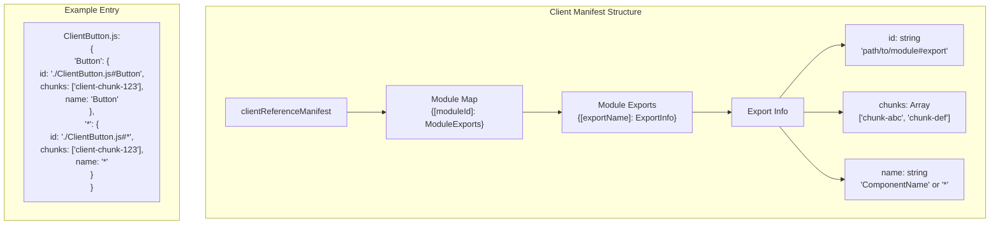

**Client Manifest 运行时使用**

| 阶段 | 操作 | Manifest 使用 |
|-------|-----------|----------------|
| 服务器渲染 | 遇到 client component | 在 manifest 中查找模块 ID 以获取 chunks |
| Flight 序列化 | 序列化 client reference | 在流中包含 `{id, chunks, name}` |
| 客户端接收 | 反序列化引用 | 使用 chunks 预加载/加载模块 |
| 客户端渲染 | 实例化组件 | 导入模块并按名称获取导出 |

来源：[packages/react-server/src/ReactFlightServer.js:79-101](), [packages/react-client/src/ReactFlightClient.js:44-64]()

**Server Manifest 格式**

server manifest 将 server action ID 映射到模块位置，允许客户端调用服务器函数。

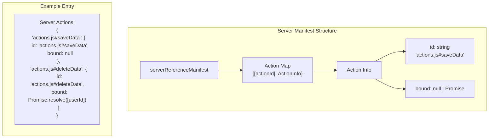

**Server Manifest 运行时使用**

| 阶段 | 操作 | Manifest 使用 |
|-------|-----------|----------------|
| 客户端渲染 | 接收 server reference | 使用 `$$typeof` 标记存储引用 |
| 客户端调用 | 调用服务器函数 | 使用 Flight Reply 序列化 `{id, args}` |
| 服务器接收 | 反序列化调用 | 在 manifest 中查找 action ID |
| 服务器执行 | 加载并调用 | 加载模块并按名称调用导出 |

来源：[packages/react-client/src/ReactFlightReplyClient.js:52-80](), [packages/react-server/src/ReactFlightReplyServer.js:1-50]()

---

## 模块加载集成

构建集成包括处理运行时 `react-server` 条件的模块 loader，确保在每个环境中加载正确的模块版本。

**Node.js Loader 配置**

| 属性 | 值 |
|----------|-------|
| 入口点 | `react-server-dom-webpack/node-loader` |
| Bundle 类型 | `ESM_PROD` |
| 条件 | `react-server` |
| 外部依赖 | `acorn` (用于 AST 解析) |

Node.js loader 使用 ESM loader hooks 拦截模块解析，确保在服务器环境中加载具有 `react-server` 导出条件的模块。

**模块解析流程**

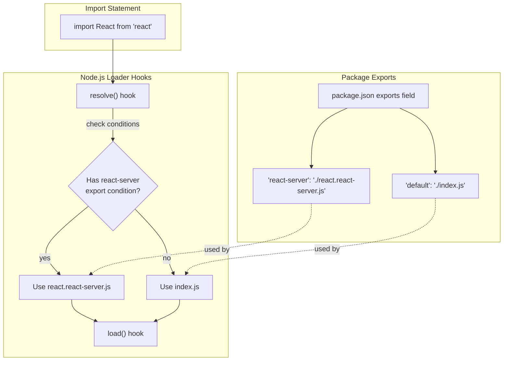

来源：[scripts/rollup/bundles.js:535-545](), [packages/react/package.json:24-42]()

**CommonJS 模块注册**

对于 CommonJS 环境，注册模块处理模块加载：

| 属性 | 值 |
|----------|-------|
| 入口点 | `react-server-dom-webpack/src/ReactFlightWebpackNodeRegister` |
| 名称 | `react-server-dom-webpack-node-register` |
| 条件 | `react-server` |
| 外部依赖 | `url`, `module`, `react-server-dom-webpack/server` |

该模块钩入 Node 的 `require()` 系统，为 CommonJS 模块应用 `react-server` 条件。

来源：[scripts/rollup/bundles.js:547-558]()

---

## 构建输出组织

构建系统为服务器和客户端环境生成独立的 bundle，每个 bundle 使用相应的 manifest。

**Bundle 类型矩阵**

| Bundle | 入口点 | 条件 | 使用 Manifest | 目标环境 |
|--------|--------------|-----------|-------------------|--------------------|
| Server | `react-server-dom-webpack/server.{node,browser,edge}` | `react-server` | Client Manifest | Node.js, Edge Runtime, Browser (SSR) |
| Client | `react-server-dom-webpack/client.{node,browser,edge}` | default | Server Manifest | Node.js (for SSR), Browser |
| Plugin | `react-server-dom-webpack/plugin` | N/A | 生成两者 | 仅构建时 |
| Loader | `react-server-dom-webpack/node-loader` | `react-server` | N/A | Node.js ESM 运行时 |

**Server Bundle 配置**

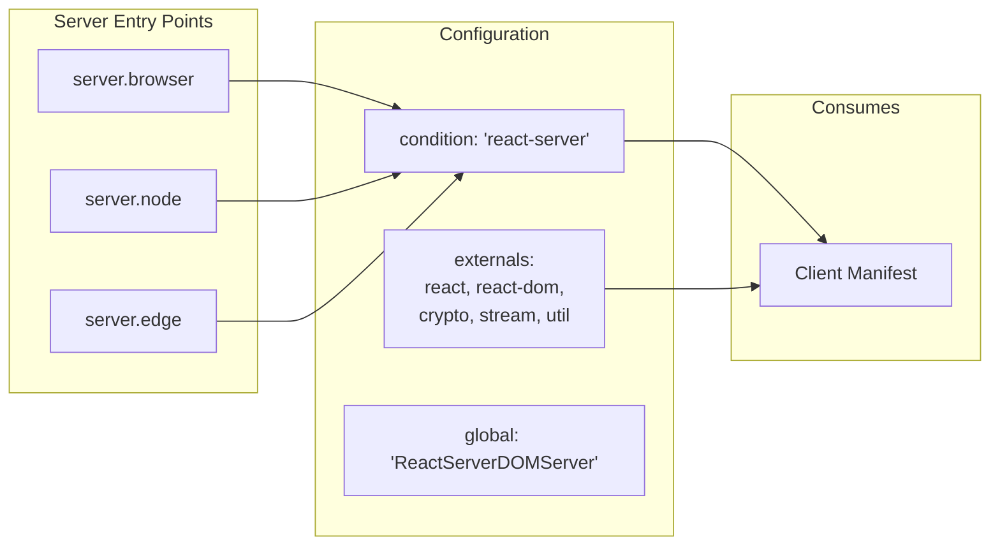

来源：[scripts/rollup/bundles.js:448-489]()

**Client Bundle 配置**

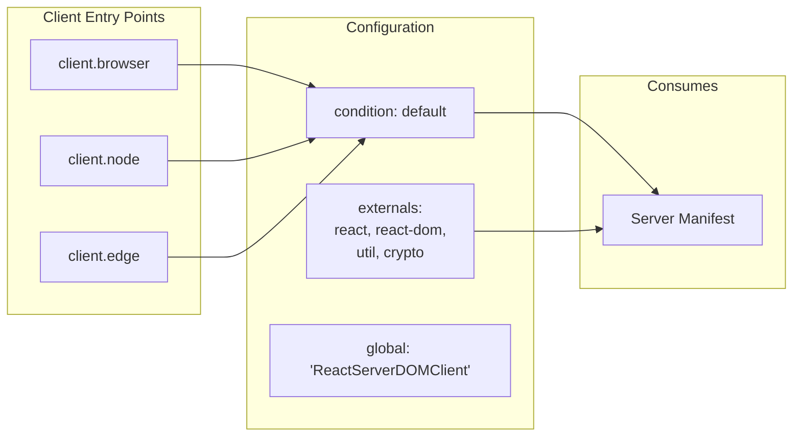

来源：[scripts/rollup/bundles.js:491-522]()

---

## Fork 系统集成

构建系统使用 fork 机制根据 bundle 类型和环境提供共享模块的不同实现。

**React Shared Internals Forking**

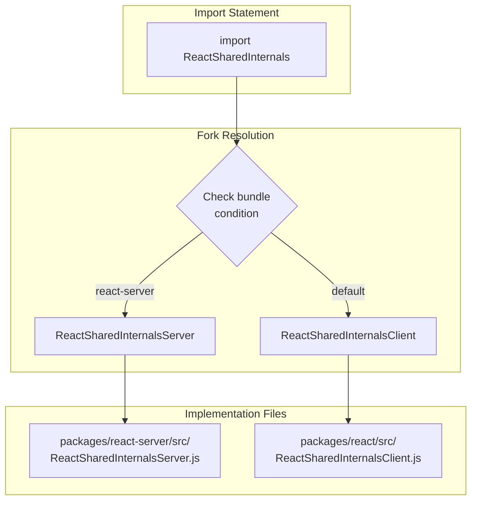

**Fork 配置表**

| 模块 | 条件 | Fork 目标 | 用途 |
|--------|-----------|-------------|---------|
| `shared/ReactSharedInternals.js` | `react-server` | `ReactSharedInternalsServer.js` | 服务器特定的内部实现（Flight hooks） |
| `shared/ReactSharedInternals.js` | default | `ReactSharedInternalsClient.js` | 客户端特定的内部实现（useState 等） |
| `shared/ReactDOMSharedInternals.js` | `react-server` | N/A | 在 react-server 中不可用 |
| `shared/ReactDOMSharedInternals.js` | default | `ReactDOMSharedInternals.js` | DOM 特定的内部实现 |

来源：[scripts/rollup/forks.js:52-131](), [scripts/rollup/build.js:354-403]()

---

## 与其他 Bundler 的集成

虽然主要实现使用 Webpack，但架构通过类似的 plugin 系统支持其他 bundler。

**Turbopack 集成**

| Bundle | 入口点 | 说明 |
|--------|-------------|-------|
| Server | `react-server-dom-turbopack/server.{browser,node,edge}` | 类似于 Webpack server |
| Client | `react-server-dom-turbopack/client.{browser,node,edge}` | 类似于 Webpack client |

Turbopack 集成遵循相同的 manifest 生成和模块引用模式，但使用 Turbopack 的原生 plugin 系统而不是 Webpack 的。

来源：[scripts/rollup/bundles.js:560-672]()

**Unbundled（开发）集成**

用于无需 bundler 的开发和测试：

| Bundle | 入口点 | 用途 |
|--------|-------------|---------|
| Server | `react-server-dom-unbundled/server.node` | 无打包，直接模块解析 |
| Client | `react-server-dom-unbundled/client.node` | 无打包，直接模块导入 |

此配置主要用于测试，以在没有 bundler 复杂性的情况下验证 Flight 协议。

来源：测试文件显示使用 WebpackMock 工具，这些工具模拟 manifest 生成而无需实际打包。

---

## 总结

React Server Components 的构建集成通过以下方式运行：

1. **Plugin 系统**：`ReactFlightWebpackPlugin` 分析模块并生成 manifest
2. **模块引用**：带有 `$$typeof` 标记的跨边界模块的抽象表示
3. **指令处理**：将 `'use client'` 和 `'use server'` 指令转换为相应的引用
4. **Manifest 生成**：创建 client manifest（服务器 → 客户端）和 server manifest（客户端 → 服务器）
5. **模块加载**：使用基于条件的解析，配合 `react-server` 导出条件
6. **Fork 系统**：提供共享模块的环境特定实现

该架构与 bundler 无关，Webpack、Turbopack 和 unbundled 环境的实现都遵循相同的 manifest 和引用模式。

来源：[scripts/rollup/bundles.js:448-672](), [scripts/rollup/forks.js:1-300](), [scripts/rollup/build.js:1-600]()
