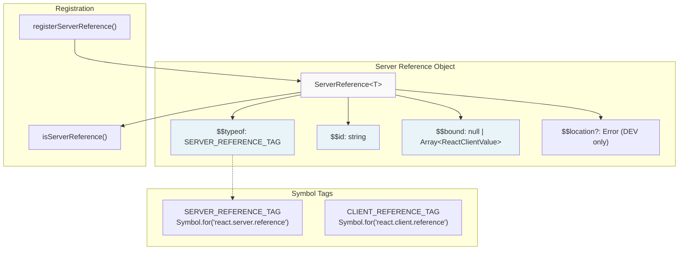
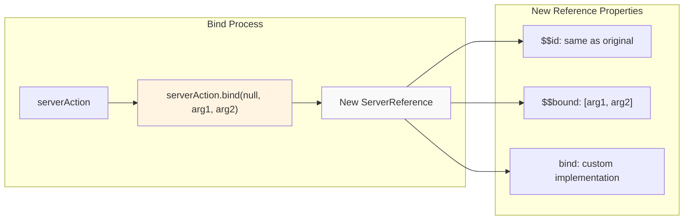
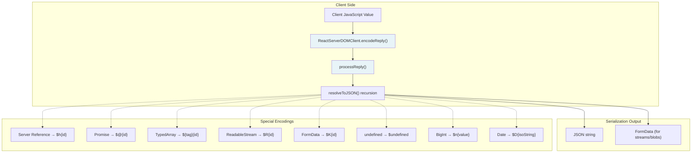
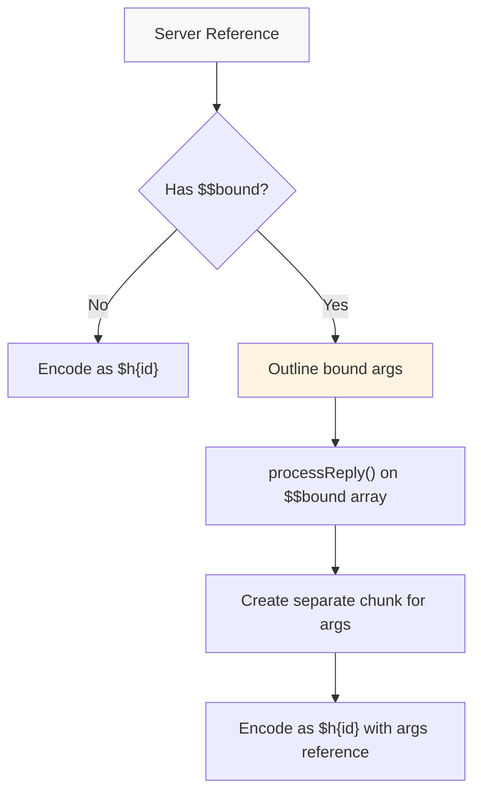
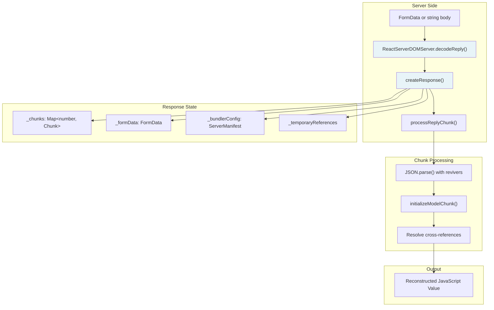
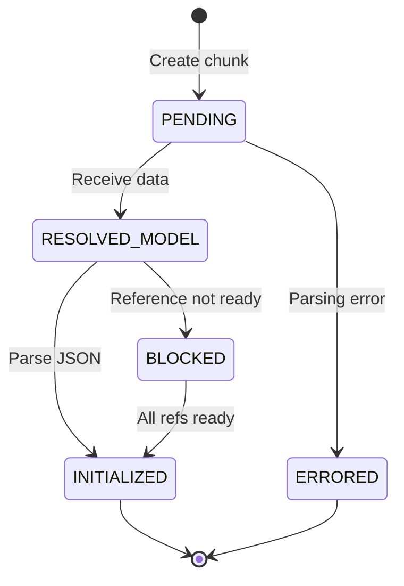
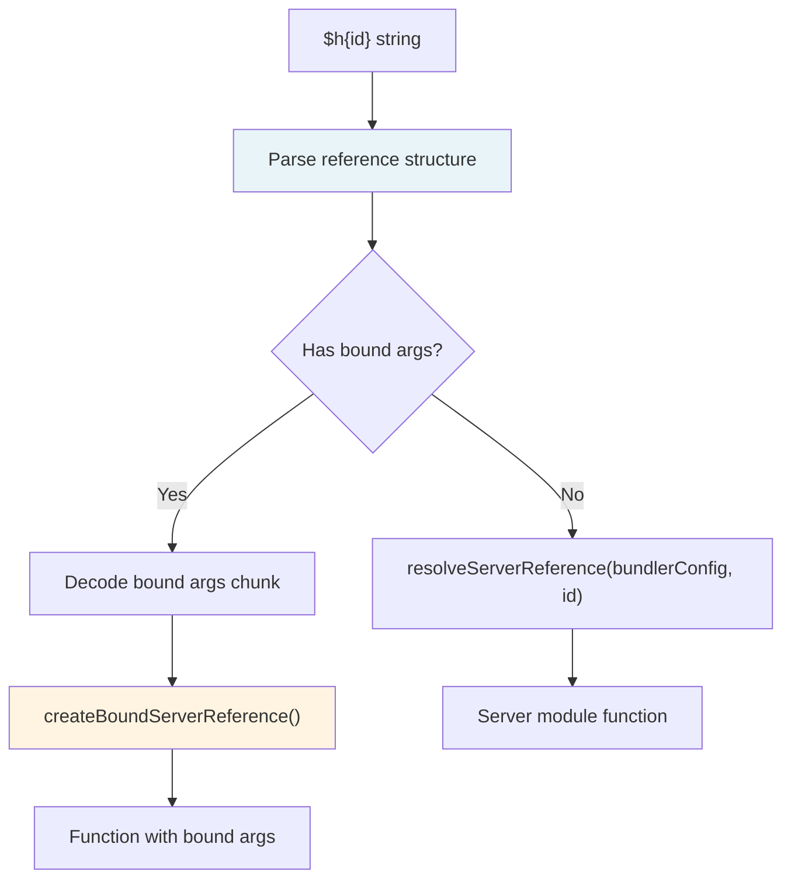
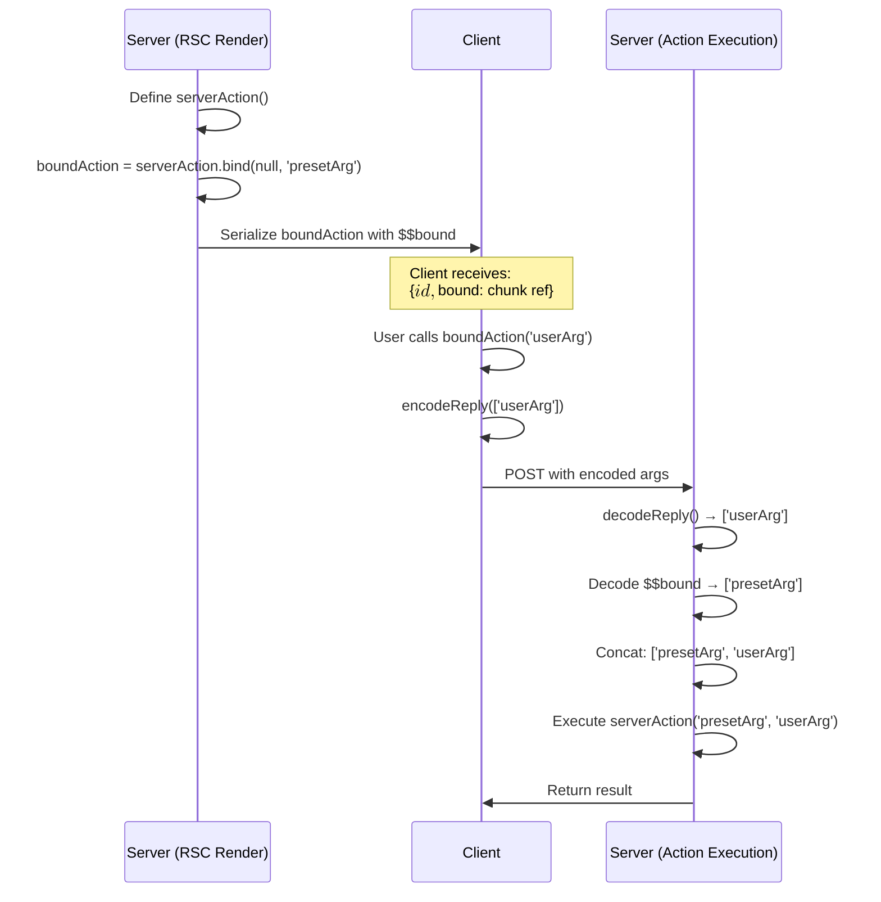
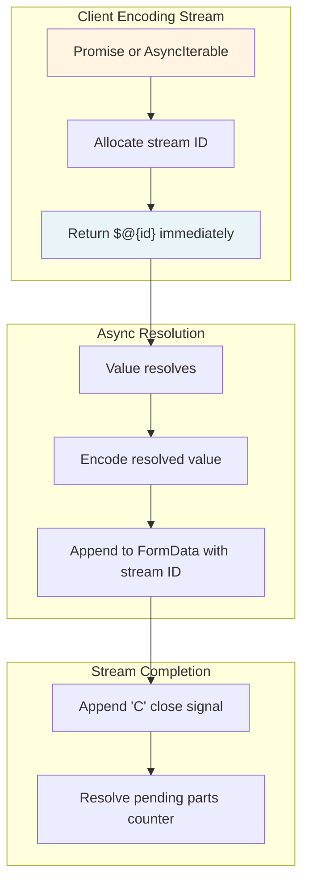

# Server Actions 与双向通信

<!-- > 来源：https://deepwiki.com/facebook/react/5.4-server-actions-and-bidirectional-communication -->

<details>
<summary>相关源文件</summary>

以下文件用于生成此 wiki 页面的上下文：

- [packages/react-client/src/ReactFlightClient.js](packages/react-client/src/ReactFlightClient.js)
- [packages/react-client/src/ReactFlightReplyClient.js](packages/react-client/src/ReactFlightReplyClient.js)
- [packages/react-client/src/ReactFlightTemporaryReferences.js](packages/react-client/src/ReactFlightTemporaryReferences.js)
- [packages/react-client/src/__tests__/ReactFlight-test.js](packages/react-client/src/__tests__/ReactFlight-test.js)
- [packages/react-server-dom-esm/src/ReactFlightESMReferences.js](packages/react-server-dom-esm/src/ReactFlightESMReferences.js)
- [packages/react-server-dom-parcel/src/ReactFlightParcelReferences.js](packages/react-server-dom-parcel/src/ReactFlightParcelReferences.js)
- [packages/react-server-dom-turbopack/src/ReactFlightTurbopackReferences.js](packages/react-server-dom-turbopack/src/ReactFlightTurbopackReferences.js)
- [packages/react-server-dom-unbundled/src/ReactFlightUnbundledReferences.js](packages/react-server-dom-unbundled/src/ReactFlightUnbundledReferences.js)
- [packages/react-server-dom-webpack/src/ReactFlightWebpackReferences.js](packages/react-server-dom-webpack/src/ReactFlightWebpackReferences.js)
- [packages/react-server-dom-webpack/src/__tests__/ReactFlightDOM-test.js](packages/react-server-dom-webpack/src/__tests__/ReactFlightDOM-test.js)
- [packages/react-server-dom-webpack/src/__tests__/ReactFlightDOMBrowser-test.js](packages/react-server-dom-webpack/src/__tests__/ReactFlightDOMBrowser-test.js)
- [packages/react-server-dom-webpack/src/__tests__/ReactFlightDOMEdge-test.js](packages/react-server-dom-webpack/src/__tests__/ReactFlightDOMEdge-test.js)
- [packages/react-server-dom-webpack/src/__tests__/ReactFlightDOMNode-test.js](packages/react-server-dom-webpack/src/__tests__/ReactFlightDOMNode-test.js)
- [packages/react-server-dom-webpack/src/__tests__/ReactFlightDOMReply-test.js](packages/react-server-dom-webpack/src/__tests__/ReactFlightDOMReply-test.js)
- [packages/react-server-dom-webpack/src/__tests__/ReactFlightDOMReplyEdge-test.js](packages/react-server-dom-webpack/src/__tests__/ReactFlightDOMReplyEdge-test.js)
- [packages/react-server/src/ReactFlightReplyServer.js](packages/react-server/src/ReactFlightReplyServer.js)
- [packages/react-server/src/ReactFlightServer.js](packages/react-server/src/ReactFlightServer.js)
- [packages/react-server/src/ReactFlightServerTemporaryReferences.js](packages/react-server/src/ReactFlightServerTemporaryReferences.js)
- [scripts/error-codes/codes.json](scripts/error-codes/codes.json)

</details>


## 目的与范围

本文档介绍 React 的 server action 系统和双向通信协议。Server actions 允许客户端代码调用服务端函数，建立从客户端到服务端的通信通道。这补充了 [React Server Components (Flight)](#5.2) 中记录的服务端到客户端的 RSC 协议。

涵盖的关键主题：
- **Server References**：可序列化并从客户端调用的函数
- **Reply Encoding**：如何序列化客户端参数并发送到服务端
- **Reply Decoding**：服务端如何反序列化客户端数据
- **Form Integration**：将 server actions 用作 form actions 以实现 progressive enhancement
- **Bound Arguments**：预绑定参数到服务端函数

关于服务端到客户端的流式传输，请参阅 [React Server Components (Flight)](#5.2)。关于构建时模块解析，请参阅 [Build Integration for Server Components](#5.3)。

---

## Server Reference 架构

Server references 是特殊的函数对象，可序列化并发送到客户端，然后通过调用触发服务端执行。

### Server Reference 结构



**Server Reference 注册**

使用 `registerServerReference()` 创建 server references：

Sources: [packages/react-server-dom-webpack/src/ReactFlightWebpackReferences.js:111-130]()

注册过程：
1. 使用 `$$typeof: SERVER_REFERENCE_TAG` 标记函数
2. 分配唯一的 `$$id`（模块路径 + 导出名称）
3. 将 `$$bound` 初始化为 `null`
4. 附加自定义 `.bind()` 实现
5. 在 DEV 模式下，添加 `$$location` 用于调试

### 自定义 Bind 实现

Server references 重写 `Function.prototype.bind` 以支持参数绑定：



Sources: [packages/react-server-dom-webpack/src/ReactFlightWebpackReferences.js:62-103]()

在 server reference 上调用 `.bind()` 时：
1. 使用原生 `Function.prototype.bind` 创建新函数
2. 从原始函数复制 `$$typeof` 和 `$$id`
3. 将新参数与原始函数的 `$$bound` 连接
4. 将自定义 `.bind()` 附加到新函数

**重要**：第一个参数（thisArg）必须为 `null` 或 `undefined`。在 DEV 模式下，如果提供了非 null 的 thisArg，会记录警告。

---

## Reply Encoding 协议

Reply encoding 协议将客户端 JavaScript 值序列化为可传输到服务端并重构的格式。

### Encoding 架构



**Encoding 入口点**

Sources: [packages/react-client/src/ReactFlightReplyClient.js:183-465]()

`processReply()` 函数协调 encoding：
1. 维护 `writtenObjects` WeakMap 以处理循环引用
2. 跟踪 `pendingParts` 以处理异步值
3. 当存在二进制数据或流时升级为 FormData
4. 返回 JSON 字符串或 FormData

### 值 Encoding 参考

| 类型 | Encoding | 示例 |
|------|----------|---------|
| `undefined` | `"$undefined"` | `undefined → "$undefined"` |
| `-0` | `"$-0"` | `-0 → "$-0"` |
| `Infinity` | `"$Infinity"` | `Infinity → "$Infinity"` |
| `NaN` | `"$NaN"` | `NaN → "$NaN"` |
| `BigInt` | `"$n" + value` | `123n → "$n123"` |
| `Date` | `"$D" + isoString` | `new Date() → "$D2024-01-01..."` |
| `Map` | `"$Q" + id` | 作为单独的 chunk 提取 |
| `Set` | `"$W" + id` | 作为单独的 chunk 提取 |
| `FormData` | `"$K" + id` | 作为单独的 chunk 提取 |
| `Blob` | `"$B" + id` | 作为单独的 chunk 提取 |
| `TypedArray` | `"$" + tag + id` | `Uint8Array → "$o{id}"` |
| `Promise` | `"$@" + id` | 异步解析 |
| `ServerReference` | `"$h" + id` | 绑定的参数单独提取 |
| `Iterator` | `"$i" + id` | 单次迭代 |
| `AsyncIterable` | `"$x" + id` | 多次异步迭代 |
| `ReadableStream` | `"$R" + id` (文本) 或 `"$r" + id` (二进制) | 流式 chunk |

Sources: [packages/react-client/src/ReactFlightReplyClient.js:103-170]()

### Server Reference Encoding

当 encoding 带有绑定参数的 server reference 时：



Sources: [packages/react-client/src/ReactFlightReplyClient.js:556-607]()

过程：
1. 检查 `$$bound` 是否为非 null
2. 如果已绑定，将参数数组作为单独的 reply chunk 提取
3. 将 reference 编码为 `{id: $$id, bound: chunkId}` 结构
4. 如果未绑定，编码为简单字符串 `"$h" + id`

### 流式值

对于流和异步可迭代对象，encoding 创建流式通道：

Sources: [packages/react-client/src/ReactFlightReplyClient.js:260-304](), [packages/react-client/src/ReactFlightReplyClient.js:306-381]()

**ReadableStream Encoding：**
1. 升级为 FormData 模式
2. 分配流 ID
3. 创建 reader 并开始读取
4. 对于每个 chunk，将序列化值追加到带有流 ID 的 FormData
5. 完成时，追加关闭信号 `"C"`

**AsyncIterable Encoding：**
1. 类似于 ReadableStream
2. 区分单次（iterator === iterable）和多次
3. 编码关闭指令，可选包含最终值

---

## Reply Decoding 协议

服务端从编码的 reply 格式重构客户端值。

### Decoding 架构



**Decoding 入口点**

Sources: [packages/react-server/src/ReactFlightReplyServer.js:1113-1183]()

`decodeReply()` 函数：
1. 创建 `Response` 对象以跟踪状态
2. 解析 FormData 条目或 JSON 字符串
3. 对于每个 chunk，调用 `processReplyChunk()`
4. 返回根 chunk（ID 0）作为 Promise
5. 当所有引用的 chunk 初始化后解析

### Chunk 状态机

Reply 中的每个 chunk 经历以下状态：



Sources: [packages/react-server/src/ReactFlightReplyServer.js:53-107]()

Chunk 类型：
- **PendingChunk**：等待数据
- **BlockedChunk**：已接收数据但引用未解析
- **ResolvedModelChunk**：JSON 字符串准备解析
- **InitializedChunk**：最终值准备就绪
- **ErroredChunk**：解码失败

### JSON Revival

解码器使用自定义 JSON revivers 处理特殊编码：

Sources: [packages/react-server/src/ReactFlightReplyServer.js:595-951]()

`parseModelString()` 函数处理带前缀的值：
- `"$undefined"` → `undefined`
- `"$-0"` → `-0`
- `"$Infinity"` → `Infinity`
- `"$NaN"` → `NaN`
- `"$n{digits}"` → `BigInt`
- `"$D{isoString}"` → `Date`
- `"$Q{id}"` → 引用 Map chunk
- `"$W{id}"` → 引用 Set chunk
- `"$h{id}"` → Server reference，可选绑定参数
- `"$@{id}"` → Promise 引用
- `"${tag}{id}"` → Typed array 引用

### Server Reference 解析

解码 server reference 时：



Sources: [packages/react-server/src/ReactFlightReplyServer.js:716-778]()

过程：
1. 从 reference 解析 `$$id`
2. 如果存在 `$$bound`，解码绑定的参数 chunk
3. 使用 `resolveServerReference()` 加载模块
4. 如果已绑定，调用 Reply Client 的 `createBoundServerReference()`
5. 返回可执行函数

---

## Form Actions 与 Progressive Enhancement

Server actions 与 HTML 表单集成，实现 progressive enhancement，使表单即使在没有 JavaScript 的情况下也能工作。

### Form Action Encoding

```mermaid
graph TB
    subgraph "Server Rendering"
        ServerAction["Server Action Function"]
        RenderForm["<form action={serverAction}>"]
    end
    
    ServerAction --> RenderForm
    
    subgraph "HTML Output"
        FormTag["<form action=... enctype=...>"]
        HiddenInputs["Hidden inputs with encoded action"]
    end
    
    RenderForm --> FormTag
    RenderForm --> HiddenInputs
    
    subgraph "Client Behavior"
        JSDisabled["JS Disabled: Native form submit"]
        JSEnabled["JS Enabled: Intercept with React"]
    end
    
    FormTag --> JSDisabled
    FormTag --> JSEnabled
    
    JSDisabled --> HTTPPost["POST to server action endpoint"]
    JSEnabled --> CallAction["Call action with FormData"]
    
    style RenderForm fill:#e8f4f8
    style JSEnabled fill:#d4f4dd
```



**Form Action 流程**

Sources: [packages/react-client/src/ReactFlightReplyClient.js:642-686]()

`encodeFormAction()` 回调由集成（webpack 等）提供：
1. 接收 server reference ID 和绑定参数
2. 返回 `ReactCustomFormAction` 对象
3. 包含用于表单提交的 action URL 和方法
4. React 插入隐藏输入以编码 action

**Progressive Enhancement：**
- **无 JS**：表单正常提交到 server action 端点
- **有 JS**：React 拦截提交，编码 FormData，直接调用 action
- 结果：无论 JS 是否可用，表单都能工作

### Form Data Encoding

提交表单时：

Sources: [packages/react-client/src/ReactFlightReplyClient.js:688-763]()

`encodeFormData()` 函数：
1. 遍历 FormData 条目
2. 识别哪些条目是文件/blob
3. 创建仅包含文件的过滤 FormData
4. 将非文件条目编码为 JSON
5. 将 JSON 结构追加到 FormData
6. 返回组合的 FormData

这允许在单个表单提交中混合结构化数据（对象、数组）和文件上传。

---

## 绑定参数

Server actions 通过 `.bind()` 支持部分应用，允许在发送到客户端之前在服务端预绑定参数。

### 绑定流程



**绑定参数存储**

Sources: [packages/react-server/src/ReactFlightServer.js:2507-2566]()

序列化带有 `$$bound` 的 server reference 时：
1. 服务端将绑定数组作为单独的 chunk 提取
2. 将 reference 序列化为 `{id, bound}` 结构
3. 客户端重构时附加绑定参数
4. 调用时，将绑定参数与调用参数连接

**链式绑定**

多次 `.bind()` 调用会累积参数：

```javascript
const action1 = serverAction.bind(null, 'a');
// action1.$$bound = ['a']

const action2 = action1.bind(null, 'b');
// action2.$$bound = ['a', 'b']
```

Sources: [packages/react-server-dom-webpack/src/ReactFlightWebpackReferences.js:77-80]()

---

## 流式传输与异步值

Encoding 和 decoding 都支持流式传输和异步值，实现渐进式数据传输。

### 流式 Reply Encoding



**Promise Encoding**

Sources: [packages/react-client/src/ReactFlightReplyClient.js:466-554]()

`serializePromise()` 函数：
1. 立即返回 `$@{id}` 引用
2. 将 `.then()` 处理器附加到 promise
3. 解析时，编码值
4. 将编码值追加到带有流 ID 的 FormData
5. FormData 完成时，解析 `processReply()` promise

### 异步可迭代对象 Encoding

Sources: [packages/react-client/src/ReactFlightReplyClient.js:306-381]()

`serializeAsyncIterable()` 函数：
1. 区分单次（iterator === iterable）和多次
2. 编码为 `$x{id}` 或 `$X{id}`
3. 对于每次迭代结果，追加到 FormData
4. 如果非 undefined，编码 done 值
5. 使用 `"C"` 信号关闭流

### 流式 Reply Decoding

在服务端，流式值被渐进式重构：

Sources: [packages/react-server/src/ReactFlightReplyServer.js:352-469]()

**流 Chunk 处理：**
1. 每个带有流 ID 的 FormData 条目都是一个 chunk
2. 第一个条目创建流结构
3. 后续条目将值入队
4. `"C"` 条目关闭流

**异步可迭代对象重构：**

Sources: [packages/react-server/src/ReactFlightReplyServer.js:411-469]()

`createAsyncIterable()` 函数：
1. 创建带有 enqueue/close/error 方法的 controller
2. 返回产生入队值的异步可迭代对象
3. 根据前缀区分单次和多次

---

## 执行流程图

此图展示了从 server action 定义到执行的完整往返过程：

```mermaid
sequenceDiagram
    participant ServerRender as Server (RSC Render)
    participant FlightStream as Flight Stream
    participant ClientRuntime as Client Runtime
    participant UserCode as User Code
    participant ReplyEncoding as Reply Encoding
    participant ServerAction as Server (Action Exec)
    participant ServerModule as Server Module
    
    ServerRender->>ServerRender: Define greet(name)
    ServerRender->>ServerRender: registerServerReference(greet, id)
    ServerRender->>FlightStream: Serialize {$$typeof, $$id, $$bound}
    
    FlightStream->>ClientRuntime: Stream server reference
    ClientRuntime->>ClientRuntime: Reconstruct proxy function
    ClientRuntime->>UserCode: Provide greet()
    
    Note over UserCode: User clicks button,<br/>calls greet('Alice')
    
    UserCode->>ReplyEncoding: greet('Alice')
    ReplyEncoding->>ReplyEncoding: encodeReply(['Alice'])
    ReplyEncoding->>ServerAction: POST body with encoded args
    
    ServerAction->>ServerAction: decodeReply(body)
    ServerAction->>ServerAction: resolveServerReference(id)
    ServerAction->>ServerModule: Load module
    ServerModule->>ServerAction: Return greet function
    ServerAction->>ServerAction: Execute greet(...decodedArgs)
    ServerAction->>ClientRuntime: Return result
    
    ClientRuntime->>UserCode: Resolve promise with result
```

**完整工作流程：**

1. **服务端渲染阶段**：定义并注册 server actions
2. **Flight 流式传输**：使用 ID 序列化 references
3. **客户端重构**：创建可调用的代理函数
4. **用户调用**：从客户端代码调用 action
5. **Reply Encoding**：将参数序列化为 FormData/JSON
6. **服务端接收**：解码 reply 并解析模块
7. **执行**：运行实际的服务端函数
8. **结果返回**：将响应流式传输回客户端

Sources: [packages/react-server/src/ReactFlightServer.js:2507-2566](), [packages/react-client/src/ReactFlightReplyClient.js:183-465](), [packages/react-server/src/ReactFlightReplyServer.js:1113-1183]()

---

## 关键实现文件

| 组件 | 文件路径 | 关键函数 |
|-----------|-----------|---------------|
| Server Reference 注册 | [packages/react-server-dom-webpack/src/ReactFlightWebpackReferences.js]() | `registerServerReference()`, `isServerReference()`, 自定义 `bind()` |
| Reply Encoding | [packages/react-client/src/ReactFlightReplyClient.js]() | `encodeReply()`, `processReply()`, `resolveToJSON()` |
| Reply Decoding | [packages/react-server/src/ReactFlightReplyServer.js]() | `decodeReply()`, `processReplyChunk()`, `parseModelString()` |
| Server Reference 执行 | [packages/react-server/src/ReactFlightReplyServer.js:716-778]() | Server reference 解析和绑定参数处理 |
| Form Action Encoding | [packages/react-client/src/ReactFlightReplyClient.js:642-763]() | `encodeFormAction()`, `encodeFormData()` |
| 绑定 Server References | [packages/react-client/src/ReactFlightReplyClient.js:69-71]() | `createBoundServerReference()`, `registerBoundServerReference()` |

Sources: 上表中列出的所有文件。
