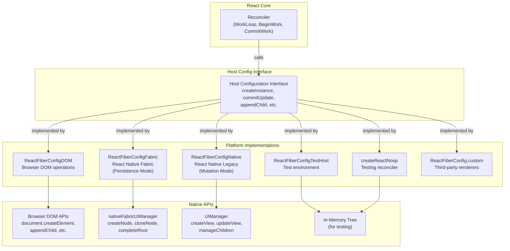
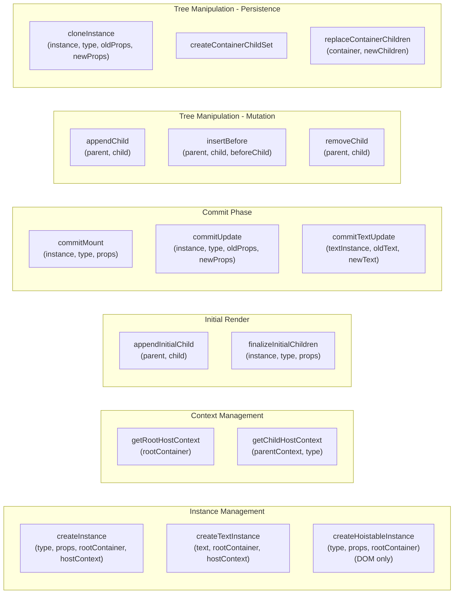
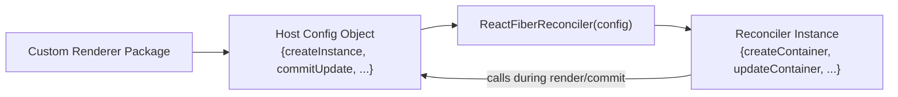

# 平台实现

<!-- > 来源：https://deepwiki.com/facebook/react/6-platform-implementations -->

<details>
<summary>相关源文件</summary>

以下文件用于生成此 wiki 页面的上下文：

- [.eslintrc.js](.eslintrc.js)
- [fixtures/view-transition/README.md](fixtures/view-transition/README.md)
- [fixtures/view-transition/public/favicon.ico](fixtures/view-transition/public/favicon.ico)
- [fixtures/view-transition/public/index.html](fixtures/view-transition/public/index.html)
- [fixtures/view-transition/src/components/Chrome.css](fixtures/view-transition/src/components/Chrome.css)
- [fixtures/view-transition/src/components/Chrome.js](fixtures/view-transition/src/components/Chrome.js)
- [fixtures/view-transition/src/components/Page.css](fixtures/view-transition/src/components/Page.css)
- [fixtures/view-transition/src/components/Page.js](fixtures/view-transition/src/components/Page.js)
- [fixtures/view-transition/src/components/SwipeRecognizer.js](fixtures/view-transition/src/components/SwipeRecognizer.js)
- [package.json](package.json)
- [packages/eslint-plugin-react-hooks/package.json](packages/eslint-plugin-react-hooks/package.json)
- [packages/jest-react/package.json](packages/jest-react/package.json)
- [packages/react-art/package.json](packages/react-art/package.json)
- [packages/react-art/src/ReactFiberConfigART.js](packages/react-art/src/ReactFiberConfigART.js)
- [packages/react-dom-bindings/src/client/ReactFiberConfigDOM.js](packages/react-dom-bindings/src/client/ReactFiberConfigDOM.js)
- [packages/react-dom/package.json](packages/react-dom/package.json)
- [packages/react-is/package.json](packages/react-is/package.json)
- [packages/react-native-renderer/package.json](packages/react-native-renderer/package.json)
- [packages/react-native-renderer/src/ReactFiberConfigFabric.js](packages/react-native-renderer/src/ReactFiberConfigFabric.js)
- [packages/react-native-renderer/src/ReactFiberConfigNative.js](packages/react-native-renderer/src/ReactFiberConfigNative.js)
- [packages/react-noop-renderer/package.json](packages/react-noop-renderer/package.json)
- [packages/react-noop-renderer/src/createReactNoop.js](packages/react-noop-renderer/src/createReactNoop.js)
- [packages/react-reconciler/package.json](packages/react-reconciler/package.json)
- [packages/react-reconciler/src/ReactFiberApplyGesture.js](packages/react-reconciler/src/ReactFiberApplyGesture.js)
- [packages/react-reconciler/src/ReactFiberCommitViewTransitions.js](packages/react-reconciler/src/ReactFiberCommitViewTransitions.js)
- [packages/react-reconciler/src/ReactFiberConfigWithNoMutation.js](packages/react-reconciler/src/ReactFiberConfigWithNoMutation.js)
- [packages/react-reconciler/src/ReactFiberGestureScheduler.js](packages/react-reconciler/src/ReactFiberGestureScheduler.js)
- [packages/react-reconciler/src/ReactFiberViewTransitionComponent.js](packages/react-reconciler/src/ReactFiberViewTransitionComponent.js)
- [packages/react-reconciler/src/__tests__/ReactFiberHostContext-test.internal.js](packages/react-reconciler/src/__tests__/ReactFiberHostContext-test.internal.js)
- [packages/react-reconciler/src/forks/ReactFiberConfig.custom.js](packages/react-reconciler/src/forks/ReactFiberConfig.custom.js)
- [packages/react-test-renderer/package.json](packages/react-test-renderer/package.json)
- [packages/react-test-renderer/src/ReactFiberConfigTestHost.js](packages/react-test-renderer/src/ReactFiberConfigTestHost.js)
- [packages/react/package.json](packages/react/package.json)
- [packages/scheduler/package.json](packages/scheduler/package.json)
- [packages/shared/ReactVersion.js](packages/shared/ReactVersion.js)
- [scripts/flow/config/flowconfig](scripts/flow/config/flowconfig)
- [scripts/flow/createFlowConfigs.js](scripts/flow/createFlowConfigs.js)
- [scripts/flow/environment.js](scripts/flow/environment.js)
- [scripts/rollup/validate/eslintrc.cjs.js](scripts/rollup/validate/eslintrc.cjs.js)
- [scripts/rollup/validate/eslintrc.cjs2015.js](scripts/rollup/validate/eslintrc.cjs2015.js)
- [scripts/rollup/validate/eslintrc.esm.js](scripts/rollup/validate/eslintrc.esm.js)
- [scripts/rollup/validate/eslintrc.fb.js](scripts/rollup/validate/eslintrc.fb.js)
- [scripts/rollup/validate/eslintrc.rn.js](scripts/rollup/validate/eslintrc.rn.js)
- [yarn.lock](yarn.lock)

</details>


## 目的与范围

本节文档介绍 React 的**平台实现**——将 React 的 Reconciler 适配到特定环境的具体 renderer。React 维护了浏览器 DOM 的官方实现（[React DOM 实现](#6.1)）和 React Native 的官方实现（[React Native Renderers](#6.2)），以及客户端 hydration（[Hydration 系统](#6.3)）和视图过渡（[视图过渡与手势调度](#6.4)）等专门功能。

这些不同平台的基础是**Host Configuration 抽象层**——Reconciler 与平台特定代码之间的接口。Host Config 提供了平台特定的操作实现，如创建实例、更新属性和管理树结构。该抽象使同一套 Reconciler 逻辑能够渲染到浏览器 DOM、React Native、基于 Canvas 的 renderer、测试环境以及自定义目标。

关于 Reconciler 的架构及其如何处理 Fiber 树，请参阅 [React Reconciler](#4)。

## 平台概览

React 的架构将**Reconciler**（平台无关的树 diff 和调度）与**renderer**（平台特定的实例管理和 DOM/原生操作）分离。主要平台包括：

**React DOM**（[ReactFiberConfigDOM](#6.1)）：渲染到浏览器 DOM。支持 mutation 模式、服务端渲染 HTML 的 hydration、资源管理（样式表、脚本）、单例组件（document head）和视图过渡。

**React Native Fabric**（[ReactFiberConfigFabric](#6.2)）：新的 React Native 架构，使用 persistence 模式，具有不可变的 shadow 节点。通过 `nativeFabricUIManager` 进行原生 UI 操作通信。

**React Native Legacy**（[ReactFiberConfigNative](#6.2)）：原始 React Native renderer，使用 mutation 模式。通过 `UIManager` 进行原生视图管理通信。

**Test Renderer**（[ReactFiberConfigTestHost](#6.2)）：用于快照测试的内存树表示，无需实际渲染。

**Noop Renderer**（createReactNoop）：仅用于测试的 renderer，同时支持 mutation 和 persistence 模式，用于验证 Reconciler 行为。

每个平台都实现了 Host Configuration 接口，以提供其特定行为，同时使用共享的 Reconciler 逻辑。

**来源：** [packages/react-dom-bindings/src/client/ReactFiberConfigDOM.js:1-153](), [packages/react-native-renderer/src/ReactFiberConfigFabric.js:1-82](), [packages/react-native-renderer/src/ReactFiberConfigNative.js:1-58](), [packages/react-test-renderer/src/ReactFiberConfigTestHost.js:1-26](), [packages/react-noop-renderer/src/createReactNoop.js:1-111]()

## Host Configuration 架构

Host Configuration 接口定义了 Reconciler 与平台之间的契约。Reconciler 在渲染和提交阶段调用 Host Config 方法，以执行平台特定操作。每个 renderer（react-dom、react-native-renderer、react-test-renderer 等）都提供该接口的自己的实现。



**来源：** [packages/react-dom-bindings/src/client/ReactFiberConfigDOM.js:1-292](), [packages/react-native-renderer/src/ReactFiberConfigFabric.js:1-160](), [packages/react-native-renderer/src/ReactFiberConfigNative.js:1-115](), [packages/react-test-renderer/src/ReactFiberConfigTestHost.js:1-59](), [packages/react-noop-renderer/src/createReactNoop.js:1-111]()

## 核心 Host Configuration 方法

Host Configuration 接口包含多个类别的方法，Reconciler 在渲染过程的不同阶段调用这些方法。



**来源：** [packages/react-dom-bindings/src/client/ReactFiberConfigDOM.js:484-608](), [packages/react-native-renderer/src/ReactFiberConfigFabric.js:176-220](), [packages/react-native-renderer/src/ReactFiberConfigNative.js:130-169](), [packages/react-reconciler/src/forks/ReactFiberConfig.custom.js:56-188]()

## 平台类型定义

每个平台实现都定义了自己的实例、容器和其他平台特定数据结构的类型：

| 类型 | ReactFiberConfigDOM | ReactFiberConfigFabric | ReactFiberConfigNative | ReactFiberConfigTestHost |
|------|---------------------|------------------------|------------------------|--------------------------|
| **Type** | `string` (元素标签名) | `string` (视图类型) | `string` (视图类型) | `string` |
| **Instance** | `Element` (DOM 元素) | `{node: Node, canonical: {...}}` (shadow 节点) | `ReactNativeFiberHostComponent` | `{type, props, children, tag: 'INSTANCE'}` |
| **TextInstance** | `Text` (DOM 文本节点) | `{node: Node}` (文本 shadow 节点) | `number` (文本标签) | `{text, tag: 'TEXT'}` |
| **Container** | `Element \| Document \| DocumentFragment` | `{containerTag: number, publicInstance}` | `{containerTag: number, publicInstance}` | `{children: [], createNodeMock, tag: 'CONTAINER'}` |
| **HostContext** | `HostContextNamespace` (0=None, 1=SVG, 2=Math) | `{isInAParentText: boolean}` | `{isInAParentText: boolean}` | `Object` (NO_CONTEXT) |
| **UpdatePayload** | `Array<mixed>` (属性更新) | `Object` (属性载荷) | `Object` (未使用) | `Object` |
| **Mode** | Mutation | Persistence | Mutation | Mutation |

**来源：** [packages/react-dom-bindings/src/client/ReactFiberConfigDOM.js:153-250](), [packages/react-native-renderer/src/ReactFiberConfigFabric.js:93-139](), [packages/react-native-renderer/src/ReactFiberConfigNative.js:59-73](), [packages/react-test-renderer/src/ReactFiberConfigTestHost.js:26-58]()

## Mutation 模式与 Persistence 模式

Host Configuration 可以根据平台能力以两种不同模式运行：

```mermaid
graph TB
    subgraph "Mutation Mode (DOM, React Native Legacy, Test Renderer)"
        MutationFlag["supportsMutation = true<br/>supportsPersistence = false"]
        
        MutationRender["Render Phase:<br/>Create instances and build tree"]
        MutationCommit["Commit Phase:<br/>Mutate existing instances in-place"]
        
        MutationOps["Operations:<br/>• appendChild<br/>• insertBefore<br/>• removeChild<br/>• commitUpdate (mutate props)<br/>• commitTextUpdate"]
        
        MutationFlag --> MutationRender
        MutationRender --> MutationCommit
        MutationCommit --> MutationOps
    end
    
    subgraph "Persistence Mode (React Native Fabric)"
        PersistenceFlag["supportsMutation = false<br/>supportsPersistence = true"]
        
        PersistenceRender["Render Phase:<br/>Clone and build new tree"]
        PersistenceCommit["Commit Phase:<br/>Replace entire tree atomically"]
        
        PersistenceOps["Operations:<br/>• cloneInstance<br/>• createContainerChildSet<br/>• appendChildToContainerChildSet<br/>• replaceContainerChildren<br/>• No in-place mutations"]
        
        PersistenceFlag --> PersistenceRender
        PersistenceRender --> PersistenceCommit
        PersistenceCommit --> PersistenceOps
    end
```



**Mutation 模式**（DOM、React Native Legacy）：实例可以就地修改。Reconciler 创建实例一次，然后通过调用 `commitUpdate`、`appendChild`、`removeChild` 等方法更新它们。这种方式内存效率更高，但需要仔细同步。

**Persistence 模式**（React Native Fabric）：实例是不可变的。Reconciler 克隆实例以创建修改版本，构建完整的新树，并原子性地替换旧树。这提供了更好的并发特性，并与 React Native 的新架构保持一致。

**来源：** [packages/react-dom-bindings/src/client/ReactFiberConfigDOM.js:811](), [packages/react-native-renderer/src/ReactFiberConfigFabric.js:449](), [packages/react-native-renderer/src/ReactFiberConfigNative.js:377](), [packages/react-reconciler/src/ReactFiberConfigWithNoMutation.js:22]()

## 平台特定的实例创建

每个平台根据其底层渲染 API 以不同方式实现 `createInstance`。DOM 创建实际的浏览器元素，并为 SVG/MathML 处理命名空间，而 React Native 分配标签并与原生 UI 管理器通信。有关详细实现细节，请参阅 [React DOM 实现](#6.1) 和 [React Native Renderers](#6.2)。

**DOM**：根据命名空间上下文调用 `document.createElement()` 或 `document.createElementNS()`，然后设置初始属性并缓存 Fiber 节点引用。

**React Native Fabric**：分配唯一标签，获取视图配置，创建属性载荷，并调用 `nativeFabricUIManager.createNode()` 创建不可变的 shadow 节点。

**React Native Legacy**：分配标签，创建更新载荷，调用 `UIManager.createView()`，并将结果包装在 `ReactNativeFiberHostComponent` 实例中。

**来源：** [packages/react-dom-bindings/src/client/ReactFiberConfigDOM.js:484-608](), [packages/react-native-renderer/src/ReactFiberConfigFabric.js:176-220](), [packages/react-native-renderer/src/ReactFiberConfigNative.js:130-169]()

## Host Context 管理

Host Context 在渲染期间沿树向下流动，并提供实例创建所需的命名空间/环境信息。不同平台将其用于不同目的：

**DOM**：跟踪命名空间（None、SVG、Math）以使用正确的命名空间创建元素。SVG 和 MathML 元素需要 `createElementNS`。

```
getRootHostContext: 从根元素确定初始命名空间
getChildHostContext: 进入/离开 <svg>、<math> 或 <foreignObject> 时更新命名空间
```

**React Native**：跟踪渲染是否发生在 Text 组件内，这会影响验证（文本字符串必须在 `<Text>` 内）。

```
getRootHostContext: 返回 {isInAParentText: false}
getChildHostContext: 根据组件类型（RCTText、AndroidTextInput 等）更新 isInAParentText
```

**Test/Noop Renderers**：返回常量 `NO_CONTEXT` 对象，因为不需要特殊上下文。

**来源：** [packages/react-dom-bindings/src/client/ReactFiberConfigDOM.js:302-406](), [packages/react-native-renderer/src/ReactFiberConfigFabric.js:259-291](), [packages/react-native-renderer/src/ReactFiberConfigNative.js:264-287]()

## 优先级与事件管理

Host Configuration 提供管理更新优先级和跟踪事件的方法：

| 方法 | 目的 | DOM 实现 | React Native 实现 |
|--------|---------|-------------------|----------------------------|
| `setCurrentUpdatePriority` | 设置当前更新优先级 | 存储在模块变量中 | 存储在模块变量中 |
| `getCurrentUpdatePriority` | 获取当前更新优先级 | 返回存储的优先级 | 返回存储的优先级 |
| `resolveUpdatePriority` | 解析一批工作的优先级 | 返回当前优先级或委托给事件优先级 | 返回当前或默认优先级 |
| `trackSchedulerEvent` | 跟踪当前浏览器事件 | 存储 `window.event` | 无操作 |
| `resolveEventType` | 获取当前事件类型 | 返回 `window.event.type` | 返回 null |
| `resolveEventTimeStamp` | 获取当前事件时间戳 | 返回 `window.event.timeStamp` | 返回 -1.1 |
| `shouldAttemptEagerTransition` | 检查是否应同步渲染过渡 | 检查是否为 `popstate` 事件 | 返回 false |

**来源：** [packages/react-dom-bindings/src/client/ReactFiberConfigDOM.js:709-747](), [packages/react-native-renderer/src/ReactFiberConfigFabric.js:386-433](), [packages/react-native-renderer/src/ReactFiberConfigNative.js:343-371]()

## Commit 生命周期方法

Reconciler 在提交阶段调用这些方法以完成更改：

**`prepareForCommit(containerInfo)`**：在开始修改之前调用。返回一个对象，该对象将传递给 `resetAfterCommit`。DOM 使用此方法禁用事件并捕获选择状态。React Native 返回 null（无操作）。

**`resetAfterCommit(containerInfo)`**：在修改完成后调用。DOM 恢复事件处理和选择。React Native 为无操作。

**`commitMount(instance, type, props, internalInstanceHandle)`**：对于从 `finalizeInitialChildren` 返回 `true` 的实例调用。用于实现应在实例进入树后发生的效果（例如，自动聚焦、触发图像加载事件）。

**`commitUpdate(instance, type, oldProps, newProps, internalInstanceHandle)`**：调用以使用新 props 更新现有实例。DOM 调用 `updateProperties` 来 diff 并应用属性更改。React Native 使用 diff 后的载荷调用 `UIManager.updateView`。

**`commitTextUpdate(textInstance, oldText, newText)`**：调用以更新文本节点。DOM 设置 `nodeValue`，React Native 调用 `UIManager.updateView`。

**来源：** [packages/react-dom-bindings/src/client/ReactFiberConfigDOM.js:412-450](), [packages/react-dom-bindings/src/client/ReactFiberConfigDOM.js:813-872](), [packages/react-dom-bindings/src/client/ReactFiberConfigDOM.js:917-942](), [packages/react-native-renderer/src/ReactFiberConfigNative.js:317-467]()

## Hydration 支持

React DOM 实现客户端 **hydration**，以将 React 附加到服务端渲染的 HTML。Host Config 提供了在初始渲染期间遍历和验证现有 DOM 节点的方法：

**`hydrateInstance(instance, type, props, hostContext)`**：验证并更新 DOM 元素以匹配 React props。如果属性不同，则返回更新载荷。

**`hydrateTextInstance(textInstance, text, internalInstanceHandle)`**：验证文本节点内容是否匹配预期文本。如果文本不同，返回 `true`（在 DEV 中触发警告）。

**`getNextHydratableSibling(instance)`**：返回下一个可被 hydration 的 DOM 兄弟节点。

**`getFirstHydratableChild(parentInstance)`**：返回 DOM 节点的第一个可 hydration 的子节点。

**`hydrateRootInstance(container)`**：清除注释节点并准备根容器以进行 hydration。

**`shouldDeleteUnhydratedTailInstances()`**：返回 `true` 以在 hydration 完成后删除剩余的 DOM 节点。

Hydration 过程处理不匹配、支持 Suspense 边界，并启用选择性 hydration 以改善交互时间。完整详细信息，请参阅 [Hydration 系统](#6.3)。

**来源：** [packages/react-dom-bindings/src/client/ReactFiberConfigDOM.js:1281-1590]()

## 视图过渡与手势调度

React DOM 包含对 View Transition API 的实验性支持，以在 UI 状态之间实现流畅的动画过渡。Host Config 提供了管理视图过渡实例和手势驱动动画的方法：

**`startViewTransition(root, updater, options)`**：启动视图过渡，带有用于自定义动画时间线的回调。

**`cloneMutableInstance(instance, keepChildren)`**：克隆 DOM 元素以创建视图过渡的动画对。

**视图过渡实例管理**：应用/恢复过渡名称、测量实例几何形状和跟踪视口可见性的方法。

**手势调度**：与手势识别器集成，以基于用户输入（滑动、拖拽）驱动视图过渡。

该系统与 `ReactFiberCommitViewTransitions` 协调，以识别动画元素、为动画对克隆实例、测量几何变化并执行过渡动画。完整详细信息，请参阅 [视图过渡与手势调度](#6.4)。

**来源：** [packages/react-dom-bindings/src/client/ReactFiberConfigDOM.js:613-638](), [packages/react-reconciler/src/ReactFiberCommitViewTransitions.js:1-50](), [packages/react-reconciler/src/ReactFiberApplyGesture.js:1-100]()

## 测试与第三方 Renderer

### Test Renderer

Test Renderer 创建内存树表示，无需渲染到任何实际表面。实例是具有 `tag: 'INSTANCE'` 或 `tag: 'TEXT'` 的普通对象。这用于快照测试，无需 DOM 即可断言 React 的输出。

**来源：** [packages/react-test-renderer/src/ReactFiberConfigTestHost.js:158-174](), [packages/react-test-renderer/src/ReactFiberConfigTestHost.js:216-227]()

### Noop Renderer

Noop Renderer 类似于 Test Renderer，但提供 mutation 和 persistence 模式的实现。它主要用于测试 Reconciler 本身，并在没有平台特定复杂性的情况下验证 Reconciler 行为。

**来源：** [packages/react-noop-renderer/src/createReactNoop.js:111-452]()

### 自定义 Renderer（第三方）

`react-reconciler` 包允许第三方通过将 Host Config 对象传递给 Reconciler 工厂函数来创建自定义 renderer。`ReactFiberConfig.custom.js` 文件充当一个 shim，从 `$$$config` 变量（作为参数传递给 Reconciler bundle）转发所有 Host Config 方法。



**来源：** [packages/react-reconciler/src/forks/ReactFiberConfig.custom.js:1-285](), [packages/react-reconciler/src/__tests__/ReactFiberHostContext-test.internal.js:41-121]()

## 可选功能与能力

Host Configuration 可以通过实现特定方法或设置标志来选择加入或退出各种功能：

| 功能 | 标志/方法 | DOM | Fabric | Native Legacy | Test |
|---------|-------------|-----|--------|---------------|------|
| **Mutation** | `supportsMutation` | ✓ | ✗ | ✓ | ✓ |
| **Persistence** | `supportsPersistence` | ✗ | ✓ | ✗ | ✗ |
| **Hydration** | `supportsHydration` | ✓ | ✗ | ✗ | ✗ |
| **Microtasks** | `supportsMicrotasks` | ✓ | ✗ | ✗ | ✗ |
| **Resources** | `supportsResources` | ✓ | ✗ | ✗ | ✗ |
| **Singletons** | `supportsSingletons` | ✓ | ✗ | ✗ | ✗ |
| **Test Selectors** | `supportsTestSelectors` | ✗ | ✗ | ✗ | ✗ |
| **Fragment Instances** | `createFragmentInstance` | ✓ | ✓ | No-op | No-op |
| **View Transitions** | `startViewTransition` | Planned | No-op | No-op | No-op |

大多数平台从不支持的模块（如 `ReactFiberConfigWithNoHydration`、`ReactFiberConfigWithNoResources` 等）导入默认实现，这些模块提供无操作实现或抛出错误。

**来源：** [packages/react-dom-bindings/src/client/ReactFiberConfigDOM.js:292](), [packages/react-native-renderer/src/ReactFiberConfigFabric.js:160-165](), [packages/react-native-renderer/src/ReactFiberConfigNative.js:115-121](), [packages/react-reconciler/src/ReactFiberConfigWithNoMutation.js:22-60]()

## 总结

Host Configuration 抽象是 React 平台独立性的基础。通过在 Reconciler 和平台特定代码之间定义清晰的接口，React 可以：

- 渲染到截然不同的目标（DOM、原生移动端、Canvas、终端等）
- 支持不同的渲染范式（mutation vs persistence）
- 针对平台特定能力进行优化（hydration、resources、singletons）
- 在不 fork Reconciler 的情况下启用第三方 renderer

每个平台实现都根据其约束做出权衡——DOM 使用 mutation 以提高效率和支持 hydration，Fabric 使用 persistence 以获得更好的并发性，Test Renderer 优先考虑简单性和确定性。Host Config 接口适应所有这些方法，同时保持 Reconciler 的核心逻辑与平台无关。
