# React DOM 实现

<!-- > Source: https://deepwiki.com/facebook/react/6.1-react-dom-implementation -->

相关源文件

以下文件用于生成此 wiki 页面的上下文：

- [.eslintrc.js](.eslintrc.js)
- [fixtures/view-transition/README.md](fixtures/view-transition/README.md)
- [fixtures/view-transition/public/favicon.ico](fixtures/view-transition/public/favicon.ico)
- [fixtures/view-transition/public/index.html](fixtures/view-transition/public/index.html)
- [fixtures/view-transition/src/components/Chrome.css](fixtures/view-transition/src/components/Chrome.css)
- [fixtures/view-transition/src/components/Chrome.js](fixtures/view-transition/src/components/Chrome.js)
- [fixtures/view-transition/src/components/Page.css](fixtures/view-transition/src/components/Page.css)
- [fixtures/view-transition/src/components/Page.js](fixtures/view-transition/src/components/Page.js)
- [fixtures/view-transition/src/components/SwipeRecognizer.js](fixtures/view-transition/src/components/SwipeRecognizer.js)
- [package.json](package.json)
- [packages/eslint-plugin-react-hooks/package.json](https://github.com/facebook/react/blob/main/packages/eslint-plugin-react-hooks/package.json)
- [packages/jest-react/package.json](https://github.com/facebook/react/blob/main/packages/jest-react/package.json)
- [packages/react-art/package.json](https://github.com/facebook/react/blob/main/packages/react-art/package.json)
- [packages/react-art/src/ReactFiberConfigART.js](https://github.com/facebook/react/blob/main/packages/react-art/src/ReactFiberConfigART.js)
- [packages/react-dom-bindings/src/client/ReactFiberConfigDOM.js](https://github.com/facebook/react/blob/main/packages/react-dom-bindings/src/client/ReactFiberConfigDOM.js)
- [packages/react-dom/package.json](https://github.com/facebook/react/blob/main/packages/react-dom/package.json)
- [packages/react-is/package.json](https://github.com/facebook/react/blob/main/packages/react-is/package.json)
- [packages/react-native-renderer/package.json](https://github.com/facebook/react/blob/main/packages/react-native-renderer/package.json)
- [packages/react-native-renderer/src/ReactFiberConfigFabric.js](https://github.com/facebook/react/blob/main/packages/react-native-renderer/src/ReactFiberConfigFabric.js)
- [packages/react-native-renderer/src/ReactFiberConfigNative.js](https://github.com/facebook/react/blob/main/packages/react-native-renderer/src/ReactFiberConfigNative.js)
- [packages/react-noop-renderer/package.json](https://github.com/facebook/react/blob/main/packages/react-noop-renderer/package.json)
- [packages/react-noop-renderer/src/createReactNoop.js](https://github.com/facebook/react/blob/main/packages/react-noop-renderer/src/createReactNoop.js)
- [packages/react-reconciler/package.json](https://github.com/facebook/react/blob/main/packages/react-reconciler/package.json)
- [packages/react-reconciler/src/ReactFiberApplyGesture.js](https://github.com/facebook/react/blob/main/packages/react-reconciler/src/ReactFiberApplyGesture.js)
- [packages/react-reconciler/src/ReactFiberCommitViewTransitions.js](https://github.com/facebook/react/blob/main/packages/react-reconciler/src/ReactFiberCommitViewTransitions.js)
- [packages/react-reconciler/src/ReactFiberConfigWithNoMutation.js](https://github.com/facebook/react/blob/main/packages/react-reconciler/src/ReactFiberConfigWithNoMutation.js)
- [packages/react-reconciler/src/ReactFiberGestureScheduler.js](https://github.com/facebook/react/blob/main/packages/react-reconciler/src/ReactFiberGestureScheduler.js)
- [packages/react-reconciler/src/ReactFiberViewTransitionComponent.js](https://github.com/facebook/react/blob/main/packages/react-reconciler/src/ReactFiberViewTransitionComponent.js)
- [packages/react-reconciler/src/__tests__/ReactFiberHostContext-test.internal.js](https://github.com/facebook/react/blob/main/packages/react-reconciler/src/__tests__/ReactFiberHostContext-test.internal.js)
- [packages/react-reconciler/src/forks/ReactFiberConfig.custom.js](https://github.com/facebook/react/blob/main/packages/react-reconciler/src/forks/ReactFiberConfig.custom.js)
- [packages/react-test-renderer/package.json](https://github.com/facebook/react/blob/main/packages/react-test-renderer/package.json)
- [packages/react-test-renderer/src/ReactFiberConfigTestHost.js](https://github.com/facebook/react/blob/main/packages/react-test-renderer/src/ReactFiberConfigTestHost.js)
- [packages/react/package.json](https://github.com/facebook/react/blob/main/packages/react/package.json)
- [packages/scheduler/package.json](https://github.com/facebook/react/blob/main/packages/scheduler/package.json)
- [packages/shared/ReactVersion.js](https://github.com/facebook/react/blob/main/packages/shared/ReactVersion.js)
- [scripts/flow/config/flowconfig](scripts/flow/config/flowconfig)
- [scripts/flow/createFlowConfigs.js](scripts/flow/createFlowConfigs.js)
- [scripts/flow/environment.js](scripts/flow/environment.js)
- [scripts/rollup/validate/eslintrc.cjs.js](scripts/rollup/validate/eslintrc.cjs.js)
- [scripts/rollup/validate/eslintrc.cjs2015.js](scripts/rollup/validate/eslintrc.cjs2015.js)
- [scripts/rollup/validate/eslintrc.esm.js](scripts/rollup/validate/eslintrc.esm.js)
- [scripts/rollup/validate/eslintrc.fb.js](scripts/rollup/validate/eslintrc.fb.js)
- [scripts/rollup/validate/eslintrc.rn.js](scripts/rollup/validate/eslintrc.rn.js)
- [yarn.lock](yarn.lock)

## 目的与范围

本文档介绍 React DOM 宿主配置实现（`ReactFiberConfigDOM`），它作为 React 协调器与浏览器 DOM API 之间的桥梁。该实现定义了 React 在渲染和提交阶段如何创建、更新和管理 DOM 元素。

关于宿主配置抽象本身的更多信息，请参阅[宿主配置抽象](/4.6-host-configuration-abstraction)。关于 Hydration 特定功能，请参阅[Hydration 系统](/6.3-hydration-system)。关于视图过渡协调，请参阅[视图过渡与手势调度](/6.4-view-transitions-and-gesture-scheduling)。

**Sources:** [packages/react-dom-bindings/src/client/ReactFiberConfigDOM.js#L1-L150](https://github.com/facebook/react/blob/main/packages/react-dom-bindings/src/client/ReactFiberConfigDOM.js#L1-L150)

## 架构概览

DOM 宿主配置实现了 React 协调器期望的接口，将协调器操作转换为浏览器 DOM 操作。它以变更模式运行，在变更发生时直接修改 DOM 树。

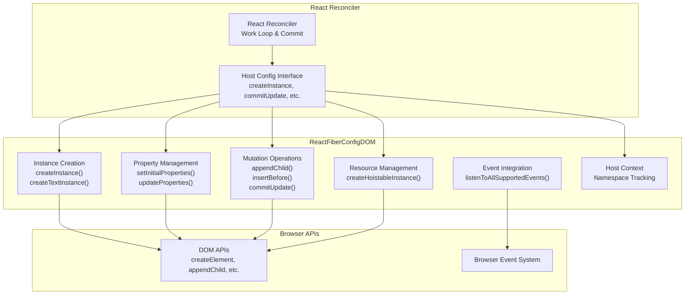

**Sources:** [packages/react-dom-bindings/src/client/ReactFiberConfigDOM.js#L1-L292](https://github.com/facebook/react/blob/main/packages/react-dom-bindings/src/client/ReactFiberConfigDOM.js#L1-L292)

## 类型系统

ReactFiberConfigDOM 定义了在协调器中表示 DOM 构造的核心类型。

### 核心类型

| Type | Definition | Description |
|------|------------|-------------|
| `Type` | `string` | 元素类型（例如 'div'、'span'） |
| `Props` | `object` | 包含 DOM 特定属性的 React props 对象 |
| `Container` | `Element \| Document \| DocumentFragment` | 带有 `_reactRootContainer` 字段的根容器元素 |
| `Instance` | `Element` | DOM 元素实例 |
| `TextInstance` | `Text` | DOM 文本节点 |
| `HostContext` | `HostContextDev \| HostContextProd` | 命名空间上下文（SVG、MathML 或 HTML） |
| `UpdatePayload` | `Array<mixed>` | 交替的属性键和值数组 |

**Sources:** [packages/react-dom-bindings/src/client/ReactFiberConfigDOM.js#L153-L248](https://github.com/facebook/react/blob/main/packages/react-dom-bindings/src/client/ReactFiberConfigDOM.js#L153-L248)

### 实例类型图

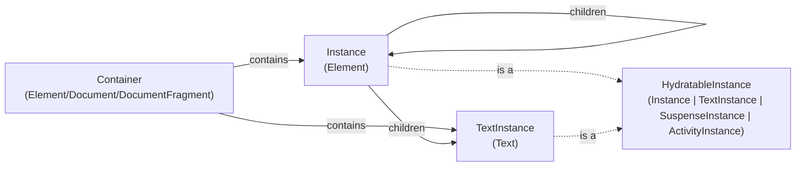

**Sources:** [packages/react-dom-bindings/src/client/ReactFiberConfigDOM.js#L211-L237](https://github.com/facebook/react/blob/main/packages/react-dom-bindings/src/client/ReactFiberConfigDOM.js#L211-L237)

## 宿主上下文管理

宿主上下文跟踪当前命名空间（HTML、SVG、MathML），确保使用正确的命名空间 URI 创建元素。这对于在 HTML 文档中正确渲染 SVG 和 MathML 元素至关重要。

### 命名空间常量

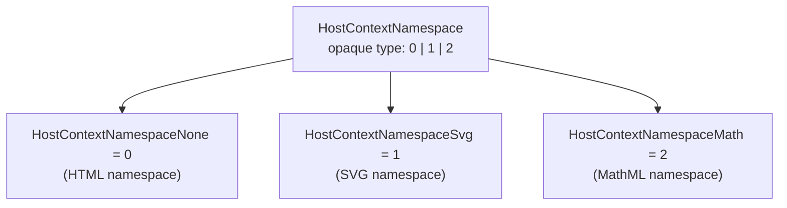

### 上下文流程

协调器在进入根容器时调用 `getRootHostContext`，然后为每个子元素调用 `getChildHostContext` 以确定适当的命名空间。

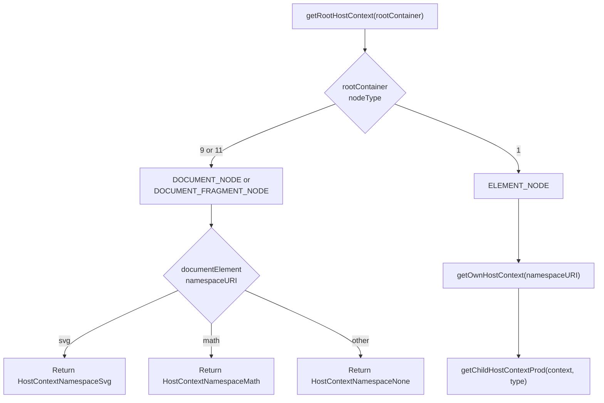

关键函数：
- `getRootHostContext(rootContainerInstance)` [packages/react-dom-bindings/src/client/ReactFiberConfigDOM.js#L302-L355](https://github.com/facebook/react/blob/main/packages/react-dom-bindings/src/client/ReactFiberConfigDOM.js#L302-L355)
- `getChildHostContext(parentHostContext, type)` [packages/react-dom-bindings/src/client/ReactFiberConfigDOM.js#L391-L406](https://github.com/facebook/react/blob/main/packages/react-dom-bindings/src/client/ReactFiberConfigDOM.js#L391-L406)
- `getChildHostContextProd(parentNamespace, type)` [packages/react-dom-bindings/src/client/ReactFiberConfigDOM.js#L368-L389](https://github.com/facebook/react/blob/main/packages/react-dom-bindings/src/client/ReactFiberConfigDOM.js#L368-L389)

### 命名空间转换

命名空间转换有特殊处理：
- 从 HTML 进入 `<svg>` 切换到 SVG 命名空间
- 从 HTML 进入 `<math>` 切换到 MathML 命名空间
- SVG 内的 `<foreignObject>` 返回到 HTML 命名空间

**Sources:** [packages/react-dom-bindings/src/client/ReactFiberConfigDOM.js#L284-L406](https://github.com/facebook/react/blob/main/packages/react-dom-bindings/src/client/ReactFiberConfigDOM.js#L284-L406)

## 实例创建

DOM 实例在协调器的渲染阶段创建，在提交阶段完成。

### 常规实例创建

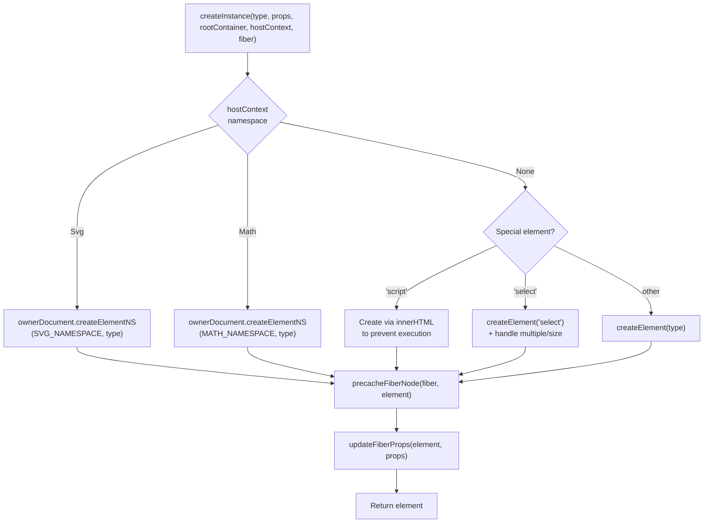

`createInstance` 函数：
1. 从根容器确定所有者文档
2. 使用适当的命名空间创建元素
3. 通过 `precacheFiberNode` 缓存 fiber 到 DOM 的映射
4. 通过 `updateFiberProps` 在 DOM 节点上存储 props
5. 不调用 `setInitialProperties`（这发生在 `finalizeInitialChildren` 中）

**Sources:** [packages/react-dom-bindings/src/client/ReactFiberConfigDOM.js#L484-L608](https://github.com/facebook/react/blob/main/packages/react-dom-bindings/src/client/ReactFiberConfigDOM.js#L484-L608)

### 可提升实例创建

可提升实例是特殊的 DOM 元素（如 `<link>`、`<style>`、`<script>`），可以“提升”到文档头部以进行资源管理。

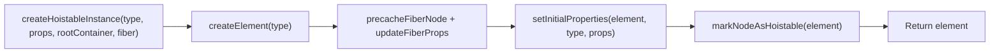

**Sources:** [packages/react-dom-bindings/src/client/ReactFiberConfigDOM.js#L452-L468](https://github.com/facebook/react/blob/main/packages/react-dom-bindings/src/client/ReactFiberConfigDOM.js#L452-L468)

### 文本实例创建

文本节点更简单：

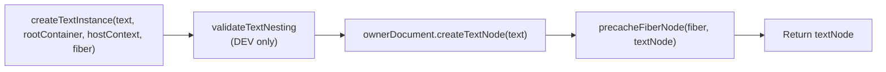

**Sources:** [packages/react-dom-bindings/src/client/ReactFiberConfigDOM.js#L679-L701](https://github.com/facebook/react/blob/main/packages/react-dom-bindings/src/client/ReactFiberConfigDOM.js#L679-L701)

## 属性管理

属性（React props）通过专门的辅助模块转换为 DOM 属性和特性。

### 属性应用流程

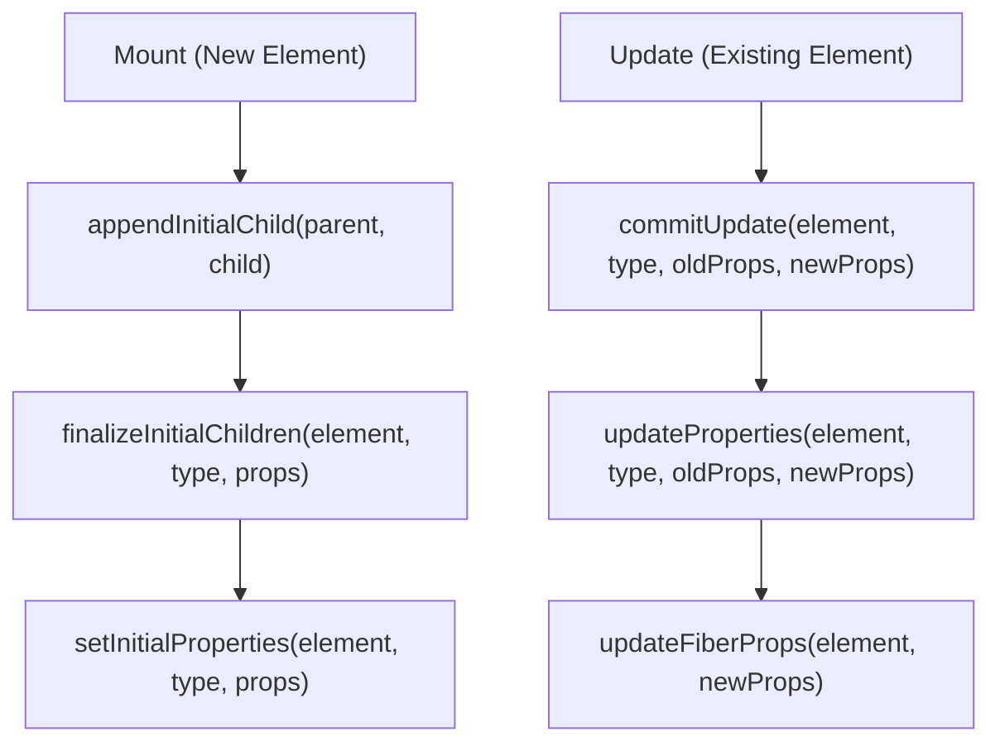

来自 `ReactDOMComponent` 的关键函数：
- `setInitialProperties(domElement, tag, props)` - 在完成阶段应用 [packages/react-dom-bindings/src/client/ReactDOMComponent.js](https://github.com/facebook/react/blob/main/packages/react-dom-bindings/src/client/ReactDOMComponent.js)
- `updateProperties(domElement, tag, lastProps, nextProps)` - 在提交更新时应用 [packages/react-dom-bindings/src/client/ReactDOMComponent.js](https://github.com/facebook/react/blob/main/packages/react-dom-bindings/src/client/ReactDOMComponent.js)

特殊属性处理包括：
- `dangerouslySetInnerHTML` - 设置 innerHTML
- `children`（当为字符串/数字时）- 设置 textContent
- `style` - 对象转换为 CSS 字符串
- `autoFocus` - 在 `commitMount` 中处理
- 事件处理器 - 在事件系统中注册
- `value`、`checked`、`selected` - 表单控件的特殊属性

**Sources:** [packages/react-dom-bindings/src/client/ReactFiberConfigDOM.js#L78-L86](https://github.com/facebook/react/blob/main/packages/react-dom-bindings/src/client/ReactFiberConfigDOM.js#L78-L86), [packages/react-dom-bindings/src/client/ReactFiberConfigDOM.js#L917-L930](https://github.com/facebook/react/blob/main/packages/react-dom-bindings/src/client/ReactFiberConfigDOM.js#L917-L930)

## 变更操作

ReactFiberConfigDOM 以变更模式运行（`supportsMutation = true`），直接修改 DOM 树。所有变更操作在可用时都支持 `moveBefore` API。

### 核心变更方法

| Method | Purpose | When Called |
|--------|---------|-------------|
| `appendChild(parent, child)` | 将子节点追加到末尾 | 更新期间重新定位 |
| `appendChildToContainer(container, child)` | 追加到根容器 | 挂载根内容 |
| `insertBefore(parent, child, before)` | 在兄弟节点之前插入子节点 | 重新排序、插入 |
| `insertInContainerBefore(container, child, before)` | 在根容器中插入到兄弟节点之前 | 根级插入 |
| `removeChild(parent, child)` | 从父节点移除子节点 | 删除 |
| `removeChildFromContainer(container, child)` | 从根容器移除 | 根级删除 |

### moveBefore 特性检测

React 在可用时检测并使用 `moveBefore` DOM API，以实现更高效的重新定位：

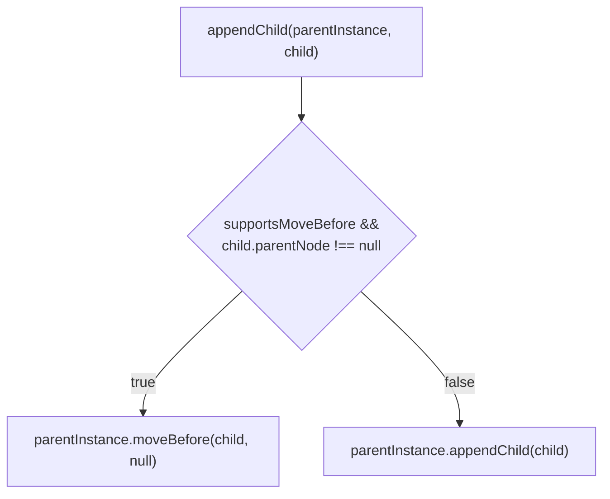

**Sources:** [packages/react-dom-bindings/src/client/ReactFiberConfigDOM.js#L944-L960](https://github.com/facebook/react/blob/main/packages/react-dom-bindings/src/client/ReactFiberConfigDOM.js#L944-L960)

### 提交操作

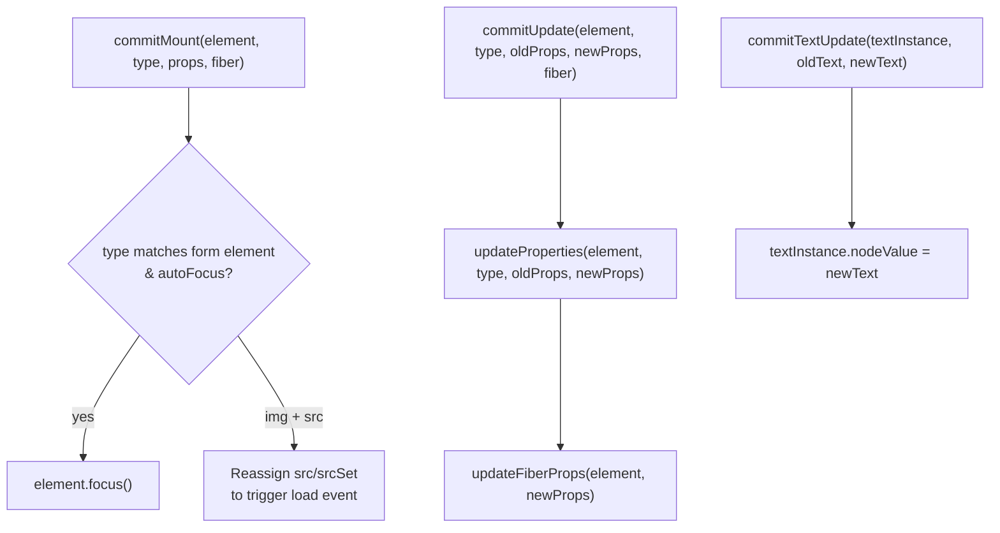

**Sources:** [packages/react-dom-bindings/src/client/ReactFiberConfigDOM.js#L813-L872](https://github.com/facebook/react/blob/main/packages/react-dom-bindings/src/client/ReactFiberConfigDOM.js#L813-L872), [packages/react-dom-bindings/src/client/ReactFiberConfigDOM.js#L917-L942](https://github.com/facebook/react/blob/main/packages/react-dom-bindings/src/client/ReactFiberConfigDOM.js#L917-L942)

## 事件系统集成

ReactFiberConfigDOM 通过几个关键函数与 React 的合成事件系统集成。

### 事件设置

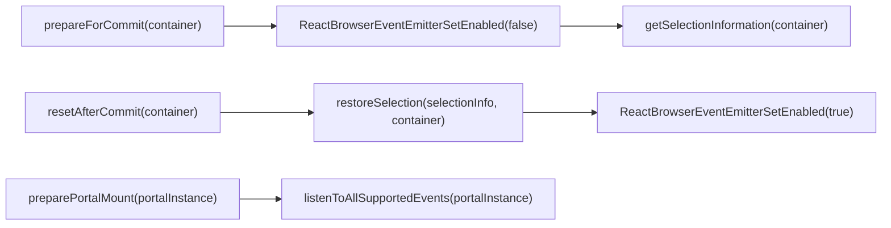

在提交期间，事件系统会暂时禁用，以防止在 DOM 被变更时触发不必要的事件分发。

**Sources:** [packages/react-dom-bindings/src/client/ReactFiberConfigDOM.js#L412-L450](https://github.com/facebook/react/blob/main/packages/react-dom-bindings/src/client/ReactFiberConfigDOM.js#L412-L450), [packages/react-dom-bindings/src/client/ReactFiberConfigDOM.js#L767-L769](https://github.com/facebook/react/blob/main/packages/react-dom-bindings/src/client/ReactFiberConfigDOM.js#L767-L769)

### 优先级和事件跟踪

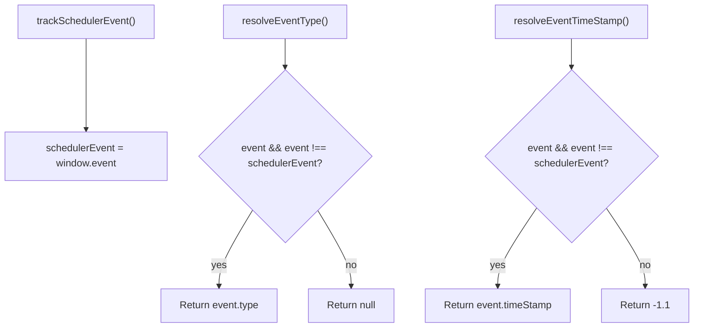

这些函数帮助协调器确定当前事件的优先级和性质，以便进行调度。

**Sources:** [packages/react-dom-bindings/src/client/ReactFiberConfigDOM.js#L734-L747](https://github.com/facebook/react/blob/main/packages/react-dom-bindings/src/client/ReactFiberConfigDOM.js#L734-L747)

### 急切过渡

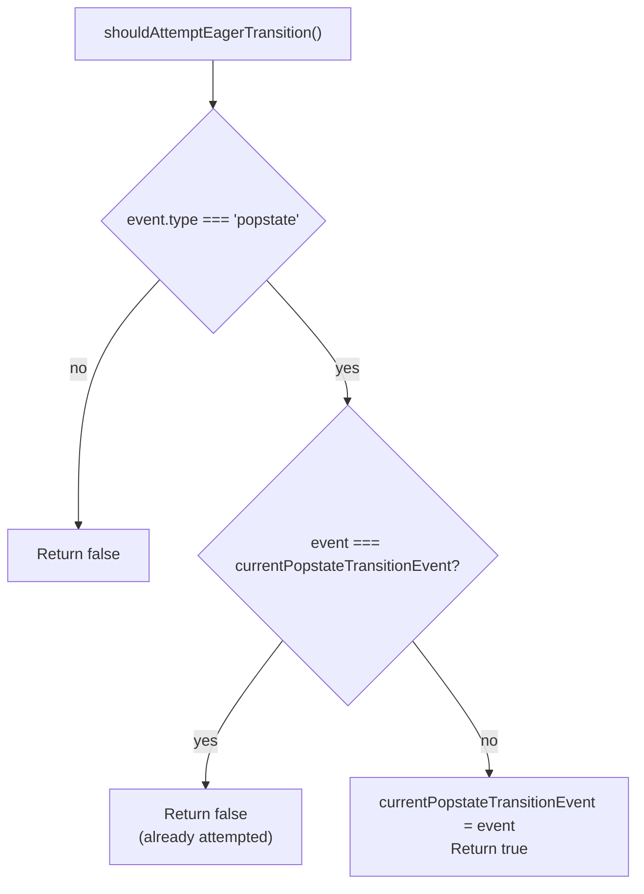

此优化尝试同步渲染 popstate 过渡，以避免浏览器历史导航期间的闪烁。

**Sources:** [packages/react-dom-bindings/src/client/ReactFiberConfigDOM.js#L709-L732](https://github.com/facebook/react/blob/main/packages/react-dom-bindings/src/client/ReactFiberConfigDOM.js#L709-L732)

## 资源管理

ReactFiberConfigDOM 实现了对“可提升”资源的特殊处理——这些元素（如样式表和脚本）应该是文档头部的单例实例。

### 可提升元素

资源通过 `markNodeAsHoistable` 函数标记为可提升，该函数在 DOM 节点上设置内部标志：

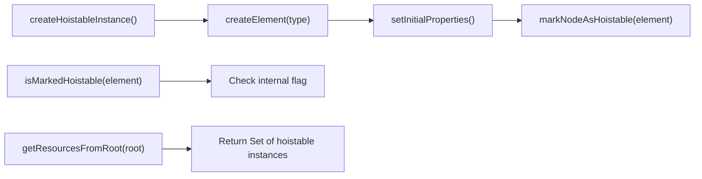

提升机制确保：
- 多个相同的 `<link>` 或 `<script>` 元素会被去重
- 资源被移动到文档 `<head>`
- 如果资源在树中保持存在，它们会在重新渲染时持续存在

**Sources:** [packages/react-dom-bindings/src/client/ReactDOMComponentTree.js#L56-L59](https://github.com/facebook/react/blob/main/packages/react-dom-bindings/src/client/ReactDOMComponentTree.js#L56-L59), [packages/react-dom-bindings/src/client/ReactFiberConfigDOM.js#L452-L468](https://github.com/facebook/react/blob/main/packages/react-dom-bindings/src/client/ReactFiberConfigDOM.js#L452-L468)

### 资源验证

对于样式表链接，React 验证 props 以确保正确的资源语义：

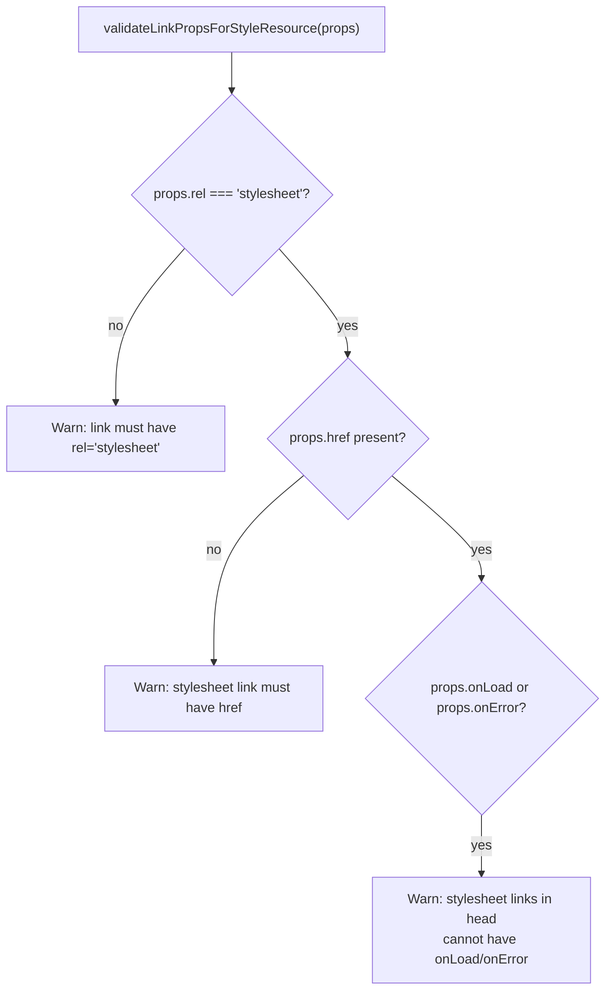

**Sources:** [packages/react-dom-bindings/src/shared/ReactDOMResourceValidation.js:138](https://github.com/facebook/react/blob/main/packages/react-dom-bindings/src/shared/ReactDOMResourceValidation.js:138)

## 特殊元素处理

几种元素类型需要超出标准属性应用的特殊处理。

### Script 元素

Script 标签必须以防止执行的方式创建：

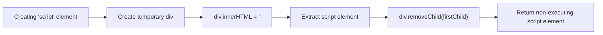

这确保脚本在渲染期间不会执行，仅在明确挂载时在提交期间执行。

**Sources:** [packages/react-dom-bindings/src/client/ReactFiberConfigDOM.js#L523-L542](https://github.com/facebook/react/blob/main/packages/react-dom-bindings/src/client/ReactFiberConfigDOM.js#L523-L542)

### Select 元素

Select 元素特殊处理 `multiple` 和 `size` props：

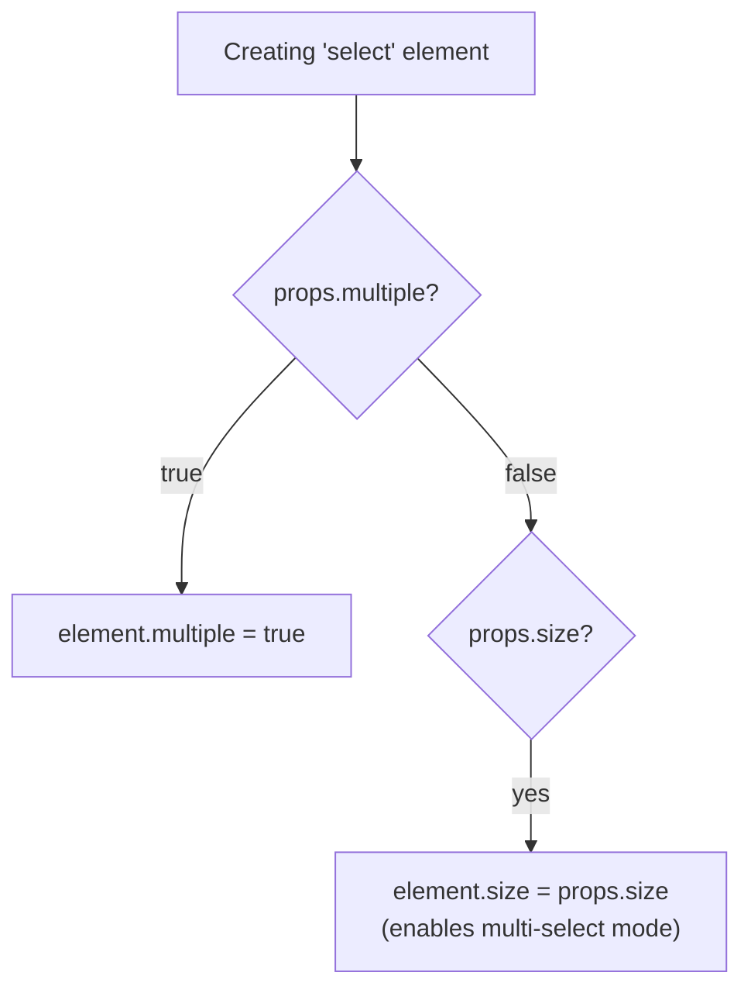

**Sources:** [packages/react-dom-bindings/src/client/ReactFiberConfigDOM.js#L544-L562](https://github.com/facebook/react/blob/main/packages/react-dom-bindings/src/client/ReactFiberConfigDOM.js#L544-L562)

### 表单控件（Input、Textarea、Select）

表单控件有专门的 prop 处理：
- `finalizeInitialChildren` 对 inputs、selects、textareas 返回 `true` 以调度 `commitMount`
- `commitMount` 通过调用 `element.focus()` 处理 `autoFocus`
- 专用模块处理受控与非受控状态：`ReactDOMInput`、`ReactDOMTextarea`、`ReactDOMSelect`

**Sources:** [packages/react-dom-bindings/src/client/ReactFiberConfigDOM.js#L625-L643](https://github.com/facebook/react/blob/main/packages/react-dom-bindings/src/client/ReactFiberConfigDOM.js#L625-L643), [packages/react-dom-bindings/src/client/ReactFiberConfigDOM.js#L813-L872](https://github.com/facebook/react/blob/main/packages/react-dom-bindings/src/client/ReactFiberConfigDOM.js#L813-L872)

### Image 元素

Image 元素在 `commitMount` 中接收特殊处理，以确保 `onLoad` 事件正确触发：

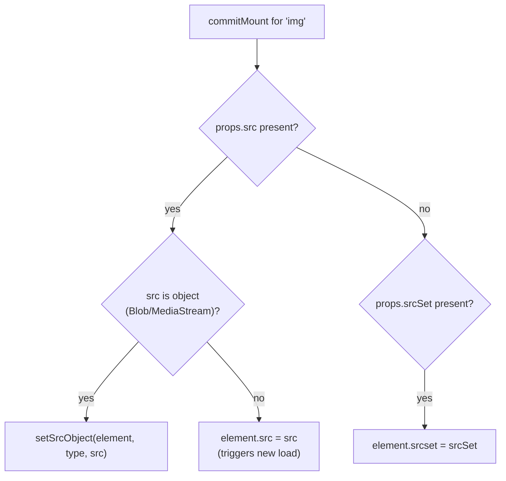

重新赋值确保即使图像已经加载，`onLoad` 处理器也会再次被调用。

**Sources:** [packages/react-dom-bindings/src/client/ReactFiberConfigDOM.js#L838-L869](https://github.com/facebook/react/blob/main/packages/react-dom-bindings/src/client/ReactFiberConfigDOM.js#L838-L869)

## Hydration 支持

ReactFiberConfigDOM 提供 Hydration 函数，在客户端 Hydration 期间将服务器渲染的 HTML 与 React 的虚拟 DOM 匹配。这是一个大主题，在[Hydration 系统](/6.3-hydration-system)中有详细说明。

导出的关键 Hydration 函数：
- `hydrateProperties(domElement, tag, props)` - 匹配并验证 props
- `hydrateText(textInstance, text)` - 验证文本内容
- `diffHydratedProperties(domElement, tag, props)` - 为不匹配生成更新负载
- `diffHydratedText(textInstance, text)` - 检查文本不匹配

Hydration 还处理特殊情况：
- 脱水的 Suspense 边界（用注释节点标记）
- 用于在 SSR 中保留表单数据的表单状态标记
- 通过 `hydrateInput`、`hydrateTextarea`、`hydrateSelect` 进行 Input/textarea/select 状态同步

**Sources:** [packages/react-dom-bindings/src/client/ReactFiberConfigDOM.js#L81-L89](https://github.com/facebook/react/blob/main/packages/react-dom-bindings/src/client/ReactFiberConfigDOM.js#L81-L89), [packages/react-dom-bindings/src/client/ReactFiberConfigDOM.js#L874-L915](https://github.com/facebook/react/blob/main/packages/react-dom-bindings/src/client/ReactFiberConfigDOM.js#L874-L915)

## 视图过渡与调度

ReactFiberConfigDOM 包含视图过渡的存根和部分实现，这些功能支持状态之间的动画过渡。完整细节在[视图过渡与手势调度](/6.4-view-transitions-and-gesture-scheduling)中。

### 视图过渡生命周期

宿主配置提供在视图过渡期间由协调器调用的函数：

| Function | Purpose |
|----------|---------|
| `measureInstance(instance)` | 在过渡前捕获实例测量值 |
| `cloneRootViewTransitionContainer(root)` | 克隆根以捕获“旧”状态 |
| `startViewTransition(...)` | 开始协调过渡动画 |
| `applyViewTransitionName(instance, name, className)` | 应用 CSS view-transition-name |
| `stopViewTransition(transition)` | 结束过渡 |

### 手势调度

手势时间线集成（用于在过渡中擦洗）也被存根：

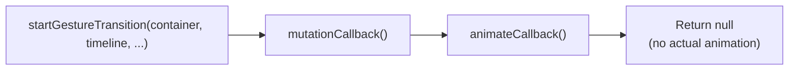

**Sources:** [packages/react-dom-bindings/src/client/ReactFiberConfigDOM.js#L1094-L1358](https://github.com/facebook/react/blob/main/packages/react-dom-bindings/src/client/ReactFiberConfigDOM.js#L1094-L1358)

## 组件树映射

ReactFiberConfigDOM 维护 DOM 节点和 React fibers 之间的映射，以支持：
- 事件分发（查找 DOM 节点的 React 实例）
- React DevTools（检查组件树）
- 公共实例访问（refs）

### 映射函数

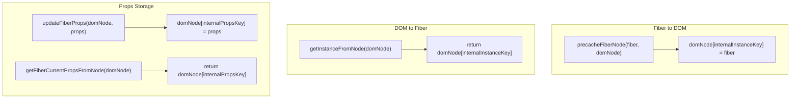

这些映射在实例创建期间建立，并在整个生命周期中用于事件处理和内省。

**Sources:** [packages/react-dom-bindings/src/client/ReactDOMComponentTree.js#L47-L60](https://github.com/facebook/react/blob/main/packages/react-dom-bindings/src/client/ReactDOMComponentTree.js#L47-L60)

## 总结

ReactFiberConfigDOM 作为 React 的平台无关协调器与浏览器 DOM 之间的关键桥梁。它：

- **创建 DOM 实例**，使用适当的命名空间（HTML、SVG、MathML）
- **管理属性**，将 React props 转换为 DOM 属性/特性
- **执行变更**，使用原生 DOM API 高效进行（使用 `moveBefore` 优化）
- **集成事件**，与 React 的合成事件系统协调
- **处理资源**，通过样式表和脚本的提升机制
- **支持 Hydration**，将服务器渲染的 HTML 与 React 树匹配
- **启用视图过渡**，用于动画状态更改（实验性）

该实现基于变更（与 React Native 的持久化模式不同），并针对浏览器环境进行了优化，对表单控件、脚本、图像和其他 HTML 特定元素进行了特殊处理。

**Sources:** [packages/react-dom-bindings/src/client/ReactFiberConfigDOM.js#L1-L1500](https://github.com/facebook/react/blob/main/packages/react-dom-bindings/src/client/ReactFiberConfigDOM.js#L1-L1500)
