# React Native 渲染器

<!-- > 来源：https://deepwiki.com/facebook/react/6.2-react-native-renderers -->

<details>
<summary>相关源文件</summary>

以下文件用于生成此 wiki 页面：

- [fixtures/view-transition/README.md](fixtures/view-transition/README.md)
- [fixtures/view-transition/public/favicon.ico](fixtures/view-transition/public/favicon.ico)
- [fixtures/view-transition/public/index.html](fixtures/view-transition/public/index.html)
- [fixtures/view-transition/src/components/Chrome.css](fixtures/view-transition/src/components/Chrome.css)
- [fixtures/view-transition/src/components/Chrome.js](fixtures/view-transition/src/components/Chrome.js)
- [fixtures/view-transition/src/components/Page.css](fixtures/view-transition/src/components/Page.css)
- [fixtures/view-transition/src/components/Page.js](fixtures/view-transition/src/components/Page.js)
- [fixtures/view-transition/src/components/SwipeRecognizer.js](fixtures/view-transition/src/components/SwipeRecognizer.js)
- [packages/react-art/src/ReactFiberConfigART.js](packages/react-art/src/ReactFiberConfigART.js)
- [packages/react-dom-bindings/src/client/ReactFiberConfigDOM.js](packages/react-dom-bindings/src/client/ReactFiberConfigDOM.js)
- [packages/react-native-renderer/src/ReactFiberConfigFabric.js](packages/react-native-renderer/src/ReactFiberConfigFabric.js)
- [packages/react-native-renderer/src/ReactFiberConfigNative.js](packages/react-native-renderer/src/ReactFiberConfigNative.js)
- [packages/react-noop-renderer/src/createReactNoop.js](packages/react-noop-renderer/src/createReactNoop.js)
- [packages/react-reconciler/src/ReactFiberApplyGesture.js](packages/react-reconciler/src/ReactFiberApplyGesture.js)
- [packages/react-reconciler/src/ReactFiberCommitViewTransitions.js](packages/react-reconciler/src/ReactFiberCommitViewTransitions.js)
- [packages/react-reconciler/src/ReactFiberConfigWithNoMutation.js](packages/react-reconciler/src/ReactFiberConfigWithNoMutation.js)
- [packages/react-reconciler/src/ReactFiberGestureScheduler.js](packages/react-reconciler/src/ReactFiberGestureScheduler.js)
- [packages/react-reconciler/src/ReactFiberViewTransitionComponent.js](packages/react-reconciler/src/ReactFiberViewTransitionComponent.js)
- [packages/react-reconciler/src/__tests__/ReactFiberHostContext-test.internal.js](packages/react-reconciler/src/__tests__/ReactFiberHostContext-test.internal.js)
- [packages/react-reconciler/src/forks/ReactFiberConfig.custom.js](packages/react-reconciler/src/forks/ReactFiberConfig.custom.js)
- [packages/react-test-renderer/src/ReactFiberConfigTestHost.js](packages/react-test-renderer/src/ReactFiberConfigTestHost.js)

</details>


## 目的与范围

本文档介绍 React Native 的渲染器实现，使 React 能够面向原生移动平台（iOS 和 Android）。React Native 提供两种不同的渲染器：**Fabric**（使用持久化模式的新架构）和 **Legacy/Paper**（使用变更模式的旧架构）。两者都实现了由 reconciler 定义的 host config 接口，以桥接 React 的虚拟表示与平台特定的原生 UI 组件。

关于通用 host 配置抽象的更多信息，请参阅 [Host Configuration Abstraction](#4.6)。关于 React DOM 的实现，请参阅 [React DOM Implementation](#6.1)。

---

## Host Config 接口

React Native 渲染器实现了与其他渲染器相同的 host config 接口，提供平台特定的实例创建、更新和树操作实现。reconciler 调用这些方法来执行平台操作，而无需了解底层实现细节。

### 核心类型定义

两种渲染器都定义了以下基础类型：

| 类型 | Fabric | Legacy |
|------|--------|--------|
| `Type` | `string` (组件类型) | `string` (组件类型) |
| `Instance` | 包含 `node` 和 `canonical` 的对象 | `ReactNativeFiberHostComponent` |
| `TextInstance` | 包含 `node` 的对象 | `number` (原生 tag) |
| `Container` | `{containerTag, publicInstance}` | `{containerTag, publicInstance}` |
| `Props` | `Object` | `Object` |
| `HostContext` | `{isInAParentText: boolean}` | `{isInAParentText: boolean}` |

**来源：** [packages/react-native-renderer/src/ReactFiberConfigFabric.js:93-134](), [packages/react-native-renderer/src/ReactFiberConfigNative.js:59-73]()

---

## Fabric 渲染器（新架构）

### 架构概览

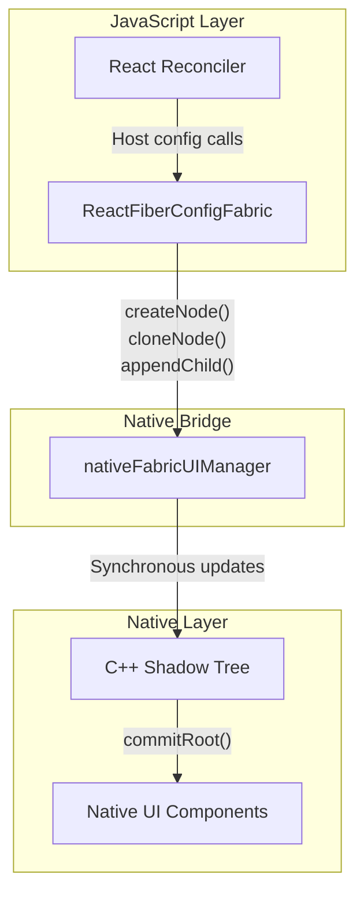

Fabric 渲染器架构

**来源：** [packages/react-native-renderer/src/ReactFiberConfigFabric.js:31-60]()

### 实例结构

Fabric 使用**规范实例模式**，其中实例的所有克隆共享一个共同的数据结构：

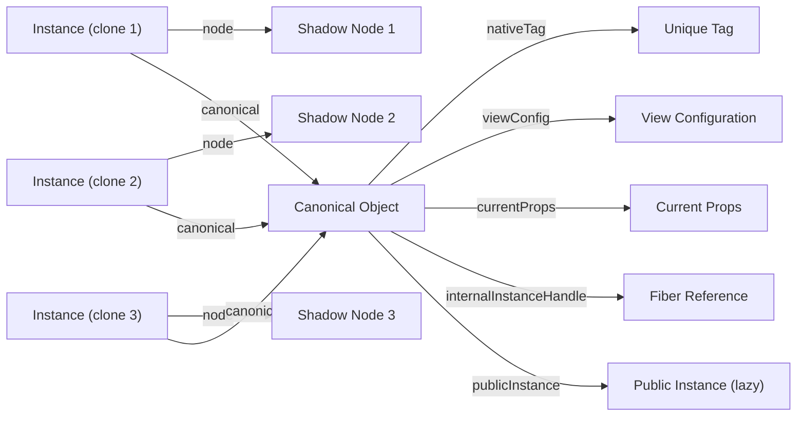

Fabric 实例规范模式

规范对象包含：
- `nativeTag`：唯一标识符（从 2 开始的偶数）
- `viewConfig`：来自注册表的原生组件配置
- `currentProps`：用于事件处理的当前 props
- `internalInstanceHandle`：对 Fiber 的引用
- `publicInstance`：延迟创建的公共实例（用于 refs）
- `publicRootInstance`：根实例（创建公共实例后置为 null）

**来源：** [packages/react-native-renderer/src/ReactFiberConfigFabric.js:95-113]()

### Tag 分配

Fabric tag 遵循特定模式：
- 从 `2` 开始，每个新实例递增 `2`
- `tag % 10 === 1` 表示它是根 tag
- `tag % 2 === 0` 表示它是 Fabric tag
- 这确保 Fabric tag 永远不会与 Legacy tag 重叠

**来源：** [packages/react-native-renderer/src/ReactFiberConfigFabric.js:86-89]()

### 持久化模式操作

Fabric 使用**持久化模式**（`supportsPersistence = true`），这意味着它创建新的 shadow node 实例，而不是变更现有实例：

| 操作 | 实现 |
|-----------|----------------|
| `createInstance` | `createNode(tag, viewName, rootTag, props, handle)` |
| `cloneInstance` | `cloneNodeWithNewProps()` 或 `cloneNodeWithNewChildren()` |
| `appendInitialChild` | `appendChildNode(parent.node, child.node)` |
| `createContainerChildSet` | 返回 `[]`（数组模式） |
| `appendChildToContainerChildSet` | `childSet.push(child.node)` |
| `finalizeContainerChildren` | 无操作（子节点在下一步中替换） |
| `replaceContainerChildren` | `completeRoot(containerTag, newChildren)` |

**来源：** [packages/react-native-renderer/src/ReactFiberConfigFabric.js:449-561]()

### Native UI Manager 集成

Fabric 通过 `nativeFabricUIManager` 与原生层通信：

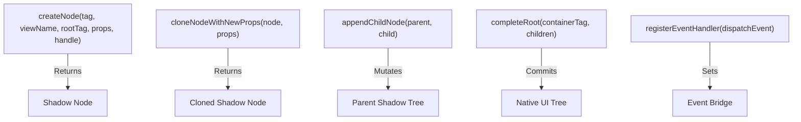

Fabric UI Manager API

**来源：** [packages/react-native-renderer/src/ReactFiberConfigFabric.js:45-60]()

---

## Legacy 渲染器（旧架构/Paper）

### 架构概览

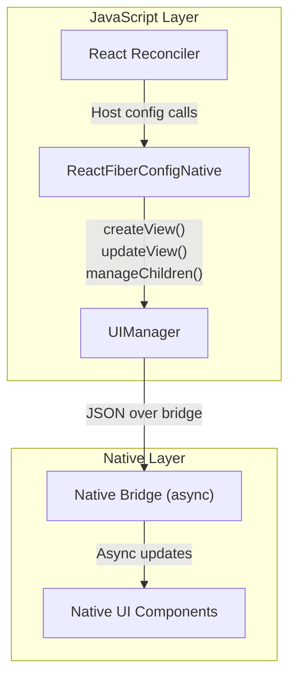

Legacy 渲染器架构

**来源：** [packages/react-native-renderer/src/ReactFiberConfigNative.js:14-20]()

### 实例结构

Legacy 渲染器使用 `ReactNativeFiberHostComponent` 作为实例，它们是更简单的对象，包含：
- `_nativeTag`：原生 view tag
- `_children`：子实例数组
- `viewConfig`：View 配置
- 用于事件处理的内部方法

**来源：** [packages/react-native-renderer/src/ReactFiberConfigNative.js:29](), [packages/react-native-renderer/src/ReactFiberConfigNative.js:157-169]()

### Tag 分配

Legacy tag 使用不同的分配策略：
- 从 `3` 开始，递增 `2`
- 跳过 `tag % 10 === 1` 的 tag（保留给根 tag）
- 跳过 `tag % 2 === 0` 的 tag（保留给 Fabric tag）

```javascript
function allocateTag() {
  let tag = nextReactTag;
  if (tag % 10 === 1) {
    tag += 2;
  }
  nextReactTag = tag + 2;
  return tag;
}
```

**来源：** [packages/react-native-renderer/src/ReactFiberConfigNative.js:94-102]()

### 变更模式操作

Legacy 使用**变更模式**（`supportsMutation = true`），直接变更原生 view 层次结构：

| 操作 | 实现 |
|-----------|----------------|
| `createInstance` | `UIManager.createView(tag, viewName, rootTag, props)` |
| `commitUpdate` | `UIManager.updateView(tag, viewName, updatePayload)` |
| `appendChild` | `UIManager.manageChildren(parent, moveFrom, moveTo, add, addAt, remove)` |
| `insertBefore` | `UIManager.manageChildren()` 配合计算的索引 |
| `removeChild` | `UIManager.manageChildren()` 配合 removeAtIndices |
| `commitTextUpdate` | `UIManager.updateView(tag, 'RCTRawText', {text})` |

**来源：** [packages/react-native-renderer/src/ReactFiberConfigNative.js:377-541]()

### UIManager 集成

Legacy 渲染器使用 `UIManager` 模块与原生层通信：

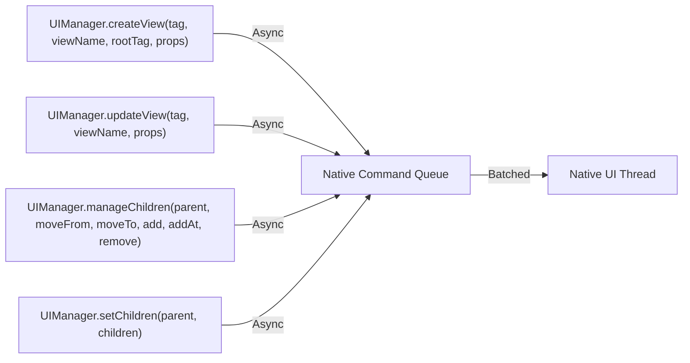

Legacy UIManager API

**来源：** [packages/react-native-renderer/src/ReactFiberConfigNative.js:150-155](), [packages/react-native-renderer/src/ReactFiberConfigNative.js:392-410]()

---

## Fabric 与 Legacy 的主要区别

### 对比表

| 方面 | Fabric | Legacy |
|--------|--------|--------|
| **模式** | 持久化 | 变更 |
| **实例类型** | `{node, canonical}` | `ReactNativeFiberHostComponent` |
| **Text 实例** | `{node, publicInstance?}` | `number`（仅 tag） |
| **Tag 模式** | 偶数（2, 4, 6...） | 奇数（3, 5, 7...）跳过 10 的倍数 |
| **Native API** | `nativeFabricUIManager`（同步） | `UIManager`（异步） |
| **克隆** | `cloneNodeWithNewProps/Children()` | 不支持 |
| **子节点更新** | 替换整个子节点集合 | 使用索引的 `manageChildren()` |
| **事件注册** | `registerEventHandler(dispatchEvent)` | 通过 `UIManager` 隐式处理 |
| **公共实例** | 通过 `createPublicInstance` 延迟创建 | 实例本身（或 Fabric 兼容层） |

**来源：** [packages/react-native-renderer/src/ReactFiberConfigFabric.js:449](), [packages/react-native-renderer/src/ReactFiberConfigNative.js:377]()

### 架构对比图

```mermaid
graph TB
    subgraph "Fabric (New)"
        FabricReact["React Tree"]
        FabricClone["Clone Operations<br/>(persistence)"]
        FabricShadow["Shadow Tree<br/>(synchronous)"]
        FabricCommit["completeRoot()"]
        FabricNative["Native UI"]
        
        FabricReact --> FabricClone
        FabricClone --> FabricShadow
        FabricShadow --> FabricCommit
        FabricCommit --> FabricNative
    end
    
    subgraph "Legacy (Old)"
        LegacyReact["React Tree"]
        LegacyMutate["Mutation Operations"]
        LegacyQueue["Command Queue<br/>(asynchronous)"]
        LegacyNative["Native UI"]
        
        LegacyReact --> LegacyMutate
        LegacyMutate --> LegacyQueue
        LegacyQueue --> LegacyNative
    end
```

Fabric vs Legacy 架构

**来源：** [packages/react-native-renderer/src/ReactFiberConfigFabric.js:1-8](), [packages/react-native-renderer/src/ReactFiberConfigNative.js:1-8]()

---

## 实例管理与公共实例

### 公共实例创建

两种渲染器都通过 refs 向用户代码暴露实例，但处理方式不同：

**Fabric：**
- 公共实例通过 `createPublicInstance(tag, viewConfig, handle, rootInstance)` 延迟创建
- 存储在 `canonical.publicInstance` 字段中
- 所有克隆通过规范对象共享同一个公共实例
- `getPublicInstance()` 在首次访问时创建

**Legacy：**
- 实例本身作为公共实例
- 更简单的模型，无需延迟初始化
- 在混合环境中存在 Fabric 实例的兼容层

**来源：** [packages/react-native-renderer/src/ReactFiberConfigFabric.js:293-325](), [packages/react-native-renderer/src/ReactFiberConfigNative.js:289-315]()

### Host Context 管理

两种渲染器都跟踪当前树位置是否在 text 组件内：

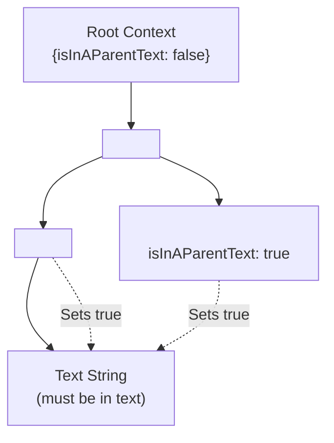

Host Context 传播

context 防止原始文本字符串出现在 text 组件外。在 DEV 模式下，这会触发警告。

**来源：** [packages/react-native-renderer/src/ReactFiberConfigFabric.js:259-291](), [packages/react-native-renderer/src/ReactFiberConfigNative.js:264-287]()

---

## Fragment Refs 支持

Fabric 包含对 fragment 实例句柄的支持，使 refs 能够引用 fragment。`FragmentInstance` 类为原生组件实现了类似 DOM 的 API：

### FragmentInstance 实现

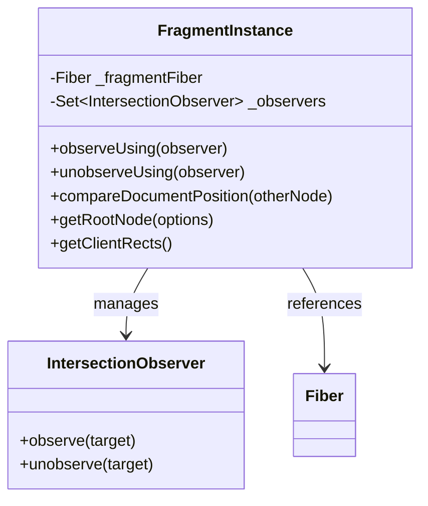

FragmentInstance 类结构

### 关键方法

| 方法 | 目的 | 实现 |
|--------|---------|----------------|
| `observeUsing()` | 附加 IntersectionObserver | 遍历 fragment，对每个子节点调用 `observer.observe()` |
| `unobserveUsing()` | 分离 IntersectionObserver | 遍历 fragment，对每个子节点调用 `observer.unobserve()` |
| `compareDocumentPosition()` | 比较位置 | 使用第一个/最后一个子节点位置，配合特殊的空 fragment 处理 |
| `getRootNode()` | 获取根容器 | 委托给父 host fiber 的 `getRootNode()` |
| `getClientRects()` | 获取边界矩形 | 从所有子节点收集 `getBoundingClientRect()` |

**来源：** [packages/react-native-renderer/src/ReactFiberConfigFabric.js:646-799]()

### Fragment 遍历

Fragment 实例使用来自 reconciler 的 `traverseFragmentInstance()` 来遍历 fragment 的子节点：

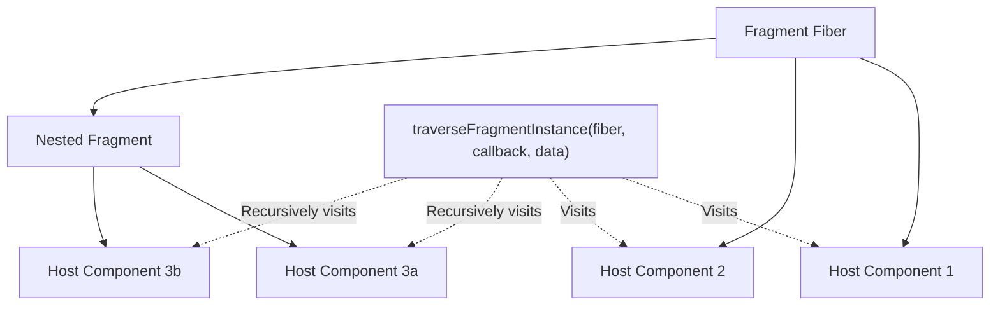

Fragment 遍历模式

**来源：** [packages/react-native-renderer/src/ReactFiberConfigFabric.js:27-29](), [packages/react-native-renderer/src/ReactFiberConfigFabric.js:672-678]()

---

## Props 与属性处理

### 属性 Payload 创建

两种渲染器都使用 React Native view 配置注册表来验证和转换 props：

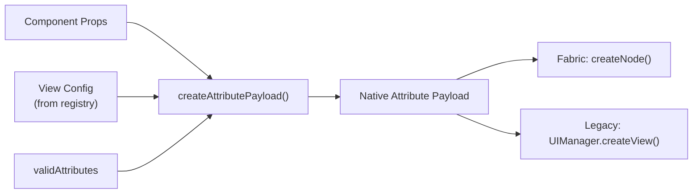

属性 Payload 流程

**Fabric：**
```javascript
const updatePayload = createAttributePayload(
  props,
  viewConfig.validAttributes,
);
const node = createNode(tag, viewConfig.uiViewClassName, rootTag, updatePayload, handle);
```

**Legacy：**
```javascript
const updatePayload = create(props, viewConfig.validAttributes);
UIManager.createView(tag, viewConfig.uiViewClassName, rootTag, updatePayload);
```

**来源：** [packages/react-native-renderer/src/ReactFiberConfigFabric.js:196-207](), [packages/react-native-renderer/src/ReactFiberConfigNative.js:148-155]()

### 更新 Payload 差异计算

当 props 发生变化时，两种渲染器都计算差异以最小化原生更新：

**Fabric：**
```javascript
const updatePayload = diffAttributePayloads(
  oldProps,
  newProps,
  viewConfig.validAttributes,
);
// 更新 canonical.currentProps 用于事件
instance.canonical.currentProps = newProps;
```

**Legacy：**
```javascript
const updatePayload = diff(oldProps, newProps, viewConfig.validAttributes);
if (updatePayload != null) {
  UIManager.updateView(tag, viewConfig.uiViewClassName, updatePayload);
}
```

**来源：** [packages/react-native-renderer/src/ReactFiberConfigFabric.js:460-468](), [packages/react-native-renderer/src/ReactFiberConfigNative.js:452-467]()

---

## 事件优先级集成

两种渲染器都与 React 事件优先级系统集成，将原生事件映射到 React 优先级：

### 优先级解析

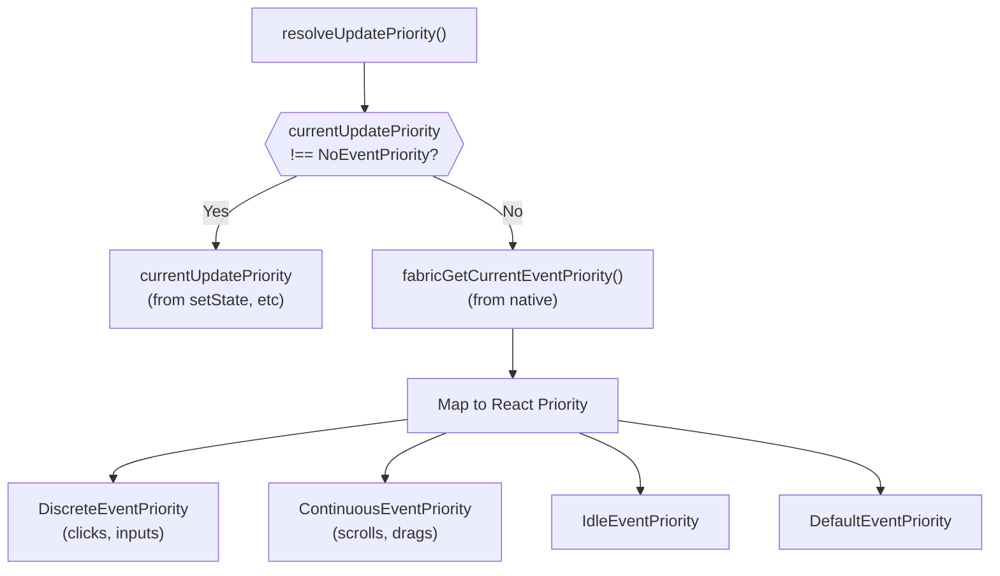

事件优先级解析（Fabric）

**Fabric 优先级映射：**
| Fabric 优先级 | React 优先级 |
|----------------|----------------|
| `FabricDiscretePriority` | `DiscreteEventPriority` |
| `FabricContinuousPriority` | `ContinuousEventPriority` |
| `FabricIdlePriority` | `IdleEventPriority` |
| `FabricDefaultPriority` | `DefaultEventPriority` |

**Legacy：** 始终返回 `DefaultEventPriority`（无原生优先级集成）。

**来源：** [packages/react-native-renderer/src/ReactFiberConfigFabric.js:395-419](), [packages/react-native-renderer/src/ReactFiberConfigNative.js:352-357]()

---

## 总结

React Native 提供了两种渲染器实现，将 React 的平台无关 reconciler 桥接到原生移动 UI：

1. **Fabric**（新架构）：使用持久化模式配合同步 shadow tree 操作，实现更好的性能和更简单的并发支持
2. **Legacy/Paper**（旧架构）：使用变更模式配合通过 bridge 的异步命令批处理

两者实现了相同的 host config 接口，但操作模型根本不同。Fabric 的持久化方法更好地与 React 的并发渲染模型对齐，而 Legacy 保持与现有 React Native 应用的向后兼容性。

关键的架构组件包括：
- **Tag 分配**策略确保 Fabric 和 Legacy tag 不冲突
- **实例管理**模式（规范共享 vs 直接实例）
- **Native bridge 集成**（同步 vs 异步）
- **公共实例创建**用于 refs
- **Fragment refs 支持**（仅 Fabric）
- **属性 payload**创建和差异计算
- **事件优先级**映射（Fabric 中增强）

**来源：** [packages/react-native-renderer/src/ReactFiberConfigFabric.js:1-838](), [packages/react-native-renderer/src/ReactFiberConfigNative.js:1-751]()