# Hydration System

<!-- > Source: https://deepwiki.com/facebook/react/6.3-hydration-system -->

Relevant source files

The following files were used as context for generating this wiki page:

- [packages/react-dom-bindings/src/client/ReactDOMComponentTree.js](https://github.com/facebook/react/blob/main/packages/react-dom-bindings/src/client/ReactDOMComponentTree.js)
- [packages/react-dom-bindings/src/server/ReactFizzConfigDOM.js](https://github.com/facebook/react/blob/main/packages/react-dom-bindings/src/server/ReactFizzConfigDOM.js)
- [packages/react-dom-bindings/src/server/ReactFizzConfigDOMLegacy.js](https://github.com/facebook/react/blob/main/packages/react-dom-bindings/src/server/ReactFizzConfigDOMLegacy.js)
- [packages/react-dom-bindings/src/shared/ReactDOMResourceValidation.js](https://github.com/facebook/react/blob/main/packages/react-dom-bindings/src/shared/ReactDOMResourceValidation.js)
- [packages/react-dom/src/__tests__/ReactDOMFizzServer-test.js](https://github.com/facebook/react/blob/main/packages/react-dom/src/__tests__/ReactDOMFizzServer-test.js)
- [packages/react-dom/src/__tests__/ReactDOMFizzServerBrowser-test.js](https://github.com/facebook/react/blob/main/packages/react-dom/src/__tests__/ReactDOMFizzServerBrowser-test.js)
- [packages/react-dom/src/__tests__/ReactDOMFizzServerNode-test.js](https://github.com/facebook/react/blob/main/packages/react-dom/src/__tests__/ReactDOMFizzServerNode-test.js)
- [packages/react-dom/src/__tests__/ReactDOMFizzStatic-test.js](https://github.com/facebook/react/blob/main/packages/react-dom/src/__tests__/ReactDOMFizzStatic-test.js)
- [packages/react-dom/src/__tests__/ReactDOMFizzStaticBrowser-test.js](https://github.com/facebook/react/blob/main/packages/react-dom/src/__tests__/ReactDOMFizzStaticBrowser-test.js)
- [packages/react-dom/src/__tests__/ReactDOMFizzStaticNode-test.js](https://github.com/facebook/react/blob/main/packages/react-dom/src/__tests__/ReactDOMFizzStaticNode-test.js)
- [packages/react-dom/src/__tests__/ReactDOMFizzSuppressHydrationWarning-test.js](https://github.com/facebook/react/blob/main/packages/react-dom/src/__tests__/ReactDOMFizzSuppressHydrationWarning-test.js)
- [packages/react-dom/src/__tests__/ReactDOMFloat-test.js](https://github.com/facebook/react/blob/main/packages/react-dom/src/__tests__/ReactDOMFloat-test.js)
- [packages/react-dom/src/__tests__/ReactDOMHydrationDiff-test.js](https://github.com/facebook/react/blob/main/packages/react-dom/src/__tests__/ReactDOMHydrationDiff-test.js)
- [packages/react-dom/src/__tests__/ReactDOMServerPartialHydration-test.internal.js](https://github.com/facebook/react/blob/main/packages/react-dom/src/__tests__/ReactDOMServerPartialHydration-test.internal.js)
- [packages/react-dom/src/__tests__/ReactDOMSingletonComponents-test.js](https://github.com/facebook/react/blob/main/packages/react-dom/src/__tests__/ReactDOMSingletonComponents-test.js)
- [packages/react-dom/src/__tests__/ReactRenderDocument-test.js](https://github.com/facebook/react/blob/main/packages/react-dom/src/__tests__/ReactRenderDocument-test.js)
- [packages/react-dom/src/__tests__/ReactServerRenderingHydration-test.js](https://github.com/facebook/react/blob/main/packages/react-dom/src/__tests__/ReactServerRenderingHydration-test.js)
- [packages/react-dom/src/server/ReactDOMFizzServerBrowser.js](https://github.com/facebook/react/blob/main/packages/react-dom/src/server/ReactDOMFizzServerBrowser.js)
- [packages/react-dom/src/server/ReactDOMFizzServerBun.js](https://github.com/facebook/react/blob/main/packages/react-dom/src/server/ReactDOMFizzServerBun.js)
- [packages/react-dom/src/server/ReactDOMFizzServerEdge.js](https://github.com/facebook/react/blob/main/packages/react-dom/src/server/ReactDOMFizzServerEdge.js)
- [packages/react-dom/src/server/ReactDOMFizzServerNode.js](https://github.com/facebook/react/blob/main/packages/react-dom/src/server/ReactDOMFizzServerNode.js)
- [packages/react-dom/src/server/ReactDOMFizzStaticBrowser.js](https://github.com/facebook/react/blob/main/packages/react-dom/src/server/ReactDOMFizzStaticBrowser.js)
- [packages/react-dom/src/server/ReactDOMFizzStaticEdge.js](https://github.com/facebook/react/blob/main/packages/react-dom/src/server/ReactDOMFizzStaticEdge.js)
- [packages/react-dom/src/server/ReactDOMFizzStaticNode.js](https://github.com/facebook/react/blob/main/packages/react-dom/src/server/ReactDOMFizzStaticNode.js)
- [packages/react-markup/src/ReactFizzConfigMarkup.js](https://github.com/facebook/react/blob/main/packages/react-markup/src/ReactFizzConfigMarkup.js)
- [packages/react-noop-renderer/src/ReactNoopServer.js](https://github.com/facebook/react/blob/main/packages/react-noop-renderer/src/ReactNoopServer.js)
- [packages/react-reconciler/src/ReactFiberHydrationContext.js](https://github.com/facebook/react/blob/main/packages/react-reconciler/src/ReactFiberHydrationContext.js)
- [packages/react-server-dom-fb/src/__tests__/ReactDOMServerFB-test.internal.js](https://github.com/facebook/react/blob/main/packages/react-server-dom-fb/src/__tests__/ReactDOMServerFB-test.internal.js)
- [packages/react-server/src/ReactFizzServer.js](https://github.com/facebook/react/blob/main/packages/react-server/src/ReactFizzServer.js)
- [packages/react-server/src/forks/ReactFizzConfig.custom.js](https://github.com/facebook/react/blob/main/packages/react-server/src/forks/ReactFizzConfig.custom.js)

本文档介绍 React 的 Hydration 系统，该系统将 React 附加到服务端渲染的 HTML 上，将静态标记转换为交互式应用。Hydration 复用现有 DOM 节点而非创建新节点，并验证服务端和客户端渲染的内容是否一致。

关于服务端渲染的基础知识，请参阅 [React Fizz (Streaming SSR)](/5.1-react-fizz-(streaming-ssr))。关于更广泛的 React DOM 渲染概念，请参阅 [React DOM](/4.1-fiber-architecture-and-data-structures)。关于底层协调机制，请参阅 [Fiber Architecture and Work Loop](/3.1-build-pipeline-and-module-forking)。

## Hydration 概述

Hydration 是将 React 的事件监听器和内部状态附加到服务端渲染 HTML 的过程。React 不会创建新的 DOM 节点，而是遍历现有 DOM 树，将 Fiber 节点附加到现有元素上，并验证客户端渲染是否与服务端渲染匹配。

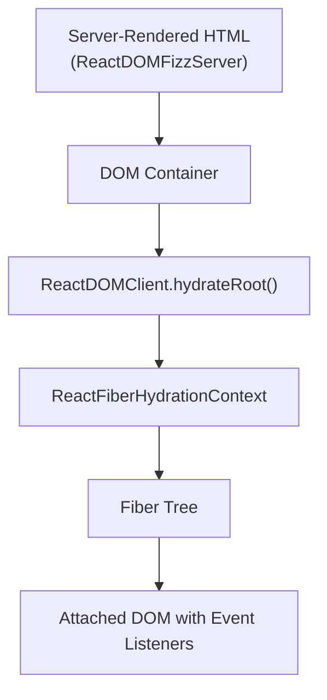

**Hydration 流程**

Sources: [packages/react-dom-bindings/src/client/ReactFiberConfigDOM.js#L1-L1500](https://github.com/facebook/react/blob/main/packages/react-dom-bindings/src/client/ReactFiberConfigDOM.js#L1-L1500), [packages/react-reconciler/src/ReactFiberHydrationContext.js#L1-L100](https://github.com/facebook/react/blob/main/packages/react-reconciler/src/ReactFiberHydrationContext.js#L1-L100)

## Hydration Context 状态

React 在 `ReactFiberHydrationContext` 中维护 hydration 状态，跟踪 DOM 树中的当前位置以及 hydration 是否正在进行。

| State Variable | Type | Purpose |
|---------------|------|---------|
| `hydrationParentFiber` | `Fiber | null` | 当前正在 hydrating 的 fiber |
| `nextHydratableInstance` | `HydratableInstance | null` | 下一个要 hydrate 的 DOM 节点 |
| `isHydrating` | `boolean` | 当前是否正在 hydrating |
| `didSuspendOrErrorDEV` | `boolean` | 错误后抑制警告 |
| `hydrationDiffRootDEV` | `HydrationDiffNode | null` | 用于错误报告的跟踪差异 |
| `hydrationErrors` | `Array<CapturedValue> \| null` | 收集的 hydration 错误 |

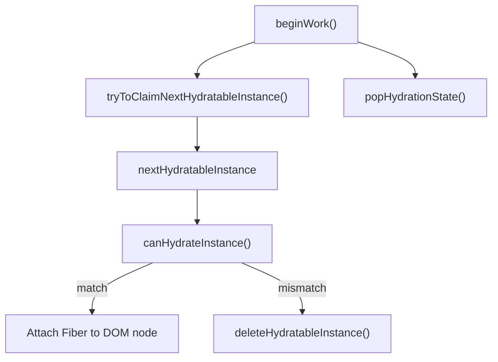

**Hydration 状态管理**

Sources: [packages/react-reconciler/src/ReactFiberHydrationContext.js#L78-L95](https://github.com/facebook/react/blob/main/packages/react-reconciler/src/ReactFiberHydrationContext.js#L78-L95), [packages/react-reconciler/src/ReactFiberHydrationContext.js#L135-L200](https://github.com/facebook/react/blob/main/packages/react-reconciler/src/ReactFiberHydrationContext.js#L135-L200)

## Hydration 过程

在 hydration 过程中，React 并行遍历 Fiber 树和 DOM 树，尝试将每个 Fiber 与现有 DOM 节点匹配。

### Host Component Hydration

对于 host component（DOM 元素），React 验证标签名和 props，将现有 DOM 节点附加到 Fiber 上。

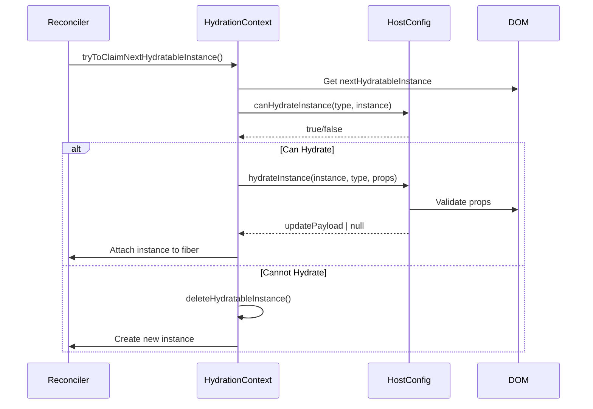

**Host Component Hydration 序列**

Sources: [packages/react-reconciler/src/ReactFiberHydrationContext.js#L400-L500](https://github.com/facebook/react/blob/main/packages/react-reconciler/src/ReactFiberHydrationContext.js#L400-L500), [packages/react-dom-bindings/src/client/ReactFiberConfigDOM.js#L1200-L1350](https://github.com/facebook/react/blob/main/packages/react-dom-bindings/src/client/ReactFiberConfigDOM.js#L1200-L1350)

### Text Node Hydration

文本节点直接进行比较。如果文本内容不同，React 会记录警告但使用现有节点。

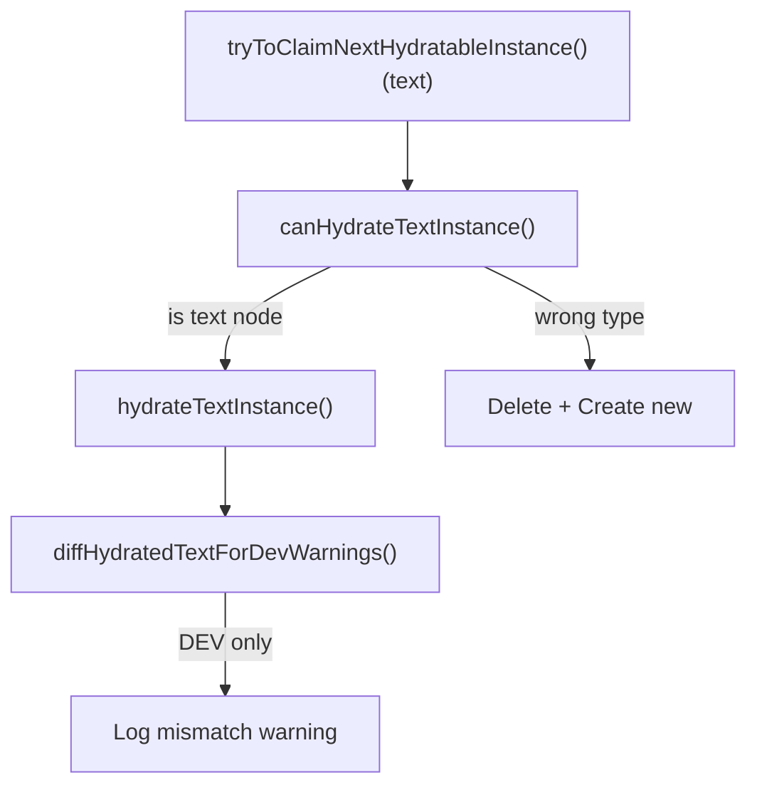

**Text Node Hydration**

Sources: [packages/react-reconciler/src/ReactFiberHydrationContext.js#L500-L550](https://github.com/facebook/react/blob/main/packages/react-reconciler/src/ReactFiberHydrationContext.js#L500-L550), [packages/react-dom-bindings/src/client/ReactFiberConfigDOM.js#L1350-L1400](https://github.com/facebook/react/blob/main/packages/react-dom-bindings/src/client/ReactFiberConfigDOM.js#L1350-L1400)

## Mismatch 检测与恢复

当 React 检测到服务端渲染的 HTML 与客户端渲染不匹配时，会尝试通过删除不匹配的服务端节点并创建正确的客户端节点来恢复。

### Mismatch 类型

| Mismatch Type | Detection Method | Recovery Strategy |
|--------------|------------------|-------------------|
| Tag name mismatch | `canHydrateInstance()` returns false | Delete server node, insert client node |
| Text mismatch | `diffHydratedText()` compares strings | Use server text, log warning |
| Missing children | No DOM node for Fiber child | Insert client-rendered child |
| Extra DOM nodes | DOM nodes without Fiber | Delete extra nodes |
| Prop mismatch | `diffHydratedProperties()` | Apply client props, log warning |

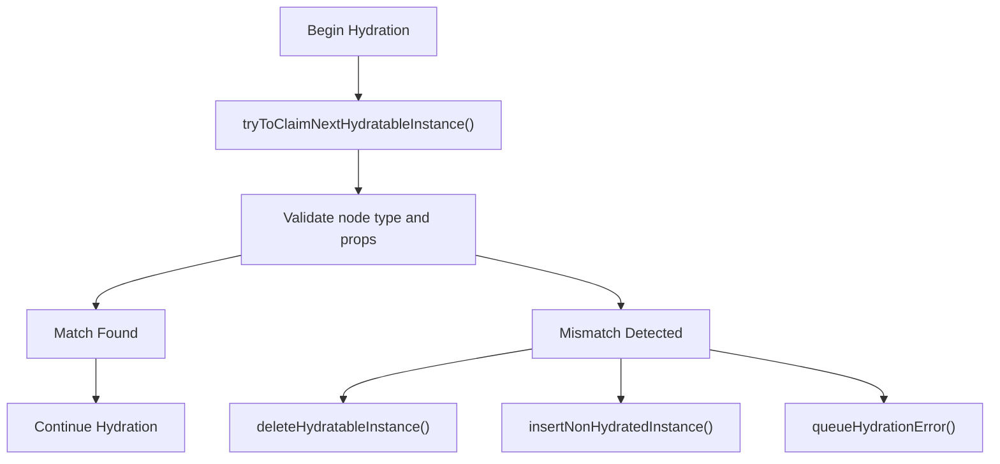

**Mismatch 恢复流程**

Sources: [packages/react-reconciler/src/ReactFiberHydrationContext.js#L300-L400](https://github.com/facebook/react/blob/main/packages/react-reconciler/src/ReactFiberHydrationContext.js#L300-L400), [packages/react-dom-bindings/src/client/ReactFiberConfigDOM.js#L1400-L1500](https://github.com/facebook/react/blob/main/packages/react-dom-bindings/src/client/ReactFiberConfigDOM.js#L1400-L1500)

### Hydration Diff 跟踪（DEV）

在开发环境中，React 构建 hydration 差异树，以提供带有组件堆栈的详细错误消息。

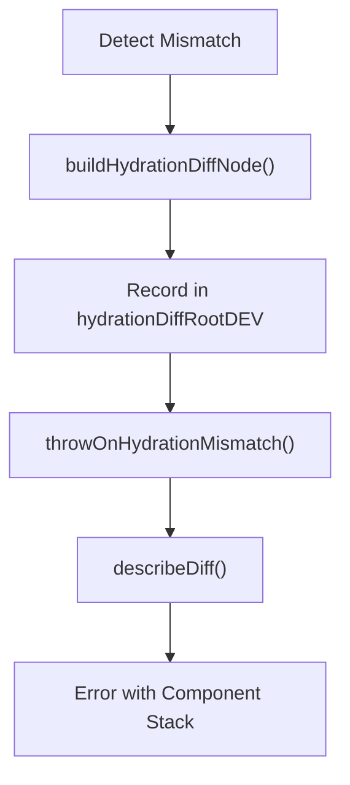

**Hydration Diff 报告**

Sources: [packages/react-reconciler/src/ReactFiberHydrationContext.js#L96-L135](https://github.com/facebook/react/blob/main/packages/react-reconciler/src/ReactFiberHydrationContext.js#L96-L135), [packages/react-reconciler/src/ReactFiberHydrationDiffs.js#L1-L200](https://github.com/facebook/react/blob/main/packages/react-reconciler/src/ReactFiberHydrationDiffs.js#L1-L200)

## Dehydrated Suspense Boundaries

当 React Fizz 服务端渲染一个已 suspend 的 Suspense boundary 时，会发出特殊的 HTML 注释标记来表示 dehydrated 内容。这些标记允许客户端跳过 hydrate fallback，等待真实内容。

### Suspense Boundary 标记

React 使用特定的注释节点数据来标记 SSR 输出中的 Suspense boundaries：

| Marker | Data Attribute | Purpose |
|--------|---------------|---------|
| Pending Start | `$?` | 尚未解析的 Suspense |
| Fallback Start | `$!` | 显示 fallback 的 Suspense |
| Complete Start | `$` | 已完成的 Suspense |
| End | `/$` | Suspense boundary 结束 |

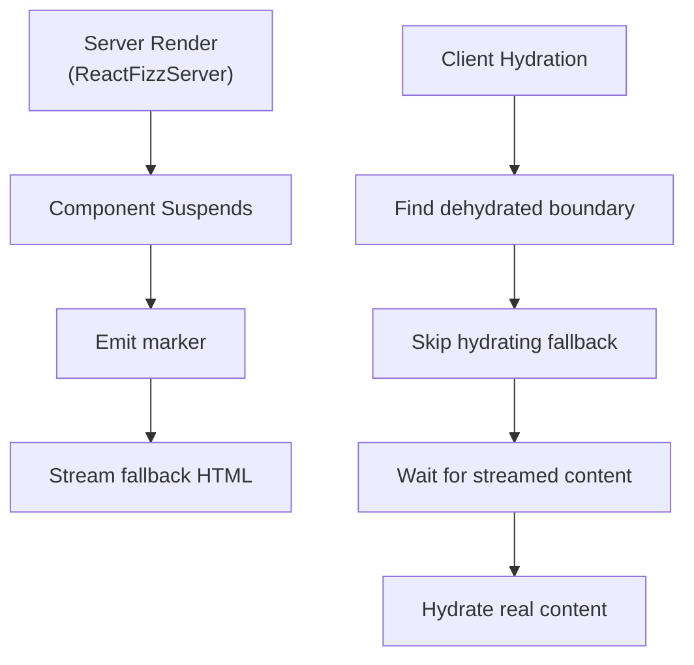

**Dehydrated Suspense Boundary 流程**

Sources: [packages/react-server/src/ReactFizzServer.js#L262-L274](https://github.com/facebook/react/blob/main/packages/react-server/src/ReactFizzServer.js#L262-L274), [packages/react-dom-bindings/src/client/ReactFiberConfigDOM.js#L262-L274](https://github.com/facebook/react/blob/main/packages/react-dom-bindings/src/client/ReactFiberConfigDOM.js#L262-L274)

### Suspense Instance 识别

客户端通过检查注释节点数据属性来识别 dehydrated Suspense boundaries。

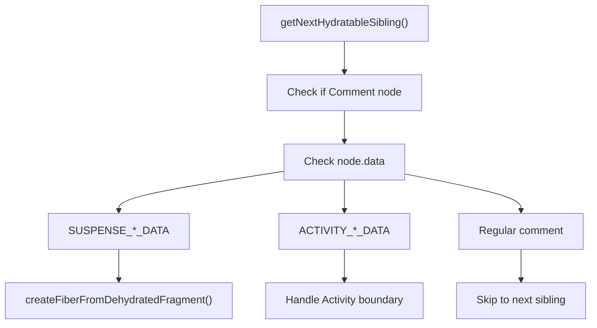

**Suspense Instance 识别**

Sources: [packages/react-dom-bindings/src/client/ReactFiberConfigDOM.js#L1120-L1180](https://github.com/facebook/react/blob/main/packages/react-dom-bindings/src/client/ReactFiberConfigDOM.js#L1120-L1180), [packages/react-reconciler/src/ReactFiberHydrationContext.js#L550-L650](https://github.com/facebook/react/blob/main/packages/react-reconciler/src/ReactFiberHydrationContext.js#L550-L650)

### Hydrating Dehydrated Boundaries

当 React 遇到 dehydrated Suspense boundary 时，会创建一个 `DehydratedFragment` fiber 并跳过初始内容，等待服务端流完成。

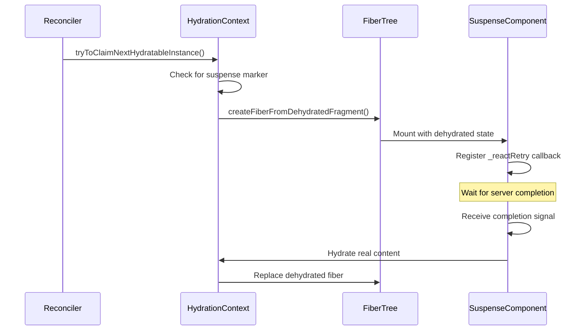

**Dehydrated Fragment Hydration**

Sources: [packages/react-reconciler/src/ReactFiber.js#L800-L850](https://github.com/facebook/react/blob/main/packages/react-reconciler/src/ReactFiber.js#L800-L850), [packages/react-reconciler/src/ReactFiberHydrationContext.js#L700-L800](https://github.com/facebook/react/blob/main/packages/react-reconciler/src/ReactFiberHydrationContext.js#L700-L800)

## Selective Hydration

Selective hydration 允许 React 根据用户交互优先 hydrate Suspense boundaries，提升感知性能。

### 基于优先级的 Hydration

当用户与 dehydrated boundary 交互时，React 会立即以更高优先级调度该 boundary 进行 hydration。

| Interaction Type | Priority | Scheduling |
|-----------------|----------|-----------|
| Click, focus, submit | Discrete | Sync hydration |
| Hover, scroll | Continuous | High priority |
| No interaction | Default | Normal priority |

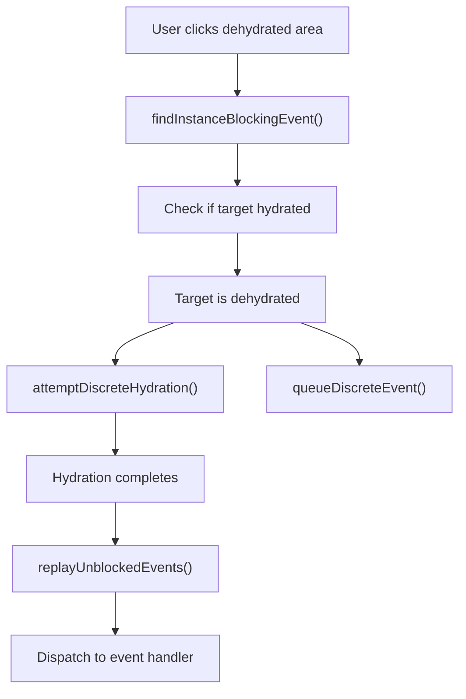

**Selective Hydration with Event Replay**

Sources: [packages/react-dom-bindings/src/events/ReactDOMEventReplaying.js#L1-L300](https://github.com/facebook/react/blob/main/packages/react-dom-bindings/src/events/ReactDOMEventReplaying.js#L1-L300), [packages/react-dom/src/__tests__/ReactDOMServerPartialHydration-test.internal.js#L146-L200](https://github.com/facebook/react/blob/main/packages/react-dom/src/__tests__/ReactDOMServerPartialHydration-test.internal.js#L146-L200)

### Event Queueing and Replay

针对 dehydrated 内容的事件会被排队，直到 hydration 完成，然后重放以确保正确处理。

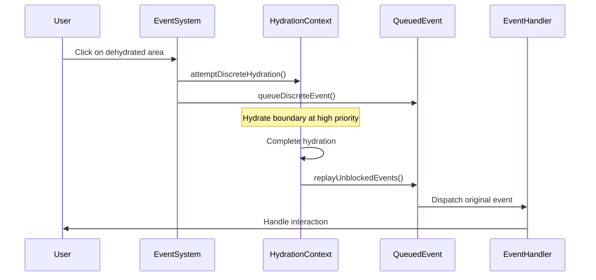

**Event Replay Flow**

Sources: [packages/react-dom-bindings/src/events/ReactDOMEventReplaying.js#L150-L250](https://github.com/facebook/react/blob/main/packages/react-dom-bindings/src/events/ReactDOMEventReplaying.js#L150-L250), [packages/react-dom/src/__tests__/ReactDOMServerPartialHydration-test.internal.js#L728-L850](https://github.com/facebook/react/blob/main/packages/react-dom/src/__tests__/ReactDOMServerPartialHydration-test.internal.js#L728-L850)

### Multiple Boundary Prioritization

当多个 Suspense boundaries 处于 dehydrated 状态时，React 会优先 hydrate 用户交互的那个，推迟其他 boundary。

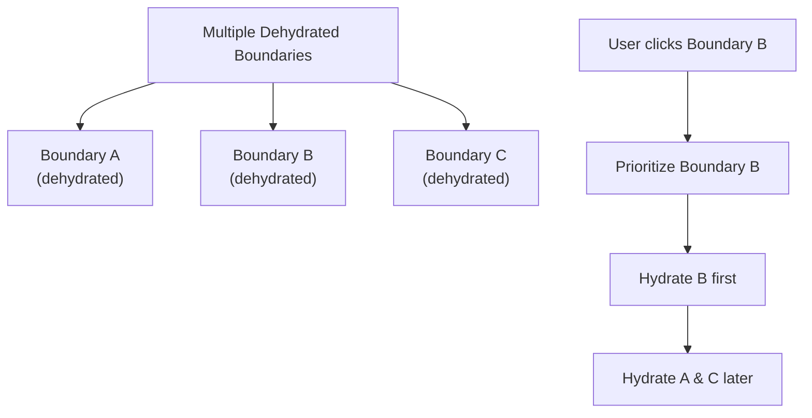

**Multi-Boundary Prioritization**

Sources: [packages/react-dom/src/__tests__/ReactDOMServerPartialHydration-test.internal.js#L300-L400](https://github.com/facebook/react/blob/main/packages/react-dom/src/__tests__/ReactDOMServerPartialHydration-test.internal.js#L300-L400)

## Error Handling and Recovery

React 的 hydration 系统包含全面的错误处理，以从不匹配中恢复并提供有用的诊断信息。

### Recoverable Errors

Hydration mismatch 被视为可恢复错误。React 通过 `onRecoverableError` 回调记录错误，但继续渲染。

| Error Type | Recovery Strategy | User Impact |
|-----------|------------------|-------------|
| Tag mismatch | Client render subtree | Flicker during replacement |
| Text mismatch | Use server text | Dev warning only |
| Missing attribute | Apply client attribute | Attribute updates |
| Extra DOM nodes | Delete extra nodes | Removed from DOM |

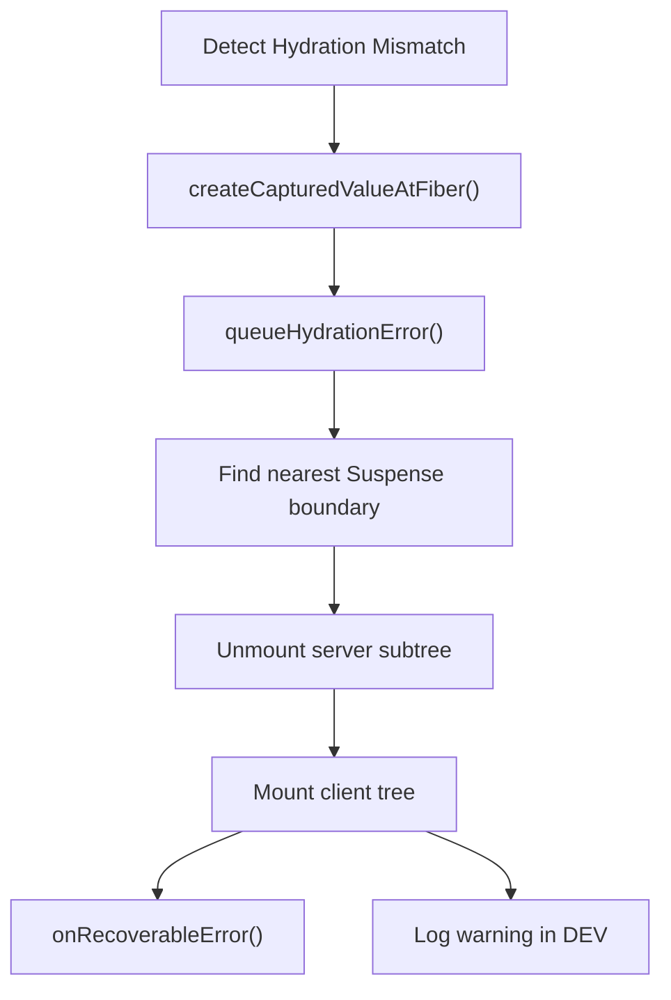

**Error Recovery Process**

Sources: [packages/react-reconciler/src/ReactFiberHydrationContext.js#L850-L950](https://github.com/facebook/react/blob/main/packages/react-reconciler/src/ReactFiberHydrationContext.js#L850-L950), [packages/react-reconciler/src/ReactCapturedValue.js#L1-L50](https://github.com/facebook/react/blob/main/packages/react-reconciler/src/ReactCapturedValue.js#L1-L50)

### HydrationMismatchException

在 DEV 环境中，React 抛出 `HydrationMismatchException`，包含详细的组件堆栈和差异信息。

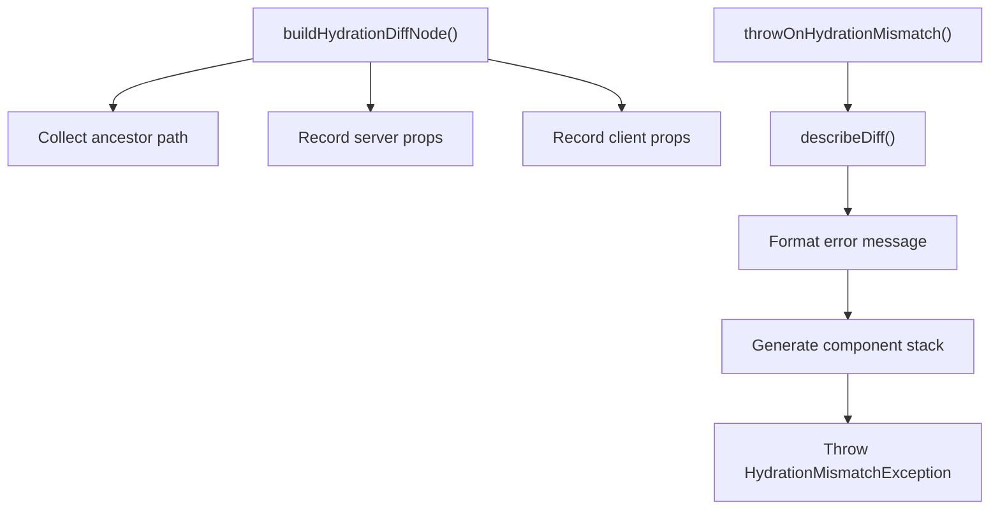

**HydrationMismatchException Generation**

Sources: [packages/react-reconciler/src/ReactFiberHydrationContext.js#L950-L1050](https://github.com/facebook/react/blob/main/packages/react-reconciler/src/ReactFiberHydrationContext.js#L950-L1050), [packages/react-reconciler/src/ReactFiberHydrationDiffs.js#L50-L150](https://github.com/facebook/react/blob/main/packages/react-reconciler/src/ReactFiberHydrationDiffs.js#L50-L150)

## Integration Points

DOM 事件系统和 selective hydration 协同工作，为服务端渲染应用提供无缝交互：

1. **Event Detection**：事件系统识别应触发 hydration 的用户交互
2. **Priority Assignment**：不同事件类型获得不同的 hydration 优先级
3. **Boundary Targeting**：事件针对特定 Suspense boundaries 进行 hydration
4. **Event Queueing**：原始事件在 hydration 期间被排队
5. **Replay Execution**：事件在 hydration 完成后重放

这种集成确保服务端渲染应用感觉响应迅速，同时通过策略性 hydration 优化初始加载性能。

Sources: [packages/react-dom/src/__tests__/ReactDOMServerSelectiveHydration-test.internal.js#L1-L2200](https://github.com/facebook/react/blob/main/packages/react-dom/src/__tests__/ReactDOMServerSelectiveHydration-test.internal.js#L1-L2200), [packages/react-dom/src/events/__tests__/DOMPluginEventSystem-test.internal.js#L1-L2000](https://github.com/facebook/react/blob/main/packages/react-dom/src/events/__tests__/DOMPluginEventSystem-test.internal.js#L1-L2000)
