# View Transitions 和 Gesture Scheduling

<!-- > 来源：https://deepwiki.com/facebook/react/6.4-view-transitions-and-gesture-scheduling -->

<details>
<summary>相关源文件</summary>

以下文件用于生成此 wiki 页面的上下文：

- [fixtures/view-transition/README.md](fixtures/view-transition/README.md)
- [fixtures/view-transition/public/favicon.ico](fixtures/view-transition/public/favicon.ico)
- [fixtures/view-transition/public/index.html](fixtures/view-transition/public/index.html)
- [fixtures/view-transition/src/components/Chrome.css](fixtures/view-transition/src/components/Chrome.css)
- [fixtures/view-transition/src/components/Chrome.js](fixtures/view-transition/src/components/Chrome.js)
- [fixtures/view-transition/src/components/Page.css](fixtures/view-transition/src/components/Page.css)
- [fixtures/view-transition/src/components/Page.js](fixtures/view-transition/src/components/Page.js)
- [fixtures/view-transition/src/components/SwipeRecognizer.js](fixtures/view-transition/src/components/SwipeRecognizer.js)
- [packages/react-art/src/ReactFiberConfigART.js](packages/react-art/src/ReactFiberConfigART.js)
- [packages/react-dom-bindings/src/client/ReactFiberConfigDOM.js](packages/react-dom-bindings/src/client/ReactFiberConfigDOM.js)
- [packages/react-native-renderer/src/ReactFiberConfigFabric.js](packages/react-native-renderer/src/ReactFiberConfigFabric.js)
- [packages/react-native-renderer/src/ReactFiberConfigNative.js](packages/react-native-renderer/src/ReactFiberConfigNative.js)
- [packages/react-noop-renderer/src/createReactNoop.js](packages/react-noop-renderer/src/createReactNoop.js)
- [packages/react-reconciler/src/ReactFiberApplyGesture.js](packages/react-reconciler/src/ReactFiberApplyGesture.js)
- [packages/react-reconciler/src/ReactFiberCommitViewTransitions.js](packages/react-reconciler/src/ReactFiberCommitViewTransitions.js)
- [packages/react-reconciler/src/ReactFiberConfigWithNoMutation.js](packages/react-reconciler/src/ReactFiberConfigWithNoMutation.js)
- [packages/react-reconciler/src/ReactFiberGestureScheduler.js](packages/react-reconciler/src/ReactFiberGestureScheduler.js)
- [packages/react-reconciler/src/ReactFiberViewTransitionComponent.js](packages/react-reconciler/src/ReactFiberViewTransitionComponent.js)
- [packages/react-reconciler/src/__tests__/ReactFiberHostContext-test.internal.js](packages/react-reconciler/src/__tests__/ReactFiberHostContext-test.internal.js)
- [packages/react-reconciler/src/forks/ReactFiberConfig.custom.js](packages/react-reconciler/src/forks/ReactFiberConfig.custom.js)
- [packages/react-test-renderer/src/ReactFiberConfigTestHost.js](packages/react-test-renderer/src/ReactFiberConfigTestHost.js)

</details>


## 目的和范围

本文档介绍 React 的视图过渡和手势调度系统，这些系统协调流畅的动画和手势驱动的更新与 React 的渲染生命周期。View Transitions 与浏览器的 View Transition API 集成，在 UI 状态之间创建动画效果，而手势调度通过在手势时间线的特定点调度渲染来管理手势驱动的动画（例如滚动链接或基于拖拽的动画）。

有关通用协调器架构和 commit phase 的信息，请参阅 [React Reconciler](#4)。有关基于 Lane 的调度和优先级，请参阅 [Lane-Based Scheduling and Priorities](#4.4)。

---

## 概述

React 的视图过渡和手势调度系统提供主机配置 API，允许渲染器：

1. **协调视图过渡** - 应用 view-transition-name CSS 属性，测量 DOM 变更，并管理浏览器视图过渡的生命周期
2. **调度手势驱动的渲染** - 将手势加入队列，沿时间线跟踪其进度，并在特定动画偏移处渲染
3. **检测视觉变更** - 测量实例的尺寸和位置，以确定更新期间发生的变化
4. **管理过渡生命周期** - 与 React 的 commit phase 协调启动、停止和取消过渡

这些系统主要为 DOM 渲染器实现，在 React Native 和测试渲染器中提供存根实现。

来源：[packages/react-dom-bindings/src/client/ReactFiberConfigDOM.js](), [packages/react-reconciler/src/ReactFiberGestureScheduler.js]()

---

## 主机配置接口

### 核心类型和数据结构

**类型层次结构和关系**

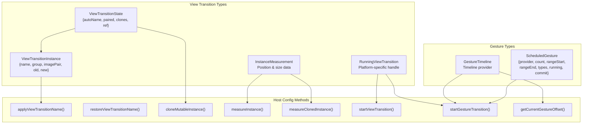

**ViewTransitionState 结构**

`ViewTransitionState` 附加到 ViewTransition fiber 节点并跟踪过渡生命周期：

| 字段 | 类型 | 描述 |
|-------|------|-------------|
| `autoName` | `null \| string` | 自动生成的 view-transition-name（当 name prop 为 'auto' 时） |
| `paired` | `null \| ViewTransitionState` | 进入/退出过渡期间的配对实例 |
| `clones` | `null \| Array<Instance>` | 手势应用阶段期间克隆的主机实例 |
| `ref` | `null \| ViewTransitionInstance` | 暴露给用户代码的当前 ref 实例 |

**ViewTransitionInstance 结构**

`ViewTransitionInstance` 表示一个带有可动画伪元素的视图过渡元素：

| 字段 | 类型 | 描述 |
|-------|------|-------------|
| `name` | `string` | 标识此元素的 view-transition-name |
| `group` | `mixin$Animatable` | ::view-transition-group 伪元素 |
| `imagePair` | `mixin$Animatable` | ::view-transition-image-pair 伪元素 |
| `old` | `mixin$Animatable` | ::view-transition-old 伪元素 |
| `new` | `mixin$Animatable` | ::view-transition-new 伪元素 |

**ScheduledGesture 结构**

手势在 `FiberRoot.pendingGestures` 的链表中排队和跟踪：

| 字段 | 类型 | 描述 |
|-------|------|-------------|
| `provider` | `GestureTimeline` | 时间线提供者（例如，ScrollTimeline） |
| `count` | `number` | 活动启动的引用计数 |
| `rangeStart` | `number` | 当前状态的起始百分比（0-100） |
| `rangeEnd` | `number` | 目标状态的结束百分比（0-100） |
| `types` | `null \| TransitionTypes` | 来自 addTransitionType 的过渡类型注解 |
| `running` | `null \| RunningViewTransition` | 活动过渡句柄 |
| `commit` | `null \| (() => void)` | 延迟的 commit 回调 |
| `committing` | `boolean` | 手势是否应在释放时提交 |
| `revertLane` | `Lane` | 用于调度回退渲染的 Lane |
| `prev` | `null \| ScheduledGesture` | 链表中的前一个手势 |
| `next` | `null \| ScheduledGesture` | 链表中的下一个手势 |

来源：[packages/react-reconciler/src/ReactFiberViewTransitionComponent.js:19-24](), [packages/react-dom-bindings/src/client/ReactFiberConfigDOM.js:253-259](), [packages/react-reconciler/src/ReactFiberGestureScheduler.js:31-43]()

---

## View Transition 生命周期

### ViewTransition 组件和状态管理

**ViewTransition 名称解析**

`ReactFiberViewTransitionComponent.js` 中的 `getViewTransitionName` 函数解析过渡名称：

1. 如果 `props.name` 显式设置（且不是 'auto'），使用该名称
2. 否则，如果 `instance.autoName` 存在，使用缓存的自动生成名称
3. 否则，生成唯一名称：`'_' + identifierPrefix + 't_' + globalClientId + '_'`

`getViewTransitionClassName` 函数根据以下内容解析 CSS 类：
- `props.default` - 所有过渡的默认类
- `props.enter` / `props.exit` / `props.share` - 事件特定类
- 来自 `getPendingTransitionTypes()` 的活动过渡类型

**按类型选择类名**

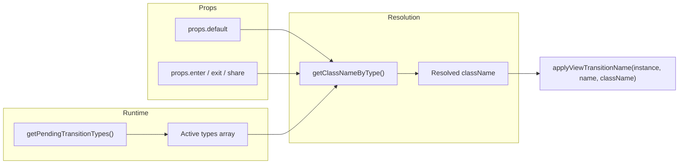

来源：[packages/react-reconciler/src/ReactFiberViewTransitionComponent.js:28-92]()

### 应用和管理 View Transition 名称

**View Transition 名称应用序列**

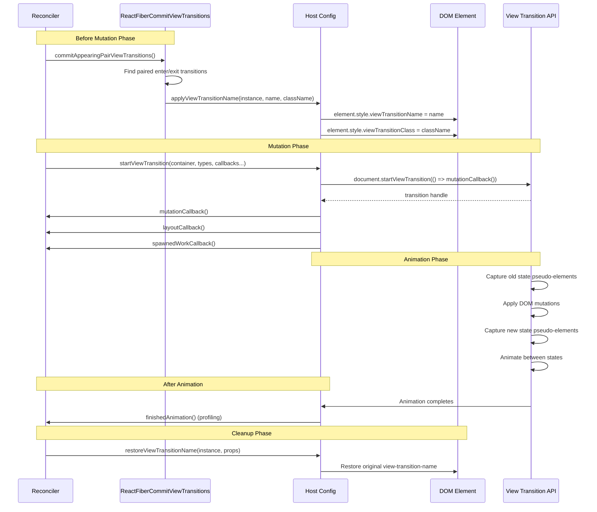

**关键主机配置方法：**

- **`applyViewTransitionName(instance, name, className)`** - 设置 `view-transition-name` 和可选的 `view-transition-class` CSS 属性
- **`restoreViewTransitionName(instance, props)`** - 在过渡完成后从 props 恢复 view-transition-name
- **`cancelViewTransitionName(instance, name, props)`** - 从元素中移除 view-transition-name
- **`cancelRootViewTransitionName(rootContainer)`** - 取消根容器上的视图过渡名称
- **`restoreRootViewTransitionName(rootContainer)`** - 恢复根容器的视图过渡名称

来源：[packages/react-dom-bindings/src/client/ReactFiberConfigDOM.js:1212-1297](), [packages/react-reconciler/src/ReactFiberCommitViewTransitions.js:232-285](), [packages/react-noop-renderer/src/createReactNoop.js:799-826]()

### 启动和停止 View Transitions

**startViewTransition 主机配置方法**

`startViewTransition` 方法与 React 的 commit phase 协调视图过渡：

```javascript
startViewTransition(
  rootContainer: Container,
  transitionTypes: null | TransitionTypes,
  mutationCallback: () => void,
  layoutCallback: () => void,
  afterMutationCallback: () => void,
  spawnedWorkCallback: () => void,
  passiveCallback: () => mixed,
  errorCallback: mixed => void,
  blockedCallback: string => void,  // Profiling-only
  finishedAnimation: () => void      // Profiling-only
): null | RunningViewTransition
```

**DOM 实现**

`ReactFiberConfigDOM.js` 中的 DOM 渲染器包装原生 View Transition API：

1. 调用 `document.startViewTransition(() => { mutationCallback(); })` 启动过渡
2. 附加 `.finished` promise 处理器以调用 `finishedAnimation()` 进行性能分析
3. 返回具有 `.skipTransition()` 方法的过渡对象
4. 如果启用了动画检测，使用 `suspendOnActiveViewTransition()` 等待动画

**回调执行顺序：**

1. **`mutationCallback()`** - 在 `document.startViewTransition()` 内执行以应用 DOM 变更
2. **`layoutCallback()`** - 在 mutation 后立即调用以执行布局效果
3. **`afterMutationCallback()`** - 在 mutation 完成后调用（在某些路径中跳过）
4. **`spawnedWorkCallback()`** - 调用以通知需要调度生成的工作
5. **`passiveCallback()`** - 在 passive effects phase 期间调用（在某些路径中跳过）
6. **`finishedAnimation()`** - 动画完成时调用（仅性能分析构建）

**停止过渡**

`stopViewTransition(transition)` 方法取消活动过渡：
- 在 DOM 中：调用 `transition.skipTransition()` 中止动画
- 在测试渲染器中：无操作，因为不会发生实际动画

**过渡生命周期跟踪**

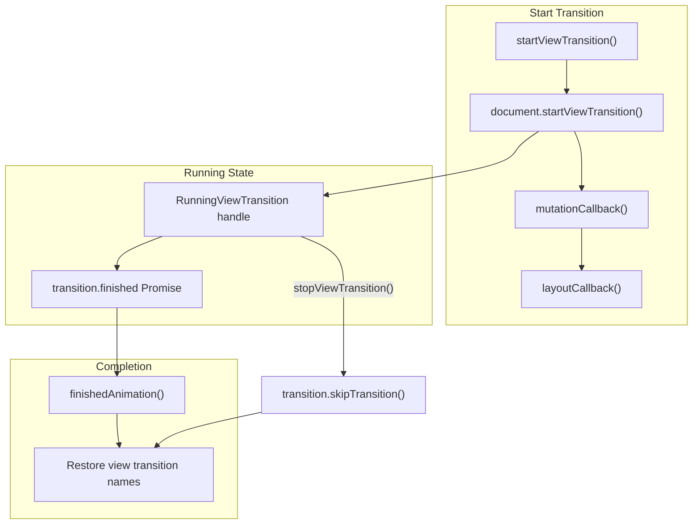

来源：[packages/react-dom-bindings/src/client/ReactFiberConfigDOM.js:1299-1412](), [packages/react-noop-renderer/src/createReactNoop.js:854-896](), [packages/react-native-renderer/src/ReactFiberConfigNative.js:668-690]()

---

## Apply Gesture Phase

### 手势的实例克隆

在手势过渡期间，React 克隆树以创建快照，该快照可以动画化，而活动树渲染目标状态。克隆过程由 `ReactFiberApplyGesture.js` 管理。

**克隆架构**

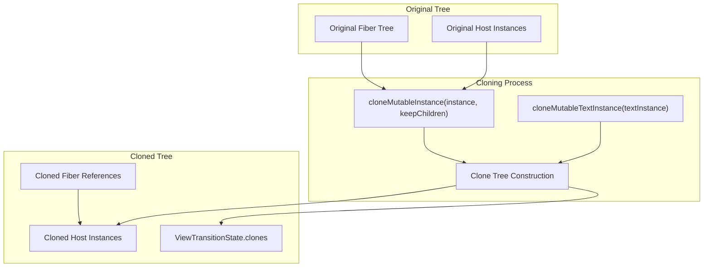

**访问阶段**

应用手势算法使用不同的访问阶段来确定克隆行为：

| 阶段 | 值 | 描述 |
|-------|-------|-------------|
| `CLONE_UPDATE` | 0 | 此子树中的变更或布局变更 |
| `CLONE_EXIT` | 1 | 在下一个 ViewTransition/HostComponent 之前重新出现的屏幕外内部 |
| `CLONE_UNHIDE` | 2 | 在下一个 HostComponent 之前重新出现的屏幕外内部 |
| `CLONE_APPEARING_PAIR` | 3 | 查找配对的出现过渡 |
| `CLONE_UNCHANGED` | 4 | 无变更但遍历到克隆树 |
| `INSERT_EXIT` | 5 | 在新挂载的树中，在下一个 ViewTransition/HostComponent 之前 |
| `INSERT_APPEND` | 6 | 在新挂载的树中，在下一个 HostComponent 之前 |
| `INSERT_APPEARING_PAIR` | 7 | 在新挂载的树中查找配对 |

**克隆和变更跟踪**

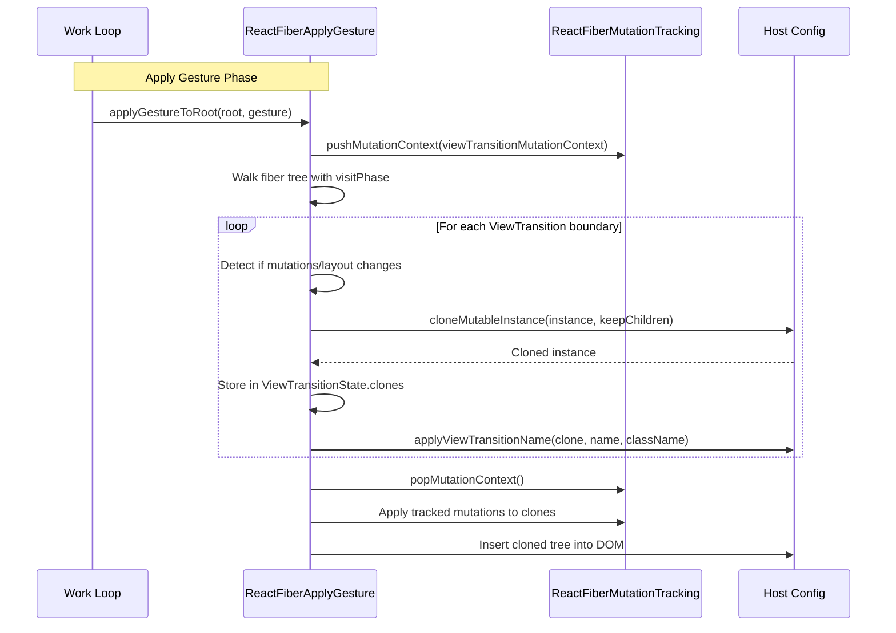

**实例克隆方法：**

- **`cloneMutableInstance(instance, keepChildren)`** - 克隆主机实例，可选择保留子节点
- **`cloneMutableTextInstance(textInstance)`** - 克隆文本实例
- **`cloneRootViewTransitionContainer(rootContainer)`** - 为过渡克隆根容器

来源：[packages/react-reconciler/src/ReactFiberApplyGesture.js:104-316](), [packages/react-dom-bindings/src/client/ReactFiberConfigDOM.js:613-638]()

### 测量系统

**实例测量和变更检测**

React 测量实例的位置和尺寸，以确定过渡期间发生的变化：

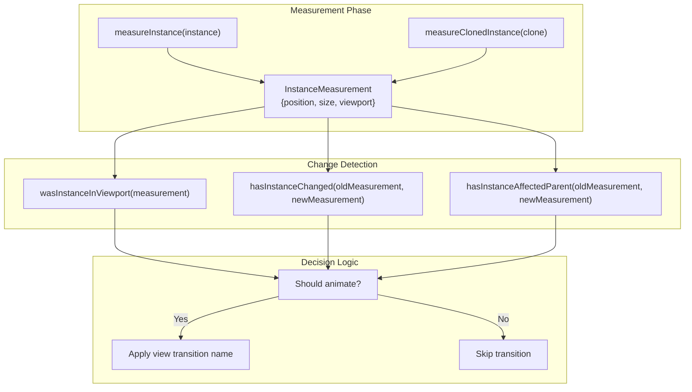

**测量 API 方法：**

| 方法 | 目的 | 实现 |
|--------|---------|----------------|
| `measureInstance(instance)` | 在变更前捕获位置和尺寸 | DOM：使用 `getBoundingClientRect()` |
| `measureClonedInstance(instance)` | 测量克隆实例 | DOM：在克隆上使用 `getBoundingClientRect()` |
| `wasInstanceInViewport(measurement)` | 检查实例是否在视口中 | DOM：将边界与窗口尺寸进行比较 |
| `hasInstanceChanged(oldMeasurement, newMeasurement)` | 检测位置/尺寸变更 | DOM：比较测量值 |
| `hasInstanceAffectedParent(oldMeasurement, newMeasurement)` | 检查父布局是否受影响 | DOM：比较相对于父级的位置 |

**根容器克隆：**

对于涉及根容器的视图过渡，React 克隆整个容器：

- **`cloneRootViewTransitionContainer(rootContainer)`** - 创建根的快照克隆
- **`removeRootViewTransitionClone(rootContainer, clone)`** - 在过渡后移除克隆的快照

来源：[packages/react-dom-bindings/src/client/ReactFiberConfigDOM.js:1508-1584](), [packages/react-noop-renderer/src/createReactNoop.js:828-852](), [packages/react-native-renderer/src/ReactFiberConfigNative.js:639-666]()

---

## Gesture Scheduling 系统

### 手势队列和生命周期

**FiberRoot 手势状态管理**

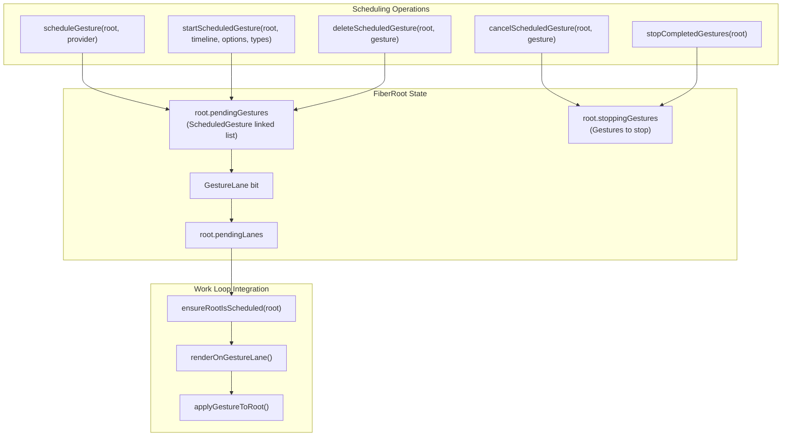

### 调度手势

**scheduleGesture 函数流程**

`ReactFiberGestureScheduler.js` 中的 `scheduleGesture(root, provider)` 函数将手势添加到待处理队列：

1. 在 `root.pendingGestures` 链表中搜索匹配的 `provider`
2. 如果找到，返回现有的 `ScheduledGesture`
3. 如果未找到，创建新的 `ScheduledGesture`，初始状态为：
   - `count: 0`（尚未启动）
   - `rangeStart: 0, rangeEnd: 100`（未初始化）
   - `types: null`（尚无过渡类型）
   - `running: null`（无活动过渡）
4. 追加到链表
5. 调用 `ensureRootIsScheduled(root)` 调度渲染工作

**startScheduledGesture 激活**

`startScheduledGesture(root, gestureTimeline, gestureOptions, transitionTypes)` 函数激活手势：

1. 从 `gestureOptions.rangeStart` 或 `getCurrentGestureOffset(gestureTimeline)` 计算 `rangeStart`
2. 从 `gestureOptions.rangeEnd` 或基于当前偏移的启发式计算 `rangeEnd`：
   - 如果 `rangeStart < 50`，默认 `rangeEnd = 100`
   - 如果 `rangeStart >= 50`，默认 `rangeEnd = 0`
3. 在 `root.pendingGestures` 中查找匹配的手势
4. 递增 `gesture.count`（引用计数）
5. 更新 `gesture.rangeStart`、`gesture.rangeEnd`
6. 将 `transitionTypes` 合并到 `gesture.types` 数组中（去重）
7. 返回 `ScheduledGesture` 以供跟踪

**手势生命周期序列**

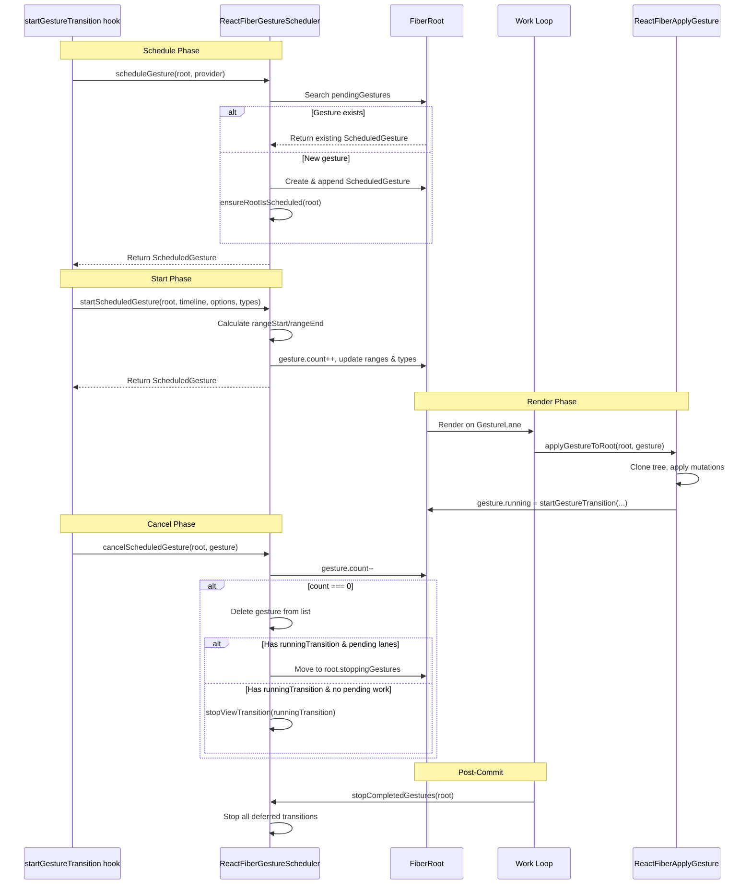

来源：[packages/react-reconciler/src/ReactFiberGestureScheduler.js:48-130]()

### 取消和停止手势

**cancelScheduledGesture 实现**

`cancelScheduledGesture(root, gesture)` 函数处理手势清理和引用计数：

1. 如果 `gesture.revertLane !== NoLane`，将其与任何新的过渡 Lane 纠缠，以确保它们一起提交
2. 递减 `gesture.count`
3. 如果 `count === 0`：
   - 根据最终偏移确定是提交还是回退：
     - 如果 `rangeStart < rangeEnd`：当 `finalOffset > midpoint` 时提交
     - 如果 `rangeStart > rangeEnd`：当 `finalOffset < midpoint` 时提交
   - 如果提交且有 `gesture.running`：
     - 设置 `gesture.committing = true`
     - 在 `GestureLane` 上调度渲染以提交
   - 否则，调用 `deleteScheduledGesture(root, gesture)` 移除

**deleteScheduledGesture 链表管理**

`deleteScheduledGesture(root, gesture)` 函数从队列中移除手势：

1. 更新链表指针：
   - `gesture.prev.next = gesture.next`
   - `gesture.next.prev = gesture.prev`
2. 如果移除头部，更新 `root.pendingGestures = gesture.next`
3. 如果队列变为空（`root.pendingGestures === null`）：
   - 通过 `markRootFinished(root, GestureLane)` 从 `root.pendingLanes` 清除 `GestureLane`
4. 如果 `gesture.running` 存在：
   - 如果有阻塞/过渡 Lane 待处理：移动到 `root.stoppingGestures`
   - 否则：立即调用 `stopViewTransition(gesture.running)`

**stopCompletedGestures 延迟清理**

`stopCompletedGestures(root)` 函数在 commit 后调用：

1. 检查 `root.stoppingGestures` 是否非空
2. 遍历延迟手势的链表
3. 为每个手势调用 `stopViewTransition(gesture.running)`
4. 清除 `root.stoppingGestures = null`

**提交处理**

如果渲染期间 `gesture.committing === true`：
1. 应用变更以提交目标状态
2. 提交后，如果调度了新手势，触发回退过渡
3. 否则，正常完成而不回退

来源：[packages/react-reconciler/src/ReactFiberGestureScheduler.js:132-198]()

---

## Gesture Timeline 集成

### 启动手势过渡

`startGestureTransition` 方法启动手势驱动的视图过渡：

```javascript
startGestureTransition(
  rootContainer: Container,
  timeline: GestureTimeline,
  rangeStart: number,
  rangeEnd: number,
  transitionTypes: null | TransitionTypes,
  mutationCallback: () => void,
  animateCallback: () => void,
  errorCallback: mixed => void,
  finishedAnimation: () => void
): null | RunningViewTransition
```

**执行流程：**

1. 调用 `mutationCallback()` 应用 DOM 变更
2. 调用 `animateCallback()` 沿时间线设置动画
3. 可选调用 `finishedAnimation()` 进行性能分析
4. 返回句柄以取消手势过渡

**`getCurrentGestureOffset(provider)`** - 查询手势时间线上的当前位置（0-100 百分比）。

来源：[packages/react-noop-renderer/src/createReactNoop.js:874-897](), [packages/react-native-renderer/src/ReactFiberConfigNative.js:694-730]()

---

## 平台特定实现

### DOM 渲染器实现

`ReactFiberConfigDOM.js` 中的 DOM 渲染器提供完整的视图过渡支持：

**View Transition 名称管理**

```javascript
// Apply view transition name and class
function applyViewTransitionName(instance, name, className) {
  const style = instance.style;
  if (typeof style.viewTransitionName === 'string') {
    style.viewTransitionName = name;
    if (className != null) {
      style.viewTransitionClass = className;
    }
  }
}

// Restore from props
function restoreViewTransitionName(instance, props) {
  const style = instance.style;
  if (typeof style.viewTransitionName === 'string') {
    const propName = props.style?.viewTransitionName ?? 
                     props.style?.['view-transition-name'];
    style.viewTransitionName = propName ?? '';
    // Also restore viewTransitionClass...
  }
}
```

**原生 View Transition API 集成**

`startViewTransition` 实现包装浏览器 API：

```javascript
function startViewTransition(
  rootContainer,
  transitionTypes,
  mutationCallback,
  layoutCallback,
  afterMutationCallback,
  spawnedWorkCallback,
  passiveCallback,
  errorCallback,
  blockedCallback,
  finishedAnimation
) {
  const transition = document.startViewTransition(() => {
    mutationCallback();
  });
  
  layoutCallback();
  afterMutationCallback();
  spawnedWorkCallback();
  
  transition.finished.then(() => {
    finishedAnimation();
  });
  
  return transition;
}
```

**测量实现**

- **`measureInstance(instance)`** - 使用 `instance.getBoundingClientRect()` 捕获位置/尺寸
- **`wasInstanceInViewport(measurement)`** - 将边界与 `window.innerWidth` 和 `window.innerHeight` 进行比较
- **`hasInstanceChanged(oldMeasurement, newMeasurement)`** - 比较 rect 属性
- **`hasInstanceAffectedParent(oldMeasurement, newMeasurement)`** - 检查相对于父级的位置变更

**事件驱动调度**

- **`shouldAttemptEagerTransition()`** - 在 popstate 事件期间返回 `true` 以同步渲染过渡
- **`trackSchedulerEvent()`** - 在 `schedulerEvent` 变量中捕获 `window.event`
- **`resolveEventType()`** - 如果与 `schedulerEvent` 不同，返回 `window.event.type`
- **`resolveEventTimeStamp()`** - 返回 `window.event.timeStamp` 用于计时

**实例克隆**

```javascript
function cloneMutableInstance(instance, keepChildren) {
  return instance.cloneNode(keepChildren);
}

function cloneMutableTextInstance(textInstance) {
  return textInstance.cloneNode(false);
}
```

来源：[packages/react-dom-bindings/src/client/ReactFiberConfigDOM.js:613-638](), [packages/react-dom-bindings/src/client/ReactFiberConfigDOM.js:1212-1297](), [packages/react-dom-bindings/src/client/ReactFiberConfigDOM.js:1299-1412](), [packages/react-dom-bindings/src/client/ReactFiberConfigDOM.js:733-770]()

### React Native 实现

**Fabric 渲染器（新架构）**

`ReactFiberConfigFabric.js` 中的 React Native Fabric 渲染器提供存根实现：

```javascript
// View transition names - not yet implemented
export function applyViewTransitionName(instance, name, className) {
  // Not yet implemented
}

// Start view transition - executes callbacks but no animation
export function startViewTransition(...callbacks) {
  mutationCallback();
  layoutCallback();
  // Skip afterMutationCallback - not needed
  spawnedWorkCallback();
  // Skip passiveCallback - spawned work will schedule
  return null;
}

// Start gesture transition - executes callbacks but no animation
export function startGestureTransition(...callbacks) {
  mutationCallback();
  animateCallback();
  if (enableProfilerTimer) {
    finishedAnimation();
  }
  return null;
}

// Gesture offset - throws error
export function getCurrentGestureOffset(provider) {
  throw new Error('startGestureTransition is not yet supported in React Native.');
}
```

**旧版渲染器（旧架构）**

`ReactFiberConfigNative.js` 中的旧版渲染器具有相同的存根实现。两个渲染器都执行回调以确保 React 的 commit phase 正确完成，但由于 React Native 没有原生视图过渡 API，因此不会发生实际动画。

**测量方法**

所有测量方法返回 null 或虚拟值：
- `measureInstance(instance)` 返回 `null`
- `measureClonedInstance(instance)` 返回 `null`
- `wasInstanceInViewport(measurement)` 返回 `true`
- `hasInstanceChanged(old, new)` 返回 `false`
- `hasInstanceAffectedParent(old, new)` 返回 `false`

来源：[packages/react-native-renderer/src/ReactFiberConfigFabric.js:593-730](), [packages/react-native-renderer/src/ReactFiberConfigNative.js:593-730]()

### 测试渲染器实现

**react-test-renderer**

`ReactFiberConfigTestHost.js` 中的测试渲染器提供无操作实现，允许测试执行：

```javascript
export function startViewTransition(...callbacks) {
  mutationCallback();
  layoutCallback();
  // Skip afterMutationCallback
  spawnedWorkCallback();
  // Skip passiveCallback
  return null;
}

export function startGestureTransition(...callbacks) {
  mutationCallback();
  animateCallback();
  if (enableProfilerTimer) {
    finishedAnimation();
  }
  return null;
}

export function cloneMutableInstance(instance, keepChildren) {
  return {
    type: instance.type,
    props: instance.props,
    isHidden: instance.isHidden,
    children: keepChildren ? instance.children : [],
    internalInstanceHandle: null,
    rootContainerInstance: instance.rootContainerInstance,
    tag: 'INSTANCE',
  };
}
```

**react-noop-renderer**

React 内部测试中使用的 noop 渲染器具有更复杂的实现用于测试目的：
- 通过 `hostCloneCounter` 跟踪调用计数
- 维护实例关系
- 验证克隆操作

来源：[packages/react-test-renderer/src/ReactFiberConfigTestHost.js:176-458](), [packages/react-noop-renderer/src/createReactNoop.js:243-288](), [packages/react-noop-renderer/src/createReactNoop.js:799-897]()

---

## 与 Reconciler 的集成

### Gesture Lane 调度

手势使用在 `ReactFiberLane.js` 中定义的专用 Lane（`GestureLane`）：

**Lane 分配流程**

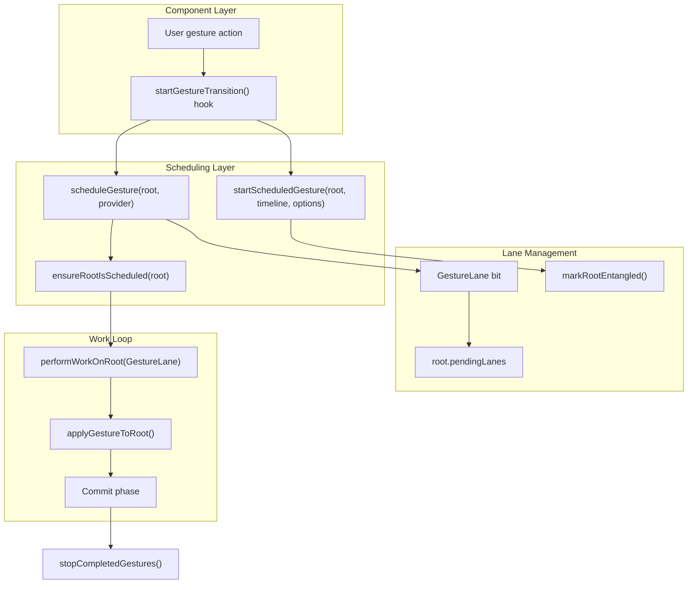

**Lane 生命周期：**

1. `scheduleGesture()` 将手势添加到 `root.pendingGestures`，并隐式将 `GestureLane` 添加到 `root.pendingLanes`
2. `ensureRootIsScheduled(root)` 在 `GestureLane` 上调度工作
3. 渲染期间，`applyGestureToRoot()` 处理手势
4. 当队列为空时，`deleteScheduledGesture()` 通过 `markRootFinished(root, GestureLane)` 清除 `GestureLane`
5. 如果手势有阻塞/过渡工作，Lane 保持设置直到 commit 完成

**纠缠：**

当取消具有 `revertLane !== NoLane` 的手势时，通过 `markRootEntangled()` 将回退 Lane 与新过渡 Lane 纠缠，以确保它们一起提交。

来源：[packages/react-reconciler/src/ReactFiberLane.js:108](), [packages/react-reconciler/src/ReactFiberGestureScheduler.js:17-22](), [packages/react-reconciler/src/ReactFiberGestureScheduler.js:138-141]()

### Commit Phase 集成

**View Transition 提交序列**

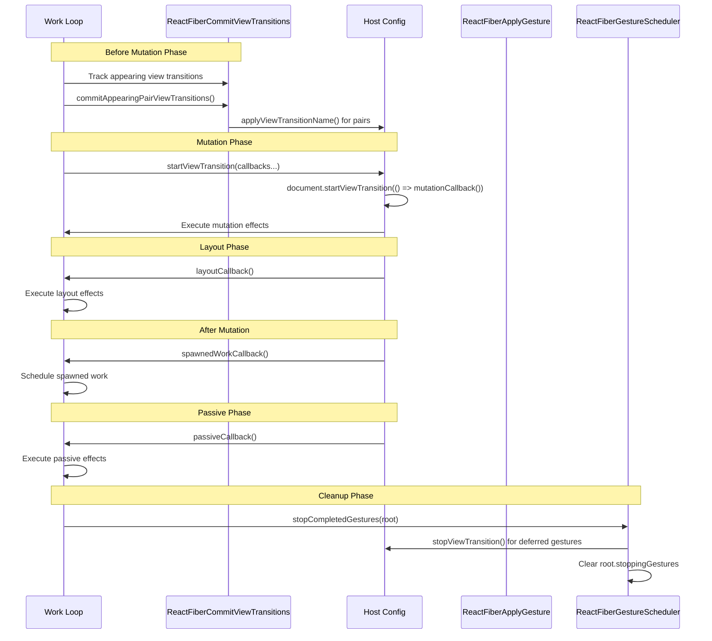

**阶段职责：**

| 阶段 | 职责 |
|-------|------------------|
| **Before Mutation** | 跟踪出现的 ViewTransitions，查找配对，测量实例 |
| **Mutation** | 启动视图过渡，在 mutationCallback 中应用 DOM 变更 |
| **Layout** | 执行布局效果，布局后测量 |
| **After Mutation** | 协调生成的工作，为手势插入克隆树 |
| **Passive** | 执行 passive effects，调度任何剩余工作 |
| **Post-Commit** | 停止延迟的手势过渡，清理 stoppingGestures |

**手势应用阶段：**

对于手势过渡，`applyGestureToRoot()` 在渲染阶段（非 commit）调用：
1. 克隆 fiber 树以创建快照
2. 将变更应用到克隆
3. 将克隆树插入 DOM
4. 使用时间线启动 `startGestureTransition()`
5. 在 `gesture.running` 中存储句柄

来源：[packages/react-reconciler/src/ReactFiberCommitViewTransitions.js:232-285](), [packages/react-reconciler/src/ReactFiberApplyGesture.js:317-800](), [packages/react-reconciler/src/ReactFiberGestureScheduler.js:185-198]()

---

## 总结

React 的视图过渡和手势调度系统提供：

| 组件 | 目的 | 关键类型 | 关键方法 |
|-----------|---------|-----------|-------------|
| **View Transitions** | 浏览器 API 集成 | `ViewTransitionInstance`、`RunningViewTransition` | `startViewTransition`、`applyViewTransitionName`、测量方法 |
| **Gesture Scheduling** | 时间线驱动的动画 | `ScheduledGesture`、`GestureTimeline` | `scheduleGesture`、`startScheduledGesture`、`cancelScheduledGesture` |
| **Measurement** | 变更检测 | `InstanceMeasurement` | `measureInstance`、`hasInstanceChanged`、`wasInstanceInViewport` |
| **Host Config** | 平台抽象 | 平台特定句柄 | 所有方法按平台实现 |

DOM 渲染器为这些功能提供完整支持，而 React Native 和测试渲染器提供存根实现，在无实际动画的情况下保持 API 兼容性。

来源：[packages/react-reconciler/src/ReactFiberGestureScheduler.js](), [packages/react-dom-bindings/src/client/ReactFiberConfigDOM.js](), [packages/react-noop-renderer/src/createReactNoop.js]()