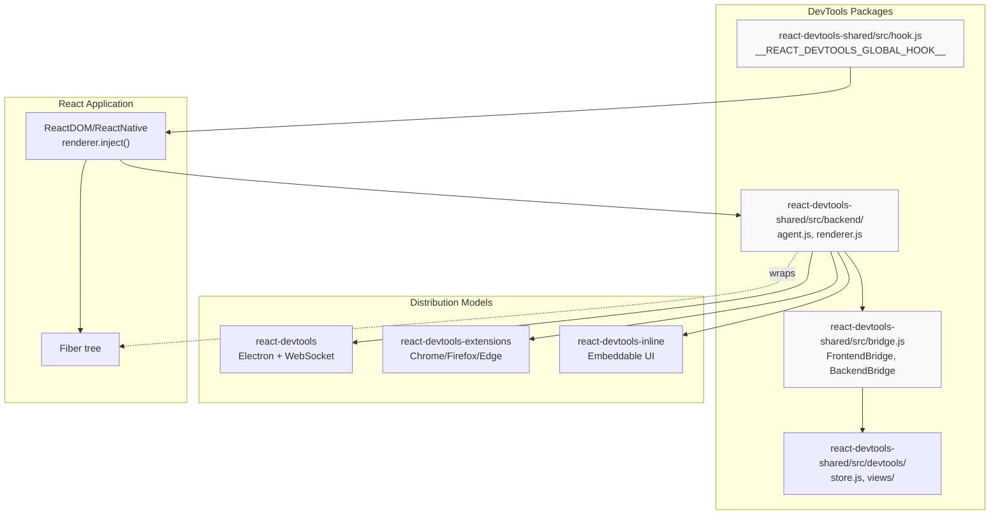
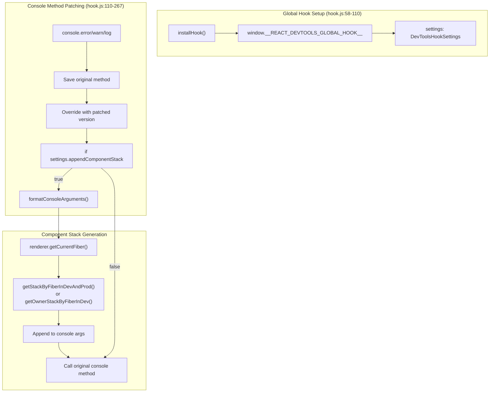
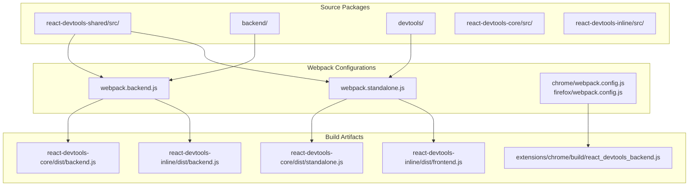

# 开发者工具与调试

<!-- > 来源：https://deepwiki.com/facebook/react/7-developer-tools-and-debugging -->

<details>
<summary>相关源文件</summary>

以下文件用于生成此 wiki 页面的上下文：

- [.eslintrc.js](.eslintrc.js)
- [fixtures/devtools/standalone/index.html](fixtures/devtools/standalone/index.html)
- [package.json](package.json)
- [packages/eslint-plugin-react-hooks/package.json](https://github.com/facebook/react/blob/main/packages/eslint-plugin-react-hooks/package.json)
- [packages/jest-react/package.json](https://github.com/facebook/react/blob/main/packages/jest-react/package.json)
- [packages/react-art/package.json](https://github.com/facebook/react/blob/main/packages/react-art/package.json)
- [packages/react-devtools-core/README.md](https://github.com/facebook/react/blob/main/packages/react-devtools-core/README.md)
- [packages/react-devtools-core/src/backend.js](https://github.com/facebook/react/blob/main/packages/react-devtools-core/src/backend.js)
- [packages/react-devtools-extensions/src/contentScripts/hookSettingsInjector.js](https://github.com/facebook/react/blob/main/packages/react-devtools-extensions/src/contentScripts/hookSettingsInjector.js)
- [packages/react-devtools-extensions/src/contentScripts/installHook.js](https://github.com/facebook/react/blob/main/packages/react-devtools-extensions/src/contentScripts/installHook.js)
- [packages/react-devtools-extensions/src/contentScripts/messages.js](https://github.com/facebook/react/blob/main/packages/react-devtools-extensions/src/contentScripts/messages.js)
- [packages/react-devtools-inline/src/backend.js](https://github.com/facebook/react/blob/main/packages/react-devtools-inline/src/backend.js)
- [packages/react-devtools-shared/src/__tests__/componentStacks-test.js](https://github.com/facebook/react/blob/main/packages/react-devtools-shared/src/__tests__/componentStacks-test.js)
- [packages/react-devtools-shared/src/__tests__/console-test.js](https://github.com/facebook/react/blob/main/packages/react-devtools-shared/src/__tests__/console-test.js)
- [packages/react-devtools-shared/src/__tests__/inspectedElement-test.js](https://github.com/facebook/react/blob/main/packages/react-devtools-shared/src/__tests__/inspectedElement-test.js)
- [packages/react-devtools-shared/src/__tests__/legacy/inspectElement-test.js](https://github.com/facebook/react/blob/main/packages/react-devtools-shared/src/__tests__/legacy/inspectElement-test.js)
- [packages/react-devtools-shared/src/__tests__/setupTests.js](https://github.com/facebook/react/blob/main/packages/react-devtools-shared/src/__tests__/setupTests.js)
- [packages/react-devtools-shared/src/__tests__/store-test.js](https://github.com/facebook/react/blob/main/packages/react-devtools-shared/src/__tests__/store-test.js)
- [packages/react-devtools-shared/src/attachRenderer.js](https://github.com/facebook/react/blob/main/packages/react-devtools-shared/src/attachRenderer.js)
- [packages/react-devtools-shared/src/backend/agent.js](https://github.com/facebook/react/blob/main/packages/react-devtools-shared/src/backend/agent.js)
- [packages/react-devtools-shared/src/backend/fiber/renderer.js](https://github.com/facebook/react/blob/main/packages/react-devtools-shared/src/backend/fiber/renderer.js)
- [packages/react-devtools-shared/src/backend/legacy/renderer.js](https://github.com/facebook/react/blob/main/packages/react-devtools-shared/src/backend/legacy/renderer.js)
- [packages/react-devtools-shared/src/backend/types.js](https://github.com/facebook/react/blob/main/packages/react-devtools-shared/src/backend/types.js)
- [packages/react-devtools-shared/src/backend/views/Highlighter/index.js](https://github.com/facebook/react/blob/main/packages/react-devtools-shared/src/backend/views/Highlighter/index.js)
- [packages/react-devtools-shared/src/backendAPI.js](https://github.com/facebook/react/blob/main/packages/react-devtools-shared/src/backendAPI.js)
- [packages/react-devtools-shared/src/bridge.js](https://github.com/facebook/react/blob/main/packages/react-devtools-shared/src/bridge.js)
- [packages/react-devtools-shared/src/devtools/store.js](https://github.com/facebook/react/blob/main/packages/react-devtools-shared/src/devtools/store.js)
- [packages/react-devtools-shared/src/devtools/utils.js](https://github.com/facebook/react/blob/main/packages/react-devtools-shared/src/devtools/utils.js)
- [packages/react-devtools-shared/src/devtools/views/Profiler/CommitTreeBuilder.js](https://github.com/facebook/react/blob/main/packages/react-devtools-shared/src/devtools/views/Profiler/CommitTreeBuilder.js)
- [packages/react-devtools-shared/src/devtools/views/utils.js](https://github.com/facebook/react/blob/main/packages/react-devtools-shared/src/devtools/views/utils.js)
- [packages/react-devtools-shared/src/frontend/types.js](https://github.com/facebook/react/blob/main/packages/react-devtools-shared/src/frontend/types.js)
- [packages/react-devtools-shared/src/hook.js](https://github.com/facebook/react/blob/main/packages/react-devtools-shared/src/hook.js)
- [packages/react-devtools-shared/src/hydration.js](https://github.com/facebook/react/blob/main/packages/react-devtools-shared/src/hydration.js)
- [packages/react-devtools-shared/src/utils.js](https://github.com/facebook/react/blob/main/packages/react-devtools-shared/src/utils.js)
- [packages/react-devtools-shell/src/app/ElementTypes/index.js](https://github.com/facebook/react/blob/main/packages/react-devtools-shell/src/app/ElementTypes/index.js)
- [packages/react-devtools-shell/src/app/InspectableElements/SimpleValues.js](https://github.com/facebook/react/blob/main/packages/react-devtools-shell/src/app/InspectableElements/SimpleValues.js)
- [packages/react-devtools-shell/src/app/InspectableElements/SymbolKeys.js](https://github.com/facebook/react/blob/main/packages/react-devtools-shell/src/app/InspectableElements/SymbolKeys.js)
- [packages/react-devtools-shell/src/app/InspectableElements/UnserializableProps.js](https://github.com/facebook/react/blob/main/packages/react-devtools-shell/src/app/InspectableElements/UnserializableProps.js)
- [packages/react-dom/package.json](https://github.com/facebook/react/blob/main/packages/react-dom/package.json)
- [packages/react-is/package.json](https://github.com/facebook/react/blob/main/packages/react-is/package.json)
- [packages/react-native-renderer/package.json](https://github.com/facebook/react/blob/main/packages/react-native-renderer/package.json)
- [packages/react-noop-renderer/package.json](https://github.com/facebook/react/blob/main/packages/react-noop-renderer/package.json)
- [packages/react-reconciler/package.json](https://github.com/facebook/react/blob/main/packages/react-reconciler/package.json)
- [packages/react-test-renderer/package.json](https://github.com/facebook/react/blob/main/packages/react-test-renderer/package.json)
- [packages/react/package.json](https://github.com/facebook/react/blob/main/packages/react/package.json)
- [packages/react/src/ReactForwardRef.js](https://github.com/facebook/react/blob/main/packages/react/src/ReactForwardRef.js)
- [packages/react/src/ReactMemo.js](https://github.com/facebook/react/blob/main/packages/react/src/ReactMemo.js)
- [packages/scheduler/package.json](https://github.com/facebook/react/blob/main/packages/scheduler/package.json)
- [packages/shared/ReactVersion.js](https://github.com/facebook/react/blob/main/packages/shared/ReactVersion.js)
- [scripts/flow/config/flowconfig](scripts/flow/config/flowconfig)
- [scripts/flow/createFlowConfigs.js](scripts/flow/createFlowConfigs.js)
- [scripts/flow/environment.js](scripts/flow/environment.js)
- [scripts/rollup/validate/eslintrc.cjs.js](scripts/rollup/validate/eslintrc.cjs.js)
- [scripts/rollup/validate/eslintrc.cjs2015.js](scripts/rollup/validate/eslintrc.cjs2015.js)
- [scripts/rollup/validate/eslintrc.esm.js](scripts/rollup/validate/eslintrc.esm.js)
- [scripts/rollup/validate/eslintrc.fb.js](scripts/rollup/validate/eslintrc.fb.js)
- [scripts/rollup/validate/eslintrc.rn.js](scripts/rollup/validate/eslintrc.rn.js)
- [yarn.lock](yarn.lock)

</details>


React 仓库提供了覆盖整个开发生命周期的开发者工具：

| 工具 | 阶段 | 用途 |
|------|------|------|
| **eslint-plugin-react-hooks** | 编辑/构建时 | 静态验证 Hooks 规则和依赖数组 |
| **React DevTools** | 运行时 | 检查组件树、性能分析、调试状态 |
| **Console Patching** | 运行时 | 在控制台消息中附加组件堆栈 |
| **Performance Tracks** | 运行时 | 为 Performance 面板发出 User Timing 标记 |

React DevTools 由三部分组成：通过 `__REACT_DEVTOOLS_GLOBAL_HOOK__` 附加到 React renderer 的 backend、显示组件树和分析数据的 frontend，以及用于通信的版本化 bridge 协议。ESLint 插件使用 AST 分析来强制执行 Hook 使用模式。Console patching 基础设施通过组件堆栈增强错误消息。

**来源：**
- [packages/react-devtools-shared/src/hook.js#L58-L86](https://github.com/facebook/react/blob/main/packages/react-devtools-shared/src/hook.js#L58-L86)
- [packages/react-devtools-shared/src/backend/fiber/renderer.js#L1006-L1102](https://github.com/facebook/react/blob/main/packages/react-devtools-shared/src/backend/fiber/renderer.js#L1006-L1102)
- [packages/eslint-plugin-react-hooks/src/RulesOfHooks.ts#L1-L50](https://github.com/facebook/react/blob/main/packages/eslint-plugin-react-hooks/src/RulesOfHooks.ts#L1-L50)

## React DevTools

React DevTools 提供 React 应用的运行时检查和性能分析。系统包含：

- **Backend**：通过 `__REACT_DEVTOOLS_GLOBAL_HOOK__.inject()` 附加到 React renderer，将 Fiber 节点包装在具有稳定 ID 的 `DevToolsInstance` 对象中
- **Frontend**：通过 `Store` 类显示组件树、状态/属性以及性能分析数据
- **Bridge**：用于通信的版本化协议（版本 2），将树变更序列化为紧凑的整数数组

DevTools 工具生态系统



核心能力：
- **组件树**：`Store` 维护 `_idToElement`、`_ownersMap`、`_roots` 来跟踪组件层次结构
- **状态检查**：`inspectHooksOfFiber()` 提取 hook 值，`cleanForBridge()` 序列化复杂数据
- **性能分析**：`injectProfilingHooks()` 收集 `fiberActualDurations`、effect 时序
- **Suspense 调试**：`_idToSuspense` 跟踪挂起状态，在空间上可视化边界

DevTools 支持三种部署模式：独立的 Electron 应用、浏览器扩展和内嵌式 UI。详细架构见第 7.1 页，分发详情见第 7.2 页。

**来源：**
- [packages/react-devtools-shared/src/hook.js#L58-L86](https://github.com/facebook/react/blob/main/packages/react-devtools-shared/src/hook.js#L58-L86)
- [packages/react-devtools-shared/src/backend/fiber/renderer.js#L183-L292](https://github.com/facebook/react/blob/main/packages/react-devtools-shared/src/backend/fiber/renderer.js#L183-L292)
- [packages/react-devtools-shared/src/devtools/store.js#L143-L348](https://github.com/facebook/react/blob/main/packages/react-devtools-shared/src/devtools/store.js#L143-L348)
- [packages/react-devtools-shared/src/bridge.js#L47-L73](https://github.com/facebook/react/blob/main/packages/react-devtools-shared/src/bridge.js#L47-L73)
- [packages/react-devtools/package.json#L1-L32](https://github.com/facebook/react/blob/main/packages/react-devtools/package.json#L1-L32)

## Console 集成与调试工具

除了 DevTools UI，React 还提供了多个运行时调试工具，增强浏览器控制台体验。

### Console Patching

Console Patching 实现（hook.js）



Hook 在 [hook.js:110-267]() 中修补 console 方法。关键实现细节：

- **设置**：`DevToolsHookSettings` 控制行为
  - `appendComponentStack` - 是否附加堆栈（开发环境默认为 true）
  - `breakOnConsoleErrors` - 在错误时设置调试器断点
- **堆栈提取**：调用 `renderer.getCurrentFiber()` 获取活动 Fiber，然后调用 `getStackByFiberInDevAndProd()` 或 `getOwnerStackByFiberInDev()` [renderer.js:133-138]()
- **格式化**：`formatConsoleArguments()` 插入 ANSI/CSS 样式以显示暗淡的组件堆栈

### Component Stacks

React 19.1+ 支持**Owner Stacks**，显示逻辑组件所有权而非渲染树层次结构：

- `captureOwnerStack()` - 在任何位置捕获 owner stack 的公共 API [CHANGELOG.md:98]()
- `supportsOwnerStacks()` - 检查 backend 是否支持 owner stack [DevToolsFiberComponentStack.js:136-137]()
- `getOwnerStackByFiberInDev()` - 从 Fiber 提取 owner 链 [DevToolsFiberComponentStack.js:135-138]()
- `formatOwnerStack()` - 格式化 owner stack 以供显示 [DevToolsOwnerStack.js]()

Owner stacks 与传统组件堆栈的区别：
- 显示哪个组件创建了元素（owner），而非哪个组件渲染了它（parent）
- 适用于 HOC 和 render props，其中所有权 ≠ 父子关系
- 在 Server Components 中跨服务器-客户端边界工作

### Performance Tracks

React 19.2+ 发出 User Timing API 标记，出现在 Performance 面板中 [CHANGELOG.md:12]()：

- 通过 `injectProfilingHooks()` 注入性能分析 hooks [renderer.js:1106-1119]()
- 创建的标记包括：
  - 组件渲染开始/结束
  - Commit 阶段开始/结束
  - Passive effects 开始/结束
- `supportsPerformanceTracks` 能力标志 [store.js:86]()

**来源：**
- [packages/react-devtools-shared/src/hook.js#L110-L267](https://github.com/facebook/react/blob/main/packages/react-devtools-shared/src/hook.js#L110-L267)
- [packages/react-devtools-shared/src/backend/fiber/renderer.js#L133-L138](https://github.com/facebook/react/blob/main/packages/react-devtools-shared/src/backend/fiber/renderer.js#L133-L138)
- [packages/react-devtools-shared/src/backend/fiber/renderer.js#L1106-L1119](https://github.com/facebook/react/blob/main/packages/react-devtools-shared/src/backend/fiber/renderer.js#L1106-L1119)
- [packages/react-devtools-shared/src/devtools/store.js:86](https://github.com/facebook/react/blob/main/packages/react-devtools-shared/src/devtools/store.js:86)
- [CHANGELOG.md:12]()
- [CHANGELOG.md:86]()

## React Hooks 的 ESLint 插件

`eslint-plugin-react-hooks` 包通过静态 AST 分析强制执行 Hook 使用模式。它提供两条规则：

| 规则 | 严重程度 | 用途 |
|------|----------|------|
| `rules-of-hooks` | error | 确保 Hooks 仅在顶层调用，不在循环/条件中 |
| `exhaustive-deps` | warn | 验证 `useEffect`、`useMemo`、`useCallback` 的依赖数组 |

ESLint 插件分析流程

```mermaid
graph TB
    subgraph RulesOfHooks["rules-of-hooks"]
        visitCall["Visit CallExpression"]
        matchHook["Match /^use[A-Z]/ pattern"]
        getCodePath["ESLint CodePathSegment"]
        checkContext["isInsideLoop()<br/>isInsideConditional()"]
        reportViolation["Report: Hook in loop/condition"]
    end
    
    subgraph ExhaustiveDeps["exhaustive-deps"]
        visitEffect["Visit useEffect/useMemo/useCallback"]
        extractDeps["Extract dependency array"]
        analyzeScope["Analyze callback scope"]
        collectRefs["collectReferencesInScope()"]
        checkStable["Filter stable values:<br/>setState, dispatch, ref.current"]
        diffDeps["Compare vs declared deps"]
        suggestFix["Suggest missing/extra deps"]
    end
    
    visitCall --> matchHook
    matchHook --> getCodePath
    getCodePath --> checkContext
    checkContext -->|"invalid"| reportViolation
    
    visitEffect --> extractDeps
    visitEffect --> analyzeScope
    analyzeScope --> collectRefs
    collectRefs --> checkStable
    extractDeps --> diffDeps
    checkStable --> diffDeps
    diffDeps --> suggestFix
    
    style visitCall fill:#f9f9f9
    style visitEffect fill:#f9f9f9
```



插件使用 ESLint 的 `CodePath` API 跟踪控制流，并通过访问者模式在 `CallExpression` 节点上检测违规。`rules-of-hooks` 验证调用上下文，而 `exhaustive-deps` 分析闭包作用域以识别缺失的依赖。

配置示例：
```javascript
import reactHooks from 'eslint-plugin-react-hooks';
export default [reactHooks.configs.flat.recommended];
```

选项包括用于自定义 hook 模式的 `additionalHooks` 和用于自动修复的 `enableDangerousAutofixThreshold`。详细实现见第 7.3 页。

**来源：**
- [packages/eslint-plugin-react-hooks/src/RulesOfHooks.ts#L1-L50](https://github.com/facebook/react/blob/main/packages/eslint-plugin-react-hooks/src/RulesOfHooks.ts#L1-L50)
- [packages/eslint-plugin-react-hooks/src/ExhaustiveDeps.ts#L1-L100](https://github.com/facebook/react/blob/main/packages/eslint-plugin-react-hooks/src/ExhaustiveDeps.ts#L1-L100)
- [packages/eslint-plugin-react-hooks/README.md#L1-L150](https://github.com/facebook/react/blob/main/packages/eslint-plugin-react-hooks/README.md#L1-L150)

## 构建与分发

### 包结构

DevTools 代码库组织为多个 npm 包：

| 包 | 用途 | 主要导出 |
|---------|---------|--------------|
| `react-devtools` | 独立 Electron 应用 | 二进制：`bin.js` |
| `react-devtools-core` | Backend + WebSocket 服务器 | `backend.js`、`standalone.js` |
| `react-devtools-inline` | 可嵌入 UI | `backend.js`、`frontend.js` |
| `react-devtools-extensions` | 浏览器扩展 | 未发布到 npm |
| `react-devtools-shared` | 共享工具 | 仅内部使用 |
| `eslint-plugin-react-hooks` | ESLint 规则 | 插件导出 |

**来源：**
- [packages/react-devtools/package.json#L1-L32](https://github.com/facebook/react/blob/main/packages/react-devtools/package.json#L1-L32)
- [packages/react-devtools-core/package.json#L1-L38](https://github.com/facebook/react/blob/main/packages/react-devtools-core/package.json#L1-L38)
- [packages/react-devtools-inline/package.json#L1-L52](https://github.com/facebook/react/blob/main/packages/react-devtools-inline/package.json#L1-L52)

### 构建流程

DevTools 构建系统（Webpack）



**构建环境变量**：

| 变量 | 值 | 效果 |
|----------|--------|--------|
| `NODE_ENV` | `development`、`production` | 影响 `__DEV__` 检查、压缩 |
| `FEATURE_FLAG_TARGET` | `core`、`backend-fb` | 启用 Meta 内部功能 |
| Source Maps | 为 inline/extension 构建生成 | webpack 配置中的 `devtool: 'source-map'` |

**Bundle 目标**：
- **backend.js**：在应用上下文中运行，导出 `initialize()` [backend/index.js]()
- **frontend.js**：包含 React DevTools 组件的 UI bundle
- **standalone.js**：结合 WebSocket 客户端的 frontend

构建系统使用 Webpack DefinePlugin 内联环境特定常量，使用 BabelPlugin 进行 JSX 转换。

**来源：**
- [packages/react-devtools-core/package.json#L17-L25](https://github.com/facebook/react/blob/main/packages/react-devtools-core/package.json#L17-L25)
- [packages/react-devtools-inline/package.json#L19-L21](https://github.com/facebook/react/blob/main/packages/react-devtools-inline/package.json#L19-L21)

### 版本兼容性

DevTools 通过以下方式保持向后和向前兼容：

1. **Bridge 协议版本化**：当前版本为 2 [bridge.js:66-69]()
2. **不支持的 Renderer 检测**：对过旧的 React 版本显示警告
3. **NPM 版本范围**：协议包含 `minNpmVersion` 和 `maxNpmVersion` [bridge.js:32-34]()

当版本不匹配时：
- 较新的 backend → 较旧的 frontend：Backend 发送 `minNpmVersion`，frontend 显示升级提示
- 较旧的 backend → 较新的 frontend：Frontend 使用嵌入的版本映射显示降级说明

**来源：**
- [packages/react-devtools-shared/src/bridge.js#L47-L73](https://github.com/facebook/react/blob/main/packages/react-devtools-shared/src/bridge.js#L47-L73)
- [packages/react-devtools-shared/src/devtools/store.js#L169-L220](https://github.com/facebook/react/blob/main/packages/react-devtools-shared/src/devtools/store.js#L169-L220)
