# React DevTools 架构

<!-- > 来源：https://deepwiki.com/facebook/react/7.1-react-devtools-architecture -->

<details>
<summary>相关源文件</summary>

以下文件用于生成此 wiki 页面的上下文：

- [fixtures/devtools/standalone/index.html](fixtures/devtools/standalone/index.html)
- [packages/react-devtools-core/README.md](packages/react-devtools-core/README.md)
- [packages/react-devtools-core/src/backend.js](packages/react-devtools-core/src/backend.js)
- [packages/react-devtools-extensions/src/contentScripts/hookSettingsInjector.js](packages/react-devtools-extensions/src/contentScripts/hookSettingsInjector.js)
- [packages/react-devtools-extensions/src/contentScripts/installHook.js](packages/react-devtools-extensions/src/contentScripts/installHook.js)
- [packages/react-devtools-extensions/src/contentScripts/messages.js](packages/react-devtools-extensions/src/contentScripts/messages.js)
- [packages/react-devtools-inline/src/backend.js](packages/react-devtools-inline/src/backend.js)
- [packages/react-devtools-shared/src/__tests__/componentStacks-test.js](packages/react-devtools-shared/src/__tests__/componentStacks-test.js)
- [packages/react-devtools-shared/src/__tests__/console-test.js](packages/react-devtools-shared/src/__tests__/console-test.js)
- [packages/react-devtools-shared/src/__tests__/inspectedElement-test.js](packages/react-devtools-shared/src/__tests__/inspectedElement-test.js)
- [packages/react-devtools-shared/src/__tests__/legacy/inspectElement-test.js](packages/react-devtools-shared/src/__tests__/legacy/inspectElement-test.js)
- [packages/react-devtools-shared/src/__tests__/setupTests.js](packages/react-devtools-shared/src/__tests__/setupTests.js)
- [packages/react-devtools-shared/src/__tests__/store-test.js](packages/react-devtools-shared/src/__tests__/store-test.js)
- [packages/react-devtools-shared/src/attachRenderer.js](packages/react-devtools-shared/src/attachRenderer.js)
- [packages/react-devtools-shared/src/backend/agent.js](packages/react-devtools-shared/src/backend/agent.js)
- [packages/react-devtools-shared/src/backend/fiber/renderer.js](packages/react-devtools-shared/src/backend/fiber/renderer.js)
- [packages/react-devtools-shared/src/backend/legacy/renderer.js](packages/react-devtools-shared/src/backend/legacy/renderer.js)
- [packages/react-devtools-shared/src/backend/types.js](packages/react-devtools-shared/src/backend/types.js)
- [packages/react-devtools-shared/src/backend/views/Highlighter/index.js](packages/react-devtools-shared/src/backend/views/Highlighter/index.js)
- [packages/react-devtools-shared/src/backendAPI.js](packages/react-devtools-shared/src/backendAPI.js)
- [packages/react-devtools-shared/src/bridge.js](packages/react-devtools-shared/src/bridge.js)
- [packages/react-devtools-shared/src/devtools/store.js](packages/react-devtools-shared/src/devtools/store.js)
- [packages/react-devtools-shared/src/devtools/utils.js](packages/react-devtools-shared/src/devtools/utils.js)
- [packages/react-devtools-shared/src/devtools/views/Profiler/CommitTreeBuilder.js](packages/react-devtools-shared/src/devtools/views/Profiler/CommitTreeBuilder.js)
- [packages/react-devtools-shared/src/devtools/views/utils.js](packages/react-devtools-shared/src/devtools/views/utils.js)
- [packages/react-devtools-shared/src/frontend/types.js](packages/react-devtools-shared/src/frontend/types.js)
- [packages/react-devtools-shared/src/hook.js](packages/react-devtools-shared/src/hook.js)
- [packages/react-devtools-shared/src/hydration.js](packages/react-devtools-shared/src/hydration.js)
- [packages/react-devtools-shared/src/utils.js](packages/react-devtools-shared/src/utils.js)
- [packages/react-devtools-shell/src/app/ElementTypes/index.js](packages/react-devtools-shell/src/app/ElementTypes/index.js)
- [packages/react-devtools-shell/src/app/InspectableElements/SimpleValues.js](packages/react-devtools-shell/src/app/InspectableElements/SimpleValues.js)
- [packages/react-devtools-shell/src/app/InspectableElements/SymbolKeys.js](packages/react-devtools-shell/src/app/InspectableElements/SymbolKeys.js)
- [packages/react-devtools-shell/src/app/InspectableElements/UnserializableProps.js](packages/react-devtools-shell/src/app/InspectableElements/UnserializableProps.js)
- [packages/react/src/ReactForwardRef.js](packages/react/src/ReactForwardRef.js)
- [packages/react/src/ReactMemo.js](packages/react/src/ReactMemo.js)

</details>


## 目的与范围

本文档介绍 React DevTools 的架构，这是用于 React 应用程序的调试和分析工具。文档涵盖三层架构（Backend、Bridge、Frontend）、插桩机制、跨上下文通信的 bridge 协议，以及各种分发渠道（浏览器扩展、独立应用、内联嵌入）。

关于 React hooks 的 ESLint 插件信息，请参阅 [7.2](#7.2)。关于 DevTools 插桩的 React 内部协调器和 Fiber 架构的详细信息，请参阅 [4.1](#4.1)。

---

## 高层架构

React DevTools 采用**三层架构**，将应用插桩、通信和用户界面的关注点分离：

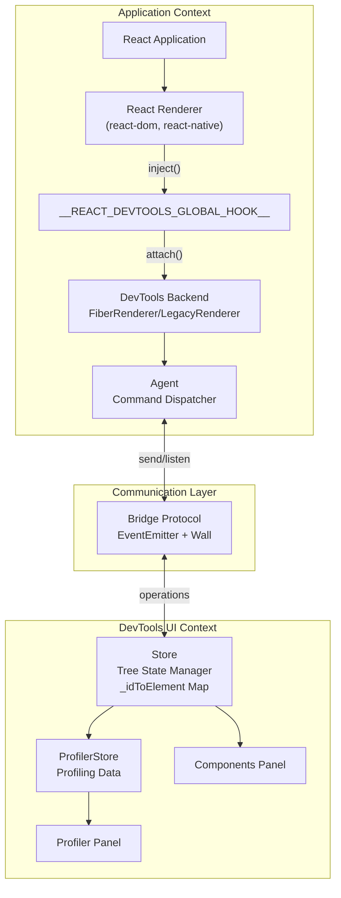

**来源：**
- [packages/react-devtools-shared/src/backend/fiber/renderer.js:1007-1014]()
- [packages/react-devtools-shared/src/backend/agent.js:263-276]()
- [packages/react-devtools-shared/src/devtools/store.js:143-169]()
- [packages/react-devtools-shared/src/hook.js:58-68]()

架构分离了关注点：
- **Backend** 在与 React 应用相同的 JavaScript 上下文中运行，对协调器进行插桩
- **Bridge** 在 backend 和 frontend 之间提供版本无关的消息传递
- **Frontend** 在独立上下文中运行（扩展面板、独立窗口或嵌入式 iframe），提供用户界面

---

## Backend 架构

### 全局 Hook 注入

DevTools backend 使用安装在 `window.__REACT_DEVTOOLS_GLOBAL_HOOK__` 上的全局 hook 来拦截 React renderer 的初始化。该 hook 是 React renderer 在初始化期间检测并调用的实际公共 API。

**DevToolsHook 对象结构：**

```mermaid
graph TB
    Hook["__REACT_DEVTOOLS_GLOBAL_HOOK__"]
    
    subgraph "Core Properties"
        renderers["renderers: Map<RendererID, ReactRenderer>"]
        rendererInterfaces["rendererInterfaces: Map<RendererID, RendererInterface>"]
        backends["backends: Map<string, DevToolsBackend>"]
        listeners["listeners: {[event]: Array<Handler>}"]
    end
    
    subgraph "React Callbacks"
        inject["inject(renderer): number | null"]
        onCommitFiberRoot["onCommitFiberRoot(rendererID, root, priority?)"]
        onCommitFiberUnmount["onCommitFiberUnmount(rendererID, fiber)"]
    end
    
    subgraph "DevTools Callbacks"
        emit["emit(event, data)"]
        on["on(event, handler)"]
        sub["sub(event, handler)"]
    end
    
    subgraph "Settings"
        settings["settings: DevToolsHookSettings"]
    end
    
    Hook --> renderers
    Hook --> rendererInterfaces
    Hook --> backends
    Hook --> listeners
    Hook --> inject
    Hook --> onCommitFiberRoot
    Hook --> onCommitFiberUnmount
    Hook --> emit
    Hook --> on
    Hook --> sub
    Hook --> settings
```

**Hook 安装流程：**

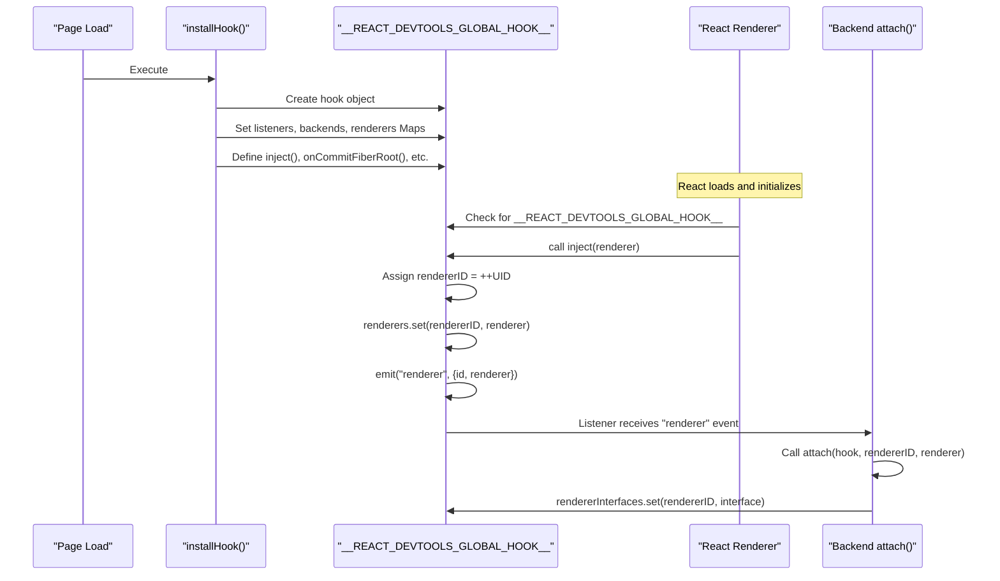

**来源：**
- [packages/react-devtools-shared/src/hook.js:59-230]()
- [packages/react-devtools-shared/src/backend/types.js:552-593]()
- [packages/react-devtools-shared/src/backend/fiber/renderer.js:1004-1028]()

Hook 在 React 加载之前提前安装，通过以下方式：
- **浏览器扩展**：通过执行 `installHook.js` 的 content script 注入
- **独立应用**：从本地 HTTP 服务器在 `http://localhost:8097` 提供服务
- **内联嵌入**：通过 `activate(window)` 打包到页面中

**来源：**
- [packages/react-devtools-extensions/src/contentScripts/installHook.js:1-85]()
- [packages/react-devtools-core/src/backend.js:63-150]()
- [packages/react-devtools-inline/src/backend.js:1-100]()

### Backend Renderer 接口

Backend 提供 `RendererInterface`，处理与特定 React renderer 的所有交互：

| 方法 | 用途 |
|--------|---------|
| `flushInitialOperations()` | 将初始树状态发送到 frontend |
| `findHostInstancesForElementID()` | 将 DevTools element ID 映射到 DOM/host 实例 |
| `inspectElement()` | 检索元素的详细 props/state/hooks |
| `overrideProps()` / `overrideHookState()` | 实时编辑组件数据 |
| `getProfilingData()` | 收集性能分析测量数据 |
| `setTraceUpdatesEnabled()` | 启用/禁用渲染高亮 |

**来源：**
- [packages/react-devtools-shared/src/backend/types.js:412-455]()
- [packages/react-devtools-shared/src/backend/fiber/renderer.js:1007-1425]()

### Fiber Tree 插桩

Backend 通过创建镜像组件树的并行数据结构来插桩 React 的 Fiber 协调器。对于每个 Fiber，backend 创建 `FiberInstance`、`VirtualInstance` 或 `FilteredFiberInstance`：

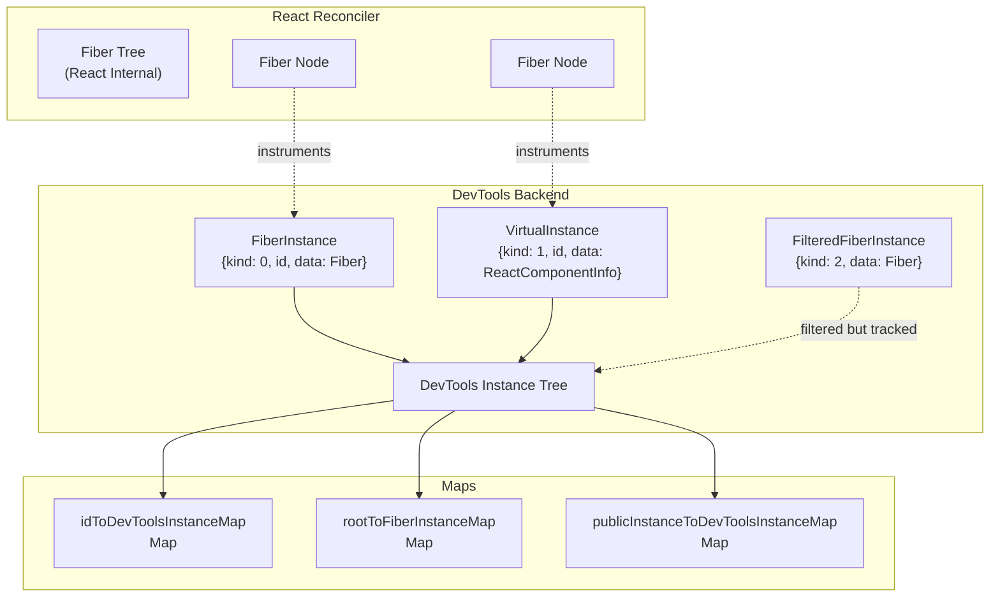

**来源：**
- [packages/react-devtools-shared/src/backend/fiber/renderer.js:185-293]()
- [packages/react-devtools-shared/src/backend/fiber/renderer.js:864-888]()

实例类型：
- **FiberInstance** (`kind: 0`)：表示客户端组件的状态化 Fiber 对（current/work-in-progress）
- **VirtualInstance** (`kind: 1`)：表示不创建 Fiber 的服务器组件或优化移除的组件
- **FilteredFiberInstance** (`kind: 2`)：被组件过滤器隐藏但仍被跟踪以查找 host 实例

### 树操作协议

Backend 将树变更以紧凑的数字数组形式发送到 frontend，称为**操作**。每个操作都以操作代码为前缀：

| 操作代码 | 常量 | 用途 |
|----------------|----------|---------|
| `1` | `TREE_OPERATION_ADD` | 向树中添加新元素 |
| `2` | `TREE_OPERATION_REMOVE` | 从树中移除元素 |
| `3` | `TREE_OPERATION_REORDER_CHILDREN` | 重新排序元素的子元素 |
| `4` | `TREE_OPERATION_UPDATE_TREE_BASE_DURATION` | 更新性能分析持续时间 |
| `5` | `TREE_OPERATION_UPDATE_ERRORS_OR_WARNINGS` | 更新错误/警告计数 |
| `7` | `TREE_OPERATION_SET_SUBTREE_MODE` | 更新 StrictMode 状态 |
| `8` | `SUSPENSE_TREE_OPERATION_ADD` | 添加 Suspense 边界 |
| `12` | `SUSPENSE_TREE_OPERATION_SUSPENDERS` | 更新 Suspense 状态 |

**来源：**
- [packages/react-devtools-shared/src/constants.js:20-32]()
- [packages/react-devtools-shared/src/utils.js:224-464]()

操作包含字符串表以避免重复：

```
[rendererID, rootID, stringTableSize, ...encodedStrings, ...operations]
```

这种紧凑格式在通过 bridge 发送树更新时最小化序列化开销。

**来源：**
- [packages/react-devtools-shared/src/backend/fiber/renderer.js:1426-1600]()

---

## Bridge 协议

### 协议版本控制

Bridge 使用版本化协议来处理不同 DevTools 版本之间的兼容性。协议版本在连接时协商：

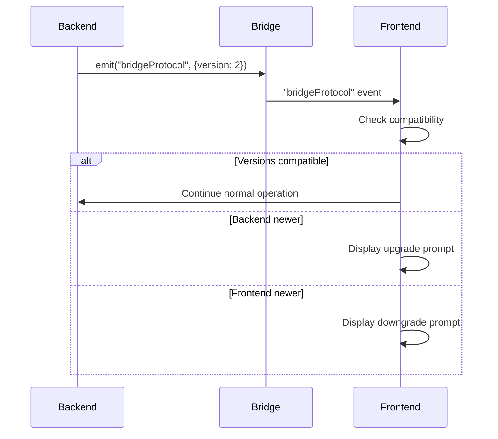

**来源：**
- [packages/react-devtools-shared/src/bridge.js:36-73]()
- [packages/react-devtools-shared/src/devtools/store.js:273-320]()

`BRIDGE_PROTOCOL` 数组定义了带有 NPM 版本范围的版本历史：

```javascript
// Protocol version 2 added StrictMode support
{
  version: 2,
  minNpmVersion: '4.22.0',
  maxNpmVersion: null,
}
```

**来源：**
- [packages/react-devtools-shared/src/bridge.js:47-70]()

### 消息传递

Bridge 基于两个抽象构建：
- **EventEmitter**：用于通过 `addListener()` / `emit()` 进行类型化事件处理
- **Wall**：用于通过 `send()` / `listen()` 进行底层消息传输

```mermaid
graph LR
    subgraph "Backend Context"
        BackendCode["Backend Code"]
        BackendBridge["BackendBridge<br/>extends EventEmitter"]
        BackendWall["Wall Implementation"]
    end
    
    subgraph "Frontend Context"
        FrontendWall["Wall Implementation"]
        FrontendBridge["FrontendBridge<br/>extends EventEmitter"]
        FrontendCode["Frontend Code"]
    end
    
    BackendCode -->|"emit('operations', data)"| BackendBridge
    BackendBridge -->|"wall.send()"| BackendWall
    BackendWall -.->|"postMessage/WebSocket/etc"| FrontendWall
    FrontendWall -->|"wall.listen()"| FrontendBridge
    FrontendBridge -->|"emit('operations')"| FrontendCode
    
    FrontendCode -->|"emit('inspectElement', params)"| FrontendBridge
    FrontendBridge -->|"wall.send()"| FrontendWall
    FrontendWall -.->|"postMessage/WebSocket/etc"| BackendWall
    BackendWall -->|"wall.listen()"| BackendBridge
    BackendBridge -->|"emit('inspectElement')"| BackendCode
```

**来源：**
- [packages/react-devtools-shared/src/bridge.js:1-10]()
- [packages/react-devtools-shared/src/backend/agent.js:307-356]()

### 传输实现

Wall 抽象支持不同环境的不同传输机制：

| 环境 | Wall 实现 | 传输机制 |
|-------------|---------------------|---------------------|
| Browser Extension | `chrome.runtime.connect()` | Chrome 扩展消息传递 |
| Standalone App | WebSocket | 通过 localhost 的 TCP socket |
| Inline Embedding | `window.postMessage()` | 同页 iframe 消息传递 |
| React Native | WebSocket 或 Metro | RN 调试协议 |

**来源：**
- [packages/react-devtools-extensions/chrome/manifest.json:1-65]()
- [packages/react-devtools-core/package.json:1-38]()
- [packages/react-devtools-inline/package.json:1-52]()

---

## Frontend 架构

### Store

`Store` 类是 frontend 上组件树状态的单一数据源。它处理来自 backend 的操作并维护多个映射：

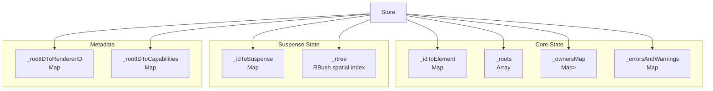

**来源：**
- [packages/react-devtools-shared/src/devtools/store.js:143-272]()
- [packages/react-devtools-shared/src/devtools/store.js:197-236]()

Store 在 `onBridgeOperations()` 中处理操作：

1. 从操作数组中解析字符串表
2. 遍历操作
3. 对于每种操作类型（ADD、REMOVE 等），更新内部映射
4. 发出 `mutated` 事件以触发 UI 更新

**来源：**
- [packages/react-devtools-shared/src/devtools/store.js:1139-1784]()

### 组件状态序列化

元素检查使用请求-响应模式，通过**脱水**和**水合**来高效处理复杂的嵌套对象。

**序列化流程：**

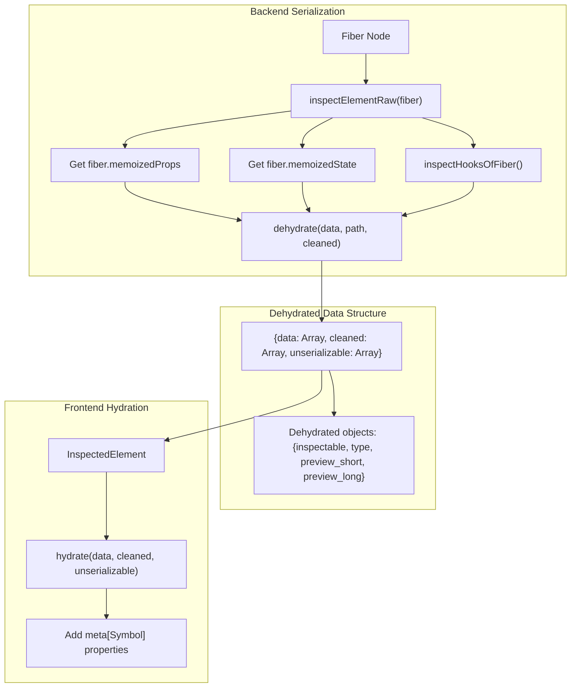

**脱水过程：**

`dehydrate()` 函数递归遍历对象，并用 `Dehydrated` 元数据替换复杂值：

| 值类型 | 脱水策略 |
|------------|---------------------|
| 原始值（string、number、boolean） | 原样通过 |
| 浅对象（深度 < 2） | 递归脱水属性 |
| 深对象（深度 >= 2） | 替换为 `{inspectable: true, type, preview_short, preview_long}` |
| 数组 | 脱水每个元素 |
| React Elements | 替换为 `{type: "react_element", preview}` |
| 函数 | 替换为 `{type: "function", name}` |
| Symbols | 替换为 `{type: "symbol", name}` |
| 不可序列化（BigInt、ArrayBuffer） | 在 `unserializable` 数组中标记 |

**来源：**
- [packages/react-devtools-shared/src/hydration.js:200-350]()
- [packages/react-devtools-shared/src/backend/fiber/renderer.js:2900-3100]()

**检查请求-响应流程：**

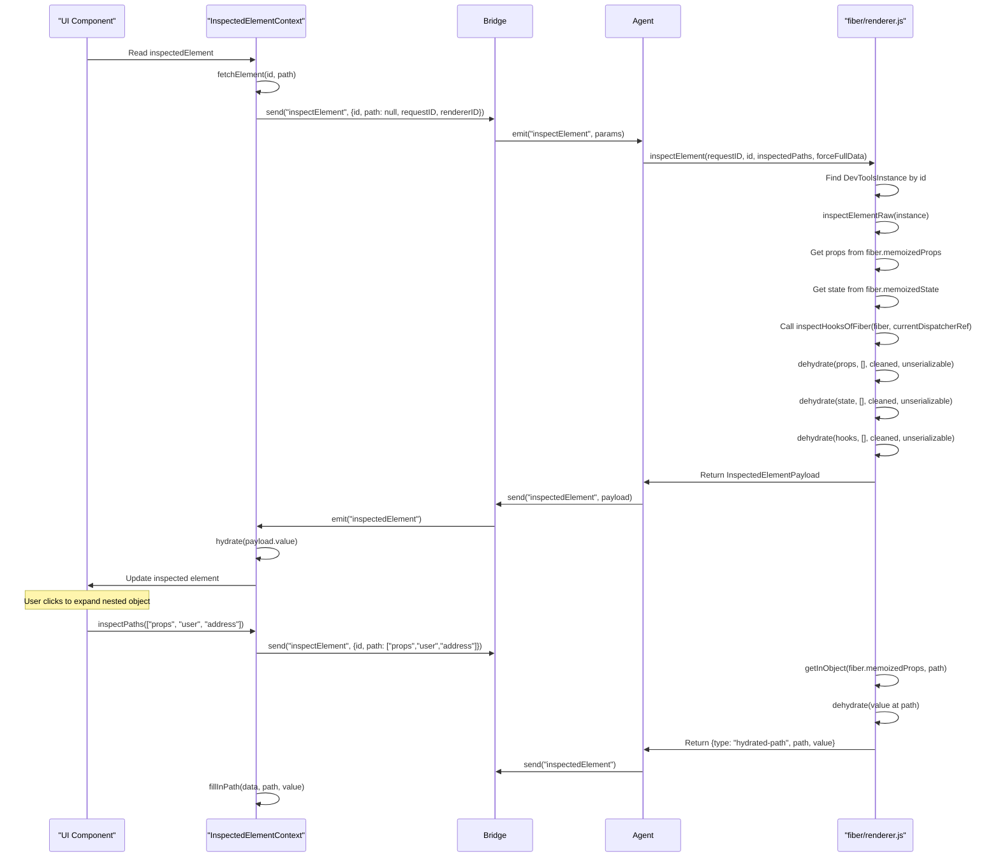

**Hooks 检查：**

Backend 使用 `react-debug-tools` 来检查 hooks：

```javascript
// In inspectElementRaw()
import {inspectHooksOfFiber} from 'react-debug-tools';

const hooks = inspectHooksOfFiber(
  fiber,
  currentDispatcherRef, // ReactSharedInternals.H
);
```

这返回表示 hook 调用栈的 `HooksTree` 结构：

```typescript
type HooksNode = {
  id: number,
  isStateEditable: boolean,
  name: string,
  value: mixed,
  subHooks: Array<HooksNode>,
  hookSource?: {
    lineNumber: number,
    columnNumber: number,
    functionName: string,
    fileName: string,
  },
};
```

**来源：**
- [packages/react-devtools-shared/src/backend/fiber/renderer.js:2700-2900]()
- [packages/react-devtools-shared/src/backend/fiber/renderer.js:98]()
- [packages/react-debug-tools/src/ReactDebugHooks.js:1-500]()
- [packages/react-devtools-shared/src/hydration.js:1-500]()
- [packages/react-devtools-shared/src/backendAPI.js:50-200]()

### UI 组件

Frontend UI 组织为几个主要面板：

| 面板 | 组件 | 用途 |
|-------|-----------|---------|
| Components | `Components.js` | 树视图 + 元素检查器 |
| Profiler | `Profiler.js` | Commit 时间线 + 火焰图 |
| Settings | `Settings/` | DevTools 配置 |
| Suspense | `SuspenseTab/` | Suspense 边界可视化（实验性） |

**来源：**
- [packages/react-devtools-shared/src/devtools/views/Components/]()
- [packages/react-devtools-shared/src/devtools/views/Profiler/]()

Components 面板使用 React Context 进行状态管理：

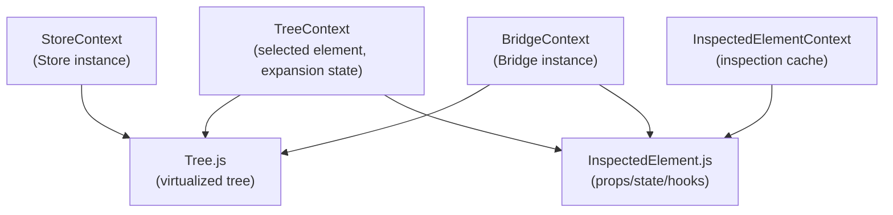

**来源：**
- [packages/react-devtools-shared/src/devtools/views/Components/TreeContext.js]()
- [packages/react-devtools-shared/src/devtools/views/Components/InspectedElementContext.js]()
- [packages/react-devtools-shared/src/devtools/views/context.js]()

### 性能分析 Hooks 集成

DevTools backend 将性能分析 hooks 注入到 React 协调器中，以在渲染期间收集性能数据。

**性能分析 Hooks 架构：**

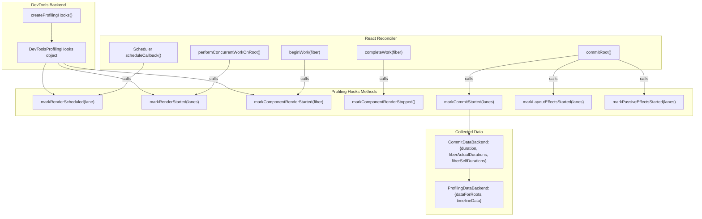

**性能分析会话生命周期：**

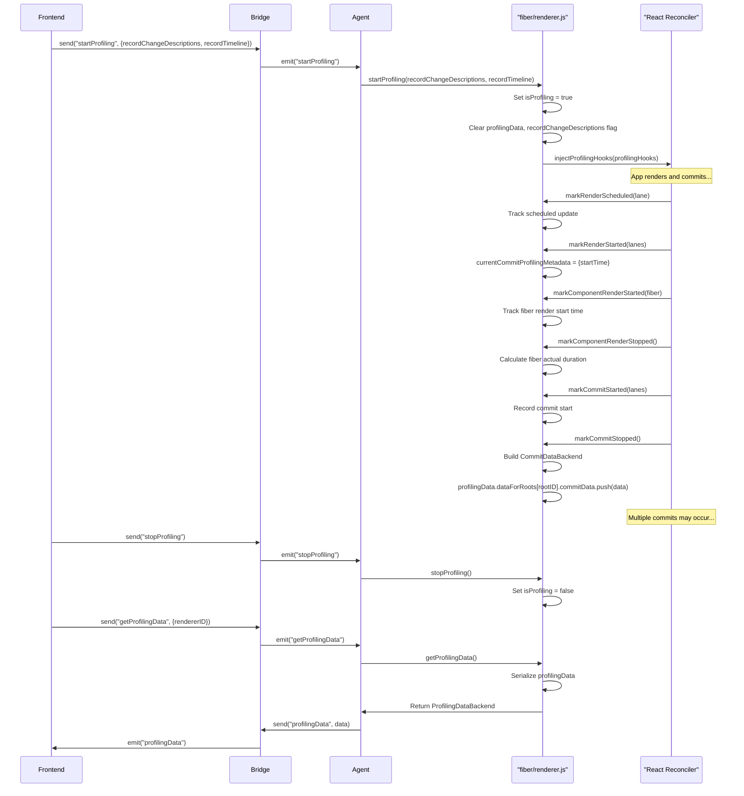

**收集的性能分析指标：**

| 指标 | 来源 | 用途 |
|--------|--------|---------|
| `fiberActualDurations` | `markComponentRenderStarted/Stopped()` | 渲染每个 fiber 花费的时间 |
| `fiberSelfDurations` | 从 actual - children 计算 | 排除子渲染的时间 |
| `effectDuration` | `markLayoutEffectsStarted/Stopped()` | useLayoutEffect/useEffect 中的时间 |
| `passiveEffectDuration` | `markPassiveEffectsStarted/Stopped()` | 仅在 passive effects 中的时间 |
| `priorityLevel` | 来自 scheduler priority | 渲染优先级（UserBlocking、Normal 等） |
| `changeDescriptions` | `recordProfilingDurations()` | 哪些 props/state 发生了变化 |

**来源：**
- [packages/react-devtools-shared/src/backend/profilingHooks.js:1-500]()
- [packages/react-devtools-shared/src/backend/types.js:500-538]()
- [packages/react-devtools-shared/src/backend/fiber/renderer.js:1105-1300]()
- [packages/react-devtools-shared/src/devtools/ProfilerStore.js:1-200]()

---

## 分发渠道

React DevTools 通过多个渠道分发，每个渠道具有不同的架构：

### 浏览器扩展

浏览器扩展使用 Manifest V3，带有 service worker backend：

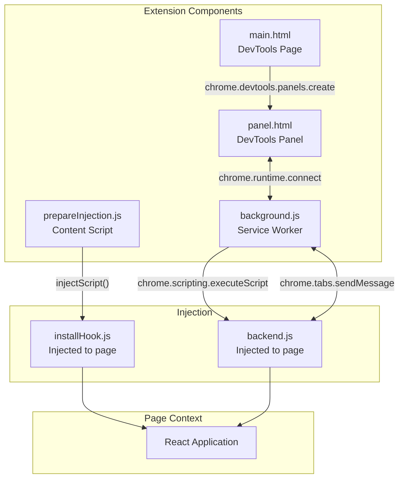

**来源：**
- [packages/react-devtools-extensions/chrome/manifest.json:40-64]()
- [packages/react-devtools-extensions/firefox/manifest.json:45-69]()

扩展特定功能：
- 图标根据 React 构建类型（dev/prod）改变颜色
- 如果未检测到 React，popup 会警告
- 与浏览器 Elements 面板集成，用于 DOM 节点选择

**来源：**
- [packages/react-devtools-extensions/chrome/manifest.json:14-22]()

### 独立应用

独立应用是一个 Electron 应用，启动本地 WebSocket 服务器：

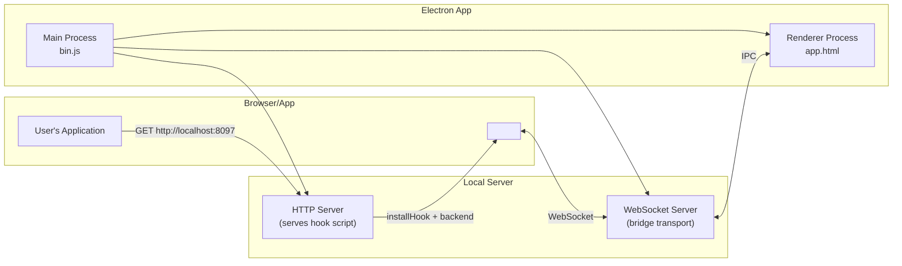

**来源：**
- [packages/react-devtools/package.json:11-23]()
- [packages/react-devtools-core/package.json:1-38]()

用户在其页面中添加 script 标签：

```html
<script src="http://localhost:8097"></script>
```

这会加载 hook 和 backend，它们通过 WebSocket 连接回来。

**来源：**
- [packages/react-devtools-core/]()

### 内联嵌入

内联包允许直接在网页中嵌入 DevTools：

```javascript
import {initialize} from 'react-devtools-inline/frontend';
import {activate} from 'react-devtools-inline/backend';

// In application context
activate(window);

// In DevTools UI context
const DevTools = initialize(window);
```

这用于演示、playground 和 React Native 调试。

**来源：**
- [packages/react-devtools-inline/package.json:12-17]()

### React Native 集成

React Native 嵌入 DevTools backend，并通过 Metro bundler 的 WebSocket 连接或自定义 RN 调试 bridge 连接。

**来源：**
- [packages/react-devtools-shared/src/backend/views/Highlighter/index.js:1-20]()

---

## 数据流示例

### 组件树更新

当组件更新时，发生以下流程：

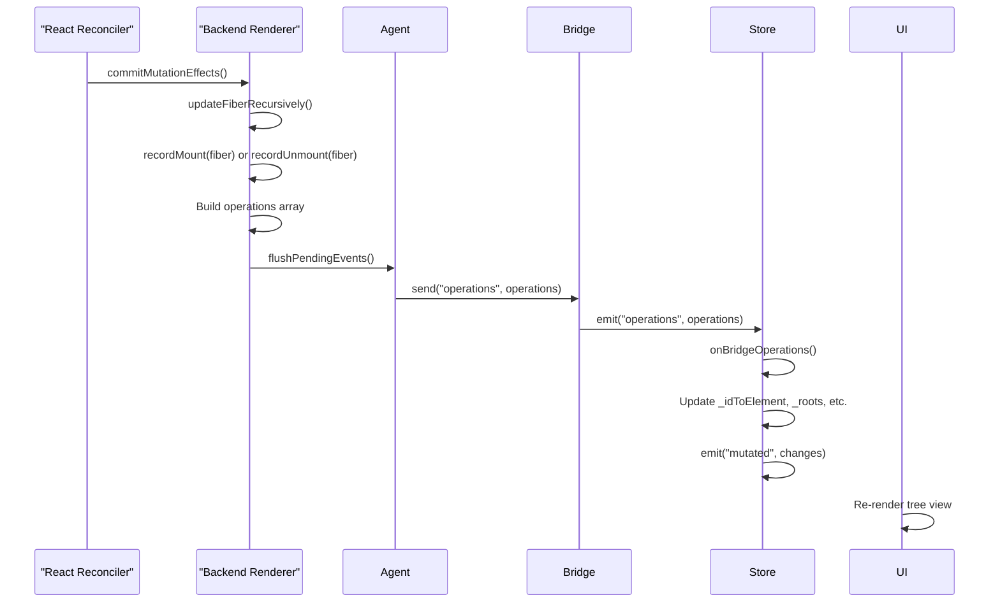

**来源：**
- [packages/react-devtools-shared/src/backend/fiber/renderer.js:1426-1600]()
- [packages/react-devtools-shared/src/backend/agent.js:567-700]()
- [packages/react-devtools-shared/src/devtools/store.js:1139-1784]()

### 元素检查数据流

当用户检查元素时，完整流程从 UI 点击到 backend 序列化：

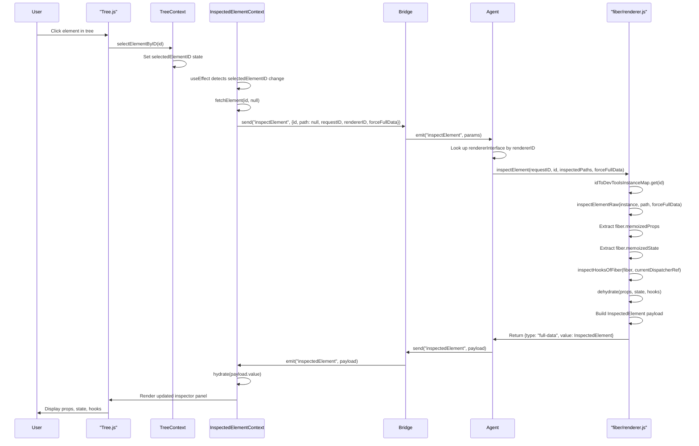

**来源：**
- [packages/react-devtools-shared/src/devtools/views/Components/Tree.js:1-500]()
- [packages/react-devtools-shared/src/devtools/views/Components/TreeContext.js:1-300]()
- [packages/react-devtools-shared/src/devtools/views/Components/InspectedElementContext.js:1-400]()
- [packages/react-devtools-shared/src/backend/agent.js:320-330]()
- [packages/react-devtools-shared/src/backend/fiber/renderer.js:2700-3200]()
- [packages/react-devtools-shared/src/backendAPI.js:50-200]()

---

## 关键设计决策

### 为什么采用三层架构？

Backend、bridge 和 frontend 的分离实现了：
- **安全隔离**：DevTools UI 在不同上下文中运行，具有不同权限
- **版本独立性**：协议版本控制允许较新的 backend 与较旧的 frontend 配合使用
- **多种传输层**：相同代码在扩展、独立、内联和 React Native 中都能工作

### 为什么使用操作数组？

紧凑的数字数组最小化序列化开销：
- 通过字符串表去重字符串
- 树变更编码为整数
- 无 JSON 解析开销
- 与 `postMessage()` 结构化克隆算法配合良好

**来源：**
- [packages/react-devtools-shared/src/utils.js:224-464]()

### 为什么使用脱水？

嵌套数据的懒加载：
- 初始检查发送浅层表示
- 深层嵌套对象表示为 `{inspectable: true}`
- 用户展开触发特定路径的获取
- 减少大型组件树的初始负载大小

**来源：**
- [packages/react-devtools-shared/src/hydration.js:65-250]()

### 为什么使用 WeakMap 进行 Fiber 跟踪？

对 `internalInstanceToIDMap` 使用 WeakMap 防止内存泄漏：
- Fiber 可以在没有显式清理的情况下被垃圾回收
- DevTools 不持有对已卸载组件的强引用

**来源：**
- [packages/react-devtools-shared/src/backend/fiber/renderer.js:864-873]()
