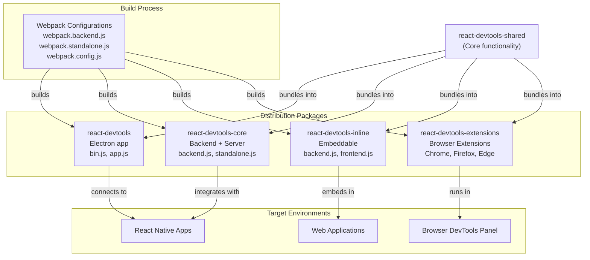
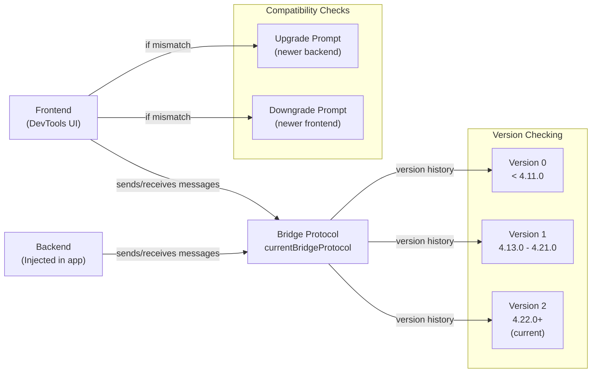
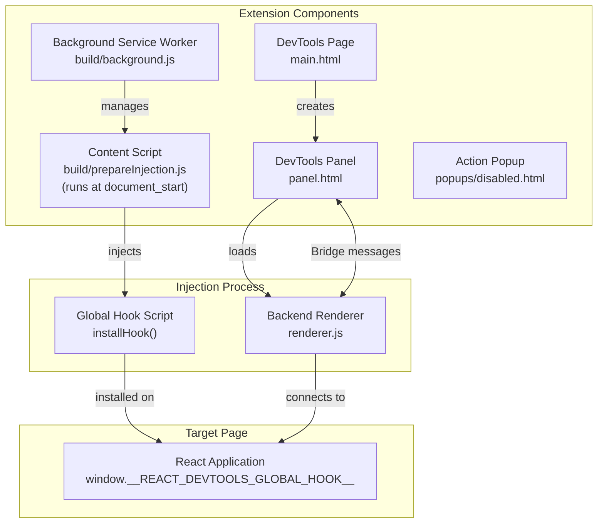
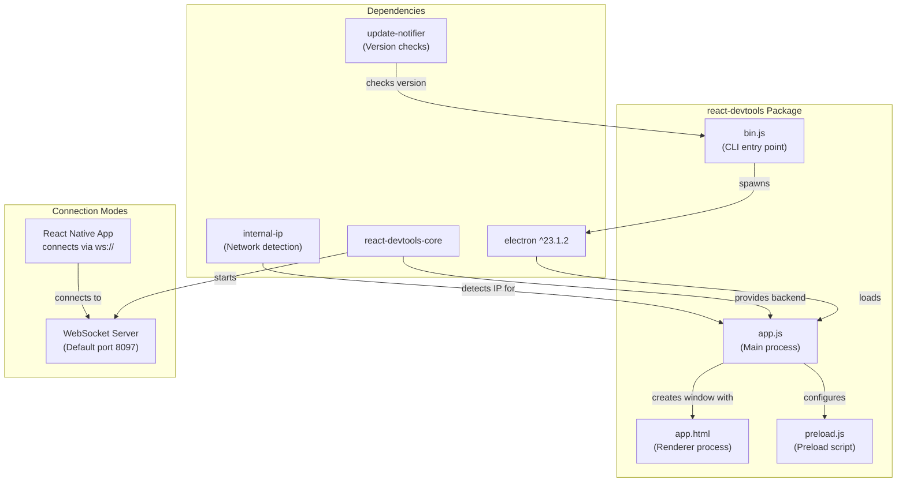
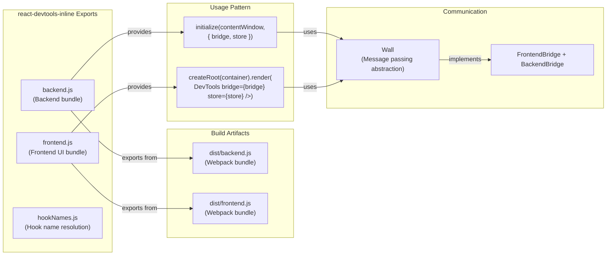
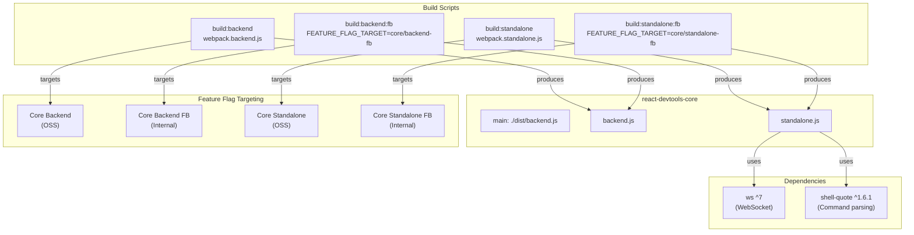
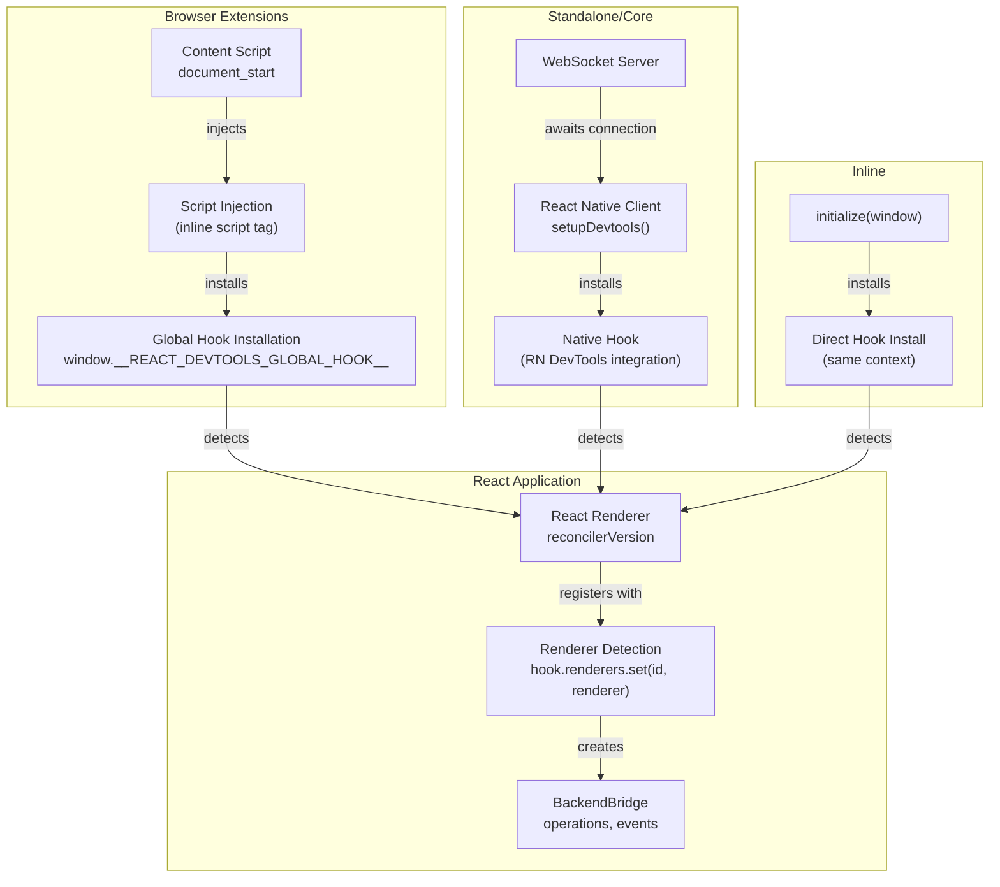
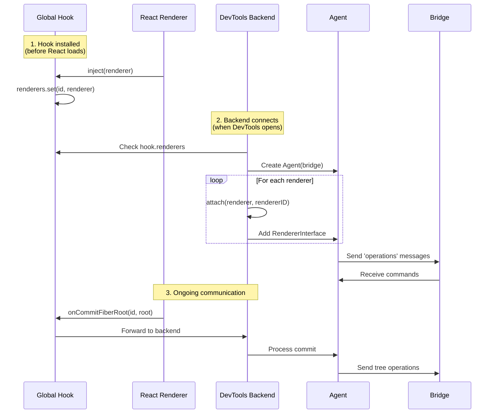
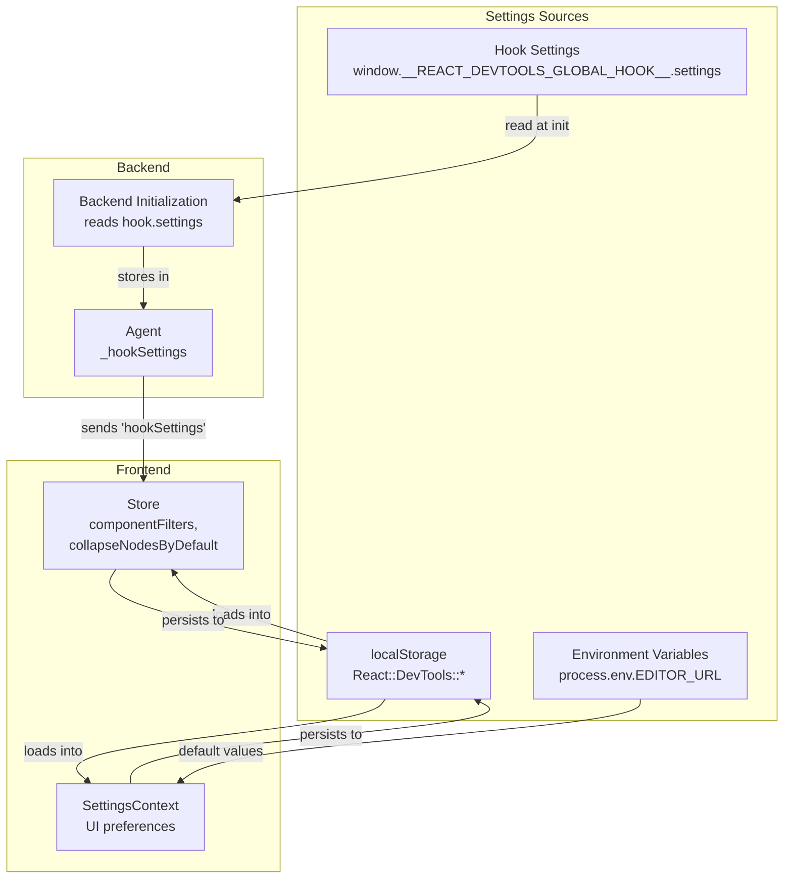

# DevTools 分发与集成

<!-- > 来源：https://deepwiki.com/facebook/react/7.2-devtools-distribution-and-integration -->

<details>
<summary>相关源文件</summary>

以下文件用于生成此 wiki 页面的上下文：

- [.eslintrc.js](.eslintrc.js)
- [fixtures/devtools/standalone/index.html](fixtures/devtools/standalone/index.html)
- [package.json](package.json)
- [packages/eslint-plugin-react-hooks/package.json](https://github.com/facebook/react/blob/main/packages/eslint-plugin-react-hooks/package.json)
- [packages/jest-react/package.json](https://github.com/facebook/react/blob/main/packages/jest-react/package.json)
- [packages/react-art/package.json](https://github.com/facebook/react/blob/main/packages/react-art/package.json)
- [packages/react-devtools-core/README.md](https://github.com/facebook/react/blob/main/packages/react-devtools-core/README.md)
- [packages/react-devtools-core/src/backend.js](https://github.com/facebook/react/blob/main/packages/react-devtools-core/src/backend.js)
- [packages/react-devtools-extensions/src/contentScripts/hookSettingsInjector.js](https://github.com/facebook/react/blob/main/packages/react-devtools-extensions/src/contentScripts/hookSettingsInjector.js)
- [packages/react-devtools-extensions/src/contentScripts/installHook.js](https://github.com/facebook/react/blob/main/packages/react-devtools-extensions/src/contentScripts/installHook.js)
- [packages/react-devtools-extensions/src/contentScripts/messages.js](https://github.com/facebook/react/blob/main/packages/react-devtools-extensions/src/contentScripts/messages.js)
- [packages/react-devtools-inline/src/backend.js](https://github.com/facebook/react/blob/main/packages/react-devtools-inline/src/backend.js)
- [packages/react-devtools-shared/src/__tests__/componentStacks-test.js](https://github.com/facebook/react/blob/main/packages/react-devtools-shared/src/__tests__/componentStacks-test.js)
- [packages/react-devtools-shared/src/__tests__/console-test.js](https://github.com/facebook/react/blob/main/packages/react-devtools-shared/src/__tests__/console-test.js)
- [packages/react-devtools-shared/src/__tests__/inspectedElement-test.js](https://github.com/facebook/react/blob/main/packages/react-devtools-shared/src/__tests__/inspectedElement-test.js)
- [packages/react-devtools-shared/src/__tests__/legacy/inspectElement-test.js](https://github.com/facebook/react/blob/main/packages/react-devtools-shared/src/__tests__/legacy/inspectElement-test.js)
- [packages/react-devtools-shared/src/__tests__/setupTests.js](https://github.com/facebook/react/blob/main/packages/react-devtools-shared/src/__tests__/setupTests.js)
- [packages/react-devtools-shared/src/__tests__/store-test.js](https://github.com/facebook/react/blob/main/packages/react-devtools-shared/src/__tests__/store-test.js)
- [packages/react-devtools-shared/src/attachRenderer.js](https://github.com/facebook/react/blob/main/packages/react-devtools-shared/src/attachRenderer.js)
- [packages/react-devtools-shared/src/backend/agent.js](https://github.com/facebook/react/blob/main/packages/react-devtools-shared/src/backend/agent.js)
- [packages/react-devtools-shared/src/backend/fiber/renderer.js](https://github.com/facebook/react/blob/main/packages/react-devtools-shared/src/backend/fiber/renderer.js)
- [packages/react-devtools-shared/src/backend/legacy/renderer.js](https://github.com/facebook/react/blob/main/packages/react-devtools-shared/src/backend/legacy/renderer.js)
- [packages/react-devtools-shared/src/backend/types.js](https://github.com/facebook/react/blob/main/packages/react-devtools-shared/src/backend/types.js)
- [packages/react-devtools-shared/src/backend/views/Highlighter/index.js](https://github.com/facebook/react/blob/main/packages/react-devtools-shared/src/backend/views/Highlighter/index.js)
- [packages/react-devtools-shared/src/backendAPI.js](https://github.com/facebook/react/blob/main/packages/react-devtools-shared/src/backendAPI.js)
- [packages/react-devtools-shared/src/bridge.js](https://github.com/facebook/react/blob/main/packages/react-devtools-shared/src/bridge.js)
- [packages/react-devtools-shared/src/devtools/store.js](https://github.com/facebook/react/blob/main/packages/react-devtools-shared/src/devtools/store.js)
- [packages/react-devtools-shared/src/devtools/utils.js](https://github.com/facebook/react/blob/main/packages/react-devtools-shared/src/devtools/utils.js)
- [packages/react-devtools-shared/src/devtools/views/Profiler/CommitTreeBuilder.js](https://github.com/facebook/react/blob/main/packages/react-devtools-shared/src/devtools/views/Profiler/CommitTreeBuilder.js)
- [packages/react-devtools-shared/src/devtools/views/utils.js](https://github.com/facebook/react/blob/main/packages/react-devtools-shared/src/devtools/views/utils.js)
- [packages/react-devtools-shared/src/frontend/types.js](https://github.com/facebook/react/blob/main/packages/react-devtools-shared/src/frontend/types.js)
- [packages/react-devtools-shared/src/hook.js](https://github.com/facebook/react/blob/main/packages/react-devtools-shared/src/hook.js)
- [packages/react-devtools-shared/src/hydration.js](https://github.com/facebook/react/blob/main/packages/react-devtools-shared/src/hydration.js)
- [packages/react-devtools-shared/src/utils.js](https://github.com/facebook/react/blob/main/packages/react-devtools-shared/src/utils.js)
- [packages/react-devtools-shell/src/app/ElementTypes/index.js](https://github.com/facebook/react/blob/main/packages/react-devtools-shell/src/app/ElementTypes/index.js)
- [packages/react-devtools-shell/src/app/InspectableElements/SimpleValues.js](https://github.com/facebook/react/blob/main/packages/react-devtools-shell/src/app/InspectableElements/SimpleValues.js)
- [packages/react-devtools-shell/src/app/InspectableElements/SymbolKeys.js](https://github.com/facebook/react/blob/main/packages/react-devtools-shell/src/app/InspectableElements/SymbolKeys.js)
- [packages/react-devtools-shell/src/app/InspectableElements/UnserializableProps.js](https://github.com/facebook/react/blob/main/packages/react-devtools-shell/src/app/InspectableElements/UnserializableProps.js)
- [packages/react-dom/package.json](https://github.com/facebook/react/blob/main/packages/react-dom/package.json)
- [packages/react-is/package.json](https://github.com/facebook/react/blob/main/packages/react-is/package.json)
- [packages/react-native-renderer/package.json](https://github.com/facebook/react/blob/main/packages/react-native-renderer/package.json)
- [packages/react-noop-renderer/package.json](https://github.com/facebook/react/blob/main/packages/react-noop-renderer/package.json)
- [packages/react-reconciler/package.json](https://github.com/facebook/react/blob/main/packages/react-reconciler/package.json)
- [packages/react-test-renderer/package.json](https://github.com/facebook/react/blob/main/packages/react-test-renderer/package.json)
- [packages/react/package.json](https://github.com/facebook/react/blob/main/packages/react/package.json)
- [packages/react/src/ReactForwardRef.js](https://github.com/facebook/react/blob/main/packages/react/src/ReactForwardRef.js)
- [packages/react/src/ReactMemo.js](https://github.com/facebook/react/blob/main/packages/react/src/ReactMemo.js)
- [packages/scheduler/package.json](https://github.com/facebook/react/blob/main/packages/scheduler/package.json)
- [packages/shared/ReactVersion.js](https://github.com/facebook/react/blob/main/packages/shared/ReactVersion.js)
- [scripts/flow/config/flowconfig](scripts/flow/config/flowconfig)
- [scripts/flow/createFlowConfigs.js](scripts/flow/createFlowConfigs.js)
- [scripts/flow/environment.js](scripts/flow/environment.js)
- [scripts/rollup/validate/eslintrc.cjs.js](scripts/rollup/validate/eslintrc.cjs.js)
- [scripts/rollup/validate/eslintrc.cjs2015.js](scripts/rollup/validate/eslintrc.cjs2015.js)
- [scripts/rollup/validate/eslintrc.esm.js](scripts/rollup/validate/eslintrc.esm.js)
- [scripts/rollup/validate/eslintrc.fb.js](scripts/rollup/validate/eslintrc.fb.js)
- [scripts/rollup/validate/eslintrc.rn.js](scripts/rollup/validate/eslintrc.rn.js)
- [yarn.lock](yarn.lock)

</details>


## 目的与范围

本文档介绍 React DevTools 在不同平台上的打包和分发方式，以及每种分发形式如何与 React 应用集成。DevTools 以多种形式存在——浏览器扩展、standalone Electron 应用和可嵌入的内联库——它们共享相同的后端，但采用不同的集成策略。

关于 DevTools 架构以及前端与后端之间的通信协议，请参阅 [React DevTools 架构](/7.1-react-devtools-architecture)。

## 分发包概览

React DevTools 发布为四个独立的 npm 包，每个包服务于不同的用例：

| 包 | 用途 | 主要用例 |
|---------|---------|------------------|
| `react-devtools` | Standalone Electron 应用 | 调试 React Native 应用 |
| `react-devtools-core` | 后端和 standalone 服务器 | 自定义集成、React Native |
| `react-devtools-inline` | 可嵌入的前端 + 后端 | 在 Web 应用中集成开发者工具 |
| `react-devtools-extensions` | 浏览器扩展 | 在 Chrome、Firefox、Edge 中调试 Web 应用 |

每个包共享 `react-devtools-shared` 代码库，但针对其目标环境以不同方式打包。

**图表：分发包架构**



来源：[packages/react-devtools/package.json#L1-L32](https://github.com/facebook/react/blob/main/packages/react-devtools/package.json#L1-L32), [packages/react-devtools-core/package.json#L1-L38](https://github.com/facebook/react/blob/main/packages/react-devtools-core/package.json#L1-L38), [packages/react-devtools-inline/package.json#L1-L52](https://github.com/facebook/react/blob/main/packages/react-devtools-inline/package.json#L1-L52)

## Bridge 协议与版本兼容性

所有 DevTools 分发版本都使用 `BRIDGE_PROTOCOL` 中定义的版本化 bridge 协议进行通信。这使得前端和后端之间的版本不匹配能够被优雅地处理。

**协议版本管理**

Bridge 协议使用语义化版本控制来跟踪破坏性变更：



协议版本在初始化时进行检查。每个版本包括：
- `version`：协议版本号
- `minNpmVersion`：最小兼容的 npm 包版本
- `maxNpmVersion`：最大兼容的 npm 包版本

当检测到不兼容时，Store 会设置 `_unsupportedBridgeProtocolDetected`，UI 会显示相应的提示信息。

来源：[packages/react-devtools-shared/src/bridge.js#L26-L73](https://github.com/facebook/react/blob/main/packages/react-devtools-shared/src/bridge.js#L26-L73), [packages/react-devtools-shared/src/devtools/store.js#L254-L256](https://github.com/facebook/react/blob/main/packages/react-devtools-shared/src/devtools/store.js#L254-L256)

## 浏览器扩展

Chrome、Firefox 和 Edge 的浏览器扩展遵循 Manifest V3 规范，共享大部分代码，同时适配浏览器特定的 API。

**扩展架构**



**Manifest 结构**

每个浏览器的 manifest 配置略有不同：

| 属性 | Chrome/Edge | Firefox | 用途 |
|----------|-------------|---------|---------|
| `manifest_version` | 3 | 3 | 所有浏览器使用 Manifest V3 |
| `background` | `service_worker` | `scripts` | Background script 执行模型 |
| `permissions` | tabs, storage, scripting | tabs, storage, scripting, clipboardWrite | 所需权限 |
| `optional_permissions` | clipboardWrite | - | 用户授予的权限 |
| `browser_specific_settings` | - | gecko.id, strict_min_version | Firefox 特定元数据 |

**Content Script 注入**

扩展在 `document_start` 时注入 `prepareInjection.js`，以确保全局 hook 在 React 加载之前可用：

1. Content script 在页面加载时立即运行
2. 将全局 hook 注入到页面上下文中
3. Hook 拦截 React renderer 注册
4. 当 DevTools 面板打开时，后端连接到 hook

来源：[packages/react-devtools-extensions/chrome/manifest.json#L1-L65](https://github.com/facebook/react/blob/main/packages/react-devtools-extensions/chrome/manifest.json#L1-L65), [packages/react-devtools-extensions/firefox/manifest.json#L1-L70](https://github.com/facebook/react/blob/main/packages/react-devtools-extensions/firefox/manifest.json#L1-L70), [packages/react-devtools-extensions/edge/manifest.json#L1-L65](https://github.com/facebook/react/blob/main/packages/react-devtools-extensions/edge/manifest.json#L1-L65)

## Standalone Electron 应用

`react-devtools` 包提供了一个 standalone Electron 应用，用于调试 React Native 应用。

**包结构**



**启动流程**

从命令行运行 `react-devtools` 时：

1. `bin.js` 通过 `update-notifier` 检查更新
2. 以 `app.js` 为入口点启动 Electron
3. `app.js` 使用 `react-devtools-core` 启动 WebSocket 服务器
4. 创建加载 `app.html` 的 Electron 窗口
5. React Native 应用连接到 WebSocket 服务器
6. 前端和后端通过 WebSocket bridge 通信

**命令行选项**

Standalone 应用支持以下选项：
- `--port`：WebSocket 服务器端口（默认：8097）
- `--host`：绑定的主机（默认：localhost）
- `--https`：使用 HTTPS 进行安全连接
- `--react-devtools-port`：替代端口规范

来源：[packages/react-devtools/package.json#L1-L32](https://github.com/facebook/react/blob/main/packages/react-devtools/package.json#L1-L32), [packages/react-devtools-core/package.json#L1-L38](https://github.com/facebook/react/blob/main/packages/react-devtools-core/package.json#L1-L38)

## 内联可嵌入库

`react-devtools-inline` 包支持将 DevTools 直接嵌入到 Web 应用中，适用于开发环境和内部工具。

**包导出**



**集成示例**

要内联嵌入 DevTools：

```javascript
// Backend initialization (in target iframe/window)
import {initialize as initBackend} from 'react-devtools-inline/backend';

// Frontend rendering (in host page)
import {initialize as initFrontend} from 'react-devtools-inline/frontend';
import {createRoot} from 'react-dom/client';

// Create bridges
const wall = {
  listen(listener) { /* handle messages */ },
  send(event, payload) { /* send messages */ }
};

// Initialize backend in target window
initBackend(targetWindow, { wall });

// Render frontend
const {bridge, store} = initFrontend(wall);
const container = document.getElementById('devtools');
createRoot(container).render(<DevTools bridge={bridge} store={store} />);
```

内联库将所有共享代码打包成自包含的产物，可以独立加载。

来源：[packages/react-devtools-inline/package.json#L1-L52](https://github.com/facebook/react/blob/main/packages/react-devtools-inline/package.json#L1-L52)

## 自定义集成的核心库

`react-devtools-core` 包提供后端和 standalone 服务器，用于自定义 DevTools 集成，主要用于 React Native。

**包导出和构建目标**



**集成模式**

核心库支持两种集成模式：

1. **仅后端**：导入 `backend.js` 将后端注入到自定义环境中
2. **Standalone 服务器**：导入 `standalone.js` 启动 WebSocket 服务器以进行远程连接

**WebSocket 服务器 API**

Standalone 服务器暴露以下方法：

```javascript
import {initialize} from 'react-devtools-core/standalone';

const server = await initialize({
  port: 8097,
  host: 'localhost',
  httpsOptions: null, // Optional TLS config
  onDisconnect: () => { /* cleanup */ },
  onError: (error) => { /* error handling */ }
});

// Server provides:
// - server.close() - Stop the server
// - server.port - Actual port (useful for port 0)
```

React Native 通过在开发期间连接到此 WebSocket 服务器进行集成。

来源：[packages/react-devtools-core/package.json#L1-L38](https://github.com/facebook/react/blob/main/packages/react-devtools-core/package.json#L1-L38)

## 后端注入机制

DevTools 后端必须在 React 加载之前注入到目标应用中。不同的分发版本使用不同的注入策略。

**各分发版本的注入策略**



**全局 Hook 接口**

所有注入机制都安装一个具有以下接口的全局 hook：

```javascript
window.__REACT_DEVTOOLS_GLOBAL_HOOK__ = {
  renderers: Map<RendererID, ReactRenderer>,
  supportsFiber: true,
  inject(renderer) { /* called by React */ },
  onCommitFiberRoot(rendererID, root, priorityLevel) { /* fiber commits */ },
  onCommitFiberUnmount(rendererID, fiber) { /* fiber unmounts */ },
  // Backend connection
  backends: Map<RendererID, RendererInterface>,
  // Settings from DevTools
  settings: DevToolsHookSettings
}
```

Hook 必须在 React 加载之前同步安装，以拦截 renderer 注册。

**后端初始化序列**



后端使用 `Agent` 协调多个 `RendererInterface` 实例（每个 React renderer 一个），并通过 `Bridge` 与前端通信。

来源：[packages/react-devtools-shared/src/backend/fiber/renderer.js#L1007-L1014](https://github.com/facebook/react/blob/main/packages/react-devtools-shared/src/backend/fiber/renderer.js#L1007-L1014), [packages/react-devtools-shared/src/backend/agent.js#L1-L694](https://github.com/facebook/react/blob/main/packages/react-devtools-shared/src/backend/agent.js#L1-L694)

## 设置与配置

DevTools 设置可以在两个地方配置：

1. **Hook 设置**：在 React 加载之前通过 `window.__REACT_DEVTOOLS_GLOBAL_HOOK__.settings` 注入
2. **前端设置**：存储在 localStorage 中，并通过 bridge 同步

**设置流程**



**可配置的设置**

关键设置及其存储位置：

| 设置 | 存储位置 | 默认值 | 用途 |
|---------|---------|---------|---------|
| `componentFilters` | localStorage | `[{type: ElementType, isEnabled: true}]` | 组件树过滤 |
| `collapseNodesByDefault` | localStorage | `true` | 自动折叠树节点 |
| `recordChangeDescriptions` | localStorage | `false` | 记录变更描述 |
| `EDITOR_URL` | process.env | `'vscode://file/{path}:{line}:{column}'` | 在编辑器中打开的 URL 模式 |
| `appendComponentStack` | hook.settings | 变化 | 将堆栈追加到控制台 |
| `breakOnConsoleErrors` | hook.settings | 变化 | 在 console.error 时中断 |
| `showInlineWarningsAndErrors` | hook.settings | 变化 | 显示内联错误 |
| `hideConsoleLogsInStrictMode` | hook.settings | 变化 | 淡化重复日志 |

设置可以在后端初始化时提供：

```javascript
import {installHook} from 'react-devtools-core/backend';

installHook(window, {
  appendComponentStack: true,
  breakOnConsoleErrors: false,
  showInlineWarningsAndErrors: true,
  hideConsoleLogsInStrictMode: true
});
```

来源：[packages/react-devtools-shared/src/backend/types.js#L519-L534](https://github.com/facebook/react/blob/main/packages/react-devtools-shared/src/backend/types.js#L519-L534), [packages/react-devtools-shared/src/devtools/store.js#L273-L320](https://github.com/facebook/react/blob/main/packages/react-devtools-shared/src/devtools/store.js#L273-L320), [packages/react-devtools-shared/src/devtools/views/Settings/SettingsContext.js#L1-L196](https://github.com/facebook/react/blob/main/packages/react-devtools-shared/src/devtools/views/Settings/SettingsContext.js#L1-L196)

## 分发文件大小与依赖

每个分发版本都有不同的体积限制和依赖要求：

**包依赖**

| 包 | 运行时依赖 | 开发依赖 | 关键外部依赖 |
|---------|---------------------|------------------|-------------------|
| `react-devtools` | electron, react-devtools-core, internal-ip | - | 大型（Electron 应用） |
| `react-devtools-core` | ws, shell-quote | webpack, workerize-loader | 最小 |
| `react-devtools-inline` | @jridgewell/sourcemap-codec, source-map-js | webpack, babel, playwright | 中等 |
| `react-devtools-extensions` | - | webpack, babel | 无（已打包） |

**构建产物大小**（近似值）：

- 浏览器扩展：约 1-2 MB（打包后）
- Standalone 应用：约 100 MB（包含 Electron）
- 核心后端：约 500 KB（打包后）
- 内联库：约 1 MB（前端 + 后端）

扩展必须最小化打包体积，因为 Chrome Web Store 有大小限制。构建过程在生产构建中使用 Closure Compiler 进行激进的压缩和 tree-shaking。

来源：[packages/react-devtools/package.json#L24-L30](https://github.com/facebook/react/blob/main/packages/react-devtools/package.json#L24-L30), [packages/react-devtools-core/package.json#L27-L37](https://github.com/facebook/react/blob/main/packages/react-devtools-core/package.json#L27-L37), [packages/react-devtools-inline/package.json#L24-L51](https://github.com/facebook/react/blob/main/packages/react-devtools-inline/package.json#L24-L51)
