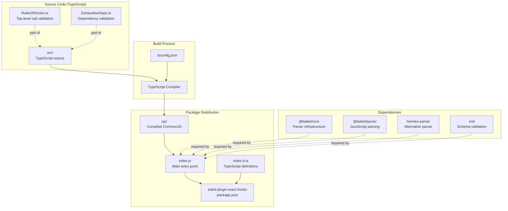
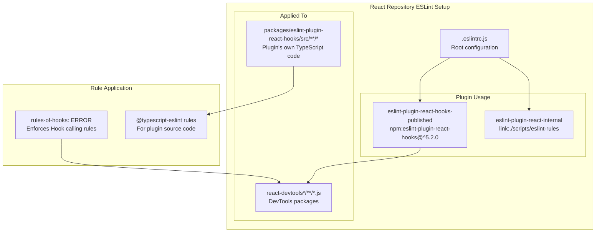
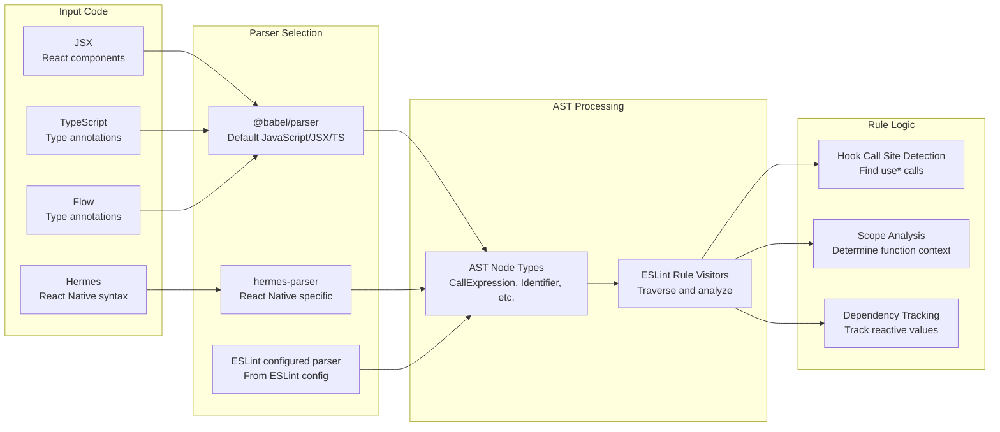
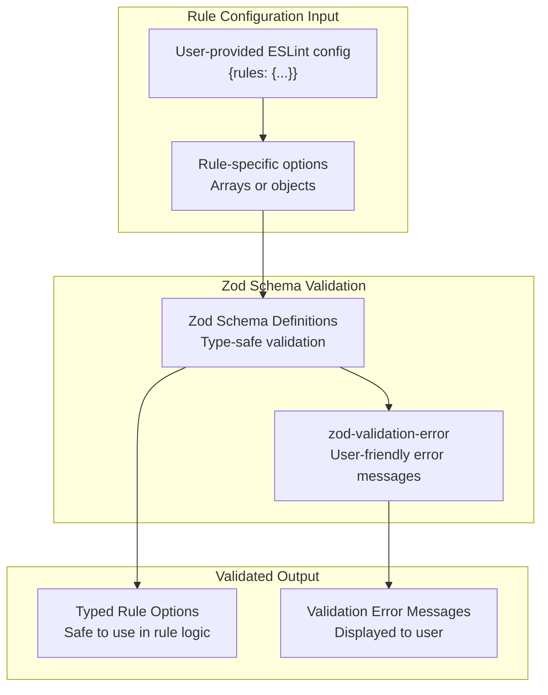
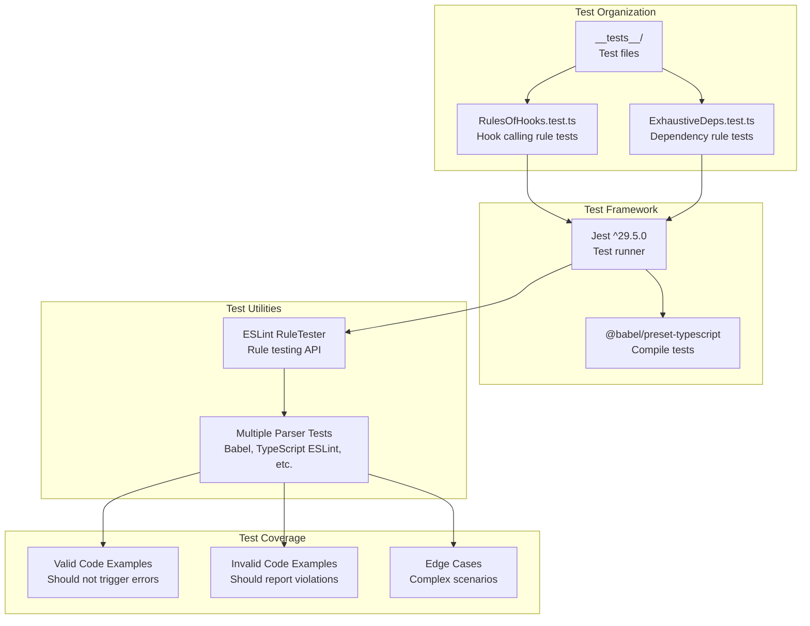
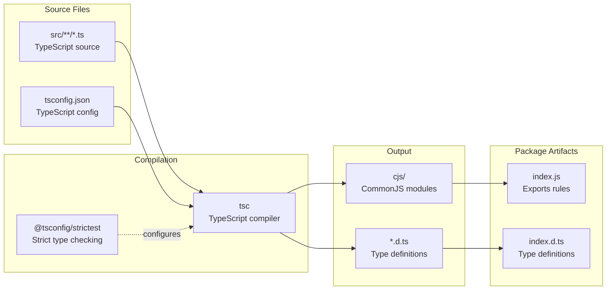
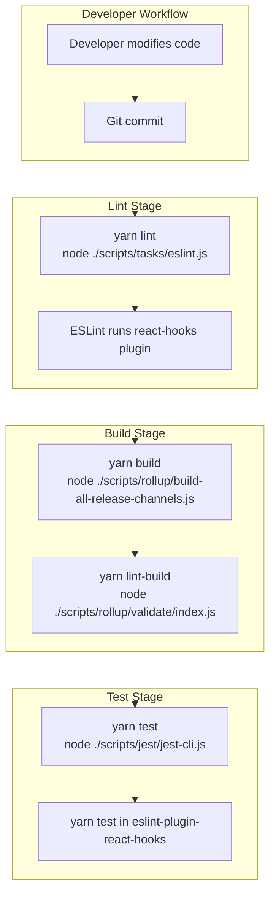
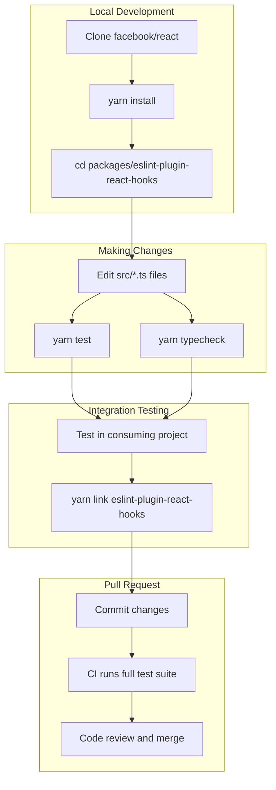

# ESLint Plugin for React Hooks

<!-- > 来源：https://deepwiki.com/facebook/react/7.3-eslint-plugin-for-react-hooks -->

<details>
<summary>相关源文件</summary>

以下文件用于生成此 wiki 页面：

- [.eslintrc.js](.eslintrc.js)
- [package.json](package.json)
- [packages/eslint-plugin-react-hooks/package.json](packages/eslint-plugin-react-hooks/package.json)
- [packages/jest-react/package.json](packages/jest-react/package.json)
- [packages/react-art/package.json](packages/react-art/package.json)
- [packages/react-dom/package.json](packages/react-dom/package.json)
- [packages/react-is/package.json](packages/react-is/package.json)
- [packages/react-native-renderer/package.json](packages/react-native-renderer/package.json)
- [packages/react-noop-renderer/package.json](packages/react-noop-renderer/package.json)
- [packages/react-reconciler/package.json](packages/react-reconciler/package.json)
- [packages/react-test-renderer/package.json](packages/react-test-renderer/package.json)
- [packages/react/package.json](packages/react/package.json)
- [packages/scheduler/package.json](packages/scheduler/package.json)
- [packages/shared/ReactVersion.js](packages/shared/ReactVersion.js)
- [scripts/flow/config/flowconfig](scripts/flow/config/flowconfig)
- [scripts/flow/createFlowConfigs.js](scripts/flow/createFlowConfigs.js)
- [scripts/flow/environment.js](scripts/flow/environment.js)
- [scripts/rollup/validate/eslintrc.cjs.js](scripts/rollup/validate/eslintrc.cjs.js)
- [scripts/rollup/validate/eslintrc.cjs2015.js](scripts/rollup/validate/eslintrc.cjs2015.js)
- [scripts/rollup/validate/eslintrc.esm.js](scripts/rollup/validate/eslintrc.esm.js)
- [scripts/rollup/validate/eslintrc.fb.js](scripts/rollup/validate/eslintrc.fb.js)
- [scripts/rollup/validate/eslintrc.rn.js](scripts/rollup/validate/eslintrc.rn.js)
- [yarn.lock](yarn.lock)

</details>


ESLint Plugin for React Hooks（`eslint-plugin-react-hooks`）是一个静态分析工具，用于强制执行 Rules of Hooks——这些约束规定了 React Hooks 的调用方式，以确保行为正确。该 plugin 提供两条主要规则：`rules-of-hooks` 验证 Hooks 仅在 React 函数组件或自定义 Hooks 的顶层调用，`exhaustive-deps` 确保 effect 依赖项正确声明。

关于 Hooks 系统实现本身的信息，请参阅 [React Hooks System](#4.3)。关于 DevTools 与 Hooks 检查的集成，请参阅 [React DevTools Architecture](#7.1)。

---

## 目的与范围

该 plugin 对 JavaScript 和 TypeScript 代码进行静态分析，在运行时之前检测违反 Hook 调用约定的情况。它可防止常见错误，例如条件 Hook 调用、循环内的 Hook 调用或缺少 effect 依赖项，这些错误会导致 bug 或不一致行为。该 plugin 直接集成到 ESLint 工作流中，并支持现代 JavaScript 语法，包括 JSX、TypeScript 和 Flow。

**来源：** [packages/eslint-plugin-react-hooks/package.json:1-68]()

---

## 包结构与分发



**分发格式**

该 plugin 以 npm 包形式分发，结构如下：

| 文件/目录 | 用途 |
|----------------|---------|
| `index.js` | 导出 plugin 配置的主入口点 |
| `index.d.ts` | 用于 IDE 集成的 TypeScript 类型定义 |
| `cjs/` | 从 TypeScript 源码编译的 CommonJS 模块 |
| `package.json` | 包元数据，对 ESLint 3.x-9.x 的 peer dependency |

**来源：** [packages/eslint-plugin-react-hooks/package.json:1-68]()

---

## 与 React 仓库的集成

React 仓库以两种不同方式使用该 plugin：



**DevTools 的配置覆盖**

该 plugin 明确为 DevTools 代码启用，以捕获 Hook 违规：

```javascript
// .eslintrc.js lines 522-528
{
  files: ['packages/react-devtools-*/**/*.js'],
  excludedFiles: '**/__tests__/**/*.js',
  plugins: ['eslint-plugin-react-hooks-published'],
  rules: {
    'react-hooks-published/rules-of-hooks': ERROR,
  },
}
```

**Plugin 源码的配置覆盖**

该 plugin 自身的 TypeScript 源码有专门的 lint 配置：

```javascript
// .eslintrc.js lines 530-548
{
  files: ['packages/eslint-plugin-react-hooks/src/**/*'],
  extends: ['plugin:@typescript-eslint/recommended'],
  parser: '@typescript-eslint/parser',
  plugins: ['@typescript-eslint', 'eslint-plugin'],
  rules: {
    '@typescript-eslint/no-explicit-any': OFF,
    '@typescript-eslint/no-non-null-assertion': OFF,
    '@typescript-eslint/array-type': [ERROR, {default: 'generic'}],
    'es/no-optional-chaining': OFF,
    'eslint-plugin/prefer-object-rule': ERROR,
    'eslint-plugin/require-meta-fixable': [ERROR, {catchNoFixerButFixableProperty: true}],
    'eslint-plugin/require-meta-has-suggestions': ERROR,
  },
}
```

**来源：** [.eslintrc.js:522-548](), [package.json:74-75]()

---

## 核心规则

该 plugin 导出两条主要的 ESLint 规则：

### rules-of-hooks

验证 Hooks 遵循正确操作所需的调用约定：

| 验证项 | 描述 |
|------------|-------------|
| **仅顶层调用** | Hooks 不得在循环、条件或嵌套函数内调用 |
| **仅 React 函数** | Hooks 必须从 React 函数组件或自定义 Hooks 中调用 |
| **顺序一致** | Hook 调用的顺序必须在多次渲染间保持一致 |

### exhaustive-deps

确保 effect Hooks 正确声明所有依赖项：

| 验证项 | 描述 |
|------------|-------------|
| **完整依赖列表** | effect 内部使用的所有响应式值必须在 dependency array 中 |
| **无多余依赖** | 警告不需要在数组中的依赖项 |
| **稳定引用** | 检测依赖项是否在每次渲染时都发生变化 |

**来源：** [packages/eslint-plugin-react-hooks/package.json:1-68]()

---

## Parser 支持与 AST 分析

该 plugin 支持多种 JavaScript parser，以处理不同的语法变体：



**Parser 依赖**

| 包 | 版本 | 用途 |
|---------|---------|---------|
| `@babel/core` | ^7.24.4 | 核心转换基础设施 |
| `@babel/parser` | ^7.24.4 | JavaScript/JSX/TypeScript 解析 |
| `hermes-parser` | ^0.25.1 | React Native 和 Flow 语法支持 |

**来源：** [packages/eslint-plugin-react-hooks/package.json:41-46]()

---

## 使用 Zod 进行 Schema 验证

该 plugin 使用 Zod 验证 rule 选项和配置：



**验证优势**

- **类型安全**：rule 选项在使用前通过 schema 验证
- **清晰的错误消息**：`zod-validation-error` 将 Zod 错误转换为可读的 ESLint 诊断信息
- **运行时保证**：无效配置会及早捕获，并提供有用的反馈

**来源：** [packages/eslint-plugin-react-hooks/package.json:45-46]()

---

## 测试基础设施



**测试执行**

该 plugin 的测试套件通过以下命令运行：

```bash
# packages/eslint-plugin-react-hooks/package.json lines 23-26
"scripts": {
  "build:compiler": "cd ../../compiler && yarn workspace babel-plugin-react-compiler build",
  "test": "yarn build:compiler && jest",
  "typecheck": "tsc --noEmit"
}
```

**Parser 兼容性测试**

测试套件验证跨多种 ESLint parser 配置的行为：

| Parser | 包 | 用例 |
|--------|---------|----------|
| `babel-eslint` | ^10.0.3 | 旧版 Babel parser |
| `@typescript-eslint/parser` v2-v5 | 多个版本 | 跨 ESLint 版本的 TypeScript 文件 |
| `eslint` v7-v9 | 多个版本 | 与不同 ESLint 版本的兼容性 |

**来源：** [packages/eslint-plugin-react-hooks/package.json:23-26,48-66]()

---

## 构建与编译过程



**TypeScript 配置**

该 plugin 使用严格的 TypeScript 设置以确保类型安全：

```typescript
// Configured via @tsconfig/strictest
{
  "extends": "@tsconfig/strictest",
  // Strict null checks, no implicit any, etc.
}
```

**编译命令**

```bash
# TypeScript check without emitting
"typecheck": "tsc --noEmit"
```

**来源：** [packages/eslint-plugin-react-hooks/package.json:26,52]()

---

## 版本兼容性与 Peer Dependencies

| 组件 | 版本范围 | 说明 |
|-----------|---------------|-------|
| **Node.js** | >=18 | 最低要求版本 |
| **ESLint** | ^3.0.0 \|\| ^4.0.0 \|\| ^5.0.0 \|\| ^6.0.0 \|\| ^7.0.0 \|\| ^8.0.0-0 \|\| ^9.0.0 | 支持所有现代 ESLint 版本 |
| **Zod** | ^3.25.0 \|\| ^4.0.0 | Schema 验证库 |
| **React**（间接） | 任何支持 Hooks 的版本（16.8+） | Plugin 适用于任何支持 Hooks 的 React 版本 |

**来源：** [packages/eslint-plugin-react-hooks/package.json:34-46]()

---

## 与构建系统的集成

该 plugin 集成到 React 仓库的构建和验证工作流中：



**Lint 命令**

仓库的 lint 脚本将 ESLint（包括 Hooks plugin）应用于所有源文件：

```bash
# package.json line 134
"lint": "node ./scripts/tasks/eslint.js"
```

**来源：** [package.json:134-135](), [.eslintrc.js:522-548]()

---

## 不同环境中的规则执行

该 plugin 的规则根据代码环境选择性应用：

| 环境 | 规则应用 | 配置 |
|-------------|------------------|---------------|
| **DevTools 包** | 强制执行 `rules-of-hooks` | [.eslintrc.js:522-528]() |
| **核心 React 包** | 配置中未明确启用 | 期望开发者了解 Hook 规则 |
| **测试文件** | 从 `react-devtools-*` 执行中排除 | `excludedFiles: '**/__tests__/**/*.js'` |
| **Plugin 源码** | 仅 TypeScript ESLint 规则 | [.eslintrc.js:530-548]() |

**选择性应用的理由**

- DevTools 大量使用 Hooks，从自动化检查中受益
- 核心 React 包由熟悉 Hook 规则的开发者编写
- 测试文件可能有意违反 Hook 规则以测试错误处理

**来源：** [.eslintrc.js:522-548]()

---

## 与 React Compiler 的关系

该 plugin 的测试基础设施与 React Compiler（Babel plugin）协调：

```bash
# packages/eslint-plugin-react-hooks/package.json lines 24-25
"build:compiler": "cd ../../compiler && yarn workspace babel-plugin-react-compiler build",
"test": "yarn build:compiler && jest"
```

**Compiler 集成**

React Compiler 自动记忆化组件和值，可能影响 dependency array 的指定方式。ESLint plugin 的测试确保与编译器转换代码的兼容性。

**来源：** [packages/eslint-plugin-react-hooks/package.json:24-25]()

---

## 开发与贡献工作流



**本地开发命令**

```bash
# Run the plugin's test suite
cd packages/eslint-plugin-react-hooks
yarn test

# Type check without building
yarn typecheck

# Test against consuming application
yarn link
cd /path/to/your/app
yarn link eslint-plugin-react-hooks
```

**来源：** [packages/eslint-plugin-react-hooks/package.json:23-26]()

---

## 关键文件及其作用

| 文件路径 | 用途 |
|-----------|---------|
| `packages/eslint-plugin-react-hooks/package.json` | 包元数据、依赖项和脚本 |
| `packages/eslint-plugin-react-hooks/index.js` | 导出规则的主入口点 |
| `packages/eslint-plugin-react-hooks/index.d.ts` | TypeScript 类型定义 |
| `packages/eslint-plugin-react-hooks/src/RulesOfHooks.ts` | `rules-of-hooks` 规则的实现 |
| `packages/eslint-plugin-react-hooks/src/ExhaustiveDeps.ts` | `exhaustive-deps` 规则的实现 |
| `packages/eslint-plugin-react-hooks/tsconfig.json` | TypeScript 编译器配置 |
| `.eslintrc.js`（根目录） | 配置 React 仓库中的 plugin 使用 |

**来源：** [packages/eslint-plugin-react-hooks/package.json:1-68](), [.eslintrc.js:522-548]()
